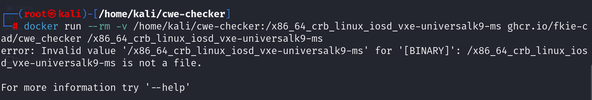

cwe_checker 是一套用于检测常见错误类别（例如空指针取消引用和缓冲区溢出）的检查工具。这些错误类别正式称为常见弱点枚举(CWE)。这些检查基于各种分析技术，从简单的启发式方法到基于抽象解释的数据流分析。其主要目标是帮助分析师快速找到潜在的易受攻击的代码路径。

#### 检测列表：检测原理
+ [CWE-78](https://cwe.mitre.org/data/definitions/78.html)：操作系统命令注入（目前在标准运行中已禁用）
+ [CWE-119](https://cwe.mitre.org/data/definitions/119.html)(缓冲区溢出)及其变体[CWE-125](https://cwe.mitre.org/data/definitions/125.html)(越界读取)和[CWE-787](https://cwe.mitre.org/data/definitions/787.html)(越界写入)
+ [CWE-134](https://cwe.mitre.org/data/definitions/134.html)：使用外部控制格式字符串
+ [CWE-190](https://cwe.mitre.org/data/definitions/190.html)：整数溢出或回绕
+ [CWE-215](https://cwe.mitre.org/data/definitions/215.html)：对调试信息的暴露信息进行检查。
+ [CWE-243](https://cwe.mitre.org/data/definitions/243.html)：在不改变工作目录的情况下创建 chroot Jail
+ [CWE-332](https://cwe.mitre.org/data/definitions/332.html)：PRNG 中的熵不足
+ [CWE-337](https://cwe.mitre.org/data/definitions/337.html)：伪随机数生成器（PRNG）中的可预测种子
+ [CWE-367](https://cwe.mitre.org/data/definitions/367.html)：检查时间使用时间 (TOCTOU) 竞争条件
+ [CWE-416](https://cwe.mitre.org/data/definitions/416.html)：释放后使用及其变体[CWE-415](https://cwe.mitre.org/data/definitions/415.html)：双重释放
+ [CWE-426](https://cwe.mitre.org/data/definitions/426.html)：不受信任的搜索路径
+ [CWE-467](https://cwe.mitre.org/data/definitions/467.html)：在指针类型上使用sizeof()
+ [CWE-476](https://cwe.mitre.org/data/definitions/476.html)：空指针取消引用
+ [CWE-560](https://cwe.mitre.org/data/definitions/560.html)：umask() 与 chmod-style 参数的使用
+ [CWE-676](https://cwe.mitre.org/data/definitions/676.html)：潜在危险功能的使用
+ [CWE-782](https://cwe.mitre.org/data/definitions/782.html)：暴露 IOCTL，访问控制不足
+ [CWE-789](https://cwe.mitre.org/data/definitions/789.html)：大小值过大的内存分配

#### 使用：
1.拉取docker镜像

docker pull ghcr.io/fkie-cad/cwe_checker:latest

2.运行

docker run --rm -v /PATH/TO/BINARY:/input ghcr.io/fkie-cad/cwe_checker /input

#### 特点：
+ 设置起来非常简单，只需构建 Docker 容器！
+ 它分析了几种 CPU 架构的 ELF 二进制文件，包括 x86、ARM、MIPS 和 PPC
+ 由于其基于插件的架构，它具有可扩展性
+ 它是可配置的，例如将分析应用于新的 API
+ 查看 Ghidra 中注释的结果
+ cwe_checker 可以作为插件集成到FACT中

docker运行工具后，

<!-- 这是一张图片，ocr 内容为：-(ROOT@KALI)-[/HOME/KALI/CWE-CHECKER] 54_CRB_LINUX_IOSD_VXE-UNIVERSALK9-MS GHCR.IO/FKIE-C #DOCKER RUN --RM -V /HOME/KALI/CWE-CHECKER://X86_64_C AD/CWE_CHECKER /X86_64_CRB_LINUX_IOSD_VXE-UNIVERSALK9-MS ERTOR; INVALID VALUE /K80,64-CRB,LINUX,JOSD.LINUX IOS P VXE-UNIVERSALK9-MS IS NOT A FILE. FOR MORE INFORMATION TRY '--HELP' -->

说被测elf不是一个文件

如何绕过文件的检测策略直接启用检测

