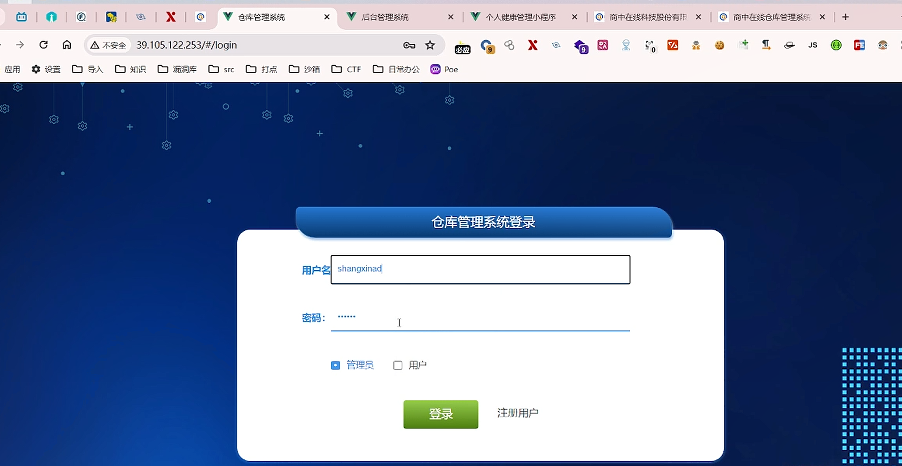
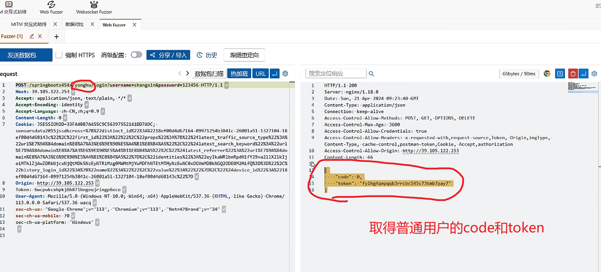
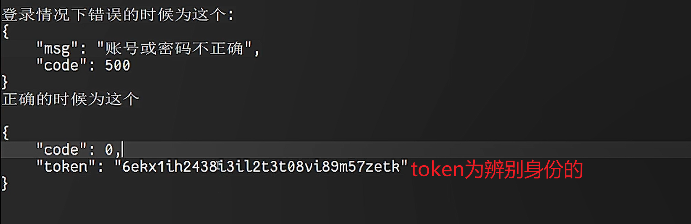
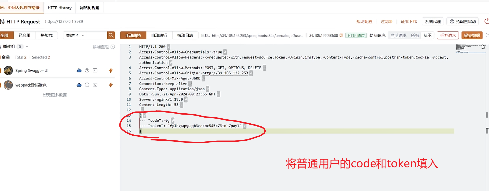
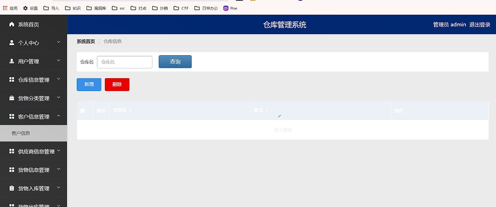

在登录注册页面

<!-- 这是一张图片，ocr 内容为：X 泪 个人健康管理小程序 仓库管理系统 商中在线仓库仓理系统 商中在线科技股份有限 X 后台管理系统 X X 公 C 39.105.122.253/#/LOGIN A 不安全 JS 必应 日常力公 应用 导入 泥洞库 知识 打点 沙纺 CTF POE $RC 京 京 京 文 京 仓库管理系统登录 用户名 SHANGXINAD 密码: O用户 管理员 登录 注册用户 -->

将普通用户的返回包拦截一下，取得数据包中正确的code和token

将admin账户（密码错误）的请求包拦截，输入普通用户的code和token

可能存在越权

1.登录页面，输入正确的账号和密码

<!-- 这是一张图片，ocr 内容为：图 4 交互动持 WEB FUZZER WEBSOCKET FUZZER X MITM 交互式动持 X 数据对比 FUZZER-[1] 2 X C历史 眼随市定向 分享/导入 发送数据包 高级配于 强制 HTTPS 口 搜索定位响应 国 数据包扫描 令 URL 热加载 66BYTES/90MS EQUEST OGIN?USERNAME'SHANGXIN&PASSWORDU123456-HTTP/1.1 POST/SPRINGBOOTS454X/YONGHU/ HTTP/1.1.200 HOST:39.105.122.253 SERVER:NGINX/1.18.0 ACCEPT:APPLICATION/JSON,TEXT/PLAIN,* DATE:SUN,21.APR.2024-09:23:40-GNT ACCEPT-ENCODING:-IDENTITY CONTENT-TYPE:-APPLICATION/JSON ACCEPT-LANGUAGE:-ZH-CN,ZH;Q-0.9 CONNECTION:-KEEP-ALIVE CONTENT-LENGTH:0 ACCESS-CONTRO1-ALLOW-NETHODS:POST,GET,OPTIONS,-DELETE COOKLE;  5SESSIONID-33FA4B87A455C9C563975521410D7A9C; ACCESS-CONTROL-MAX-AGE:3600 SENSORSDATO2015555DKCROS5-578ZZ33841-260851-1377383AZ7384168A467164-9997125463841-26081851-1377184-18 ACCESS-CONTROL-ALLOW-CREDENTIALS:TRUE EF00D1068143C8232322FIPST,IDS2283283ASZ28232322PROPS3AFFIC ACCRSS-CONTROL-ALLON-HEADERS:-X-REQUESTED-WITH,REQUEST-SOURCE,TAKEN,-ORIGIN,IMGTYPE, 22URLKE7S9A5394DOMALAKE8KA7KA3SE689EX9EX98XES5A4K31868384848458228241ATEST,SEARCH.KEYH.KEYMORD8223A8L CONTENT-TYPE,CACHE-CONTROL,POSTMAN-TOKEN,COOKIE,ACCEPT,AUTHORIZATION 10 ACCESS-CONTROL-ALLOW-0RIGIN:HTTP://39.105.122.253 MAINKEBKA7KNJKE689EX90XE5KNN8DJXEBXPARA5%2870K22870KZIDENTITITIESZZZ830GZZEYZEYZEYZEYZSVAZIIXZIKZIKT 11 CONTENT-LENGTH:-66 22RISTORY-LOFFIN.JDX2233AZ7B2273300X223A7723AZ2222232272V3JU0%7233AX23723723732232320 EF88DAD57164-09971251B3841C-26801A51-1327184-18EF08D4D68143CX2287D "CODE":-0. ORIGIN:HTTP://39.105.122.253 860 "TOKEN":"FYLHG4QMPQAB3RRCBC545C73TMB7PAY7" TOKEN:6WCPOOKCXHPKJ6B871BNGEUJRLNGPBECO USER-ABPNT: NOZILLA/5.8-(HINDOUS ISKG:G::G;:MINGA; X64)-APPLESIENKST/537.36 (KJTML,:JIKG:60CKOMBOMB 113.0.0.0.SAFARI/537.36-UACQ SEC-CH-USI "GOOGLE-CHROME"JV:"113","CHROMIUM";"13","113","NOTMA?BRAND";V:"-24" SEC-CH-UA-MOBILE:20 SEC-CH-UA-PLATFORM:"WINDOWS" 取得普通用户的CODE和TOKEN -->

数据包内容：

<!-- 这是一张图片，ocr 内容为：登录情况下错误的时候为这个: "MSG":"账号或密码不正确", CODE'500 正确的时候为这个 'CODE'" "TOKEN为辨别身份的 TOKEN 6EKX1IH2438I3IL2T3T08VI89M57ZETK -->

2.拦截admin账户的登录数据包

<!-- 这是一张图片，ocr 内容为：M:中间人代理与劫持 网站树视角 HTTP HISTORY 持 HTTP REQUEST 必配五启动 证书下线 过涉器 规则配五 系统代理 HTTPS://127.0.1:8989 已启用 被动目志 自动放行 目标::MND59.105.105.12253FSPPINGBERSAXRUSERSPRRUSUSUSERES&R    39.12222222222222222222253.80 D 关维字 提交数据 全部 热加载 从不 手动劫持 关育请求 所有 当前请求 播件组 添加至组  HTTP/1.1.200 ACCESS-CONTROL-ALLOW-CREDENTIALS:TRUE 全选 TOTAL  2 SELECTED 2 AUTHORIZATION ACCESS-CONTRO1-ALLOW-METHODS:-POST,GET,OPTIONS,DELETE 4 R SPRING SWAGGER-UI ACCESS-CONTRO1-ALLOW-0RIGIN:HTTP://39.105.122.253 5 ACCESS-CONTROL-MAX-AGE:3600 9 CONNECTION:KEEP-ALIVE WEBPACK涂码泄支 CONTENT-TYPE:-APPLICATION/JSON DATE:SUN,21-APR.2024-09:23:55-GMT 怡无见多数据 SERVER:NGINX/1.18.0 CONTENT-LENGTH:58 14 "TOKEN"I,FYLHG4QMPQQB3RRCBC545C73TMB7PAY7" 15 将普通用户的CODE和TOKEN填入 -->

3.admin成功登录

<!-- 这是一张图片，ocr 内容为：口沙箱 口 打点 口知识 导入 D CTF 日常办公 而洞库 设置 POE 仓库管理系统 系统首页 管理员ADMIN 退出登录 仓库信息 系统首页 个人中心 查询 用户管理 仓车名 仓车名 仓库信息管理 删除 新增 货物分类管理 备注 操作 仓库名 索引 客户信息管理 客户信息 供应商信息管理 货物信息管理 货物入库管理 -->

