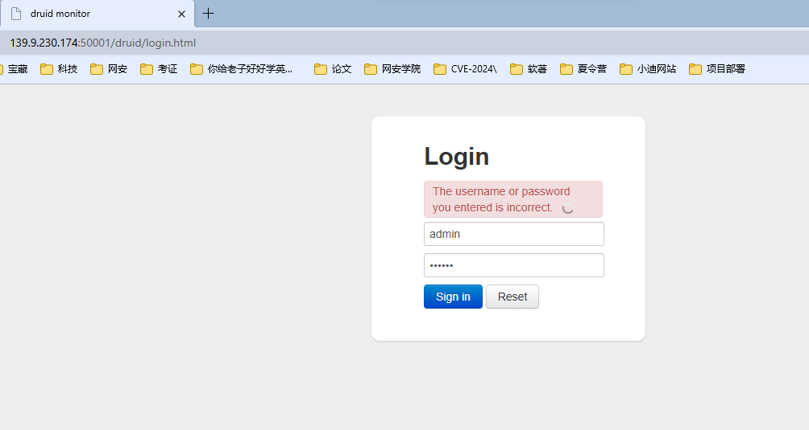
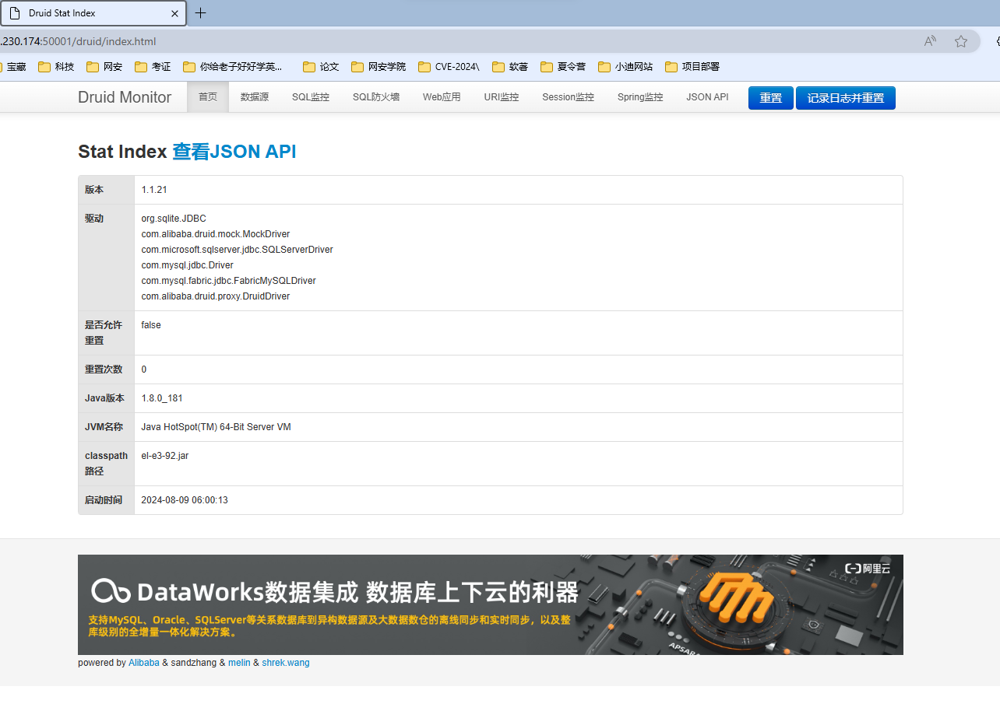
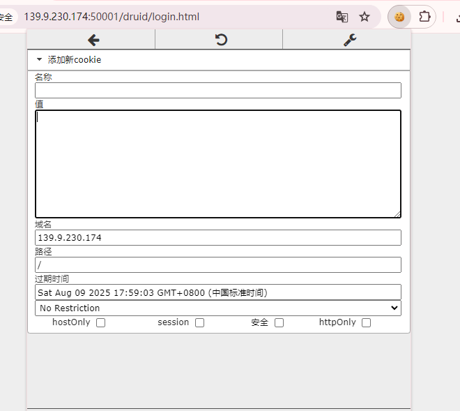
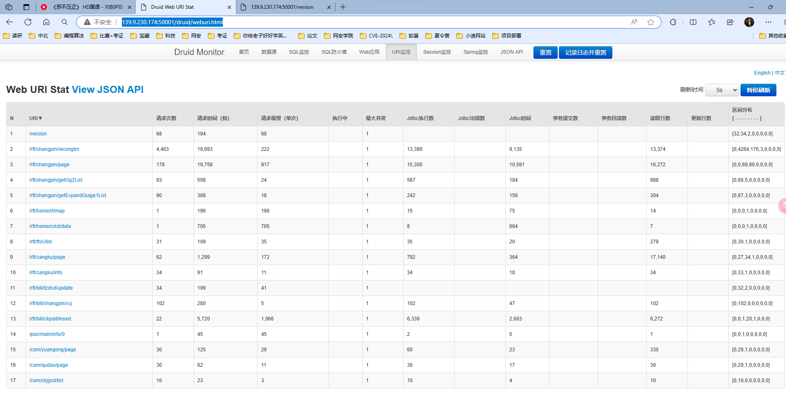

**Druid monitor**是一个非常好用的**数据库连接池** 有**URL Session Spring监控**

常见用户:admin ruoyi druid

常见密码:123456 12345 ruoyi admin druid admin123 admin888

常见路径(可构造未授权拼接尝试):（可以用burp进行路径拼接直接爆破）

/druid/index.html

/druid/login.html

/prod-api/druid/login.html

/prod-api/druid/index.html

/dev-api/druid/login.html

/dev-api/druid/index.html

/api/druid/login.html

/api/druid/index.html

/admin/druid/login.html

/admin-api/druid/login.html

低版本默认shiro默认key:kPH+bIxk5D2deziIxcaaaA==

[http://139.9.230.174:50001/druid/login.html](http://139.9.230.174:50001/druid/login.html)

[http://221.194.122.149:5555/druid/login.html](http://221.194.122.149:5555/druid/login.html)

session：[DC2AD5E360C566D36FC06D16A0981A03](http://139.9.230.174:50001/druid/websession-detail.html?sessionId=DC2AD5E360C566D36FC06D16A0981A03)

进行密码猜测

<!-- 这是一张图片，ocr 内容为：DRUID MONITOR X 139.9.230.174:50001/DRUID/LOGIN.HTML 科技 考证 夏令营 软著 你给老子好学英.... 论文 网安学院 CVE-2024\ 网安 项目部署 宝藏 小迪网站 LOGIN THE USERNAME OR PASSWORD YOU ENTERED IS INCORRECT. ADMIN SIGN IN RESET -->

<!-- 这是一张图片，ocr 内容为：DRUID STAT INDEX .230.174:50001/DRUID/INDEX.HTML 网安 考证 小迪网站 CVE-2024\ 网安学院 项目部署 你给老子好学英... 夏令营 软著 宝藏 论文 科技 DRUID MONITOR 首页 URI监控 重置 数据源 SESSION监控 记录日志并重置 SQL监控 WEB应用 SPRING监控 JSON API SQL防火墙 查看JSONAPI STAT LNDEX 查 版本 1.1.21 驱动 ORG.SQLITE.JDBC COM.ALIBABA.DRUID.MOCK.MOCKDRIVER COM.MICROSOFT.SQLSERVER,JDBC.SQLSERVERDRIVER COM.MYSGL.JDBC.DRIVER COM.MYSQL.FABRIC.JDBC.FABRICMYSQLDRIVER COM.ALIBABA.DRUID.PROXY.DRUIDDRIVER 是否允许 FALSE 重置 重置次数 1.8.0_181 JAVA版本 JAVA HOTSPOT(TM) 64-BIT SERVER VM JVM名称 CLASSPATH EL-E3-92.JAR 路径 启动时间 2024-08-09 06:00:13 山 DATAWORKS数据集成数据库上下云的利器 支持MY5QL,ORACLE,SQLSER等关系数据库到异构数据源及大数据数仓的高线同步和实时同步,以及整 库级别的全增量一体化解决方案. POWERED BY ALIBABA&SANDZHANG&MELIN&SHREK.WANG -->

**发现url监控，session监控，spring监控**

**1.session使用：**

burp抓包，修改为正确的session和url

可返回200 （无需登录）

在网站中，url输入http://139.9.230.174:50001/druid/websession.html

<!-- 这是一张图片，ocr 内容为：国众 139.9.230.174:50001/DRUID/LOGIN.HTML 安全 G 添加新COOKIE 名称 域名 139.9.230.174 路径 过期时间 SAT AUG 09 2025 17:59:03 GMT+0800(中国标准时间) NO RESTRICTION HTTPONLY 安全 HOSTONLY SESSION -->

可免登录直接访问网站

2.URL监控

<!-- 这是一张图片，ocr 内容为：HO国讲:1080P家 (那不压正) 十 139.9.230.174:50001/VERSION 包公中一 不安全 AR   139.9.230.174:50001/DRUID/WEBURI.HTM 你涂老子好学英 论文 项目部等 其他收 夏令营 比卖+考证 小迪网站 读研 网安学院 口 网安 考证 CVE-2024) 门室家 中北 口科技 数据漂 西灾 DRUID MONITOR 记录日志并重置 SQL监控 SQL防火墙 JSON API WEB应用 WEB URI STAT VIEW JSON API 刷新时间 有信刷新 区问分布 执行中 半分因染效 请求品假(单次) JDBC执行数 请求时间(利) JDBC时间 最大并发 事务提交数 请求次数 读取行数 JDBC出错数 更新行数 [32,34,2.0.0.0.0.0] 68 194 68 222 13.374 9.135 19,693 4.453 13.390 [0.4284.175,3.0,0.0] 917 178 16.272 00089890000 15,300 10.591 24 HT/SHANGPINIQETGG2LIST 93 587 886 18 09 304 156 242 368 [0.87.3.0.0.0.0] HISHANGPINIGETEXPANDGUIGE1LIST 14 15 196 196 [0.0.0.1.0.0.0.0] 7 705 705 664 31 35 20 279 35 [0.30,1.0.0.0.0] 109 172 62 17.140 792 1,299 34 11 34 91 34 HT/CANGKU/INFO 18 (0.33.1.0.0.0.0] 34 41 109 (0.32.2.0.0.0.0) 47 5 102 102 102 280 [0.102.0.0.0,0,0,0] 5.720 22 6.272 6.33G 1,066 2.603 [0.0.1.20,1.0.0] 1 45 2 [0.0.1.0.0.0.0] OR 60 OEC 125 [0.29.1.0.0.0.0] 30 30 OC 92 10 3 10 10 23 -->

**url中有example/a.action;example/a.do这俩后缀的，**

可以打Struts2漏洞

命令执行最终getshell

