**Swagger 是一个开源工具集，提供了一整套工具，帮助开发者设计、文档化、测试和生成 RESTful API。**

**Swagger ****的主要作用**

+ **API ****描述**：Swagger 使用 OpenAPI 规范来描述 API 的结构，包括端点、HTTP 方法、请求参数、响应格式、身份验证等。
+ **自动化文档生成**：Swagger 能够自动生成详细的 API 文档，这些文档通常是交互式的，方便开发者和用户查看和测试 API。
+ **代码生成**：通过 Swagger，可以自动生成客户端 SDK 和服务器端代码，减少手动编写的工作量，并确保代码和文档的一致性。
+ **API ****测试和调试**：使用 Swagger UI，开发者可以直接在浏览器中测试 API，发送请求并查看响应，极大地简化了调试过程。

**师傅笔记：**

（1）：

/v1/api-docs

/v2/api-docs

/v3/api-docs

Swagger 接口文档(开发工具)

[https://api.topsnap.cn/swagger/index.html](https://api.topsnap.cn/swagger/index.html)

[https://testapp.zgjsdl.com/](https://testapp.zgjsdl.com/)

[https://imes.ljerp.net:80/index.html](https://imes.ljerp.net:80/index.html)

[https://ncpsy.ynufe.net/swagger/index.html](https://ncpsy.ynufe.net/swagger/index.html)

（2）：

[http://119.3.9.51:8084/swagger/ui/index](http://119.3.9.51:8084/swagger/ui/index)

[http://101.132.24.13:8000/swagger/ui/index](http://101.132.24.13:8000/swagger/ui/index)

/api/getlistinfo/1

result:id:2131232

2131232

**个人笔记：**

**案例一：**

工具：swagger-hack：自动化爬取并自动测试所有[swagger接口](https://so.csdn.net/so/search?q=swagger%E6%8E%A5%E5%8F%A3&spm=1001.2101.3001.7020)

本机：tools/swagger

测试站点：

<!-- 这是一张图片，ocr 内容为：鹰图平台 SWAGGER UI TTQP.OLDACE.CN/API/VALUES/GET/99 SWAGGER UI 冷 CA 小 脑A介 11 茶 HTTPS//API.TOPSNAP.CN/SWAGGER/INDEX.HTML SWAGGER. SELECT A DEFINITION AUDIT APLV1 SAPONURTYSMARTBEAR OAS3 V1 AUDIT API /SWAGGER/V1/SWAGGERJSON AUDIT AUDIT-WEBSITE MIT LICENSE AUTHORIZE ACCOUNT /API/SERVICES/APP/ACCOUNT/ISTENANTAVAILABLE POST /API/SERVICES/APP/ACCOUNT/REGISTER POST ACCTNOTE /API/SERVICES/APP/ACCTNOTE/GETFSNOTES2DATA GET /API/SERVICES/APP/ACCTNOTE/GETFSNOTES2SHEETDATA GET /API/SERVICES/APP/ACCTNOTE/GETPUBLISHSTATUS GET -->
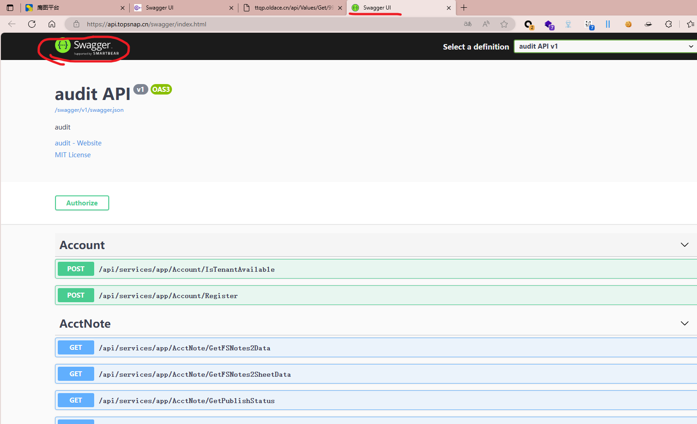

<!-- 这是一张图片，ocr 内容为：/WEBSOFT\TOOLS(SWAGGER-HACK>PYTHON PY -U HTTPS://API.TOPSNAP.CN/SWAGGER/V1/SWAGGER.JSON" /SWAGGER. ISON SWAGGER-HACK2.0.PY 2024-08-13 18:06:53.652 | INFO BANMER:43 MAIN BY JAYUS PYTHON SWAGGER.PY -H [+]输入WR1为API文档地址,开始构造请求发包 2024-08-13 18:06:54.981 DEBUG _MP_MAIN CHECK:66 2024-08-13 18:06:54.983 SUCCESS LRUN:280 - WORKING ON HTTPS://API.TOPSNAP.CN/SWA88ER/V1/SWAGGER.JSON MP_MAIN 2024-08-13 18:06:55.815 INFO ::80-DOCS:135-[+] HTTPS://API.TOPSNAP.CN/SWAGGER/YL/ SWAGGER.JSON HAS 333 PATH _MP_MAIN 2024-08-13 18:06:55.816 DEBUG HT/ISTENANTAVAILABLE MP_MAIN ACCOWNT/1 TEST ON HTTPS://API.TOPSNAP.CN/SWAGGER/V1/V1/SWAGGER.JSON -) /API/SERVICES/APP :GO_DOCS:138 2024-08-13 18:06:55.972 DEBUG EGO_DOCS:138 (VL/SWAGGER.JSON - /API/SERV HT/REGISTER /SERVICES/APP/ACCOUNT/RE MP_MAIN TEST ON HTTPS://API.TOPSNAP.CN/SWAGGER/V1/S 2024-08-13 18:06:56.121 ACCTNOTE/GETFSNOTES2DATA DEBUG SWAGGER.JSON - / AP :GO_DOCS:138 /API/SERVICES/APP/A TEST ON HTTPS: MP_MAIN /API.TOPSNAP.CN/SWAGGER/VL 2024-08-13 18:06:56.296 DEBUG ./SERVICES/APP/ACCTNOTE/GETFSNOTES2SHEETDATA :GO DOCS:138 /SWAGGER.JSON -/API/SE /API.TOPSNAP.CN/SWAGGER/ TEST ON HTTPS: MP MAIN 2024-08-13 18:06:56.475 DEBUG :GO_DOCS:138 ERVICES/APP/ACCTNOTE/GETPUBLISHSTATUS /API.TOPSNAP.CN/SWAGGER/ MP_MAIN TEST ON HTTPS: SWAGGER.. 2024-08-13 18:06:56.631 DEBUG :GO_DOCS:138 E/GETFSITEMNOTES2TOTALDATA TEST ON HTTPS: MP_MAIN /SERVICES/APP/ACCTNOTE/GET /AP1.TOPSNAP.CN/SWAGGER/V 2024-08-13 18:06:56.914 DEBUG :GO_DOCS:138 MP MAIN SERVICES/APP/ACCTNOTE/GETFSNOTES2LLODAL /API.TOPSNAP.CN/SWAGGER/VL/ 2024-08-13 18:06:57.316 DEBUG MP_MAIN /SERVICES/APP/ACCTHOTE/CREATEFSNOTE /API.TOPSNAP.CN/SWAGGER/I :GO_DOCS:138 TEST ON HTTPS: 2024-08-13 18:06:57.557 DEBUG /SERVICES/APP/ADDRESSBOOK/GETADDRESSBOOKLIST MP_MAIN :GO_DOCS:138 /API.TOPSNAP.CN/SWAGGER// 2024-08-13 18:06:57.716 DEBUG SERVICES/APP/ADDRESSBOOK/GETPERSONAGEPROJECTLIST MP MAIN ON HTTPS: /AP1.TOPSNAP.CN/SWAGGER/ :GO_DOCS:138 TEST 2024-08-13 18:06:57.870 DEBUG I/SERVICES/APP/AUDITADJUST/GETAUDITADJUSTLIST :GO_DOCS:138 MP MA IN. /API.TOPSNAP.CN/SWA6GER/T ON HTTPS 2024-08-13 18:06:58.038 I/SERVICES/APP/AUDITADJUST/GETAUDI TADJUSTLISTBYID DEBUG MP_MAIN :GO_DOCS:138 /API.TOPSNAP.CN/SWAGGER/V] ON HTTPS: 2024-08-13 18:06:58.194 DEBUG MP_MAIN 1/SERVICES/APP/AUDITADJUST/GETAUDITADJUSTLISTBYADJTYPE TEST ON HTTPS: GO_DOCS:138 /API.TOPSNAP.CN/SWAGGER/V1/ DEBUG 2024-08-13 18:06:58.357 GO DOCS:138 /API.TOPSNAP.CN/SWAGGER/V1/SWAGG MP_MAIN TEST ON HTTPS:  /SERVICES/APP/AUDITADJUST/GETAUDITADJUSTLISTBVREPORTID 2024-08-13 18:06:58.527 DEBUG MP_MAIN S/SERVICES/APP/AUDITADJUST/UPDATERSADJUSTHEAD /API.TOPSNAP.CN/SWAGGER/V1/SWAGGE TEST ON HTTPS: :GO_DOCS:138 'FLANI TONENAN CN/CWAGGERFUL/CWAGSER NERTIG 2024-08-13 18-58 683 S/EERVICES/ANN/AIIDITADINS+/TNDATARSADIUSTHEAABUTA 'GN DNCE.138 TEST ON HTTNS'/J MN MA I N -->
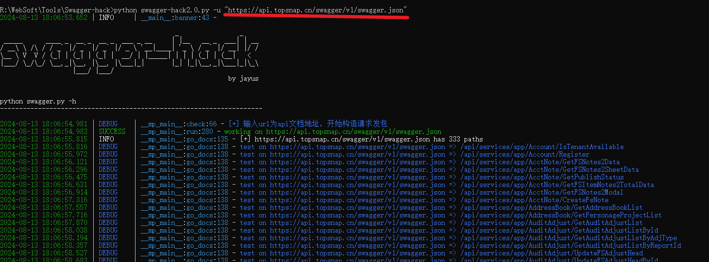

<!-- 这是一张图片，ocr 内容为：此电脑>STUDY(R:) 在SWAGGER-HACK中搜索 SWAGGER-HACK TOOLS WEBSOFT 代 查看 排序 类型 修改日期 名称 大小 文件夹 2024/8/1318:06 IDEA 文件夹 IMAGES 2024/8/1317:46 魔改版BY狐狸 文本文档 FILE.LOG 5KB 2024/8/13 19:09 MD文件 1 KB 2024/8/13 17:46 README.MD 2KB 2024/8/13 17:46 MD文件 README1.0MD 2024/8/13 19:08 186 KB EXCEL.CSV SWAQQER.CSV PYTHON 源文件 9KB 2024/8/13 17:46 SWAGGER-HACK.PY 14KB SWAGGER-HACK2.0.PY PYTHON源文件 2024/8/13 17:50 脚本运行完生成CSV格式的文件 -->
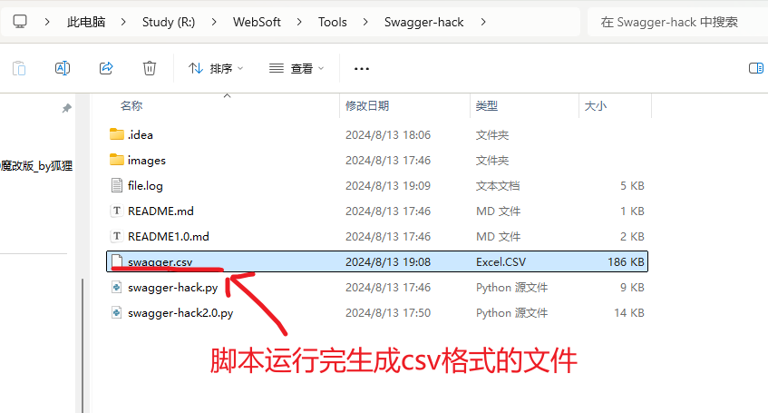

<!-- 这是一张图片，ocr 内容为：1334 METHOD 200-RESULT'SU /EPI/HZ/SANDEMAILFROMOUTBOX /API/HZ/SANDEMAILFROMOUTBOX O ['SSUIR [SUCCOSS TAL3E; INEE33GS "COULD A PART OF THS OF THS PATH D:NDATABASALIGARIGOOOOOOOOOOOOOO HTTPS://AP I TENANTID 星亮宝竞竞 200('RE /API/HZ/FIIOUTTOBOK  SUD[  SUDIT SUCSS TIVS TIESS IMESEREPS TARDETURIT  SUD HTTPS://AP /API/HZ/FILEOUTTOBOX 11.TENANTID 200[[RO /APUHZ/ROCOIVOEMAILTOINBOX /APL/HZ/ROCOLVOEMAIFTOINBOX HTTPS//APL     NSUIT SUXCOSS;TALSS:TMOZZAGE; 5 200元 HTTPS//APL /APWHZ/FILOTOINBOX 1 TONANTID: 200 -RESULF-NULL-TORGETUN'' SUCCESS TRUE,TRUE,ERROR INULL,UNAUTHORIZARREQUESR FCLEBP TRUE) HTTPSERVIEETSEPRRUBRCTIONTOUREMTONTORINFORMATIONS 34111.G HTTPS://API /EPI/SERVICES/EPP/PUB/GATAUDITHEATBETE 200[]]]]][]-[APPLIC3TION'[VERJION[;7SOD;78LS-302-302-302+-302+-09-097I8 302316-0800;73OT'ISEJJ HTTPS//API 0元 /API/SERVICES/APP/SESSION/GETCURRENTLOGININFORMATIONS GE 8 /API/TOKENAUTH/GETLSCODE2SESCION HTTPS//API API/TOKENAUTH/GETLSCODE2SESSION 21JS TYPE 200 (LESUIL-')-LARGATUNIZEST JALL SUSUS IRUS IRROR;NULL,UNAUTHONIZEDREST JAL5G, ABP IRUS) 9 /APVTOKONAUTH/GOTEXTEMALAUTHENTICATIONPROVIDERS HTTPS//APL /API/TOKENAUTH/GATE/TORNALAUTHENTIONPROVIDIALARG 206 O立 200 GOT 10/API/SORVICOS/APP/USOR/GOTROLOS HTTOS//APL 0元 11/EPI/SERVICES/APP/USER/GATALL 200 HTTPS://APL 4 I'KEYWORE GAT TEP:/SERVICES/APP/USOR/GETALL 12 / 200 /API/SERVICAS/APP/WWWGROUP/DELETEWXGROUPLIST DELETE /EPI/SARVIOES/OPP/WHGROUP/DELETEW.GROUPLIST HTTPS//API 13/A [RSSUIT :TARGE武UN;NUIL,,SUOCSS TRUS,TRUE) HTTPS://AP GAT /APL/SENVICES/APP/WXGROUP/GETUCERINFO /AP/SENVIOES/APP/WHGROUP/GETUBERLNFO -EPOC. CRESTETIM '2021- 05T10:3443 7.6012. "DELFLAG' 'STRING PIADOP.. /API/SERVICSS/APP/CONFIGURATION/CHENGSUITHEME /EPI/SERVIGSS/EPP/CONFIGURATICN/CHANGEUITHEME FULINAME HTTPS://API POST "STRING 1ULIPATHC STRING 6ME. STRING ISVIRTUAL' .NAME STRING 十 SWAGGER -->
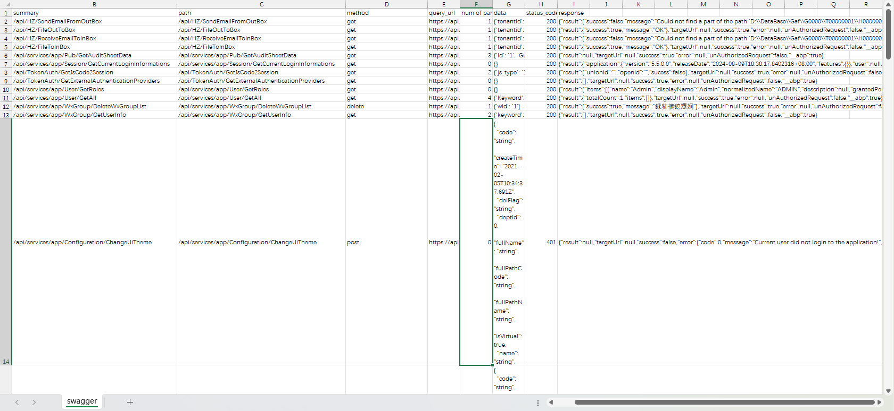

**存在未授权****   ****敏感信息泄露等**

<!-- 这是一张图片，ocr 内容为：FA 110 NTEDPERMISSIONS::'),'ID'-SIL" " " ' SUCCESS'  SUCCESS';SRUE" SUCHOR'   - ANAUTHORIZEAREQUEST , ABP"  B H N M SUMMARY PATH METHOD QUERY_URL NUM OF PARAMS DATA STATUS.COD RESPONSE 123456789011133 GET 200 CRESULT:T SUCCESS FALSE,MESSAGE "COULD NOT FIND A PART OF THE PATH D.VIDAT /API/HZ/SENDEMAILFROMOUTBOX /API/HZ/SENDEMAILFROMOUTBOX HTTPS//API.TOPSNAP CN/API// [TENANTID /API/HZ/FILEOUTTOBOX 200(RESULR'SUCCESS :TRUE,MESSAGE". OK),TARGETUN''NULL , SUCCESS"N HTTPS//ANITONSNAN CN/ANI/ /API/HZ/FILEOUTTOBOX [TENANTID GET /API/HZ/RECEIVEEMAILTOLNBOX 200 FRESULT::COUCCESS"FALSE,MESSAGE "COULD NOT FIND A PART OF THE PATH D:WDAT /API/HZ/RECEIVEEMAILTOLNBOX TENANTID HTTOS://APITONSNAP CN/API// GET 200 FRESULT"(SUCCESS TRUE,,MESSAGE"OK),TARGETUN'NULL "SUCCESS",ERRUE,"N /API/HZ/FILETOLNBOX CTENANTID /API/HZ/FILETOLNBOX HTTPS://API.TOPSNAP CN/API/H 30 200 FRESULT"NULL,TARGETUR",NULL,SUCCESS".TRUE,"ERROR"INULL "UNAUTHORIZEDREQUEST""F LD:'1,G /API/SERVICES/APP/PUB/GETAUDITSHEETL GET /API/SERVICES/APP/PUB/GETAUDITSHEETDATA HTTPS://API.TOPSNAP.CN/API/S 中 200 TRESULT":TAPPLICATION'TVERSION:5 5 5 09T18:38:17 HTTPS//API.TOPSNAP.CN/API/S /API/SERVICES/APP/SESSION/GETCURRENTLOGININFORMATIONS/A /API/SERVICES/APP/SESSION/GETCURRENTL OET 200 -RESUT":CUNIONID:",OPENID,SUCESS:FALSE),TARGETUN"NULL "SUCCESS"TRUE"TRUE"E /API/TOKENAUTH/GETLSCODE2SESSION HTTPS://API.TOPSNAP.CN/API/1 /API/TOKENAUTH/GETISCODE2SESSION  GET 200.FRESUL".TARGETULL 'NULL,SUCCESS .TRUE,'ERROR 'NULL 'UNAUTHORIZEDREQUEST""FALS 0公 /API/TOKENAUTH/GETEXTEMALAUTHENTICATIONPROVIDERS HTTPS://API.TOPSNAP.CN/API/ /API/TOKENAUTH/GETEXTERNALAUTHENTICA GET 200.RRESULT",RITEMS"IFNAME","ADMIN","DISPLAYNAME""NORMALIZEDNAME /API/SERVICES/APP/USER/GETROLES HTTPS://ANITONSNAP CN/API/S /API/SERVICES/APP/USER/GETROLES 200 FRESULT:CTOTALCOUNT:1,TTEMS",TARGETUN'IT SUCCESS"TRUE,"ERROR:"ERROR: 4 CKEYWORD /API/SERVICES/APP/USER/GETAL HTTPS://API.TOPSNAP.CN/API/S /API/SERVICES/APP/USER/GETALL 200 FRESUT''SUCCESS:TRUE,MESSAGE"等苏楼鲸想想刻],'LARGETUI:NUL 'SUCCESS:TR /API/SERVICES/APP/WXGROUP/DELETEWXGROUPLIST [WID:'1] LAPI/SERVICES/APP/WXGROUP/DELETEWX DELETE HTTPS//API.TOPSNAP.CN/API/S 200 FRESULT:D.TARGETULL"NULL"SUCCESS'TRUE,"ERROR,NULL "UNAUTHORIZEDREQUEST"-FALS /API/SERVICES/APP/WXGROUP/GETUSERLN GET HTTPS//API.TOPSNAP.CN/API/S /API/SERVICES/APP/WXGROUP/GETUSERLNFO CKEYWORD: "CODE*: "STRING "CREATETI ME": -->
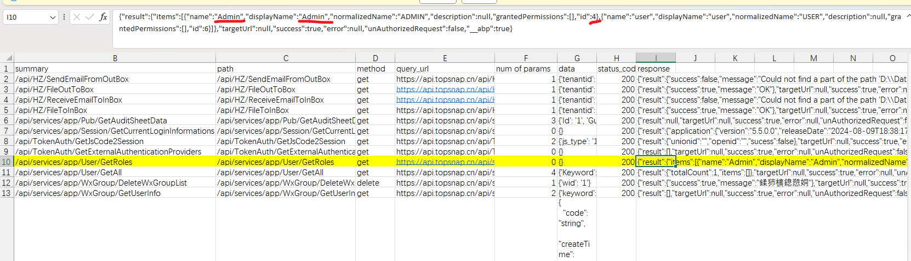

<!-- 这是一张图片，ocr 内容为：SWAGGER UI API.TOPSNA API.TOPSNAP.CN/API/SERVICES/APP/X HTTPS://API.TOPSNAP.CN/API/SERVICES/APP/USER/GETROLES?ID-4 123456789012016698822 RESULT ITEMS "NAME"ADMIN" "DISPLAYNAME": ADMIN" NORMALIZEDNAME":"ADMIN" DESCRIPTION":NULL, GRANTEDPERMISSIONS ID"4 NAME": "USER" "DISPLAYNAME"."USER" NORMALIZEDNAME":"USER". DESCRIPTION:NULL. "GRANTEDPERMISSIONS": ID"6 2022 NULL, TARGETUR1": 23 SUCCESS:TRUE, 24 ERROR":NULL, "UMAUTHORIZEDREQUEST": FALSE, 25 说 _ABP:TRUE -->
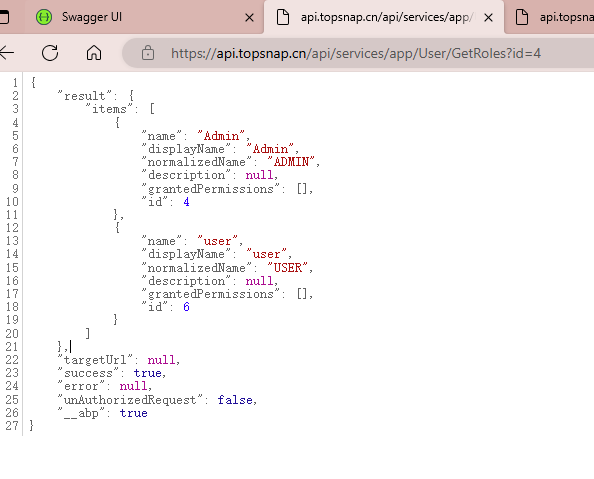

以上漏洞提交至漏洞盒子（低危）

**案例二：**

<!-- 这是一张图片，ocr 内容为：SWAGQER UI 门 119.3.9.51:8084/SWAGGER/UI/INDEX#/ 国众 C 热烈 JS S A不安全 必应 口 打点 口知识 口日常力公 导入 河南省技术船手 设置 而洞库 CTF 沙箱 EXPLORE HTTP://119.3.9.51:8084/SWAGGER/DOCS/V1 API KEY SWAGGER VQDWEBAPI BUSINESS SHONKHIDE EXPAND OPERATIONS LIST OPERATIONS /GETLOGIN 登录 GET 原料档案 /GETMATERIALSHLIST GET 包装袋列表 /GETMENULIST GET 材质档案 /GETRPITMMASHLIST GET 袋型类型 /GETRPDXMASHLIST GET 复成本方案 /GETRPYFMASHLIST GET 保存报价单对象 /SAVEPRODUCTSOLUTION POST /GETPRODUCTSOLUTION 获取到申请单列表 GET 产品参数计算 /GETCALCVAL POST /GETPRODUCTSOLUTIONINFO 获取流程单号 GET HOME SHOW/HIDE LIST OPERATIONS EXPAND OPERATIONS SWAGGER LIST ONERATIONS EXPAND OPERATIONS 0:02:46 VALUES SHOW/HIDE | LIST OPERATIONS | EXPAND OPERATIONS -->
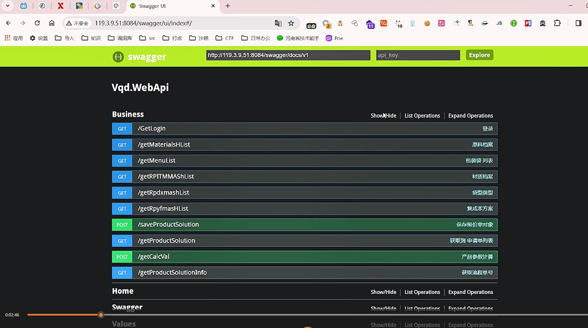

遇见输入空格就尝试sql注入

<!-- 这是一张图片，ocr 内容为：RESPONSE CONTENT TYPEAPPLICATIONJSON PARAMETERS PARAMETER TYPE DATA TYPE VALUE DESCRIPTION PARAME TER STRING QUERY USERLD Q10 STRING QUERY HIDE RESPONSE TRYIT OUTL CURL 1-X GET --HEADER 'ACCEPT:APPLICATION/JSON' 'HTTP:// /119.3.9.51:8084/GETLOGIN?USERID4&PWD1' CURL - REQUEST URL HTTP://119.3.9.51:8084/GETLOGIN?USERID-4&PWD1 RESPONSE BODY -->
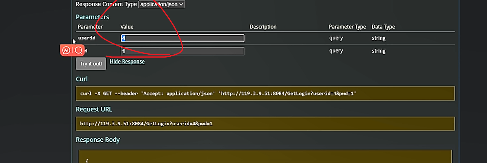

挨个观察接口，看是否有有用信息、敏感信息泄露

**案例三：**

站点：https://ttqp.oldace.cn/swagger/V2/swagger.json

[https://ttqp.oldace.cn/index.html](https://ttqp.oldace.cn/index.html)

Swagger-hack工具扫描

<!-- 这是一张图片，ocr 内容为：,0.PY -U "HTTPS://TTQP.OLDACE.EN/SWAGGER/V2/SWAGGER.JSON" R:\WEBSOFT\TOOLS\SWAGGER-HACK>PYTHON SW ON SWAGGER-HACK2.0.PY R;\WEBSOFT\TOOLS\SWAGGER-HACK)SWA88ER-HACK2,0.PY:43:43: SYNTAXHARNING: INVALID ESCAPE SEQUENC LOGGER.INFO( QUENCE '\ R:\WEBSOFT\TOOLS\S\ S\SWAGGER-HACK(SWAGGER-HACK2,0. PY:171: SYNTAXWARNING: INVALID ESCAPE SEQUENCE TMPS - RE.FINDALL("\\[[`)]*\",PATH) \WEBSOFT\TOOLS\SWAGGER-HACK\SWA8BER-HACK2.0,PY:228: SYNTAXWARNING: INVALID ESCAPE SEQUENC [[\]]*\]",PATH) TMPS - RE.FINDALL(" 2024-08-14 23:07:34.892 MAIN :BANNER:43 INFO W-EBBBAS BY JAYUS -->
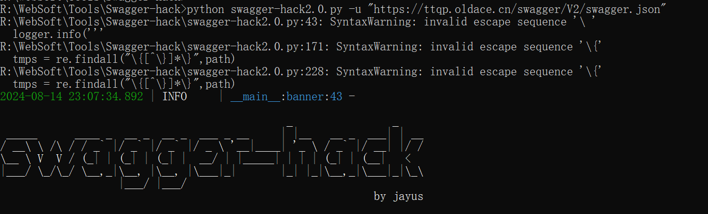

<!-- 这是一张图片，ocr 内容为：M P B N R K G 12345678 METHOD API-DOC-U SUMMARY PATH QUERY URL NUM OF PALDATA STATUS COD RESPONSE 000 HTTPS://TTQP ROUTE WITH /API/CUSTOR GET 200 HTTPS://TTQP 555 555 HTTPS://TTQP 200 HTTPS://TTQR TO REDIRECT /API/CUSTOR GET 200 [STATUS:200.SUCCESS FABE:INSG;::泰敏博涡格 派庆杯装毫合票氨纸滞Q爆管婚直婚装婚直接装备直接装备直接整婚直调整形袋,价;:MSGDER' HTTPS://TTQP HTTPS://TTQP /API/DBFI/DBFIRS GET HTTPS//TTQF 2(NAME:1' 200:"STATUS' 200.SUCCESS;FALSE,'MSG""NSG""NUIL  'MSGDEV:NUIL  'MSGDEV:N FAIL!!7 HTTPS://TTQP ://API/API/LOGIN.GET 200 1([VALUE 5F CALLBACK HTTPS://TTAR HTTPS://TTQP :/WT/API/LOGIN.GET 200 [STAJUS;ZOO;SUCCESS;TRUE,  RECH COM/APLPAY DEVELJUN 1 REDIRECTU HTTPS://TQR //APENID /API/LOGIN.GET HTTPS://TTQP 200('STATUS-500.'SUCCESS FALSE,MSQ::瑶长清洁拜牌".MSQDEV',MSQDEV',RESPONSE"NUL] HTTPS://TTQP/API/LOGIN//API/LOGIN.GET HTTPS://TTGE 1 FUSERID:'1 SGMNTUNH 200('STATUS 500"SUCCESS'FALSE,"MSQ"星峰臂儿胡其C他查拜触""RESH/WC:O) HTTPS://TTGE HTTPS://TTQP铺海综 /LOGIN/GET 1 CODE:1' 200{'STATUS':50MSGDEV"I RESPONSE":NULL]] HTTPS://TTQP HTTPS://TTQP://API/LOGIN.GET 1 FTOKEN': 200 [STATUS'ZOO:'SUCCESS'TRUE,"MSQ"ILSINR5CCIGKPXY HTTPS://TTQP HTTPS://TQP ://API/LOGI/LOGIN.GET 2'NAME:'1' 200:STATUS'200:SUCCESS'FALSEISEIMSQ":泰敏峰 滨底杯装灵红滞G素最红泽G素最狂渝G爆发红净G嫌楚培#  滨底环差泵! HTTPS://TTGE HTTPS://TTQP ://MIGRAPI/MIGRAGET 0千 200 [STAJUS 200,SUCCESS'TRUE,'MSQ:" NSQ:'NANE"'NAN 2 FF:1', KEY HTTPS://TQP  /API/PERMIGET HTTPS://TTQP 200('STATUS"200.SUCCESS'''RUE,'NSG:''''''''''''''''''''''''''''''''README"''''''''''''''''''''''''''' HTTPS://TTQP ://API/SCCOLGET 1'TYPE:17 HTTPS://TTGC 200[STATUS:200.'SUCCESS'IRUE,'NSG"''''''''''TYPE"-[[[''TYPE"'''TYPE"'''''''''''''''''''''''STAT HTTPS://TTQP ://API/SCCOLGET 1 'TYPES':'1' HTTPS://TTQP "CODE": 'STRING". 对有用信息进行利用 'CREATETI ME? "2021- 02- 05T10:34: 37.691Z'. "DELFLAG" -->
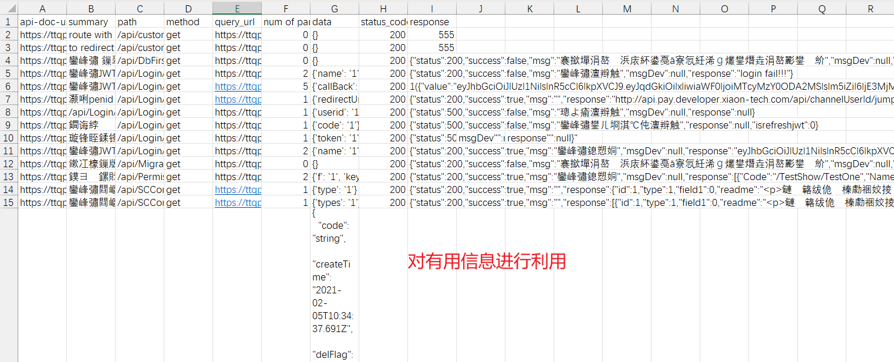

扫除站点：https://ttqp.oldace.cn/api/SCConfigs/GetSysUtils/?type=12

<!-- 这是一张图片，ocr 内容为：TTQP.OLDACE.CN/SW 鹰图平台 SWAGGER UI X TTQP.OLDACE.CN/AP TTGP.OLDACE.CN/AP TTQP.OLDACE.CN/AP X API.PAY.DEVELOPER AN 公 HTTPS://TTQP.OLDACE.CN/API/SCCONFIGS/GETSYSUTILS/?TYPE-12 S 1234567 200. STATUS 地SG: MU11 RESPONSE ISREFRESHIWT":0 TYPE的值可以任意修改 -->
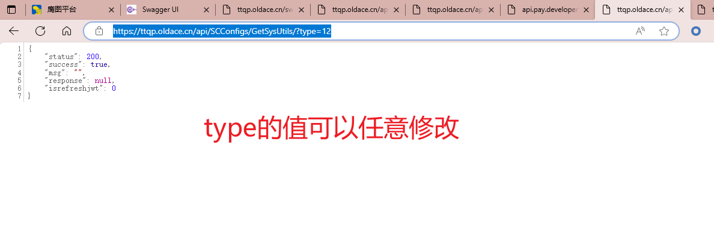

<!-- 这是一张图片，ocr 内容为：离图平台 SWAGGER UI TTQP.OLDACE.CN/AP TTQP.OLDACE.CN/AY API PAY DEVELOPE 尚A介 HTTPS//TTQP.OLDACE.CN/APIRESSLIDIN/JSONP/7CALLBACK-18SUB-18SUB-18ACK-1&EXP 1(L"VALUE":EYJHBGEIOSJIUZI TIUZIMIISINR5CCIGIKPRNCJ9. EYJQDGKIOIIXIANFOIJOIJOIMTCYHLZYOODEBLISLN53ZLI6IJE3 站点的COOKIE信息 -->
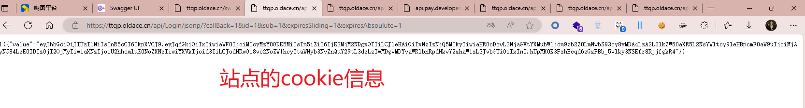

**案例四：**

网址：http://181.119.123.109:5000/info/index.html

<!-- 这是一张图片，ocr 内容为：搜索结果BODY:'SWAGQER'-网维 X 181.119.123.109:5000/SWAGGER/V SWAGGER用户界面 客 南A介 181.119.123.109:5000/INFO/INDEX.HTML 不安全 SWAGGER. SELECT A DEFINITION API SI.GE.CRE. 2.5.1609.204 OAS3 API SI.GE.CRE. /SWAGGER/V2/SWAGGERJSON LIBRERIA DE COMUNICACIONES DE SI.GE.CRE. 联系APXCONSULTORES ACCESO DE USUARIO /{EMPRESA}/账户/登录 发布 /{EMPRESA}/账户/会话 发布 APLICACION COMERCIO /FEMPRESAL/COMERCIOHP/LEARDNI3D/FANI3D/ [COMERCIOL/FVENTAL/FVENTAL/FANTICIPOL/TIPOCLIENTE) 获取 /LEMPRESAL/COMERCIOAPP/LEERDNI3D/V2//[DNI3DL/[COMORCIO)/LVENTAL/FANTICIPO)/FTIPO)/FTIPOCLIENTE) 获取 / LEMPRESA]/COMERCIOHPP/CONSULTACOMERCIOAPP/[DNI)/FCOMERCIO//LTIPOCLIENTE] 获取 /FEMPRESAL/COMERCIOAPP/CLASIFICARCLIENTE/DNI)/ISEXO)/FCOMERCIO)/FCONCARGO) 获取 -->
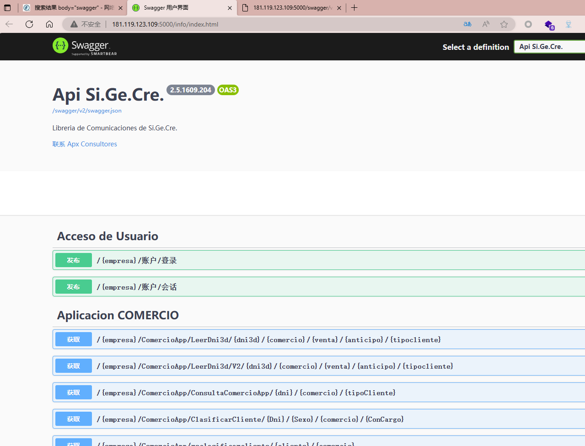

<!-- 这是一张图片，ocr 内容为：ISALIDA 参数类型不全,需要手动添加... _:GO_DOCS:224 5 00:16:50.831 ERROR 024-08-15 ( MP_MAIN 024-08-15 00:16:50.832 SALIDA L:GO DOCS:258 ERROR MP MAIN 024-08-15 00:16:50.833 DEBUG L:GO_DOCS:138 _MP_MAIN DAJ 参数类型不全,需要手动添加... 024-08-15 00:16:50.833 ERROR :GO DOCS:224 024-08-15 00:16:50.834 SALIDA' ERROR :GO_DOCS:258 024-08-15 00:16:50.835 :GO_DOCS:138 TEST ON HTTP://181.119.123.109:5000/SWAGGER/V2/SWAGGER.JSOO0/SO DEBUG /APPBOSTON/CREDITOSAPPBOSTON/{DNI]/{SEXO] LEMPRESAJ/APPBO LP MAIN 024-08-15 00:16:54.822 :GO DOCS:138 DEBUG LEMPRESAL/APPBOSTON/CUOTASAPPBOSTON/IDNI)/ (SEXOL TEST ON HTTP://181.119.123.109:5000/SWARKER/V2/9 024-08-15 00:16:59.837 HTTPCONNECTIONPOOL(HOST-'127.0.0.1' ERROR (READ TIMEOUT-5) DOCS:258 1, PORT-12569) 024-08-15 00:16:59.839 MP MAIN_:GO_DOCS:138 DEBUG APPBOSTON/CUPOSAPPBOSTON/{DNI]/[SEXO] TEST ON HTTP://181.119.123.109:5000/ SWAGGER/V2/ 024-08-15 00:17:00.790 -MP-MAIN-:80_DOES:138 - TEST ON HTTP://181.119.123.109:5000/SWA8GER/V2/ DEBUG /SERVICIOEXTERNO/MOTIVOAUTORIZACION//ICODIGO] 024-08-15 00:17:03.916 DEBUG TEST ON HTTP:// /181.119.123.109:5000/ /SERVICIOBXTERNO/CONSULTACLIENTEBO/[DNI]/[SEXO] MP MAIN :GO DOCS:138 SWAGGER/Y2/ 024 08-15 00:17:04.958 DEBUG MP MAIN :GO DOCS:138 /SERVICIOEXTERNO/CONSULTADNISEXO/[DNI)/[SEXO] 181.119.123.109:5000/SWAGGER/V2/8 TEST ON HTTP:/ 024-08-15 00:17:06.806 DEBUG MP MAIN :GO DOCS:138 - - TEST ON HTTP://181.119.123.109:5000/ LCMPRESA/SERVICIOEXTERNO/CONSULTAMOTORDECISION/LD HTTP://SEXOL/DOB SWAGGER/V2/ 024-08-15 00:17:08.361 DEBUG [EMPRESA]/SERVICIOEXTERNO/CONSULTAAUTORIZACIONBO/ /181.119.123.109:5000/SWAGGER/V2/ TEST ON HTTP: GO DOCS:138 MP MAIN IDNIF/ISEXOL 024-08-15 00:17:09.264 DEBUG /181.119.123.109:5000/ 138 /SERVICIOEXTERNO/AUTORIZACIONBO MPMAIN TEST ON HTTP:/ :GO DOCS:13 SWA88ER/ 024-08-15 00:17:10.076 DEBUG /ESTUDIOS/OBTENERVIGENTES/LESTUDIO//IPAGINAL/ICANTIDADPO ://181.119.123.109:5000 :GO_DOCS:138  TEST ON HTTP:// SWAGGER MP_MAIN 1024-08-15 00:17:11.810 DEBUG PRESA)/ESTUDIOS/BUSCARCLIENTE/ICREDITOL/IDNIF/INOMBRE// IRECIBO :GO DOCS:138 MP MAIN TEST ON HTTP://181.119.123.109:5000/ SWARGER/ 024-08-15 00:17:14.511 DEBUG TEST ON HTTP://181.119.123.109:5000/SWAGGER/V2 :GO DOCS:138 EMPRESA//ESTUDIOS/CONSULTACLIENTE/ MIMERO/ IESTUDIONSH 024-08-15 00:17:15,411 DEBUG MPMAIN 109:5000/SWAGGER/V2/ TEST ON HTTP://181.119.123. LEMPRESA]/SERVICLOBXTERNO/CONSULTACLIENTECO 109:5000/SWAGGCR/V2/ DEBUG 024-08-15 00:17:16.766 38 TEST ON HTTP://181.119.123.109 LCMPRCSAL/SCRVICIOEXTCRNO/GRABARPRCVENTACO MP MAIN :GO DOCI 024-08-15 00:17:17.603 TEST ON HTTP://181.119.123.109:5000/SWAGGER/V2/S DEBUG MP MAIN :GO DOCS:138 138 EMPRESA//SERV1CIOBXTERNO/TIPOSCLIENTESVALIDOS TEST ON HTTP://181.119.123.109:5000/SWAGGER/V2/S 024-08-15 00:17:20.726 DEBUG :GO DOCS:13 /CLIENTES/ S/LNUNEROF MP MAIN EMPRESA SWAGGER/V2/ 024-08-15 00:17:22.621 - TEST ON HTTP://181.119.123.109:5000/ DEBUG GO_DOCS:138 CLIENTES MPMAIN 024-08-15 00:17:23.429 //181.119.123.109:5000/ SWAGGER/V2/SWAGGER DEBUG /COMERCIO/{CODIGO] :GO DOCS:138 TEST ON HTTP; EMPRESA ] 024-08-15 00:17:26.187 /181.119.123.109:5000/ /SWAGGER/Y2/SWAGGER. DEBUG COMERCIOS GO DOCS:138 TEST ON HTTP: EMPRESA) MPMAIN 181.119.123.109:5000/SWAGGER/V2/S /CMRMULTI/LCODIGO 024-08-15 00:17:30.076 DEBUG :GO_DOCS:138 TEST ON HTTP: MP_MAIN SWAEGEI /181.119.123.109:5000/ 024-08-15 00:17:30.997 DEBUG SWAGGER/V2/SWAGGER. /TIPOPUNI TEST ON HTTP 38 //181.119.123.109:5000/ 024-08-15 00:17:31.789 DEBUG 138 TEST ON HTTP TIPOPLAN SWAGGER/V2/SWAGG CMPRCSA] /181.119.123.109:5000/ 024-08-15 00:17:32.612 TEST ON HTTP: SWAGGER/Y2/ DEBUG TIPOCLIE GO_DOCS:138 MP MAIN WAGGER/Y2/ 024 08-15 00:17:34.433 /181.119.123.109:5000/ DEBUG /TIPCLCMR/LCOMERCION TEST ON HTTP: GO DOCS:138 EMPRESAL /181.119.123.109:5000/ 024-08-15 00:17:35.230 DEBUG SWAGGER/V2/ /PLANES/IPLAN TEST ON HTTP: MP MAIN :GO_DOCS:138 181.119.123.109:5000/ SWAGGER/V2/ 024-08-15 00;17:36.544 DEBUG /CUPOS/ICOMERCION TEST ON HTTP: _MP_MAIN :GO_DOCS:138 SWAGGER. EMPRESA) /181.119.123.109:5000/ 024-08-15 00;17:38.279 DEBUG WAGGER/V2/ /DESCPUNI MPMAIN :GO DOCS:138 TEST ON HTTP:/ JSON 024-08-15 00:17:39.779 /181.119.123.109:5000/ DEBUG SWAGGER/V2/SWAGGOR. MP_MAIN_:GO_DOCS:138 /NEGOCIO/LISTPARAMETRO TEST ON HTTP:// 024-08-15 00:17:42.834 /181.119.123.109:5000/ DEBUG SWAGGER/V2/  MP MAIN :GO DOCS:138 . TEST ON HTTP: NEGOCIO/PARAMETRO/ LPARAMETRO]/[COMERCIO] EMPRESAJ /181.119.123.109:5000/ 024-08-15 00:17:44.304 DEBUG SWAGGER/V2/SWAGGOR TEST ON HTTP:/ MP MAIN :GO DOCS:138 . /TIPOCAGE EMPRESAJ 024-08-15 00:17:46.099 DEBUG TEST ON HTTP://181.119.123.109:5000/SWAGGER/V2/S LEMPRESAL/PLAVSCOM/.CO MP_MAIN_:GO_DOCS:138 LCOMERCION SWAGGET /181.119.123.109:5000/SWAGGER/V2/A WP MAIN :GO DOCS:138 024-08-15 00:17:48.939 DEBUG HTTP://DERCEROS/[NUMERO] TEST ON HTTP:/ SWAGGER 181.119.123.109:5000/ DEBUG 024-08-15 00:17:50.243  MP MAIN :GO DOCS:138 . SWAGGCR/V2/SWAGGCR TEST ON HTTP: /USUARIOS 181.119.123.109:5000/ 024-08-15 00:17:52.013 DEBUG TEST ON HTTP: LEMPRESAJ/VENDEDORES 00/SWAGGER/V2/S MP MAIN_:GO_DOCS:138 1/CONSULTAMOTOR/(DNI]/(SEXOL/{COMEREIO)/[FECHANACIMIENTO] 181.119.123.109:5000/SWAGGER/V2/S 024-08-15 00:17:54.381 DEBUG MP MAIN :GO DOCS:138 TEST ON HTTP: /181.119.123.109:5000/SWAGGER/V2/S 024-08-15 00:17:55.683 DEBUG TOST ON HTTP: LISTACONSULTAMOTOR/IDNIL/ISEXOL MP_MAIN _:GO_DOCS:138 /SWAIG LIOS //181.119.123.109:5000/SWAGGER/V2/S 024-08-15 00:17:57.522 DEBUG TEST ON HTTP: MP_MAIN_:GO_DOCS:138 /VERCONSULTA/LARCHIVO SWAGGEI SON EMPRESAJ -->
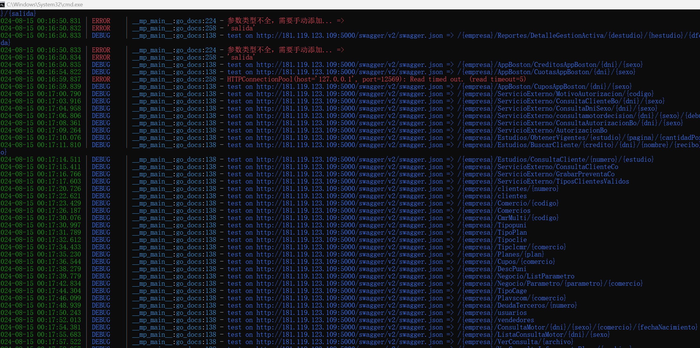

无果

