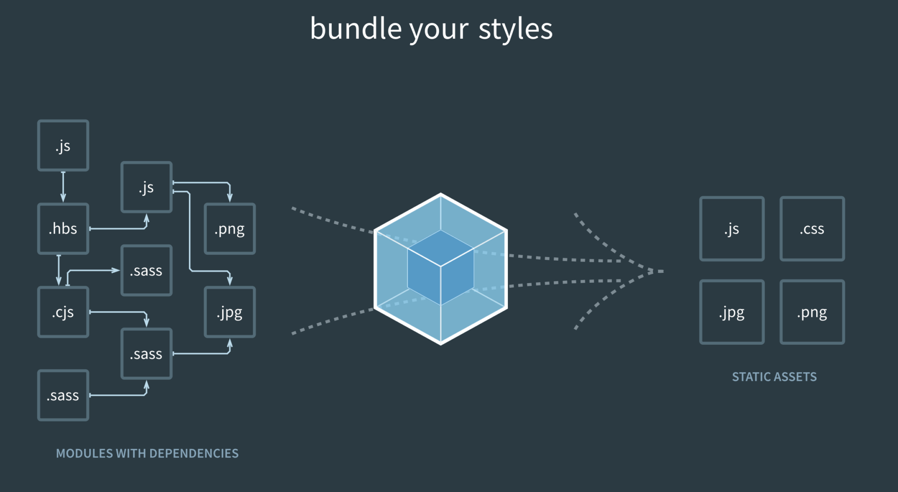
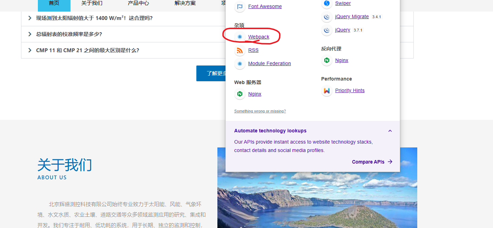
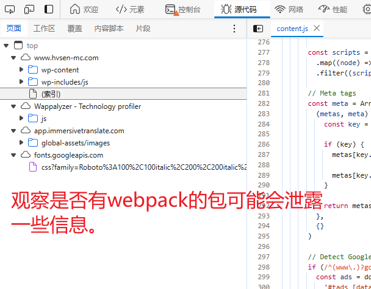
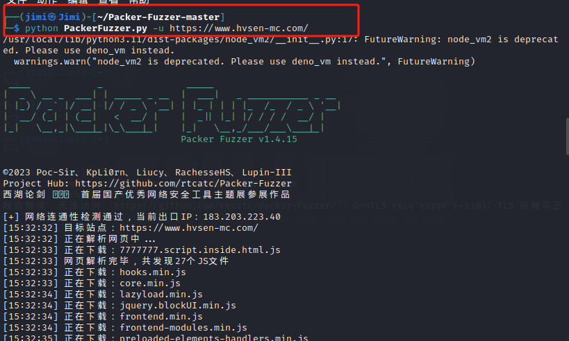
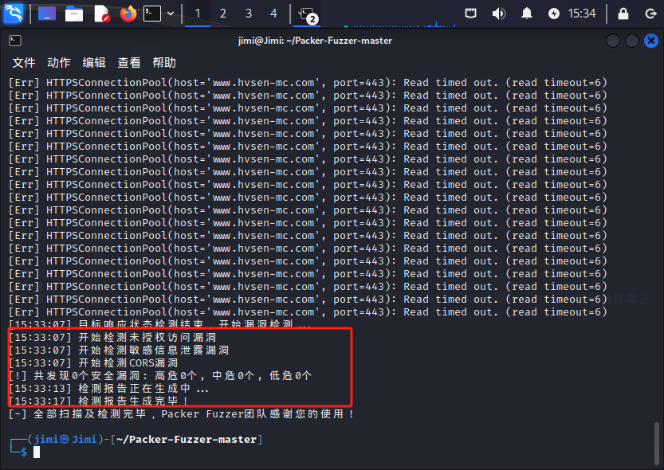
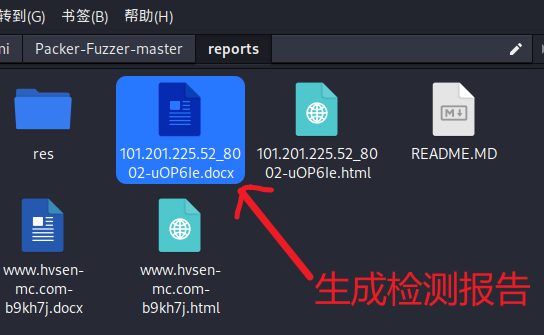
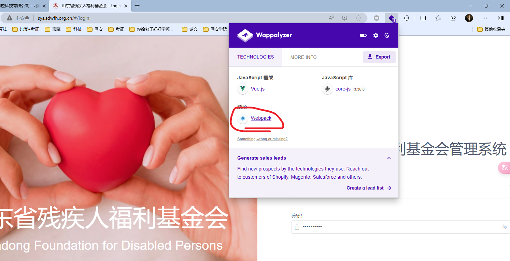
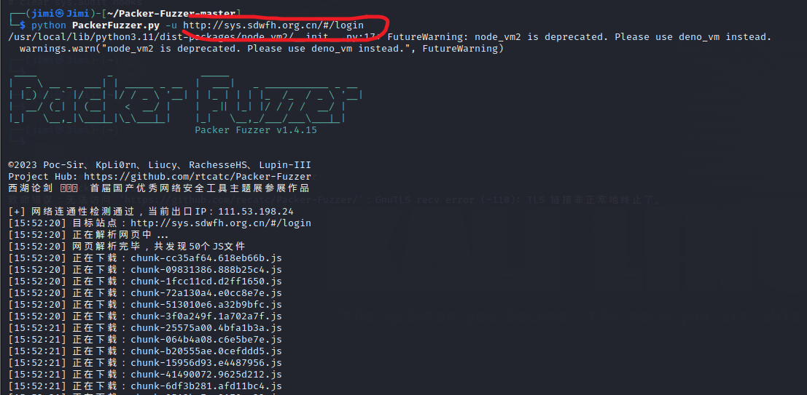
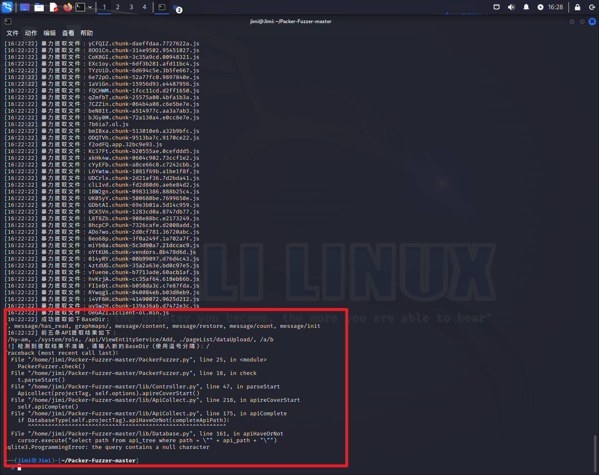

Webpack 是一个静态模块打包工具，从入口构建依赖图，打包有关的模块，最后用于展示你的内容

它将根据模块的依赖关系进行静态分析，然后将这些模块按照指定的规则生成对应的静态资源。

webpack是一个打包工具，他的宗旨是一切静态资源皆可打包。有人就会问为什么要webpack？

webpack是现代前端技术的基石，常规的开发方式，比如jquery,html,css静态网页开发已经落后了。

现在是MVVM的时代，数据驱动界面。webpack它做的事情是，分析你的项目结构，

找到JavaScript模块以及其它的一些浏览器不能直接运行的拓展语言（Scss，TypeScript等），

并将其打包为合适的格式以供浏览器使用

<!-- 这是一张图片，ocr 内容为：BUNDLE YOUR STYLES JS JS .HBS PNG CSS .SASS .CJS JPG JPG PNG .SASS STATIC ASSETS .SASS MODULES WITH DEPENDENCIES -->

**个人笔记：**

[https://www.hvsen-mc.com/](https://www.hvsen-mc.com/)

[http://sys.sdwfh.org.cn/#/login](http://sys.sdwfh.org.cn/#/login)

**工具：****Packer-Fuzzer****：（可能会捡到未授权的洞）**

Packer-Fuzzer是一款针对Webpack等前端打包工具所构造的网站进行快速、高效安全检测的扫描工具。

支持自动模糊提取对应目标站点的API以及API对应的参数内容，并支持对：<u>未授权访问、敏感信息泄露、</u><u>CORS</u><u>、</u><u>SQL</u><u>注入、水平越权、弱口令、任意文件上传</u>七大漏洞进行模糊高效的快速检测。

Kali:/home/jimi/Packer-Fuzzer-master

**实例一：**

进入网站：https://www.hvsen-mc.com/

<!-- 这是一张图片，ocr 内容为：关于我们 解决方案 产品中心 首页 SWIPER FONT AWESOME JOUERY MIGRATE 3.4.1 > 现场测到太阳辐射值大于1400W/M?!这合理吗? 杂项 JQUERY 3.7.1 总辐射表的校准频率是多少? WEBPACK 反向代理 CMP11和CMP21之间的最大区别是什么? RSS NGINX MODULE FEDERATION 了解更多 PERFORMANCE WEB服务器 PRIORITY HINTS NGINX SOMETHING WRONG OR MISSING? AUTOMATE TECHNOLOGY LOOKUPS OUR APIS PROVIDE INSTANT ACCESS TO WEBSITE TECHNOLOGY STACKS, CONTACT DETAILS AND SOCIAL MEDIA PROFILES 关于我们 COMPARE APIS ABOUT US 北京辉盛测控科技有限公司始终专业致力于太阳能,风能,气象环 境,水文水质,农业土壤,道路交通等众多领域监测应用的研究,集成和 开发.我们专注于耐用,低功耗的系统,用于长期,独立的监测和控制, -->

<!-- 这是一张图片，ocr 内容为：</>元素 小性能 欢迎 源代码 控制台 网络 夏盖 内容脚本 工作区 片段 页面 CONTENT.JS 276 TOP 277 CONST SCRIPTS WWW.HVSEN-MC.COM 278 MAP(NODE) WP-CONTENT .FILTER((SCRIP 279 280 WP-INCLUDES/IS 281 // META TAGS (索引) 282 CONST META - ARR WAPPALYZER - TECHNOLOGY PROFILER 283 (METAS,META) 284 CONST KEY APP.IMMERSIVETRANSLATE.COM 285 GLOBAL-ASSETS/IMAGES IF (KEY) F 286 FONTS.GOOGLEAPIS.COM 287 METAS [KEY 288 CSS?FAMILYROBOTO%3A100%2C100ITALIC%2C200%2C200ITALIC%2 METAS [KEY 289 290 观察是否有WEBPACK的包可能会泄露... RETURN METAS 293 一些信息. 294 295 296 297 // DETECT GOOGLE IF(//(WWW\.)?GC 298 CONST ADS DO 299 300 -->

使用工具对webpack的网站进行渗透

<!-- 这是一张图片，ocr 内容为：-(JIMI@JIMI)-[~/PACKER-FUZZER-MASTER] S PYTHON PACKERFUZZER.PY -U HTTPS://WWW.HVSEN-MC.COM/ FUTUREWARNING: NODE VM2 IS DEPRECAT /USR/LOCAL/L1B/PYTNON3.11/DIST-PACKAGES/NODE_VM2/_ 1N1T- ED. PLEASE USE DENO VM INSTEAD. WARNINGS.WARN("NODE.VMZ IS DEPRECATED. PLEASE USE USE DENO.VM INSTEAD.", FUTUREWARNING) PAREKEP FURZEP PACKER FUZZER V1.4.15 02023 POC-SIR, KPLIORN, LIUCY, RACHESSEHS, LUPIN-III PROJECT HUB: HTTPS://GITHUB.COM/RTCATC/PACKER-FUZZER 西湖论剑国0首届国产优秀网络安全工具主题展参展作品 THUB.COM/RECATC/PACKER-FUZZER/':GNUTLS RECV ERROR (-110):TLS 链接非正 [+]网络连通性检测通过,当前出口IP:183.223.40 [目标站点:HTTPS://WWW.HVSEN-MC.COM/ [15:32:32] 正在解析网页中 [15:32:32] 正在下载:77777777.SCRIPT.INSIDE.HTML.JS [15:32:33 网页解析完毕,共发现27个JS文件 [15:32:33] 正在下载:HOOKS.MIN.JS [15:32:33] 正在下载:CORE.MIN.JS [15:32:33] 正在下载:LAZYLOAD.MIN.JS [15:32:34] 正在下载:JQUERY.BLOCKUI.MIN.JS [15:32:34] 正在下载 FRONTEND.MIN.JS 15:32:34 FRONTEND-MODULES.MIN.JS 正在下载 15:32:34 正在下载 PRELOADED-ELEMENTS-HANDLERS.MIN.IS -->

<!-- 这是一张图片，ocr 内容为：15:34 JIMI@JIMI:~/PACKER-FUZZER-MASTER 查看帮助 动作编辑 文件 HTTPSCONNECTIONPOOL(HOSTS'WWW.HYSEN-MC.CON', PORT:443): READ TIMED TIMED OUT. (READ TIMEOUTSO) ERR 'WWW.HVSEN-MC.COM', PORT-443): READ TIMED OUT. (READ TIMEOUT:6) HTTPSCONNECTIONPOOL(HOST- ENT HTTPSCONNECTIONPOOL(HOST- ERR 'WWW.HVSEN-MC.COM', PORT三443): READ TIMED OUT. (READ TIMEOUT-6) 'WWW.HVSEN-MC.COM', PORT二443): READ TIMED OUT. (READ TIMEOUT-6) HTTPSCONNECTIONPOOL(HOST- LERR HTTPSCONNECTIONPOOL(HOST- ERR 'WWW.HVSEN-MC.COM', PORT-443): READ TIMED OUT. (READ TIMEOUT-6) HTTPSCONNECTIONPOOL(HOST- ERR (WWW.HVSEN-MC.COM', PORT:443): READ TIMED OUT. (READ TIMEOUT:6) HTTPSCONNECTIONPOOL(HOST- 'WWW.HVSEN-MC.COM', PORT-443): READ TIMED OUT. (READ TIMEOUT:6) ERR HTTPSCONNECTIONPOOL(HOST- 'WWW.HVSEN-MC.COM', PORT-443): READ TIMED OUT. (READ TIMEOUT-6) HTTPSCONNECTIONPOOL(HOST- 'WWW.HVSEN-MC.COM', PORT-443): READ TIMED OUT. (READ TIMEOUT-6) ERR HTTPSCONNECTIONPOOL(HOST- LERR "WW.HVSEN-MC.COM', PORT:443): READ TIMED OUT. (READ TIMEOUT:6) HTTPSCONNECTIONPOOL(HOST- 'WWW.HVSEN-MC.COM', PORT-443): READ TIMED OUT. (READ TIMEOUT:6) ERR HTTPSCONNECTIONPOOL(HOST` 'WWW.HVSEN-MC.COM', PORT-443): READ TIMED OUT. (READ TIMEOUT-6) HTTPSCONNECTIONPOOL(HOST- 'WW.HVSEN-MC.COM', PORT-443): READ TIMED OUT. (READ TIMEOUT-6) ERR (WWW.HVSEN-MC.COM', PORT:443): READ TIMED OUT. (READ TIMEOUT-6) HTTPSCONNECTIONPOOL(HOST- ERR 'WWW.HVSEN-MC.COM', PORT三443): READ TIMED OUT. (READ TIMEOUT:6) HTTPSCONNECTIONPOOL(HOST- ERR HTTPSCONNECTIONPOOL(HOST- 'WWW.HVSEN-MC.COM', PORT-443): READ TIMED OUT. (READ TIMEOUT-6) HTTPSCONNECTIONPOOL(HOST 'WWW.HVSEN-MC.COM', PORT-443): READ TIMED OUT. (READ TIMEOUT-6) LERR (HTTPSCONNECTIONPOOL(HOSTA(WNN.HVSEN-MC.COM', PORT:443): READ TINED OUT, (READ TINEOUT-O) ERR HTTPSCONNECTIONPOOL(HOST:'WWW.HVSEN-MC.COM', M', PORT-443): READ TIMED OUT. (READ TIMEOUT:6) 开始漏洞检测 目标响应状态检测结束 5:33:071 E 开始检测未授权访问漏洞 [15:33:07] 开始检测敏感信息泄露漏洞 [15:33:07] [15:33:07] 开始检测 CORS漏洞 [!]共发现0个安全漏洞:高危0个,中危0个,低危0个 [15:33:13]检测报告正在生成中 [15:33:17]检测报告生成完毕! [-]全部扫描及检测完毕,PACKERFUZZER团队感谢您的使用! (JIMI&JIMI)-[~/PACKER-FUZZER-MASTER] -->

<!-- 这是一张图片，ocr 内容为：转到(G) 帮助(H) 书签(B) PACKER-FUZZER-MASTER REPORTS 101.201.225.52_80 README.MD 101.201.225.52_80 RES 02-UOP6LE.HTML 02-UOP6LE.DOCX WWW.HVSEN WWW.HVSEN 生成检测报告 MC.COM MC.COM B9KH7I.HTML B9KH7J.DOCX -->

**实例二：**

<!-- 这是一张图片，ocr 内容为：控科技有限公司 -北京 出东省残疾人福利基金会 LOGIR 佛中企业 ARS 不安全 SYS.SDWFH.ORG.CN//LOGIN 享法 网安学院 其他收藏夹 比赛+考证 考证 宝藏 你给老子好好学英... 论文 网安 科技 WAPPALYZER TECHNOLOGIES MORE INFO EXPORT JAVASCRIPT框架 JAVASCRIPT库 VUE.JS CORE-JS 3.36.0 WEBPACK SOMETHING WRONG OR MISSING? 基金会管理系统 GENERATE SALES LEADS 中人 FIND NEW PROSPECTS BY THE TECHNOLOGLES THEY USE. REACH OUT TO CUSTOMERS OF SHOPIFY,MAGENTO,SALESFORCE AND OTHERS. CREATE A LEAD LIST 东省残疾人福利基金会 密码 母 DONG FOUNDATION FOR DISABLED PERSONS -->

<!-- 这是一张图片，ocr 内容为：(JIMIGJIMI)-[~/PACKER-FUZZEX- $ PYTHON PACKERFUZZER.PY -U HTTP://SYS.SDWFH.ORG.CN/#/LOGIN /UST/LOCAL/LIB/PYTHON3.11/DIST-P2CKADOC/NODO VM>/ INIT TED. PLEASE USE DENO_VM INSTEAD. IS DEPRECATED. P NODE VM2 FUTUREWARNING) S DEPRECATED. PLEASE USE DENO VM INSTEAD, WARNINGS.WARN("NODE VM2 IS  PANEKEPFUZAEF PACKER FUZZER V1.4.15 02023 POC-SIR, KPLIORN, LIUCY, RACHESSEHS, LUPIN-II PROJECT HUB: HTTPS://GITHUB.COM/RTCATC/PACKER-FUZZER 西湖论剑国首届国产优秀网络安全工具主题展参展作品 /RECATC/PACKER-FUZZER/":GNUTLS RECV ERROR (-110):TLS 链接非正常地终止了. [+]网络连通性检测通过,当前出口IP:111.53.198.24 [15:52:20] 目标站点:HTTP://SYS.SDWFH.ORG.CN/#/LOGIN [15:52:20]正在解析网页中... 网页解析完毕,共发现50个JS文件 [15:52:20] 正在下载:CHUNK-CC35AF64.618EB66B.JS [15:52:20] 正在下载:CHUNK-09831386.888B25C4.JS [15:52:20] 正在下载:CHUNK-1FCC11CD.D2FF1650.JS [15:52:20] 正在下载:CHUNK-72A130A4.E0CC8E7E.JS [15:52:20] 正在下载:CHUNK-513010E6.A32B9BFC.JS [15:52:20] 正在下载:CHUNK-3F0A249F.1A7F.JS [15:52:20] 正在下载 :CHUNK-25575A00.4BFA1B3A.JS [15:52:21] 正在下载:CHUNK-064B4A08.C6E5BE7E.JS [15:52:21] 正在下载:CHUNK-B20555AE.0CEFDDD5.JS [15:52:21] 正在下载:CHUNK-15956D93.E4487956.JS [15:52:21] 正在下载:CHUNK-41490072.9625D212.JS [15:52:21] 正在下载:CHUNK-6DF3B281.AFD11BC4.JS [15:52:21] -->

报错了  跟数据库有关

<!-- 这是一张图片，ocr 内容为：2 16:28 JIMI@JIMI~/PACKER-FUZZER-MASTER 作编辑查看帮助 文件动作 暴力提取文件: :YCFQIZ.CHUNK-DAEFFDAA.7727622A.JS [16:22:22] : 8001CN.CHUNK-314E9502.95451027.JS 暴力提取文件 [16:22:22] 暴力提取文件 :COK8GI.CHUNK-3C35A9CD.00948321.JS [16:22:22] 暴力提取文件: EXCLOY.CHUNK-6DF3B281.AFD11BC4.JS [16:22:22] 暴力提取文件 TYZUID.CHUNK-6D694C5E.3B5FE667.JS [16:22:22] 暴力提取文件 [16:22:22] ;6E72P0.CHUNK-52A77FC0.9897840E.JS 暴力提取文件 [16:22:22] :1AVIGN.CHUNK-15956D93.E4487956.JS ; FQCHWM.CHUNK-1FCC11CD.D2FF1650.JS 暴力提取文件 [16:22:22] 暴力提取文件 [16:22:22] :QZMFBT.CHUNK-25575A00.4BFA1B3A.JS 暴力提取文件 [16:22:22] :7CZZIN.CHUNK-064B4A08.C6E5BE7E.JS [16:22:22]暴力提取文件: BEN81T.CHUNK-A514977C.AA3A7AB3.JS [16:22:22]暴力提取文件: BJGY0M.CHUNK-72A130A4.E0CC8E7E.JS 暴力提取文件 [16:22:22] 7B6IA7.01.JS [16:22:22] 暴力提取文件: : BMIBXA.CHUNK-513010E6.A32B9BFC.JS 暴力提取文件 : ODQTVH.CHUNK-9513BA7C.9170CE22.JS [16:22:22] 暴力提取文件 :F2ODFQ.APP.32BC9E93.JS [16:22:22] 暴力提取文件:KC37FT.CHUNK-B20555AE.0CEFDDD5.JS [16:22:22] 暴力提取文件 [16:22:22] : XKHK4W.CHUNK-0604C902.73CCF1E2.JS 暴力提取文件 [16:22:22] CYYEFB.CHUNK-A8CE66C8.C7242CBB.JS 暴力提取文件 [16:22:22] L6YWTW.CHUNK-1081F69B.A1BELF8F.JS 暴力提取文件 UDCRLX.CHUNK-2D21AF36.7D2BDA41.JS [16:22:22] 暴力提取文件 CLLIVD.CHUNK-FD2D80D6.AE6E84D2.JS [16:22:22] 暴力提取文件 [16:22:22] 1BW2GN.CHUNK-09831386.888B25C4.JS 暴力提取文件 UK05YY.CHUNK-500680BE.7699650E.JS [16:22:22] 暴力提取文件 [16:22:22] :GDBTAI.CHUNK-69E3B01A.5D14C959.JS 暴力提取文件 [16:22:22] : 8CK5VN.CHUNK-1283CD0A.8747DB77.JS 暴力提取文件  18T8ZB.CHUNK-908E88BC.E2173249,JS [16:22:22] 暴力提取文件 8HCPCP.CHUNK-7326CAFE.D2008ADD.JS [16:22:22] 暴力提取文件 [16:22:22] ADO7WO.CHUNK-2D0CF781.36720ABC.JS 暴力提取文件 ; BEO68P.CHUNK-3F0A249F.1A702A7F.JS [16:22:22] LI LONOX [16:22:22] 罢力提取文件:MIYB8A.CHUNK-5C3D90A7.21DCCAC9.JS [16:22:22] 层力提取文件:OYTKU6.CHUNK-VENDORS.8B478D6D.JS [16:22:22] 暴力提取文件:014YRY.CHUNK-00B99097.D76D4C43.JS 暴力提取文件 [16:22:22] 4ZTDUG.CHUNK-35A2A63E.BD0C97E5.JS 暴力提取文件 [16:22:22] VTUENE.CHUNK-B7713ADE.60ACB1AF.JS 暴力提取文件 [16:22:22] HVKRJA.CHUNK-CC35AF64.618EB66B.JS 暴力提取文件 FILEBT.CHUNK-B058DA3C.C7E87FDA.JS [16:22:22] 暴力提取文件 RYWQG1.CHUNK-040084EB.B03D8EB9.JS [16:22:22] [16:22:22] 暴力提取文件: I4VF6H.CHUNK-41490072.9625D212.JS 暴力提取文件: UVSW2H.CHUNK-139A36AB.D7472E3C.JS 16:22:22 16:22:221 禁刀提取又任:OEGAZL.1CLIENT-OL.MIN.JS OU ARE ABIE TO HEAR 16:22:22]成功提取如下BASEDIR: HMAPS/, MESSAGE/CONTENT, MESSAGE/RESTORE, MESSAGE/COUNT, MESSAGE/INIT I MESSAGE HAS READ, GRAPHMAPS , MESS 16:22:22]前五条API提取结果如下: /HY-AM, /SYSTEM/ROLE, /API/VIEWENTITYSERVICE/ADD, -/PAGELIST/DATAUPLOAD/, /A/D []检测到提取结果不准确,请输入新的BASEDIR(使用逗号分隔):/ RACEBACK (MOST RECENT CALL LAST): FILE "/HOME/JIMI/PACKER-FUZZER-MASTER/PACKERFUZZER.PY", LINE 25, IN <MODULE> PACKERFUZZER.CHECK() FILE "/HOME/JIMI/PACKER-FUZZER-MASTER/PACKERFUZZER.PY",LINE 18, IN CHECK T.PARSESTART() FILE "/HOME/JIMI/PACKER-FUZZER-MASTER/LIB/CONTROLLER.PY", LINE 47, IN PARSESTART APICOLLECT(PROJECTTAG, SELF.OPTIONS).APIRECOVERSTART() ---- FILE "/HOME/JINI/PACKER-FUZZER-MASTER/LIB/APICOLLECT.PY", LINE 218, IN APIRECOVERSTART SELF.APICOMPLETE() FILE */HOME/SINI/PACKER-FUZZER-MASTER/LIB/APICALLECT,PY", LINE 175, IN APICOMPLETS IF DATABASETYPE(SELF.PROJECTTAG),APIHAVEORNOT(COMPLETEAPIPATH): FILE "HOME/JIMI/PACKER-FUZZER-MASTER/LIB/DATABASE.PY", LINE 161, IN APIHAVEORNOT CURSOR.EXECUTE((SELECT PATH FROM APILTREE WHERE PATH - \"* * API.PATH + "\"V) IQLITE3.PROGRAMMINGERROR: THE QUERY CONTAINS A NULL CHARACTER (JIMI@JIMI)-[~/PACKER-FUZZER-MASTER] -->

