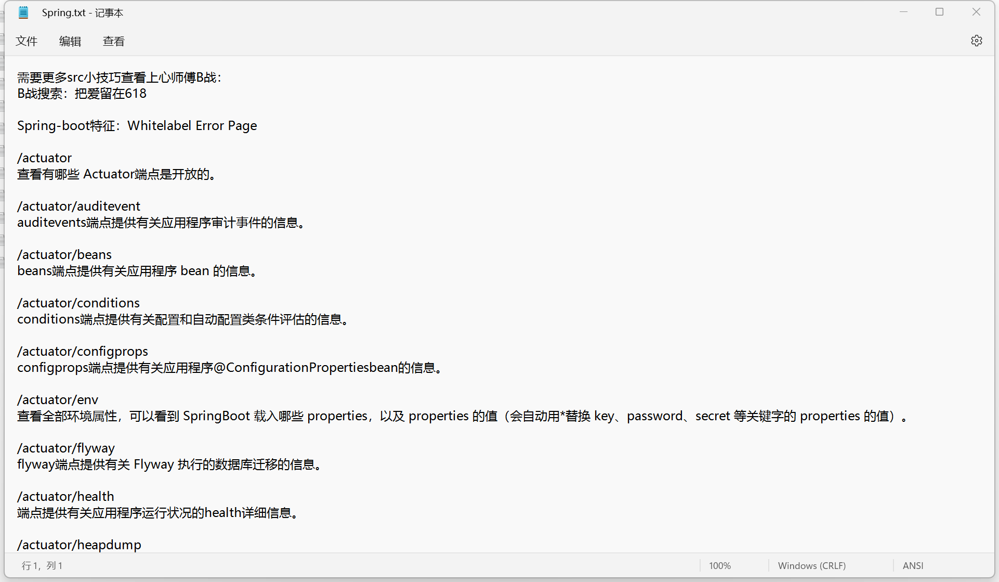
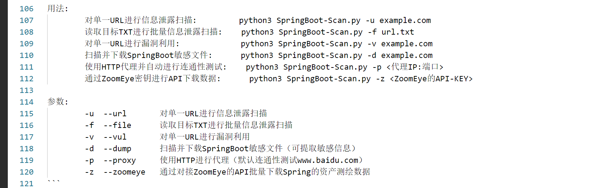
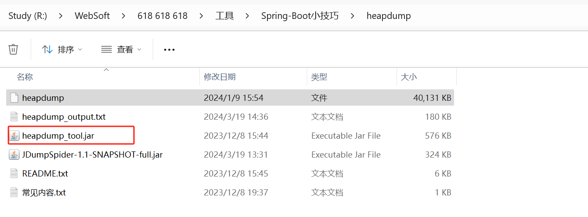
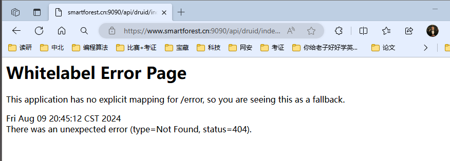

网页中显示以下  会捡大漏

<!-- 这是一张图片，ocr 内容为：SPRING-BOOT特征:WHITELABEL ERROR PAGE -->

<!-- 这是一张图片，ocr 内容为：SPRING -->

对网页进行路径测试，获取所需信息

<!-- 这是一张图片，ocr 内容为：记事本 SPRING.TXT 凉 文件 查看 编辑 需要更多SRC小技巧查看上心师傅B战: B战搜索:把爱留在618 SPRING-BOOT特征:WHITELABEL ERROR PAGE /ACTUATOR 查看有哪些ACTUATOR端点是开放的. /ACTUATOR/AUDITEVENT AUDITEVENTS端点提供有关应用程序审计事件的信息. /ACTUATOR/BEANS BEANS端点提供有关应用程序BEAN的信息. HTTUATOR/CONDITIONS CONDITIONS端点提供有关配置和自动配置类条件评估的信息. /ACTUATOR/CONFIGPROPS CONFIGPROPS端点提供有关应用程序@CONFIGURATIONPROPERTIESBEAN的信息. HACTUATOR/ENV LACTUATOR/FLYWAY FLYWAY端点提供有关FLYWAY执行的数据库迁移的信息. /ACTUATOR/HEALTH 端点提供有关应用程序运行状况的HEALTH详细信息. JACTUATOR/HEAPDUMP 行1,列1 WINDOWS (CRLF) ANSI 100% -->

HeapDump 是指将 Java 虚拟机 (JVM) 内存的当前状态转储到一个文件中。常见的heapdump泄露，大多都是springheapdump泄露

在 Spring Boot 应用中通过 Actuator 生成 HeapDump

Springboot-scan.py

<!-- 这是一张图片，ocr 内容为：用法: 106 对单一URL进行信息泄露扫描: PYTHON3 SPRINGBOOT-SCAN.PY -U EXAMPLE.COM 107 读取目标TXT进行批量信息泄露扫描: PYTHON3 SPRINGBOOT-SCAN.PY-F URL.TXT 108 对单一URL进行漏洞利用: PYTHON3 SPRINGBOOT-SCAN.PY EXAMPLE.COM 109 PYTHON3 SPRINGBOOT-SCAN.PY -D EXAMPLE.COM 扫描并下载SPRINGBOOT敏感文件: 110 使用HTTP代理并自动进行连通性测试: 111 PYTHON3 SPRINGBOOT-SCAN.PY -P <代理IP:端口> 通过ZOOMEYE密钥进行API下载数据: PYTHON3 SPRINGBOOT-SCAN.PY -Z <ZOOMEYE的API-KEY> 112 113 参数: 114 对单一URL进行信息泄露扫描 - - URL 115 U- 读取目标TXT进行批量信息泄露扫描 --FILE -F 116 对单一URL进行漏洞利用 -VUL-VUL 117 扫描并下载SPRINGBOOT敏感文件(可提取敏感信息) -D--DUMP 118 使用HTTP进行代理(默认连通性测试WWW.BAIDU.COM) 119 P--PROXY 通过对接ZOOMEYE的API批量下载SPRING的资产测绘数据 120 IN --ZOOMEYE 121 -->

**该工具是基于jhat，通过jhat解析heapdump文件**

<!-- 这是一张图片，ocr 内容为：工具> SPRING-BOOT小技巧 WEBSOFT HEAPDUMP 618 618 618 STUDY(R:) 三查看 个排序 类型 修改日期 大小 名称 文件 2024/1/915:54 HEAPDUMP 40,131 KB 文本文档 180 KB HEAPDUMP OUTPUT.TXT 2024/3/1914:36 HEAPDUMP TOOL.JAR 576 KB EXECUTABLE JAR FILE 2023/12/8 15:44 JDUMPSPIDER-1.1-SNAPSHOT-FULLJAR 2024/3/1913:31 324 KB EXECUTABLE JAR FILE 文本文档 2023/12/8 15:45 README.TXT 6 KB 文本文档 1 KB 常见内容.TXT 2023/12/8 19:37 -->

需要先获取heapdump文件，然后进行测试。

spr网页特征

<!-- 这是一张图片，ocr 内容为：SMARTFOREST.CN:9090/API/DRUID/INC 中中 Q HTTPS://WWW.SMARTFOREST.CN:9090/API/DRUID/INDE... 编程算法 读研 考证 网安 科技 宝藏 论文 你给老子好好学英... 中北 比赛+考证 WHITELABEL ERROR PAGE THIS APPLICATION HAS NO EXPLICIT MAPPING FOR /ERROR, SO YOU ARE SEEING THIS AS A FALLBACK, FRI AUG 09 20:45:12 CST 2024 THERE WAS AN UNEXPECTED ERROR (TYPE-NOT FOUND, STATUS-404). -->

