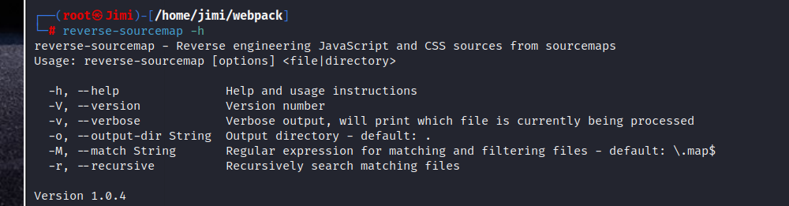
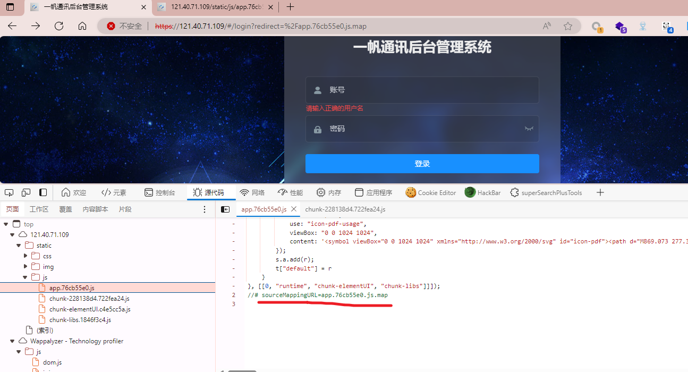
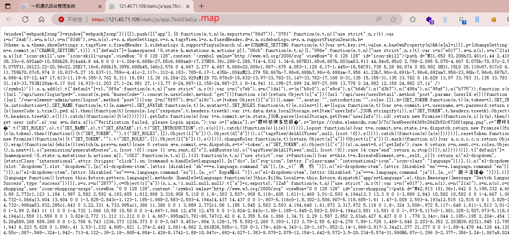
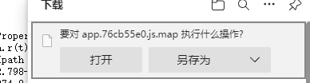
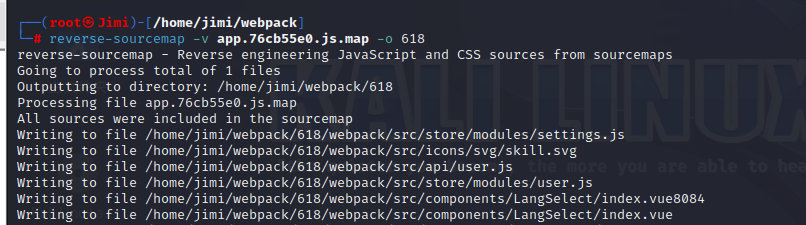
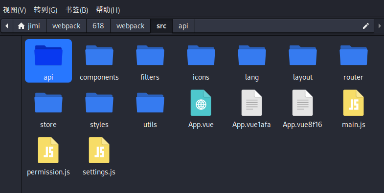

**师傅笔记：**

[http://47.95.7.92/login?redirect=%2Findex](http://47.95.7.92/login?redirect=%2Findex)

reverse-sourcemap是一个通过JavaScript Source Map还原JavaScript源码的npm工具。

Source map就是一个信息文件，里面储存着位置信息。转换后的代码的每一个位置，所对应的转换前的位置。

工具安装

npm install reverse-sourcemap来安装该工具包

输入**reverse-sourcemap** -h查看使用帮助

示例：reverse-sourcemap -v 123.js.map -o 618

<!-- 这是一张图片，ocr 内容为：(ROOT&JIMI)-[/HOME/JIMI/WEBPACK] REVERSE-SOURCEMAP REVERSE ENG REVERSE-SOURCEMAP E ENGINEERING JAVASCRIPT AND CSS FROM SOURCEMAPS SOURCES MAP [OPTIONS] <FILE|DIRECTORY> USAGE:REVERSE-SOURCEMAP  HELP AND USAGE INSTRUCTIONS -H,--HELP -V,--VERSION VERSION NUMBER VERBOSE OUTPUT, WILL PRINT WHICH FILE IS CURRENTLY BEING PROCESSED -V,--VERBOSE OUTPUT DIRECTORY - DEFAULT:  -0, --OUTPUT-DIR STRING  -M, --MATCH STRING REGULAR E MATCHING AND FILTERING FILES - DEFAULT:\.MAP$ EXPRESSION FOR MAT  RECURSIVELY SEARCH MATCHING FILES  -R, --RECURSIVE VERSION 1.0.4 -->

**.js.map ****文件**是 JavaScript 文件的源映射文件，它提供了一种映射关系，将压缩、

混淆或转换后的 JavaScript 代码映射回原始的、易于阅读和调试的源代码

URL:https://121.40.71.109/#/login?redirect=%2Fapp.76cb55e0.js.map

<!-- 这是一张图片，ocr 内容为：121.40.71.109/STATIC/JS/APP.76CB!X 一帆通讯后台管理系统 个个QS HTPS//12140.71.109/#/LOGIN?REDIRECT-%2FAPP.76CB55E0JS.MAP 不安全 公公 一帆通讯后台管理系统 账号 请输入正确的用户名 密码 登录 洋|源代码 小性能 十 网络 控制台 内存 应用程序 欢迎 COOKIE EDITOR HACKBAR SUPERSEARCHPLUSTOOLS 页面 工作区 要盖 片段 CHUNK-228138D4.722FEA24JS 内容脚本 APP.76CB55EO.JS X USE: "ICON-PDF-USAGE", TOP VIEWBOX:'0001024 1024", C 121.40.71.109 STATIC 3); CSS S.A.ADD(R); IMG T['DEFAULT"] R IS ], [[0, "RUNTIME", "CHUNK-ELEMENTUI", "CHUNK-LIBS"]LL); 1 APP.76CB55E0 JS //# SOURCEMAPPINGURL-APP.76CB55E0.JS.MAP 1 CHUNK-228138D4.722FEA24JS CHUNK-ELEMENTUL.C4E5CC5AJS 1 CHUNK-LIBS.1846F3C4JS (素引) S WAPPALYZER - TECHNOLOGY PROFILER COMIJS -->

[https://121.40.71.109/static/js/app.76cb55e0.js](https://121.40.71.109/static/js/app.76cb55e0.js)

<!-- 这是一张图片，ocr 内容为：一帆通讯后台管理系统 12140.71.109/STATIC/JS/APP.76CB!X 不安全| HTTPS//121.40.71.109/STATIC/JS/APP.76CB55E0JS.MAP ",INTRODUCTION:"",ROLES:(],H-(SEI.TOKEN:FUNCTION(E,T)(E.TOKEN-T],SET,IN LLDETULLYDLY DUTELLUTELLY UNDLY DUTERTALLD  UND  UND  UND  UND  UND  UND  UND  ING LUDETTINGLLDD ("GETINFO"):CASE 6:RETURN R-N SENT,C-R,ROLES,OBJED [SLOT:"DROPDOWM"了,SLOT:"DROPDOWA),[N("E1-DROPDOWN-ITEM,,LATTRS:ID [DISABLED:"JA"-------)],1)] SPATCH("APP/SETLANGUAGE",E),THIS. $MESSAGE(INESSAGE:"SWITCH LANGU SUCCESS",TYPE:'SUCCESS")(S,I,S-O,Z-N("2877),C-OBJECT(R["A"]A"](S,I,A,!L,A,!MU -->

弹出下载链接

<!-- 这是一张图片，ocr 内容为：要对APP.76CB55E0.JS.MAP 执行什么操作? ROPEI R(T) 另存为 打开 PATH 798 -->

<!-- 这是一张图片，ocr 内容为：(ROOT`JIMI)-[/HOME/JIMI/WEBPACK] 9 -V APP.76CB55E0.JS.MAP -0 618 REVERSE-SOURCEMAP FROM CSS SOURCES REVERSE ENGINEERING JAVASCRIPT AND CER REVERSE-SOURCEMAP SOURCEMAPS FILES  GOING TO PROCESS TOTAL OF 1 FI OUTPUTTING TO DIRECTORY: /HOME/JIMI/WEBPACK/618 PROCESSING FILE APP.76CB55E0.JS. JS.MAP  ALL SOURCES WERE INCLUDED IN THE SO SOURCEMAP WRITING TO FILE /HOME/JIMI/WEBPACK/618/WEBPACK/SRC/STORE/NODULES/SETTINGS.JS WRITING TO FILE /HOME/JIMI/WEBPACK/618/WEBPACK/SRC/ICONS/SVG/SKILL.SVG WRITING TO FILE /HOME/JIMI/WEBPACK/618/WEBPACK/SRC/API/USER.JS THE MO THE MORE YOU ARE ABLE TO HEA WRITING TO FILE /HONE/JIMI/WEBPACK/618/WEBPACK/SRC/STORE/MODULES/USER.JS WEITING TO FILE /HOME/JIMI/WEBPACK/618/WEBPACK/SRE/SRE/COMPONENTS/LANGSELECT/INDEX.YUE3084 WRITING TO FILE /HOME/JINI/WEBPACK/618/WEBPACK/STC/SICOMPONENTS/LANGSELECT/INDEX.VUE -->

<!-- 这是一张图片，ocr 内容为：视图(V)转到(G)书签(B)帮助(H) 618 WEBPACK WEBPACK API SRC LANG FILTERS LAYOUT ICONS ROUTER COMPONENTS API MAIN.JS APP.VUELAFA APP.VUE8F16 APP.VUE UTILS STYLES STORE SETTINGS.JS PERMISSION.JS -->

扫描目录，bp抓包测试

运行后看 api目录及router 首先看这2个

路径泄露，代码分析

