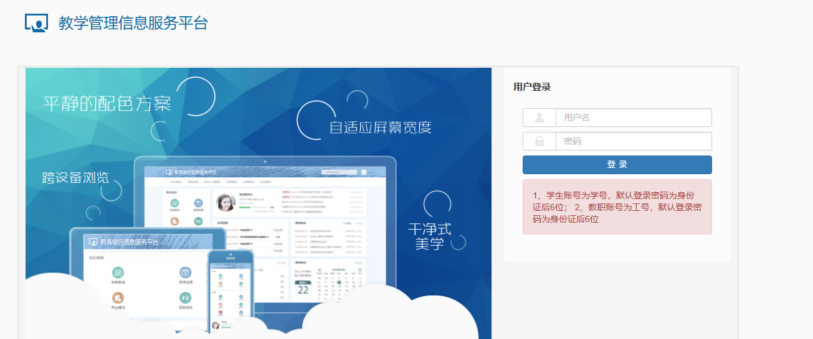
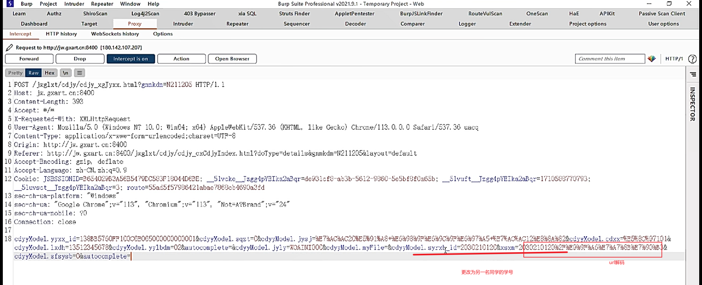
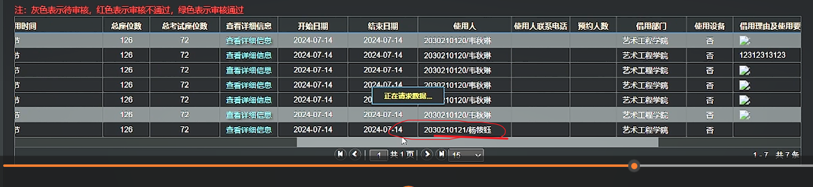

**师傅笔记：**

水平越权（同级别越权）：也叫作访问控制攻击。Web应用程序接收到用户请求，修改某条数据时，

没有判断数据的所属人，或者在判断数据所属人时从用户提交的表单参数中获取了userid。

导致攻击者可以自行修改userid修改不属于自己的数据。所有的更新语句操作，都可能产生这个漏洞。

简而言之，就是通过更换的某个ID之类的身份标识，从而使 A 账号获取（修改等）B 账号数据。

[http://jw.gxart.cn:8400/jwglxt/xtgl/login_slogin.html](http://jw.gxart.cn:8400/jwglxt/xtgl/login_slogin.html)

教师:李四

小明=小明个人信息

小红=小红的个人信息

**个人笔记：**

账号密码：小红书、github、公众号

<!-- 这是一张图片，ocr 内容为：教学管理信息服务平台 用户登录 平静的配色方案 用户名 自适应屏幕宽度 密码 登录 跨设备浏览 1,学生账号为学号,默认登录密码为身份 证后6位;2,教职账号为工号,默认登录密 码为身份证后6位 干净式 美学 教易综合信息服务平台 -->

进入教务系统

有修改模块

<!-- 这是一张图片，ocr 内容为：BURP SUITE PROFESSLONAL V2021.9.1-TEMPORARY PROJECT-WEB WINDOW HELP APIKIT HAE ONESCAN XLA SQL 403  BYPASSER ROUTEVULSCAN PASSIVE SCAN CLLENT BURPJSUNKFINDER APPLETPENTESTER LOG4J2SCAN AUTHZ DECODER PROJECT OPTIONS PROXY COMPARER LOGGER ARGET REQUEST TO HTTP://JW.GXART.N18400 (180.142.107.207] DROP HTTP/1 FORWAID INTERCEPT IS ON COMMENT THIS ITEM 目 PRETTY HEX RAVI 川 I FOST /JWGLXT/ODJY/ODJY XAFYXX.HTML9GNMKDM-N211205 HTTP/1.1 INSPECTOR 2  HOST:JX.GXART.  CN:8400 3 CONTENT-LENGTH:393 4 ACCEPT:水/W 5 X-REQUESTED-WITH:XXLHTTPREQUEST 7CONTENL-TYPE:APPLICATION-X-XWU-FORM-U-U-U-LENCODED:CHARSEL-UTP-8 8ORIGIN:HTTP://JW.GXART.CN:8400 10ACCEPT-ENCODING:GZIP,DEFLATO 11ACCEPT-LANGUAGE:ZH-CN,ZH:Q.9 SLUYSCT_TEG21PYETKA2ABQ2-3:ROUTE-55AI55557G3642LABAC7863CB4690A3ID 13 SEC-CH-UA-PLATFORN:"WINDOWS" 14 8EC-CH-UA: "GOODLE CHROME"I13", "NIUMIUMIUM"IG二"113", "NOT-&"NOT-"2 15 SAC-CH-UA-MOBILE:70 16 CONNACTION:CLOSE 17 CDYYYODEL.SFSYSB-O&AU TOCCMPLETE URT鲜玛 更改为另一名同学的学号 -->

对修改模块进行抓包

修改包的id

发包，成功修改

<!-- 这是一张图片，ocr 内容为：灰色表示待审核,红色表示审核不通过,绿色表示审核通过 使用人联系电话 预约人数 借用部门 使用人 查看详细信息 用时间 使用设备 总考试座位数 结束日期 总座位数 借用理由及使用要 开始日期 艺术工程学院 72 2024-07-14 2024-07-14 2030210120/韦秋琳 126 否 查看详细信息 艺术工程学院 市 2030210120/韦秋琳 2024-07-14 2024-07-14 查看详细信息 72 12312313123 126 否 古 72 艺术工程学院 2024-07-14 查看详细信息 2024-07-14 否 126 2030210120/韦秋琳 古古古古 艺术工程学院 查看详细信息 72 2024-07-14 126 2030210120/韦秋琳 2024.07.14 否 正在请求数据... 艺术工程学院 72 126 2024-07-14 西 查看详细信息 10120/韦秋琳 20 艺术工程学院 72 2024-07-14 126 查看详细信息 2024-07-14 2030210120/韦秋琳 否 查看详细信息 艺术工程学院 72 126 2024-07-14 否 2024-07-14 2030210121/杨核钰 共1页 1-7共7条 -->

查看详细信息，有个人信息（身份证-手机号等）

