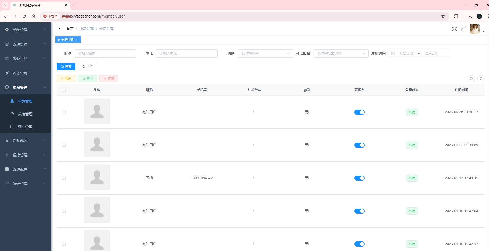
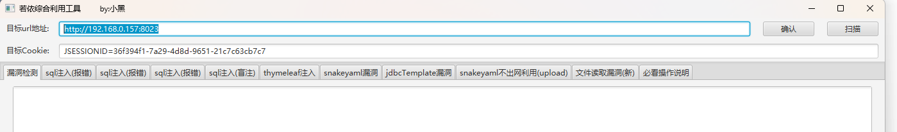
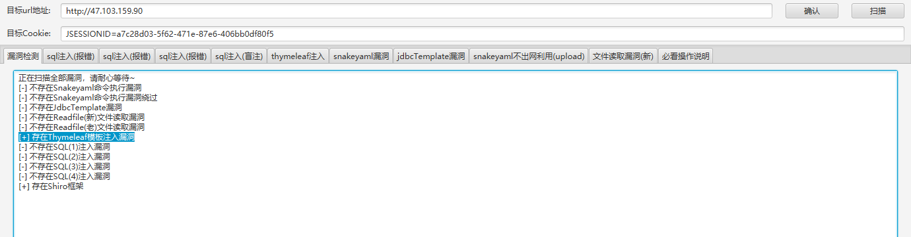
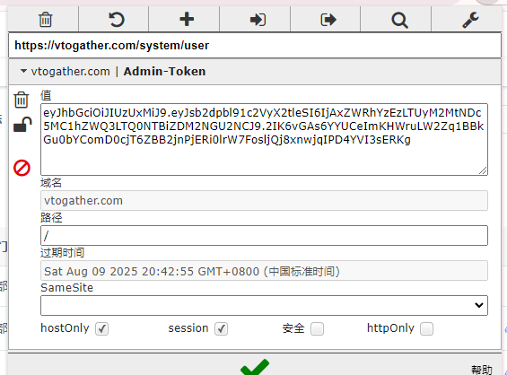

<!-- 这是一张图片，ocr 内容为：RUO YI -->

若依是一个基于Spring Boot、MyBatis、Thymeleaf等技术的快速开发平台，主要用于开发企业级应用、后台管理系统。这个框架提供了丰富的功能模块，如用户管理、角色权限、菜单管理、日志管理等，方便开发者快速构建应用。

欢迎使用RuoYi后台管理框架，当前版本：v3.8.5，请通过前端地址访问。

/druid/index.html

/druid/login.html

/prod-api/druid/login.html

/prod-api/druid/index.html

/dev-api/druid/login.html

/dev-api/druid/index.html

/api/druid/login.html

/api/druid/index.html

/admin/druid/login.html

/admin-api/druid/login.html

kPH+bIxk5D2deziIxcaaaA==

Fofa语句:(icon_hash="-1231872293" || icon_hash="706913071")

Hunter语句:web.body="若依后台管理系统"  自行组合

window.location.href='html/ie.html'

用户:admin ruoyi druid  test

密码:123456 admin druid admin123 admin888  test

[https://vtogather.com/login?redirect=%2Findex](https://vtogather.com/login?redirect=%2Findex)

[http://47.99.73.32/login](http://47.99.73.32/login)

[http://www.zhanyougou.com:8087/](http://www.zhanyougou.com:8087/)

[http://47.103.159.90/login](http://47.103.159.90/login)

[http://139.129.230.203:8198/login?redirect=/index](http://139.129.230.203:8198/login?redirect=/index)

[https://www.smartforest.cn:9090/](https://www.smartforest.cn:9090/)

测试流程

1.密码爆破进入后台

<!-- 这是一张图片，ocr 内容为：活动小程序旨台 GPAY 不安全 HTTPS//VTOGATHER.COM/MEMBER/USER 首页 成员管理|会员管理 系统管理 会员管理 级别 可以报名 昵称 开始日期 注册时问 请选择级别 结束日期 电话 请选择报名状态 请输入电话 请输入呢称 系统工县 O 卖 若依官网 X                                                                                                 用 导出 白用 成员管理 手机号 头像 级别 昵称 注册时间 可报名 红花数量 登录状态 会员管理 微信用户 2023-06-28 21:1627 启用 反焕管理 日 评论管理 98 无 启用 微信用户 2023-02-22  09:11:59 名 程序管理 1 系统配置 无 周杨 13901084372 2023-01-12 17:41.19 统计管理 无 2023-01-10 11:47.04 启用 微信用户 启用 2023-01-10 11:43:12 -->

2.根据网站的图标判断是若依管理系统

3.进行若依的往期漏洞利用

若依漏洞利用工具

<!-- 这是一张图片，ocr 内容为：X  X 若依综合利用工具 BY小黑 目标URL地址: 确认 扫描 HTTP://192.168.0.157:8023 JSESSIONID;36F394F1-7A29-4D8D-9651-21C7C63CB7C7 目标COOKIE: SGL注入(报错) SQL注入(报错) JDBCTEMPLATE涡洞 THYMELEAF注入 SQL注入(盲注) 漏洞检测 必看操作说明 SQL注入(报错) 文件读取漏洞(新) SNAKEYAML涡洞 SNAKEYAML不出网利用(UPLOAD) -->

<!-- 这是一张图片，ocr 内容为：目标URL地址: 扫描 HTTP://47.103.159.90 确认 JSESSIONID-A7C28D03-5F62-471E-87E6-406BBODF8015 目标COOKIE: SQL注入(盲注)THYMELEAF注入 漏洞检测 SQL注入(报错) JDBCTEMPLATE漏洞 SGL注入(报错) SG注入(报错) 必看操作说明 文件读取漏洞(新) SNAKEYAML不出网利用(UPLOAD) SNAKEYAML漏洞 正在扫描全部漏洞,请耐心等待~ [1不存在SNAKEYAML命令执行漏洞 []不存在SNAKEYAML命令执行漏洞终过 [[]不存在JDBCTEMPLATE漏洞 [-]不存在READFILE(新)文件读取漏洞 (-]不存在READFILE(老)文件读取漏洞 [+]存在THYMELEAF模板注入漏洞 []不存在SQL(1)注入漏洞 (1不存在SQL(2)注入漏洞 (1]不存在SQL(3)注入漏洞 []不存在SQL(4)注入漏洞 [+]存在SHIRO框架 -->

重要点：session，burp对抓包的session/cookie进行修改，能爆出信息

<!-- 这是一张图片，ocr 内容为：Q @ HTTPS://VTOGATHER.COM/SYSTEM/USER VTOGATHER.COM | ADMIN-TOKEN 值 LEYJHBGCI0JJ1UZUXMI39.EYJSB2DPB191C2VYX2TLESI6IJAXZWRHYZEZLTUYMENDC (5MC1HZWQ3LTQONTBIZDM2NGU2NCI9.2IK6VGAS6YYUCEIMKHWRULW2ZQ1BBK LGUOBYCOMDOCJT6ZBB2JNPJERIOLRW7FOSLJOJ8XNWJQIPD4YVI3SERKG 域名 VTOGATHER.COM 路径 / 过期时间 SAT AUG 09 2025 20:42:55 GMT+0800(中国标准时间) SAMESITE HTTPONLY 安全 HOSTONLY SESSION -->

