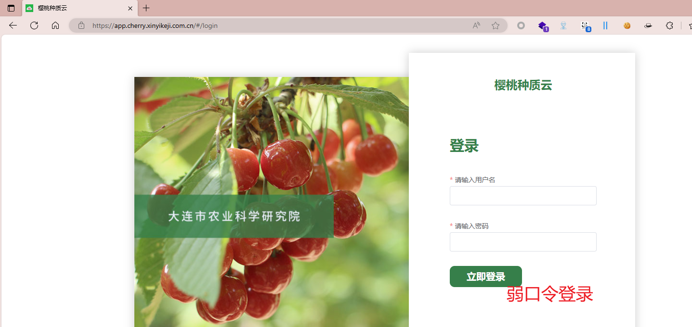
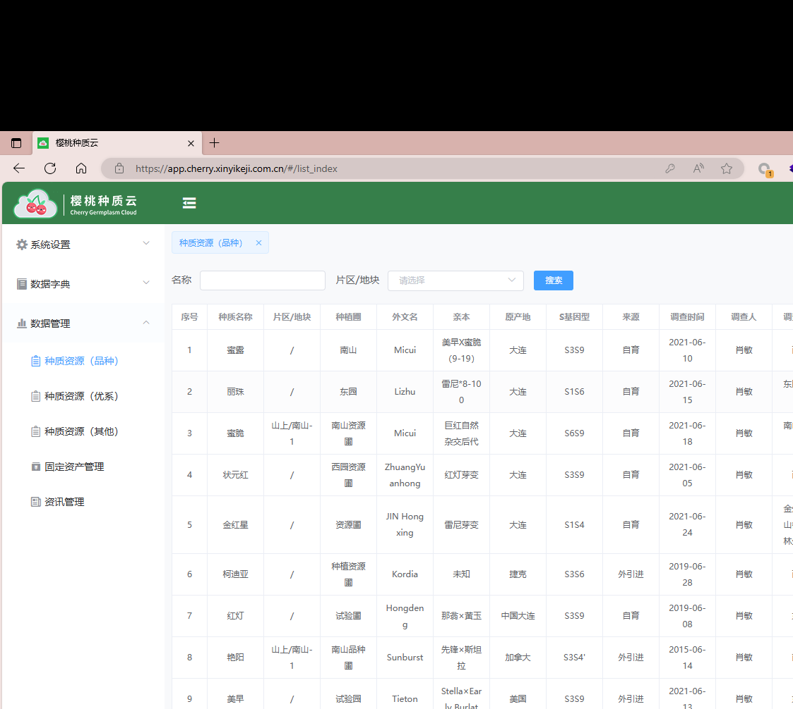
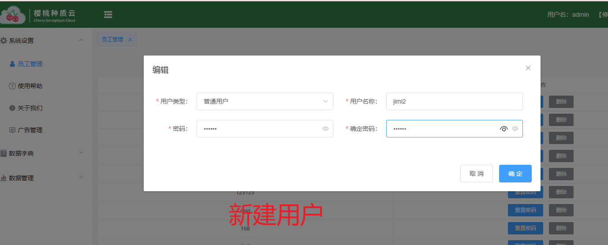
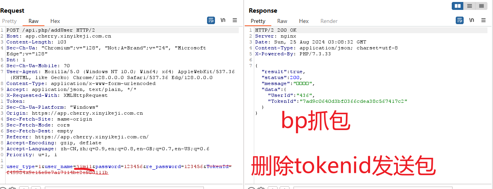
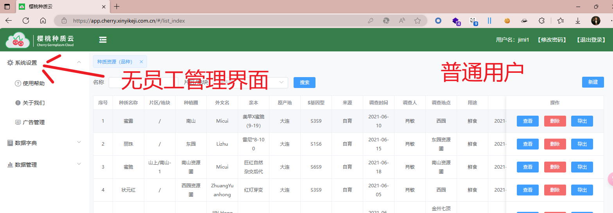
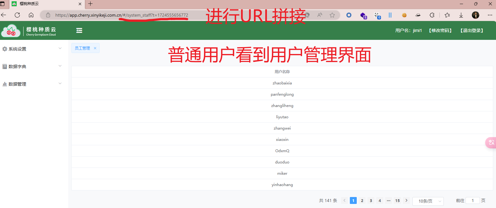

**师傅笔记：**

管理员创建成功的一个返回包界面

{

"result": true,

"status": 200,

"message": "注册成功",

"data": {

"UserId": "87",

"TokenId": "9e5e0eceaab9fc8d4c6dcc09d94ae7e9"

}

}

{

"result": true,

"status": 200,

"message": "注册成功",

"data": {

"UserId": "88",

"TokenId": "ff0acaf272a62fe227222fa1f9cc6b20"

}

}

弱口令 

未授权创建普通用户 未授权查看用户列表

垂直越权查看用户列表 垂直越权创建管理员用户

**个人笔记：**

[https://app.cherry.xinyikeji.com.cn/#/system_staff?t=1724495424018](https://app.cherry.xinyikeji.com.cn/#/system_staff?t=1724495424018)

<!-- 这是一张图片，ocr 内容为：樱桃种质云 ANG 幸 HTTPS//APP.CHERRY.XINYIKEJI.COM.CN/#/#/LOGIN 樱桃种质云 登录 请输入用户名 大连市农业科学研究院 请输入密码 立即登录 弱口令登录 -->

有webpack先尝试未授权  api泄露

<!-- 这是一张图片，ocr 内容为：樱桃种质云 HTTPS://APP.CHERRY.XINYIKEJI.COM.CN/#/LIST INDEX 樱桃种质云 CHERRY GERMPLASM CLOUD 种质资源(品种) 系统设置 片区/地块 名称 请选择 搜索 数据字典 调查时间 调查人 片区/地块 种植回 原产地 种质名称 亲本 来源 序号 外文名 S基因型 数据管理 美早X蜜脆 2021-06- 1 MICUI 自育 肖敏 大连 蜜露 南山 S3S9 (9-19) 10 种质资源(品种) 东 雷尼*8-10 2021-06- 丽珠 2 大连 自育 东园 肖敏 LIZHU S1S6 种质资源(优系) O 15 南 山上/南山 巨红自然 南山资源 2021-06- 种质资源(其他) 3 大连 蜜脆 自育 MICUI 肖敏 S6S9 杂交后代 面 18 固定资产管理 ZHUANGYU 西园资源 2021-06- / 4 状元红 自育 红灯芽变 大连 肖敏 S3S9 05 ANHONG 资讯管理 2021-06- JIN HONG 5 雷尼芽变 肖敏 自育 大连 金红星 资源围 S1S4 24 XING 林 种植资源 2019-06- 6 未知 肖敏 柯迪亚 捷克 S3S6 KORDIA 外引进 面 28 HONGDEN 2019-06- 7 红灯 中国大连 自育 肖敏 那翁X黄玉 试验面 S3S9 08 山上/南山 南山品种 先锋X斯坦 2015-06- 8 肖敏 加拿大 外引进 艳阳 SUNBURST S3S4' 拉 重 14 2021-06- STELLAXEAR 9 肖敏 美国 外引进 试验园 美早 S3S9 TIETON LY BUCLAT -->

<!-- 这是一张图片，ocr 内容为：樱桃种质云 [修 用户名:ADMIN CHERRY CERMPLASM CLOUD 员工管理 系统设置 员工管理 编辑 使用帮助 普通用户 用户类型: 用户名称: 删除 JIMI2 关于我们 删除 密码: 确定密码: 广告管理 删除 数据字典 删除 取消 确定 删除 山数据管理 删涂 125125 新建用户 重置密码 删除 重置密码 删除 168 -->

<!-- 这是一张图片，ocr 内容为：RESPONSE REQUEST 5 川 RENDER PRETTY PRETTY HEX HEX RAW RAW HTTP/2  200  OK POST /API.PHP/ADDUSER HTTP/2 SERVER:NGINX HOST:APP.CHERRY.XINYIKEJI.COM.CN DATE:SUN,25 AUG 2024 03:08:32 GMT CONTENT-LENGTH:103 CONTENT-TYPE: APPLICATION/JSON; CHARSET-UTF-8 SEG-CH-UA: "CHROMIUM";VE","NOT:A-BRA-BRAND";V三M24", "MICROSOFT X-POWERED-BY:PHP/7.3.33 EDGE"V:128* DNT:1 SEC-CH-UA-HOBILE: 20 USER-AGENT: HOZILLA/5.0 (WINDOUS NT 10.0; VIN64; X64) APPLEVEBKIT/537.36 "RESULT :TRUE, (KHTHL,LIKE GECKO) CHROME/128.0.0.0 SAFARI/537.36 EDG/128.0.0.0 "STATUS*:200, "MESSAGE":"OOO口" CONTENT-TYPE:APPLICATION/X-VWW-FORM-URLENCODED ACCEPT:APPLICATION/JSON,TEXT/PLAIN,* "DATA'':( USERID":"436*, X-REQUESTED-WITH:XHLHTTPREQUEST "TOKENID":"7AD9C0640D3BF0366CDEA38C567417C2" TOKEN: SEC-CH-UA-PLATFORM: "VINDOVS" ORIGIN:HTTPS://APP.CHERRY.XINYIKEJI.COM.CN BP抓包 SEC-FETCH-SITE:SAME-ORIGIN SEC-FETCH-MODE: CORS SEC-FETCH-DEST:EMPTY REFERER:HTTPS://APP.CHERRY.XINYIKEJI.COM.CN/ ACCEPT-ENCODING:GZIP,DEFLATE ACCEPT-LANGUAGE: ZH-CN,ZH;Q-0.9,EN;Q-0.8,EN-GB;Q-0.7,EN-US;QF0.6 PRIORITY:U L, I 删除TOKENID发送包 ER TYPE-LSUSER NAME三IMILSPASSWORD-1234566RE PASSWORD-123456STOKENID- USER 149984A9C156967A17114BE2E98D1115 -->

<!-- 这是一张图片，ocr 内容为：重置密码 删除 JIMI2 -->

数据添加成功

**垂直越权（普通用户查看****admin****的用户数据）**

URL拼接：

<!-- 这是一张图片，ocr 内容为：樱桃种质云 不平 RA介 HTTPS//APP.CHERNY.XINYIKEJI.COM.CN/#/LIST INDEX 樱桃种质云 [退出登录] [修改密码] 用户名:JIMI1 系统设置 种质资源(品种) 普通用户 无员工管理界面 新建 名称 拽卖 使用帮助 亲本 用途 片区/地块 调查人 外文名 调查地点 关于我们 种植曲 操作 种质名称 原产地 来源 序号 调查时间 S基因型 美早X蜜脆 1 鲜食 西园 剩除 查看 肖敏 MICUI 蜜蜜 自育 南山 2021 出台 大连 四广告管理 (9-19) 10 雷尼.8-10 东园资源 数据字典 丽珠 鲜食 肖敏 东网 查看 LIZHU 自育 剩除 2021 S156 大连 乐出 0 围 15 山上/南山1- 南山资源 巨红自然 南山资源 2021-06- 山数据管理 3 蜜脆 肖敏 删除 自育 MICUI 鲜食 直看 2021 S6S9 出营 大连 团 团 杂交后代 18 西园资源 2021-06- ZHUANGYU 西屋 鲜食 查看 肖敏 自育 2021 红灯芽变 删除 大连 状元红 S359 导出 围 05 ANHONG 金州七顶 -->

<!-- 这是一张图片，ocr 内容为：楼桃种质云 进行URL拼接 A合口面站 C HTTPS//APP.CHERRY.XINYIKEJI.COM.CN/每/SYSTEM STAFF2T-17245555656772 樱桃种质云 [退出登录] 用户名:JML1 [修改密码] CHENY GERMPLASM CLOUD 员工管理 漆系统设置 普通用户看到用户管理界面 数据字典 用户名称 ZHAOBAIXIA 山数据管理 PANFENGLONG ZHANGLIHENG LIYUTAO ZHANGWEI XIAOXIN 史入 ODXMQ YINHAOHANG 2334 15 前往1页 共141条 10条质 -->

**测试****xss**

存储型，反射型（相关语句）

**垂直越权**

更改普通用户的user_type=1/2

将普通用户权限提升至管理员用户权限

