嘀嘀嘀~

0.登录

<!-- 这是一张图片，ocr 内容为：4. INTRUDER ATTACK OF HTTPS://DZ68JSCXKF.COM - TEMPORARY ATTACK - NOT SAVED TO PROJECT FILE COLUMNS SAVE ATTACK SETTINGS RESOURCE POOL PAYLOADS POSITIONS RESULTS FILTER:SHOWING ALL ITEMS PAYLOAD ERROR STATUS CODE TIMEOUT T LONATH REQUEST COMMENT GOOOOOOOOOOOOOOOOOOOOD 411 ADMIN888 200 348 300000000000 47 0 200 293 0 200 287 287 200 12345 12 5 287 200 ADMIN 2 287 200 123456 14 200 287 1QAZ@WSX 3 200 287 200 15 287 ADMIN123 200 9 287 111111 200 16 287 TEST 4 287 200 RASPBERRY 爆破ADMIN的密码,得到URL 17 200 AISADMIN 200 9 0000 287 PASSWORD 287 200 123 18 200 287 ROOT 287 200 19 USER 8 287 200 123456789 UOG 100172 REQUEST RESPONSE RENDER PRETTY HEX RAW HTTP/2  200   200  200  200  OK SERVER:NGINX DATE: WED, 28 AUG 2024 02:14:21 GHT CONTENT-TYPE: APPLICATION/JSON; CHARSET-UTF-8 5S SET-COOKIE:ACL : ADMIN USERNAMENAMIN; EXPITES三FEL, 27-SEP-2024 02:14:24:21 GAT; MAX-AGEF2592000; PATH手 6 SET-COOKIE: PHPSESSID-C9EC64755BED52CLABFFD21606EZDDC7; PATH-/ 789 ICT-TRANSPORT-SECURITY: MAX-AGE-31536000 STRICT-TR "CODE":1, "MSG":"OOOO", "DATA /ACMIN\/INDEX\/INDEX.HTML", UR1 WAIT O MATCHES SEARCH... FINISHED -->
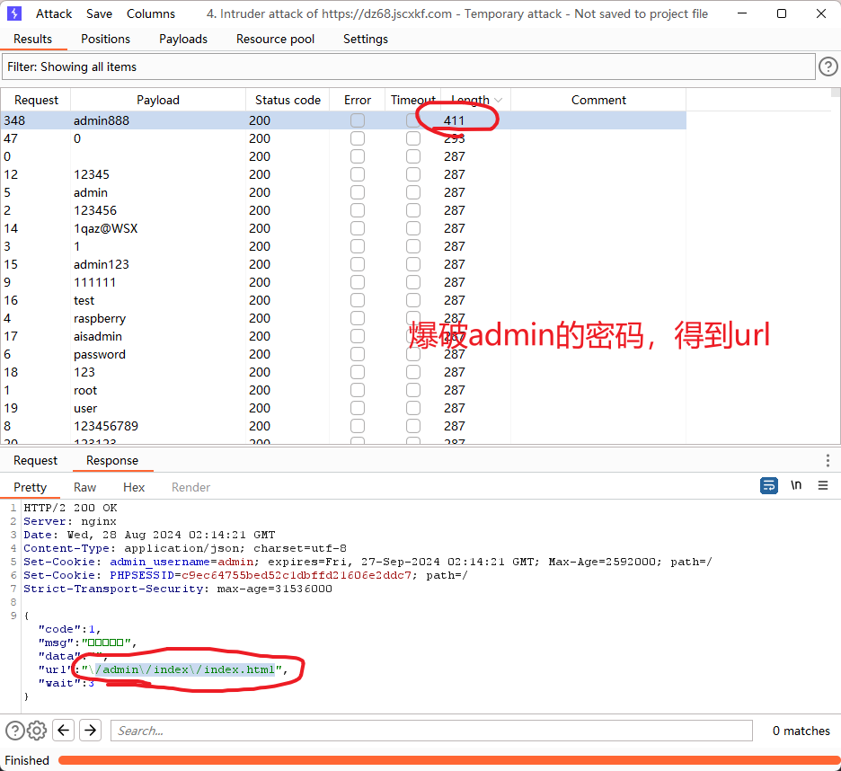

<!-- 这是一张图片，ocr 内容为：亿友友后台管理中心 ADMIN 非法登录! 登录 怎么办? 非法登录! -->
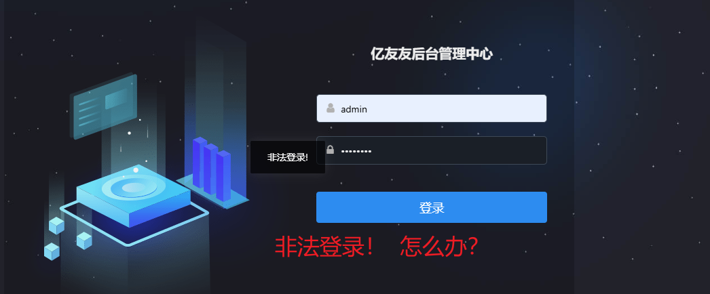

<!-- 这是一张图片，ocr 内容为：亿友友后台管理中心 HTTPS://DZ68.JSCXKF.COM//ADMIN/INDEX//INDEX.HTML 三首页 亿友友后台管理中心 首页 首页 设置 欢迎,ADMIN登陆后台管理中心 管理组 直接输入URL发现可以未授权登录 用户列表 会员等级 商品管理 -->
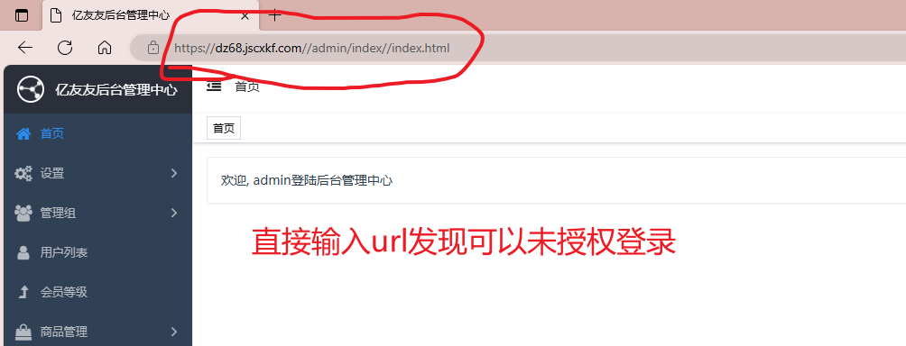

1.有输入框，可以打XSS，sql注入

<!-- 这是一张图片，ocr 内容为：设置 添加幻灯片 幻灯片列表 轮播图管理 名称 网站设置 描述 文本配置 管理组 返回 添加 用户列表 -->
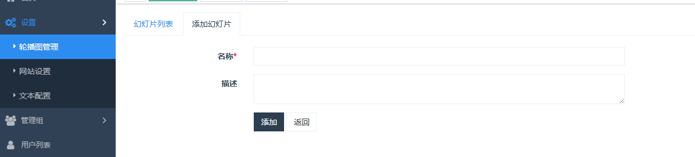

2.文本编辑器

<!-- 这是一张图片，ocr 内容为：HTTPS://DZ68JSCXKF.COM/ADMIN#/ADMIN/BASIC/RICHTEXTOPTION.HTML 三首页/设置/文本配置 亿友友后台管理中心 首页 网站设置 文本配置 轮播图管理 首页 设置 用户协议 抽奖规则 隐私政策 集卡规则 关于我们 扫码规则 轮播图管理 扫江简口具 A 66团 A *关于我们: X U HTML AGA 字号 自定义标 没落格 体 网站设置 代码语言 昌园含 2 T 颈8日 国国 文本配置 关于我们 管理组 用户列表 会员等级 元素路径: 字数统计 商品管理 保存 订单管理 Y 包拼团管理 -->
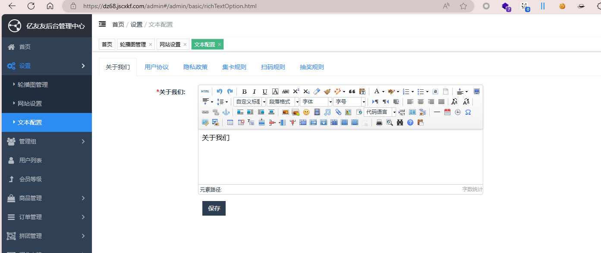

<!-- 这是一张图片，ocr 内容为：首页 轮揭图管理 文本配置 网站设置 首页 设置 关于我们 用户协议 集卡规则 扫码规则 抽奖规则 隐私政策 轮播图管理 BIU圆配X 66  疗 三 *关于我们: THIN 自定义标准?段落 AR 11 ANAL 16PX 网站设置 代码语言 R 文本配置 OP 21 关于我们 十 汇源代码 网络能 </>元素 欢迎 控制台 回内存 应用程序 COOKIE EDITOR 00 内容脚本片段 页面 工作区 要盖 ZH-CNJS X 口J 519 'ADDRESS':{VALUE:北京") JQUERYVALIDATE 监视 520 WLAYER/SKIN/DEFOULT 521 SEORCHERROR:无法定位到该地址! 断点 BNOTY 在文件中搜索 522 PUEDITOR 在抛出未捕获的异常时暂停 THEIP': 523 LANG/ZH-CN 524 STATIC': 在抛出捕获的异常时智停 525 LANG INPUT ABOUT:'关干UEDITOP ZH-CNJS 作用域 526 LANG.INPUT SHORECUES : THEMES/DEFAULT/CSS 'LONG INDUT,INTRODUCTION':'UEDR是由西密RE上新城科发部开发的所得省文本WE日解推荐,具有轻里,可定制,注星用户作始等特点.并描 未答停 THIRD-PARTY UEDITOR.ALL.MINJS 调用维栈 4已选择宇符 爱盖范围:不适用 UEAITOR.CONTIQ.IS 问题 搜索十 控制台 可以发现该编辑器是UEDIT EDIT (') AA EDIT E,CDITTIP:滨镜提示,CUSTOMSTOMSTOTYPESCTOTYPESET:自动排版. 26 INCHEIGHT:行间跑,ED 138 DITTABLE:表格属性 144 EDITED?"单元格属性 431 "TIP2:申请完成之 DITNE.CONFIGJS中配置获得的APPKEY!. SOUF'美干UEDITOR. 525 "LANG_INPUT_ABOUT 527 600 14 LANG_SHOWMSGI'颗因功能需要首先安装UEDITOR我回插件!. 602 LA LANG.STEP1:第一步,下载UEDITOR街件并运行安装." 618 ME -->
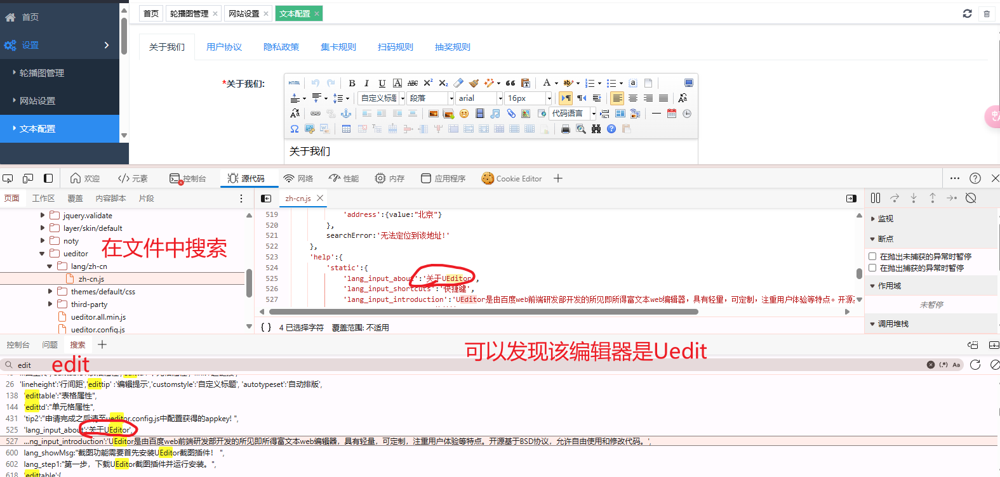

知道是uedit编辑器

上网找uedit的漏洞，然后**漏洞利用！**！

3.看看有无未授权

<!-- 这是一张图片，ocr 内容为：三首页 亿友友后台管理中心 首页 管理员 首页 设置 管理员添加 管理员 管理组 *用户名 123213 用户列表 *密码 123456 会员等级 123123@QQ.COM 邮箱 商品管理 TESTESTEST 超级管理员 牛角色 订单管理 添加... 拼团管理 积分卡牌 添加商品管理员 抽奖管理 二维码管理 卡牌管理 -->
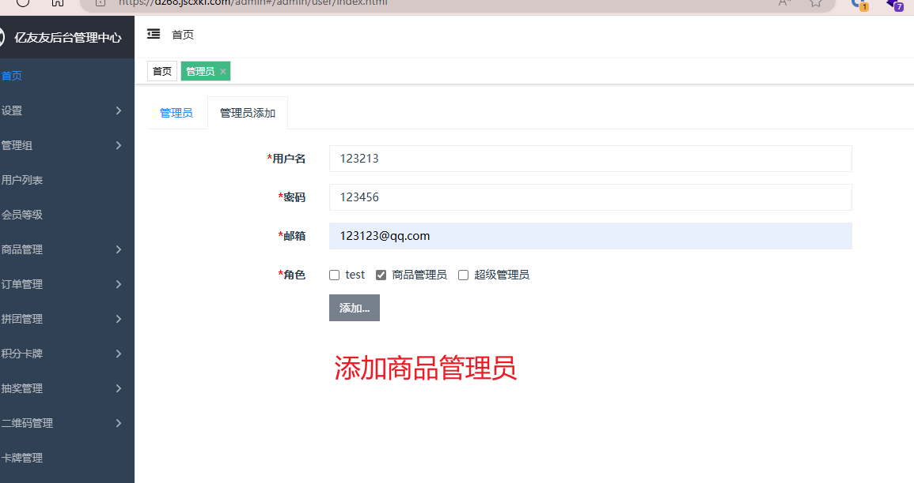

<!-- 这是一张图片，ocr 内容为：亿友友后台管理中心 HTTPS://DZ68JSCXKF.COM//ADMIN/INDEX//INDEX.HTML并/ADMIN/USER/INDEX.HTML 甘西/管理细/管理只 亿友友后台管理中心 X 亿友友后台管理中心 首页 白HTTPS://DZ68JS.... 设置 三首页 亿友友后台管理中心 管理组 首页 首页 角色管理 商品管理 欢迎,123123登陆后台管理中心 管理员 订单管理 用户列表 画 拼团管理 会员等级 商品管理 商品管理员 ADMIN 订单管理 拼团管理 积分卡牌 抽奖管理 二维码管理 卡牌管理 -->
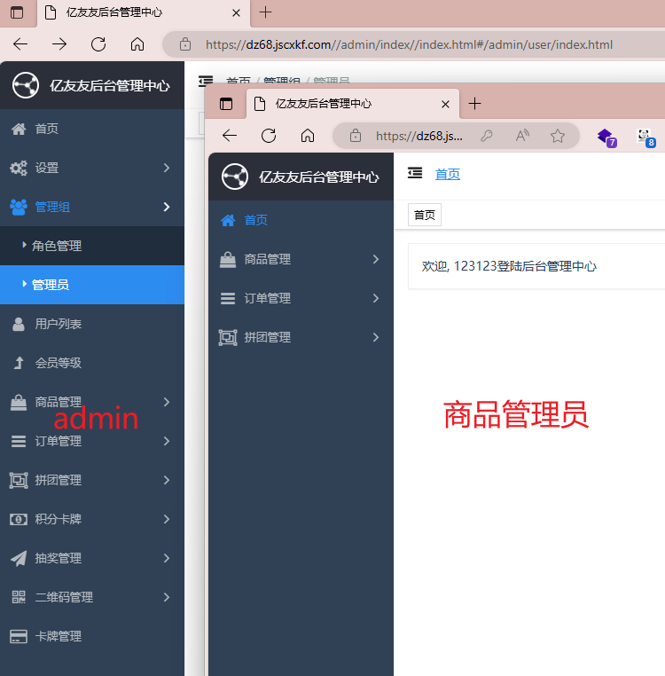

<!-- 这是一张图片，ocr 内容为：亿友友后台管理中心 X HTTPS://DZ68JSCXKF.COM/ADMIN/INDEX/INDEX.HTML并/ADMIN/MEMBER/INDEX.HTML 三首页 亿友友后台管理中心 用户列表 首页 首页 商品管理 订单管理 构造ADMIN的用户列表的URL,无权访问 拼团管理 您没有访问权限! 页面自动跳转等待时间:3 -->
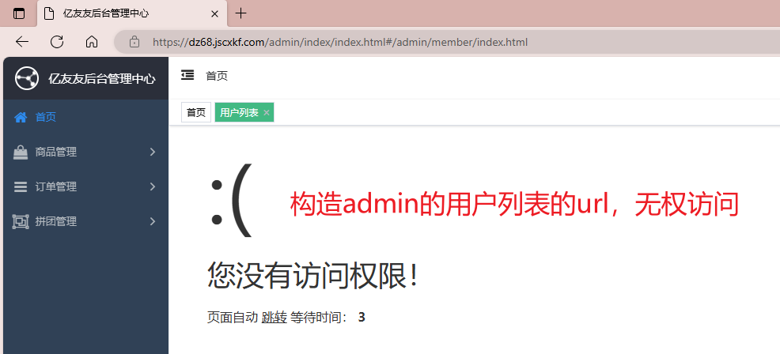

4.垂直越权（测试商品管理员创建用户）

<!-- 这是一张图片，ocr 内容为：首页/用户列表 乙友友后台管理中心 BURP SUITE PROFESSIONAL V2023.5.1 - TEMPORARY PROJECT - LICENSED REPEATER WINDOW PROJECT INTRUDER HELP BURP COLLABORATOR DASHBOARD PROXY INTRUDER COMPARER TARGET LOGGER SEQUENCER DECODER REPEATER 用户列表 管理员 首页 角色管理 CO2 WEBSOCKETS HISTORY PROXY SETTINGS INTERCEPT HTTP HISTORY 添加用户 用户列表 REQUEST TO HTTPS://DZ68JSCXKF.COM:443 [152.136.150.48] FORWARD ACTION INTERCEPTIS ON DROP OPEN BROWSER *身份: 学生 管理 PRETTY HEX 修改COOKIE为刚创建的商品管理员用户的 DDD *姓名: POST/ADMIN/MEMBER/ADD.HTML HTTP/2 2 HOST:DZ68.JSCXKF.COM 员 COOKLE: PHPSESSID-C9EC64755BED52CIDBTTDZI60EEZDDC7: ADMIN USERNAME-ADMIN 12333412341 手机号(登陆号) CONTENT-LENGTH:56 SEG-CH-UA: "CHROMIUM";VENIVE","FOT;&PBRAND"IVE"IVEWZA", "BICROSOTT EDGE"IVE"I28" 列表 DNT:1    1           DNT: DNT:1 SEC-CH-UA-HOBILE:20 123123 *密码: X64) APPLEWEBKIT/537.36 (KHTHL,11KE GECKO) CHROME/128.0.0.0.0 等级 USER-AGENT:HOZILLA/5.0 (VINDOWS NT 10.0; WIN64; X64) AN SAFARI/537.36EDG/128.0.0.0 CONTENT-TYPE: APPLICATION/X-WWI-FORM-URLENCODED; CHARSET-UTF-8 添加 返回 管理 ACCEPT: APPLICATION/JSON, TEXT/JAVASCRIPT, */*; Q20.01 X-REQUESTED-WITH: XNLHTTPREQUEST SEC-CH-UA-PLATTORM:"VINDOWS" 管理 Y ORIGIN:HTTPS://DZ68.JSCXKT.COM SEE-FETCH-SITE:SEME-ORIGIN SEC-FETCHODE:CORS 管理 Y ADMIN添加用户,抓包 SEC-FETCH-DEST:EMPTY REFERER:HTTPS://DZ68.JSCXKI.COM/ADMIN/NENBER/ADD.HTML ACCEPT-GNCODING: GZIP, DERLATE Y ACCEPT-LANGUAGE: ZH-CH,ZH;QWO.9,EN;QWO.8,EN-GB;QM0.7,EN-US:QW0.6 PRIORITY: U-L,1 Y 管理 GROUP-1-TRUE NAME DDD MOBILE-123333412341 PASSVORD-123123 码管理 Y 管理 -->
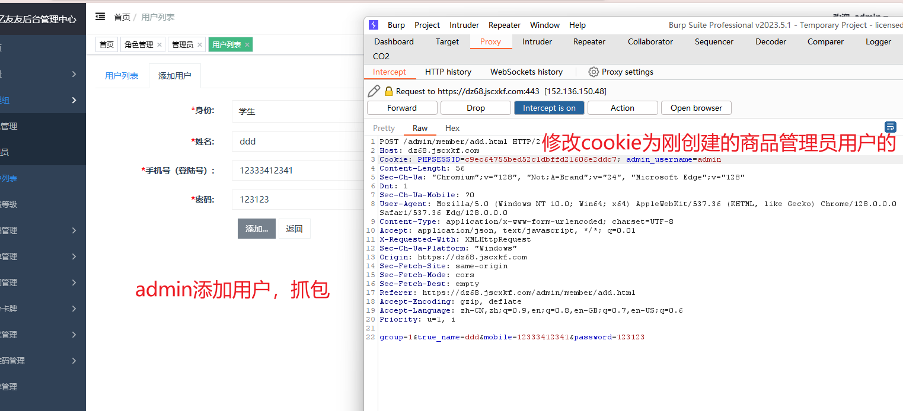

<!-- 这是一张图片，ocr 内容为：BURP SUITE PROFESSIONAL V2C BURP PROJECT HELP WORKSTATION COLLABORATOR PROXY SEQUENCER INTRUDER TARGET DASHBOARD DE REPEATER 口 KALI_2023 64 CO2 WINDOWS 10 X64 亿友友后台管理中心 HTTP HISTORY WEBSOCKETS HISTORY PROXY SETTINGS LNTERCEPT C DZ68 JSCOOKD.COM/ADMIN/INDEX/INDEX.HTML REQUEST TO HTTPS://DZ68JSCXKF.COM:443 [152.136.150.48] 蛋首页 OPEN BROWSER 欢迎,123123* DROP FORWARD ACTION INTERCEPT IS ON 亿友友后台管理中心 HEX PRETTY RAW 更改 POST /ACMIN/MEMBER/ADD.HTMI HTTP/2 欢迎123123营进后台管理中心 HOST:DZ68.JSCXKF.COM 3 COOKIE: PHPSESSID-1476BA43E2BC9CBECOE9877EBT6227AL: ADMIN USERNAME-123123 三订单管理 CONTENT-LENGTH:56 "NOT;A-BRAND*;V"128*,"HICROSOFT EDGE";VI28* SEC-CH-UA: "CHROMIUN";V "128", DNT:1 SEC-CH-UA-HOBILE:20  USEZ-AGENT: HOZLLA/5.0 (WINDOVS NT IO.0: WINE4; XE4) APPLEWEDKLT/537.36 (RHTEL( 出口 仿真 内存 最验 网络 控制台 性能 DOM资源管理器 SAFARI/537.36 EDG/128.0.0.0 CONTENT-TYPE: APPLICATION/X-WWW-FORM-URLENCODED; CHARSET-UTF-8 脂 ACCEPT: APPLICATION/JSON,TEXT/JAVASCRIPT,*/*;Q-0.01 十时 标头 COOKIE X-REQUESTED-VITH:XHLHCTPREQUEST 多类 结果 方法 名称 内容类型 SEC-CH-UA-PLATTORM:"WINDOWS" 时永COO 200 ORIGIN:HTTPS://DZ68.JSEXKF.COM SEC-FETCH-SITE:SAME-ORIGIN PHPSES5ID 1476BA43E2BC9DBEC0E9877E616227E1 GET SEC-FETCH-HODE: CORS SEC-FETCH-DEST:EMPTY GET REFERER: HTTPS://DZE8.JSCCKF.COM/ADMIN/MEMBER/ADD.HTML ACCEPT-ENCODING: GZIP, DEFLATE GET HTTPS ACCEPT-LANGUAGE: ZH-CN,ZH;Q*0.G,EN;Q-0.8,EN-GB;Q-0.7,EN-US:Q-0.E HTTPS//D268.JSCOM/STATIC/JS/ANIMATE/ PEIORITY:U1,I I 得到COOKIE 200 GET HTRPS//DZGSJSCDT.COM/STATIC/JS/ANTDIAIOG/SLDNS/ GROUP-LITRUE NAME-DD  MOBILE 12333412341(PASSSSSORD-123123 1个憎误 BB已传输 已耗时 1.67秒 10:33 限10 英2024/8/28 搜索 -->
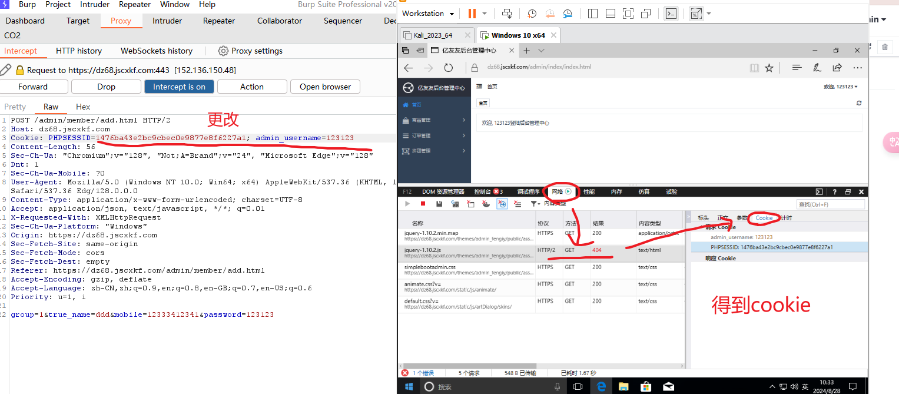

<!-- 这是一张图片，ocr 内容为：REQUEST RESPONSE IN三 PRETTY PRETTY RENDER HEX RAW RAWHEX POST /ADMIN/MEMBER/ADD.HTML HTTP/2 1 HTTP/2 500 INTERNAL SERVER ERROR 2SERVER: NGINX HOST:DZ68. JSCXKF.COM DATE:WED,28 AUG 2024 02:34:26 GMT ADMIN_USERNAME123123 COOKIE:PHPSESSID-1476BA43E2BC9CBEC0E9877E8F6227AL 45 CONTENT-TYPE:APPLICATION/JSON;CHARSET-UTF-8 CONTENT-LENGTH:56 "MICROSOFT ;V24", SET-COOKIE: PHPSESSID-1476BA43E2BC9CBECOE9877E8F6227AL: PATH-/ SEC-CH-UA:"CHROMIUM;V128","NOT:A-BRAND" EDGEV:128 6 DNT:1 SEC-CH-MOBILE:?0 CODE :10500 USER-AGENT:MOZILLA/5.0 (WINDOWS NT 10.0: WIN64: X64) APPLEWEBKIT/537.36 MESSAGE"页面错误!请稍后再试~ (KHTML. LIKE GECKO) CHROME/128.0.0.0 SAFARI/537.36 EDG/128.0.0.0 CONTENT-TYPE:APPLICATION/X-WWW-FORM-URLENCODED: CHARSET-UTF-8 10 ACCEPT:APPLICATION/JSON, TEXT/JAVASERIPT,*/ X-REQUESTED-WITH:XMLHTTPREQUEST 12SEC-CH-UA-PLATFORM:"WINDOWS" 13 ORIGIN:HTTPS://DZ68.JSEXKF.COM 14 SEC-FETCH-SITE: SAME-ORIGIN 失败 SEC-FETCH-MODE:CORS 16SECFETCH-DEST:EMPTY 7 REFER:HTTPS://DZ68.JSCXKF.COM/ADMIN/MEMBER/ADD.HTML ACCEPT-ENCODING:GZIP,DEFLATE 9ACCEPT-LANGUAGE: ZH-CN,ZH;Q-0.9,EN;Q-0.8,EN-GB:Q-0.7,EN-US;Q-0.6 PRIORIORITY: UEL, I 22  GROUP-1 TRTE_NAME-DDD MOBILE-12333412341 PASSWORD-123123 -->
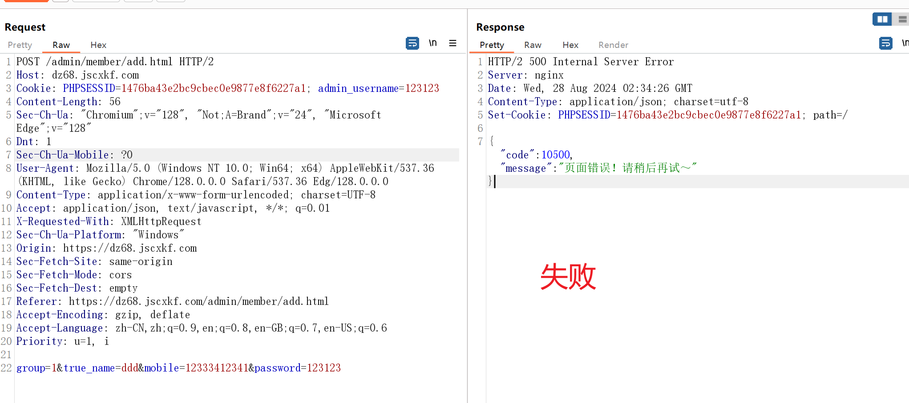

5.尝试sql注入

<!-- 这是一张图片，ocr 内容为：会员ID/编号: 关键字:% 请输入会员ID,编号 搜索 清空 户列表 尝试SQL注入 员等级 卡牌 等级 总金额 编号 昵称 ID 积分 品管理 春天红13533241035 VIP1 0 267 100265 查看 0.00 品列表 100264 春天 266 390 VIP2 380.00 查看 类管理 10 265 100263 VIP1 卓~1南 0.00 查看 单管理 10 苏之桂烟酒(可发票,不赊账) VIP1 264 100262 0.00 查看 团管理 -->
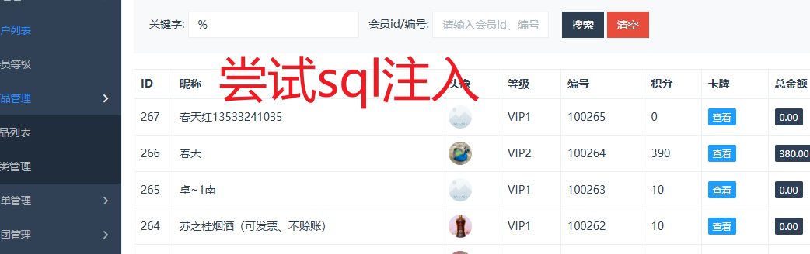

<!-- 这是一张图片，ocr 内容为：REQUEST RESPONSE IN                        三 RENDER PRETTY HEX PRETTY RAW HEX RAW GET /ACMIN/MEMBER/INDEX.HTML?KEYWORD-$ 1 HTTP/2 200 OK SUSER_IDHTTP/2 HOST:DZ68.JSCXKF.COM R:NGINX 对参数进行测试 WED, 28 AUG 2024 02:43:44 GMT S COOKIE: ADMIN_USERNAME ADMIN: PHPSESSID 1476BA43E2BC9CBEC0E9877E8F6227A1 HT-TYPE:TEXT/HTML;CHARSET-UTF-8 L Y P CONTENT SEC-CH-UA:"CHROMIUM";V""128","NOT:A-BRAND";"24","MICROSOFT VARY:ACCEPTENCODING 6 SET-COOKIE: PHPSESSID-1476BA43E2BC9CBEC0E9877E8F6227AL; PATH-/ EDGE "128" SEC-CH-MOBILE:?0 STRICT-TRANSPORT-SECURITY:MAX-AGE-31536000 SEC-CH-UA-PLATFORM:"WINDOWS"  9 <!DOCTYPE HTML> UPGRADE-INSECURE-REQUESTS: 1 8 DNT: 1 10<HTML> <HEAD> USER-AGENT:MOZILLA/5.0 (WINDOWS NT 10.0:WIN64:X64) <META CHARSET-"UTF-8"> APPLEWEBKIT/537.36 (KHTML,LIKE GECKO) CHROME/128.0.0.0.0 SAFARI/537.36 EDG/128.0.0.0 <!-- SET RENDER ENGINE FOR 360 BROWSER - S4150 <META NAME- RENDERER" CONTENT-"WEBKIT"> 0 ACCEPT: TEXT/HTML.APPLICATION/SHTML+XML.APPLICATION/XML:Q-0.9,IMAGE/AVIF.IM META HTTP-EQUIV X-UA-COMPATIBLE" C LECONTENTEIEIEDGE META NAME- VIEWPORT" CONTENT- WIDTH-DEVICE-WIDTH, LAGE/WEBP,IMAGE/APNG.水/*;Q-0.8,APPLICATION/SIGNED-EXCHANGE;V-B3:Q-0. INITIAL-SCALE1> 17 SEC-FETCH-SITE:SAME-ORIGIN SRC-  <SCRIPT TYPE"TEXT/JAVASCRIPT" SRC-" 18 SEC-FETCH-DEST:IFRAME REFERER:HTTPS://DZ68.JSCXKF.COM/ADMIN/MEMBER/INDEX.HTML /THEMES/ADMIN FENGIY/PUBLIC/ASSETS/JS/FINGERPRINT2.MIN.JS </SCRIPT> ACCEPT-ENCODING:GZIP,DEFLATE <LINK HREF-" 19 7ACCEPT-LANGUAGE: ZH-CN,ZH;Q-0.9,EN;Q-0.8,EN-GB;Q-0.7,EN-US;Q-0.6 18 P /THEMES/ADMIN FENGIY/PUBLIC/ASSETS/JS/LAYUI/CSS/LAYUI.CSS" REL PRIORITY:U-O,I -->
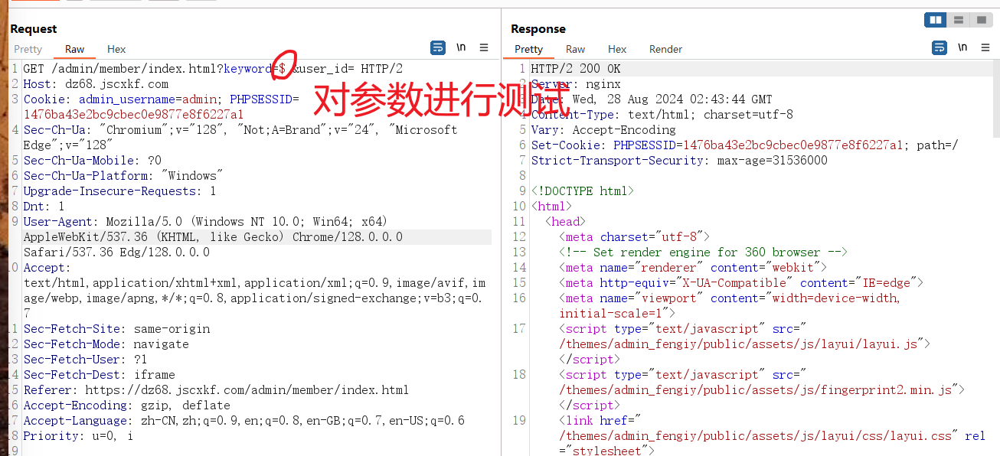

6.有图片上传，可以制作图片马

7.搜索域名下的子域名，对子域名进行渗透

8.鹰图搜索相关的站点

