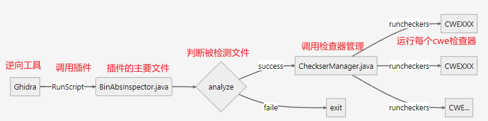
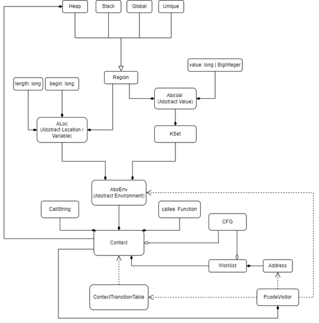
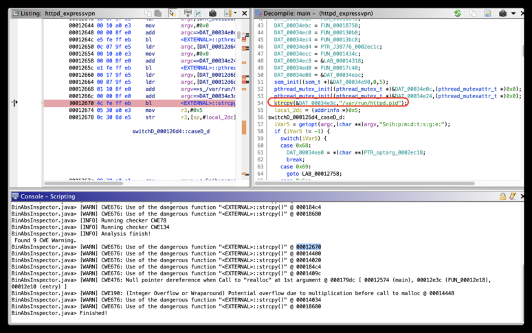
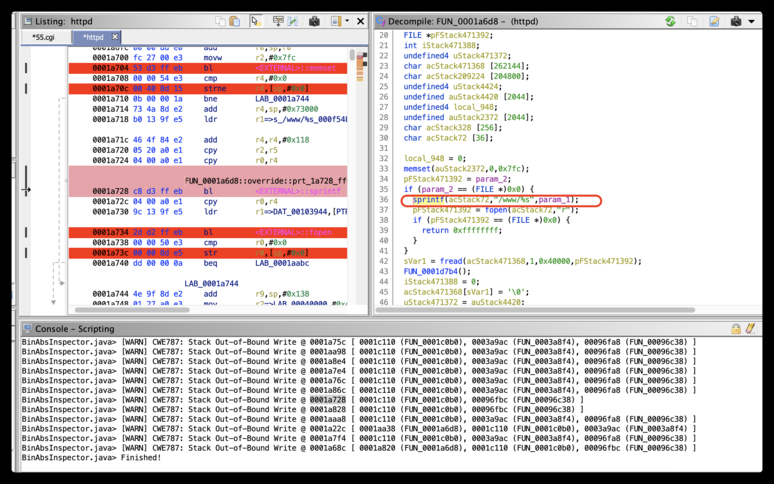
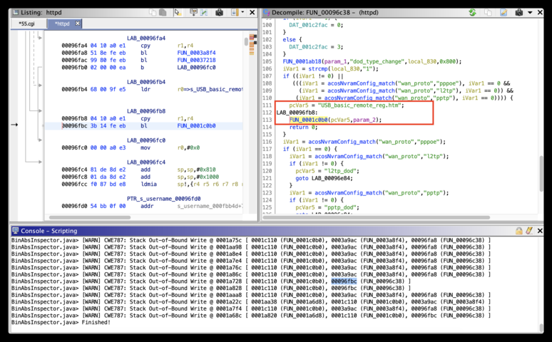
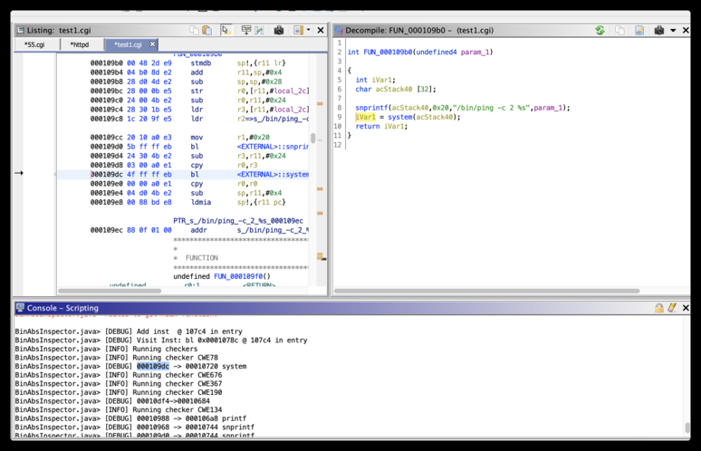
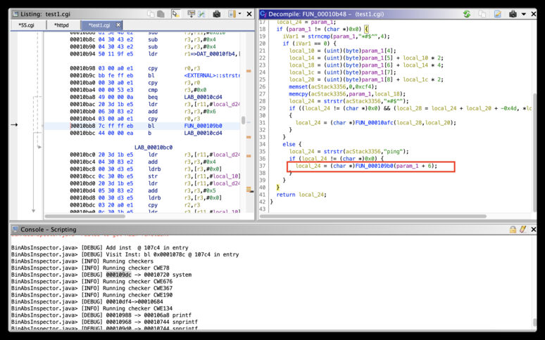
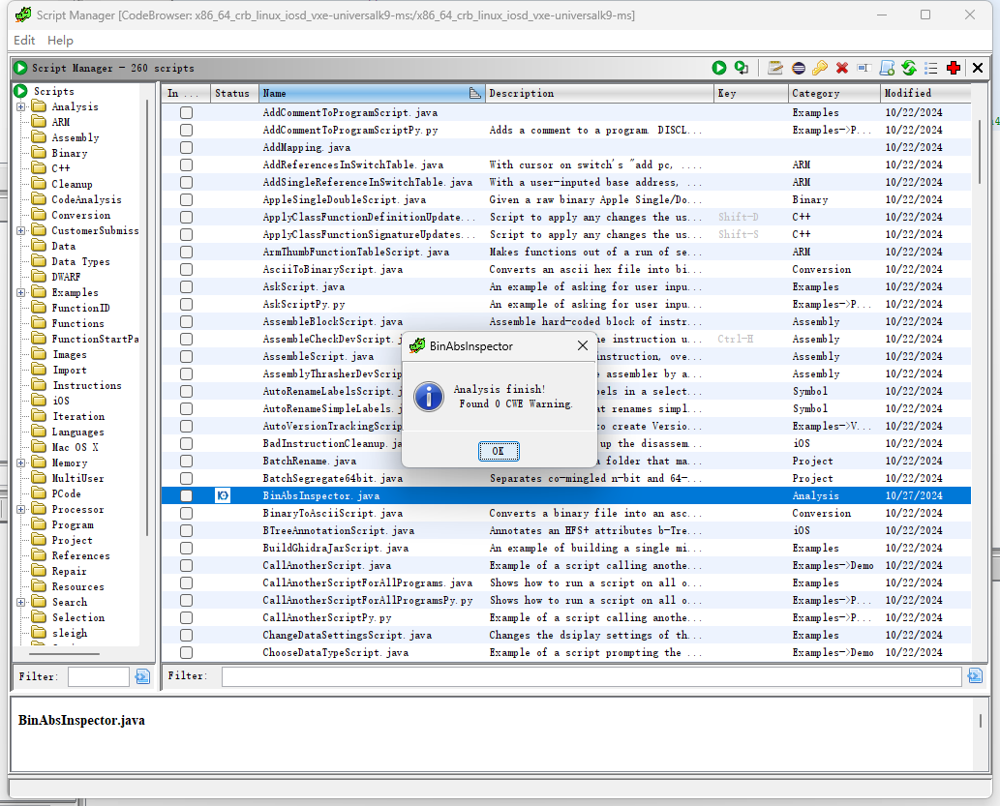
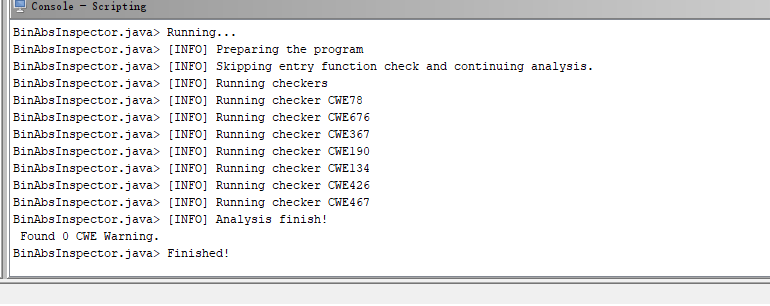

### 支持的检查器
+ [CWE78](https://cwe.mitre.org/data/definitions/78.html)  (OS Command Injection)
+ [CWE119](https://cwe.mitre.org/data/definitions/119.html) (Buffer Overflow (generic case))
+ [CWE125](https://cwe.mitre.org/data/definitions/125.html) (Buffer Overflow (Out-of-bounds Read))
+ [CWE134](https://cwe.mitre.org/data/definitions/134.html) (Use of Externally-Controlled Format string)
+ [CWE190](https://cwe.mitre.org/data/definitions/190.html) (Integer overflow or wraparound)
+ [CWE367](https://cwe.mitre.org/data/definitions/367.html) (Time-of-check Time-of-use (TOCTOU))
+ [CWE415](https://cwe.mitre.org/data/definitions/415.html) (Double free)
+ [CWE416](https://cwe.mitre.org/data/definitions/416.html) (Use After Free)
+ [CWE426](https://cwe.mitre.org/data/definitions/426.html) (Untrusted Search Path)
+ [CWE467](https://cwe.mitre.org/data/definitions/467.html) (Use of sizeof() on a pointer type)
+ [CWE476](https://cwe.mitre.org/data/definitions/476.htmll) (NULL Pointer Dereference)
+ [CWE676](https://cwe.mitre.org/data/definitions/676.html) (Use of Potentially Dangerous Function)
+ [CWE787](https://cwe.mitre.org/data/definitions/787.html) (Buffer Overflow (Out-of-bounds Write))

### 检测流程说明：
流程：

<!-- 这是一张图片，ocr 内容为：CWEXXX RUNCHECKERS 运行每个CWE检查器 调用检查器管理 判断被检测文件 逆向工具 CHECKSERMANAGERJAVA 调用插件 RUNCHECKERS CWEXXX 插件的主要文件 SUCCESS BINABSLNSPECTOR JAVA GHIDRA RUNSCRIPT ANALYZE FAILE CWE.... EXIT RUNCHECKERS -->

在BinAbsInspector中整个运行时环境被分为Local（抽象栈）、Heap（抽象堆）、Global（全局变量和数值）、Unique（对应Ghidra中产生的临时变量区）和Register（注册区）五种区域。在这些不同的抽象区域上加上偏移量数值offset，则可以组成一个抽象变量ALoc（Abstract Location/Variable）。因为在二进制程序中，变量并非全部显式表示，ALoc实际上是对程序中变量的一种指示和识别。不同的程序点，记录此处可能需要的抽象变量及其对应的抽象值，称为AbsEnv（Abstract Environment）。

因为是静态的抽象，那么对于一个程序点的一个抽象变量来说，它可能会包含多个抽象值，这些抽象值组成了一个集合。虽然这个集合可能会包含无数个元素，但是为了保证整个计算过程实践上可收敛，令此集合取一个上限K，这种集合称为KSet。一旦其中包含的元素超过K，则将其设为一个Top，即包含所有抽象值。此方法与前人重要相关工作[Jakstab[9]](http://www.jakstab.org/)中的KSet很相似。KSet支持多种运算数和逻辑腐蚀。另外每个KSet对象还包含一个污点的位图，用于跟踪多个污点的同时传播，从而实现静态污点分析。这样AbsEnv便可以认为是一个从Aloc到KSet的map。

由于BinAbsInspector的分析是上下文敏感的，对于被调用者的上下文即Context，我们使用最近的调用字符串（call site）来进行唯一标识。对于同一个被调用者，不同的调用者会生成不同的Context，一般只记录最近的几个调用者。这样我们就把程序点处的AbsEnv记录在不同的Context中。

这里，对于流程内部的不动点计算BinAbsInspector里使用了worklist算法，即把待处理的程序点不断地放入worklist中，直到其空状态。流程间分析主要存在于不同的Context之间的转变，这是通过call/return指令的语义实现的。这样通过对整个程序指令的迭代计算值并开始Context的转换，其附属的worklist得到逐一处理，直到所有的worklist计算结束，最后达到不动点。

通过这整个的计算过程，得到所有可能的上下文以及对应的每个程序点的AbsEnv。这样实际上得到了一个对程序行为可靠的说明，给出了这些数据抽象流的信息，我们便可以进行内存破坏漏洞、命令注入漏洞等多种漏洞的检测了。

<!-- 这是一张图片，ocr 内容为：HEAP STACK GIOBAL UNIQUE VALUE:LONGI BIGINTEGER REGION LENGTH;LONG BEGIN:LONG ABSVAL (ABSTRACT VALUE) ALOC (ABSTRACT LOCATION/ KSET VANIABLE) ABSENV (ABSTRACT ENVIRONMENT) CALLEE:FUNCTION CALLSTRING CFG CONTEXT WORKLIST ADDRESS CONTEXTTRANSITION TABLE PCODEVISITOR -->

#### 技术细节：
##### 抽象内存模型
第一个问题是如何建立抽象内存模型。我们采用[1]中的方法，将整个运行时环境划分为几个抽象分区：局部（栈）区域、堆区域、全局区域、唯一区域和寄存器区域。局部区域代表每个函数的栈内存。堆区域在不同上下文下的每个分配点创建，这意味着我们的堆建模是上下文敏感的。此外，每个堆区域包含自身的属性，包括大小、有效性等。全局区域表示两种抽象值：全局变量的地址和（数组和整数）常量。唯一区域是一个特殊区域，包含 Ghidra 创建的所有唯一（临时）变量。寄存器区域也是一个单例区域，用于容纳寄存器。每个区域还有一个随机的基值。

##### 抽象位置（ALoc）
抽象位置（ALoc）被视为抽象变量。ALoc 由区域基、区域内的起始偏移量和从起始偏移量的长度组成。

##### 抽象值（AbsVal）
抽象值（AbsVal）与具体值不同。抽象值由两个组成部分构成：一个是该抽象值所处的区域组件，另一个是通过区域基加上区域内偏移量计算得出的值组件。抽象值可以表示内存地址或立即数。抽象值的大小是灵活的，以适应任意长度的值，对于大于 64 位的值使用“BigInteger”，对于较小的值使用“long”。

##### KSet
KSet 是一个特殊的集合，容纳大小限制为 K 的抽象值。一旦 KSet 内部的抽象值数量超过 K，该 KSet 将转变为 Top：一个特殊的 KSet，表示所有抽象值。这与 Jakstab[3] 的做法类似。此外，KSet 还支持各种算术操作，例如加法、减法、乘法、除法、位移、逻辑运算、截断等。此外，每个 KSet 包含一个污点位图，以静态方式跟踪多个污点传播。

##### 抽象环境（AbsEnv）
抽象环境（AbsEnv）是存储每个程序点程序状态的核心数据结构。AbsEnv 是从 ALoc 到 KSet 的映射。可以理解为记录所有可访问的抽象变量及其在每个程序点对应的可能抽象值。我们还提供修改、查询、合并等操作，以进行迭代的不动点计算。某些数据结构（AbsEnv、KSet）的对象在内存中是无处不在的，内容重复。为此，我们还利用持久数据结构（即 JImmutableMap、JImmutableSet）来减少内存开销。

##### 上下文
上下文是另一种基本数据结构。它基于调用字符串，类似于调用栈，但只记录 K 个调用点。因此，对于每个被调用函数及其唯一的最近 K 个调用点，都会有一个独特的上下文。上下文还容纳在不同上下文下每个程序点前后的抽象环境，这意味着上下文是抽象环境的容器。上下文可以通过调用和返回指令相互转换。转换关系由另一个数据结构称为 ContextTransitionTable 记录，为调用指令插入新转换项，并为返回指令查询现有转换项，以实现上下文敏感的跨过程分析。

##### 图结构
Ghidra 并不提供控制流图（CFG）和调用图（CG），因此我们需要从 Ghidra 的流信息和调用/返回指令生成这些图。CFG 节点基于每条汇编指令，而 CG 节点实际上代表每个函数。事实上，CFG 节点是程序点的另一种形式。通常，图数据结构提供查询前驱和后继的接口。更具体地说，CFG 还提供计算弱拓扑排序（WTO）[2]和识别循环组件的实现。

##### 工作列表
工作列表负责迭代不动点计算，并附加到每个相应的上下文。它存储等待处理的 CFG 节点。这些节点在其前驱节点的抽象环境发生变化时插入。工作列表中的 CFG 节点按 WTO 排序，以避免冗余计算。因此，不动点计算的方法采用了 Bourdoncle[2] 开发的递归迭代策略。

我们的工作列表实现用于过程内分析。对于跨过程分析，我们需要考虑函数指针和面向对象程序中跨过程控制流图（ICFG）的可变性。因此，我们不能直接在 ICFG 上利用工作列表。相反，每个上下文都有自己的工作列表，上下文根据调用/返回关系组织，并具有不同的处理优先级。换句话说，我们尽力保持不变，即被调用者的上下文的处理优先级高于调用者，尽管 ICFG 中存在循环结构。

##### PcodeVisitor
PcodeVisitor 基本上描述了 Pcode 的操作语义，但不包括与浮点相关的 Pcode。实际上，我们的分析器在 Pcode 中间表示上工作，而不是直接在汇编上进行，以实现架构无关的抽象解释。PcodeVisitor 利用抽象环境的接口来模拟 Pcode 在我们抽象域中的真实行为，例如算术操作、加载/存储操作、调用/返回操作等。同时，PcodeVisitor 还负责在不同抽象环境之间的污点传播。

#### 漏洞匹配机制
解释漏洞具体是怎么检测的，一共有两个重要点，一个是PcodeVisitor.java对pcode进行visit的时候，另一个是visit之后(checkers目录)。

**visit时：**

1.visit_LOAD(visit_STORE类似)

1.1: 检查是否存在空指针解引用漏洞

1.2: 对于input1对应的KSet中的AbsVal

1.2.1: region为heap，调用checkUseAfterFree函数检查UAF，如果heap的valid为false，则证明存在UAF漏洞(读取已经被释放的内存)

1.2.2: region为heap或者local，调用checkHeapOutOfBound函数或者checkStackOutOfBound函数检查OOB

1.2.2.1: checkHeapOutOfBound: 如果AbsVal的offset为负或者大于region的size，则证明存在越界漏洞(越界读取)

1.2.2.2: checkStackOutOfBound: 类似

1.3: 设置output的KSet2.visit_CALL

2.1: 对于external函数(基本是一些C库函数)调用invokeExternal函数去调用env/funcs/externalfuncs中的实现

2.2: 对于std函数调用invokeStd函数去调用env/funcs/stdfuncs中的实现

2.3: 在调用invokeExternal函数或者invokeStd函数之前调用checkExternalCallParameters函数检查函数的参数，是否有MemoryCorruption类的漏洞

2.4: 调用adjustLocalAbsVal函数更新AbsVal

2.5: 新建context，将新context加入worklist，将当前callSite和context放入ContextTransitionTable，将新context或当前context加入active stack或pending stack

3.visit_RETURN

3.1: 设置context的exitvalue(在return时的AbsEnv)

3.2: 根据ContextTransitionTable取出所有callstring，根据不同的callstring获取对应的context并将callsite加入到worklist还是前面的例子，当处理到ccc中的return指令时，此时的callstring如果是[0, 0xY, 0xA]将0xAC加入到worklist；此时的callstring如果是[0, 0xY, 0xB]将0xBC加入到worklist

4.visit_INT_ADD/visit_INT_LEFT/visit_INT_MULT这三个指令进行污点跟踪，输入源来自scanf/sscanf/fscanf/fgets/fgetc/rand/recv就表示可能会发生整数溢出，其他算数指令基本上都是对input的KSet进行相应的计算并给output

**visit后：**

以CWE78为例：对于system/popen/execl/execlp函数(下面以system函数为例)，获取toAddress(system函数地址)和fromAddress(BL system指令的地址)和对应的函数callee和caller，调用checkFunctionParameters函数，checkFunctionParameters函数中对于caller的每一个context的每一个函数参数，如果：1.kSet为null并被污点标记；2.kSet不为null，其中存在AbsVal，包含此AbsVal的AbsEnv中的kSet被污点标记。则说明存在命令注入漏洞

#### 代码分析：
##### 每个class的功能：
**CallGraph.java: **调用图  
**CFG.java:** CFG  
**ConstraintSolver.java:** 通过Z3进行约束求解(感觉作用不是很大，本来也可以disable掉)  
**GraphBase.java: **提供对图进行操作的函数  
**InterSolver.java: **过程间分析  
**Worklist.java: **保存需要处理的CFG  
**region目录：**表示不同的”区域”，例如Heap.java表示Heap，其中boolean类型的valid表示Heap空间是否有效  
**funcs目录：**对C库函数和std函数调用的处理，比如调用free之类释放内存的函数时就需要把Heap空间的valid设为false，而调用malloc之类分配内存的函数时就需要把Heap空间的valid设为true，以检测UAF等漏洞  
**Context.java: **基于callstring实现上下文敏感的分析有两个Stack用来存储context，active和pending。从popContext函数中可以看出只有当active stack处理完了才处理pending stack。整个程序运行的流程是从mainLoop中开始的，一个context中的worklist空了之后就调用popContext函数取下一个context。例子：main—yyy—aaa/bbb—cccmainLoop中context一共会switch 10次：(1)main调用yyy，(2)yyy调用aaa，(3)aaa调用ccc，(4)ccc返回，(5)aaa返回，(6)yyy调用bbb，(7)bbb调用ccc，(8)ccc返回，(9)bbb返回，(10)yyy返回。首先是在initContext函数中将入口点地址插入worklist，正常情况下visit完一条指令将下一条指令加入worklist，除此之外还有处理RETURN指令的时候会将调用点的地址加入worklist；处理CALL指令的时候会将call指令所在的地址加入worklist(这两个一样)；处理分支指令时将两个分支的地址加入worklist

**ContextTransitionTable.java: **使用Address到callstring数组组成的TreeSet的HashMap，在call/return指令中维护context的转换关系

**TaintMap.java:** 使用taintSourceToIdMap进行污点跟踪。taintSourceToIdMap是一个source到integer的map，source由callSite，context和function组成

#### 论文参考《WYSINWYX:What You See Is Not What You eXecute》
> BinAbsInspector工具参考此论文实现
>

##### 论文解读
1.二进制文件中包含汇编代码，没有源代码中的变量，不好分析。

2.建立抽象模型：因此需要从汇编代码中恢复出抽象变量（ALoc），并通过三元组（区域、长度、起始地址）表示。抽象变量会有一个可能的抽象值集合（KSet）。从 ALoc 到 KSet 的映射组成了抽象环境（AbsEnv）。

3.算法：介绍了抽象转换器（AbstractTransformer），用于计算 KSet；讨论了在单个函数及多函数调用（间接跳转）的情况下，如何进行静态分析；

4.上下文敏感分析：通过使用 callstring 来处理上下文敏感的情况，保持对函数调用上下文的跟踪。

5.ASI 算法：结构体的识别和恢复，通过内存访问模式来分解结构体。

#### 不足：
1.漏洞检测模型还需要优化，如下`strcpy(&DAT_00034e3c,"/var/run/httpd.pid")` 一个固定值也判断为可能有漏洞<!-- 这是一张图片，ocr 内容为：X QU山 DECOMPILE:MAIN-(HTTPD_EXPRESSVPN) LISTING:HTTPD.EXPRESSVPN 43 DAT_00034EBC FUN_00018750; NOV 000126440010A0E3 ARGV #0XE ADD DAT_0034EC0 FUN_000130B8; 0001264800008180 ARGCW>DAT_00034E0< DAT_00034EC4  FUN_00013BC8; <EXTERNAL>:PTHREI 19 0001264C  E5 FE FF EB 1DR PTR_J38776_0002EC1C; DAT_00034ED4 PT 00012650 0C 07 9F E5 ARGC,[DAT_00012D6< DAT_00034ECC FUN_0001434C; 000126540010A0E3 MOV ARGV,WEXE 中相相知关级SIS DAT_00034EC8 SLAB 00014318; 0001265800008FEE PPE ARGCW>DAT_00034E2< 1G DAT_00034EDE  FUN_00017C40; 0001265C EL FE FF EB <EXTERNAL>:PTHREI IDR DAT_00034E08 &DAT_00034EAC; 00012660 00 17 91 E5 ARGV,[DAT_00012D6E SEM_INIT((SEM_T*)&DAT_00034E98.0,5); 1DR 00012664 00 07 91 E5 ARGC,[DAT_00012D6< PTHREAD AUTEX INIT(PTHREAD,MUTEX T *)SDAT EEE34EEC,(PTHREAD NUTEXATTR_T *)8XE); PPE 0001266801108FCO ARGYW/S/VAR/RUN/T NTHREAD MUTEX FAIT((NTHREAD MUTEX * * *)BNAT EEE34EZA,(PTHREADLNUTEXATTR_T *)BXE); E001266C 00 00 81 E0 PPE ARGCW>DAT_00034E3( 中 200126704CFEFFEB (STRCOY(SDAT 00034E3C,"/VAR/RUN/HTTOD.PID"): 1Q <EXTERNAL>:STRCP) 00012674 05 30 A0 E3 LOCAT_2DC(ADDRINFO*)0X5; MOV R3,#0X5 5533 EE012678 0C 30 8D E5 R3,[SP,#LOCAL_2DC] SWITCHD_000126D4_CASED_D: STR IVAR5GETOPT(ARGC,(CHAR **)ARGV,"SNIH:P:M:D:T:S:G:E:"); IF(IVAR5 ! -1)( SWITCHD_000126D4::CASED_D SWITCH(IVARS) CASE 0X68: DAT_00034EA0 *(CHAR ***)PTR_OPTARG_002EC18; BREAK; CASE 8X69: GOTO LAB_00012758; CONSOLE-SCRIPTING (BINABSINSPECTOR,JAVAL (WAN)  CHE676: USE OF THE DANGEROUS FUNCTION " EEXTERML>ISTRCPYL)" @ D POE184C A> (WARN) CME676: USE OF THE DANGEROUS FUNCTION "<EXTERRIAL>ISTRCPY()" &  20018690 BINABSINSPECTOR.JAVA> [W BINABSINSPECTOR,JAVA>[INFO] RUNNING CHECKER CWE78 BINABSINSPECTOR.JAVA>[INF0] RUNNING CHECKER CWE134 BINABSINSPECTOR.JAVA> [INF0] ANALYSIS FINISH! FOUND 9 CWE WARNING. [BINNBSINSPECTOR,JAVI) (WAW) CHE676: USE OF THE DANGEROUS FUNCTION ",EXTERIAL>:STRCPY(" A 00012678 {BINABSINSPECTOR,JAVE) (MASW) CHE676: USE OF THE DANGEROUS FUNCTION "-EXTERRIALI:STRCPY()" @ EDE144E [BINABSINSPECTOR,JAVA) (MAW) CHES76: USE OF THE DANGEROUS FUNCTION " EXTERRIALI:STRCPY()"  89014820 BINABSINSPECTOR,JAVA)  WARW)  CHE676: USE OF THE DANGEROUS FUNCTION "CEXTERRIALI:STRCPY()" @ GEEIDECA BINNBSINSPECTOR,JAVE) (MARW) CHE676: USE OF THE DANGEROUS FUNCTION " EXTERIWL>:STRCPY()" E E GEE1489( LEE12E10(ENTRY)] DINABSINSPECTOR,JAVD)  DWARN)  CHE676: USE OF THE DANGEROUS FUNCTION " QEERMLZ3ISTRCPY()" @ D0014034 (BINABSINSPECTOR,JAVD) (WARY)  CHE676: USE OF THE DANGEROUS FUNCTION "-EXTERRIALZIISTRCPY()" GEE186 BINABSINSPECTOR.JAVA> FINISHED! -->

如下所示，`sprintf(acStack72,"/www/%s",param_1);`  `param_1` 传进来的是一个固定值，`BinAbsInspector`也说他可能有栈溢出，误报率较高。没有判断数据来源是否真实可控，只是判断了是否发生改变，实际漏洞挖掘效果差。

<!-- 这是一张图片，ocr 内容为：X DECOMPILE:FUN_00096C38-(HTTPD) LISTING:HTTPD *55.CGI *HTTPD DAT_001C2FAC - 0; 100 101 LAB_00096FA4 ELSEL 102 00096FA40410 A0 E1 RL, R4 CPY DAT_001C2FAC 3: 103 000961A8 51 8E FE EB 1Q FUN_0003A814 104 1Q EO096FAC99880FEEB FUN_00037218 FUN_001AB18(PARAM_1,"DOD_TYPE_CHANGE",TOCAL_830,0X800); 105 EEE96FBO0200000CA B LAB_00096FCE IVAR1 -STRCMP(LOCAL_830,"1"); 106 IF (IVAR1 I E ) 11 107 LAB_000961B4 108 ((IVAR1 ACOSNVRARCONFIG_MATCH("WAN-PROTO","PPPOE").IVAR1 IVAR1 2  000961B4 68 00 9F E5 ROMS_USB_BASIC_RENO1 LDR (IVARI ACOSHVRANCONFIG_MATCH("WAN-PROTO","L2TP"),IVAR1 6))65 109 (IVARI ACOSNVRANCONFIG MATCH("WAN PROTO","PPTP"),IVAR1 E))))))( 110 PCVAR5 "USB_BASIC_REMOTE_REG.HTN"; 111 LAB_000961B8 LAB_00096FB8: 112 00096FB80410 A0 E1 R1,R4 CPY FUN_0001C0BE(PCVAR5,PARAM_2); 113 20096FBC 3B 14 FE EB 19 FUN_0001C0BE 114 RETURN     115 LAB_00096FC0 116 IVARL ACOSNVRANCONFIG_MATCH("WAN_PROTO","PPOE"); 00096FC000088023 8,40XE IF(IVAR1-0)( 117 118 IVAR1 ACOSNVRANCONFIG_MATCH("WAN_PROTO","12TP"); LAB_00096FC4 119 IF(IVAR1 (I ) 00096FC4 81 DE 8D EZ ADD SP,SP,#0X810 120 PCVAR5 "L2TP_DOD''; 8 01 DA 8D E2 000961C8 ADD SP,SP,WAX1000 121 GOTO LAB_00096E84; C1087BDE8 EE096FCC LDMIA SP!.1R4 R5 R6 122 IVAR1 ACOSNVRANCONFIG_MATCH("WAN_PROTO","PPTP"); 123 PTR_S_USERNAME_0096FD0 IF(IVAR1(M O)( 124 E00961D0 054BB0100 ADDR 125 S_USERNAME_000FBB4D+] PCVAR5 CONSOLE-SCRIPTING WRITE STACK OUT-OF-BOUND WRITE @001A75C [ E0010 [ EEE1C11E (FUN_EEELCEBE), E9E3A9AC (FUN EEE3A8F4),EE96FA8 (FUN EEE96C38) [WARN] CWE787:S BINABSINSPECTOR.JAVA> CWE787:STACK OUT-OF-BOUND WRITE@ E01AA98 [E [WARN] [ EEE1C11E (FUN EEE1CEBE),EE3A9AC (FUN_EEE3ABF4),EEE96FA8 (FUN_EEE96C38) BINABSINSPECTOR.JAVA> BINABSINSPECTOR.JAVA> [WARN] CWE787 ; STACK OUT-OF-BOUND WRITE Q BOELA7ED [ 8003CILE (FIN - 800), 900339863390614),0009650896508 (RIN(90) BINABSINSPECTOR.JAVA> [EEE1CL1E (FUN EEE1CEBE),EE3A9AC (FUN EEE3ABF4), 60E96FA8 (FUN EEE96C38) 7:STACK  OUT-OF-BOUND WRITE @ E001A76C [WARN] CWE787: BINABSINSPECTOR.JAVA> [WARN] CWE787: STACK OUT-OF-BOUND WRITE @ 0001A86C BINABSINSPECTOR.JAVA> (E3E1C110 (FUN G001C8BO), 80E3A9AC (FUN E9E3A8F4). 90096FA8 (FUN_EEE96C38) [WARN] CWE787:STACK OUT-OF-BOUND WRITE @ 0001A728 [6801C110 (FUN_0001CEBE).8E96FBC (FUN_00096C38) ] BINABSINSPECTOR.JAVA> [WARN] CWE787: STACK OUT-OF-BOUND WRITE BINABSINSPECTOR.JAVA> [6001C118 (FUN_6001C0BE).80096FBC (FUN_00096C38) ] 0001A828 [WARN] CWE787: STACK OUT-OF-BOUND WRITE @ OE (EEE1C110 (FUN EEE1CEBE),EAE3A9AC (FUN EEE3A814),00096FA8 (FUN EEE96C38)] BINABSINSPECTOR.JAVA> OO01AAA8 [EEELAA38 (FUN EEELA6D8). 69E1C11E (FUN E001CEBE), 83E3A9AC (FUN E9E3A8F4) [WARN] CWE787: STACK OUT-OF-BOUND WRITE @ EE01A22C BINABSINSPECTOR.JAVA> (EEEIC11E (FUN 8001C8BE), 69E3A9AC (FUN E9E3A8F4), 89096FA8 (FUN E0096C38) [WARN] CWE787: STACK OUT-OF-BOUND WRITE @ 0001A7F4 BINABSINSPECTOR.JAVA> [ E9ELA820 (FUN EEELA6D8), 89E1C110 (FUN EEE1C8BE),  00096FBC (FUN E3E) BINABSINSPECTOR.JAVA> [WARN] CWE787:STAC EEE1A68C :STACK OUT-OF-BOUND WRITE BINABSINSPECTOR.JAVA> FINISHED! -->

最简单的命令注入漏洞也没有检测出来(有点失望)。看样子对于这种`snprintf` 函数的数据流追踪没有分析，函数间接导致的内存变化`BinAbsInspector`  并没有进行污点分析。

结果：

<!-- 这是一张图片，ocr 内容为：SCRIPT MANAGER (CODEBROWSER:286 64.CRB,LINUX JOSD YXE-UNIVERSALL9-MS/>86 64.CB LINUX  JXE-UNIVERSALL EDITHELP 小士 SCRIPT LANAGER - 260 SCRIPTS X SCRIPTS MODIFIED CATEGORY DESCRIPTION ITAME KEY STATUS ANALYSIS :00000000000000000000 10/22/2024 ADDCOMMENTTOPROGRAMSCRIPT.JAVA EXAMPLES ARIT 10/22/2024 ADDS A COMMENT TO A PROGRAM DISCL. ADDCOMMENTTOPROGRAMSCRIPTPY EXAMP LES-P... ASSEMBLY 10/22/2024 ADDLLAPPING.JAVA BINARY 10/22/2024 ARI WITH CURSOR ON SWITCH'S "ADD PC, ADDREFERENCESINSWITCHTABLE.JAVA C++ 10/22/2024 WITH A USER-INPUTED BASE ADDRESS, ARII ADDSINGLEREFERENCEINSWITCHTABLE. JAVA CLEANUP 10/22/2024 APPLESINGLEDOUBLESCRIPT.JAVA BINARY CODEANALYSIS GIVEN A RAW BINARY APPLE SINGLE/DO. 10/22/2024 CONVERSION APPLYCLASSFUNCTIONDEFINITIONUPDATE.. SHIFT-D C++ SCRIPT TO APPLY ANY CHANGES THE US 田 CUSTOMERSUBMISS SHIFT-S 10/22/2024 C++ APPLYCLASSFWNCTIONSIGNATUREUPDATES.. SCRIPT TO A CHANGES THE APPLY ANY US DATA 10/22/2024 ARIC ARMTHUMBFUNCTIONTABLESCRIPT.JAVA MALIES OF O1 OUT TUNCTIONS DATA TYPES 10/22/2024 CONVERSION ASCIITOBINAXYSCRIPT.JAVA CONVERTS HEX INTO AN ASC1 DWARF  ASL:SCRIPT.JAVA 10/22/2024 EXAMP LES OFASLING AN EXAMPLE T01 NDTR USE1 国 EXAMP LES 10/22/2024 ASKSCRIPTPY.PY EXAMP LES-P. ASKING AN EXAMPLE OF FOR UPU LISE FUNCTIOND ASSEMBLEBLOCL:SCRIPT.JAVA ASSEMBLY 10/22/2024 ASSEMBLE HARD-CODED BLOCL: FUNCTIONS CTR1-H 10/22/2024 ASSEMBLY FUNCTIONSTARTPA ASSEMBLECHECL:DEVSCRIPT.I 1E INSTRUCTION X BINABSINSPECTOR IMAGES 10/22/2024 ASSEMBLY ASSEMBLESCRIPT.JAVA INSTRUCTION. OVE IMPORT 10/22/2024 ASSEMBLYTHRASHERDEVSCRIP ASSEMBLY ASSEMBLER BY INSTRUCTIONS ANALYSIS FINISH! SYMBO1 10/22/2024 AUTORENAMEL ABELSSCRIPT. ELS IOS FOUND 0 CWE WARNING SYMBOL 10/22/2024 AUTORENAME SIMP LELABELS. ITERATION EXAMPLES->V.... 10/2024 AUTOVERSIONLRACKINGSCRIP LANGUAGES IOS 10/22/2024 BADINSTRUCTIONCLEANUP.JA LLAC  OS X OX PROJECT 10/22/2024 BATCHRENAME.JAVA LEMORY PROJECT BATCHSEGREGATE64BIT. JAVA LULTIUSER  SEPARATES CO MINGLED AND 豆 PCODE 10/27/2024 ANALYSIS BINABSINSPECTOR.JAVA 0000000000 PROCESSON CONVERTS A BINARY FILE INTO AN ASC. 10/22/2024 BINARYTOASCIISCRIPT.JAVA CONVERSION PROGRAM 10/22/2024 IOS BTREEAMOTATIONSCRIPT. JAVA ANNOTATES AN HFST ATTRIBUTES B-LRE... PXOJECT 10/22/2024 BUILDCHIDRAJARSCRIPT.JAVA EXAMP LES AN EXAMPLE OF BUILDING A SINGLE MI. REFERENCES EXAMP LES->DEMO 10/22/2024 CALLANOTHERSCRIPT.JAVA EXAMPLE OF A SCRIPT CALLING ANOTHE. REPAIR EXAMP LE SHOWS HOW TO RUN A SCRIPT ON ALL O LES10/22/22/2024 CALLANOTHERSCRIPTFORALLPROGRAMS.JAVA RESOURCES EXAMP LES->P... 10/22/2024 CALLANOTHERSCRIPTFORALLPROGRAMSPY.PY  SHOWS HOW TO RUN A SCRIPT ON ALL SEARCH EXAMP LES->P... 10/22/2024 CALLANOTHERSCRIPTPY.PY EXAMPLE OF A SCXIPT CALLING ANOTHE.. SELECTION SLEIGH EXAMP LE CHANGES THE DSIPLAY SETTINGS OF TH.. CHANGEDATASETTINGSSCRIPT.JAVA 10/22/2024 EXAMPLES-DEMO 10/22/2024 CHOOSEDATATYPESCRIPT.JAVA EXAMP LE OF A SCRIPT PROMPTING THE FILTER: FILTER: BINABSINSPECTOR.JAVA -->

<!-- 这是一张图片，ocr 内容为：CONSOLE - SCRIPTING BINABSINSPECTOR.JAVA> RUNNING... [INFO] PREPARING BINABSINSPECTOR,JAVA> THE PROGRAM [INFO] SKIPPING BINABSINSPECTOR.JAVA> NG ENTRY FUNCTION CHECK AND CONTINUING ANALYSIS. [INFO] RUNNING CHECKERS BINABSINSPECTOR.JAVA> [INFO] RUNNING CHECKER CWE78 BINABSINSPECTOR.JAVA> [INFO] RUNNING CHECKER CWE676 BINABSINSPECTOR.JAVA> [INFO] RUNNING CHECKER CWE367 BINABSINSPECTOR.JAVA> [INFO] RUNNING CHECKER CWE190 BINABSINSPECTOR.JAVA> [INFO] RUNNING CHECKER CWE134 BINABSINSPECTOR.JAVA> [INFO] RUNNING CHECKER CWE426 BINABSINSPECTOR.JAVA> BINABSINSPECTOR.JAVA> [INFO] RUNNING CHECKER CWE467 [INFO] ANALYSIS FINISH! BINABSINSPECTOR.JAVA> FOUND 0 CWE WARNING. BINABSINSPECTOR.JAVA> FINISHED! -->

#### 参考文献：
1.IOT大佬：[https://www.wolai.com/nocbtm/aSHsPHF3QG8RueRMT7xiKQ](https://www.wolai.com/nocbtm/aSHsPHF3QG8RueRMT7xiKQ)

2.51CTO：[https://www.51cto.com/article/714799.html](https://www.51cto.com/article/714799.html)

3.论文分析：[https://houjingyi233.com/2023/03/05/%E4%BA%8C%E8%BF%9B%E5%88%B6%E6%96%87%E4%BB%B6%E9%9D%99%E6%80%81%E5%88%86%E6%9E%90%E6%BC%8F%E6%B4%9E%E6%8C%96%E6%8E%98%E6%8A%80%E6%9C%AF-BinAbsInspector/](https://houjingyi233.com/2023/03/05/%E4%BA%8C%E8%BF%9B%E5%88%B6%E6%96%87%E4%BB%B6%E9%9D%99%E6%80%81%E5%88%86%E6%9E%90%E6%BC%8F%E6%B4%9E%E6%8C%96%E6%8E%98%E6%8A%80%E6%9C%AF-BinAbsInspector/)

