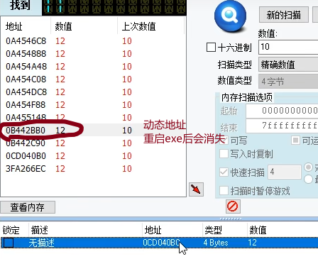
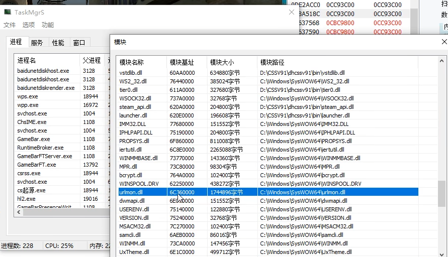
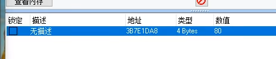
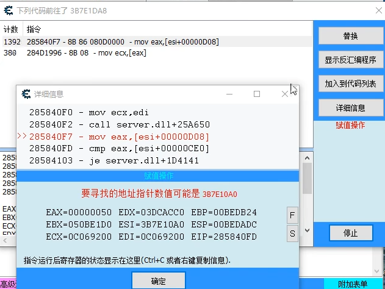
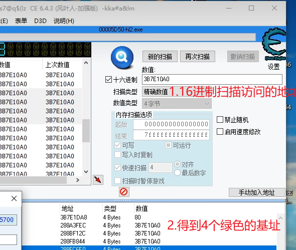
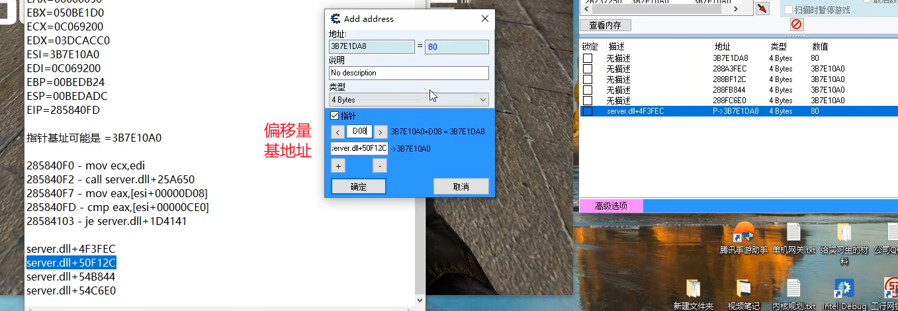
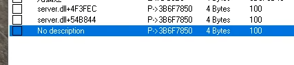
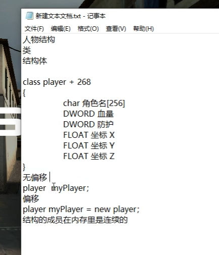

#### tips：
1.黑色的是动态地址，绿色的是基址

<!-- 这是一张图片，ocr 内容为：找到 团团 新的扫描 上次数值 数值 地址 数值: 12 10 0A4546C8 10 十六进制 10 12 0A454888 扫描类型 精确数值 10 0A454A48 12 10 0A454C08 数值类型 12 4字节 10 0A454DC8 12 内存扫描选项 10 0A454F88 12 0000000000 起始 10 0A45514812 动态地址 7FFFFFFFFF 结束 OB442BB0  12 10 重启EXE后会消失 可运 可写 0B442C90 12 10 写入时复制 0CD040B0 12 10 10 3FA266EC  12 快速扫描 扫描时暂停游戏 查看内存 锁定描述 地址 类型 数值 OCD040BC 4 BYTES 无描述 -->

2.TaskMgrs可以查看进程的模块基址

<!-- 这是一张图片，ocr 内容为：NDE2ACCO 0CC93C00 OCC93C00 TASKMGRS BA518C 0CC93C00 0CC93C00 537568 OCBC9800 0CC93C00 文件选项功能 537590 0CBC9800 0CC93C00 进程 模块 服务 性能 窗口 进程名 父进程 模块大小 模块路径 模块基址 模块名称 BAIDUNETDISKHOST,EXE 3128 634880字节 D:(CSSV91/DHCSSV91 BIN |VSTDLIB.DLL VSTDLIB.DLL 60AA0000 BAIDUNETDISKHOST,EXE 3128 C:|WINDOWS[SYSWOW64|WS2_32.DLL 385024字节 76440000 WS2_32.DL BAIDUNETDISKRENDER,EXE 3128 327680字节 D:|CSSV91/DHCSSV91|BIN |TIER0.DLL 611A0000 TIERO.DLL 18944 WPS.EXE WSOCK32.DLL C:|WINDOWSISYSWOW64|WSOCK32.DLL 737A0000 32768字节 16972 WPP.EXE 204800字节 D:|CSSV91|DHCSSV91 BIN STEAM_API.DLL STEAM API.DLL 620A0000 1004 SVCHOST.EXE D:LCSSV91/DHCSSV91VBIN VAUNCHER.DLL 196608字节 LAUNCHER.DLL 620E0000 1108 CHSIME.EXE 151552字节 C:\WINDOWS[SYSWOW64\IMM32.DLL IMM32.DLL 77680000 1004 SVCHOST.EXE 204800字节 C:|WINDOWS|SYSWOW64\IPHLPAPI.DLL IPHLPAPI.DLL 75190000 1108 GAMEBAR.EXE 811008字节 C:|WINDOWS|SYSWOW64)PROPSYS.DLL PROPSYS.DL 6F860000 RUNTIMEBROKER.EXE 1108 2265088字节 IERTUTIL.DLL 6C8E0000 C:/WINDOWS|SYSWOW64YJERTUTIL.DLL 1108 GAMEBARFTSERVER.EXE 143360字节 C:/WINDOWS|SYSWOW64\WINMMBASE.DLL 73770000 WINMMBASE.DLL GAMEBARFT.EXE 13792 98304字节 73C80000 MPR.DLL C:|WINDOWSISYSWOW64MPR.DLL 18944 102400字节 CSRSS.EXE BCRYPT.DLL 764A0000 C:|WINDOWS ISYSWOW64\BCRYPT.DLL 1004 SVCHOST,EXE 438272字节 WINSPOOL.DRV C:|WINDOWS|SYSWOW64|WINSPOOL.DRV 62250000 18944 CS起源.EXE 1744896字节 C:|WINDOWS|SYSWOW64/URLMON.DLL 6C360000 URLMON.DLL 19016 HL2.EXE 6EDS000 151552字节 DWMAPI.DLL C:/WINDOWS  LSWOW64/DWMAPI.DLL 1108 CAMERARDREEENRELNIT C:|WINDOWSISYSWOW64/USERENV.DLL USERENV.DLL 122880字节 75140000 32768字节 VERSION.DLL C:|WINDOWS|SYSWOW64\VERSION.DLL 75240000 102400字节 C:|WINDOWS|SYSWOW64WMSACM32.DLL MSACM32.DL 7C270000 86016字节 6AEB0000 C:LWINDOWS ISYSWOW64LSAMCLI.DLL SAMCLI.DLL 147456字节 WINMM.DLL C:|WINDOWS|SYSWOW64|WINM.DLL 73CA0000 进程数:228 内存:21 CPU:25% 499712字节 C:\WINDOWSISYSWOW64/UXTHEME.DLL UXTHEME.DLL 6E1C0000 -->

#### 1.找子弹的基址
尽量使用模块儿+偏移的地址

根据属性的变化 查找数据

#### 2.找人物的基址
1.数值扫描

修改扫描结果，找到UI的数值地址

找到了动态地址

<!-- 这是一张图片，ocr 内容为：宣有门仔 地址 描述 数值 锁定 类型 无描述 3B7E1DA8 4 BYTES 80 -->

2.是谁访问了这个地址

<!-- 这是一张图片，ocr 内容为：下列代码前往了3B7E1DA8 计数指令 替换 1392 285840F7-88 86 080D00000 - MOV EAX,[ESI+0000D08] 380 284D1996-8B 08-MOV ECX,[EAX] 显示反汇编程序 加入到代码列表 详细信息 详细信息 285840F0 MOV ECX,EDI 285840F2 赋值操作 CALL SERVER.D11+25A650 MOV EAX,[ESI+00000D08] 285840F7 CMP EAX,[ESI+00000CE0] 285840FD 285 28584103 JE SERVER.DLL+1D4141 285 赋值操作 285 285 要寻找的地址指针数值可能是 285 是3B7E10A0 EAX EAX-00000050 EDX-03DCACCO EBP-00BEDB24 EBX EBX-050BE1DO ESI-3B7E10AO ESP-OOBEDADC ECX 停止 CNV ECX-0C069200 EDI-0C069200 EIP-285840FD 指令运行后寄存器的状态显示在这里(CTRL+C或者右键复制信息). 确定 高级 附加表单 -->

<!-- 这是一张图片，ocr 内容为：S7@Q$(LZ CE 6.4.3 (风叶人-加强版)-KKA#A&LM (E)表单 D3D说明(H) 00005D50-HL2.EXE 新的扫描 再次扫描 撤销扫描 上次数值 数值 86 设置 数值: BB7E10A0 3B7E10A0 3B7E1040 十六进制 3B7E10A0 BB7E10A0 1.16进制扫描访问的地址 精确数值 扫描类型 3B7E10A0 8B7E10A0 BB7E10A0 3B7E10A0 数值类型 4字节 4 3B7E10A0 BB7E10A0 内存扫描选项 禁止随机 BB7E10A0 3B7E10A0 0000000000000000 起始 BB7E10A0 3B7E10A0 启用速度修改  7FFFFFFFFFFFFFF 结束 BB7E10A0 3B7E10A0 可运行 可写 BB7E10A0 3B7E10A0 写入时复制 BB7E10A0 3B7E10A0 对齐 BB7E10A0 3B7E10A0 快速扫描 最后数字 3B7F10A0 粤B7F10A0 扫描时暂停游戏 手动加入地址 肉 地址 数值 类型 3B7E1DA8 4 BYTES 80 5700 2.得到4个绿色的基址 28843FEC 3B7E10A0 4BYTES 288BF12C 3B7E1040 4 BYTES 3B7E1040 288FB844 4 BYTES 288ECGE0 2D7C10A0 -->

<!-- 这是一张图片，ocr 内容为：口扫描时暂停游戏 EBX050BE1D0 ADD ADDRESS 查看内存 ECX 0C069200 地址 EDX03DCACCO 地址 387E1DA8 类型 锁定 80 数值 描述 ESI3B7E10A0 38 7E1DA8 80 无描述 4 BYTES 说明 EDI0C069200 387E10A0 288A3FEC 无描述 4 BYTES NO DESCRIPBON 288BF12C 3B7E10A0 无描述 4 BYTES EBP00BEDB24 类型 387E10A0 288FB844 无描述 4 BYTES ESP00BEDADC 3B7E10A0 无描述 288FC6E0 4 BYTES 4 BYTES EIP285840FD P>3B7E1DA8 SERVER.DL+4F3FEC 80 4 BUTES ?指针 偏移量 DO8 387E 10A0+D08387E 1DA8 指针基址可能是3B7E10A0 基地址 ERVER.DL+50F12C 3B7E10A0 285840F0-MOV ECX,EDI 285840F2-CALL SERVER.DLL+25A650 确定 取消 285840F7-MOV EAX,[ESI+00000D08] 285840FD-CMP EAX,[ESI+0000CE0] 高级选项 28584103-JE SERVER.DLL+1D4141 SERVER.DLL+4F3FEC 腾讯手游助手单机网关W给实习生的材公司Q SERVER.DL+50F12C SERVER.DLL+54B844 SERVER.DLL+54C6E0 内核规划TRT INTEL DEBUG 工行网 新建文件夹 视频笔记 -->

重启游戏，找到3个人物基址

<!-- 这是一张图片，ocr 内容为：100 P>3B6F7850 4BUTES SERVER.DL+4F3FEC P>3B6F7850 100 $ERVER.DLL+54B844 4BYTES P>3B6F7850 100 4 BYTES NO DESCRIPTION -->

<!-- 这是一张图片，ocr 内容为：新建文本文档.TXT- 记事本 文件(F)  编辑(E)  格式(O)  查看(V)  帮助(H) 人物结构 类 结构体 CLASS PLAYER+268 CHAR角色名[256] DWORD 血量 DWORD 防护 FLOAT坐标X FLOAT坐标Y FLOAT坐标Z 无偏移 PLAYER MYPLAYER; 偏移 PLAYER MYPLAYER NEW PLAYER; 结构的成员在内存里是连续的 -->
 

