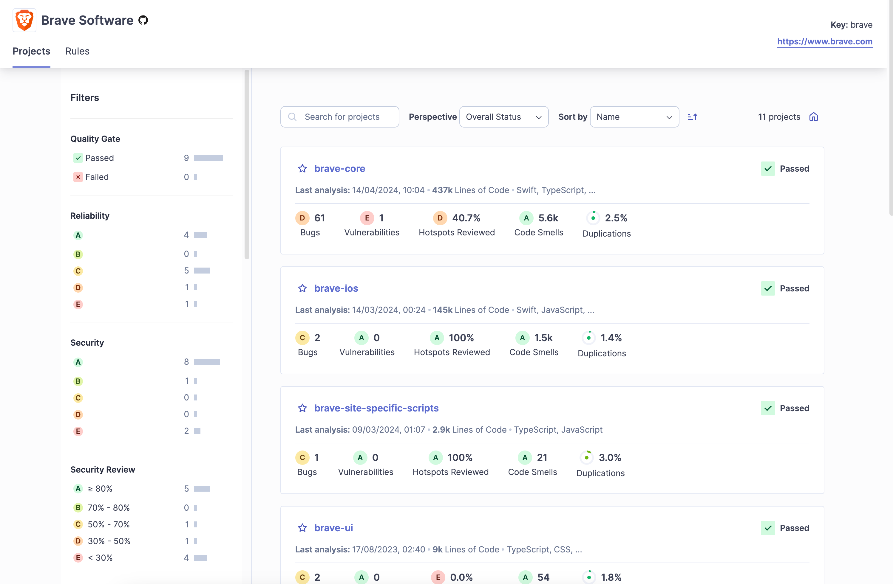
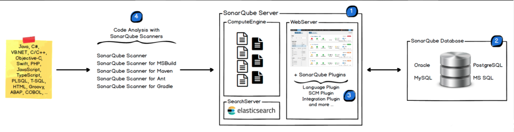

#### 简介：
[https://docs.sonarsource.com/sonarqube-server/latest/](https://docs.sonarsource.com/sonarqube-server/latest/)

sonar是一款**静态代码质量分析工具**，支持Java、Python、PHP、JavaScript、CSS等25种以上的语言，而且能够集成在IDE、Jenkins、Git等服务中，方便随时查看代码质量分析报告。Sonar 拥有 针对每种编程语言量身定制的广泛规则库 。 

分析erlang源码

需要将.beam反汇编成elang

<!-- 这是一张图片，ocr 内容为：BRAVE SOFTWARE KEY:BRAVE HTTPS://WWW.BRAVE.COM RULES PROJECTS FILTERS 三T SEARCH FOR PROJECTS PERSPECTIVE SORT BY 11 PROJECTS OVERALL STATUS NAME QUALITY GATE PASSED BRAVE-CORE PASSED FAILED OI LAST ANALYSIS:14/04/2024,10:04 - 437K LINES OF CODE ` SWIFT,TYPESCRIPT,... RELIABILITY E1 2.5% 5.6K 40.7% 61 CODE SMELLS HOTSPOTS REVIEWED VULNERABILITIES DUPLICATIONS BUGS 01 B 5 BRAVE-IOS PASSED LAST ANALYSIS: 14/03/2024,00:24 145K LINES OF CODE `SWIFT, JAVASCRIPT,... 1.4% 100% 1.5K SECURITY VULNERABILITIES HOTSPOTS REVIEWED BUGS CODE SMELLS DUPLICATIONS 1 01 PASSED BRAVE-SITE-SPECIFIC-SCRIPTS 0  LAST ANALYSIS:09/03/2024,01:07 2.9K LINES OF CODE - TYPESCRIPT, JAVASCRIPT 2- E 3.0% 100% 21 A 0 SECURITY REVIEW VULNERABILITIES BUGS CODE  SMELLS HOTSPOTS REVIEWED DUPLICATIONS 5 2 80% OI 70%-80% 11 50%-70% 众BRAVE-UI PASSED 1I 30%-50% LAST ANALYSIS: 17/08/2023,02:40-9K LINES OF CODE `TYPESCRIPT, CSS,... 4 < 30% 1.8% E  0.0% 54 -->

#### 定位：
Sonar 主要是**提高代码编写质量**，辅助开发人员进行高质量开发； 通过集成安全规则，可以检测出一些常见的安全漏洞，帮助开发人员在早期阶段发现并修复问题。

#### Sonar架构：
<!-- 这是一张图片，ocr 内容为：SONARQUBE SERVER WEBSERVER COMPUTEENGINE CODE ANALYSIS WITH 圆见见见 SONARQUBE SCANNERS SONARQUBE DATABASE JAVA,C#. VBNET,C/C++ SONARQUBE SCANNER OBJECTIVE-C SONARQUBE SCANNER FOR MSBUILD SWIFT,PHP POSTGRESQL ORACLE JAVASCRIPT. SONARQUBE SCANNER FOR MAVEN + SONARQUBE PLUGINS TYPESCRIPT. MS SQL MYSQL SONARQUBE SCANNER FOR ANT PLSQL.T.SQL. SONARQUBE SCANNER FOR GRADLE HTML,GROOVY. LANGUOGE PLUGIN ABAP.COBOL,. SCMPLUGIN INTEGRATION PLUGIN SEARCHSERVER AND MORE... ELASTICSEARCH -->

+ **SonarQube Server**：核心服务器，负责管理项目、存储数据和生成分析报告。
+ **SonarQube Database**：存储所有的分析结果和配置。
+ **SonarQube Scanner**：执行静态代码分析，并将结果发送到SonarQube服务器。
+ **SonarQube Plugins**：提供扩展功能，支持更多编程语言和分析规则。

#### SonarQube报告评估结果的内容：
[https://docs.sonarsource.com/sonarqube-server/latest/user-guide/code-metrics/metrics-definition/#standard-experience-maintainability-metrics](https://docs.sonarsource.com/sonarqube-server/latest/user-guide/code-metrics/metrics-definition/#standard-experience-maintainability-metrics)

1. **质量门（Quality Gates）**：整体的质量评估，包括技术债务、覆盖率等。
2. **问题类型（Issues）**：Bugs、Vulnerabilities、Code Smells等各类问题。
3. **技术债务（Technical Debt）**：项目中的技术债务量和修复所需时间。
4. **代码覆盖率（Code Coverage）**：单元测试覆盖率，行覆盖、条件覆盖等。
5. **重复代码（Duplicated Code）**：代码重复情况。
6. **复杂度（Complexity）**：代码的复杂度，特别是圈复杂度。
7. **代码注释（Code Comments）**：注释的完整性和质量。
8. **依赖关系（Dependencies）**：外部依赖的安全性和更新情况。
9. **排除文件和目录（Exclusions）**：被排除的文件和目录。
10. **趋势分析（Trends）**：代码质量的历史变化趋势。

#### 总结：
从分析结果来看，认为该工具主要还是帮助开发团队识别并修复潜在的代码问题，持续提升代码的质量和安全性。

