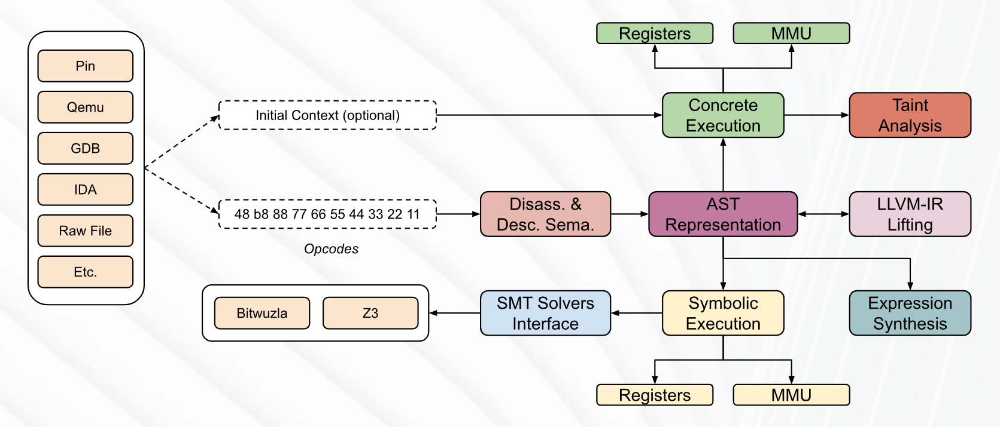

[https://github.com/jonathansalwan/Triton](https://github.com/jonathansalwan/Triton)

**Triton**是一个动态二进制分析库，提供内部组件，允许您构建程序分析工具、自动执行逆向工程、执行软件验证或仅模拟代码。

+ **动态符号执行**
+ **动态污点分析**
+ **x86**、**x86-64**、**ARM32**、**AArch64**和**RISC-V 32/64**ISA 语义的**AST 表示**
+ **表情合成**
+ **SMT 简化**通行证
+ **升级**至**LLVM**以及**Z3**并返回
+ **SMT 求解器**接口至**Z3**和**Bitwuzla**
+ **C++**和**Python** API

<!-- 这是一张图片，ocr 内容为：MMU REGISTERS PIN TAINT CONCRETE QEMU INITIAL CONTEXT(OPTIONAL) ANALYSIS EXECUTION GDB IDA LLVM-IR AST DISASS.& 48 B8 88 77 66 55 44 33 22 11 REPRESENTATION LIFTING DESC. SEMA. RAW FILE OPCODES ETC. SMT SOLVERS EXPRESSION SYMBOLIC Z3 BITWUZLA SYNTHESIS EXECUTION INTERFACE MMU REGISTERS -->

