[https://security.humanativaspa.it/automating-binary-vulnerability-discovery-with-ghidra-and-semgrep/](https://security.humanativaspa.it/automating-binary-vulnerability-discovery-with-ghidra-and-semgrep/)


1.提取 Ghidra 反编译器生成的所有伪代码，使其格式适合导入 IDE（例如VS Code）或由静态分析工具（例如Semgrep）解析。

2.使用 Semgrep 和我的自定义 C/C++ 规则来（重新）发现一些漏洞

[https://github.com/0xdea/semgrep-rules](https://github.com/0xdea/semgrep-rules)


<!-- 这是一张图片，ocr 内容为：-(KALI&KALI)-[~/PCODE] I /HOME/KALI/PCODE/SEMGREP-RULES-MAIN/C/ /HOME/KALI/PCODE/PCODE/ --SARIF -O CUSTOM,RULES- S_RES  SEMGREP --CONFIG /H ULT.SARIF -->
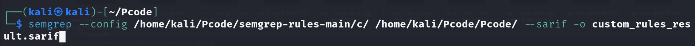

semgrep --config /home/kali/Pcode/semgrep-rules-main/c/ /home/kali/Pcode/Pcode/ --sarif -o custom_rules_result.sarif


第一次扫描结果：

<!-- 这是一张图片，ocr 内容为：8:35 KSBEKATE -/PCODE FILE ACTIONS EDIT VIEW HELP 000 SEMGREP CLI METRICS: USING CONFIGS FROM THE REGISTRY ( RY (LIKE --CONFIG-P/CI) REPORTS PSEUDONYMOUS RULE METRICS TO SEMGREP.DEV. TO DISABLE REGISTRY RULE METRICS, USE --METRICSOFF". LIKE --CONFIG-XYZ.YML) DOES NOT ENABLE METRICS. USING CONFIGS ONLY FROM LOCAL CAL FILES (LIKE -- MORE INFORMATION: HTTPS://SEMGREP.DEV/DOCS/METRICS SCANNING 6237 FILES (ONLY GIT-TRACKED) WITH 47 CODE RULES: CODE RULES SCANNING 6237 FILES WITH 46 C RULES. SUPPLY CHAIN RULES NO RULES TO RUN. PROGRESS 99% 0:18:22 SCAN SUMMARY E FILES WERE SKIPPED OR ONLY PARTIALLY ANALYZED. SOME F PARTIALLY SCANNED; 163 FILES ONLY PARTIALLY ANALYZED DUE TO PARSING OR INTERNAL SENGTEP ERRORS RAN 46 RULES ON 6237 FILES: 5216 FINDINGS. TOO MANY FINDINGS? TRY SEMGREP PRO FOR MORE POWERFUL QUERIES AND LESS NOISE. HTTPS://SG.RUN/FALSE-POSITIVES. SEE HT -->
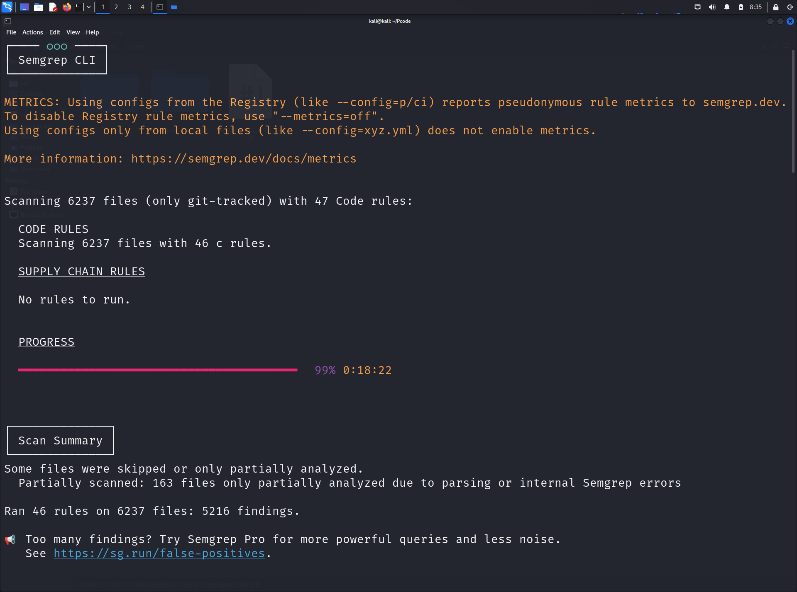


第二次扫描结果：

<!-- 这是一张图片，ocr 内容为：8:34 KALI@KALI-/PCODE EDITVIEWHELP FILE ACTIONS _RULES_RESULT.SARIF  PCODE  SEMGREP-RULES-MAIN CUSTOM I@KALI)-[~/PCODE] KALI& /HOME/KALI/PCODE/SEMGREP-RULES-MAIN/C// /HOME/KALI/PCODE/PCODE/ SARIF -0 CUSTOM_RULES_RES SEMGREP CONFIG ULT.SARIF SEMGREP-RULES-MAIN  CUSTOM RULES RESULLSAR 000 SEMGREP CLI SCANNING 6237 FILES (ONLY GIT-TRACKED) WITH 47 CODE RULES: CODE RULES SCANNING 6237 FILES WITH 46 C RULES. SUPPLY CHAIN RULES NO RULES TO RUN. PROGRESS 99%0:17:20 SCAN SUMMARY E FILES WERE SKIPPED OR ONLY PARTIALLY ANALYZED. SOME F PARTIALLY SCANNED; 191 FILES ONLY PARTIALLY ANALYZED DUE TO PARSING OR INTERNAL SEMGTEP ERRORS RAN 46 RULES ON 6237 FILES: 5114 FINDINGS. TOO MANY FINDINGS? TRY SEMGREP PRO FOR MORE POWERFUL QUERIES AND LESS NOISE. HTTPS://SG.RUN/FALSE-POSITIVES. SEE HT -->
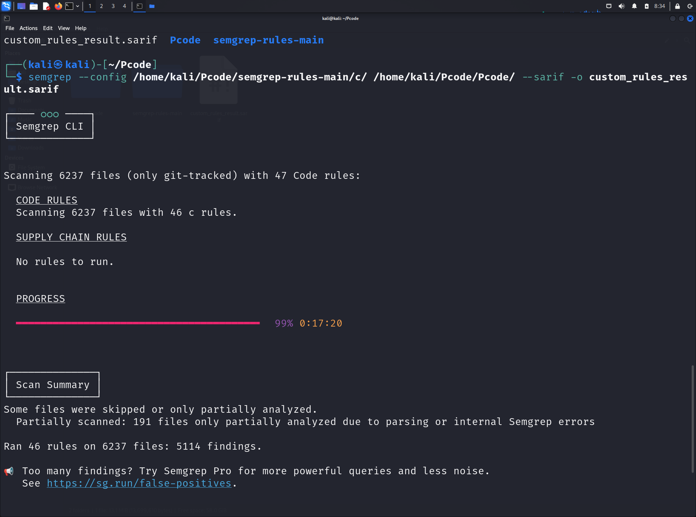


超时问题。

分析具体规则，缓冲区溢出，


分析具体规则：

<!-- 这是一张图片，ocr 内容为：C/C++ 缓冲区溢出 INSECURE-API-GET获取.使用不安全的API函数GETS( (). INSECURE-API-STRCPY-STPEPY-STRCAT的使用可能不安全的API函数STRCPY (),STRCPY (),STRCAT INSECURE-API-SPRINTF-VSPRINTF ()和VSPRINTF(). )系列中使用可能不安全的API函数. INSECURE-API-SCANF-等.在SCANF INCORRECT-USE-OF-STRNCAT的 STRNCAT中.传递给 STRNCAT )的SIZE参数错误. 错误地使用STRNCPY-STPNCPY-STRLCPY. 传递给 给 STRNCPY(),STPNCPY (),STRLCPY ()的 SIZE 参数错误. 运算符. INCORRECT-USE-OF-SIZEOF的在指针而不是其目标上意外使用SIZEOF UNTERMINATED-STRING-STRNCPY-STPNCPY的 STRING-STRNCPY-STPNCPY的 STRING-STRNCPY-STPNCPY的 STRING-T在 之后缺少显式NUL终止. 和STPNCPY STRNCPY 差一.潜在的差1错误. POINTER-SUBTRACTION 的TOKEN-SUBTRACTION中.可能使用指针减法来确定大小. UNSAFE-RET-SNPRINTF-VSNPRINTF的对 SNPRINTF () 和VSNPRINTF 的返回值使用可能不安全. 的返回值使用可能不安全. UNSAFE-RET-STRLCPY-STRLCAT 的对 STRLCPY () 和 STRLCAT WRITE-INTO-STACK-BUFFER的直接写入堆栈上分配的缓冲区. -->
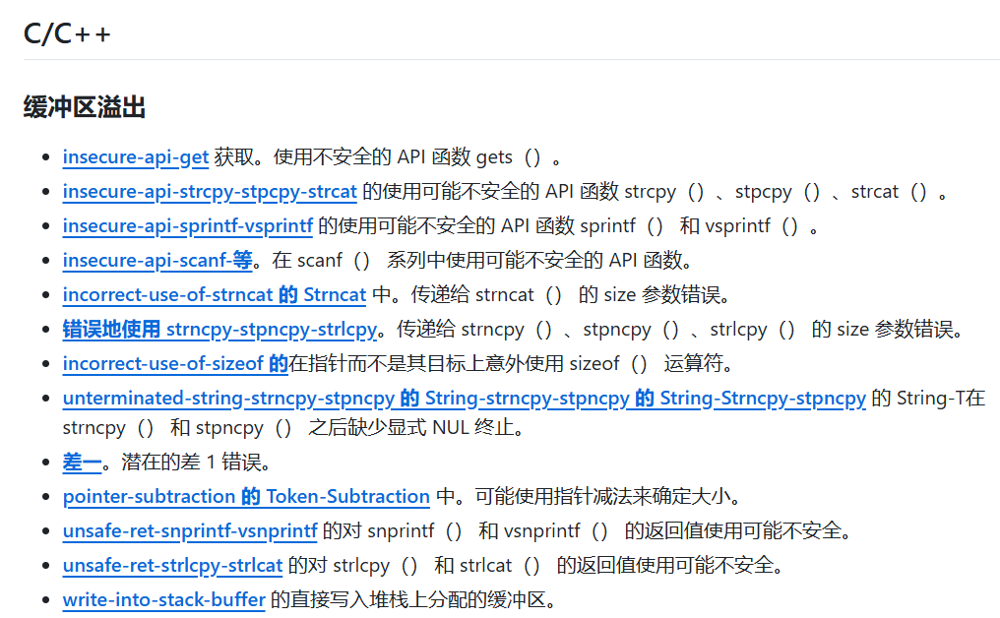<!-- 这是一张图片，ocr 内容为：整数溢出 INCORRECT-UNSIGNED-COMPARISON的INCORRECT-UNSIGNED-COMPARISON 中.检查无符号变量是否为负数. SIGNED-UNSIGNED-CONVERSION的CONVERSION.可能存在已签名/未签名/未签名的转换错误. INTEGER-TRUNCATION 的INTEGER-TRUNCATION 中.可能的整数截断错误. LEN()的返回值转换为SHORT可能很危险. UNSAFE-STRLEN的将STRLEN INTEGER-WRAPAROUND 的INTEGER WRAPAROUND中.潜在的整数环统错误. 格式字符串 FORMAT-STRING-BUG的BUG 中.潜在的格式字符串错误. -->
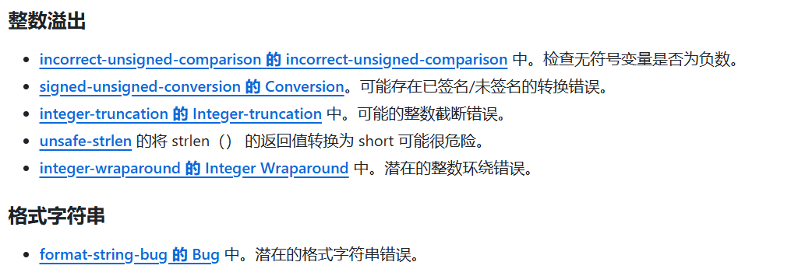<!-- 这是一张图片，ocr 内容为：内存管理 INSECURE-API-ALLOCA中.使用可能不安全的 API函数ALLOCA 之后的潜在用途. 释放后使用.FREE() 双重免费.POTENTIALDOUBLEFREE() 的DOUBLEFREE()中. INCORRECT-USE-OF-FREE.对不在堆中的内存调用FREE(). UNCHECKED-TETMALLOC-CALLOC-REALOC的REALLOC中.未经检查的MALLOC(), REALLOC(), REALOC(), REALLOC() 这回代 码. RET-STACK-ADDRESS的可能返回堆栈分配的变量的地址. PUTENV-STACK-VAR 堆栈.使用堆栈.使用堆栈分配的变量调用PUTENV RE的底层内存地址的潜在暴露. MEMORY-ADDRESS-EXPOSURE MISMATCHED-MEMORY-MANAGEMENT的MISMATCHED-MANAGEMENT中.可能不匹配的C内存管理例 程. 中.可能不匹配的C++内存 MISMATCHED-MEMORY-MANAGEMENT-CPP 的 MATCHED-MEMORY-MANAGEMENT-CPP 管理例程. 命令注入 可能通过SYSTEM 或POPEN()注入OS命令. COMMAND-INJECTION中. 0 争用条件 INSECURE-API-ACCESS-STAT-ISTAT的使用不安全的 API 国数ACCESS ISTAT () . , STAT () INSECURE-API-MKTEMP-TMPNAM-TEMPNAM的使用不安全的API函数MKTEMP(), TMPNAM(),TEMPNAM INSECURE-API-SIGNAL的API信号.使用不安全的 API函USIGNAL (). -->
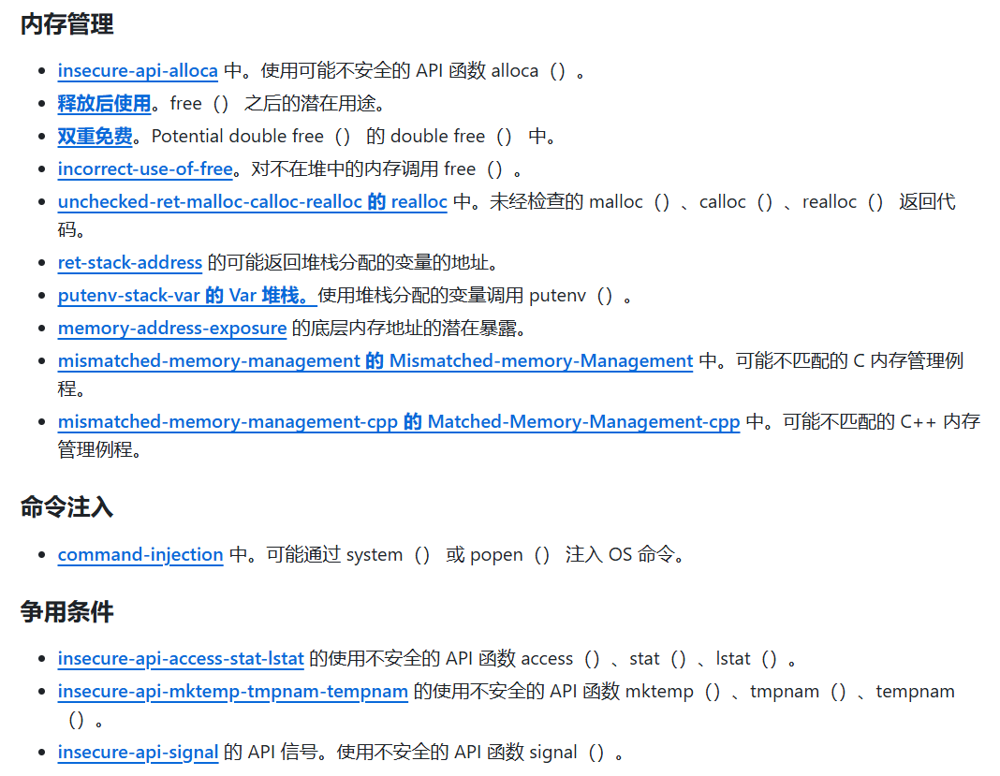<!-- 这是一张图片，ocr 内容为：权限管理 INCORRECT-ORDER-SETUID-SETGID-ETC.权限管理函数的调用顺序错误. UNCHECKED-RET-SETUID-SETEUID的SETEUID中.未经检查的SETUID () 和SETEUID () 返回代码. 杂项 INCORRECT-USE-OF-MEMSET的MEMSET中.MEMSET()的参数顺序错误. D的使用可能不安全的API函数RAND()和SRAND(). INSECURE-API-RAND-SRAND 和SNPRINTF()中的源和目标重叠. INCORRECT-USE-OF-SPRINTF-SNPRINTF的 SNPRINTF 中. SPRINTF SUSPICIOUS-ASSERT的由于使用断言宏,大小检查可能无效. 的API函数. INTERESTING-API-CALLS调用.调用有趣且可能不安全的API-CALLS调用.调用.调用.调用.调用.调用.调用有趣且可能不安全的  UNCHECKED-RET-SCANF-ETC的SCANF()系列中国数的未检查返回代码. INSECURE-API-ATOI-ATOL-ATOF的使用可能不安全的API函数ATOL (),ATOI(),ATOL (),ATOL (). ARGV-ENVP-ACCESS访问.命令行参数或环境变量访问. 缺少DEFAULT-IN-SWITCH 的 MISSAV.COM 的 MISSAV.COM MISSAVSWITCH 语句中缺少DEFAULT CASE. MISSAVSWITCH 语句中缺少BREAK或等效项. 缺少BREAK-IN-SWITCH的 MISSAV.COM 的 MISSAV.COM的MISSAV.COM MISSING 返回.非VOID 函数中缺少RETURN 语句. MISSING-RETURN 错别字.具有安全隐患的潜在拼写错误. -->
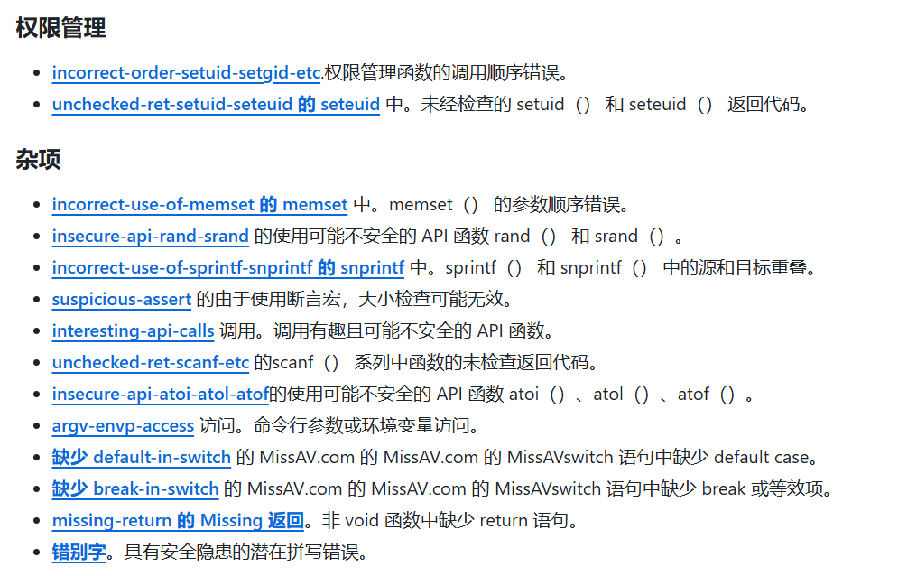


### 用单个规则跑全部的pcode：
#### 自信程度：high
##### 1.command-injection 命令注入   自信程度：high
<!-- 这是一张图片，ocr 内容为：窗 22:46 KLI@BALIE~/PCODE FILE ACTIONS EDIT VIEW HELP /HOME/KALI/PC /PCODE/PCODE/ $ SEMGREP - CONFIG /HOME/KALI/PCODE/SEMGREP-RULES-MAIN/C/COMMAND-INJECTION.YAML IF -O COMMAND-INJECTION.SARIF 000 !# SEMGREP CLI 7 FILES (ONLY GIT-TRACKED) WITH 1 CODE RULE: SCANNING 6237  FILE CODE RULES SCANNING 6237 FILES. SUPPLY CHAIN RULES NO RULES TO RUN. PROGRESS 100% 0:00:01 SUMMARY SCAN E FILES WERE SKIPPED OR O D OR ONLY PARTIALLY ANALYZED. SOME F PARTIALLY SCANNED: 1 FILES ONLY PARTIALLY ANALYZED DUE TO PARSING OR INTERNAL SEMGREP ERREP ERRORS RAN 1 RULE ON 6237 FILES:0 FINDINGS. 0 IF SEMGREP MISSED FINDING, PLEASE SEND US FEEDBACK TO LET US KNOW! 中国 DOCS REPORTING-FALSE-NEGATIVES/ SEE DE HTTPS://SEMGREP. -->
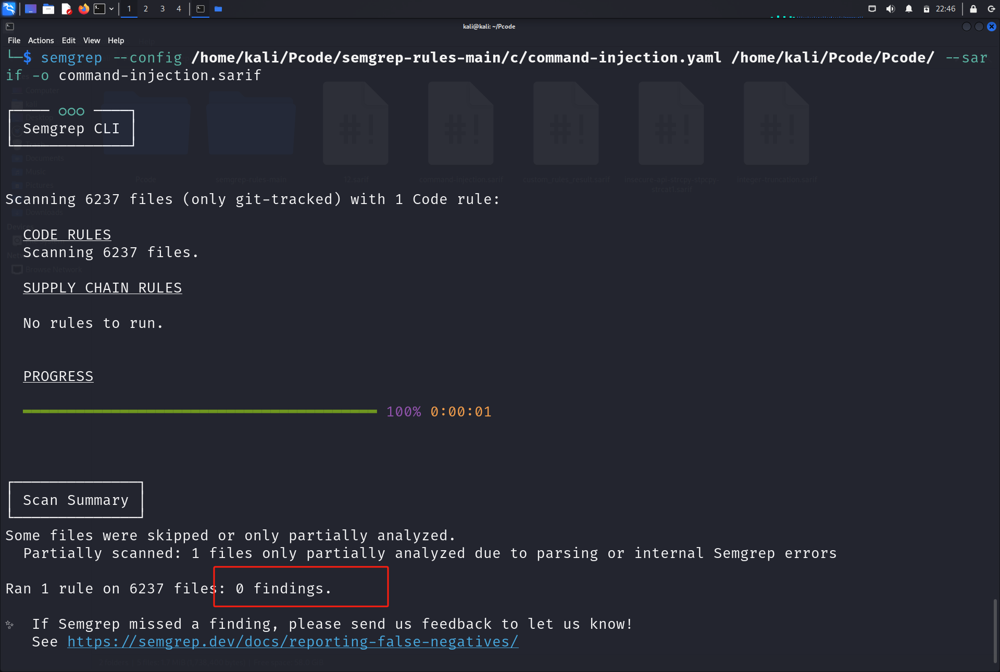


###### 检测机制
1.外部输入影响的命令构造： 规则关注的是程序通过外部输入（例如用户输入、网络请求、环境变量等）来构造和执行操作系统命令（如 system()、popen() 等）。如果这些外部输入没有被正确地净化或过滤，攻击者可能利用恶意输入执行任意操作系统命令。

2.匹配模式：system(...) 和 popen(...)：这两个函数分别用于执行操作系统命令和打开进程的管道。这些函数常用于调用系统命令，若传入的参数包含未经过滤的外部输入，可能导致命令注入。

3.排除无关的函数调用：pattern-not: $FUN("...", ...)：此模式排除了包含特定函数调用格式的情形（即 FUN("...", ...)）。这可能是为了避免匹配到某些正常的函数调用，如那些传递硬编码字符串作为参数的调用，而这些调用不涉及外部输入。


##### 2.incorrect-unsigned-comparison  不正确的无符号数比较  自信程度：high
<!-- 这是一张图片，ocr 内容为：22:55 KALI@KALIC~/PCODE CPU USAGE:5.196 S EDIT VIEW HELP FILE ACTIONS (KALI@KALI)-[~/PCODE] /HOME/KALI/PCODE/ /HOME/KALI/PCODE/SEMGREP-RULES-MAIN/C/INCORRECT-UNSIGNED-COMPARISON.YAML SEMGREP --CONFIG /HOMEL PCODE/ INCORRECT-UNSIGNED-COMPARISON.SARIF 000 INCORRECTUNSIGNED COMMAND INIECTION.SARIF SEMGREP CLI SCANNING 6237 FILES (ONLY GIT-TRACKED) WITH 1 CODE RULE: CODE RULES SCANNING 6237 FILES. SUPPLY CHAIN RULES NO RULES TO RUN. PROGRESS 100% 0:00:50 SCAN SUMMARY E FILES WERE SKIPPED OR ONLY PAR Y PARTIALLY ANALYZED. SOME F PARTIALLY SCANNED:100 FILES ONL ONLY PARTIALLY ANALYZED DUE TO PARSING OR INTERNAL SEMGREP ERRORS FINDINGS. FILES: RAN 1 RULE ON 6237 FINDING, PLEASE SEND US FEEDBACK TO LET US KNOW! IF SEMGREP MISSED -->
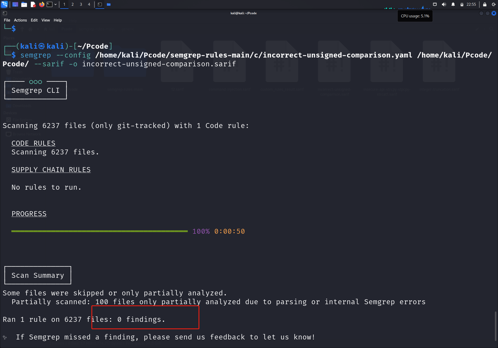


###### 检测机制
1.无符号类型与负数比较：

+ 无符号类型的值不能为负数。例如，`unsigned int` 只能表示 0 或正整数，因此，`unsigned int` 与负数（例如 `-1`）进行比较是没有意义的。在这种情况下，比较会引发不符合预期的行为，甚至可能是程序逻辑的错误。

2.模式匹配： 规则定义了几种可能的无符号类型与负数比较的情况，包括：

+ `unsigned short $UNSIGNED < 0`
+ `unsigned int $UNSIGNED < 0`
+ `unsigned long $UNSIGNED < 0`
+ `size_t $UNSIGNED < 0`

这些模式检测了无符号类型与负数进行 `<` 或 `<=` 比较的情形。根据 C 和 C++ 语言规范，所有这些比较将始终是 `false`，因为无符号数永远不可能小于 0。

另外，规则也包括了对无符号类型与 0 的比较：

+ `unsigned short $UNSIGNED <= 0`
+ `unsigned int $UNSIGNED <= 0`
+ `size_t $UNSIGNED <= 0`

这些比较通常是无意义的，因为它们会总是 `true`，因为无符号数的范围从 0 开始，而 `<= 0` 会始终成立。

3.逻辑不正确的比较：

+ 对于无符号数与负数的比较，无论是 `<` 还是 `<=`，都没有实际意义，代码中的此类比较通常表明程序员可能犯了逻辑错误，或者误用了数据类型。
+ 比较一个无符号数与负数进行 `>= 0` 这样的操作是始终为 `true` 的。因为无符号数的最小值为 0，所有的无符号数都大于等于 0。

4.检测逻辑上的错误： 规则的本质是捕捉那些无符号数与负数比较的无效或错误的情况，这些比较通常是由于不正确的假设、错误的数据类型选择或者输入验证的缺失所引起的。这些错误在编译时通常不会报错，但会导致程序在运行时表现出未定义或不符合预期的行为。


##### 3.incorrect-use-of-memset 内存集使用不当  自信程度：high
<!-- 这是一张图片，ocr 内容为：23:05 KLI@KALI-/PEODE FILE ACTIONS EDIT VIEW HELP -(KALI@KALI)-[~/PCODE] $- SEMGREP --CONF1R /HOME/KALL/PCODE/SEMGREP-FULES-MAIN/C/ENCORRECT-USE-USE-OF-MENSET-YAML /HOMS/KALL/PCODE/PCO -SARIF -O INCORRECT-USE-OF-MEMSET.SARIF #! #! 000 CLI SEMGREP INSECURE API-STRCPY-STPCPY SEMGREPRULES MAIN SCANNING 6237 FILES (ONLY GIT-TRACKED) WITH 1 CODE RULE: CODE RULES SCANNING  6237  FILES. SUPPLY CHAIN RULES NO RULES TO RUN. PROGRESS 100% 0:00:14 SCAN SUMMARY SOME FILES WERE SKIPPED OR ONLY PARTIALLY ANALYZED. PARTIALLY SCANNED: 51 FILES ONLY PARTIALLY ANALYZED DUE TO PARSING OR INTERNAL SEMGREP ERRORS RAN 1 RULE ON 6237 FILES: 0 FINDINGS. IF SEMGREP MISSED A FINDING, PLEASE SEND US FEEDBACK TO LET US KNOW! SEE HTTPS://SEMGREP.DEV/DOCS/REPORTING-FALSE-NEGATIVES/ -->
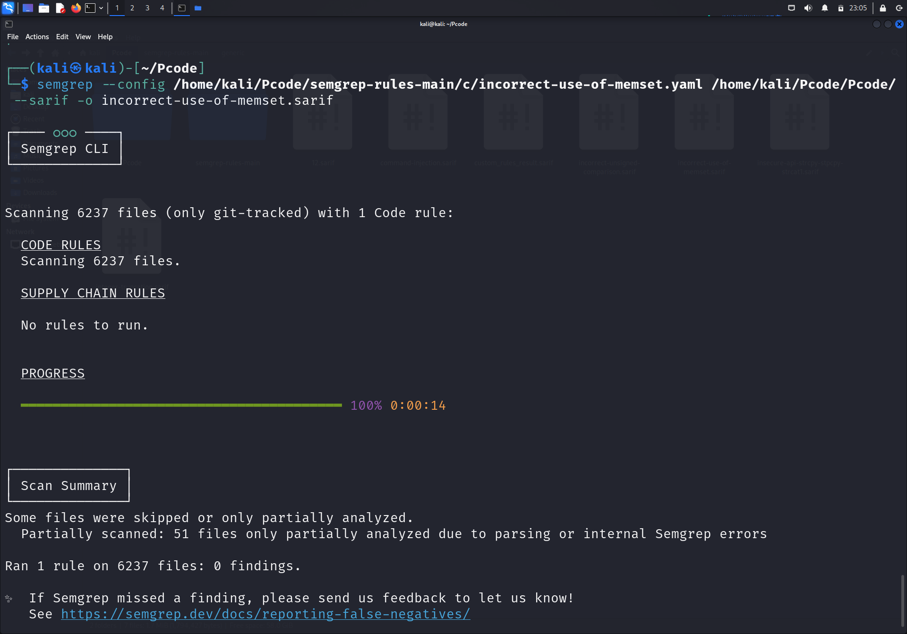


###### 检测机制
memset（）函数：

void *memset(void *s, int c, size_t n);

+ 第一个参数 `s` 是指向目标内存区域的指针。
+ 第二个参数 `c` 是要设置的值，通常是字符或整数（通常用于设置为某个字节值）。
+ 第三个参数 `n` 是要设置的字节数。

如果这些参数的顺序不正确，`memset()` 调用将不会按预期工作，可能导致内存没有被正确设置或引发其他未定义行为。


##### 4.incorrect-use-of-strncat  自信程度：high
##### <!-- 这是一张图片，ocr 内容为：23:12 KLI@KALI-/PEODE FILE ACTIONS EDIT VIEW HELP (KALI@KALI)-[PCODE] /HOME/KALI/PCODE/SEMGREP-RULES-MAIN/C/INCORRECT-USE-OF-STRNCAT.YAML /HOME/KALI/PCODE/PCODE/PCODE SEMGREP-CONFIG --SARIF-O INCORRECT-USE-OF-STRNCAT.SARIF SEMGREP-RULES MAIN CUSTOM RULES RESULT.SARIF 000 STRNCATSARIT SEMGREP CLI SCANNING 6237 FILES (ONLY GIT-TRACKED) WITH 1 CODE RULE: CODE RULES SCANNING 6237 FILES. SUPPLY CHAIN RULES NO RULES TO RUN. PROGRESS 100%0:00:00 SCAN SUMMARY RAN 1 RULE ON 6237 FILES: 0 FINDINGS. IF SEMGREP MISSED A FINDING, PLEASE SEND US FEEDBACK TO LET US KNOW! REPORTING-FALSE-NEGATIVES/ SEE HTTPS://SEMGREP.DEV/DOCS/REPOY -->
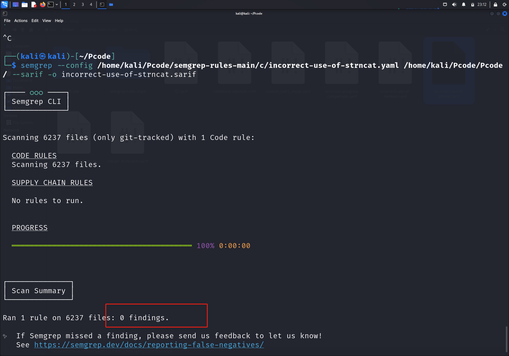


###### 检测机制：
1. 传递整个缓冲区的大小

错误地传递缓冲区的总大小而不是剩余的空间大小。eg：

strncat($DST, $SRC, sizeof($DST));

2. 使用数组大小来计算可用空间

有时，开发者可能会错误地根据数组的大小而不是剩余空间来设定 strncat() 的第三个参数。

3.使用 strlen() 获取当前字符串长度

错误地使用 strlen() 来计算目标字符串的长度，可能会导致错误的大小传递给 strncat()，尤其是在动态长度字符串的情况下。

4. “Off-by-one” 错误

“Off-by-one”错误是另一个常见的问题，尤其是在使用 sizeof($DST) - strlen($DST) 来计算剩余空间时。如果不考虑 NUL 字符的空间需求，可能会将多余的字节写入目标缓冲区，导致溢出。为了避免这种情况，应该传递剩余空间的大小减去 1。正确的使用方式是：

strncat($DST, $SRC, sizeof($DST) - strlen($DST) - 1);


##### 5.insecure-api-access-stat-lstat  自信程度：high
 用于检测在 C 和 C++ 代码中对文件或资源的访问与状态检查之间存在竞争条件的情况。  

<!-- 这是一张图片，ocr 内容为：23:17 KALIGHALE~/PEODE FILE ACTIONS EDIT VIEW HELP (KALI@KALI)-[~/PCODE] IG /HOME/KALI/PCODE/SEMGREP-RULES-MAIN/C/INSECURE-API-ACCESS- /HOME/KALI/PCODE SEMGREP LSTAT.YAML --CONFIG/HOME /PCODE/ -0 INSECURE-API-ACCESS-STAT-LSTAT.SARIF SARIF !# !# #! 000 CLI SEMGREP SEMGREP RULES MAIN SCANNING 6237 FILES (ONLY GIT-TRACKED) WITH 1 CODE RULE: CODE RULES SCANNING  6237  FILES. NSECURE-APL-STRCPY-STPCPY- SUPPLY CHAIN RULES NO RULES TO RUN. PROGRESS 100%0:00:13 SCAN SUMMARY SOME FILES WERE SKIPPED OR ONLY PARTIALLY ANALYZED. PARTIALLY SCANNED: 32 FILES ONLY PARTIALLY ANALYZED DUE TO PARSING OR INTERNAL SEMGREP ERRORS RAN 1 RULE ON 6237 FILES: 0 FINDINGS. IF SEMGREP MISSED A FINDING, PLEASE SEND US FEEDBACK TO LET US KNOW! SEE HTTPS://SEMGREP.DEV/DOCS/REPORTING-FALSE-NEGATIVES/ -->
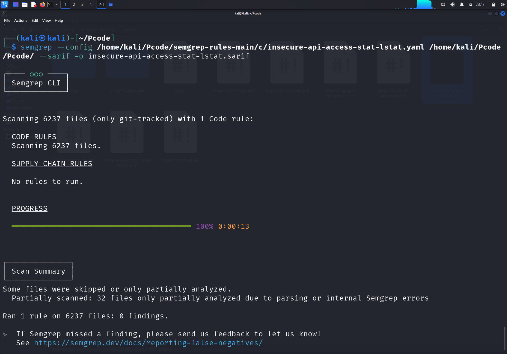


###### 检测机制：
规则通过以下模式检测文件访问和状态检查的潜在 TOCTOU （Time-of-check to time-of-use）漏洞：

+ `access(...)`
+ `stat(...)`
+ `lstat(...)`

这些模式表示检测到这三种函数调用之一，并评估它们是否被用于检查资源的状态，但在之后没有进行再次检查，从而可能导致资源状态变化后进行不安全的操作。


##### 6.insecure-api-alloca  自信程度：high
 检测 C 和 C++ 代码中对 `alloca()` 函数的使用  

<!-- 这是一张图片，ocr 内容为：D 23:27 KALI@KALIE ~/PCODE FILE ACTIONS EDIT VIEW HELP -(KALI@KALI)-[~/PCODE] EP --CONFIG /HOM8/KALI/PCODE/SOMGROP-RULES-MAIN/(/INSECURG-APL-APL-ALLOCA-YAML /HOMG/KALI/PCODO/PCOD SEMGREP  ARIF -O INSECURE-API-ALLOCA.SARIF 000 SEMGREP CLI INCORRECT-UNSIGNED SCANNING 6237 FILES (ONLY GIT-TRACKED) WITH 1 CODE RULE: CODE RULES SCANNING 6237 FILES. SUPPLY CHAIN RULES INSECURE-APL-ALLOCA.SARIF NO RULES TO RUN. PROGRESS 100%0:00:00 SCAN SUMMARY RAN 1 RULE ON 6237 FILES: 0 FINDINGS. IF SEMGREP MISSED A FINDING, PLEASE SEND US FEEDBACK TO LET US KNOW! SEE HTTPS://SEMGREP.DEV/DOCS/REPORTING-FALSE-NEGATIVES/ -(KALI@KALI)-[~/PCODE] -->
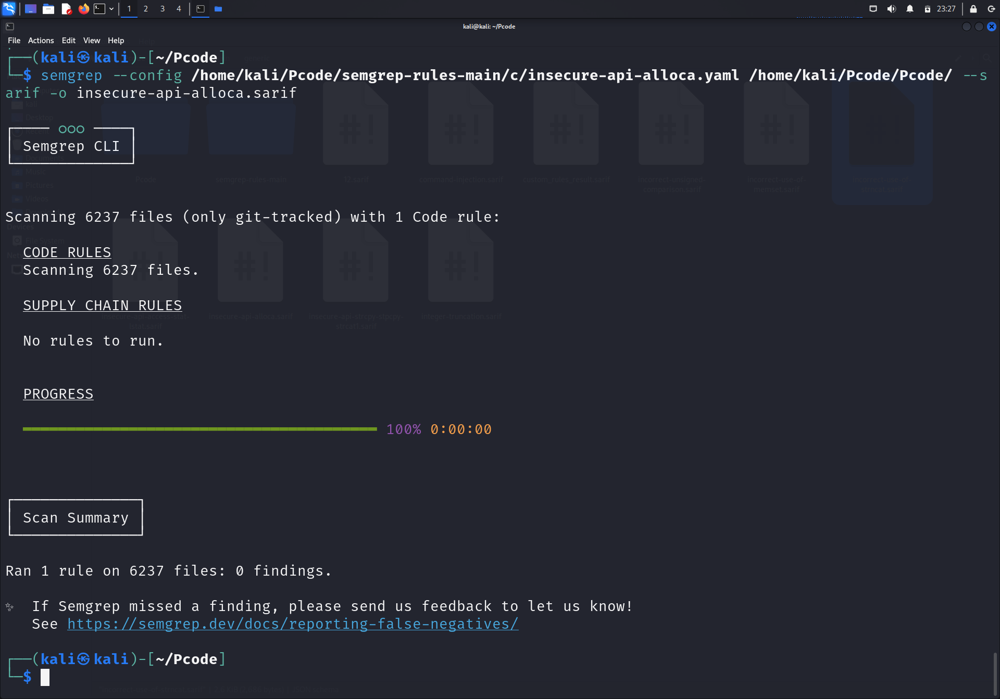


##### 7.insecure-api-atoi-atol-atof 
用于检测 C 和 C++ 代码中使用了 atoi()、atol()、atof() 等函数。这些函数用于将字符串转换为整数或浮动值，但它们存在一些不安全和不可预测的行为，因此该规则提醒开发者避免使用这些函数。

<!-- 这是一张图片，ocr 内容为：23:29 KILIGHE-IPCODE FILE ACTIONS EDIT VIEW HELP (KALI@KALI)-[PCODE] 8 /HOME/KALI/PCODE/SEMGREP-RULES-MAIN/C/INSECURE-API-ATOI-ATOL-ATOF.YAML /HOME/KALI/PCODE/PCODE/P CONFIG /HOME/KALI SEMGREP INSECURE-API-ATOI-ATOL-ATOF.SARIF ODE/ --SARIF -0 INSE( 000 SEMGREP CLI SCANNING 6237 FILES (ONLY GIT-TRACKED) WITH 1 CODE RULE: CODE RULES SCANNING 6237 FILES. SUPPLY CHAIN RULES INSECURE-APL-ATOL-ATOL- CPY-TRUNTEGER-TRUNCATION.SARIF ECURE-APL-STRCPY-STPCPY ATOF.SARIF NO RULES TO RUN. PROGRESS 100%0:00:00 SCAN SUMMARY RAN 1 RULE ON 6237 FILES: 0 FINDINGS. IF SEMGREP MISSED A FINDING, PLEASE SEND US FEEDBACK TO LET US KNOW! SEE HTTPS://SEMGREP.DEV/DOCS/REPORTING-FALSE-NEGATIVES/ -(KALI@KALI)-[~/PCODE] -->
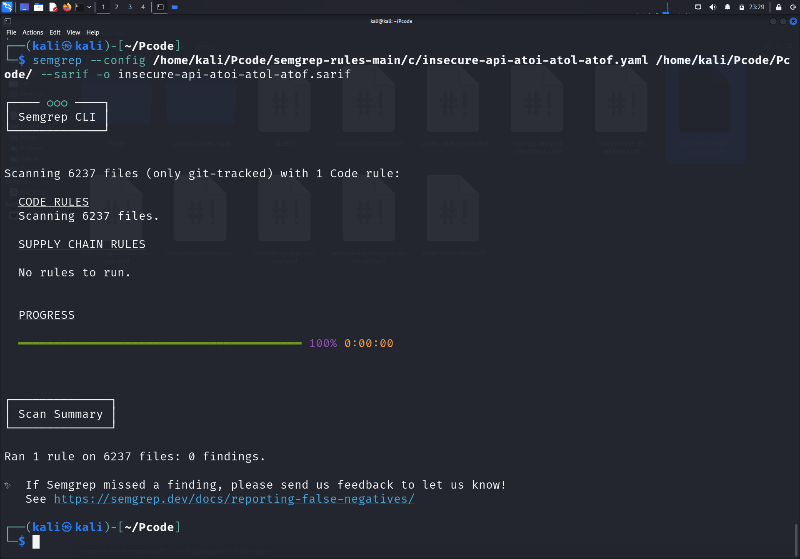


##### 8.insecure-api-gets 
`gets()` 函数是一个已知的不安全函数，原因在于它不对输入的大小进行边界检查，可能导致缓冲区溢出  

<!-- 这是一张图片，ocr 内容为：D 23:30 KLI@KLE-/PCODE FILE ACTIONS EDIT VIEW HELP -(KALI@KALI)-[~/PCODE] /HOME/KALI/PCODE/SEMGREP-RULES-MAIN/C/INSECURE-API-GETS.YAML /HOME/KALI/PCODE/PCODE/ CONFIG - SAR SEMGREP INSECURE-API-G -GETS ES.SARIF 000 SEMGREP CLI STRNCATSARIF SCANNING 6237 FILES (ONLY GIT-TRACKED) WITH 1 CODE RULE: CODE RULES SCANNING 6237 FILES. SUPPLY CHAIN RULES INSECURE-APL-ATOL-ATOL ATOF.SARIF NO RULES TO RUN. PROGRESS 100%0:00:00 SCAN SUMMARY RAN 1 RULE ON 6237 FILES: 0 FINDINGS. IF SEMGREP MISSED A FINDING, PLEASE SEND US FEEDBACK TO LET US KNOW! SEE HTTPS://SEMGREP.DEV/DOCS/REPORTING-FALSE-NEGATIVES/ (KALI@KALI)-[~/PCODE] APT-GET INSTALL DOCKER.IO -->
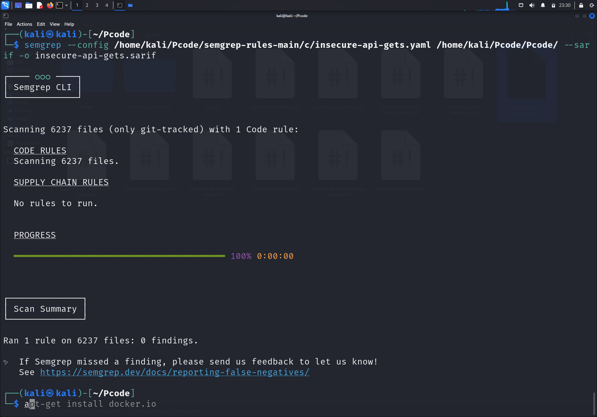

参考：cwe-242；cwe-120


##### 9.insecure-api-mktemp-tmpnam-tempnam
`mktemp()`、`tmpnam()` 和 `tempnam()`，这些函数用于生成临时文件名或路径，但存在安全风险。  

<!-- 这是一张图片，ocr 内容为：鱼 KLIGKALIS-/PCODE FILE ACTIONS EDIT VIEW HELP (KALI&KALI)-[~/PCODE] -CONFIS /HOME/KALI/PCODE/SONGREP-RULES-MAIN/C/INSECURE-API-API-WKTEMP-TMPRAM-TEMPNAML /HOME/KALI/P SEMGREP --SARIF -O INSECURE-API-MKTEMP-TMPNAM-TEMPNAM.SARIF CODE/PCODE/ 000 SEMGREP CLI SCANNING 6237 FILES (ONLY GIT-TRACKED) WITH 1 CODE RULE: CODE RULES 井! SCANNING 6237 FILES. SUPPLY CHAIN RULES INSECURE-APL-MKTEMP- INSECURE-APL-ATOL-ATOL INSECURE-APL-GETSSARIF TMPNAMTEMPNAM.SARL ATOF.SARIF NO RULES TO RUN. PROGRESS 100%0:00:00 SCAN SUMMARY RAN 1 RULE ON 6237 FILES: 0 FINDINGS. IF SEMGREP MISSED A FINDING, PLEASE SEND US FEEDBACK TO LET US KNOW! SEE HTTPS://SEMGREP.DEV/DOCS/REPORTING-FALSE-NEGATIVES/ -(KALI@KALI)-[~/PCODE] -->
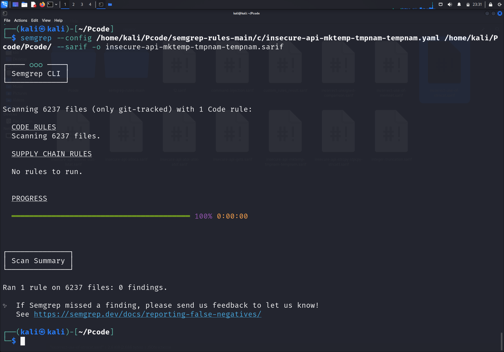

参考：cwe-377;cwe-367


##### 10.insecure-api-rand-srand
 用于检测 C 和 C++ 代码中使用了不安全的伪随机数生成器（PRNG）函数 `rand()` 和 `srand()`。这些函数通常用于生成随机数，但它们的随机性较差，不适用于需要高质量随机数的应用。  

<!-- 这是一张图片，ocr 内容为：电23:37 单 KALI@KALE ~/PCODE FILE ACTIONS EDIT VIEW HELP -(KALI@KALI)-[PCODE] --CONFIS /HOME/HALI/PCODE/SEMSREP-RULES-MAIN/C/INSOEURG-APL-RAND-STAND-SRAND-YAME/KALI/PCODS/PCODE/ SEMGREP - SARIF -O INSECURE-API-RAND-SRAND.SARIF 000 SEMGREP CLI SCANNING 6237 FILES (ONLY GIT-TRACKED) WITH 1 CODE RULE: CODE RULES 井 井! SCANNING 6237 FILES. SUPPLY CHAIN RULES INSECURE-APL-STRCPY-STPCPY- INSECURE-APL-ATOL-ATOL INSECURE-APL-GETSSARIF ATOF.SARIF STRCATL.SARIF NO RULES TO RUN. PROGRESS 100%0:00:00 SCAN SUMMARY RAN 1 RULE ON 6237 FILES: 0 FINDINGS. IF SEMGREP MISSED A FINDING, PLEASE SEND US FEEDBACK TO LET US KNOW! SEE HTTPS://SEMGREP.DEV/DOCS/REPORTING-FALSE-NEGATIVES/ -(KALI&KALI)-[~/PCODE] -->
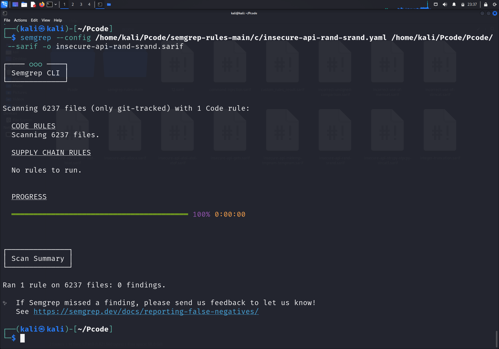

参考：cwe-338；cwe-330 


##### 11.insecure-api-scanf-etc
 检测 C 和 C++ 代码中不安全的 `scanf()` 及其相关函数的使用。这些函数容易引发缓冲区溢出等安全漏洞，主要是因为它们没有内建的缓冲区边界检查。  

<!-- 这是一张图片，ocr 内容为：23:38 KALI@KALIC`PCODE FILE ACTIONS EDIT VIEWHELP CHTTPS://SEMGREP.DEV/DOCS/REPORTING-FALSE-NEGATIVES/ SEE HT (KALI@KALI)-[~/PCODE] -SCANF-ETC.YAML /HOME/KALI/PCODE/PCODE/ --CONFIG /HOME/KALI/PCODE/SEMGREP-RULES-MAIN/C/INSECURE-API- SEMGREP INSECURE-API-SCANF-ETC.SARIF -0 000 SEMGREP RULES MAIN SEMGREP CLI SCANNING 6237 FILES (ONLY GIT-TRACKED) CKED) WITH 1 CODE RULE: CODE RULES SCANNING 6237  FILES. INSECURE-APL-SCANF-ETC.SARIF  INSECURE-API-STRCPY-STPCPY- INSECURE-APL-ATOL-ATOL- INSECURE-API-GETS.SARIF STRCATLSTRCATL.SARIF ATOF.SARIF SUPPLY CHAIN RULES NO RULES TO RUN. PROGRESS 100% 0:00:01 SCAN SUMMARY 6237 FILES:0 FINDINGS. RAN 1 RULE ON US FEEDBACK TO LET US KNOW! IFSEMGREPMIS P MISSED A FINDING, PLEASE SEND US FEE SEE HTTPS://SEMGREP.DEV/DOCS/REPORTING-FALSE-NEGATIVES/ -->
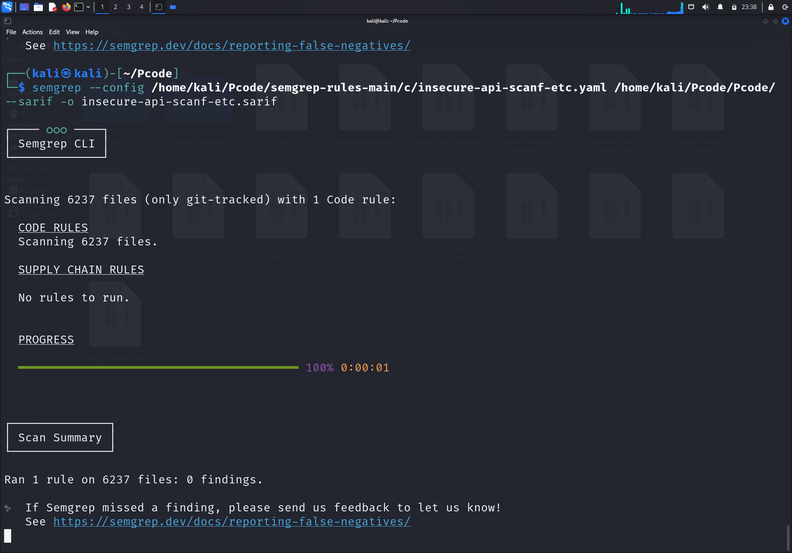

参考：cwe-676;cwe-120;cwe-787


检测函数：

`scanf($FMT, ...)`

`vscanf($FMT, ...)`

`fscanf($FS, $FMT, ...)`

`vfscanf($FS, $FMT, ...)`

`sscanf($BUF, $FMT, ...)`

`vsscanf($BUF, $FMT, ...)`

`wscanf($FMT, ...)`

`vwscanf($FMT, ...)`

`fwscanf($FS, $FMT, ...)`

`vfwscanf($FS, $FMT, ...)`

`swscanf($BUF, $FMT, ...)`

`vswscanf($BUF, $FMT, ...)`

##### 12.insecure-api-signal
<!-- 这是一张图片，ocr 内容为：电23:39 KALI@KALE ~/PCODE FILE ACTIONS EDIT VIEW HELP (KALI&KALI)-[PCODE] YAML /HOME/KALI/PCODE/PCODE/ --CONFIG /HOME/KALI/PCODE/SEMGREP-RULES-MAIN/C/INSECURE-API-SIGNAL.YAML / SEMGREP ARIF -0 INSECURE-API-SIGNAL.SARIF 000 SEMGREP CLI SCANNING 6237 FILES (ONLY GIT-TRACKED) WITH 1 CODE RULE: CODE RULES SCANNING 6237 FILES. SUPPLY CHAIN RULES INSECURE-APL-ATOL-ATOL- INSECURE-APL-SCANF-ETC.SARIF INSECURE-APL-GETSSARIF INSECURE-APL-ALLOCA.SARIF ATOF.SARIF NO RULES TO RUN. PROGRESS 100%0:00:00 SCAN SUMMARY RAN 1 RULE ON 6237 FILES: 0 FINDINGS. IF SEMGREP MISSED A FINDING, PLEASE SEND US FEEDBACK TO LET US KNOW! SEE HTTPS://SEMGREP.DEV/DOCS/REPORTING-FALSE-NEGATIVES/ -(KALI&KALI)-[~/PCODE] -->
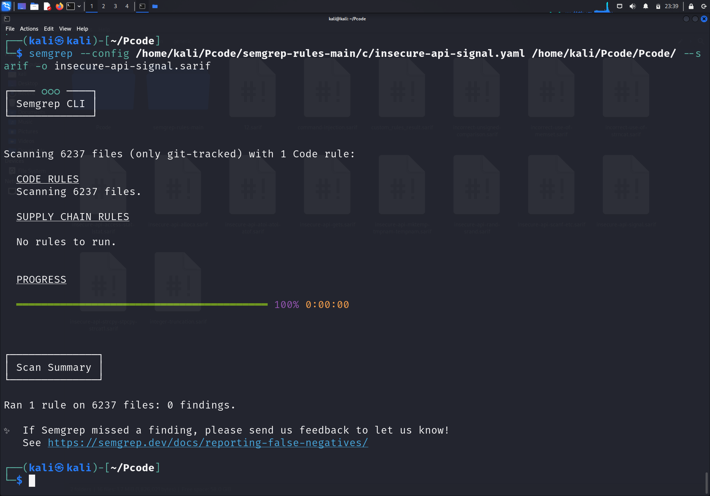


##### 13.insecure-api-sprintf-vsprintf
 检查代码中是否使用了 `signal()` 函数，建议使用 `sigaction()` 作为替代方案。  

参考：cwe-364；cwe-479；cwe-828

<!-- 这是一张图片，ocr 内容为：3 23:40 KALLI@KALI -/PCODE FILE EDIT -SARIF -O INSECURE-API-SPRINTF-VSPRINTF.SARIF PCODE 0000 SEMGREP CLI 6237 FILES (ONLY GIT-TRACKED) WITH 1 CODE RULE: SCANNING CODE RULES SCANNING 6237 FILES. !# SUPPLY CHAIN RULES NO RULES TO RUN. INSECURE-API-ATOL-ATOL- INSECURE-APL-SCANF-ETC.SARIF INSECURE-APL-GETS.SARIF ATOF.SARIF PROGRESS 100%0:00:00 STRCATL.SARIF SCAN SUMMARY SOME FILES WERE SKIPPED OR ONLY PARTIALLY ANALYZED. PARTIALLY SCANNED; 3 FILES ONLY PARTIALLY ANALVZED DUE TO PARSING OR INTERNAL SENEREP ERRORS RAN 1 RULE ON 6237 FILES: 0 FINDINGS. IF SEMGREP MISSED A FINDING, PLEASE SEND US FEEDBACK TO LET US KNOW! SEE HTTPS://SEMGREP.DEV/DOCS/REPORTING-FALSE-NEGATIVES/ -(KALI&KALI)-[~/PCODE] -->
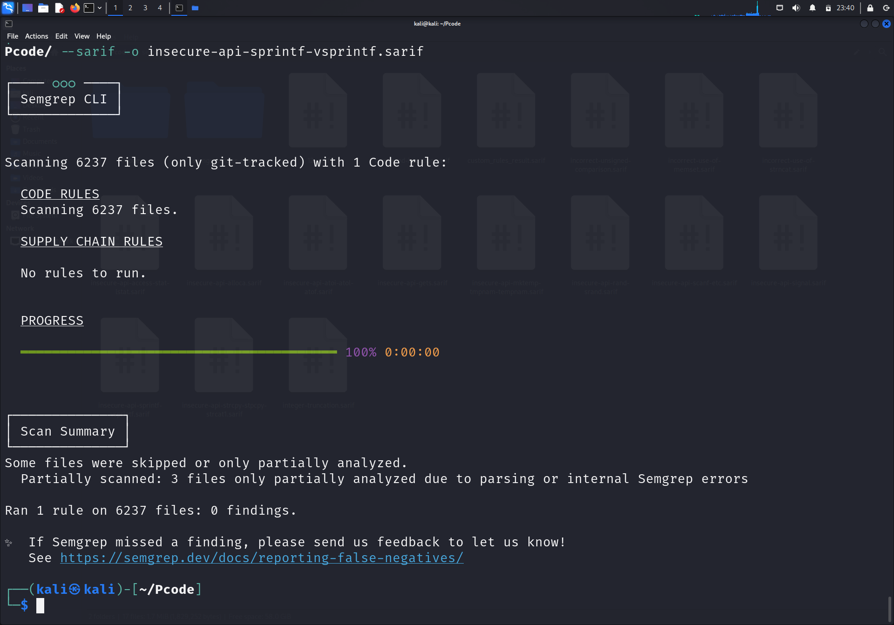


##### 14.insecure-api-strcpy-stpcpy-strcat
 检测不安全的字符串操作函数，如 `strcpy()`, `stpcpy()`, `strcat()` 等，这些函数没有进行边界检查，容易导致缓冲区溢出。  

参考：cwe-676；cwe-120；cwe-787

<!-- 这是一张图片，ocr 内容为：D 23:42 KSLI@KALIS-/PCODE FILE ACTIONS EDIT VIEW HELP (KALI@KALI)-[PCODE] SEMGREP -CONT3S /HOME/KAJ/PEODE/SOMBTEP-RULES-MA3N/G/INSECURECURE-API-STREPY-SEPY-STRCAT.YAML /HOME/KALI/P ODE/PCODE/-S -SARIF -O INSECURE-API-STRCPY-STPCPY-STRCAT.SARIF !# 000 SEMGREP CLI SCANNING 6237 FILES (ONLY GIT-TRACKED) WITH 1 CODE RULE: CODE RULES 井( SCANNING 6237 FILES. SUPPLY CHAIN RULES INSECURE-APL-ATOL-ATOL INSECURE-APL-SCANF-ETC.SARIF INSECURE-APL-GETS.SARIF INSECURE-APL-ALLOCA.SARIF ATOF.SARIF NO RULES TO RUN. PROGRESS 100%0:00:01 RE-API-STRCPY-STPCPY VSPRINTF.SARIF SCAN SUMMARY RAN 1 RULE ON 6237 FILES: 0 FINDINGS. IF SEMGREP MISSED A FINDING, PLEASE SEND US FEEDBACK TO LET US KNOW! SEE HTTPS://SEMGREP.DEV/DOCS/REPORTING-FALSE-NEGATIVES/ -(KALI&KALI)-[~/PCODE] -->
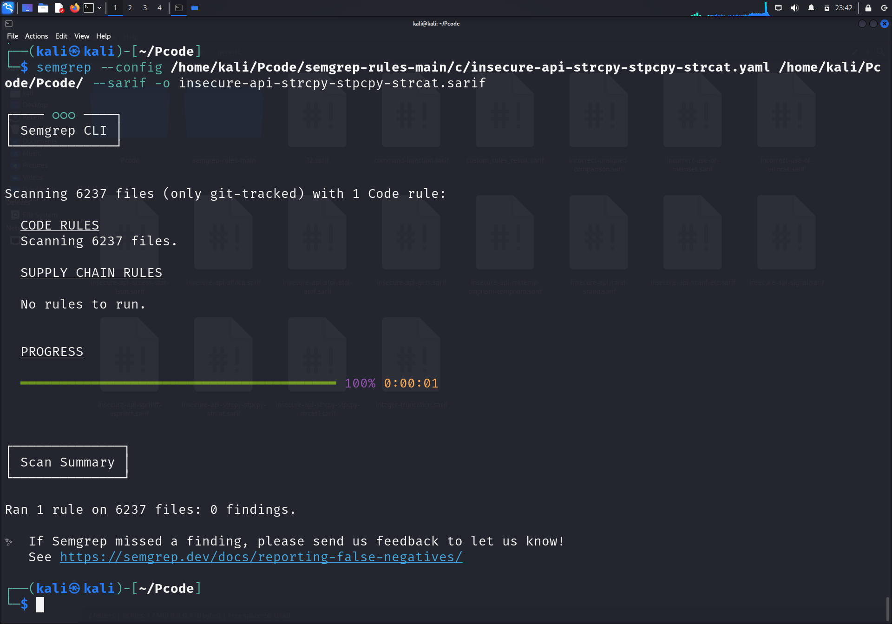


#### 自信程度：media


##### integer-truncation(整数截断)：1375findings
<!-- 这是一张图片，ocr 内容为：3:06 FILE ACTIONS EDIT VIEW HELP (KALI@KALI)-[PCODE/MID] INTEGER-TRUNCATION.SARIF --CONFIG /HO 8 /HOME/KALI/PCODE/SENGREP-RULES-MAIN/C/INTEGER-TRUNCATION.YAML /HOME/KALI/PCODE/PCODE/ -SARIF SEMGREP # 000 SEMGREP CLI 6237 FILES (ONLY GIT-TRACKED) WITH SCANNING CODE RULE: CODE RULES SCANNING 6237  FILES. SUPPLY CHAIN RULES NO RULES TO RUN. PROGRESS 100%0:00:25 SCAN SUMMARY SOME FILES WERE SKIPPED OR ONLY PARTIALLY ANALYZED. PARTIALLY SCANNED; 100 FILES ONLY PARTIALLY ANALYZED DUE TO PARSING OR INTERNAL SEMGREP ERREP ERRORS RAN 1 RULE ON 6237 FILES:1375 FINDINGS. A NEW VERSION OF SEMGREP IS AVAILABLE. SEE HTTPS://SENGREP.DEV/DOCS/UPGRADING TOO MANY FINDINGS? TRY SENGREP PRO FOR MORE POWERFUL QUERIES AND LESS NOISE. SEE HTTPS://SG.RUN/FALSE-POSITIVES, (KALI&KALI)-[PCODE/MID] -->
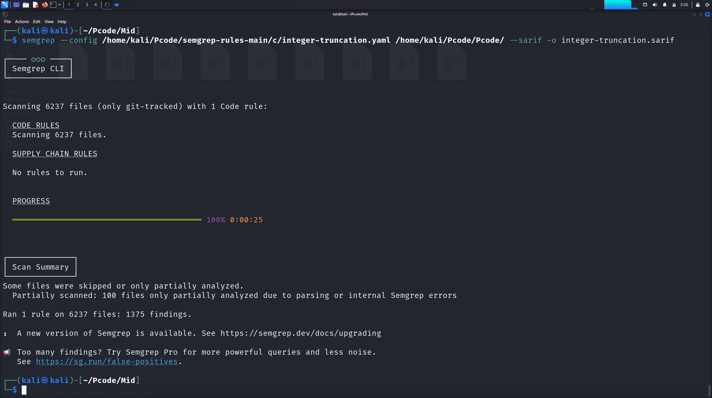

**目的**: 识别代码中可能发生整数截断的场景。  

**问题描述**:

+ 截断错误发生在将较大整数值赋值给较小类型（如 `int` 转 `char`）时，高位数据可能被丢弃，从而导致数据完整性问题。
+ 截断错误的后果可能包括：
    - 数据精度丢失。
    - 逻辑错误（如溢出或意外的负值）。
    - 安全漏洞（例如，值验证失效）。

##### **具体触发条件：**
1. **涉及的类型转换**:
    - `char`、`short`、`int`、`long` 以及它们的无符号类型。
    - 例如：
        * `(char $NARROW) = <... (int $LARGE) ...>`
        * `(short $NARROW) = <... (long $LARGE) ...>`
2. **函数返回值检查**:
    - 函数声明返回较小类型，但实际返回语句为较大类型。
    - 示例模式：

```plain
c


复制代码
char $FUN(...) {
    ...
    return (short $LARGE);
}
```

3. **特定的场景和排除**:
    - 使用 `pattern-not` 防止误报。
    - 例如，排除字符串的使用（如 `sizeof("...")`）。


##### interesting-api-calls（敏感api调用）：1625findings
<!-- 这是一张图片，ocr 内容为：FILE ACTIONS EOT VIEW HETP 000 SEMGREP CLI 6237 FILES (ONLY GIT WITH SCANNING CODE RULE: GIT-TRACKED) CODE RULES SCANNING 6237  FILES. SUPPLY CHAIN RULES NO RULES TO RUN. PROGRESS 100% 0:00:59 SCAN SUMMARY SOME FILES WERE SKIPPED OR ONLY PARTIALLY ANALYZED. PARTIALLY SCANNED; 100 FILES ONLY PARTIALLY ANALYZED DUE TO PARSING OR INTERNAL SEMGREP ERREP ERRORS RAN 1 RULE ON 6237 FILES:1625 FINDINGS. A NEW VERSION OF SEMGREP IS AVAILABLE. SEE HTTPS://SENGREP.DEV/DOCS/UPGRADING TOO MANY FINDINGS? TRY SENGREP PRO FOR MORE POWERFUL QUERIES AND LESS NOISE. SEE HTTPS://SG.RUN/FALSE-POSITIVES, (KALI&KALI)-[PCODE/MID] -->
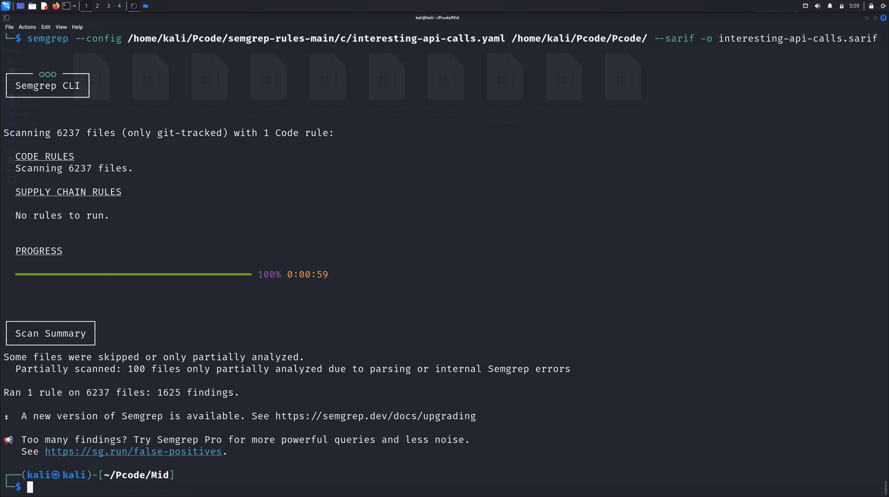


##### pointer-subtraction（指针减法）：1findings
<!-- 这是一张图片，ocr 内容为：E ACTIONS EDIT VIELLP IF SEMGREP MISSED A FINDING, PLEASE SEND US FEEDBACK TO LET US KNOW! SEE HTTPS://SEMGREP.DEV/DOCS/REPORTING-FALSE-NEGATIVES/ (KALI@KALI)-[~/PCODE/MID] SONGTEP --SONFIR /HOMS/HALE/PCODE/SENGREP-TULES-NAZNAZNAZNTER-SUBTRACTLON-YANL /HONE/KAZE/KAZEDO/PEOD POINTER-SUBTRACTION.SARIF SARIF 000 - SEMGREP CLI SCANNING 6237 FILES (ONLY GIT-TRACKED) WITH 1 CODE RULE: CODE RULES SCANNING 6237  FILES. SUPPLY CHAIN RULES NO RULES TO RUN. PROGRESS 100% 0:00:49 SCAN SUMMARY FILES WERE SKIPPED OR ONLY PARTIALLY ANALYZED. SOME FIL PARTIALIY  SCANN Y SCANNED; 100 FILES ONLY PARTIALLY ANALYZED DUE TO PARSING OR INTERNAL SENGREP ERRORS 1 RULE ON 6237 FILES:1 FINDING. RAN: NEW VERSION OF SEMGREP IS AVAILABLE. SEE HTTPS://SEMGREP.DEV/DOCS/UPGRADING -(KALI@KALI)-[~/PCODE/MID] -->
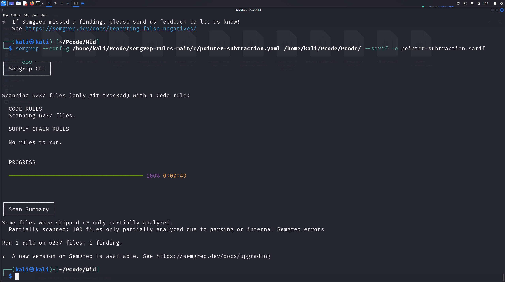


##### double-free
<!-- 这是一张图片，ocr 内容为：FILE ACTIONS EDIT VIEW HELP (KALI@KALI)-[~/PCODE/MID] --SARIF -O DOUBLE-FREE.SARIF /HOME/KALI/PCODE/PCODE/ --CONFIG /H /HOME/KALI/PCODE/SEMGREP-RULES-MAIN/C/DOUBLE-FREE.YAML SEMGREP # SEMGREP CLI 6237 FILES (ONLY GIT-TRACKED) WITH 1 CODE RULE: SCANNING CODE RULES SCANNING 6237  FILES. SUPPLY CHAIN RULES NO RULES TO RUN. PROGRESS 100%0:00:19 SCAN SUMMARY E FILES WERE SKIPPED OR ONLY PARTIALLY ANALYZED. SOME  FIL PARTIALLY SCANNED: 43 FILES ONLY PARTIALLY ANALYZED DUE TO PARSING OR INTERNAL SEMGREP ERREP ERRORS RAN 1 RULE ON 6237 FILES:0 FINDINGS. A NEW VERSION OF SEMGREP IS AVAILABLE. SEE HTTPS://SEMGREP.DEV/DOCS/UPGRADING IF SEMGREP MISSED A FINDING, PLEASE SEND US FEEDBACK TO LET US KNOW! SEE HTTPS://SEMGREP.DEV/DOCS/REPORTING-FALSE-NEGATIVES/ -KALI)-KALI)-[PCODE/MID] -->
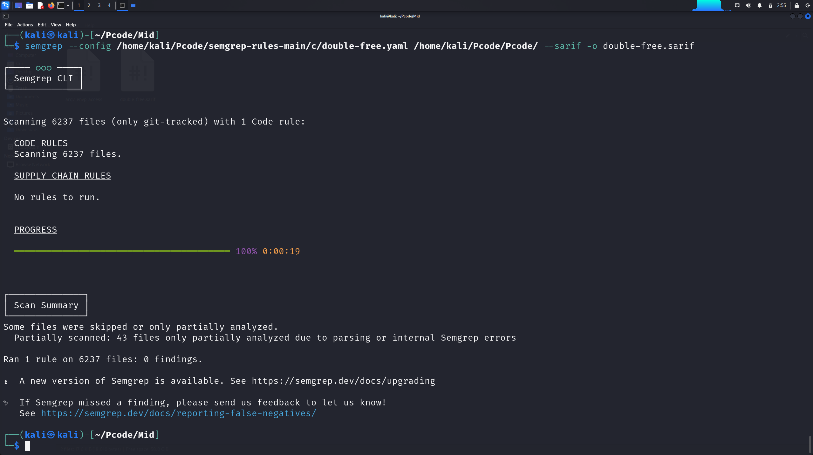


##### format-string-bugs
<!-- 这是一张图片，ocr 内容为：HALIGLAN-FRODENED FILE ACTIONS EDIT VIEW HELP (KALI@KALI)-[PCODE/MID] FORMAT-STRING-BUGS.SARIF 8 /HOME/KALI/PCODE/SEMGREP-RULES-MAIN/C/FORMAT-STRING-BUGS.YAML /HOME/KALI/PCODE/PCODE/ SARIF --CONFIG /HO SEMGREP # 000 SEMGREP CLI 6237 FILES (ONLY GIT-TRACKED) WITH 1 CODE RULE: SCANNING CODE RULES SCANNING 6237  FILES. SUPPLY CHAIN RULES NO RULES TO RUN. PROGRESS 100% 0:00:21 SCAN SUMMARY ES WERE SKIPPED OR ONLY PARTIALLY ANALYZED. SOME FILES WERE LLY SCANNED: 66 FILES ONLY PARTIALLY ANALYZED DUE TO PARSING OR INTERNAL SENGREP ERRORS PARTIALLY S RAN 1 RULE ON 6237 FILES:0 FINDINGS. A NEW VERSION OF SEMGREP IS AVAILABLE. SEE HTTPS://SEMGREP.DEV/DOCS/UPGRADING IF SEMGREP MISSED A FINDING, PLEASE SEND US FEEDBACK TO LET US KNOW! SEE HTTPS://SEMGREP.DEV/DOCS/REPORTING-FALSE-NEGATIVES/ -KALI)-KALI)-[PCODE/MID] -->
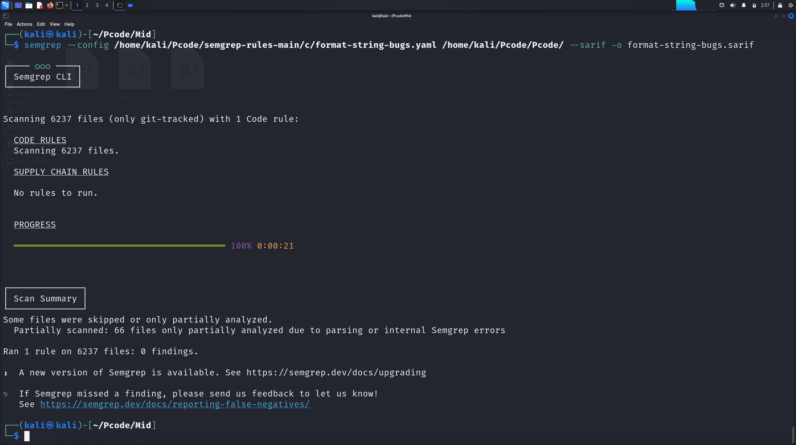


##### incorrect-order-setuid-setgid-etc
<!-- 这是一张图片，ocr 内容为：FILE ACTIONS EDIT VIEW HELP (KALI KALI)-[PCODE/MID] --SARIF INCORRECT-ORDER  SEMGREP -- -SETUID-SETGID-ETC.SARIF SEMGREP CLI DAUBIN-TRCE.SORIT SCANNING 6237 FILES (ONLY GIT-TRACKED) WITH 1 CODE RULE: CODE RULES SCANNING 6237  FILES. SUPPLY CHAIN RULES NO RULES TO RUN. PROGRESS 000:00 100%0 SCAN SUMMARY RAN 1 RULE ON 6237 FILES:0 FINDINGS. A NEW VERSION OF SEMGREP IS AVAILABLE. SEE HTTPS://SEMGREP.DEV/DOCS/UPGRADING IF SEMGREP MISSED A FINDING, PLEASE SEND US FEEDBACK TO LET US KNOW! SEE HTTPS://SEMGREP.DEV/DOCS/REPORTING-FALSE-NEGATIVES/ -KALI)-KALI)-[PCODE/MID] -->
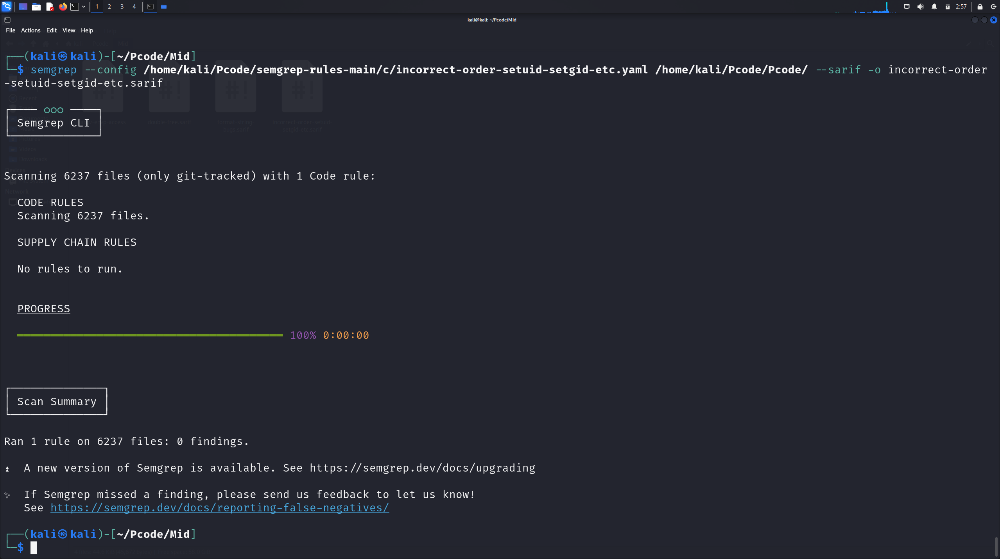


##### incorrect-use-of-free
<!-- 这是一张图片，ocr 内容为：FILE ACTIONS EOT VIEW HETP INCORRECT-USE-OF-FREE.SARIF 000 SEMGREP CLI 6237 FILES (ONLY GIT WITH SCANNING RULE: GIT-TRACKED) CODE CODE RULES SCANNING 6237  FILES. SUPPLY CHAIN RULES NO RULES TO RUN. PROGRESS 100%0:00:41 SCAN SUMMARY SOME FILES WERE SKIPPED OR ONLY PARTIALLY ANALYZED. PARTIALLY SCANNED: 48 FILES ONLY PARTIALLY ANALYZED DUE TO PARSING OR INTERNAL SEMGREP ERRORS RAN 1 RULE ON 6237 FILES:0 FINDINGS. A NEW VERSION OF SEMGREP IS AVAILABLE. SEE HTTPS://SEMGREP.DEV/DOCS/UPGRADING IF SEMGREP MISSED A FINDING, PLEASE SEND US FEEDBACK TO LET US KNOW! SEE HTTPS://SEMGREP.DEV/DOCS/REPORTING-FALSE-NEGATIVES/ -KALISKALI)-[~/PCODE/MID] -->
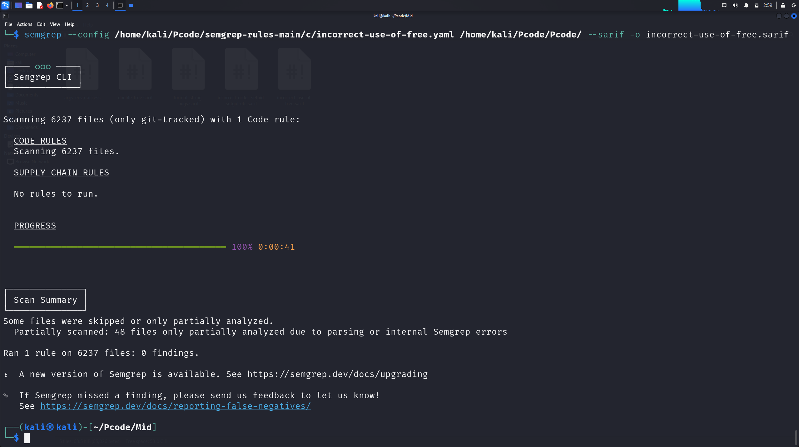


##### incorrect-use-of-sizeof
<!-- 这是一张图片，ocr 内容为：INCORRECT-USE-OF-SIZEOF.S --SARIF ARIF 000 SEMGREP CLI 6237 FILES (ONLY GIT WITH SCANNING CODE RULE: GIT-TRACKED) CODE RULES SCANNING 6237  FILES. SUPPLY CHAIN RULES NO RULES TO RUN. PROGRESS 100% 0:00:49 SCAN SUMMARY SOME FILES WERE SKIPPED OR ONLY PARTIALLY ANALYZED. PARTIALLY SCANNED; 100 FILES ONLY PARTIALLY ANALYZED DUE TO PARSING OR INTERNAL SEMGREP ERREP ERRORS RAN 1 RULE ON 6237 FILES:0 FINDINGS. A NEW VERSION OF SEMGREP IS AVAILABLE. SEE HTTPS://SEMGREP.DEV/DOCS/UPGRADING IF SEMGREP MISSED A FINDING, PLEASE SEND US FEEDBACK TO LET US KNOW! SEE HTTPS://SEMGREP.DEV/DOCS/REPORTING-FALSE-NEGATIVES/ (KALI)-KALI)-[PCODE/MID] -->
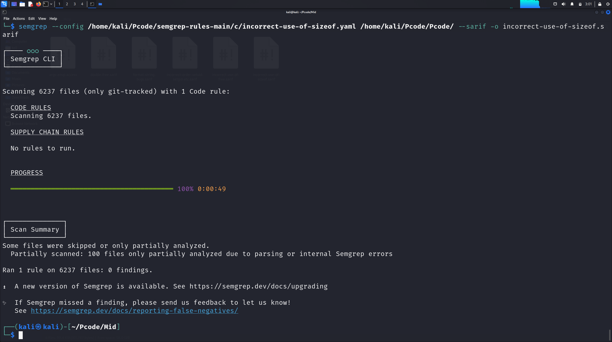


##### incorrect-use-of-sprintf-snprintf
<!-- 这是一张图片，ocr 内容为：INCORRECT-USE-O S SEMGREP --CONT F-SPRINTF-SNPRINTF.SARIF 井! 000 SEMGREP CLI FILES (ONLY GIT-TRACKED) WITH 6237 SCANNING CODE RULE: CODE RULES SCANNING 6237  FILES. SUPPLY CHAIN RULES NO RULES TO RUN. PROGRESS 100%0:00:08 SCAN SUMMARY E FILES WERE SKIPPED OR ONLY PARTIALLY ANALYZED. SOME  FILES PARTIALLY SCANNED: 31 FILES ONLY PARTIALLY ANALYZED DUE TO PARSING OR INTERNAL SEMGREP ERRORSORS RAN 1 RULE ON 6237 FILES:0 FINDINGS. A NEW VERSION OF SEMGREP IS AVAILABLE. SEE HTTPS://SEMGREP.DEV/DOCS/UPGRADING IF SEMGREP MISSED A FINDING, PLEASE SEND US FEEDBACK TO LET US KNOW! SEE HTTPS://SEMGREP.DEV/DOCS/REPORTING-FALSE-NEGATIVES/ -KALI)-KALI)-[PCODE/MID] -->
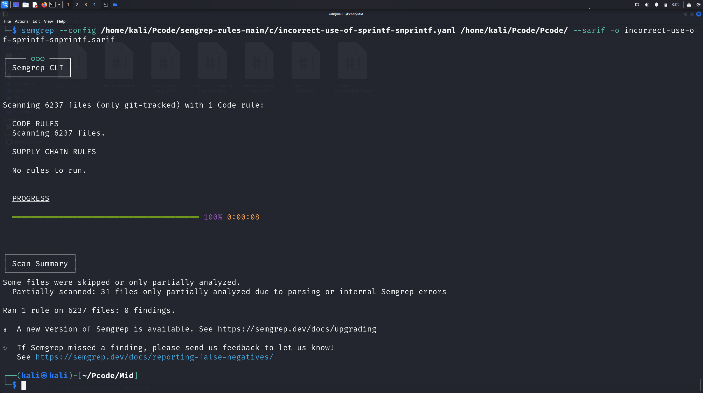


##### incorrect-use-of-strncpy-stpncpy-strlcpy
<!-- 这是一张图片，ocr 内容为：HELP EDIT -OF-STRNCPY-STPNCPY-STRLCPY.SARIF 000 SEMGREP CLI (ONLY GIT-TRACKED) WITH 1 CODE RULE: FILES SCANNING 6237 CODE RULES SCANNING  6237  FILES. SUPPLY CHAIN RULES RULES TO RUN. ON PROGRESS 100%0:00:49 SCAN SUMMARY SOME FILES WERE SKIPPED OR ONLY PARTIALLY ANALYZED. FILES ONLY PARTIALLY ANALYZED DUE TO PARSING OR INTERNAL SEMGREP ERRORS PARTIALLY SCANNED:100 FILES O RAN 1 RULE ON 6237 FILES:0 FINDINGS. A NEW VERSION OF SEMGREP IS AVAILABLE. SEE HTTPS://SEMGREP.DEV/DOCS/UPGRADING IF SEMGREP MISSED A FINDING, PLEASE SEND US FEEDBACK TO LET US KNOW! HTTPS://SEMGREP.DEV/DOCS/REPORTING-FALSE-NEGATIVES/ SEE H -->
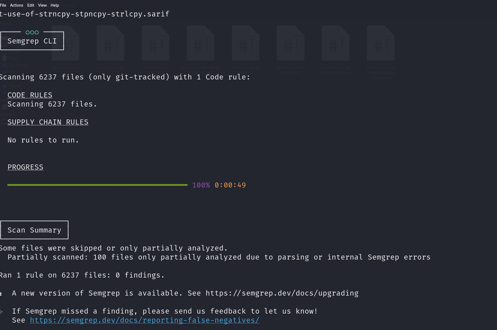


##### off-by-one
<!-- 这是一张图片，ocr 内容为：FILE ACTIONS EDIT VIEW HELP (KALI@KALI)-[~/PCODE/MID] --CONFIG /HOL SEMGREP 井 000 SEMGREP CLI 6237 FILES (ONLY GIT-TRACKED) WITH SCANNING CODE RULE: CODE RULES SCANNING 6237  FILES. SUPPLY CHAIN RULES NO RULES TO RUN. PROGRESS 100%0:02:19 SCAN SUMMARY NE FILES WERE SKIPPED OR ONLY PARTIALLY ANALYZED. SOME  FILE PARTIALLY SCANNED: 132 FILES ONLY PARTIALLY ANALYZED DUE TO PARSING OR INTERNAL SEMGREP ERRORS RAN 1 RULE ON 6237 FILES:0 FINDINGS. A NEW VERSION OF SEMGREP IS AVAILABLE. SEE HTTPS://SEMGREP.DEV/DOCS/UPGRADING IF SEMGREP MISSED A FINDING, PLEASE SEND US FEEDBACK TO LET US KNOW! SEE HTTPS://SEMGREP.DEV/DOCS/REPORTING-FALSE-NEGATIVES/ -KALI)-KALI)-[PCODE/MID] -->
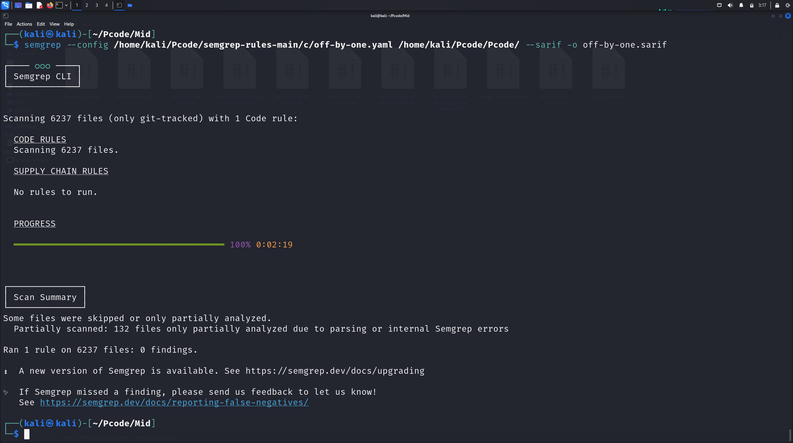


##### suspicious-assert
<!-- 这是一张图片，ocr 内容为：FILE ACTIONS EDIT VIEW HELP (KALI@KALI)-[~/PCODE/MID] --CONFIG /HOL 8 /HOME/KALI/PCODE/SENGREP-RULES-MAIN/C/SUSPICIOUS-ASSERT.YAML /HOME/KALI/PCODE/PCODE/ --SARIF -0 SUSPICIOUS-ASSERT.SARIF SEMGREP 井 000 SEMGREP CLI 6237 FILES (ONLY GIT-TRACKED) WITH SCANNING CODE RULE: CODE RULES SCANNING 6237  FILES. SUPPLY CHAIN RULES NO RULES TO RUN. PROGRESS 100% 0:00:48 SCAN SUMMARY SOME FILES WERE SKIPPED OR ONLY PARTIALLY ANALYZED. PARTIALLY SCANNED; 100 FILES ONLY PARTIALLY ANALYZED DUE TO PARSING OR INTERNAL SEMGREP ERREP ERRORS RAN 1 RULE ON 6237 FILES:0 FINDINGS. A NEW VERSION OF SEMGREP IS AVAILABLE. SEE HTTPS://SEMGREP.DEV/DOCS/UPGRADING IF SEMGREP MISSED A FINDING, PLEASE SEND US FEEDBACK TO LET US KNOW! SEE HTTPS://SEMGREP.DEV/DOCS/REPORTING-FALSE-NEGATIVES/ -(KALI)-[~[~[~/PCODE/MID] -->
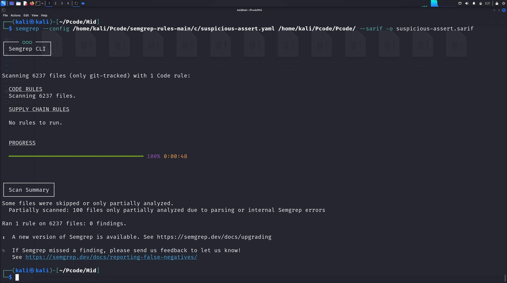


##### unchecked-ret-malloc-calloc-realloc
<!-- 这是一张图片，ocr 内容为：FILE ACTIONS EOR WEW HETP UNCHECKED-RET -MALLOC-CALLOC-REALLOC.SARIF 000 SEMGREP CLI SCANNING 6237 FILES (ONLY GIT-TRACKED) WITH CODE RULE: CODE RULES SCANNING 6237  FILES. SUPPLY CHAIN RULES NO RULES TO RUN. PROGRESS 100% 0:10:01 SCAN SUMMARY FILES WERE SKIPPED OR ONLY PARTIALLY ANALYZED. SOME  FILE! PARTIALLY SCANNED; 169 FILES ONLY PARTIALLY ANALYZED DUE TO PARSING OR INTERNAL SEMGREP ERREP ERRORS RAN 1 RULE ON 6237 FILES:0 FINDINGS. A NEW VERSION OF SEMGREP IS AVAILABLE. SEE HTTPS://SEMGREP.DEV/DOCS/UPGRADING IF SEMGREP MISSED A FINDING, PLEASE SEND US FEEDBACK TO LET US KNOW! SEE HTTPS://SEMGREP.DEV/DOCS/REPORTING-FALSE-NEGATIVES/ -KALI)-KALI)-[PCODE/MID] -->
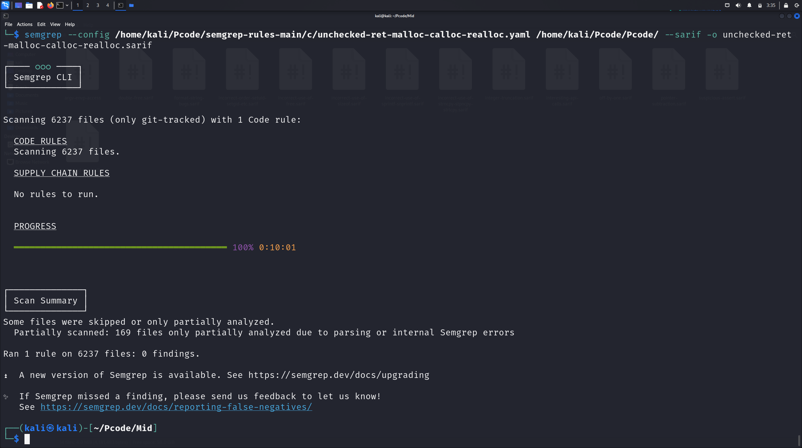


##### unchecked-ret-scanf-etc
<!-- 这是一张图片，ocr 内容为：ARIF 000 SEMGREP CLI SCANNING 6237 FILES (ONLY GIT-TRACKED) WITH CODE RULE: CODE RULES SCANNING 6237 FILES. SUPPLY CHAIN RULES NO RULES TO RUN. PROGRESS 100% 0:01:12 SCAN SUMMARY SOME FILES WERE SKIPPED OR ONLY PARTIALLY ANALYZED. PARTIALLY SCANNED; 100 FILES ONLY PARTIALLY ANALYZED DUE TO PARSING OR INTERNAL SEMGREP ERREP ERRORS RAN 1 RULE ON 6237 FILES:0 FINDINGS. A NEW VERSION OF SEMGREP IS AVAILABLE. SEE HTTPS://SEMGREP.DEV/DOCS/UPGRADING IF SEMGREP MISSED A FINDING, PLEASE SEND US FEEDBACK TO LET US KNOW! SEE HTTPS://SEMGREP.DEV/DOCS/REPORTING-FALSE-NEGATIVES/ -KALI`KALI)-[~/PCODE/MID] -->
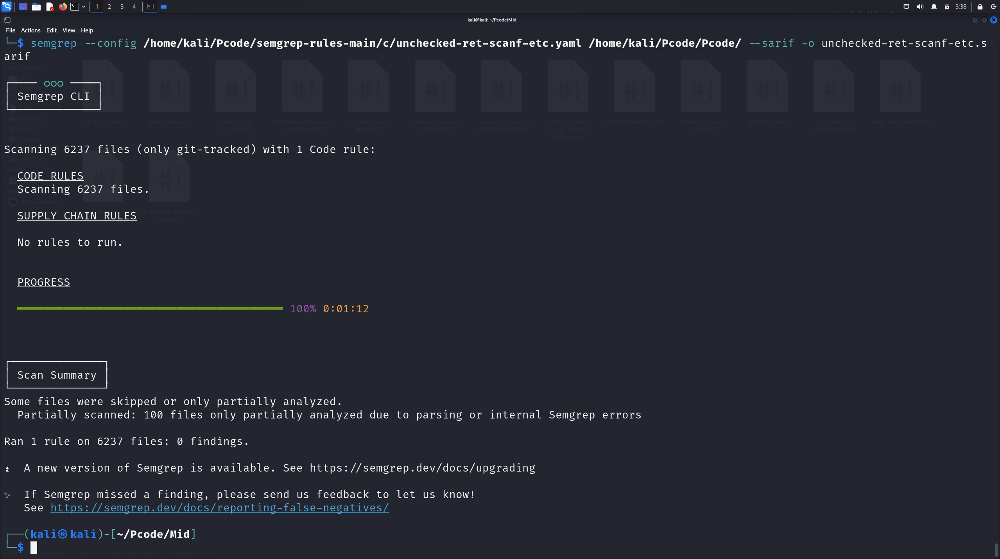


##### unchecked-ret-setuid-seteuid
<!-- 这是一张图片，ocr 内容为：LALLUF -FODEMD S SENGREP -CONFIR /HONE/KALI/PEEDE/SEMGREP-TULES-MAIN//E/UNCHECKED-TET-SETULD-SETEUID.YAML/PCODE/PCOD UNCHECKED-RET-SETUID --SARIF -SETEUID.SARIF SEMGREP CLI SCANNING 6237 FILES (ONLY GIT-TRACKED) WITH 1 CODE RULE: CODE RULES SCANNING 6237  FILES. SUPPLY CHAIN RULES NO RULES TO RUN. PROGRESS 100% 0:01:06 SCAN SUMMARY SOME FILES WERE SKIPPED OR ONLY PARTIALLY ANALYZED. PARTIALLY SCANNED; 100 FILES ONLY PARTIALLY ANALYZED DUE TO PARSING OR INTERNAL SEMGREP ERREP ERRORS RAN 1 RULE ON 6237 FILES:0 FINDINGS. A NEW VERSION OF SEMGREP IS AVAILABLE. SEE HTTPS://SEMGREP.DEV/DOCS/UPGRADING IF SEMGREP MISSED A FINDING, PLEASE SEND US FEEDBACK TO LET US KNOW! SEE HTTPS://SEMGREP.DEV/DOCS/REPORTING-FALSE-NEGATIVES/ -KALI@KALI)-[~/PCODE/MID] -->
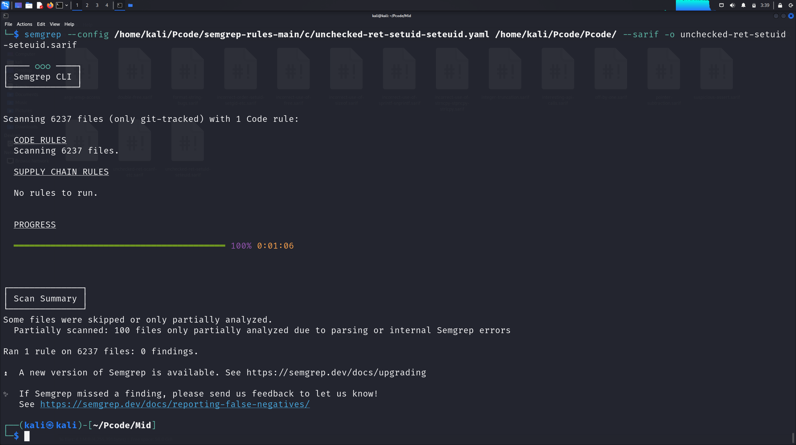


##### unsafe-ret-snprintf-vsnprintf
<!-- 这是一张图片，ocr 内容为：LALIGKALI -FOODED UNSAFE-RETSNPRINTF -VSNPRINTF.SARIF 000 SEMGREP CLI SCANNING 6237 FILES (ONLY GIT-TRACKED) WITH 1 CODE R DE RULE: CODE RULES SCANNING 6237  FILES. SUPPLY CHAIN RULES NO RULES TO RUN. PROGRESS 100%0:00:07 SCAN SUMMARY SOME FILES W S WERE SKIPPED OR ONLY PARTIALLY ANALYZED. PARTIALLY SCANNED: 30 FILES ONLY PARTIALLY ANALYZED DUE TO PARSING OR INTERNAL SEMGREP ERFORSORS RAN 1 RULE ON 6237 FILES:0 FINDINGS. A NEW VERSION OF SEMGREP IS AVAILABLE. SEE HTTPS://SEMGREP.DEV/DOCS/UPGRADING IF SEMGREP MISSED A FINDING, PLEASE SEND US FEEDBACK TO LET US KNOW! SEE HTTPS://SEMGREP.DEV/DOCS/REPORTING-FALSE-NEGATIVES/ -KALI)-KALI)-[PCODE/MID] -->
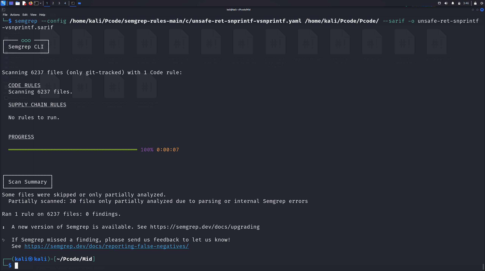


##### unsafe-ret-strlcpy-strlcat
<!-- 这是一张图片，ocr 内容为：FILE ACTIONS EOR VIEW HELQ -KALI@KALI)-[PCODE/MID] --SARIF-OUNSAFE-RET-STRLCPY-STR LCAT.SARIF SEMGREP CLI ING 6237 FILES (ONLY GIT-TRACKED) WITH 1 CODE RULE: 6237 SCANNING RULES CODE SCANNING 6237  FILES. SUPPLY CHAIN RULES NO RULES TO RUN. PROGRESS 100%0:00:00 SCAN SUMMARY RAN 1 RULE ON 6237 FILES:0 FINDINGS. A NEW VERSION OF SEMGREP IS AVAILABLE. SEE HTTPS://SEMGREP.DEV/DOCS/UPGRADING IF SEMGREP MISSED A FINDING, PLEASE SEND US FEEDBACK TO LET US KNOW! SEE HTTPS://SEMGREP.DEV/DOCS/REPORTING-FALSE-NEGATIVES/ -KALI)-KALI)-[PCODE/MID] -->
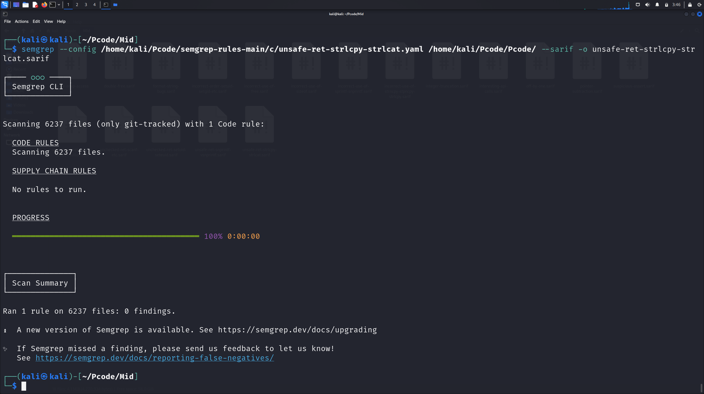


##### unsafe-strlen
<!-- 这是一张图片，ocr 内容为：FILE ACTIONS EDIT VIEW HELP (KALI@KALI)-[~/PCODE/MID]  --SARIF -O UNSAFE-STRLEN.SARIF /HOME/KALI/PCODE/SEMGREP-RULES-MAIN/C/UNSAFE-STRLEN.YAML /HOME/KALI/PCODE/PCODE --CONFIG /HO SEMGREP 000 SEMGREP CLI SCANNING 6237 FILES (ONLY GIT-TRACKED) WITH 1 CODE ROME RO ODE RULE: CODE RULES SCANNING 6237  FILES. SUPPLY CHAIN RULES NO RULES TO RUN. PROGRESS 100%0:00:06 SCAN SUMMARY SOME FILES WERE SKIPPED OR ONLY PARTIALLY ANALYZED. ILY SCANNED: 13 FILES ONLY PARTIALLY ANALYZED DUE TO PARSING OR INTERNAL SEMGREP ERRORS PARTIALLY RAN 1 RULE ON 6237 FILES: 0 FINDINGS. A NEW VERSION OF SEMGREP IS AVAILABLE. SEE HTTPS://SEMGREP.DEV/DOCS/UPGRADING IF SEMGREP MISSED A FINDING, PLEASE SEND US FEEDBACK TO LET US KNOW! SEE HTTPS://SEMGREP.DEV/DOCS/REPORTING-FALSE-NEGATIVES/ -KALI`KALI)-[~/PCODE/MID] -->
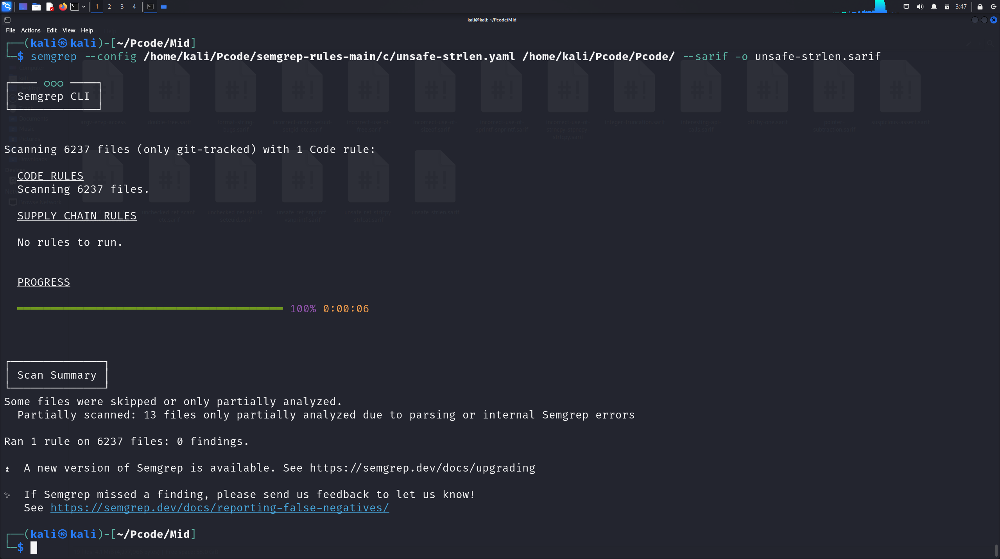


##### unterminated-string-strncpy-stpncpy
<!-- 这是一张图片，ocr 内容为：FILE ACTIONS EDR VIEE HELP UNTERMINATED --SARIF STRING-STRNCPY-STPNCPY.SAR1T 000 SEMGREP CLI SCANNING 6237 FILES (ONLY GIT-TRACKED) WITH 1 CODE ROOM ODE RULE: CODE RULES SCANNING 6237  FILES. SUPPLY CHAIN RULES NO RULES TO RUN. PROGRESS 100% 0:02:27 SCAN SUMMARY SOME FILES WERE SKIPPED OR ONLY PARTIALLY ANALYZED. PARTIALLY SCANNED; 100 FILES ONLY PARTIALLY ANALYZED DUE TO PARSING OR INTERNAL SEMGREP ERREP ERRORS RAN 1 RULE ON 6237 FILES:0 FINDINGS. A NEW VERSION OF SEMGREP IS AVAILABLE. SEE HTTPS://SEMGREP.DEV/DOCS/UPGRADING IF SEMGREP MISSED A FINDING, PLEASE SEND US FEEDBACK TO LET US KNOW! SEE HTTPS://SEMGREP.DEV/DOCS/REPORTING-FALSE-NEGATIVES/ -KALI)-KALI)-[PCODE/MID] -->
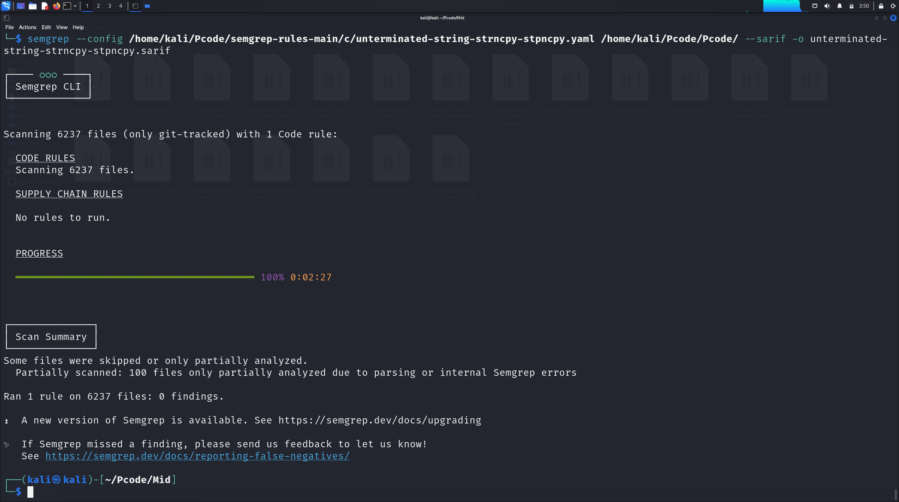


##### use-after-free
<!-- 这是一张图片，ocr 内容为：LALIGKALI-FOODEMID FILE ACTIONS EDIT VIEW HELP (KALI@KALI)-[~/PCODE/MID] I /HOPE/HAJJ/FCOBE/SENGRP-33LES-9AIN//G/USE-AFTAR-{388-YAN1 /HONS//BCOPP/RCOBE/ -3ARIF -O USE-AFLAT-3 --CONFIG /HO SEMGREP 000 SEMGREP CLI SCANNING 6237 FILES (ONLY GIT-TRACKED) WITH 1 CODE ROOM CODE RULE: CODE RULES SCANNING 6237  FILES. SUPPLY CHAIN RULES NO RULES TO RUN. PROGRESS 100%0:00:53 SCAN SUMMARY SOME FILES WERE SKIPPED OR ONLY PARTIALLY ANALYZED. PARTIALLY SCANNED: 43 FILES ONLY PARTIALLY ANALYZED DUE TO PARSING OR INTERNAL SEMGREP ERRORS RAN 1 RULE ON 6237 FILES:0 FINDINGS. A NEW VERSION OF SEMGREP IS AVAILABLE. SEE HTTPS://SEMGREP.DEV/DOCS/UPGRADING IF SEMGREP MISSED A FINDING, PLEASE SEND US FEEDBACK TO LET US KNOW! SEE HTTPS://SEMGREP.DEV/DOCS/REPORTING-FALSE-NEGATIVES/ -KALI)-KALI)-[PCODE/MID] -->
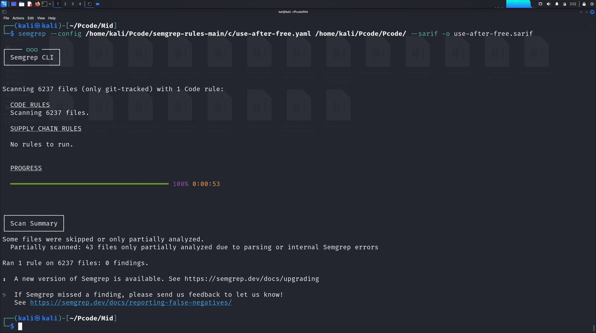


##### write-into-stack-buffer
<!-- 这是一张图片，ocr 内容为：3:55 ITE-INTO-STACK-BUFFER.YAML/HOME/KALI/PCODE/PCODE/ WRITE-INTO-STACK-BUFFER.S --SARIF S SEMGREP --CONFIG /HOME/KALI/PCODE/SEMGREP-RULES-MAIN/C/WRI ARIF 000 SEMGREP CLI SCANNING 6237 FILES (ONLY GIT-TRACKED) WITH 1 CODE RO ODE RULE: CODE RULES SCANNING 6237  FILES. SUPPLY CHAIN RULES NO RULES TO RUN. PROGRESS 100% 0:02:31 SCAN SUMMARY SOME FILES WERE SKIPPED OR ONLY PARTIALLY ANALYZED. PARTIALLY SCANNED; 152 FILES ONLY PARTIALLY ANALYZED DUE TO PARSING OR INTERNAL SEMGREP ERREP ERRORS RAN 1 RULE ON 6237 FILES:0 FINDINGS. A NEW VERSION OF SEMGREP IS AVAILABLE. SEE HTTPS://SEMGREP.DEV/DOCS/UPGRADING IF SEMGREP MISSED A FINDING, PLEASE SEND US FEEDBACK TO LET US KNOW! SEE HTTPS://SEMGREP.DEV/DOCS/REPORTING-FALSE-NEGATIVES/ (KALISKALI)-[PCODE/MID] -->
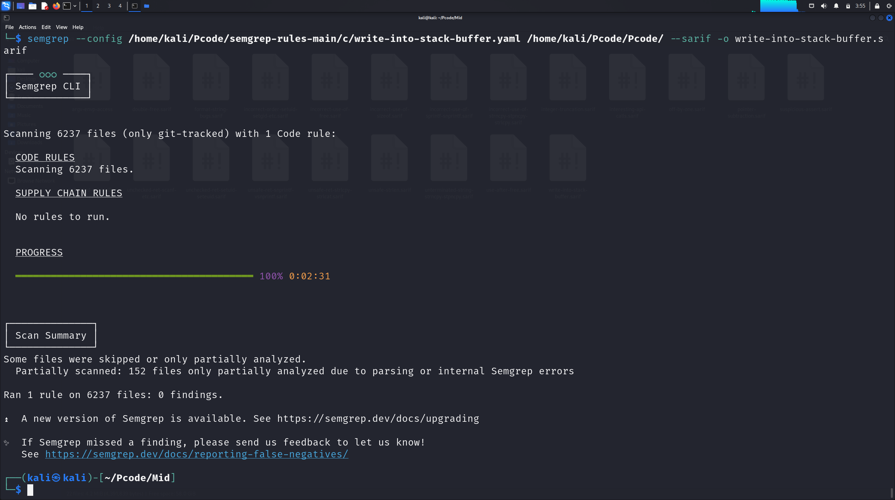


脏数据的流程分析--数据输入--相关路径的危险调用

考虑多线程状况下    复杂的脏数据

结果的自动化分析

