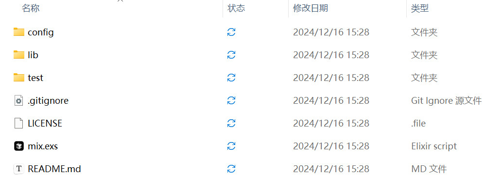
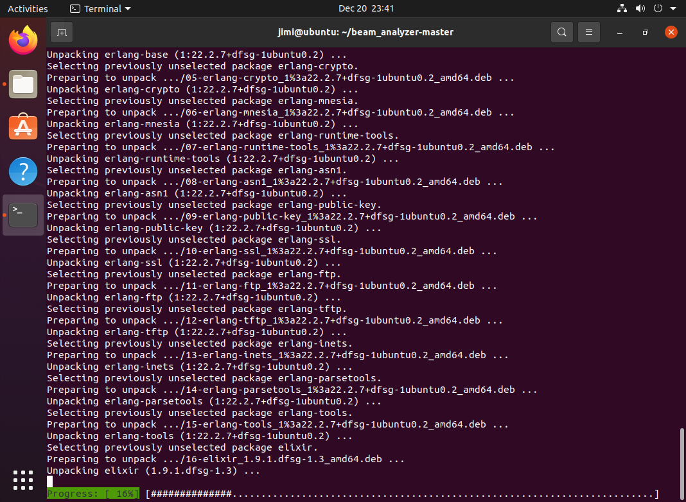
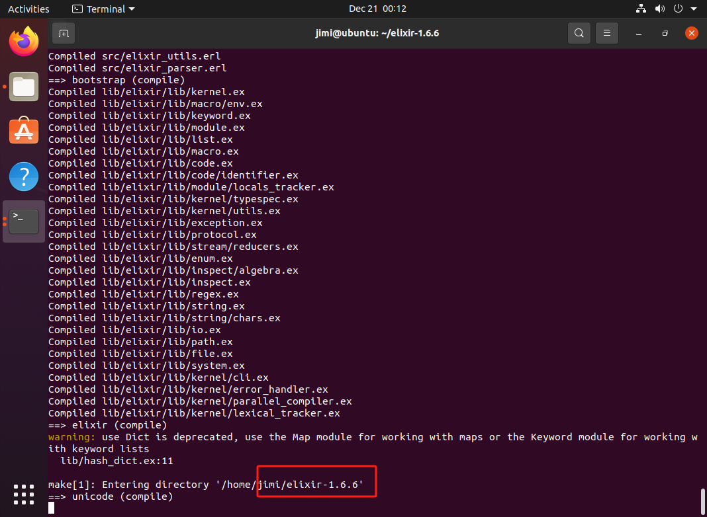
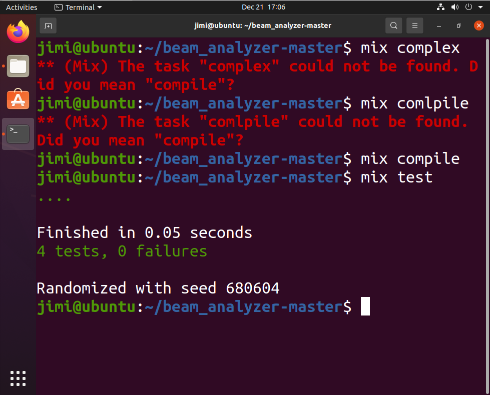
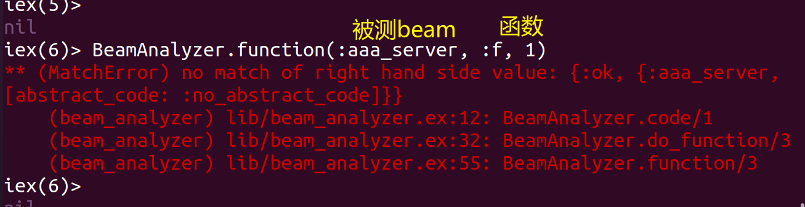
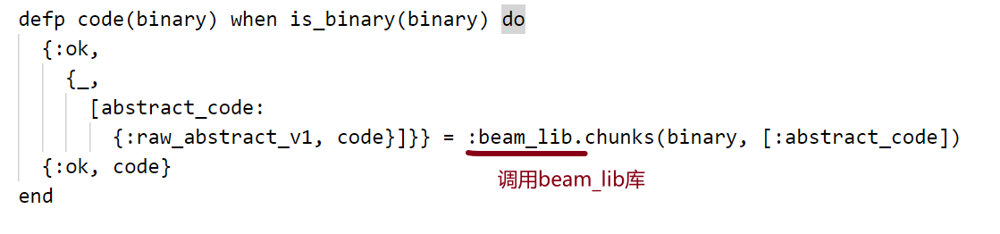
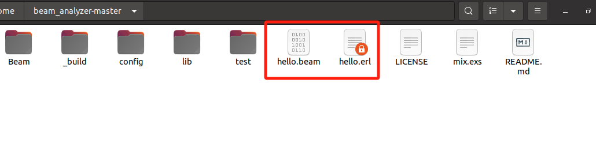
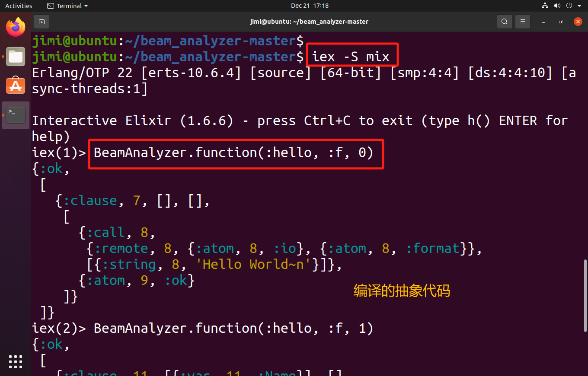
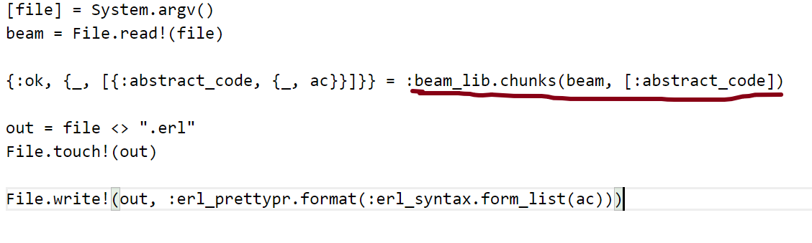
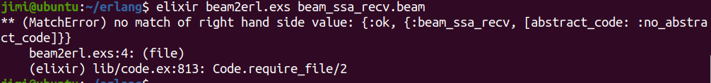

  
  
  
[https://www.erlang.org/doc/apps/stdlib/beam_lib.html](https://www.erlang.org/doc/apps/stdlib/beam_lib.html)


[https://www.cnblogs.com/unqiang/p/3737457.html](https://www.cnblogs.com/unqiang/p/3737457.html)

[http://doofuu.com/article/4156131.html](http://doofuu.com/article/4156131.html)

[https://segmentfault.com/a/1190000041013489](https://segmentfault.com/a/1190000041013489)

<font style="color:rgb(33, 37, 41);"></font>

<font style="color:rgb(33, 37, 41);"></font>


## <font style="color:rgb(33, 37, 41);">beam 分析</font>
对17.9.2 erlang beam文件分析

<font style="color:rgb(51, 51, 51);">1.beam_analyzer-master工具分析</font>

<!-- 这是一张图片，ocr 内容为：类型 修改日期 状态 名称 文件夹 2024/12/16 15:28 CONFIG 文件夹 2024/12/16 15:28 LIB 文件夹 2024/12/16 15:28 TEST GIT LGNORE源文件 2024/12/16 15:28 -GITIGNORE LICENSE .FILE 2024/12/16 15:28 ELIXIR SCRIPT 2024/12/16 15:28 MIX.EXS MD文件 README.MD 2024/12/16 15:28 -->



<font style="color:rgb(33, 37, 41);">ubuntu部署erlang、 elixir环境</font>

<!-- 这是一张图片，ocr 内容为：DEC20 23:41 TERMINAL ACTIVITIES JIMI@UBUNTU:~/BEAM_ANALYZER-MASTER SE (1:22.2.7+DFSG-1UBUNTU0.2) UNPACKING ERLANG-BASE (1:2 PREVIOUSLY UNSELECTED PACKAGE ERLANG-CRYPTO. SELECTING 05-ERLANG-CRYPTO 1%3A22.2.7+DFSG-1UBUNTUO.2_AMD64.DEB PREPARING TO UNPACK ERLANG-CRYPTO (1:22.2.7+DFSG-1UBUNTU0.2) UNPACKING SELECTING PREVIOUSLY UNSELECTED PACKAGE ERLANG-MNESIA. PREPARING TO UNPACK /06-ERLANG-MNESIA_1%3A22.2.7+DFSG-1UBUNTUO.2 AMD64.DEB (1:22.2.7+DFSG-1UBUNTU0.2) UNPACKING ERLANG-MNESIA SELECTING LY UNSELECTED PACKAGE ERLANG-RUNTIME-TOOLS. PREVIOUSIY U -./07-ERLANG-RUNTIME-TOOLS 183A22.2.7+DFSG-LUBUNTUO.2 AMD64.DEB TOUNPACK PREPARING ERLANG-RUNTIME-TOOLS (1:22.2.7+DFSG-1UBUNTUO.2) UNPACKING ? SELECTING PREVIOUSLY UNSELECTED PACKAGE ERLANG-ASN1. ./08-ERLANG-ASN1 1%3A22.2.7+DFSG-1UBUNTU0.2 AMD64.DEB TOUNPACK PREPARING (1:22.2.7+DFSG-1UBUNTU0.2) UNPACKING ERLANG-ASN1 SELECTING PREVIOUSLY U UNSELECTED PACKAGE ERLANG-PUBLIC-KEY. /09-ERLANG-PUBLIC-KEY 1%3A22.2.7+DFSQ-1UBUNTUO.2 AMD64.DEB TOUNPACK PREPARING UNPACKING ERLANG-PUBLIC-KEY (1:22.2.7+DFSG-1UBUNTUO.2) SELECTING LY UNSELECTED PACKAGE ERLANG-SSL. PREVIOUSLY /10-ERLANG-SSL 1%3A22.2.7+DFSG-1UBUNTUO.2 AMD64.DEB TO UNPACK PREPARING (1:22.2.7+DFSG-1UBUNTU0.2) UNPACKING ERLANG-SSL PREVIOUSLY UNSELECTED PACKAGE ERLANG-FTP. SELECTING /11-ERLANG-FTP 1%3A22.2.7+DFSG-1UBUNTUO.2 AMD64.DEB TOUNPACK PREPARING UNPACKING ERLANG-FTP (1:22.2.7+DFSG-1UBUNTU0.2) SELECTING PREVIOUSLY UNSELECTED PACKAGE ERLANG-TFTP. /12-ERLANG-TFTP 1%3A22.2.7+DFSG-1UBUNTUO.2_AND64.DEB TO UNPACK PREPARING (1:22.2.7+DFSG-1UBUNTUO.2) UNPACKING ERLANG-TFTP SELECTING PREVIOUSLY UNSELECTED PACKAGE ERLANG-INETS. /13-ERLANG-INETS_1%3A22.2.7+DFSG-1UBUNTU0.2_AMD64.DEB TO UNPACK PREPARING ERLANG-INETS (1:22.2.7+DFSG-1UBUNTU0.2) . UNPACKING SELECTING PREVIOUSLY UNSELECTED PACKAGE ERLANG-PARSETOOLS.  /14-ERLANG-PARSETOOLS 1%3A22.2.7+DFSQ-1UBUNTUO.2 AND64.DEB. TO UNPACK PREPARING UNPACKING ERLANG-PARSETOOLS (1:22.2.7+DFSG-1UBUNTUO.2) SELECTING PREVIOUSLY UNSELECTED PACKAGE ERLANG-TOOLS. /15-ERLANG-TOOLS_1%3A22.2.7+DFSG-1UBUNTU0.2_AND64.DEB TO UNPACK PREPARING (1:22.2.7+DFSG-1UBUNTU0.2) . UNPACKING ERLANG-TOOLS Y UNSELECTED PACKAGE ELIXIR. SELECTING PREVIOUSLY U ./16-ELIXIR_1.9.1.DFSG-1.3_AMD64.DEB TO UNPACK PREPARING ELIXIR(1.9.1.DFSG-1.3) UNPACKING PROGRESS: [#############. 16% -->



<font style="color:rgb(33, 37, 41);">运行beam_analyzer-master显示版本不兼容，重新下载低版本的elixir</font>

<!-- 这是一张图片，ocr 内容为：00:12 DEC21 ACTIVITIES TERMINAL JIMI@UBUNTU:~/ELIXIR-1.6.6 COMPILED SRC/ELIXIR UTILS.ERL ELIXIR_PARSER.ERL COMPILED SRC/EL >> BOOTSTRAP (COMPILE) COMPILED LIB/ELIXIR/LIB/KERNEL.EX D LIB/ELIXIR/LIB/MACRO/ENV.EX COMPILED LIT COMPILED LIB/ELIXIR/LIB/KEYWORD.EX COMPILED LIB/ELIXIR/LIB/MODULE.EX COMPILED LIB/ELIXIR/LIB/LIST.EX COMPILED LIB/ELIXIR/LIB/MACRO.EX COMPILED LIB/ELIXIR/LIB/CODE.EX COMPILED TIB/ELIXIR/LIB/CODE/IDENTIFIER.EX COMPILED LIB/ELIXIR/LIB/MODULE/LOCALS TRACKER.EX COMPILED LIB/ELIXIR/LIB/KERNEL/TYPESPEC.EX COMPILED LIB/ELIXIR/LIB/KERNEL/UTILS.EX COMPILED LIB/ELIXIR/LIB/EXCEPTION.EX LIB/ELIXIR/LIB/PROTOCOL.EX COMPILED LI D LIB/ELIXIR/LIB/STREAM/REDUCERS.EX COMPILED L COMPILED LIB/ELIXIR/LIB/ENUM.EX COMPILED LIB/ELIXIR/LIB/INSPECT/ALGEBRA.EX COMPILED LIB/ELIXIR/LIB/INSPECT.EX COMPILED LIB/ELIXIR/LIB/REGEX.EX LIB/ELIXIR/LIB/STRING.EX COMPILED COMPILED LIB/ELIXIR/LIB/STRING/CHARS.EX COMPILED LIB/ELIXIR/LIB/IO.EX LIB/ELIXIR/LIB/PATH.EX COMPILED COMPILED LIB/ELIXIR/LIB/FILE.EX COMPILED LIB/ELIXIR/LIB/SYSTEM.EX LIB/ELIXIR/LIB/KERNEL/CLI.EX COMPILED L COMPILED LIB/ELIXIR/LIB/KERNEL/ERROR HANDLER.EX COMPILED LIB/ELIXIR/LIB/KERNEL/PARALLEL_COMPILER.EX COMPILED LIB/ELIXIR/LIB/KERNEL/LEXICAL_TRACKER.EX  三> ELIXIR (COMPILE) : DEPRECATED, USE THE NAP MODULE FOR WORKING WITH NAPS OR THE KEYWORD NODULE FOR WORKING W  WARNING: USE DICT IS DE ITH KEYWORD LISTS LIB/HASH DICT.EX:11 MAKE[1]:ENTERING DIRECTORY /HOME/JIMI/ELIXIR-1.6.6.6 UNICODE(COMPILE) -->



<font style="color:rgb(33, 37, 41);">编译项目：</font>

<font style="color:rgb(33, 37, 41);">mix deps.get</font>

<font style="color:rgb(33, 37, 41);">mix compile</font>

<font style="color:rgb(33, 37, 41);"></font>

<font style="color:rgb(33, 37, 41);">运行测试：</font>

<font style="color:rgb(33, 37, 41);">mix test</font>

<!-- 这是一张图片，ocr 内容为：17:06 DEC21 ACTIVITIES TERMINAL JIMI@UBUNTU:~/BEAM_ANALYZER-MASTER MIX COMPLEX JIMI@UBUNTU:~/BEAM_ANALYZER-MASTER$ (MIX)  THE TASK "COMPLEX"  COULD NOT BE FOUND. D ** ID "COMPILE"? YOU MEAN JIMI@UBUNTU:~/BEAM_A BEAM_ANALYZER-MASTER$ MIX COMLPILE * (MIX) THE TASK "COMLPILE" COULD NOT BE FOUND. ** "COMPILE"? N DID YOU MEAN MIX COMPILE JIMI@UBUNTU:~/BEAM_ANALYZER-MASTER$ JIMIQUBUNTU:~/BEAM_ANALYZER-MASTER$ MIX TEST FINISHED IN 0.05 SECONDS  4 TESTS, 0 FAILURES RANDOMIZED WITH SEED 680604 JIMI@UBUNTU:~/BEAM_ANALYZER-MASTER$ -->


<font style="color:rgb(33, 37, 41);">跑通4个测试用例</font>

<font style="color:rgb(33, 37, 41);"></font>

<font style="color:rgb(33, 37, 41);">使用BeamAnalyzer对思科beam文件进行测试：</font>

<!-- 这是一张图片，ocr 内容为：LEX( 函数 NIL 被测BEAM (:AAA_SERVER, :F, 1) IEX(6)> BEAMANALYZER.FUNCTION(: {:OK, {:AAA_SERVER, HAND SIDE VALUE: RIGHT ** (MATCHERROR) MATCH OF OU [ABSTRACT_CODE: _ABSTRACT_CODEL]} ONO LIB/BEAM_ANALYZER.EX:12: BEAMANALYZER.CODE/1 (BEAM) AM_ANALYZER) FUNCTION/3 (BEAM_ANALYZER) LIB/BEAM_ANALYZER.EX:32: BEAMANALYZER.DO.  BEAMANALYZER.FUNCTION/3 (BEAM ANALYZER) LIB/BEAM ANALYZER.EX:55: IEX(6)> -->


<font style="color:rgb(33, 37, 41);">测试多个beam文件，结果均失败</font>

<font style="color:rgb(33, 37, 41);"></font>

<font style="color:rgb(33, 37, 41);"></font>

<font style="color:rgb(33, 37, 41);">分析beam_analyzer源码(beam_analyzer-master\lib\beam_analyzer.ex)</font>

<!-- 这是一张图片，ocr 内容为：DEFP CODE(BINARY) WHEN IS_BINARY(BINARY) OP {:OK, [ABSTRACT_CODE: {:RAW_ABSTRACT_V1, CODE}L}} :BEAM_LIB.CHUNKS(BINARY,[:ABSTRACT_CODE]) {:OK,CODE} 调用BEAM_LIB库 END -->


<font style="color:rgb(33, 37, 41);">1.BeamAnalyzer 的核心是利用 Erlang 的 :beam_lib 模块来提取和解析 BEAM 文件中的 abstract_code 块。</font>

<font style="color:rgb(33, 37, 41);">2.如果编译时没有添加 +debug_info，:beam_lib 无法找到 abstract_code，解析会失败。</font>

<font style="color:rgb(33, 37, 41);">总结：只有编译的时候包含（+debug_info）参数 的 .beam 文件才能被 BeamAnalyzer 解析成抽象代码（AST）。</font>

<font style="color:rgb(33, 37, 41);"></font>

<font style="color:rgb(33, 37, 41);">验证：自己写一个简单的erlang程序（hello.erl），在编译的时候加（+debug_info）参数，才能被beam_analyzer编译成抽象代码</font>

<!-- 这是一张图片，ocr 内容为：STER$ ERLC +DEBUG_INFO HELLO.ERL JIMI@UBUNTU:~/BEAM_ANALYZER-MASTER$ -->


<!-- 这是一张图片，ocr 内容为：BEAM ANALYZER-MASTER ME 0100 0010 1001 0110 LIB HELLO.ERL README. HELLO.BEAM LICENSE MIX.EXS BUILD CONFIG TEST BEAM MD -->


<!-- 这是一张图片，ocr 内容为：DEC21 17:18 ACTIVITIES TERMINAL JIMI@UBUNTU:~/BEAM_ANALYZER-MASTER 王 JIMI@UBUNTU:~/BEAM_ANALYZER-MASTERS U:~/BEAM_ANALYZER-MASTER$ IEX -S MIX JIMI@UBUNTU:~ [64-BIT] [SMP:4:4] [DS:4:4:10] [A [ERTS-10.6.4] [SOURCE] ERLANG/0TP 22 SYNCTHREADS:1] SS CTRL+C TO EXIT (TYPE H() ENTER INTERACTIVE ELIXIR (1.6.6) FOR PRESS HELP) BEAMANALYZER.FUNCTION(:HELLO, :F, 0) IEX(1) [:OK, [ [:CLAUSE, 7, [], {:CALL, 8, 8, {:ATOM, 8, :IO}, :FORMATJ} IO], {:ATOM, 8, :FO :REMOTE, [{:STRING, 8, 'HELLO WORLD~N' {:ATOM, 9, :OK} 编译的抽象代码 } ]了 IEX(2)> BEAMANALYZER.FUNCTION(:HELLO, :F, 1) [:OK, MSMA77 -->



<font style="color:rgb(33, 37, 41);">2.beam2erl分析</font>

<font style="color:rgb(33, 37, 41);">beam2erl与beamanalyzer同理，均调用beam_lib库</font>

<!-- 这是一张图片，ocr 内容为：[FILE] ]SYSTEM.ARGV() FILE.READ!(FILE) BEAM {:OK, [, [FIABSTRACT_CODE, (-, ACJJ]]- I - IBEAM-LIB.CHUNKS(BEAM, [IABSTRACT-CODEL) OUT - FILE <> ".ERL" FILE.TOUCH!(OUT) FILE.WRITE!(OUT, :ERL PRETTYPR.FORMAT(:ERL_SYNTAX.FORM LIST(AC))))) -->


<font style="color:rgb(33, 37, 41);">无法抽象代码</font>

<!-- 这是一张图片，ocr 内容为： -->


<font style="color:rgb(33, 37, 41);"></font>

## <font style="color:rgb(33, 37, 41);">使用 Erlang 对.beam 分析</font>
<font style="color:rgb(33, 37, 41);">如果你希望分析 </font>`<font style="color:rgb(33, 37, 41);">.beam</font>`<font style="color:rgb(33, 37, 41);"> 文件中的代码，可以使用 Erlang 的 </font>`<font style="color:rgb(33, 37, 41);">beam_lib</font>`<font style="color:rgb(33, 37, 41);"> 模块来反编译 </font>`<font style="color:rgb(33, 37, 41);">.beam</font>`<font style="color:rgb(33, 37, 41);"> 文件。反编译后的代码可以作为源代码提供给 SonarQube 进行分析。</font>

<font style="color:rgb(33, 37, 41);">步骤：</font>

1. <font style="color:rgb(33, 37, 41);">使用 </font>`<font style="color:rgb(33, 37, 41);">beam_lib:chunks/1</font>`<font style="color:rgb(33, 37, 41);"> 等函数反编译 </font>`<font style="color:rgb(33, 37, 41);">.beam</font>`<font style="color:rgb(33, 37, 41);"> 文件。</font>
2. <font style="color:rgb(33, 37, 41);">获取 </font>`<font style="color:rgb(33, 37, 41);">.beam</font>`<font style="color:rgb(33, 37, 41);"> 文件的源代码，转化为 Erlang 源代码格式（</font>`<font style="color:rgb(33, 37, 41);">.erl</font>`<font style="color:rgb(33, 37, 41);">）。</font>
3. <font style="color:rgb(33, 37, 41);">将反编译的 </font>`<font style="color:rgb(33, 37, 41);">.erl</font>`<font style="color:rgb(33, 37, 41);"> 文件提供给 SonarQube 进行分析。</font>


<!-- 这是一张图片，ocr 内容为：JINIQUBUNTU:~/ERLANG$ ELIXIR BEAN2ERL.EXS BEAM SSA RECV.BEAM (HATCHERROR) NO NATCH OF RIGHT HAND SIDE VALUE: (:GK, (;BEAN-SSA_RECY, [ABSTRACT_CODE; INO-ABSTRA 头头 CT_CODELJJ BEAM2ERL.EXS:4:(F (FILE) (ELIXIR) LIB/CODE.EX:813: CODE.REQUIRE_FILE/2 -->


原因：

1.beam文件无抽象代码

2.elixir编译运行的时候进行crypt


### 操作：
<font style="color:rgb(33, 37, 41);">elixir 或 erlang 或其它运行在 beam vm 上的语言，都会被编译成 </font>`.beam`<font style="color:rgb(33, 37, 41);"> 文件。那么能否通过这些文件重建 erlang 代码呢？答案是可以的。</font>

```plain
[file] = System.argv()
beam = File.read!(file)

{:ok, {_, [{:abstract_code, {_, ac}}]}} = :beam_lib.chunks(beam, [:abstract_code])

out = file <> ".erl"
File.touch!(out)

File.write!(out, :erl_prettypr.format(:erl_syntax.form_list(ac)))
```

代码释义：

1.从命令行获取 `.beam` 文件的路径。

2.读取 `.beam` 文件内容。

3.使用 `:beam_lib.chunks/2` 提取出 `.beam` 文件的抽象代码（`abstract_code`）。

4.将抽象代码格式化为 Erlang 源代码。

5.将生成的 Erlang 源代码写入新的 `.erl` 文件中。

<font style="color:rgb(33, 37, 41);">将上面的代码保存为 </font>`beam2erl.exs`<font style="color:rgb(33, 37, 41);"> 文件。</font>

<font style="color:rgb(33, 37, 41);"></font>

<font style="color:rgb(33, 37, 41);">然后我们随便找一个 elixir 文件, 比如：</font>

```plain
defmodule Demo do
  defdelegate puts(str), to: IO
end
```

<font style="color:rgb(33, 37, 41);">将其编译，然后把对应的 beam 文件复制到</font><font style="color:rgb(33, 37, 41);"> </font>`beam2erl.exs`<font style="color:rgb(33, 37, 41);"> </font><font style="color:rgb(33, 37, 41);">的目录下，再执行：</font>

$ elixir beam2erl.exs Elixir.Demo.beam  

<font style="color:rgb(33, 37, 41);">就能看到生成了一个</font><font style="color:rgb(33, 37, 41);"> </font>`.erl`<font style="color:rgb(33, 37, 41);"> </font><font style="color:rgb(33, 37, 41);">文件，内容是：</font>

```plain
-file("lib/demo.ex", 1).

-module('Elixir.Demo').

-compile([no_auto_import]).

-export(['__info__'/1, puts/1]).

-spec '__info__'(attributes |
                 compile |
                 functions |
                 macros |
                 md5 |
                 exports_md5 |
                 module |
                 deprecated) -> any().

'__info__'(module) -> 'Elixir.Demo';
'__info__'(functions) -> [{puts, 1}];
'__info__'(macros) -> [];
'__info__'(exports_md5) ->
    <<"\n\025Y�a#�x�\201W��a#�">>;
'__info__'(Key = attributes) ->
    erlang:get_module_info('Elixir.Demo', Key);
'__info__'(Key = compile) ->
    erlang:get_module_info('Elixir.Demo', Key);
'__info__'(Key = md5) ->
    erlang:get_module_info('Elixir.Demo', Key);
'__info__'(deprecated) -> [].

puts(_str@1) -> 'Elixir.IO':puts(_str@1).
```

<font style="color:rgb(33, 37, 41);">上面的一大串是模块中内置的函数，最后一行是我们代码的内容。</font>

<font style="color:rgb(33, 37, 41);">有了这个小脚本，学习和调整包含复杂的 elixir 宏的代码，就方便多了。</font>

<font style="color:rgb(33, 37, 41);">可以整理成一个函数</font>

```plain
defmodule M do
  defmacro ast_to_erl(ast) do
    [{_, beam}] = Code.compile_quoted(ast)
    {:ok, {_, [{:abstract_code, {_, ac}}]}} = :beam_lib.chunks(beam, [:abstract_code])
    :erl_prettypr.format(:erl_syntax.form_list(ac), encoding: :utf8)
    |> IO.puts()
  end
end
```

