目标：[https://fanyi.youdao.com/#/TextTranslate](https://fanyi.youdao.com/#/TextTranslate)


<h3 id="Pawto">开始分析</h3>
抓取得三个包，可看出来是 aes 加密

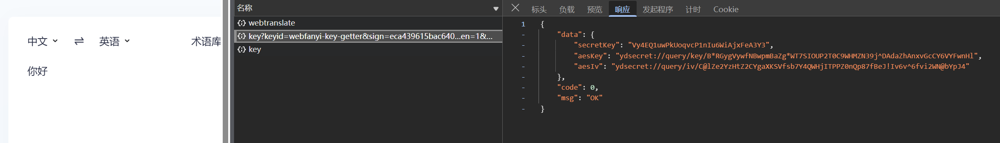

sign 和时间戳是变化的

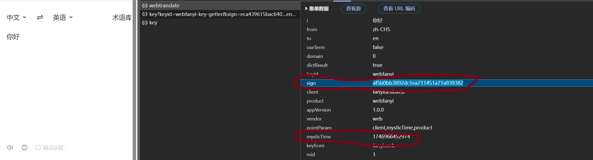


<h3 id="LTkUz">逆sign</h3>
<h4 id="QQ0to">1. 搜索 sign</h4>

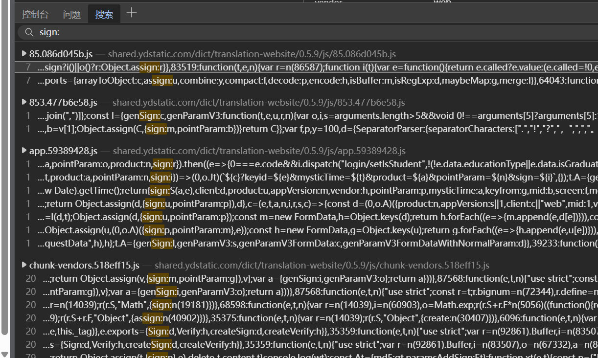


根据数据包中的 sign 周围的变量来定位 sign，若断点打不到本行就不是，接着往下找

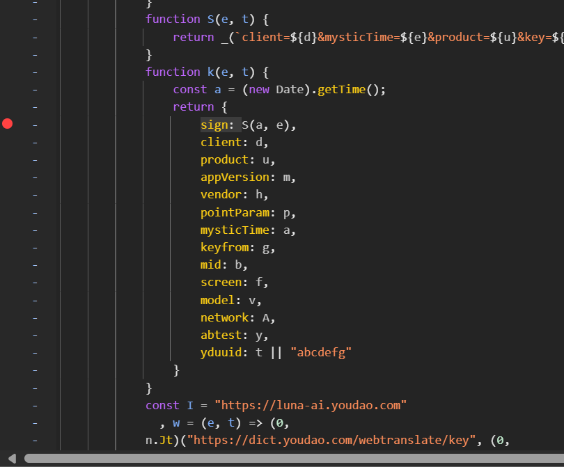

再次翻译，成功断到此处

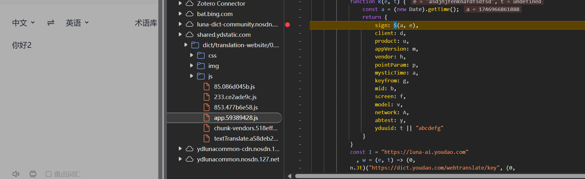


<h4 id="BxQQJ">2.sign(a,e)</h4>
a 为：a = (new Date).getTime();

e 不知道是什么

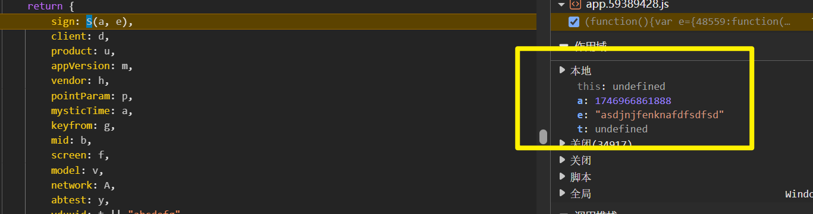

运行后 e 出了新结果

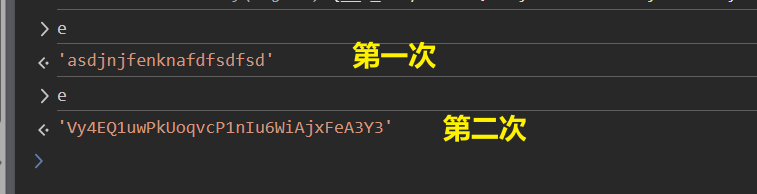

说明 sign(a,e)函数会运行两次

查看网络中的 sign

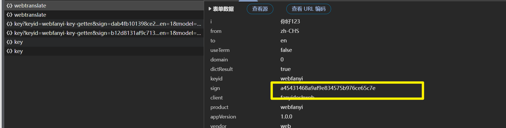

看最终使用的是第一次的 sign 还是第二次的。


S 函数

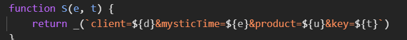

通过对 1 进行加密判断加密模式是不是 md5

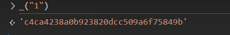

client、product、key 的值是固定的


<h4 id="JOGSR">sign 解密代码</h4>
```javascript
const CryptoJs = require('crypto-js');

function getsign(){
    const a = (new Date).getTime();

    test = `client=fanyideskweb&mysticTime=${a}&product=webfanyi&key=Vy4EQ1uwPkUoqvcP1nIu6WiAjxFeA3Y3`
    sign = CryptoJs.MD5(test).toString();
    return [a,sign]

}

console.log(getsign());

```


<h3 id="WPU0g">逆 webtranslate</h3>

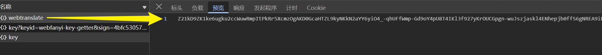


看到一大串数据无从下手，三种可能：


JSON.parse

decrypt

join

:::


定位：

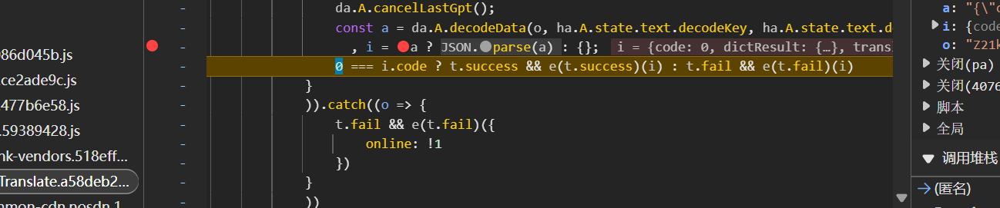


da.A.decodeData(o, ha.A.state.text.decodeKey, ha.A.state.text.decodeIv)的结果已经是 json 字符串了

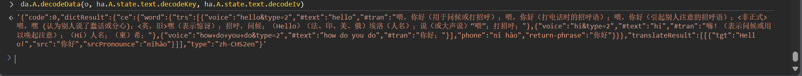


分析 json 解密的函数

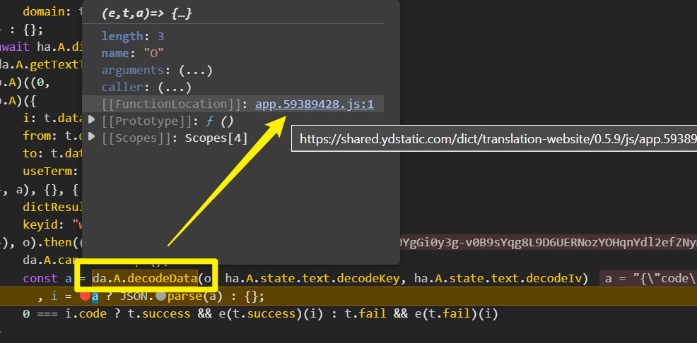


传入 e   t   a 三个参数

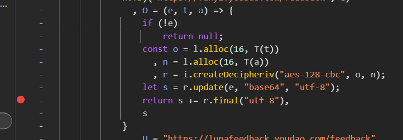

const o 和 n 为固定值

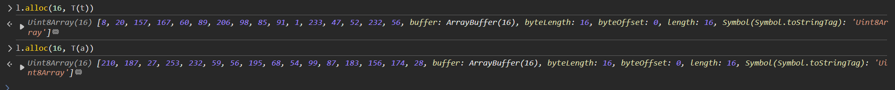


目前 js 状态：

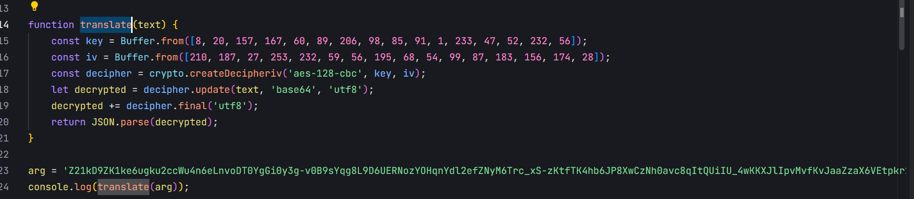

arg 为 O 函数传入的 e

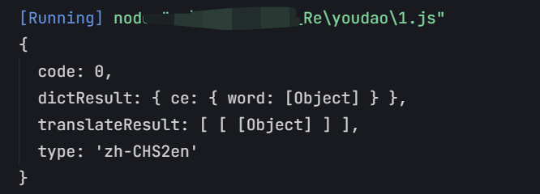


<h3 id="uBPVj">Py 脚本</h3>

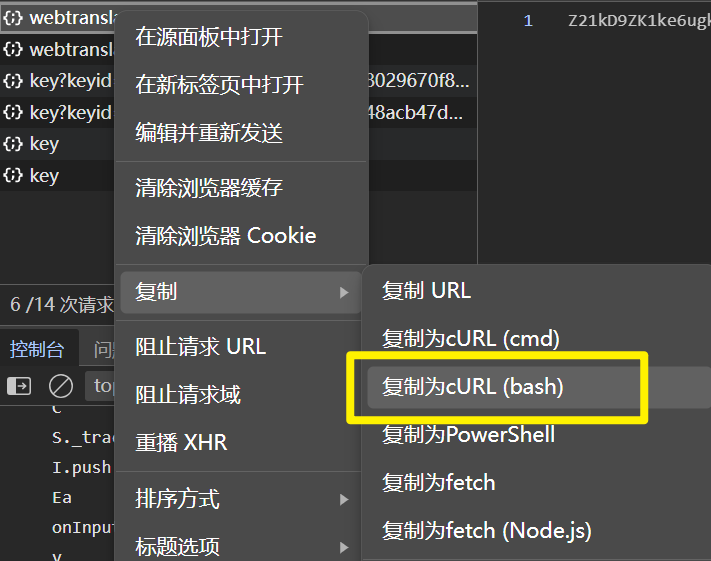


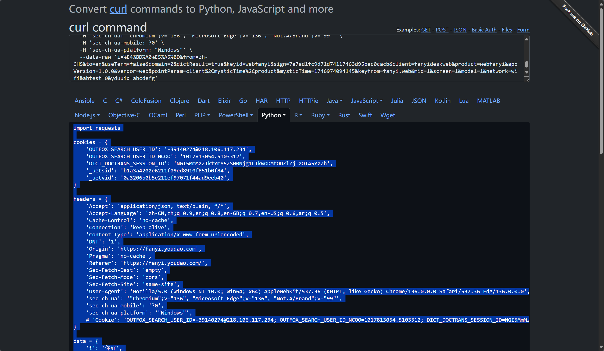


<h4 id="Lfn38">得到密文</h4>

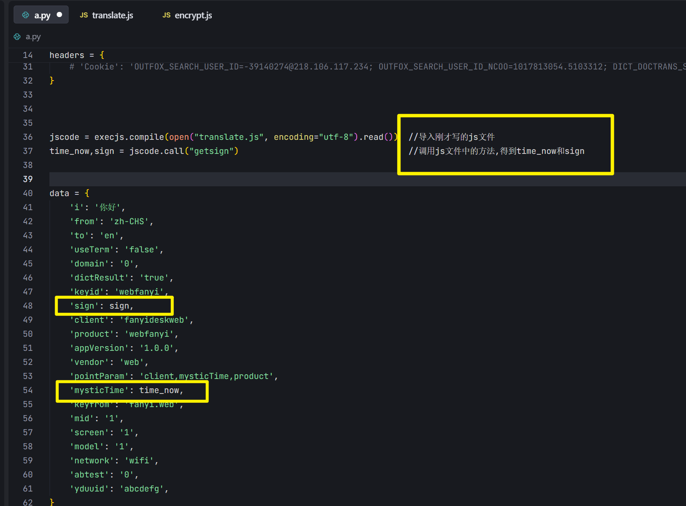

运行 py 脚本，得到值（这个值是服务器传给客户端的密文）

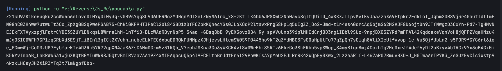

<h4 id="nUGim">解密</h4>


调用 js 的解密函数

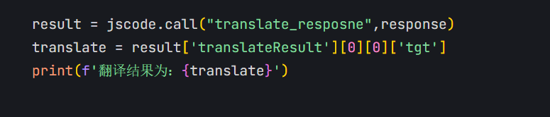

运行 py

终端就可以进行翻译了~


```javascript
const CryptoJs = require('crypto-js');
const crypto = require('crypto');

function getsign() {
    const a = (new Date).getTime();

    test = `client=fanyideskweb&mysticTime=${a}&product=webfanyi&key=Vy4EQ1uwPkUoqvcP1nIu6WiAjxFeA3Y3`
    sign = CryptoJs.MD5(test).toString();
    return [a, sign]

}
//console.log(getsign());

function translate_response(text) {
    // text 是 base64 字符串
    const key = Buffer.from([8, 20, 157, 167, 60, 89, 206, 98, 85, 91, 1, 233, 47, 52, 232, 56]);
    const iv = Buffer.from([210, 187, 27, 253, 232, 59, 56, 195, 68, 54, 99, 87, 183, 156, 174, 28]);
    const decipher = crypto.createDecipheriv('aes-128-cbc', key, iv);
    let decrypted = decipher.update(text, 'base64', 'utf8');
    decrypted += decipher.final('utf8');
    return JSON.parse(decrypted);
}

//arg = 'Z21kD9ZK1ke6ugku2ccWu4n6eLnvoDT0YgGi0y3g-v0B9sYqg8L9D6UERNozYOHqnYdl2efZNyM6Trc_xS-zKtfTK4hb6JP8XwCzNh0avc8qItQUiIU_4wKKXJlIpvMvfKvJaaZzaX6VEtpkr2FdkfoT_Jgbm2GRSVj3r40autIdlImENG8hC0ZH4ww7utwuTt3Oo_ZpXg0BSq9wePSAB75-ChkiGKF9HTIPeCl2bl84SBD1XDfFCZpkKQhecYSs0JLoXOqP2ltavxRrg58Hp1q5uIgZZ_Oo2-Jmd-t1r4es40drcAq5bjmS62M2VJF8D6ojtOh9JTfNwgzD3CxYn-Pd7-TgHMyNEJEkFXTAyxzpjlFqtrCYDE3SZUYlENkqsL8Wrra1hM-1nTfiB-BLcWAdRBynNpP5_54aq_-GBsq8bB_9yEX5ovzDB4_Ry_spVVuUnb39iplMHCdCnjOD3ngiIDbl9SUz-9npjBX05ZYRdPmFPAl424qdoaxeVqnVoH8jQFPZVqaHMzu4mJg0SICDWFH7GP1zqGRbXd3ESjT_iBInl3gICt2XVuhh_nubcELkTEC6xbqEDRQkPUNMpzXJHjcvsLHtcmSW0S9F0445ho9kT2qZYdMBC3Fs0OaHpUtFu77gZpQn7sGiqh8VliXIcUtfvvop-1c-Vu5QjfUbLn2-s5POR9fGYG6rt6ioe_PGmwWj-Cc00zUM7FybfarKTr4D3Rk57R72qpXN4Ja86ZsCAMmDG-m5z31RQh_V7echJ8Kna3Go3yWKCK4vtSwOWrFhiS5RTz6EkrGc3SkFKbb5vp8Wop_84myBtgnBmj4CczhTq2HcOxrJf4def6yDt2uBxyv4bTVGx9Yx3uB4Gx0iK5kYvfma6B_LnkRWk331wjuXKQtBGYIuWkR8J5QtvBmIRVaa7AA19Z4xMIEAqbcuQ5p4I9FCElthBrJdtEr4l29PhwKfsA7pYeU2EJLRrRK42WQpEy0Xwx_2Lz2e3Rlf-L467aRO7RmuvBXD-J_H0IwaArTP7K3_ZeSUzEvCicixstp94kzkLHCsyJHZXiR3YTq3t7lmNgpfDbb-'
//console.log(translate_response('Z21kD9ZK1ke6ugku2ccWu4n6eLnvoDT0YgGi0y3g-v0B9sYqg8L9D6UERNozYOHqnYdl2efZNyM6Trc_xS-zKtfTK4hb6JP8XwCzNh0avc8qItQUiIU_4wKKXJlIpvMvfKvJaaZzaX6VEtpkr2FdkfoT_Jgbm2GRSVj3r40autIdlImENG8hC0ZH4ww7utwuTt3Oo_ZpXg0BSq9wePSAB75-ChkiGKF9HTIPeCl2bl84SBD1XDfFCZpkKQhecYSs0JLoXOqP2ltavxRrg58Hp1q5uIgZZ_Oo2-Jmd-t1r4es40drcAq5bjmS62M2VJF8D6ojtOh9JTfNwgzD3CxYn-Pd7-TgHMyNEJEkFXTAyxzpjlFqtrCYDE3SZUYlENkqsL8Wrra1hM-1nTfiB-BLcWAdRBynNpP5_54aq_-GBsq8bB_9yEX5ovzDB4_Ry_spVVuUnb39iplMHCdCnjOD3ngiIDbl9SUz-9npjBX05ZYRdPmFPAl424qdoaxeVqnVoH8jQFPZVqaHMzu4mJg0SICDWFH7GP1zqGRbXd3ESjT_iBInl3gICt2XVuhh_nubcELkTEC6xbqEDRQkPUNMpzXJHjcvsLHtcmSW0S9F0445ho9kT2qZYdMBC3Fs0OaHpUtFu77gZpQn7sGiqh8VliXIcUtfvvop-1c-Vu5QjfUbLn2-s5POR9fGYG6rt6ioe_PGmwWj-Cc00zUM7FybfarKTr4D3Rk57R72qpXN4Ja86ZsCAMmDG-m5z31RQh_V7echJ8Kna3Go3yWKCK4vtSwOWrFhiS5RTz6EkrGc3SkFKbb5vp8Wop_84myBtgnBmj4CczhTq2HcOxrJf4def6yDt2uBxyv4bTVGx9Yx3uB4Gx0iK5kYvfma6B_LnkRWk331wjuXKQtBGYIuWkR8J5QtvBmIRVaa7AA19Z4xMIEAqbcuQ5p4I9FCElthBrJdtEr4l29PhwKfsA7pYeU2EJLRrRK42WQpEy0Xwx_2Lz2e3Rlf-L467aRO7RmuvBXD-J_H0IwaArTP7K3_ZeSUzEvCicixstp94kzkLHCsyJHZXiR3YTq3t7lmNgpfDbb-'));

```


```python
import requests
import execjs
import os
import sys


cookies = {
    'OUTFOX_SEARCH_USER_ID': '-39140274@218.106.117.234',
    'OUTFOX_SEARCH_USER_ID_NCOO': '1017813054.5103312',
    'DICT_DOCTRANS_SESSION_ID': 'NGI5MmMzZTktYmY5ZS00Njg1LTkwODMtODZlZjI2OTA5YzZh',
    '_uetsid': 'b1a3a4202e6211f09ed8910f851b0f84',
    '_uetvid': '0a3206b0b5e211ef97071f44ad9eeb40',
}

headers = {
    'Accept': 'application/json, text/plain, */*',
    'Accept-Language': 'zh-CN,zh;q=0.9,en;q=0.8,en-GB;q=0.7,en-US;q=0.6,ar;q=0.5',
    'Cache-Control': 'no-cache',
    'Connection': 'keep-alive',
    'Content-Type': 'application/x-www-form-urlencoded',
    'DNT': '1',
    'Origin': 'https://fanyi.youdao.com',
    'Pragma': 'no-cache',
    'Referer': 'https://fanyi.youdao.com/',
    'Sec-Fetch-Dest': 'empty',
    'Sec-Fetch-Mode': 'cors',
    'Sec-Fetch-Site': 'same-site',
    'User-Agent': 'Mozilla/5.0 (Windows NT 10.0; Win64; x64) AppleWebKit/537.36 (KHTML, like Gecko) Chrome/136.0.0.0 Safari/537.36 Edg/136.0.0.0',
    'sec-ch-ua': '"Chromium";v="136", "Microsoft Edge";v="136", "Not.A/Brand";v="99"',
    'sec-ch-ua-mobile': '?0',
    'sec-ch-ua-platform': '"Windows"',
    # 'Cookie': 'OUTFOX_SEARCH_USER_ID=-39140274@218.106.117.234; OUTFOX_SEARCH_USER_ID_NCOO=1017813054.5103312; DICT_DOCTRANS_SESSION_ID=NGI5MmMzZTktYmY5ZS00Njg1LTkwODMtODZlZjI2OTA5YzZh; _uetsid=b1a3a4202e6211f09ed8910f851b0f84; _uetvid=0a3206b0b5e211ef97071f44ad9eeb40',
}


def youdao(txt):
    jscode = execjs.compile(open("translate.js", encoding="utf-8").read())  #导入刚才写的js文件
    time_now,sign = jscode.call("getsign")                                  #调用js文件中的方法,得到time_now和sign
    data = {
        'i': txt,
        'from': 'zh-CHS',
        'to': 'en',
        'useTerm': 'false',
        'domain': '0',
        'dictResult': 'true',
        'keyid': 'webfanyi',
        'sign': sign,
        'client': 'fanyideskweb',
        'product': 'webfanyi',
        'appVersion': '1.0.0',
        'vendor': 'web',
        'pointParam': 'client,mysticTime,product',
        'mysticTime': time_now,
        'keyfrom': 'fanyi.web',
        'mid': '1',
        'screen': '1',
        'model': '1',
        'network': 'wifi',
        'abtest': '0',
        'yduuid': 'abcdefg',
    }
    response = requests.post('https://dict.youdao.com/webtranslate', 
                             cookies=cookies, 
                             headers=headers, 
                             data=data.encode('utf-8')).text
    #print(response)

    result = jscode.call('translate_response',response)
    #print(result)
    translate = result['translateResult'][0][0]['tgt']
    print(f'翻译结果为：{translate}')


if __name__ == '__main__':
    txt = input('请输入要翻译的内容：')
    youdao(txt)


```


