### 数据带宽
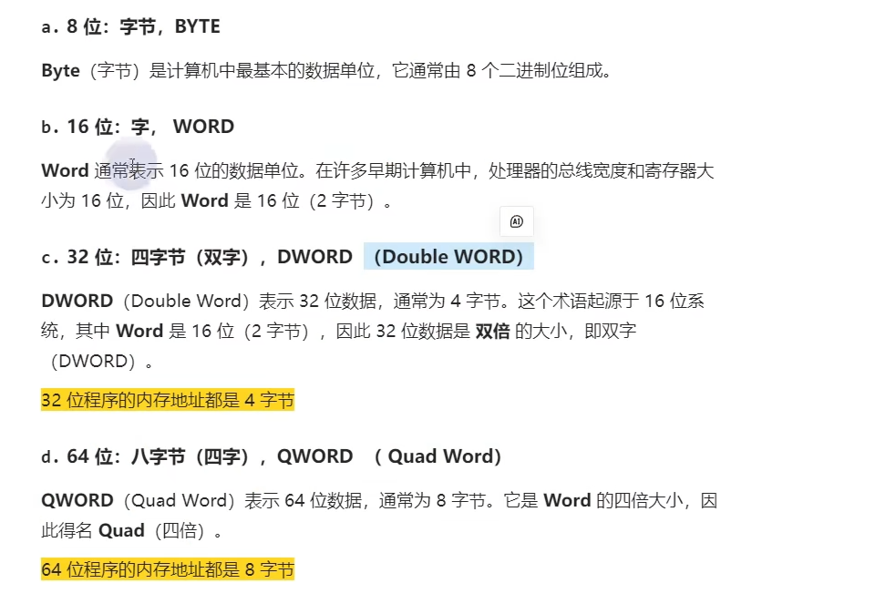

DWORD是单浮点

QWORD是双浮点


### 寄存器
#### 汇总


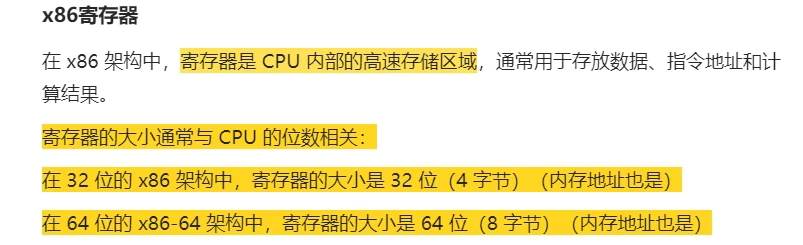

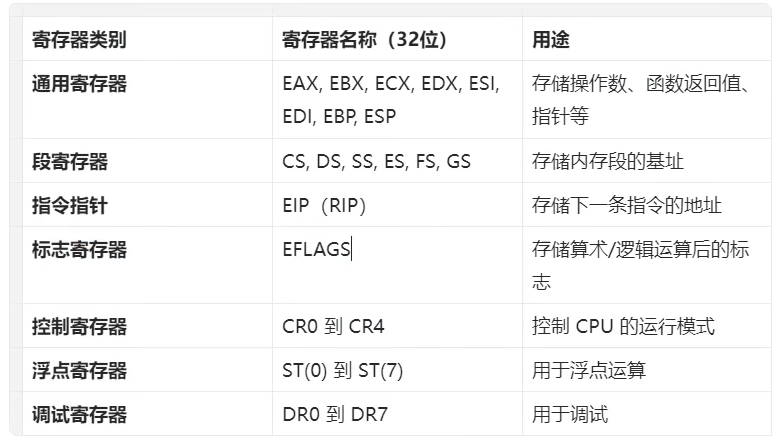

#### 详细
##### 32位
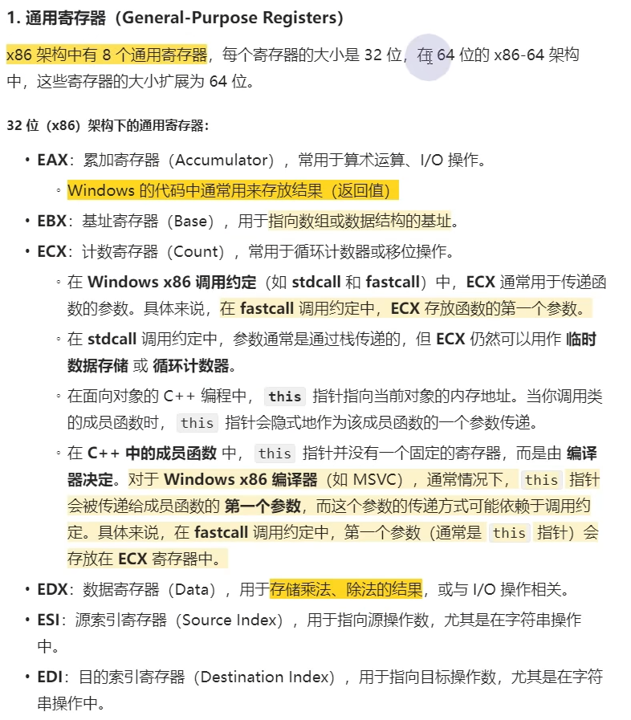

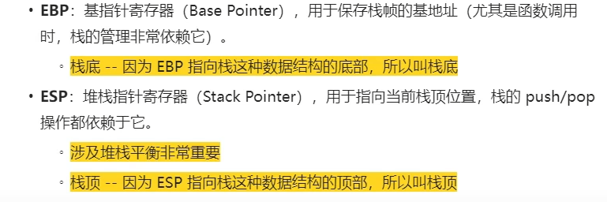


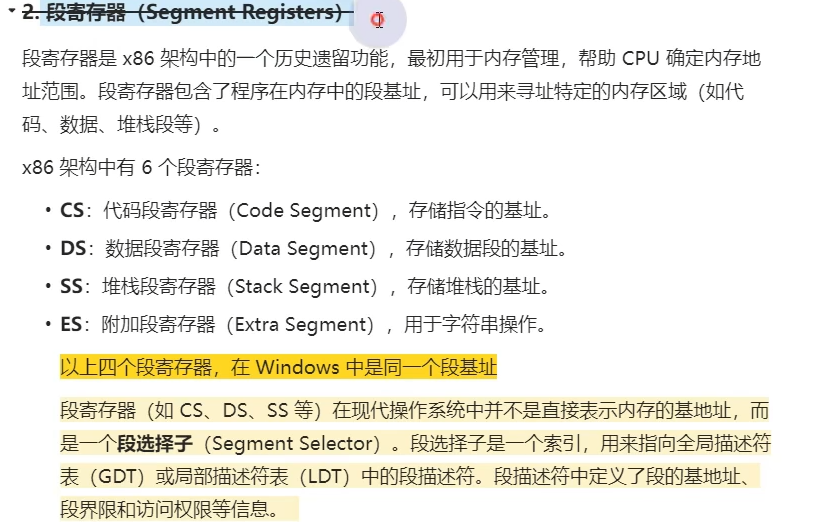

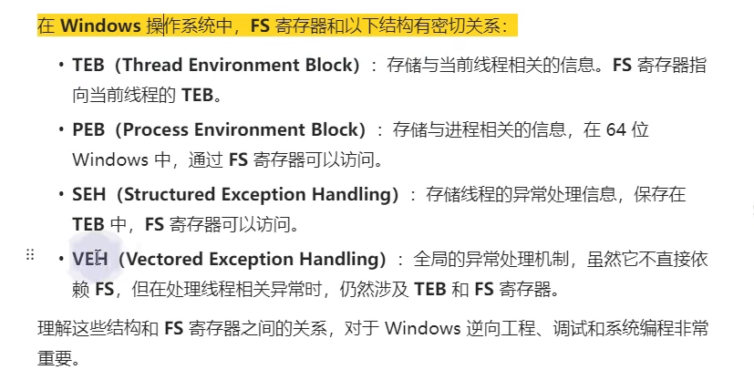 

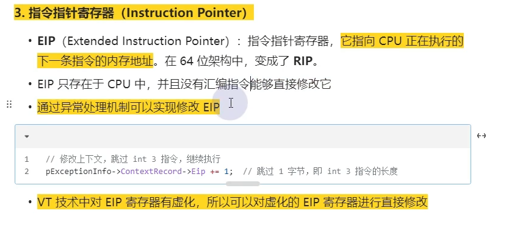

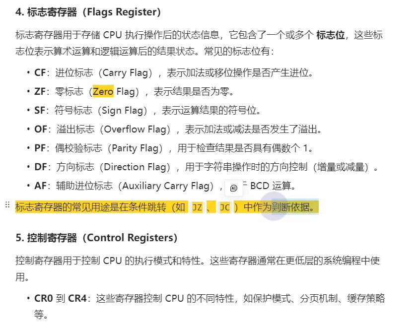

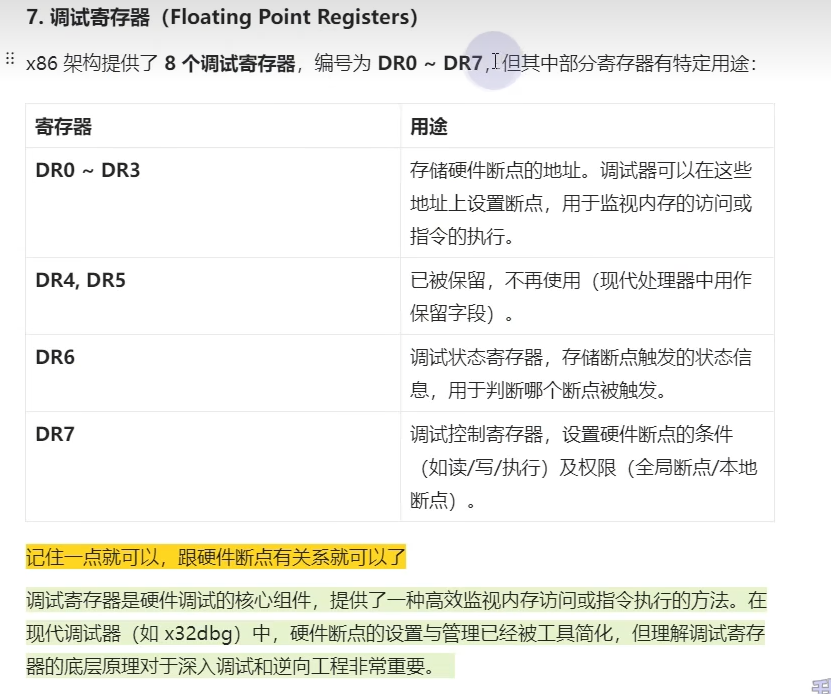


##### 64位
64位通用寄存器

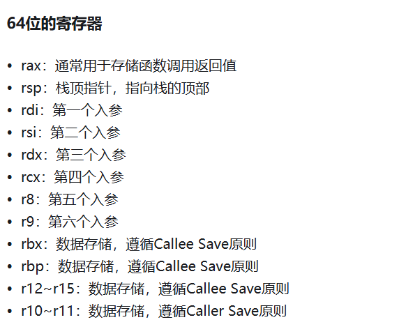

64位指令指针寄存器  RIP

64位标志寄存器    RFLAGS


### 汇编指令基本结构
#### 指令
每个指令包括：操作码（MOV、ADD、SUB）和操作数（操作对象）

####  操作数
操作数有以下几种类型：

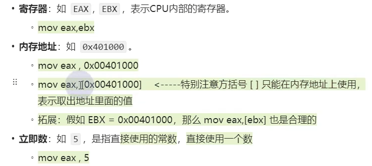

#### 操作符
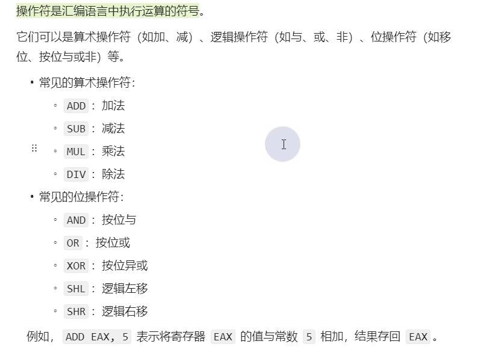

### 栈结构
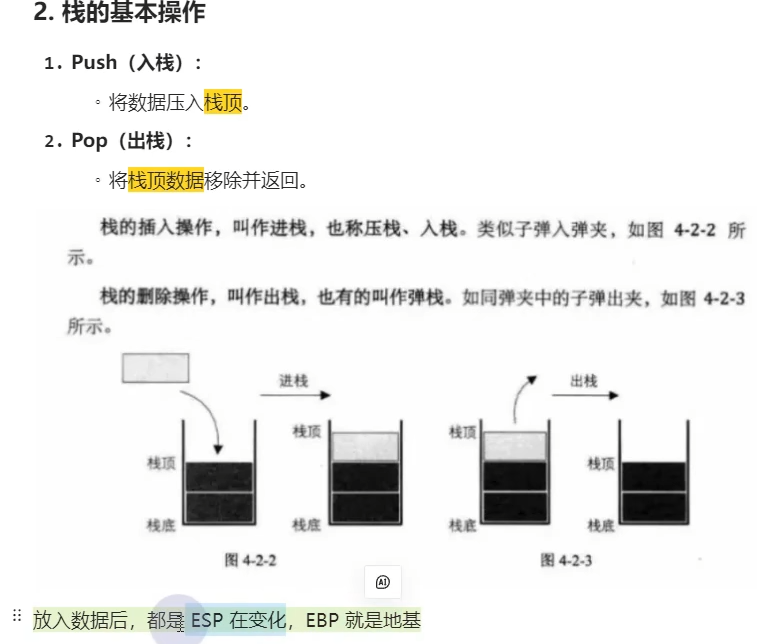 


### 数据传输指令
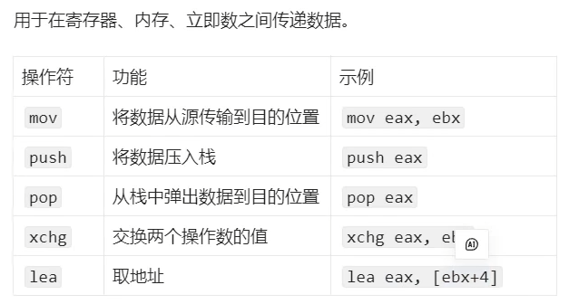

F8：单步执行

ctrl+G：跳转到某个地址

  

若遇到编码问题

中文--》GBK格式


### FS寄存器、TEB、PEB
[https://crackmes.cn/doc/107/](https://crackmes.cn/doc/107/)

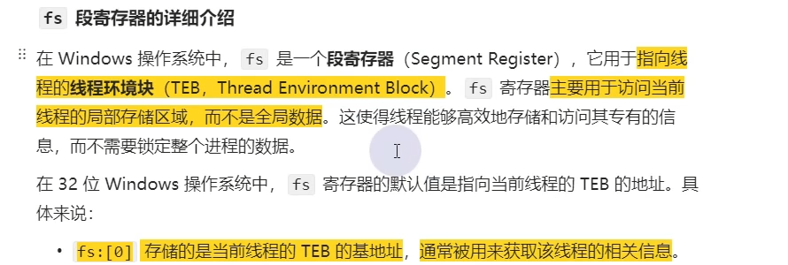

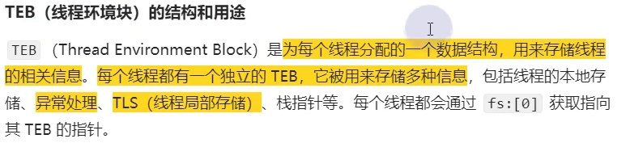


```python

ntdll!_TEB
   +0x000 NtTib            : _NT_TIB  //TIB结构
   	[+0x000] ExceptionList    : 0x1df360 [Type: _EXCEPTION_REGISTRATION_RECORD *]//指向SEH链
    [+0x004] StackBase        : 0x1e0000 [Type: void *]//堆栈基址
    [+0x008] StackLimit       : 0x1dd000 [Type: void *]//堆栈大小
    [+0x00c] SubSystemTib     : 0x0 [Type: void *]//
    [+0x010] FiberData        : 0x1e00 [Type: void *]
    [+0x010] Version          : 0x1e00 [Type: unsigned long]
    [+0x014] ArbitraryUserPointer : 0x0 [Type: void *]
    [+0x018] Self             : 0x7ffde000 [Type: _NT_TIB *]//指向自身的指针,也就是说Self同时是指向TEB和TIB头部的指针(因为TIB为TEB结构的第一个成员)
   +0x01c EnvironmentPointer : Ptr32 Void//环境指针
   +0x020 ClientId         : _CLIENT_ID//CLIENT_ID结构,存储PID和当前线程ID
   +0x028 ActiveRpcHandle  : Ptr32 Void//活动的RPC句柄
   +0x02c ThreadLocalStoragePointer : Ptr32 Void//指向线程局部存储数组
   +0x030 ProcessEnvironmentBlock : Ptr32 _PEB//指向PEB结构
   +0x034 LastErrorValue   : Uint4B//保存着LastError的值
   +0x038 CountOfOwnedCriticalSections : Uint4B//所拥有的临界区数量
   +0x03c CsrClientThread  : Ptr32 Void//指向CSR客户线程
   +0x040 Win32ThreadInfo  : Ptr32 Void//指向Win32线程信息
   +0x044 User32Reserved   : [26] Uint4B
   +0x0ac UserReserved     : [5] Uint4B
   +0x0c0 WOW32Reserved    : Ptr32 Void
   +0x0c4 CurrentLocale    : Uint4B//当前的Locale
   +0x0c8 FpSoftwareStatusRegister : Uint4B//FP软件状态寄存器
   +0x0cc SystemReserved1  : [54] Ptr32 Void
   +0x1a4 ExceptionCode    : Int4B//异常码
   +0x1a8 ActivationContextStackPointer : Ptr32 _ACTIVATION_CONTEXT_STACK//指向活动上下文栈的指针
   +0x1ac SpareBytes       : [36] UChar//空闲字节
   +0x1d0 TxFsContext      : Uint4B
   +0x1d4 GdiTebBatch      : _GDI_TEB_BATCH
   +0x6b4 RealClientId     : _CLIENT_ID
   +0x6bc GdiCachedProcessHandle : Ptr32 Void
   +0x6c0 GdiClientPID     : Uint4B//真实的进程PID
   +0x6c4 GdiClientTID     : Uint4B//真实的线程TID
.......
//其他便宜
```


TEB偏移0x30的地方指向PEB

```python
 
0:000> dt nt!_peb 7ffdd000
ntdll!_PEB
   +0x000 InheritedAddressSpace : 0 ''
   +0x001 ReadImageFileExecOptions : 0 ''
   +0x002 BeingDebugged    : 0x1 ''    //判断进程是否被调试，true为被调试
   +0x003 SpareBool        : 0 ''
   +0x004 Mutant           : 0xffffffff Void
   +0x008 ImageBaseAddress : 0x00400000 Void   //进程映像基址，就是PE中的IMAGE_OPTIONAL_HEADER->ImageBase对应的值。对于EXE来说，默认的ImageBase为0x400000；对于DLL来说，它是0x10000000，当打开ASLR时应该会变，**待验证**
 
----------
 
   +0x00c Ldr              : 0x00251ea0 _PEB_LDR_DATA
 
    LoaderData域是PEB中一个很重要的成员域，它是一个指向PEB_LDR_DATA结构体的指针。它由PE Loader(加载器)填充，也就说，在这个指针指向的结构中，可以找到很多在PE中包含的信息。另外，我们在做Buffer OverFlow的时候经常会遇到这个数据结构，枚举用户进程加载的模块就和它密切相关。我们扩展出去，详细学习一下这个结构。
 
   0:000> dt _PEB_LDR_DATA 0x00251ea0
ntdll!_PEB_LDR_DATA
   +0x000 Length           : 0x28       //结构长度
   +0x004 Initialized      : 0x1 ''     //进程是否初始化完成
   +0x008 SsHandle         : (null) 
   +0x00c InLoadOrderModuleList : _LIST_ENTRY [ 0x251ee0 - 0x252848 ]
   +0x014 InMemoryOrderModuleList : _LIST_ENTRY [ 0x251ee8 - 0x252850 ]
   +0x01c InInitializationOrderModuleList : _LIST_ENTRY [ 0x251f58 - 0x252798 ]
    //nLoadOrderModuleList、InMemoryOrderModuleList、InInitializationOrderModuleList这三个域都是指向它们各自的双链表中的下一个LDR_MODULE的LIST_ENTRY
   +0x024 EntryInProgress  : (null) 

   +0x000 MaximumLength    : 0x1000    //
   +0x004 Length           : 0x7e4    //结构大小
   +0x008 Flags            : 0x2001    //是否由RtlNormalizeProcessParams标准化
   +0x00c DebugFlags       : 0
   +0x010 ConsoleHandle    : (null)     //该进程的窗口句柄，如果有的话
   +0x014 ConsoleFlags     : 0
   +0x018 StandardInput    : (null) 
   +0x01c StandardOutput   : 0x00010001 Void
   +0x020 StandardError    : (null) 
   +0x024 CurrentDirectory : _CURDIR
   +0x030 DllPath          : _UNICODE_STRING "C:\Documents and Settings\Administrator\桌面;C:\WINDOWS\system32;C:\WINDOWS\system;C:\WINDOWS;.;C:\Program Files\Debugging Tools for Windows (x86)\winext\arcade;C:\WINDOWS\system32;C:\WINDOWS;C:\WINDOWS\System32\Wbem"
   +0x038 ImagePathName    : _UNICODE_STRING "C:\Documents and Settings\Administrator\桌面\csnbes_1.0.0.8.exe"
   +0x040 CommandLine      : _UNICODE_STRING ""C:\Documents and Settings\Administrator\桌面\csnbes_1.0.0.8.exe""
   +0x048 Environment      : 0x00010000 Void
   +0x04c StartingX        : 0
   +0x050 StartingY        : 0
   +0x054 CountX           : 0
   +0x058 CountY           : 0
   +0x05c CountCharsX      : 0
   +0x060 CountCharsY      : 0
   +0x064 FillAttribute    : 0
   +0x068 NtGlobalFlag;    : NtGlobalFlag
   +0x06c ShowWindowFlags  : 0
   +0x070 WindowTitle      : _UNICODE_STRING "C:\Documents and Settings\Administrator\桌面\csnbes_1.0.0.8.exe"
   +0x078 DesktopInfo      : _UNICODE_STRING "WinSta0\Default"
   +0x080 ShellInfo        : _UNICODE_STRING ""
   +0x088 RuntimeData      : _UNICODE_STRING ""
   +0x090 CurrentDirectores : [32] _RTL_DRIVE_LETTER_CURDIR
 
```


PEB是为了防止他人调试我发布的软件，主要使用到的地址是0x002和0x068

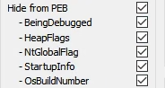


为了避免被检测到，尽量用附加进程而不是直接拖入调试 


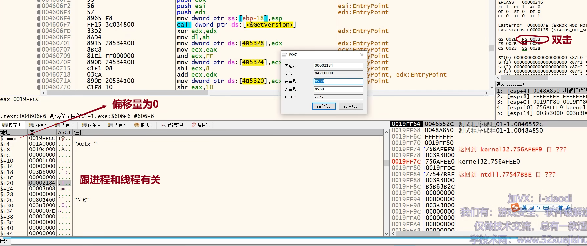

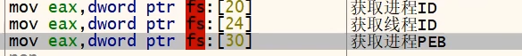


###  算数运算指令
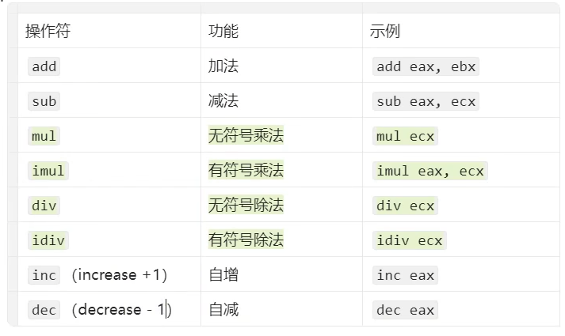

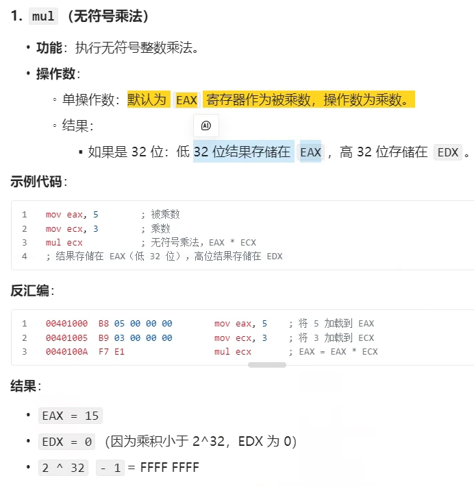

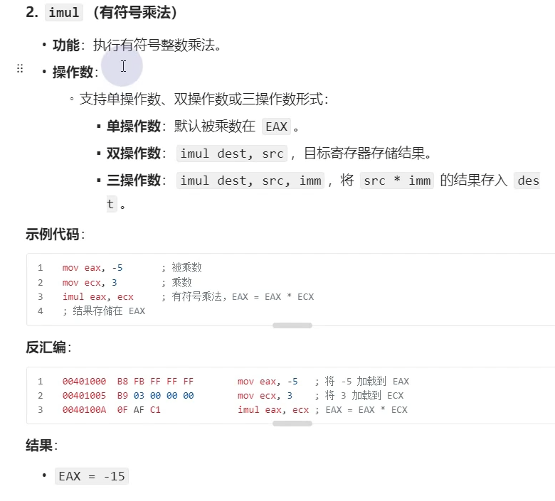

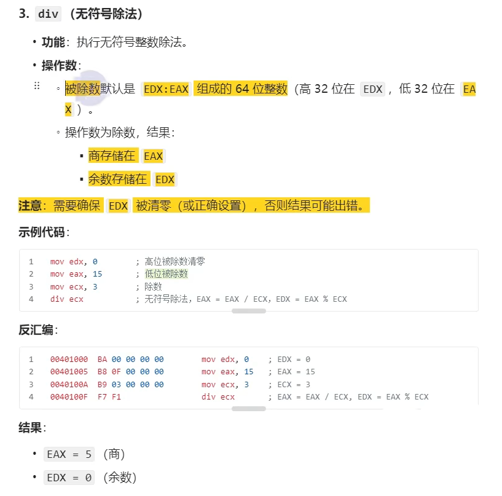

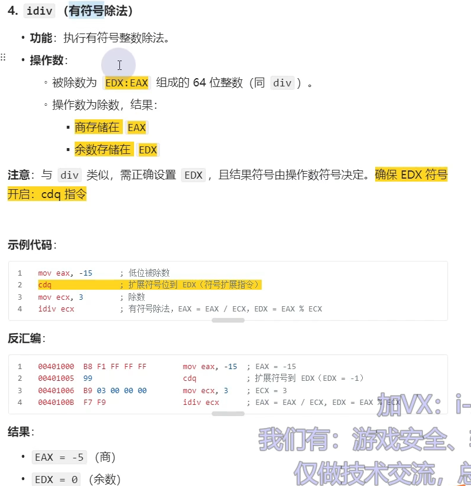                                        


### 位操作指令
#### <font style="color:rgb(77, 77, 77);">逻辑运算指令：</font>
+ `<font style="color:rgb(199, 37, 78);background-color:rgb(249, 242, 244);">AND</font>`<font style="color:rgba(0, 0, 0, 0.75);"> </font>`<font style="color:rgb(199, 37, 78);background-color:rgb(249, 242, 244);">OR</font>`<font style="color:rgba(0, 0, 0, 0.75);"> </font>`<font style="color:rgb(199, 37, 78);background-color:rgb(249, 242, 244);">XOR</font>`<font style="color:rgba(0, 0, 0, 0.75);"> </font>`<font style="color:rgb(199, 37, 78);background-color:rgb(249, 242, 244);">NOT</font>`<font style="color:rgba(0, 0, 0, 0.75);"> </font>`<font style="color:rgb(199, 37, 78);background-color:rgb(249, 242, 244);">TEST</font>`

#### <font style="color:rgb(77, 77, 77);">移位指令：</font>
+ <font style="color:rgba(0, 0, 0, 0.75);">逻辑、算术移位指令：  
</font>`<font style="color:rgb(199, 37, 78);background-color:rgb(249, 242, 244);">SHL</font>`<font style="color:rgba(0, 0, 0, 0.75);"> </font>`<font style="color:rgb(199, 37, 78);background-color:rgb(249, 242, 244);">SHR</font>`<font style="color:rgba(0, 0, 0, 0.75);"> </font>`<font style="color:rgb(199, 37, 78);background-color:rgb(249, 242, 244);">SAL</font>`<font style="color:rgba(0, 0, 0, 0.75);"> </font>`<font style="color:rgb(199, 37, 78);background-color:rgb(249, 242, 244);">SAR</font>`
+ <font style="color:rgba(0, 0, 0, 0.75);">循环、带进位循环移位指令：  
</font>`<font style="color:rgb(199, 37, 78);background-color:rgb(249, 242, 244);">ROL</font>`<font style="color:rgba(0, 0, 0, 0.75);"> </font>`<font style="color:rgb(199, 37, 78);background-color:rgb(249, 242, 244);">ROR</font>`<font style="color:rgba(0, 0, 0, 0.75);"> </font>`<font style="color:rgb(199, 37, 78);background-color:rgb(249, 242, 244);">RCL</font>`<font style="color:rgba(0, 0, 0, 0.75);"> </font>`<font style="color:rgb(199, 37, 78);background-color:rgb(249, 242, 244);">RCR</font>`


`XOR` 异或指令：有且仅有一个为真，结果才为真

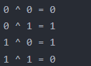

`NOT`：取反

`SHL`：逻辑左移指令，整体向左移动一位，最低位用 0 填充，最高位移入进位标志位(CF)，该标志位原来的值被丢弃（举例：0110 0011--》1100 0110）

`<font style="color:rgb(77, 77, 77);">SHR</font>`<font style="color:rgb(77, 77, 77);">：逻辑右移指令。将寄存器或内存单元的数据右移，最高位用 0 补充，最低位进入 CF</font>

`<font style="color:rgb(77, 77, 77);">ROL</font>`<font style="color:rgb(77, 77, 77);">：循环左移指令，（举例：1110 0011--》1100 0111）</font>

`<font style="color:rgb(77, 77, 77);">ROR</font>`<font style="color:rgb(77, 77, 77);">：循环右移指令</font>

`<font style="color:rgb(77, 77, 77);">sal</font>`<font style="color:rgb(77, 77, 77);">：算数左移。功能与shl相同</font>

`<font style="color:rgb(77, 77, 77);">sar</font>`<font style="color:rgb(77, 77, 77);">：算数右移。</font><font style="color:rgb(34, 34, 34);">每位右移, 低位进 CF, 高位不变</font>

`<font style="color:rgb(34, 34, 34);">RCL</font>`<font style="color:rgb(34, 34, 34);">: 循环左移, 进位值(原CF)到低位, 高位进 CF</font>

`<font style="color:rgb(34, 34, 34);">RCR</font>`<font style="color:rgb(34, 34, 34);">: 循环右移, 进位值(原CF)到高位, 低位进 CF</font>


###  逻辑比较指令
#### cmp指令
cmp："比较"，cmp会对两个操作数进行减法运算，通过计算两个操作数的差值来影响标志位。cmp不会存储减法的结果，而是仅更新标志寄存器（如<font style="background-color:#D8DAD9;">零标志ZF、进位标志CF、符号标志SF、溢出标志OF、偶校验标志PF、辅助进位标志AF</font>），通常的比较操作数之间的关系有（大于、小于、等于）

cmp最常见的应用是与条件跳转指令（JE、JNE、JG、JL等）配合使用，以决定程序的执行流。

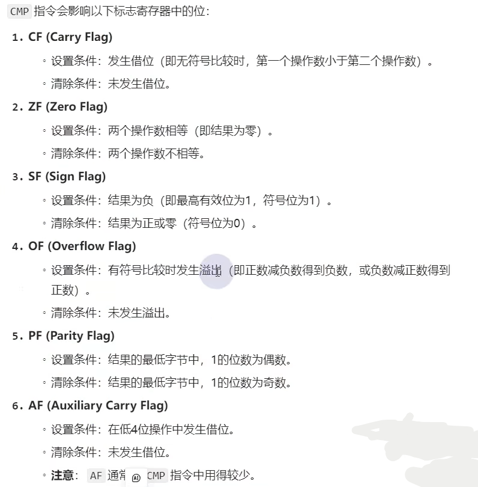 

关注点：

+ 看谁和谁作比较
+ 比较结果会影响标志寄存器（ZF）
+ 标志寄存器（ZF）会影响je跳转的方向


#### test指令
test：执行“按位与”运算，不存结果，仅设置标志位TEST AX,BX与AND AX,BX命令有相同效果，只是Test指令不改变AX和BX的内容，而AND指令会把结果保存到AX中。

常见用途：

+ 检查特定的标志位：如需检查某个标志位是否为1，可以用test实现
+ 检查寄存器中某些特定位是否被置1，例如test eax，0x01可以检查eax的最低为是否为1 

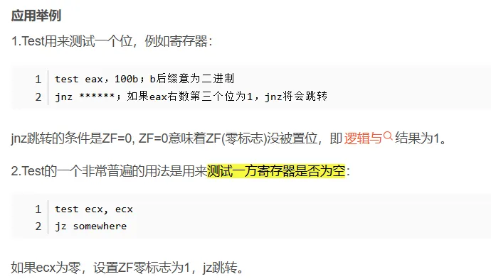


 

### 控制转移指令
作用：改变程序的执行流程

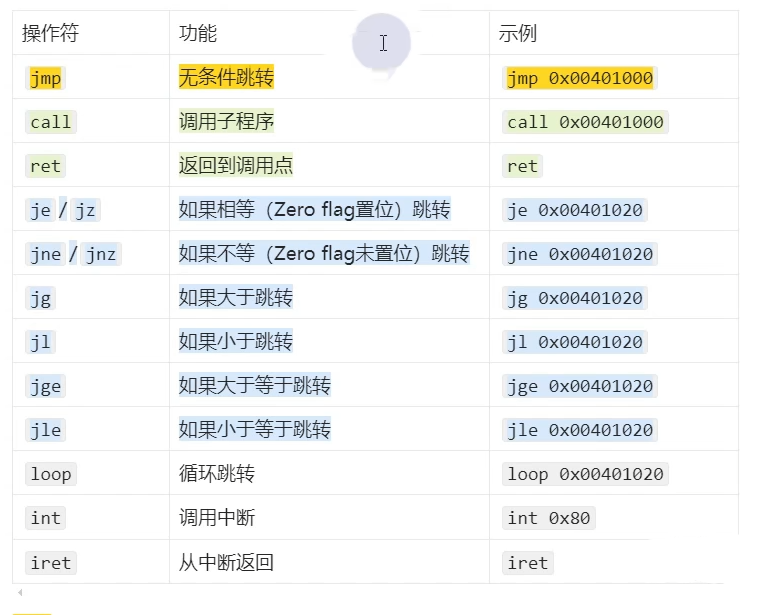

ja		如果大于则跳转			      ja label

jb    		如果小于则跳转			      jb label


`je/jz`        <font style="color:rgb(77, 77, 77);">Jump if Equal/</font>Jump if Zero

`jne/jnz`    Jump if Not Equal/Jump if Not Zero


`call` 

本质：1.push返回地址（call执行完的下一行代码地址）；2.进入到call内部执行（相当于jmp到子函数的位置）；3.执行完子程序，ret到1的返回地址

F7可以步入到call子程序里面


### 栈操作指令
 作用：用于栈管理

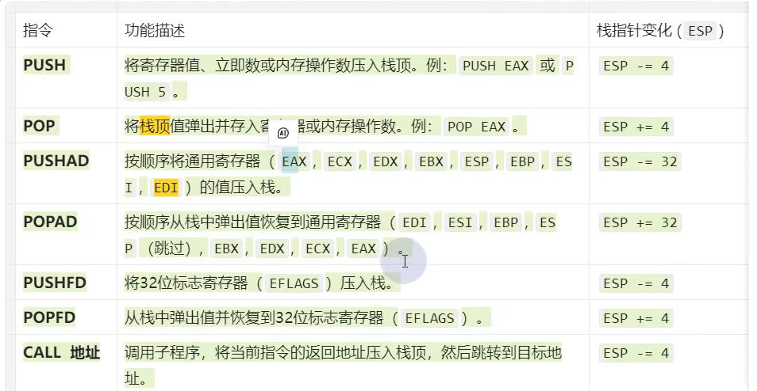

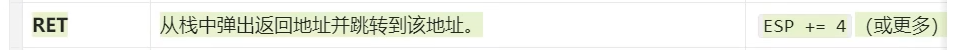


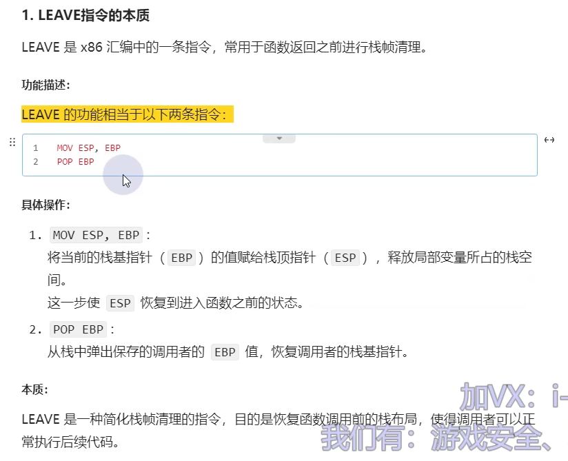


### 字符串操作指令
`mov指令`：字符串赋值

`rep movsb指令`：批量复制字符串数据

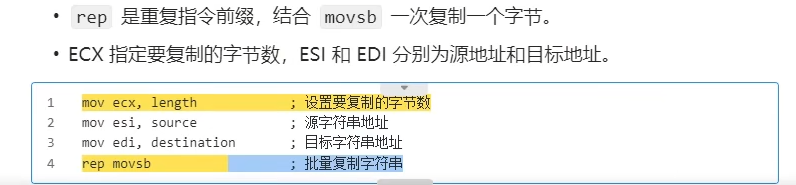

`cmp指令`：检测字符串是否匹配；用于实现strcmp、strncmp等

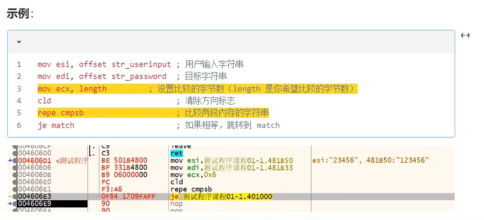

`scas指令`： 

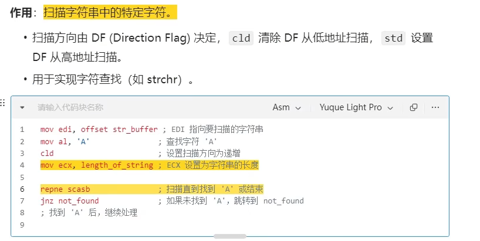

 `stos指令`：

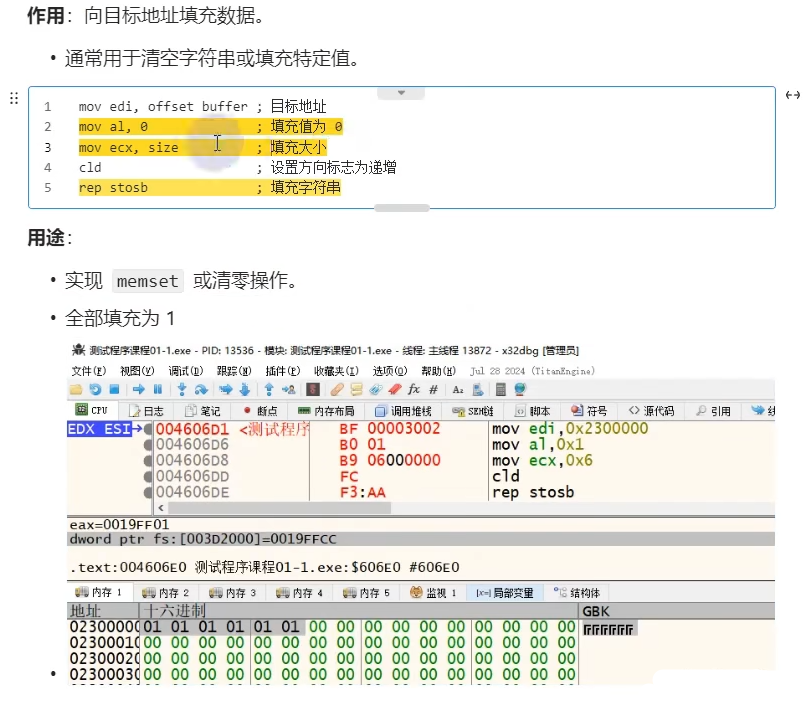

`loads指令`：

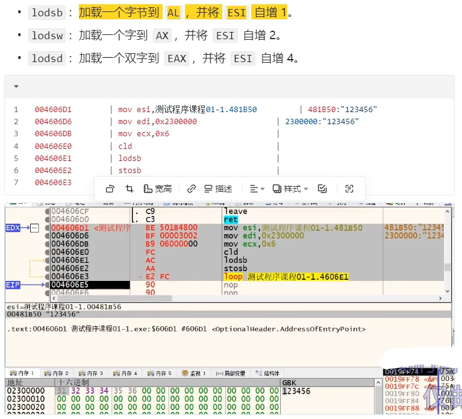 

`堆栈中的字符串操作`：

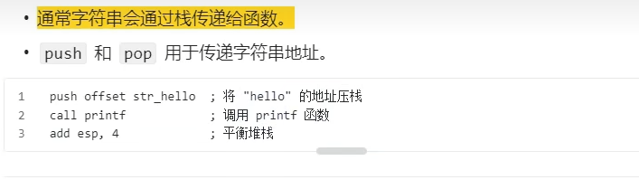


### 浮点运算指令 
#### FPU（Floating Point Unit，浮点运算单元）
+ 定义：FPU是处理器中的一个硬件模块，专门负责浮点运算。
+ 功能：处理浮点数的加减乘除、平方根、三角函数等复杂操作。
+ 实现：

在早期X86处理器中，FPU是一个独立的协处理器（如Intel 8087）

从80486开始，FPU集成进了cpu模块

FPU的组成：

1. 寄存器堆栈：
    1. <font style="background-color:#F3BB2F;">8个80位宽的浮点寄存器（ST0-ST7），以堆栈形式组织。</font>
    2. 通过push和pop模式操作寄存器
2. 状态寄存器：用于保存堆栈状态（如堆栈深度）和计算标志（如c0-c3）
3. 控制寄存器：配置FPU的工作模式（如精度、舍入模式等）


#### X87指令集
+ 定义：X87是专门为FPU设计的一套指令集，早期专用于处理浮点运算
+ 特点：
    - <font style="background-color:#F3BB2F;">操作对象是FPU的堆栈寄存器（ST0-ST7）</font>
    - <font style="background-color:#F3BB2F;">指令风格通常是Fxxx开头</font>，比如FLD（加载浮点数）、FADD（浮点数加法）
    - 支持扩展精度（80位），比SSE的单精度和双精度浮点数更高
+ <font style="background-color:#F3BB2F;">代表指令：</font>
    - FLD/FST：加载/存储浮点数
    - FADD/FSUB：浮点数加法/减法
    - FMUL/FDIV：浮点数乘法/除法
    - FCOM/FUCOM：比较浮点数
+ X87适用场景
    - 高精度计算（科学计算）
    - 需要80位扩展精度支持的场景 


#### SSE（Streaming SIMD Extensions）
+ 定义：SSE是intel在x86处理器上引入的一套SIMD（单指令多数据）扩展指令集
+ 特点：
    - <font style="background-color:#F3BB2F;">采用xmm寄存器（每个128位宽）</font>
    - 支持并行处理多个<font style="background-color:#F3BB2F;">单</font>精度（32位）或<font style="background-color:#F3BB2F;">双</font>精度（64位）浮点数
    - <font style="background-color:#F3BB2F;">指令风格是xxxPS（处理单精度矢量）或xxxSD(处理双精度矢量）</font>
+ 优势：
    - 更快的浮点计算（无需堆栈操作）
    - 并行处理多个浮点数（提高性能）
+ SSE使用场景：
    - 并行计算（如多媒体、游戏、音视频处理）
    - 性能要求较高但不需要扩展精度的场景

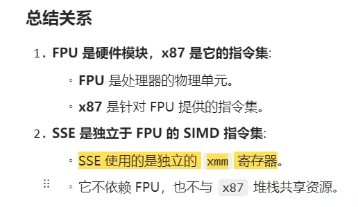


### 函数
#### 函数的地位
函数是代码逻辑的最小单元，他的功能是封装可复用的代码

#### 函数必备
参数、返回值

#### 函数的汇编代码的样子
**外层看：一个地址标识的入口**

call xxx相当于入口，其中xxx是要<font style="background-color:#F3BB2F;">跳转过去</font>执行的<font style="background-color:#F3BB2F;">代码地址</font>

系统函数基本上都是有名字的，工具可能会标注

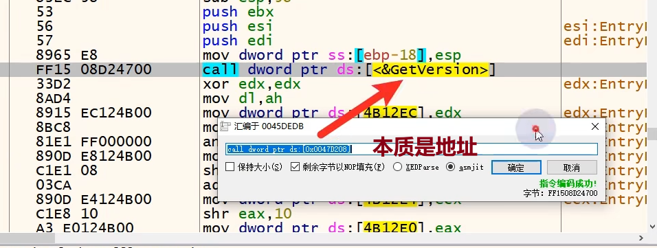

**内层看：一堆等待执行的代码集合**

 

#### 分析call的常用方法
中断状态

F7：单步执行进入到call中

F8：步过这个call

非中断状态

回车键：进入到call查看代码

减号键出来

利用dbg分析call函数的范围（仅供参考）


#### 真实的软件开发例子来理解函数
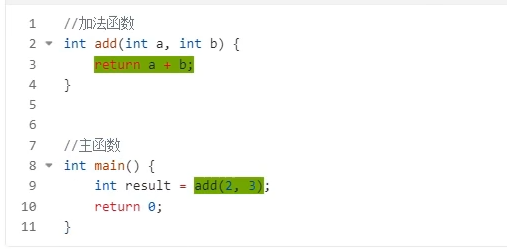

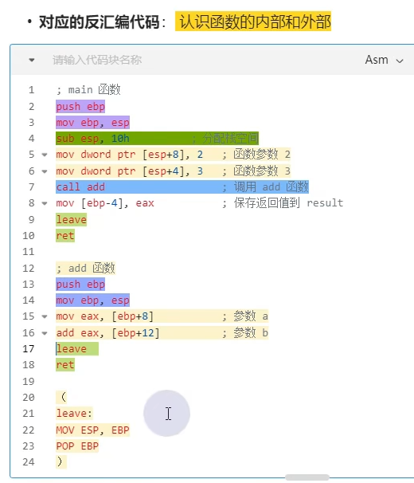


### 函数与栈结构
#### 明确两点：
1.程序的基本单位是函数

2.函数的结构全部都是栈结构（esp顶，ebp底）

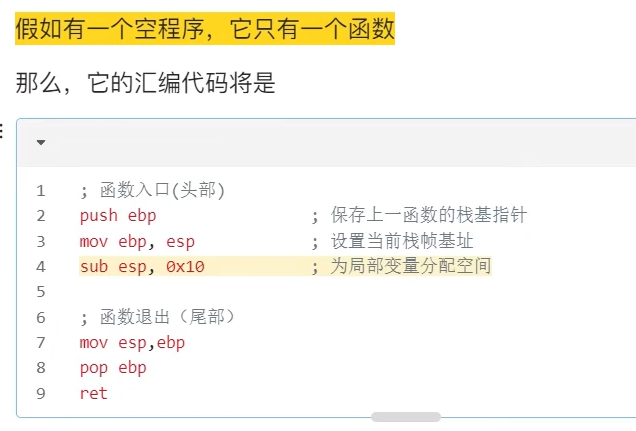

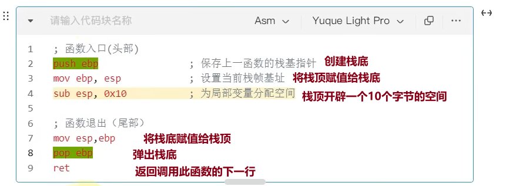

sub esp,0x10    为局部变量分配空间


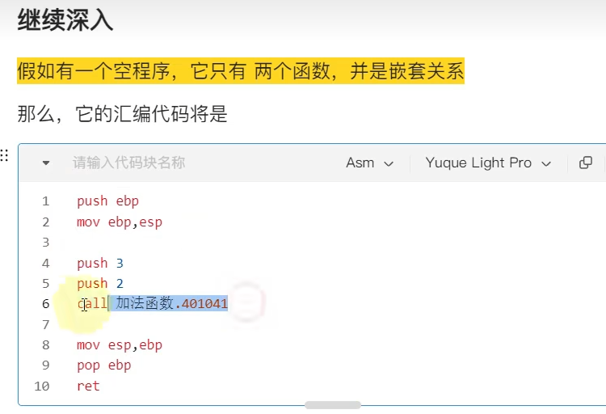


**嵌套调用**

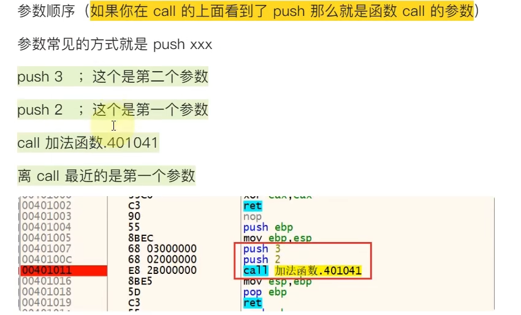

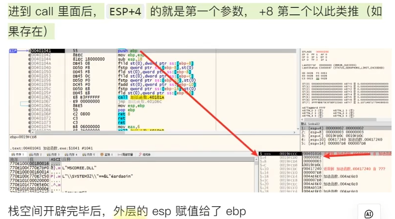

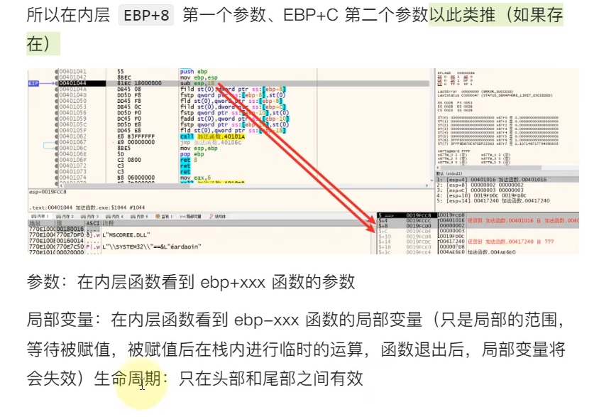

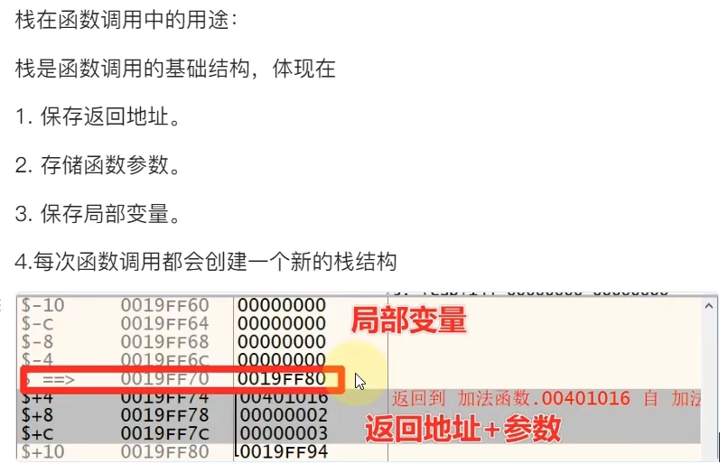


### 函数嵌套
#### 代码示例
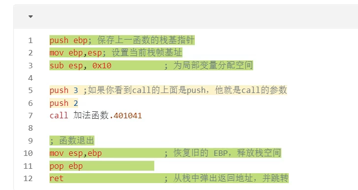


#### 函数嵌套堆栈图
 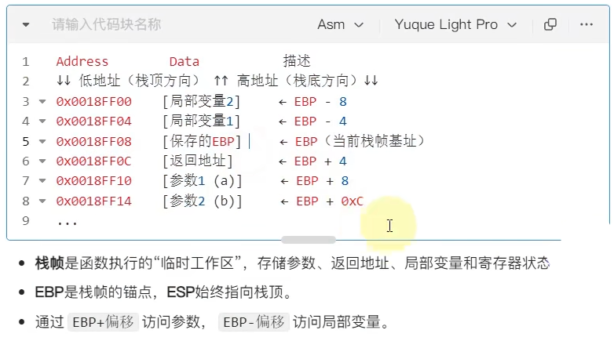

### 函数调用约定
 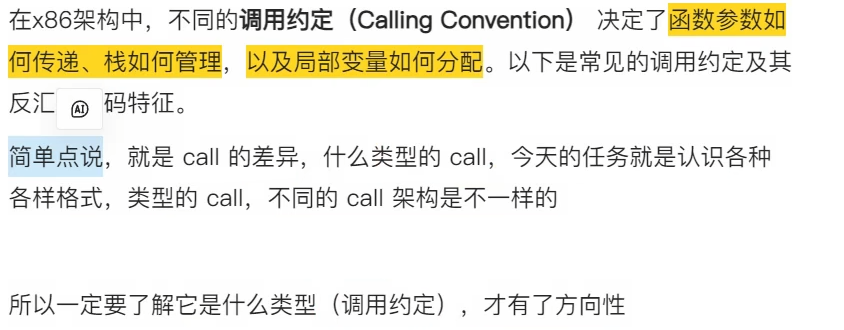

#### c调用约定
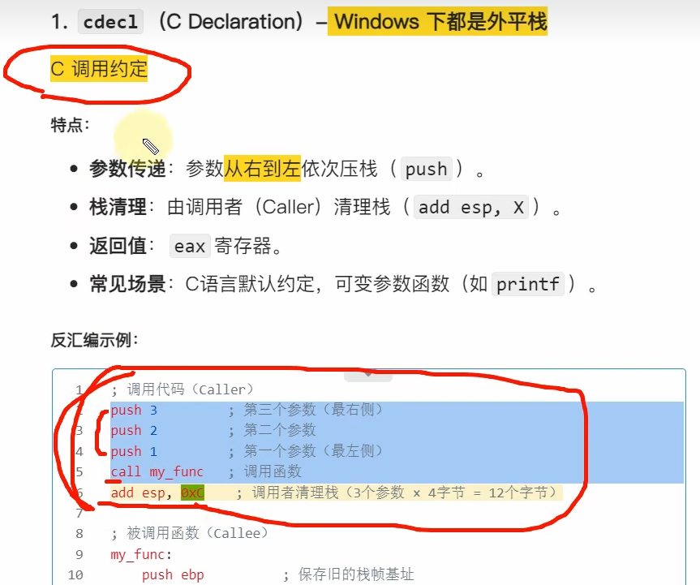

<font style="background-color:#F3BB2F;">！！！ c调用约定的特征</font>：push push push  /  call  /  add esp，xxx

由于push的时候，esp是不断减小的，所以恢复栈地址的时候，需要反其道而行之，需要`add esp，xxx`(xxx/4的结果为push的参数的个数)（外平栈） 

#### stdcall
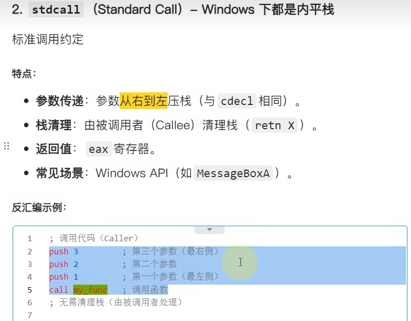 

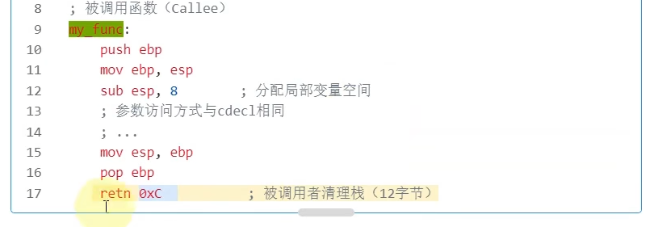

<font style="background-color:#F3BB2F;">！！！stdcall的特征：</font>push push push  / call xxx / 无需清理栈

内平栈：在retn 0xc平栈，无需在call下平栈


#### fastcall
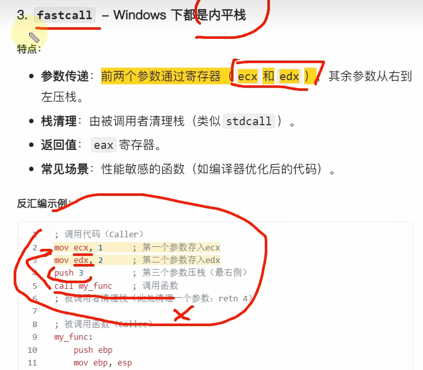


<font style="background-color:#F3BB2F;">！！！fastcall的特征</font>：ecx、edx同时用到了 / push /  call xxx / 无需平栈

前两个参数通过寄存器传递，其余参数通过栈传递。

 

#### thiscall
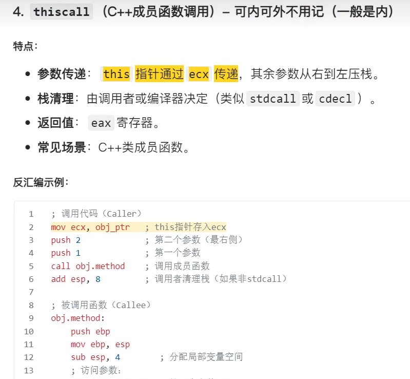

<font style="background-color:#F3BB2F;">！！！thiscall特征：</font>仅用到了ecx寄存器 / push / push / call xxx / add esp , xxx

 thiscall可外平栈可内平栈


#### syscall
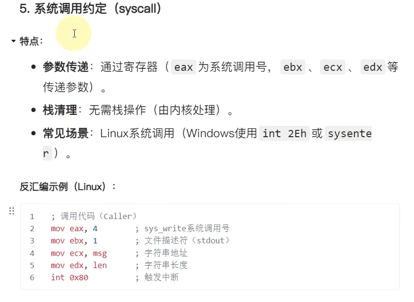


### 段
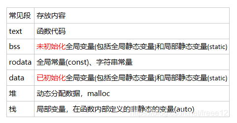

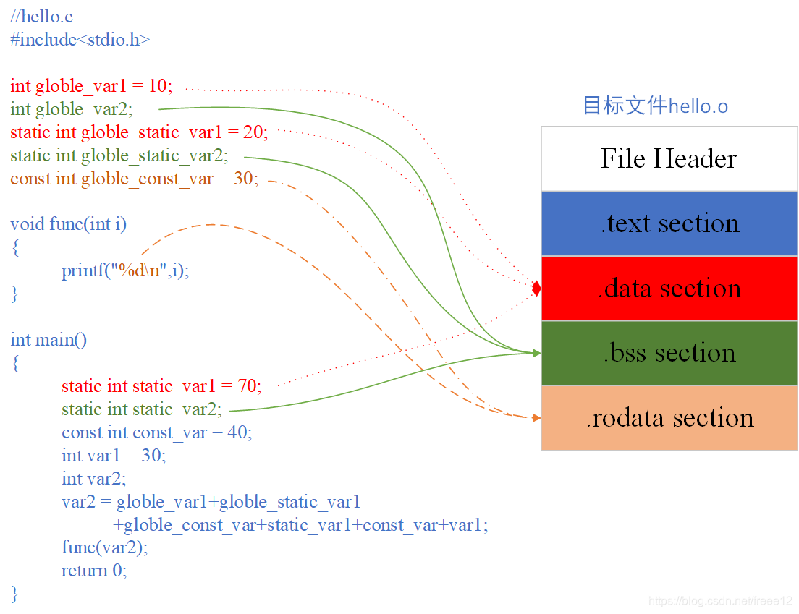


