PyTorch 和 Tensorflow 就是 python 的库（做深度学习只能用 N卡）

都是通过 pip 安装


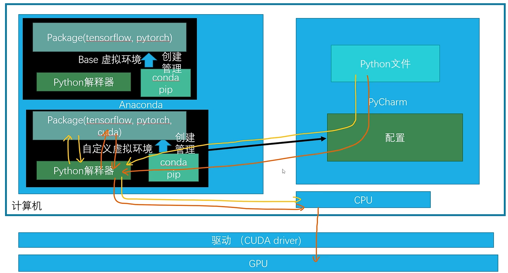


## Anaconda
有虚拟环境；支持不同语言的不同版本的管理

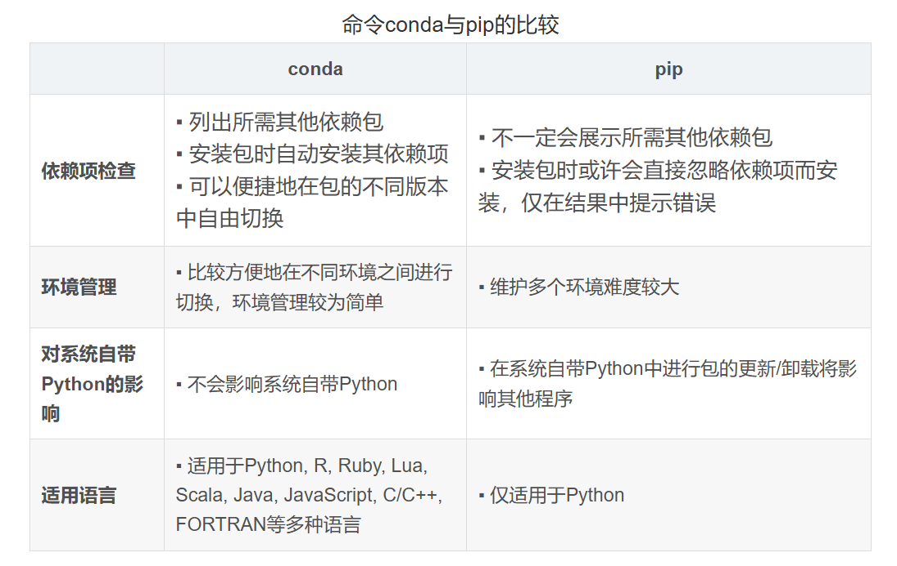


## conda 命令
#### 创建
创建一个名为 "myenv" 的新环境，制定 python 版本为 3.8

```plain
conda create --name myenv python=3.8
```

激活环境：

```plain
conda activate myenv
```

退出当前环境

```plain
deactivate
```


#### 环境
查看所有环境

```plain
conda env list
```

复制环境

```plain
conda create --name myclone --clone myenv
```

删除环境

```plain
conda env remove --name myenv
```


#### 包管理
搜索包

```plain
conda search package_name
```

安装包

```plain
conda install package_name
```

安装包的时候指定镜像源

```html
conda install package_name -c 
```

安装指定版本的包

```plain
conda install package_name=1.2.1
```

更新包

```plain
conda update package_name
```

清理包（代码清理 conda 缓存，删除不再需要的软件包。）

```plain
conda clean --all
```

卸载包

```plain
conda remove package_name
```

查看已安装包

```plain
conda list  [选填，可以输入包名]
```


#### 运行 python 程序


## 项目配置（第一个版本）
1.手动创建 anaconda 环境（test），配置并激活

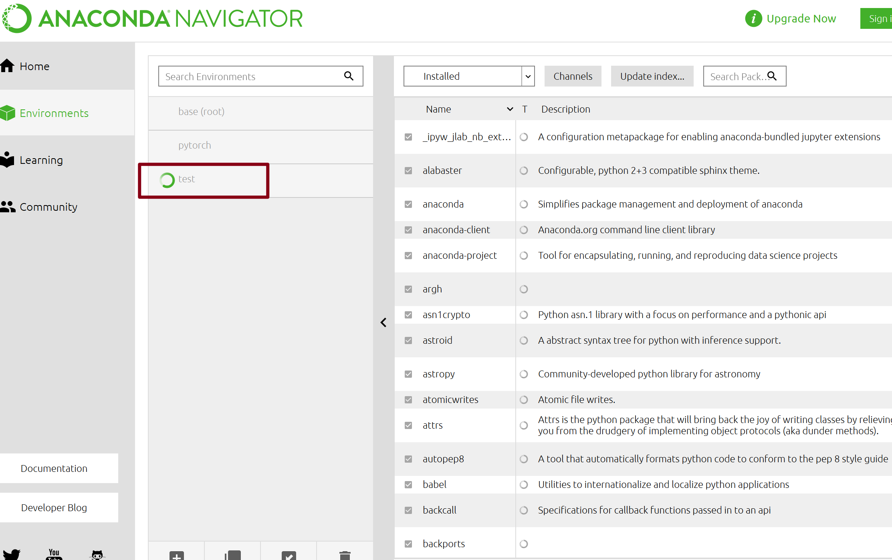


配置 anaconda 环境，例如 python 版本，需要用到的 python 库文件，包文件


2.pycharm 环境配置

新建项目：

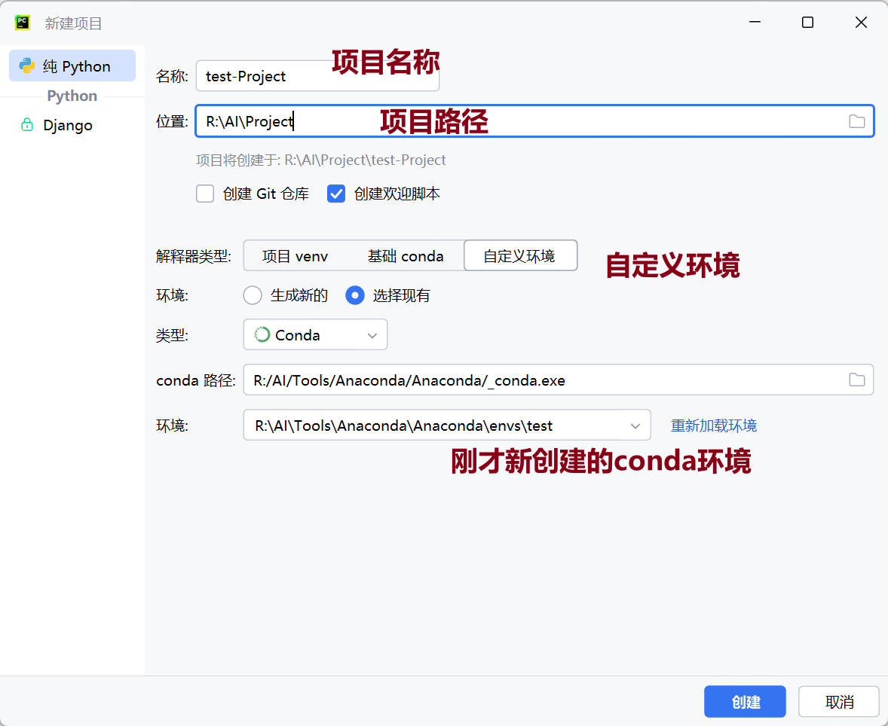

配置 python 解释器：

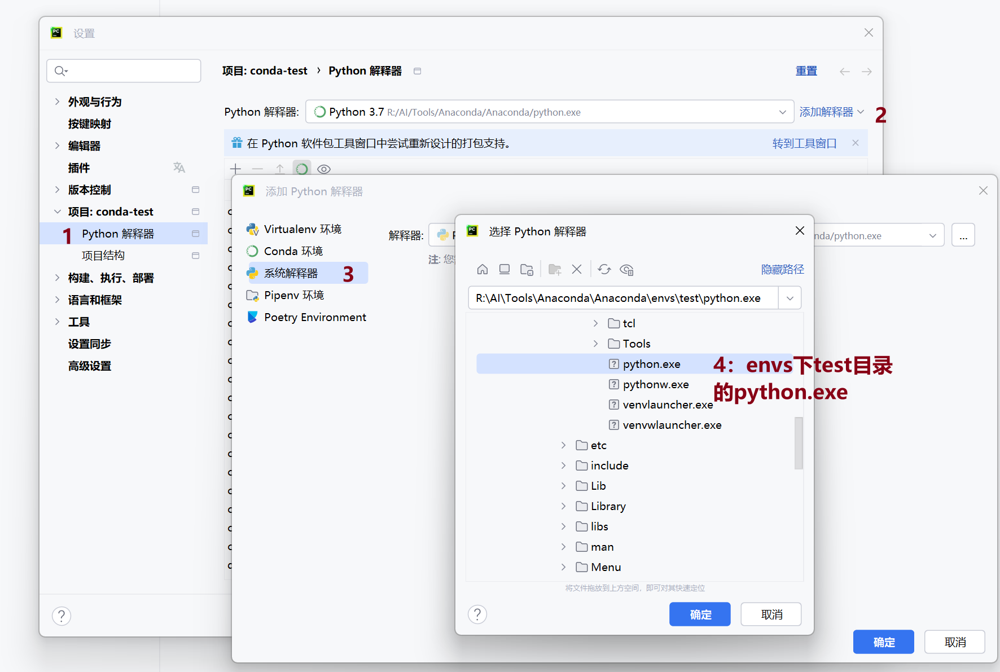


pycharm 中的包与 anaconda 中的一致

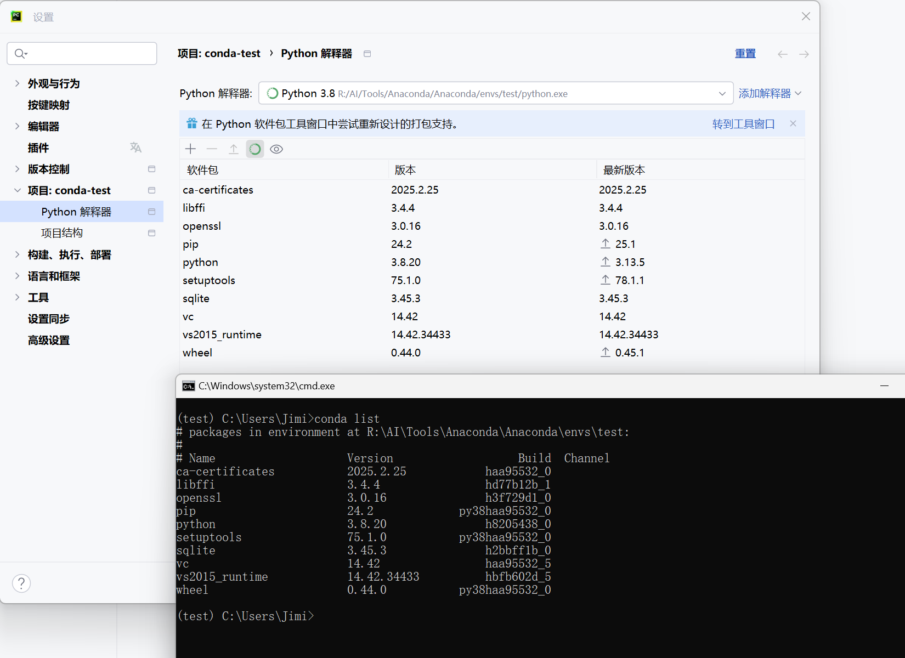


3.运行项目

运行项目之后各种找不到包，就在 conda 中 search、install 就可以。

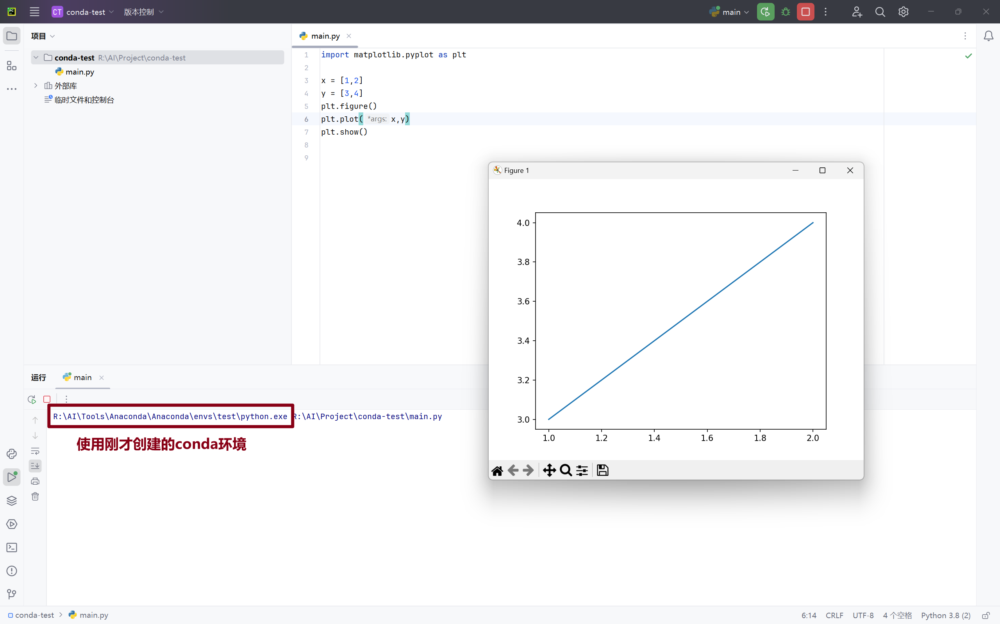


## 项目配置（第二个版本）
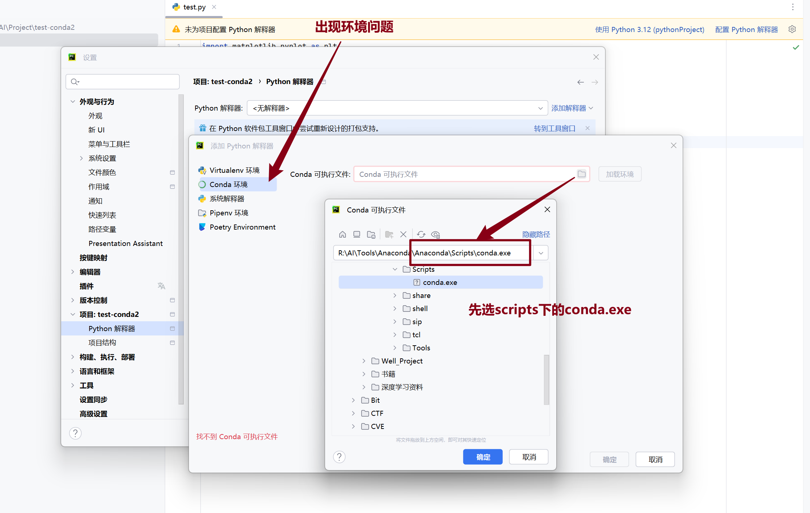

点击加载环境之后即可选择之前创建好的环境

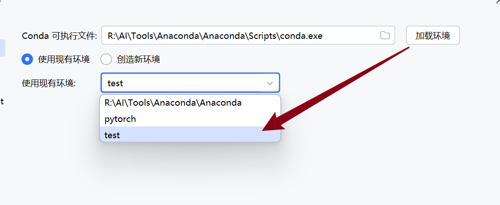


## CUDA
#### CUDA 版本确认


**显卡型号：**NVIDIA GeForce RTX 4060 Laptop GPU

	驱动程序版本:	32.0.15.6607
	
	驱动程序日期:	2024/10/20
	
	DirectX 版本:	12 (FL 12.1)
	
	物理位置：	PCI 总线 1、设备 0、功能 0


**确定显卡算力：**

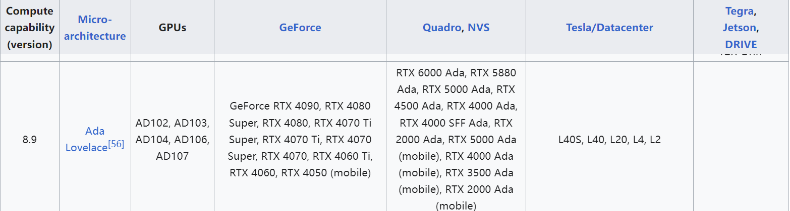


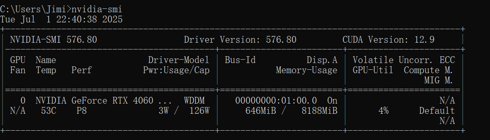

我的电脑支持的 11.8-12.9

```plain
#https://pytorch.org/get-started/previous-versions/
conda install pytorch==2.5.1 torchvision==0.20.1 torchaudio==2.5.1 pytorch-cuda=12.4 -c pytorch -c nvidia
```

要求 python 版本必须大于 3.10


#### 安装 Pytorch


主要就是安装三个包 pytorch 、torchvision（图像）、torchaudio（声音）

使用清华源

```plain
conda install pytorch==2.5.1 torchvision==0.20.1 torchaudio==2.5.1 pytorch-cuda=12.4 -c https://mirrors.tuna.tsinghua.edu.cn/anaconda/cloud/pytorch/ -c nvidia
```


下载完之后，验证

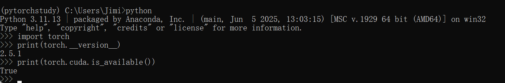


OJ*K，pytorch 安装好之后，就可以直接在 pycharm 中 import 使用了，开始你的快乐学习之旅吧~


#### 安装 Jupyter
Jupyter 随着 anaconda 一起安装，但是仅默认安装到 anaconda 的 base 环境中，所以但凡是自己新建的 conda 环境，都需要重新安装 Jupyter。


安装 Jupyter 依赖的包

```plain
conda install ipython


```


运行

```plain
jupyter notebook
```


## 运行别人项目
参考：[https://www.bilibili.com/video/BV1S5411X7FY?spm_id_from=333.788.videopod.episodes&vd_source=4e9106e7030f1c25677827558da5c605&p=30](https://www.bilibili.com/video/BV1S5411X7FY?spm_id_from=333.788.videopod.episodes&vd_source=4e9106e7030f1c25677827558da5c605&p=30)


1.给项目配置 anaconda 环境， python 解释器配置（参考项目配置）

2. 缺包添加包

+ conda install 包名
+ pip install 包名（requirements.txt）  需要在项目根目录下运行该命令！！

3.开始使用项目


