# 1.自定义数据集的设置/应用

```python
from torch.utils.data import Dataset
import os
from PIL import Image

class MyData(Dataset):
    def __init__(self,root_dir,label_dir):
        self.root_dir = root_dir
        self.label_dir = label_dir
        self.path = os.path.join(self.root_dir,self.label_dir)
        self.img_path = os.listdir(self.path)


    def __getitem__(self, idx):
        img_name = self.img_path[idx]
        img_item_path = os.path.join(self.root_dir,self.label_dir,img_name)
        img = Image.open(img_item_path)
        label = self.label_dir
        return img,label

    def __len__(self):
        return len(self.img_path)


root_dir = "dataset/train"
ants_label_dir = "ants_image"
bees_label_dir = "bees_image"
ants_dataset = MyData(root_dir,ants_label_dir)
bees_dataset = MyData(root_dir,bees_label_dir)

train_dataset = ants_dataset + bees_dataset
```

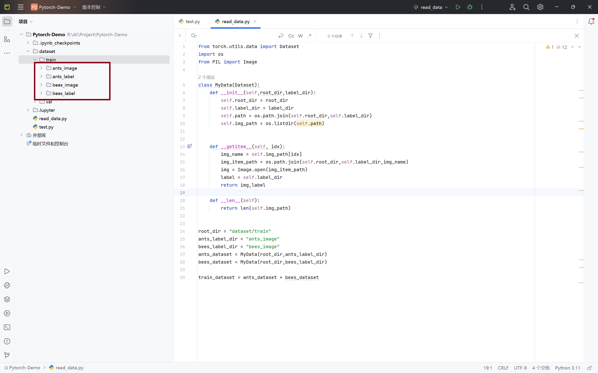


# 2.TensorBoard的使用

+ 探究模型在不同阶段是如何输出的


## 简介

**开发和训练深度学习模型时，你常常会遇到以下挑战：**

+ **训练过程不透明**： 模型在**“黑箱”**中训练，你不知道内部发生了什么（损失下降了吗？过拟合了吗？梯度爆炸了吗？）。
+ **调试困难**： 当**模型表现**不如预期时，很难定位问题根源（是数据问题、模型架构问题、超参数问题还是代码bug？）。
+ **超参数调整耗时**： 手动尝试不同的学习率、批次大小、网络层数等参数并比较结果非常低效。
+ **理解模型行为**： 模型学到了什么？它关注输入数据的哪些部分？决策依据是什么？
+ **比较模型**： 当你有多个模型变体或实验时，直观地比较它们的性能很困难。

TensorBoard 就是为了解决这些问题而生的。 它通过将模型训练过程中的各种指标、数据和结构可视化，为开发者提供了一个直观的“仪表盘”，让训练过程变得透明、可解释、可调试和可优化。


## 使用


安装：pip install tensorboard

运行（不指定 port 的话默认 6006 端口）

```plain
tensorboard --logdir=logs --port=6007
```

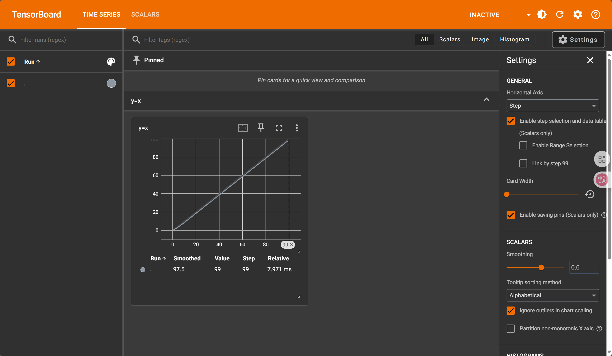


## 实例  

```plain
from torch.utils.tensorboard import SummaryWriter
import numpy as np
from PIL import Image


writer = SummaryWriter("logs")
image_path = "dataset/train/ants_image/0013035.jpg"
img_PIL = Image.open(image_path)
img_array = np.array(img_PIL)
print(type(img_array))
print(img_array.shape)


writer.add_image("test",img_array,1,dataformats="HWC")

for i in range(100):
    writer.add_scalar("y=2x",3*i,i)

writer.close()

```

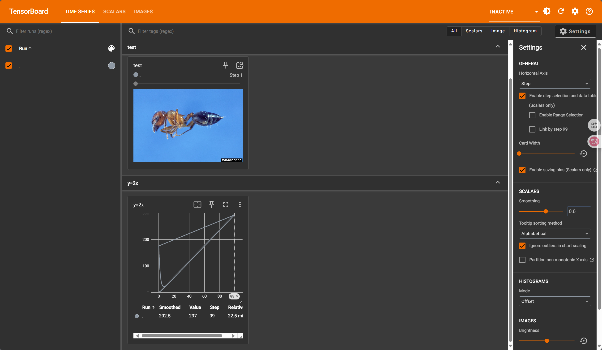


# 3.Transforms的常用方法和运行实例


**多看源代码，源代码中直接有示例，正确率杠杠的**


## 简介

Transforms 是指对原始输入数据（如图像、文本、音频）或模型中间结果进行处理和修改的一系列操作。它们的主要目的是将原始数据转化为更适合模型训练、评估或推理的形式，或者是为了增强模型的性能和鲁棒性。


| Transform                                                    | 作用                                                         |
| ------------------------------------------------------------ | ------------------------------------------------------------ |
| `transforms.ToTensor()`                                      | 将 PIL Image 或 ndarray 转换为 Tensor，且会将像素值从 `[0, 255]` 归一化到 `[0.0, 1.0]`。 |
| `transforms.Normalize(mean, std)`                            | 对 Tensor 图像进行归一化（标准化）：输出 = (输入 - mean) / std，通常用于模型训练时统一输入分布。 |
| `transforms.Resize(size)`                                    | 将输入图像缩放到指定的尺寸（保持纵横比或指定新尺寸）。       |
| `transforms.CenterCrop(size)`                                | 从图像中心裁剪指定大小。                                     |
| `transforms.RandomCrop(size)`                                | 随机裁剪图像，用于数据增强。                                 |
| `transforms.RandomHorizontalFlip(p=0.5)`                     | 以概率 `p` 水平翻转图像，用于数据增强。                      |
| `transforms.RandomVerticalFlip(p=0.5)`                       | 以概率 `p` 垂直翻转图像。                                    |
| `transforms.RandomRotation(degrees)`                         | 随机旋转图像一定角度范围，用于增加模型鲁棒性。               |
| `transforms.ColorJitter(brightness, contrast, saturation, hue)` | 随机改变图像亮度、对比度、饱和度、色调，增强多样性。         |
| `transforms.Grayscale(num_output_channels=1)`                | 将图像转换为灰度图像。                                       |
| `transforms.RandomResizedCrop(size)`                         | 随机裁剪图像并缩放为指定大小，常用于训练。                   |
| `transforms.RandomAffine(degrees, translate, scale, shear)`  | 随机执行仿射变换（旋转、平移、缩放、剪切），提升泛化能力。   |
| `transforms.Lambda(func)`                                    | 应用自定义函数 `func`，用于特殊的自定义操作。                |
| `transforms.Compose([...])`                                  | 将多个变换操作组合在一起，按顺序执行。                       |


```python
from PIL import Image
from torch.utils.tensorboard import SummaryWriter
from torchvision import transforms

writer = SummaryWriter("logs")
img = Image.open("images/china.jpg")
print(img)

# ToTensor的使用
trans_totensor = transforms.ToTensor()
img_tensor = trans_totensor(img)
writer.add_image("ToTensor",img_tensor)
#writer.close()
#验证： tensorboard --logdir=logs，查看图片是否正确加载


#Normalize
print(img_tensor[0][0][0])
#print("原始图像范围:", img_tensor.min(), img_tensor.max())
# 如果原始图像是0-255范围，需要先转换为0-1：
# img_tensor = img_tensor.float() / 255.0
trans_norm = transforms.Normalize(mean=[0.485, 0.478, 0.406], std=[0.529, 0.324, 0.225])
img_norm = trans_norm(img_tensor)
print(img_norm[0][0][0])
writer.add_image("Normalize",img_norm,2)


#Resize
print(img.size)
trans_resize = transforms.Resize((512,512))
# img PIL -> resize ->img_resize PIL
img_resize = trans_resize(img)
#  img_resize PIL -> totensor ->img_resize tensor
img_resize = trans_totensor(img_resize)
print(img_resize)
writer.add_image("Resize",img_resize,0)

#compose - resize -2
trans_resize_2 = transforms.Resize(640)
#compose 依次执行列表中的操作（需要保证后一个操作的输入与前一个操作的输出需要对应）
trans_compose = transforms.Compose([trans_resize_2,trans_totensor])
img_resize_2 = trans_compose(img)
writer.add_image("Resize",img_resize_2,1)


# RandomCrop 随机裁剪
trans_random = transforms.RandomCrop((128,256))
trans_compose_2 = transforms.Compose([trans_random,trans_totensor])
for i in range(10):
    img_crop = trans_compose_2(img)
    writer.add_image("RandomCropHW", img_crop, i)


writer.close()


```


运行截图（<font style="color:#080808;background-color:#ffffff;">tensorboard --logdir=logs</font>）：


# 4.torchvision中数据集的使用


:::info
如何下载/使用他人数据集

:::


```python
import  torchvision
from torch.utils.tensorboard import SummaryWriter

#将PIL图片转换成tensor数据类型
dataset_transform = torchvision.transforms.Compose([
    torchvision.transforms.ToTensor(),
])

train_set = torchvision.datasets.CIFAR10(root="./download_dataset",train=True,transform=dataset_transform,download=True)    #下载CIFAR10数据集
test_set = torchvision.datasets.CIFAR10(root="./download_dataset",train=False,transform=dataset_transform,download=True)    #下载CIFAR10数据集

print(test_set[0])          #  (<PIL.Image.Image image mode=RGB size=32x32 at 0x18CA4B1AE50>, 3)
# print(test_set.classes)        # ['airplane', 'automobile', 'bird', 'cat', 'deer', 'dog', 'frog', 'horse', 'ship', 'truck']
# img,target = test_set[0]
# print(img)                              # <PIL.Image.Image image mode=RGB size=32x32 at 0x1CDC3BEC0D0>
# print(target)                           # 3
# print(test_set.classes[target])        #cat
# img.show()                          #打开图片

writer = SummaryWriter("/logs/p10")           #SummaryWriter日志写入器，p10是日志文件目录
for i in range(10):
    img,target = test_set[i]
    writer.add_image("test_set",img,i)          #将图像写入tensorboard


writer.close()                      #正常关闭SummaryWriter，刷新缓冲区，写入日志。


```


# 5.DataLoader的使用


```python
import torchvision
from torch.utils.data import DataLoader
from torch.utils.tensorboard import SummaryWriter

# 准备的测试数据集
test_data = torchvision.datasets.CIFAR10(root="./download_dataset",train=False,transform=torchvision.transforms.ToTensor())

#                           数据集          每批次的图片数量   每批次的训练图片是否随机
test_loader = DataLoader(dataset=test_data,batch_size=64,shuffle=True,num_workers=0,drop_last=True)
                                                                    #多进程加载          丢掉最后一个不完整的batch

img,target = test_data[0]           # 当取test_data[0]数据的时候会调用cifar.py中的__getitem__方法，return格式为return img, target
print(img.shape)                # torch.Size([3, 32, 32])
print(target)                   #3

writer = SummaryWriter("/logs/DataLoader")
for epoch in range(2):
    step = 0
    for data in test_loader:
        imgs,targets = data
        # print(imgs.shape)        # torch.Size([64, 3, 32, 32])
        # print(targets)
        writer.add_images("DataLoader",imgs,step)
        step = step +1

writer.close()
```


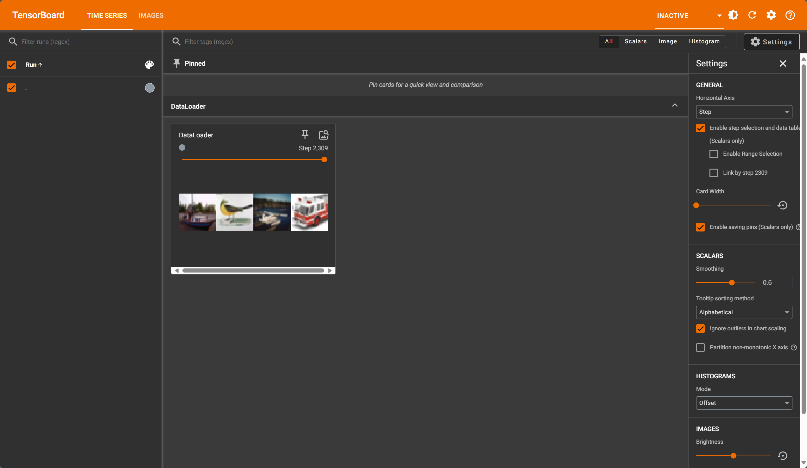


# 6.神经网络-nn.Module的使用


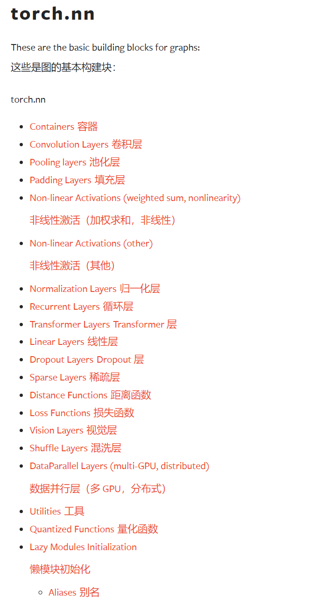


##  Moudle

+ base classes for all neural network modules
+ Moudles can also contain other Moudlers ,allowing them to be nested in a tree structure. You can assign the submodules as regular attributes


```python
#https://docs.pytorch.org/docs/stable/generated/torch.nn.Module.html#torch.nn.Module

import torch
import torch.nn as nn
import torch.nn.functional as F

class Jimi_nn(nn.Module):       #自定义神经网络的实现
    def __init__(self):
        super().__init__()

    def forward(self, input):
        output = input + 1
        return output

Jimi = Jimi_nn()
x = torch.tensor(1.0)
output = Jimi(x)        # 调用Jimi.__call__(x) → Jimi.forward(x)
print(output)


```


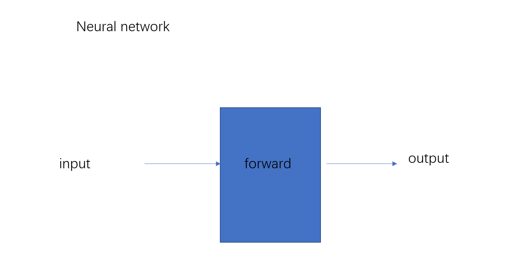

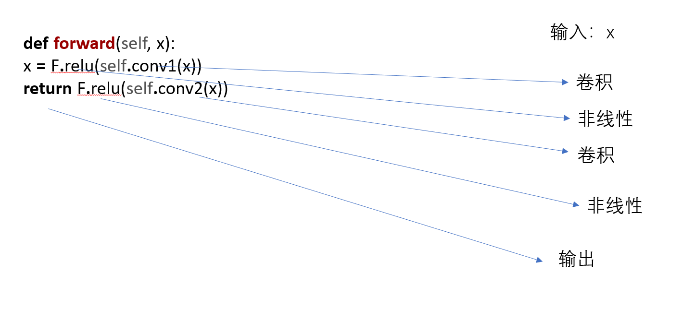


# 7.神经网络-卷积层


## 卷积

[https://docs.pytorch.org/docs/stable/generated/torch.nn.Conv2d.html](https://docs.pytorch.org/docs/stable/generated/torch.nn.Conv2d.html)


```python
CLASStorch.nn.Conv2d(in_channels, out_channels, kernel_size, stride=1, padding=0, dilation=1, groups=1, bias=True, padding_mode='zeros', device=None, dtype=None)
```


#### <font style="color:#080808;background-color:#ffffff;">公式讲解</font>

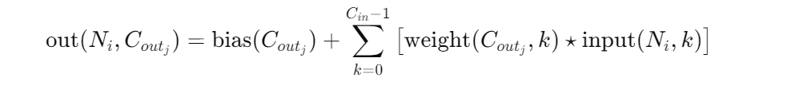


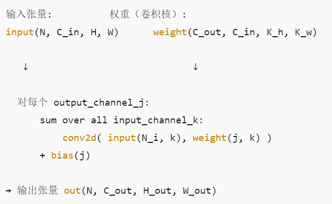


### <font style="color:#080808;background-color:#ffffff;">conv2d </font><font style="color:rgb(38, 38, 38);">Parameters</font>

+ **<font style="color:rgb(38, 38, 38);">in_channels</font>****<font style="color:rgb(38, 38, 38);"> </font>****<font style="color:rgb(38, 38, 38);">(</font>**[**<font style="color:rgb(238, 76, 44);">int</font>**](https://docs.python.org/3/library/functions.html#int)**<font style="color:rgb(38, 38, 38);">) – Number of channels in the input image</font>**
+ **<font style="color:rgb(38, 38, 38);">out_channels</font>****<font style="color:rgb(38, 38, 38);"> </font>****<font style="color:rgb(38, 38, 38);">(</font>**[**<font style="color:rgb(238, 76, 44);">int</font>**](https://docs.python.org/3/library/functions.html#int)**<font style="color:rgb(38, 38, 38);">) – Number of channels produced by the convolution</font>**
+ **<font style="color:rgb(38, 38, 38);">kernel_size</font>****<font style="color:rgb(38, 38, 38);"> </font>****<font style="color:rgb(38, 38, 38);">(</font>**[**<font style="color:rgb(238, 76, 44);">int</font>**](https://docs.python.org/3/library/functions.html#int)_**<font style="color:rgb(38, 38, 38);"> </font>**__**<font style="color:rgb(38, 38, 38);">or</font>**__**<font style="color:rgb(38, 38, 38);"> </font>**_[**<font style="color:rgb(238, 76, 44);">tuple</font>**](https://docs.python.org/3/library/stdtypes.html#tuple)**<font style="color:rgb(38, 38, 38);">) – Size of the convolving kernel</font>**
+ **<font style="color:rgb(38, 38, 38);">stride</font>****<font style="color:rgb(38, 38, 38);"> </font>****<font style="color:rgb(38, 38, 38);">(</font>**[**<font style="color:rgb(238, 76, 44);">int</font>**](https://docs.python.org/3/library/functions.html#int)_**<font style="color:rgb(38, 38, 38);"> </font>**__**<font style="color:rgb(38, 38, 38);">or</font>**__**<font style="color:rgb(38, 38, 38);"> </font>**_[**<font style="color:rgb(238, 76, 44);">tuple</font>**](https://docs.python.org/3/library/stdtypes.html#tuple)_**<font style="color:rgb(38, 38, 38);">,</font>**__**<font style="color:rgb(38, 38, 38);"> </font>**__**<font style="color:rgb(38, 38, 38);">optional</font>**_**<font style="color:rgb(38, 38, 38);">) – Stride of the convolution. Default: 1</font>**
+ **<font style="color:rgb(38, 38, 38);">padding</font>****<font style="color:rgb(38, 38, 38);"> </font>****<font style="color:rgb(38, 38, 38);">(</font>**[**<font style="color:rgb(238, 76, 44);">int</font>**](https://docs.python.org/3/library/functions.html#int)_**<font style="color:rgb(38, 38, 38);">,</font>**__**<font style="color:rgb(38, 38, 38);"> </font>**_[**<font style="color:rgb(238, 76, 44);">tuple</font>**](https://docs.python.org/3/library/stdtypes.html#tuple)_**<font style="color:rgb(38, 38, 38);"> </font>**__**<font style="color:rgb(38, 38, 38);">or</font>**__**<font style="color:rgb(38, 38, 38);"> </font>**_[**<font style="color:rgb(238, 76, 44);">str</font>**](https://docs.python.org/3/library/stdtypes.html#str)_**<font style="color:rgb(38, 38, 38);">,</font>**__**<font style="color:rgb(38, 38, 38);"> </font>**__**<font style="color:rgb(38, 38, 38);">optional</font>**_**<font style="color:rgb(38, 38, 38);">) – Padding added to all four sides of the input. Default: 0</font>**
+ **<font style="color:rgb(38, 38, 38);">dilation</font>****<font style="color:rgb(38, 38, 38);"> </font>****<font style="color:rgb(38, 38, 38);">(</font>**[**<font style="color:rgb(238, 76, 44);">int</font>**](https://docs.python.org/3/library/functions.html#int)_**<font style="color:rgb(38, 38, 38);"> </font>**__**<font style="color:rgb(38, 38, 38);">or</font>**__**<font style="color:rgb(38, 38, 38);"> </font>**_[**<font style="color:rgb(238, 76, 44);">tuple</font>**](https://docs.python.org/3/library/stdtypes.html#tuple)_**<font style="color:rgb(38, 38, 38);">,</font>**__**<font style="color:rgb(38, 38, 38);"> </font>**__**<font style="color:rgb(38, 38, 38);">optional</font>**_**<font style="color:rgb(38, 38, 38);">) – Spacing between kernel elements. Default: 1</font>**
+ **<font style="color:rgb(38, 38, 38);">groups</font>****<font style="color:rgb(38, 38, 38);"> </font>****<font style="color:rgb(38, 38, 38);">(</font>**[**<font style="color:rgb(238, 76, 44);">int</font>**](https://docs.python.org/3/library/functions.html#int)_**<font style="color:rgb(38, 38, 38);">,</font>**__**<font style="color:rgb(38, 38, 38);"> </font>**__**<font style="color:rgb(38, 38, 38);">optional</font>**_**<font style="color:rgb(38, 38, 38);">) – Number of blocked connections from input channels to output channels. Default: 1</font>**


```python
import torch
import torch.nn.functional as F

input = torch.tensor([[1,2,0,3,1],
                     [0,1,2,3,1],
                     [1,2,1,0,0],
                     [5,2,3,1,1],
                     [2,1,0,1,1]])
kernel = torch.tensor([[1,2,1],
                       [0,1,0],
                       [2,1,0]])

input = torch.reshape(input,(1,1,5,5))
kernel = torch.reshape(kernel,(1,1,3,3))

print(input.shape)          #torch.Size([1, 1, 5, 5])
print(kernel.shape)         #torch.Size([1, 1, 3, 3])

output = F.conv2d(input,kernel,stride=1)
print(output)
# tensor([[[[10, 12, 12],
#           [18, 16, 16],
#           [13,  9,  3]]]])

output2 = F.conv2d(input,kernel,stride=2)
print(output2)
# tensor([[[[10, 12],
#           [13,  3]]]])

outp3 = F.conv2d(input,kernel,stride=1,padding=1)
print(outp3)


```

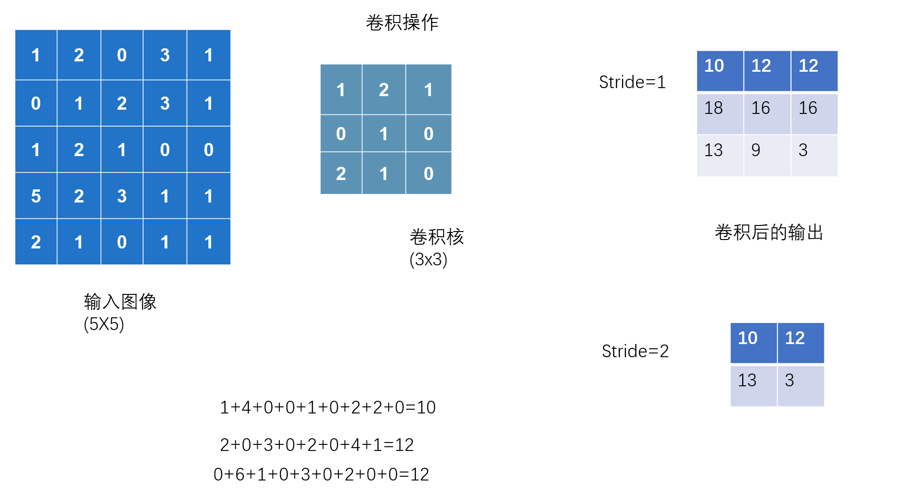

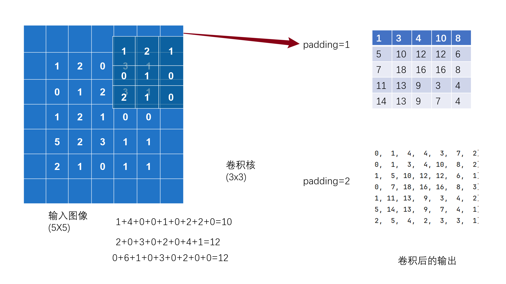

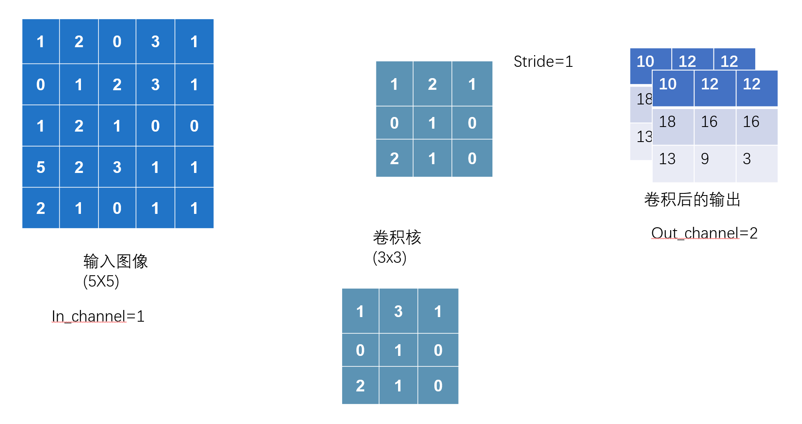

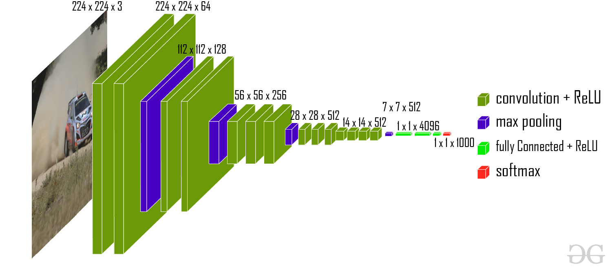


## 卷积层的使用

```python
import torch
import torchvision
from torch import nn
from torch.nn import Conv2d
from torch.utils.data import DataLoader
from torch.utils.tensorboard import SummaryWriter

dataset = torchvision.datasets.CIFAR10(root="./download_dataset",train=False,transform=torchvision.transforms.ToTensor(),download=True)
dataloader = DataLoader(dataset,batch_size=64)

class Jimi(nn.Module):
    def __init__(self):
        super(Jimi,self).__init__()
        # 输入是 3 个通道（RGB 图像），输出是 6 个通道 —— 网络通过 6 个卷积核提取出 6 个不同的特征图
        # RGB图像：你从“红光”、“绿光”、“蓝光”三个角度看图
        # CNN的中间层：你从“边缘”、“颜色变化”、“纹理”、“形状”、“方向”等多个角度观察图像
        # 每个“角度”就是一个channel。
        self.conv1 = Conv2d(in_channels=3,out_channels=6,kernel_size=3,stride=1,padding=0)


    def forward(self, x):
        x = self.conv1(x)
        return x

jimi = Jimi()


writer = SummaryWriter("/logs/nn_conv2d")
for data in dataloader:
    step = 0
    imgs,targets = data
    output = jimi(imgs)
    print(imgs.shape)
    print(output.shape)

    writer.add_images("input", imgs, step)
    output = torch.reshape(output,(-1,3,30,30))
    writer.add_images("output", output, step)
    step = step + 1


```


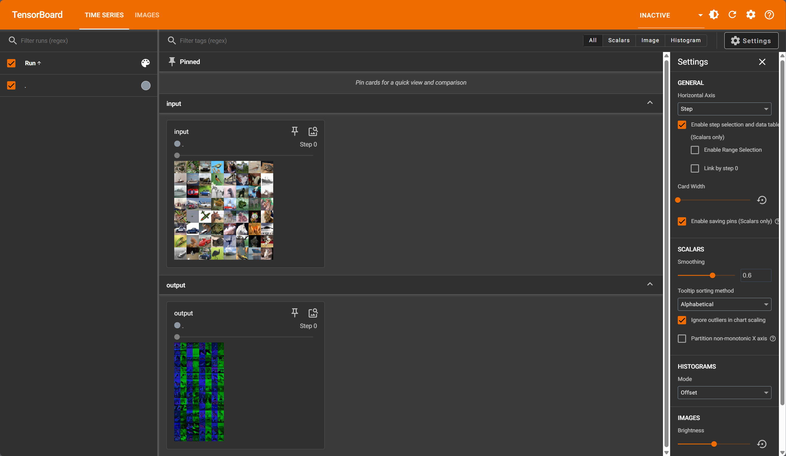


# 8.神经网络-池化层

[https://docs.pytorch.org/docs/stable/nn.html#pooling-layers](https://docs.pytorch.org/docs/stable/nn.html#pooling-layers)


池化层（Pooling Layer）是深度学习神经网络中常用的一种层，用于减少特征图的空间尺寸，同时保留重要信息。池化层通常紧跟在卷积层之后，通过对特征图进行下采样来减少参数数量，降低计算复杂度，并且有助于防止过拟合。


**<font style="color:rgb(25, 27, 31);">最大池化</font>**<font style="color:rgb(25, 27, 31);">选取池化窗口中的最大值作为输出，</font>**<font style="color:rgb(25, 27, 31);">平均池化</font>**<font style="color:rgb(25, 27, 31);">计算池化窗口中的平均值作为输出。</font>


### 最大池化

优点包括： 

+ 特征不变性：最大池化能够保留局部区域内最显著的特征，使得模型对目标的位置变化具有一定的不变性。 
+ 降维：通过取每个区域内的最大值，可以减少数据的空间尺寸，降低模型的复杂度，加快计算速度。 
+ 减少过拟合：最大池化可以减少模型的参数数量，有助于减少过拟合的风险。


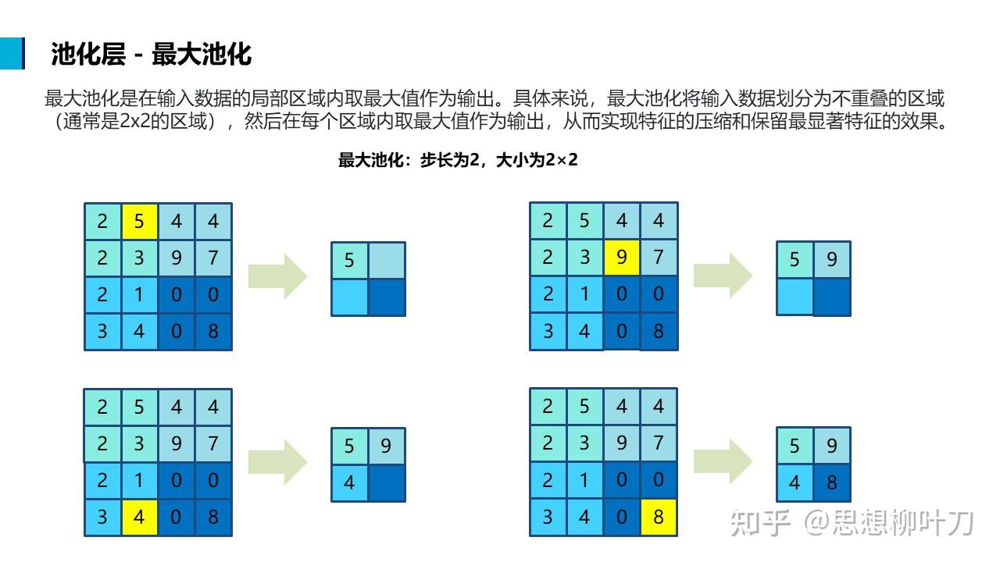


```python
import torch
import torchvision
from torch import nn
from torch.nn import MaxPool2d
from torch.utils.data import DataLoader
from torch.utils.tensorboard import SummaryWriter

dataset = torchvision.datasets.CIFAR10("./download_dataset",train=False,download=True,transform=torchvision.transforms.ToTensor())
dataloader = DataLoader(dataset,batch_size=64)

# input = torch.tensor([[1,2,0,3,1],
#                       [0,1,2,3,1],
#                       [1,2,1,0,0],
#                       [5,2,3,1,1],
#                       [2,1,0,1,1]],dtype=torch.float32)
#
#
# input = torch.reshape(input,(-1,1,5,5))
# print(input.shape)


class Jimi(nn.Module):
    def __init__(self):
        super(Jimi,self).__init__()
        self.maxpool1 = MaxPool2d(kernel_size=3,ceil_mode=True)             #最大池化神经网络

    def forward(self,input):
        output = self.maxpool1(input)
        return  output


jimi = Jimi()

writer = SummaryWriter("logs/nn_maxpool")
step = 0

for data in dataloader:
    imgs,data = data
    writer.add_images("input",imgs,step)
    output = jimi(imgs)
    writer.add_images("output",output,step)
    step = step + 1

writer.close()
```


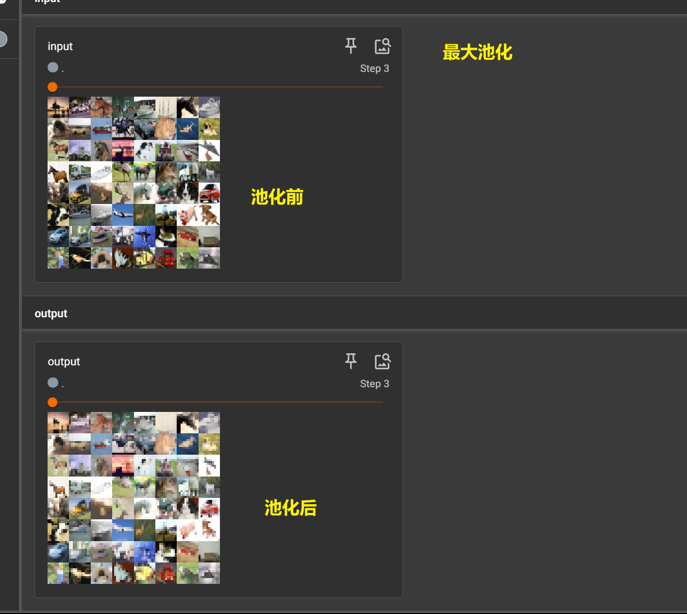


### 平均池化

在平均池化中，对于每个池化窗口（通常是一个矩形区域），将窗口内所有像素的值取平均作为输出值。这个过程可以看作是对特征图进行降采样，减少特征图的尺寸，同时保留主要特征。平均池化的主要优点是**能够保留更多的信息**，相比于最大池化（Max Pooling），平均池化更加平滑，有助于保留更多细节信息。

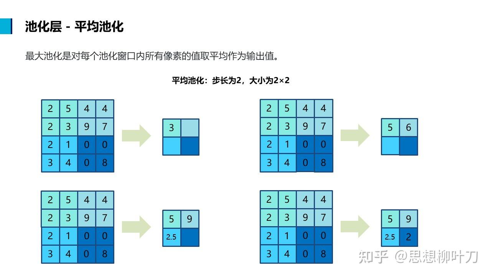


```python
import torchvision.datasets
from torch import nn
from torch.nn import AvgPool2d
from torch.utils.data import DataLoader
from torch.utils.tensorboard import SummaryWriter

dataset = torchvision.datasets.CIFAR10(root="./download_dataset",train=False,download=True,transform=torchvision.transforms.ToTensor())
dataloader = DataLoader(dataset,batch_size=64)

class AveragePool(nn.Module):
    def __init__(self):
        super(AveragePool,self).__init__()
        self.AveragePool1 = AvgPool2d(kernel_size=3,stride=1,ceil_mode=True)

    def forward(self,input):
        output = self.AveragePool1(input)
        return output

jimi = AveragePool()

writer = SummaryWriter(log_dir="logs/nn_AvgPool")
step = 0
for data in dataloader:
    imgs,targets = data

    writer.add_images("input",imgs,step)
    output = jimi(imgs)                         #池化操作
    writer.add_images("output",output,step)
    step = step + 1

writer.close()


```

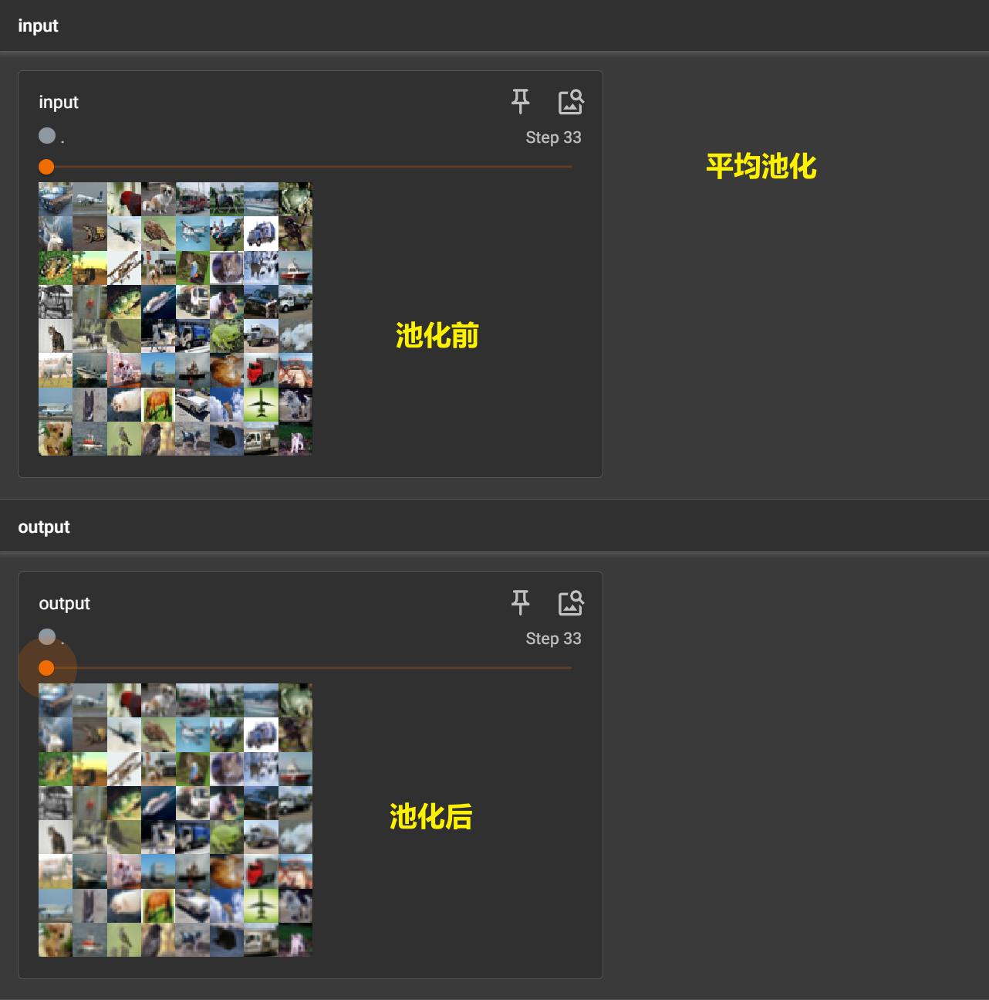


# 9.神经网络-非线性激活

+ 提升模型的泛化能力
+ 所有的 `激活函数` 本质都是一种非线性变换。  
+ 非线性变换是深度学习“能学到复杂东西”的根本原因  


```python
import torch
import torchvision
from torch import nn
from torch.nn import ReLU, Sigmoid
from torch.utils.data import DataLoader
from torch.utils.tensorboard import SummaryWriter

# input = torch.tensor([[1,-0.5],
#                       [-1,3]])
#
#
# output = torch.reshape(input,(-1,1,2,2))
# print(output.shape)
#


dataset = torchvision.datasets.CIFAR10(root="./download_dataset",train=False,transform=torchvision.transforms.ToTensor(),download=True)
dataloader = DataLoader(dataset,batch_size=64)


class Relu(nn.Module):
    def __init__(self):
        super(Relu,self).__init__()
        self.relu1 = ReLU()				# Rectified Linear Unit
        self.sigmoid1 = Sigmoid()		# 把输出转成 0~1，表示可能性或概率

    def forward(self,input):
        output = self.sigmoid1(input)
        return output

jimi = Relu()

writer = SummaryWriter(log_dir="/logs/nn_relu")
step = 0
for data in dataloader:
    imgs,targets = data
    writer.add_images("input",imgs,global_step=step)
    output = jimi(imgs)
    writer.add_images("output",output,global_step=step)
    step += 1
writer.close()

```


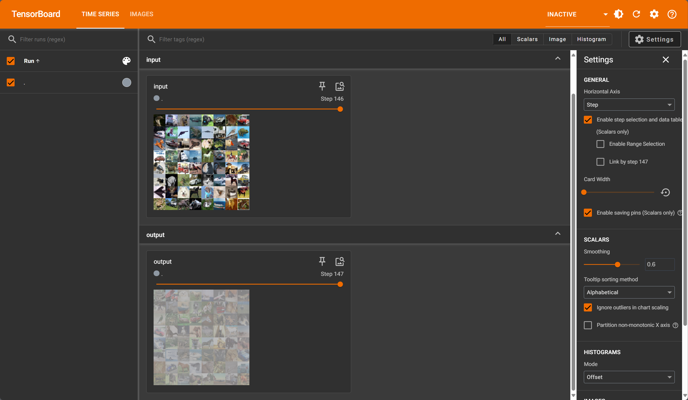


# 10.神经网络-线性层及其他层

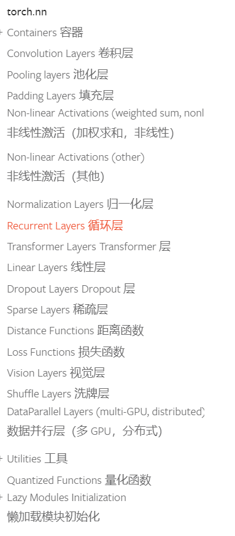


### 正则化层（Normalization Layers）

[https://docs.pytorch.org/docs/stable/nn.html#normalization-layers](https://docs.pytorch.org/docs/stable/nn.html#normalization-layers)


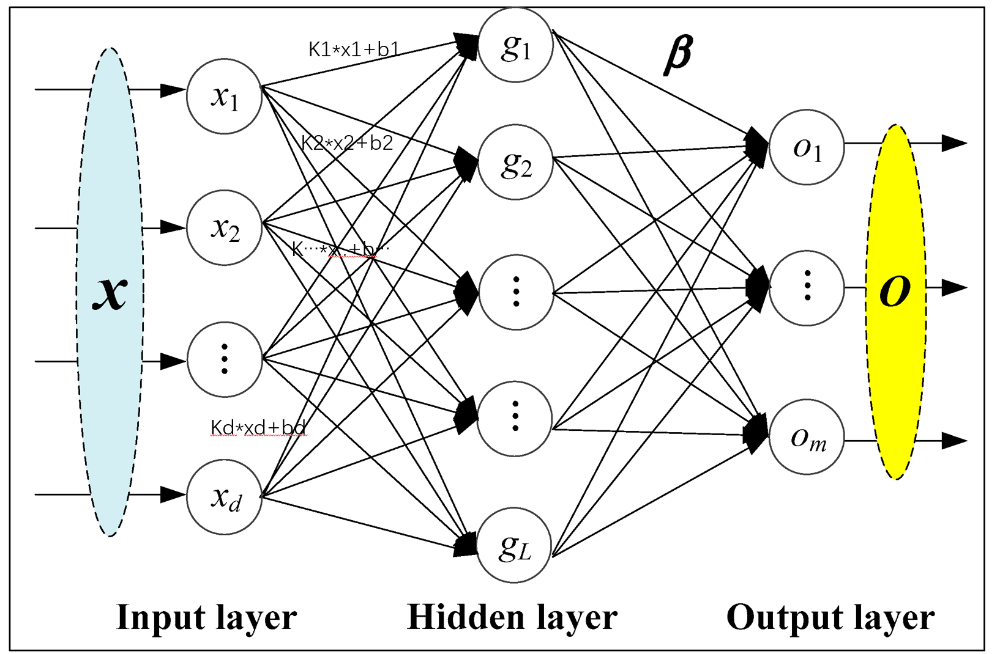


```python
import torch
import torchvision
from torch import nn
from torch.nn import Linear
from torch.utils.data import DataLoader

dataset = torchvision.datasets.CIFAR10("./download_dataset", train=False, transform=torchvision.transforms.ToTensor(),
                                       download=True)

dataloader = DataLoader(dataset, batch_size=64)

class Jimi(nn.Module):
    def __init__(self):
        super(Jimi, self).__init__()
        self.linear1 = Linear(196608, 10)           #线性层，输入196608，输出10

    def forward(self, input):
        output = self.linear1(input)
        return output

jimi = Jimi()

for data in dataloader:
    imgs, targets = data
    print(imgs.shape)                   #64, 3, 32, 32
    output = torch.flatten(imgs)        #把输入展成一行
    print(output.shape)                 #196608(4个数相乘的结果)
    output = jimi(output)
    print(output.shape)


```


# 11.神经网络-Sequential小实战

## CIFAR 10 model

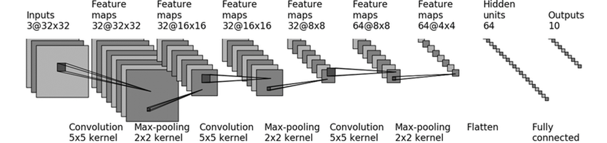


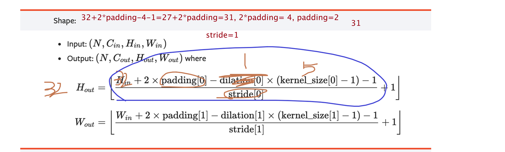


## 代码

```latex
import torch
from torch import nn
from torch.nn import Conv2d, MaxPool2d, Flatten, Linear, Sequential
from torch.utils.tensorboard import SummaryWriter


class Jimi(nn.Module):
    #要确保自己写的网络是正确的（参数不对的话是不会直接报错的）
    def __init__(self):
        super(Jimi,self).__init__()


        # self.conv1 = Conv2d(3,32,5,padding=2)
        # self.maxpool1 = MaxPool2d(2)
        # self.conv2 = Conv2d(32,32,5,padding=2)
        # self.maxpool2 = MaxPool2d(2)
        # self.conv3 = Conv2d(32,64,5,padding=2)
        # self.maxpool3 = MaxPool2d(2)
        # self.flatten = Flatten()
        # self.linear1 = Linear(1024,64)
        # self.linear2 = Linear(64,10)


        self.model1 = Sequential(               # 依次执行以下步骤
            Conv2d(3,32,5,padding=2),
            MaxPool2d(2),
            Conv2d(32, 32, 5, padding=2),
            MaxPool2d(2),
            Conv2d(32, 64, 5, padding=2),
            MaxPool2d(2),
            Flatten(),
            Linear(1024, 64),
            Linear(64, 10)
        )

    def forward(self,x):
        # x = self.conv1(x)
        # x = self.maxpool1(x)
        # x = self.conv2(x)
        # x = self.maxpool2(x)
        # x = self.conv3(x)
        # x = self.maxpool3(x)
        # x = self.flatten(x)
        # x = self.linear1(x)
        # x = self.linear2(x)

        x = self.model1(x)          #适配sequential
        return x


jimi = Jimi()
print(jimi)


input = torch.ones((64,3,32,32))
output = jimi(input)
print(output.shape)

writer = SummaryWriter(log_dir="logs/nn_seq")
writer.add_graph(jimi,input)
writer.close()
```


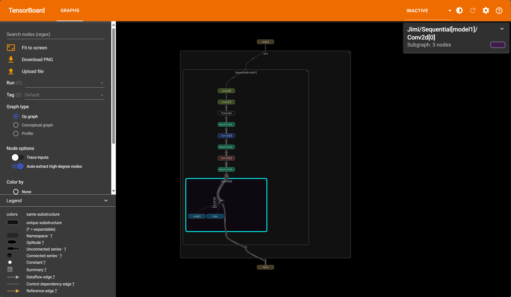

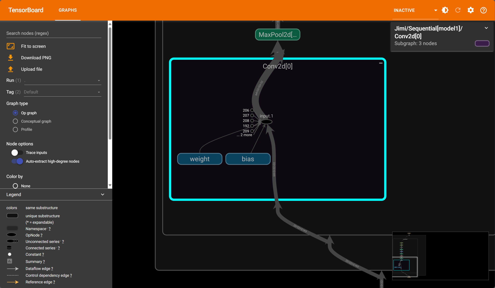


# 12.神经网络-损失函数与反向传播


## 损失函数


损失函数是用来**衡量模型预测结果与真实结果之间差距的函数**。它给出一个标量值，表示模型当前的预测有多差，损失值越小，模型预测越准确。

在训练过程中，我们的目标就是**最小化损失函数**，通过不断调整模型参数，使模型预测结果越来越接近真实标签。


**反向传播**是用于计算损失函数对神经网络中每个参数的梯度的算法。


```python
import torch
from torch import nn
from torch.nn import L1Loss

inputs = torch.tensor([1,2,3],dtype=torch.float32)
targets = torch.tensor([1,2,5],dtype=torch.float32)
inputs = torch.reshape(inputs,(1,1,1,3))
targets = torch.reshape(targets,(1,1,1,3))

loss = L1Loss(reduction='sum')			# |1-1| + |2-2| + |3-5| = 0 + 0 + 2 = 2
result = loss(inputs,targets)

loss_mse = nn.MSELoss()					# ((1-1)^2 + (2-2)^2 + (3-5)^2) / 3 = (0 + 0 + 4) / 3 = 1.333...
result_mse = loss_mse(inputs,targets)

print(result)           # tensor(2.)			
print(result_mse)       # tensor(1.3333)


x = torch.tensor([0.1,0.2,0.3])
y = torch.tensor([1])
x = torch.reshape(x,(1,3))
loss_cross = nn.CrossEntropyLoss()
result_cross = loss_cross(x,y)
print(result_cross)         # tensor(1.1019)

# 计算公式：对应下图
# result_cross = -x[1] + log(exp(x[0]) + exp(x[1]) + exp(x[2]))
#      		   = -0.2 + log(exp(0.1) + exp(0.2) + exp(0.3))
#     		   = -0.2 + log(1.1052 + 1.2214 + 1.3499)
#    		   = -0.2 + log(3.6765)
#    		   ≈ -0.2 + 1.3019 ≈ 1.1019


```

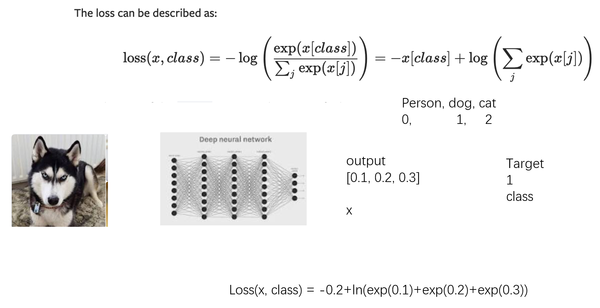


```python
import torch
import torchvision
from torch import nn
from torch.nn import Sequential, Conv2d, MaxPool2d, Flatten, Linear
from torch.utils.data import DataLoader

dataset = torchvision.datasets.CIFAR10("./download_dataset",train=False,download=True,transform=torchvision.transforms.ToTensor())
dataloader = DataLoader(dataset,batch_size=64)

class Jimi(nn.Module):
    #要确保自己写的网络是正确的（参数不对的话是不会直接报错的）
    def __init__(self):
        super(Jimi,self).__init__()
        self.model1 = Sequential(  # 依次执行以下步骤
            Conv2d(3, 32, 5, padding=2),
            MaxPool2d(2),
            Conv2d(32, 32, 5, padding=2),
            MaxPool2d(2),
            Conv2d(32, 64, 5, padding=2),
            MaxPool2d(2),
            Flatten(),
            Linear(1024, 64),
            Linear(64, 10)
        )

    def forward(self,x):
        x = self.model1(x)  # 适配sequential
        return x

loss = nn.CrossEntropyLoss()

jimi = Jimi()
for data in dataloader:
    imgs,targets = data
    outputs = jimi(imgs)
    print(targets)
    print(outputs)
    result_loss = loss(outputs,targets)
    print(result_loss)
# 反向传播,下断点之后可以查看全部的参数变量
# backward可以查看每个节点的grad参数，有了grad参数可以选择合适的优化器，降低loss！
    result_loss.backward()            
```

# 13.神经网络-优化器（训练）

[https://docs.pytorch.org/docs/stable/optim.html](https://docs.pytorch.org/docs/stable/optim.html)


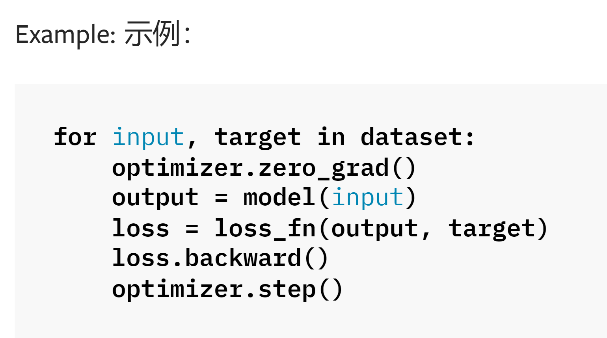


```python
import torch.optim
import torchvision
from torch import nn
from torch.nn import Sequential, Conv2d, MaxPool2d, Flatten, Linear
from torch.utils.data import DataLoader

dataset = torchvision.datasets.CIFAR10("./download_dataset",train=False,download=True,transform=torchvision.transforms.ToTensor())
dataloader = DataLoader(dataset,batch_size=64)

class Jimi(nn.Module):
    #要确保自己写的网络是正确的（参数不对的话是不会直接报错的）
    def __init__(self):
        super(Jimi,self).__init__()
        self.model1 = Sequential(  # 依次执行以下步骤
            Conv2d(3, 32, 5, padding=2),
            MaxPool2d(2),
            Conv2d(32, 32, 5, padding=2),
            MaxPool2d(2),
            Conv2d(32, 64, 5, padding=2),
            MaxPool2d(2),
            Flatten(),
            Linear(1024, 64),
            Linear(64, 10)
        )

    def forward(self,x):
        x = self.model1(x)  # 适配sequential
        return x

loss = nn.CrossEntropyLoss()

jimi = Jimi()
optim = torch.optim.SGD(jimi.parameters(),lr=0.01)     # 定义优化器

for epoch in range(20):         #每一轮 epoch 内都会对所有训练样本进行一次前向传播 + 反向传播
    running_loss = 0.0			#每一轮epoch都需要重新计算损失
    for data in dataloader:
        imgs,targets = data
        outputs = jimi(imgs)
        #print(targets)
        #print(outputs)
        result_loss = loss(outputs,targets)
        optim.zero_grad()               #优化器进行梯度清零
        result_loss.backward()          #损失函数的反向传播，求出每一个节点的梯度
        optim.step()                    #对模型的每一个参数进行调优
        running_loss = running_loss + result_loss		#输出当前epoch中所有batch的总损失之和
    print(running_loss)
```


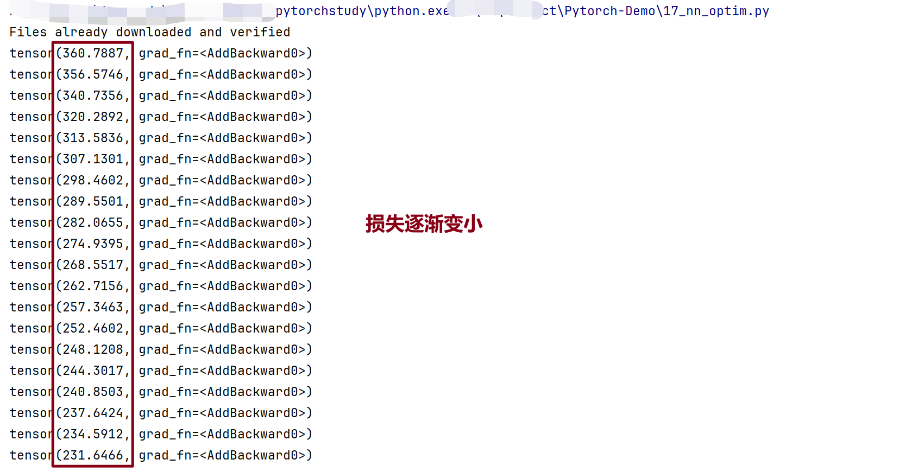


# 14.现有模型的使用和修改


模型：VGG-16


```python
import torchvision                         # 导入 torchvision 库，包含常用的计算机视觉工具、模型和数据集
from torch import nn                      # 从 PyTorch 中导入神经网络模块

# 加载 VGG16 模型，不加载预训练参数（用于自定义训练）
vgg16_false = torchvision.models.vgg16(pretrained=False)

# 加载 VGG16 模型，并加载 ImageNet 上预训练的参数（用于迁移学习）
vgg16_true = torchvision.models.vgg16(pretrained=True)

# 打印 vgg16_true 模型结构，包含 features 和 classifier 两部分
print(vgg16_true)

# 下载 CIFAR-10 训练数据集，并将图片转换为 Tensor 格式（归一化至 [0,1]）
train_data = torchvision.datasets.CIFAR10(
    './download_dataset',                             # 数据保存路径
    train=True,                                       # 下载训练集
    transform=torchvision.transforms.ToTensor(),      # 图像转换为 Tensor
    download=True                                     # 如果数据不存在则下载
)

# 在 vgg16_true 的 classifier 最后添加一层 Linear 层（从1000维输出映射到10类）
# 注意：这样做等于在原输出层后“追加”一层，而不是替换
vgg16_true.classifier.add_module('add_linear', nn.Linear(1000, 10))

# 打印修改后的 vgg16_true 模型结构
print(vgg16_true)

# 打印未加载预训练权重的 vgg16_false 模型结构
print(vgg16_false)

# 替换 vgg16_false 中 classifier 的第 6 层（即最后一层），将输出从 1000 改为 10 类
vgg16_false.classifier[6] = nn.Linear(4096, 10)

# 打印修改后的 vgg16_false 模型结构
print(vgg16_false)

```


# 15.模型的保存与读取


## 方法一：

#### 模型的保存：

不安全

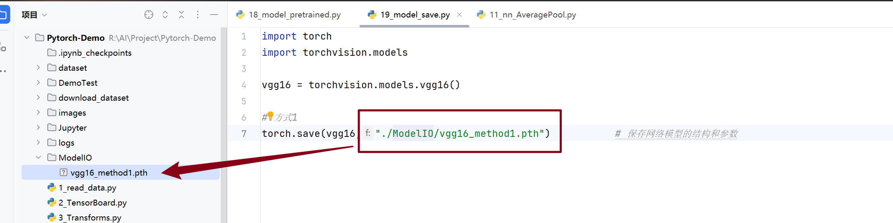


#### 模型的读取：

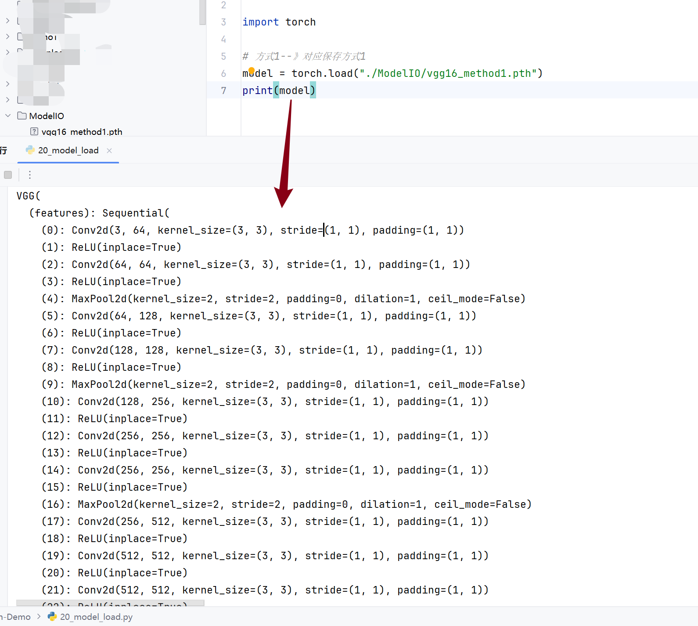


## 方法二：

#### 保存：

官方推荐：状态 _ 字典

保存成字典形式，占用空间小

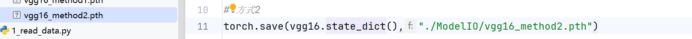


#### 读取：

直接读取的话是字典形式

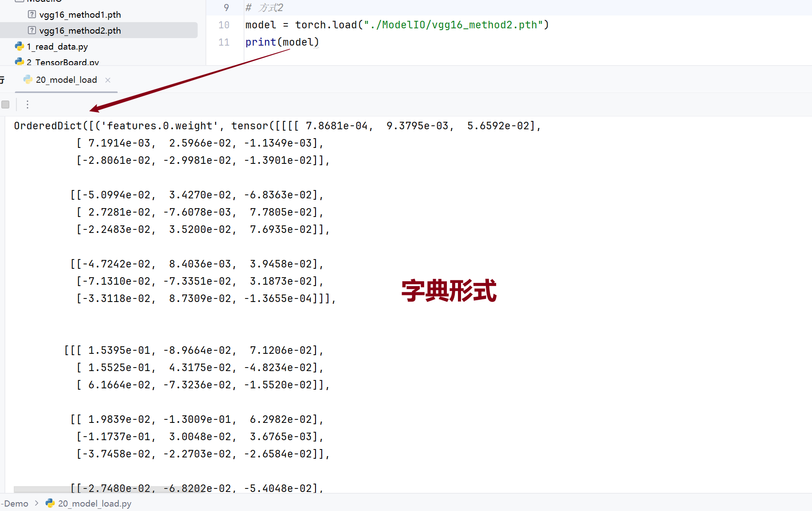

需要转换一下

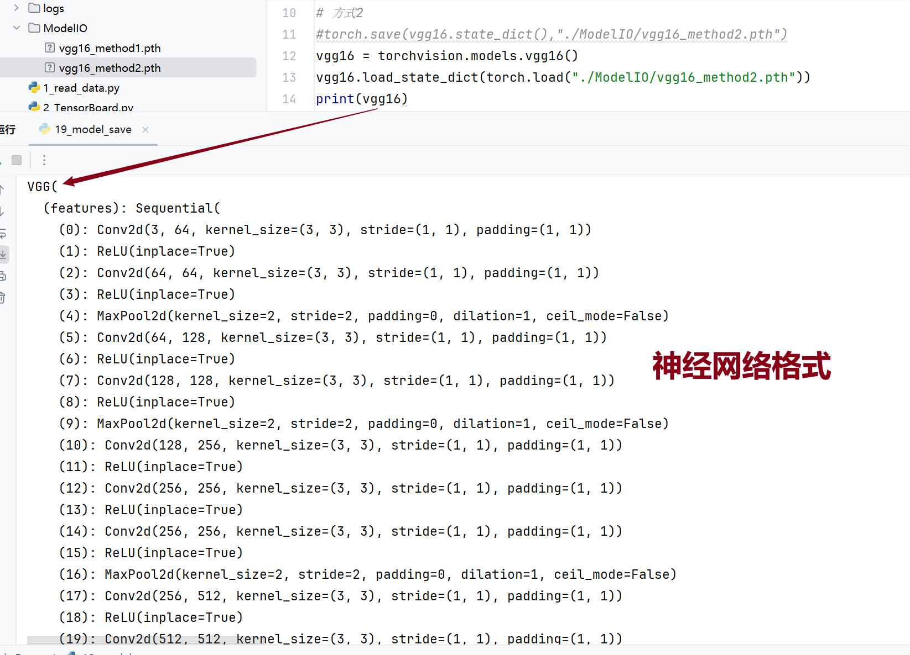


# 16.完整的模型训练流程


数据集：CLFAR10


```python
import torch
from torch import nn


class Jimi(nn.Module):
    def __init__(self):
        super(Jimi, self).__init__()
        self.model = nn.Sequential(
            nn.Conv2d(3, 32, 5, stride=1, padding=2),
            nn.MaxPool2d(2),
            nn.Conv2d(32, 32, 5, 1, 2),
            nn.MaxPool2d(2),
            nn.Conv2d(32, 64, 5, 1, 2),
            nn.MaxPool2d(2),
            nn.Flatten(),
            nn.Linear(64 * 4 * 4, 64),
            nn.Linear(64, 10)
        )

    def forward(self, x):
        x = self.model(x)
        return x


# 验证网络的正确性
if __name__ == '__main__':
    jimi = Jimi()
    input = torch.ones((64, 3, 32, 32))  # 64张彩色图片，每张图的大小是 32×32 像素，而且是 RGB三通道的。
    output = jimi(input)
    print(output.shape)             # torch.Size([64, 10])

```


```python
import torchvision
import torch
from torch import nn
from torch.utils.data import DataLoader
from torch.utils.tensorboard import SummaryWriter

from modelCode import *
import os
import time

def main():
    device = torch.device("cuda" if torch.cuda.is_available() else "cpu")

    # 准备数据集
    train_data = torchvision.datasets.CIFAR10(root="./download_dataset", train=True, download=True, transform=torchvision.transforms.ToTensor())
    test_data = torchvision.datasets.CIFAR10(root="./download_dataset", train=False, download=True, transform=torchvision.transforms.ToTensor())

    # 长度
    train_data_size = len(train_data)
    test_data_size = len(test_data)
    # 如果train_data_size=10，训练数据集的长度为：10
    print("训练数据集的长度为：{}".format(train_data_size))
    print("测试数据集的长度为：{}".format(test_data_size))

    # 利用dataloader来加载数据集
    num_workers = min(4, os.cpu_count())
    train_dataloader = DataLoader(train_data, 256, shuffle=True, num_workers=num_workers, pin_memory=True)
    test_dataloader = DataLoader(test_data, 64,pin_memory=True)

    # 搭建神经网络
    # modelCode

    # 创建网络模型
    jimi = Jimi().to(device)

    # 损失函数
    loss_fn = nn.CrossEntropyLoss()

    # 优化器
    # learning_rate = 0.01
    learning_rate = 1e-2            # 1 × 10^(-2) = 0.01
    optimizer = torch.optim.SGD(jimi.parameters(),lr=learning_rate)

    # 设置训练网络的一些参数
    # 记录训练的次数
    total_train_step = 0
    # 记录测试的次数
    total_test_step = 0
    # 训练的轮数
    epoch = 10

    # tensorboard
    writer = SummaryWriter("./logs/train_data")

    for i in range(epoch):
        print("-------------------第{}轮训练开始----------------------------".format(i+1))

        # 开始训练
        for data in train_dataloader:
            imgs, targets = data
            imgs = imgs.to(device)
            targets = targets.to(device)

            output = jimi(imgs)

            # 损失计算
            loss = loss_fn(output, targets)

            # 优化器优化模型
            optimizer.zero_grad()       # 对优化器进行梯度清零
            loss.backward()             # 损失函数反向传播，求出每一个节点的梯度
            optimizer.step()            # 对模型的每一个参数进行调优

            total_train_step += 1
            if total_train_step % 100 == 0:
                print("训练次数：{}，Loss：{}".format(total_train_step, loss.item()))
                writer.add_scalar("train_loss", loss.item(), total_train_step)

        # 测试步骤开始
        jimi.eval()
        total_test_loss = 0
        total_accuracy = 0
        with torch.no_grad():
            for data in test_dataloader:
                imgs, targets = data
                imgs = imgs.to(device)  # 将图像移动到设备
                targets = targets.to(device)  # 将标签移动到设备
                outputs = jimi(imgs)
                loss = loss_fn(outputs, targets)
                total_test_loss += loss.item()
                accuracy = (outputs.argmax(1) == targets).sum()
                total_accuracy += accuracy.item()  # 修复：使用 .item() 转换为标量


        print("整体测试集上的Loss: {}".format(total_test_loss))
        print("整体测试集上的正确率: {}".format(total_accuracy / test_data_size))
        writer.add_scalar("test_loss", total_test_loss, total_test_step)
        writer.add_scalar("test_accuracy", total_accuracy / test_data_size, total_test_step)
        total_test_step = total_test_step + 1

        torch.save(jimi, "jimi_{}.pth".format(i))
        print("模型已保存")

    writer.close()


if __name__ == '__main__':
    main()


```


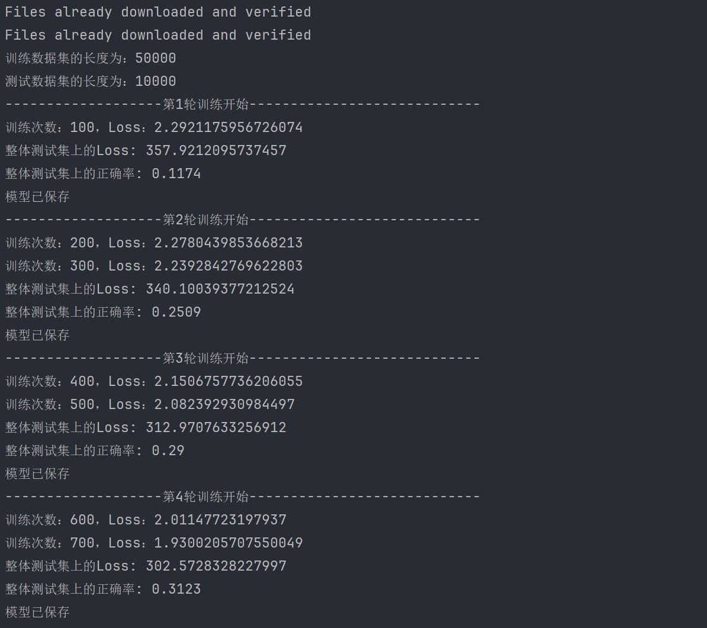


