## 信息搜集
**要尽可能详细，把能搜集到的全汇总好。**

### nmap
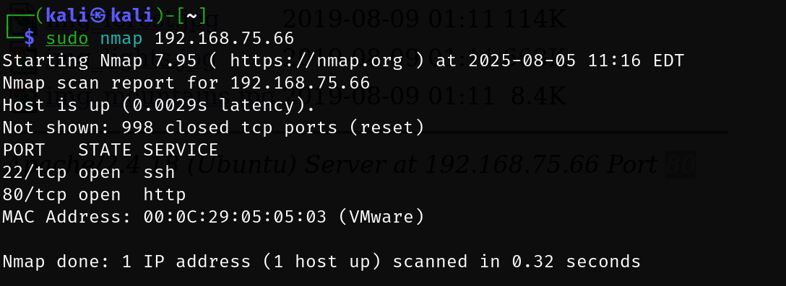

```bash
                                                                                                                                              
┌──(kali㉿kali)-[~/BaJi/broken]
└─$ sudo nmap --script=vuln -p22,80 192.168.75.66
Starting Nmap 7.95 ( https://nmap.org ) at 2025-08-05 11:39 EDT
Nmap scan report for 192.168.75.66
Host is up (0.00049s latency).

PORT   STATE SERVICE
22/tcp open  ssh
80/tcp open  http
| http-sql-injection: 
|   Possible sqli for queries:
|     http://192.168.75.66:80/?C=D%3BO%3DA%27%20OR%20sqlspider
|     http://192.168.75.66:80/?C=N%3BO%3DD%27%20OR%20sqlspider
|     http://192.168.75.66:80/?C=M%3BO%3DA%27%20OR%20sqlspider
|     http://192.168.75.66:80/?C=S%3BO%3DA%27%20OR%20sqlspider
|     http://192.168.75.66:80/?C=N%3BO%3DA%27%20OR%20sqlspider
|     http://192.168.75.66:80/?C=D%3BO%3DD%27%20OR%20sqlspider
|     http://192.168.75.66:80/?C=S%3BO%3DA%27%20OR%20sqlspider
|     http://192.168.75.66:80/?C=M%3BO%3DA%27%20OR%20sqlspider
|     http://192.168.75.66:80/?C=N%3BO%3DA%27%20OR%20sqlspider
|     http://192.168.75.66:80/?C=D%3BO%3DA%27%20OR%20sqlspider
|     http://192.168.75.66:80/?C=S%3BO%3DA%27%20OR%20sqlspider
|     http://192.168.75.66:80/?C=M%3BO%3DA%27%20OR%20sqlspider
|     http://192.168.75.66:80/?C=N%3BO%3DA%27%20OR%20sqlspider
|     http://192.168.75.66:80/?C=D%3BO%3DA%27%20OR%20sqlspider
|     http://192.168.75.66:80/?C=S%3BO%3DA%27%20OR%20sqlspider
|     http://192.168.75.66:80/?C=M%3BO%3DD%27%20OR%20sqlspider
|     http://192.168.75.66:80/?C=N%3BO%3DA%27%20OR%20sqlspider
|     http://192.168.75.66:80/?C=D%3BO%3DA%27%20OR%20sqlspider
|     http://192.168.75.66:80/?C=S%3BO%3DD%27%20OR%20sqlspider
|     http://192.168.75.66:80/?C=M%3BO%3DA%27%20OR%20sqlspider
|     http://192.168.75.66:80/?C=D%3BO%3DA%27%20OR%20sqlspider
|     http://192.168.75.66:80/?C=N%3BO%3DD%27%20OR%20sqlspider
|     http://192.168.75.66:80/?C=M%3BO%3DA%27%20OR%20sqlspider
|     http://192.168.75.66:80/?C=S%3BO%3DA%27%20OR%20sqlspider
|     http://192.168.75.66:80/?C=N%3BO%3DA%27%20OR%20sqlspider
|     http://192.168.75.66:80/?C=D%3BO%3DA%27%20OR%20sqlspider
|     http://192.168.75.66:80/?C=S%3BO%3DA%27%20OR%20sqlspider
|     http://192.168.75.66:80/?C=M%3BO%3DA%27%20OR%20sqlspider
|     http://192.168.75.66:80/?C=N%3BO%3DA%27%20OR%20sqlspider
|     http://192.168.75.66:80/?C=D%3BO%3DA%27%20OR%20sqlspider
|     http://192.168.75.66:80/?C=S%3BO%3DA%27%20OR%20sqlspider
|     http://192.168.75.66:80/?C=M%3BO%3DA%27%20OR%20sqlspider
|     http://192.168.75.66:80/?C=N%3BO%3DA%27%20OR%20sqlspider
|     http://192.168.75.66:80/?C=D%3BO%3DA%27%20OR%20sqlspider
|     http://192.168.75.66:80/?C=S%3BO%3DA%27%20OR%20sqlspider
|_    http://192.168.75.66:80/?C=M%3BO%3DA%27%20OR%20sqlspider
|_http-dombased-xss: Couldn't find any DOM based XSS.
|_http-csrf: Couldn't find any CSRF vulnerabilities.
| http-enum: 
|_  /: Root directory w/ listing on 'apache/2.4.18 (ubuntu)'
| http-slowloris-check: 
|   VULNERABLE:
|   Slowloris DOS attack
|     State: LIKELY VULNERABLE
|     IDs:  CVE:CVE-2007-6750
|       Slowloris tries to keep many connections to the target web server open and hold
|       them open as long as possible.  It accomplishes this by opening connections to
|       the target web server and sending a partial request. By doing so, it starves
|       the http server's resources causing Denial Of Service.
|       
|     Disclosure date: 2009-09-17
|     References:
|       https://cve.mitre.org/cgi-bin/cvename.cgi?name=CVE-2007-6750
|_      http://ha.ckers.org/slowloris/
|_http-stored-xss: Couldn't find any stored XSS vulnerabilities.
MAC Address: 00:0C:29:05:05:03 (VMware)

Nmap done: 1 IP address (1 host up) scanned in 320.98 seconds

```


### 80 端口
开放 80 端口，进去看看有啥

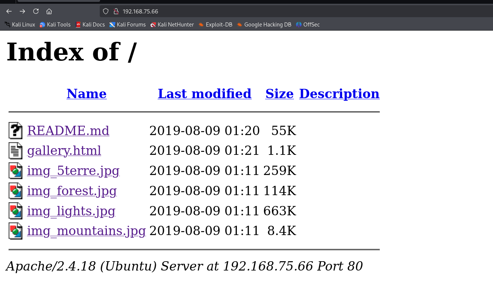


一个 readme，一个 html，几张图片

**wget** 把这些东西下载到本地看看


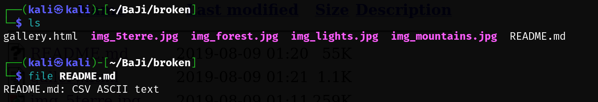


#### 目录扫描
##### dirb
```bash
                                                                                                                                            
┌──(kali㉿kali)-[~/BaJi/broken]
└─$ sudo dirb http://192.168.75.66/                            
[sudo] password for kali: 

-----------------
DIRB v2.22    
By The Dark Raver
-----------------

START_TIME: Tue Aug  5 11:49:44 2025
URL_BASE: http://192.168.75.66/
WORDLIST_FILES: /usr/share/dirb/wordlists/common.txt

-----------------

GENERATED WORDS: 4612                                                          

---- Scanning URL: http://192.168.75.66/ ----
                                                                               
(!) FATAL: Too many errors connecting to host
    (Possible cause: COULDNT CONNECT)
                                                                               
-----------------
END_TIME: Tue Aug  5 11:49:44 2025
DOWNLOADED: 0 - FOUND: 0

```

##### gobuster
```bash
┌──(kali㉿kali)-[~]
└─$ sudo gobuster  dir -u http://192.168.75.66 -w /usr/share/dirbuster/wordlists/directory-list-2.3-medium.txt
[sudo] password for kali: 
===============================================================
Gobuster v3.6
by OJ Reeves (@TheColonial) & Christian Mehlmauer (@firefart)
===============================================================
[+] Url:                     http://192.168.75.66
[+] Method:                  GET
[+] Threads:                 10
[+] Wordlist:                /usr/share/dirbuster/wordlists/directory-list-2.3-medium.txt
[+] Negative Status codes:   404
[+] User Agent:              gobuster/3.6
[+] Timeout:                 10s
===============================================================
Starting gobuster in directory enumeration mode
===============================================================
/server-status        (Status: 403) [Size: 301]
Progress: 220560 / 220561 (100.00%)
===============================================================                                                                                                     
Finished                                                                                                                                                            
===============================================================
                       
```

gobuster 进阶---指定后缀

```bash

```


#### exiftool 查看图片信息
检查是否有隐写

```bash
                                                                                                                                                       
┌──(kali㉿kali)-[~/BaJi/broken]
└─$ exiftool *.jpg
======== img_5terre.jpg
ExifTool Version Number         : 13.10
File Name                       : img_5terre.jpg
Directory                       : .
File Size                       : 265 kB
File Modification Date/Time     : 2019:08:09 04:11:02-04:00
File Access Date/Time           : 2025:08:05 11:33:42-04:00
File Inode Change Date/Time     : 2025:08:05 11:33:42-04:00
File Permissions                : -rw-rw-r--
File Type                       : JPEG
File Type Extension             : jpg
MIME Type                       : image/jpeg
JFIF Version                    : 1.01
Resolution Unit                 : inches
X Resolution                    : 72
Y Resolution                    : 72
Image Width                     : 1200
Image Height                    : 900
Encoding Process                : Progressive DCT, Huffman coding
Bits Per Sample                 : 8
Color Components                : 3
Y Cb Cr Sub Sampling            : YCbCr4:2:2 (2 1)
Image Size                      : 1200x900
Megapixels                      : 1.1
======== img_forest.jpg
ExifTool Version Number         : 13.10
File Name                       : img_forest.jpg
Directory                       : .
File Size                       : 117 kB
File Modification Date/Time     : 2019:08:09 04:11:02-04:00
File Access Date/Time           : 2025:08:05 11:33:54-04:00
File Inode Change Date/Time     : 2025:08:05 11:33:54-04:00
File Permissions                : -rw-rw-r--
File Type                       : JPEG
File Type Extension             : jpg
MIME Type                       : image/jpeg
JFIF Version                    : 1.01
Resolution Unit                 : inches
X Resolution                    : 96
Y Resolution                    : 96
Image Width                     : 750
Image Height                    : 425
Encoding Process                : Progressive DCT, Huffman coding
Bits Per Sample                 : 8
Color Components                : 3
Y Cb Cr Sub Sampling            : YCbCr4:2:0 (2 2)
Image Size                      : 750x425
Megapixels                      : 0.319
======== img_lights.jpg
ExifTool Version Number         : 13.10
File Name                       : img_lights.jpg
Directory                       : .
File Size                       : 679 kB
File Modification Date/Time     : 2019:08:09 04:11:02-04:00
File Access Date/Time           : 2025:08:05 11:34:01-04:00
File Inode Change Date/Time     : 2025:08:05 11:34:01-04:00
File Permissions                : -rw-rw-r--
File Type                       : JPEG
File Type Extension             : jpg
MIME Type                       : image/jpeg
JFIF Version                    : 1.01
Resolution Unit                 : None
X Resolution                    : 1
Y Resolution                    : 1
Profile CMM Type                : Little CMS
Profile Version                 : 2.1.0
Profile Class                   : Display Device Profile
Color Space Data                : RGB
Profile Connection Space        : XYZ
Profile Date Time               : 2012:01:25 03:41:57
Profile File Signature          : acsp
Primary Platform                : Apple Computer Inc.
CMM Flags                       : Not Embedded, Independent
Device Manufacturer             : 
Device Model                    : 
Device Attributes               : Reflective, Glossy, Positive, Color
Rendering Intent                : Perceptual
Connection Space Illuminant     : 0.9642 1 0.82491
Profile Creator                 : Little CMS
Profile ID                      : 0
Profile Description             : c2
Profile Copyright               : FB
Media White Point               : 0.9642 1 0.82491
Media Black Point               : 0.01205 0.0125 0.01031
Red Matrix Column               : 0.43607 0.22249 0.01392
Green Matrix Column             : 0.38515 0.71687 0.09708
Blue Matrix Column              : 0.14307 0.06061 0.7141
Red Tone Reproduction Curve     : (Binary data 64 bytes, use -b option to extract)
Green Tone Reproduction Curve   : (Binary data 64 bytes, use -b option to extract)
Blue Tone Reproduction Curve    : (Binary data 64 bytes, use -b option to extract)
Image Width                     : 2988
Image Height                    : 1680
Encoding Process                : Baseline DCT, Huffman coding
Bits Per Sample                 : 8
Color Components                : 3
Y Cb Cr Sub Sampling            : YCbCr4:2:0 (2 2)
Image Size                      : 2988x1680
Megapixels                      : 5.0
======== img_mountains.jpg
ExifTool Version Number         : 13.10
File Name                       : img_mountains.jpg
Directory                       : .
File Size                       : 8.6 kB
File Modification Date/Time     : 2019:08:09 04:11:02-04:00
File Access Date/Time           : 2025:08:05 11:34:18-04:00
File Inode Change Date/Time     : 2025:08:05 11:34:18-04:00
File Permissions                : -rw-rw-r--
File Type                       : JPEG
File Type Extension             : jpg
MIME Type                       : image/jpeg
JFIF Version                    : 1.01
Resolution Unit                 : None
X Resolution                    : 1
Y Resolution                    : 1
Image Width                     : 314
Image Height                    : 160
Encoding Process                : Baseline DCT, Huffman coding
Bits Per Sample                 : 8
Color Components                : 3
Y Cb Cr Sub Sampling            : YCbCr4:2:0 (2 2)
Image Size                      : 314x160
Megapixels                      : 0.050
    4 image files read

```


#### xxd 查看 README.md
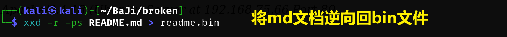

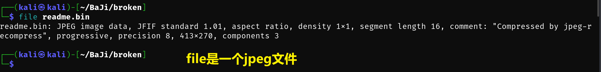

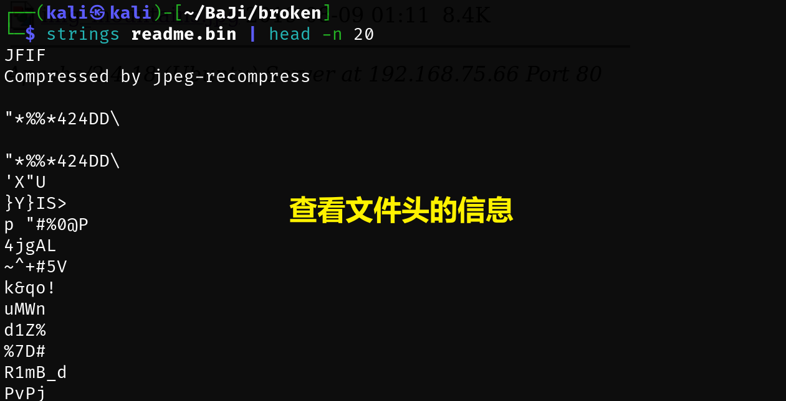

xdg-open 是一个非常实用的 Linux 命令，用于从终端快速打开文件、目录或网址。它根据文件类型自动调用系统默认的应用程序，等效于鼠标双击操作。


可以看到打开的图片。


感觉题目作者在强调 BROKEN，是在提示爆破？ 若 80 端口没进展，那么只能去 22 端口


### 22 端口
根据之前信息搜集的东西写一个小字典，若小字典不行就换大字典。

```bash
Bob
BROKEN
admin
root
terre
forest
lights
mountains
README
gallery
```


#### crackmapexec 域渗透工具
```bash
sudo crackmapexec ssh 192.168.75.66 -u wordlist -p wordlist --continue-on-success
```

失败

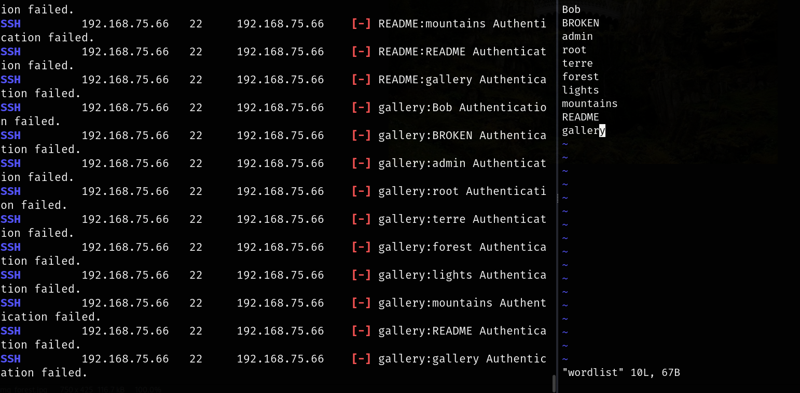

我没成功，但是红笔师傅成功了

他在字典中添加了 broken。所以还是字典罗列的不够完美。

### shell
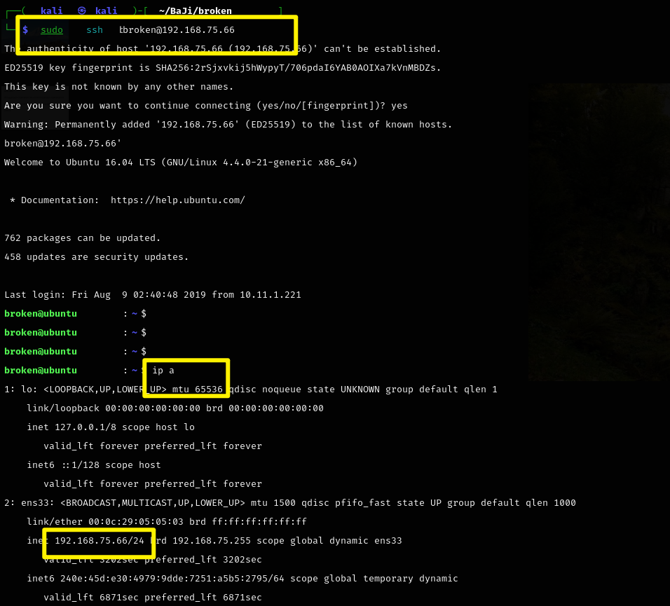


## 提权
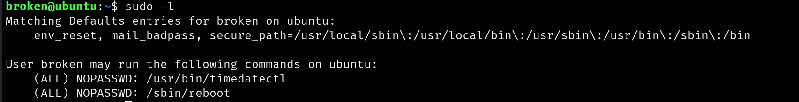


发现 timedatactl，提权命令：


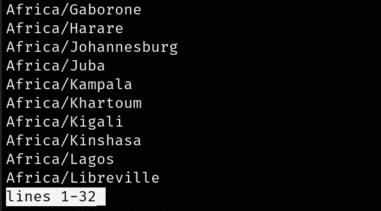

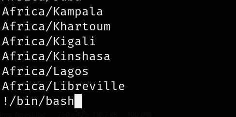

成功！

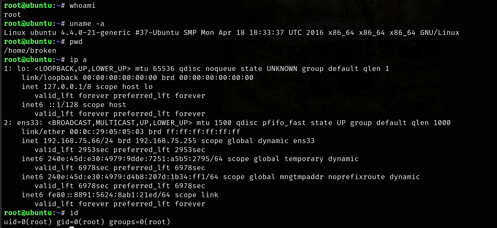


