## 1. 栈溢出漏洞
核心是攻击者要修改放到栈中的返回地址，因为 cpu 会跳转到这个地址去执行恶意代码

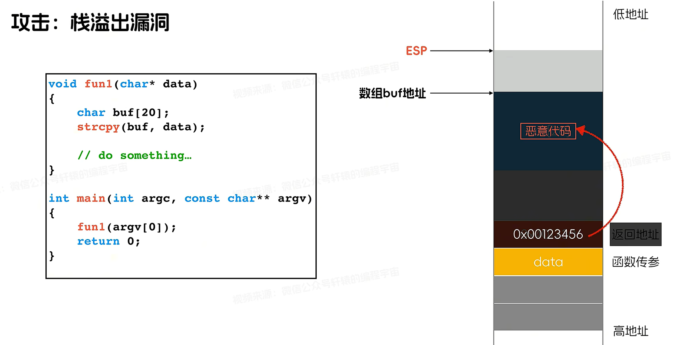

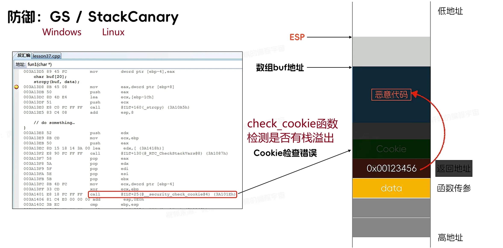

## 2.SEH 攻击

结构化异常处理机制：SEH

攻击原理：

1. windows 中通过 __try__except 构建异常处理逻辑，这些异常处理块都是存放在线程栈中，并且通过指针连成了一个链表，每一个块中都是异常处理器的地址
2. 当发生异常的时候，windows 自动从栈顶取出最近的异常处理块来解决异常，若不能处理则沿着链表调用下一个异常处理器，直到解决异常
3. 因为异常处理块是存放到栈中的，则可以通过越界访问，把恶意代码的地址替换这些异常处理块的地址
4. 当异常发生，执行恶意代码

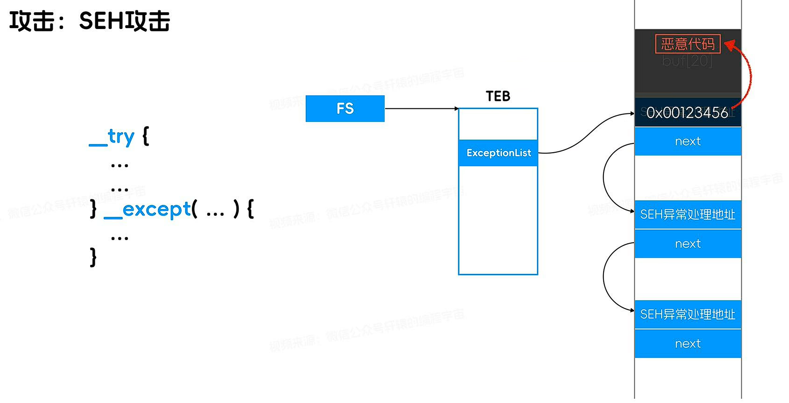

防御：SafeSEH

windows

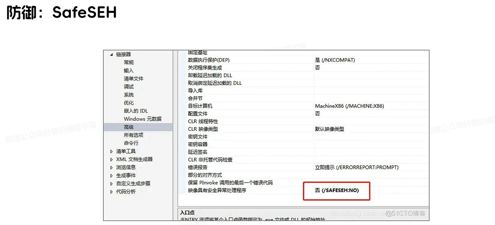

## 3.虚函数表攻击
c++虚函数机制，虚函数表中的虚函数指针。若能覆盖虚函数表在调用虚函数的指针，也可以劫持程序流程，执行攻击代码

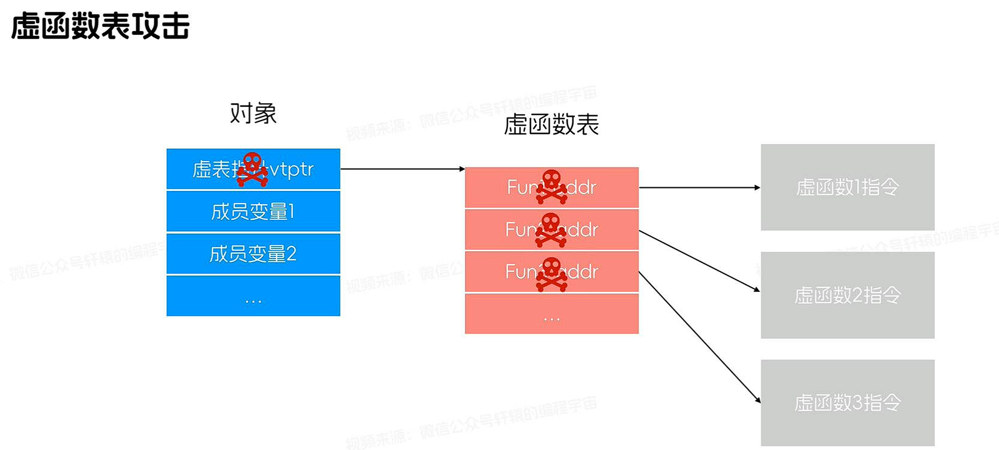

### ASLR
Address space layout randomization , 地址空间加载随机化

进程每次启动的时候，模块加载的地址以及栈的位置都是随机的。攻击者很难劫持程序执行流程准确地跳到恶意代码的地址

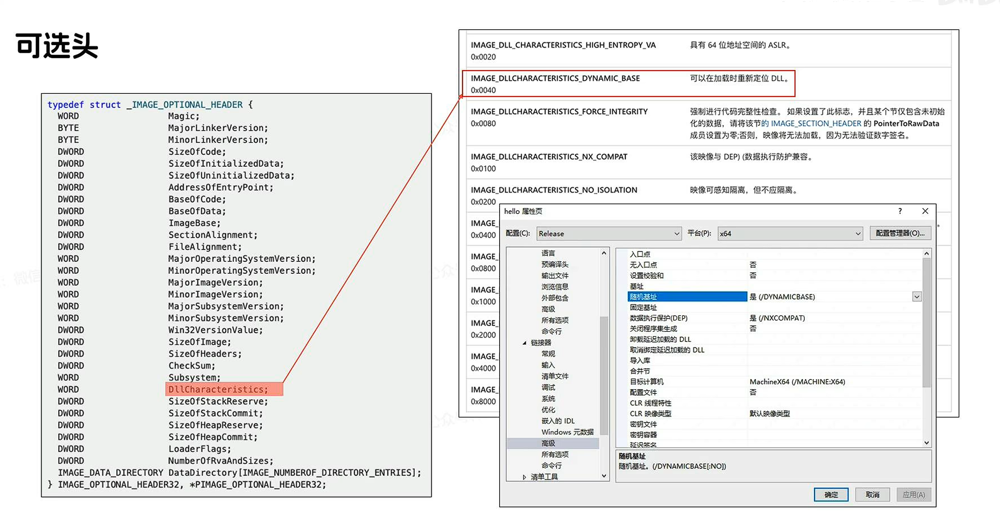

## 4. 堆喷射攻击 heap spray
开启 aslr 之后，攻击者无法精确的知道恶意代码的地址。

攻击原理：

1. 想办法的大量分配内存，把一些关键的地址占据（0x0A0A0A0A、0x0C0C0C0C、0x0D0D0D0D 等）
2. 在分配的大量内存中全部填充 nop 指令，在劫持流程的时候，只需要把劫持的地址填充为上述的关键地址，随后程序的流程被劫持到这些地址后，顺着 nop 指令，就能滑行到 shellcode。

因为要在堆里面分配大量内存，所以这种攻击模式叫：堆喷射

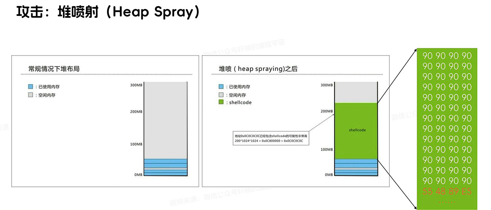

### DEP/NX
栈溢出、堆喷射，都是将 shellcode 放到堆栈中，然后劫持 EIP 去执行。

但本质上，堆栈是存放程序执行中数据的地方，而并非存放指令，那么就不需要赋予堆栈的执行权限。

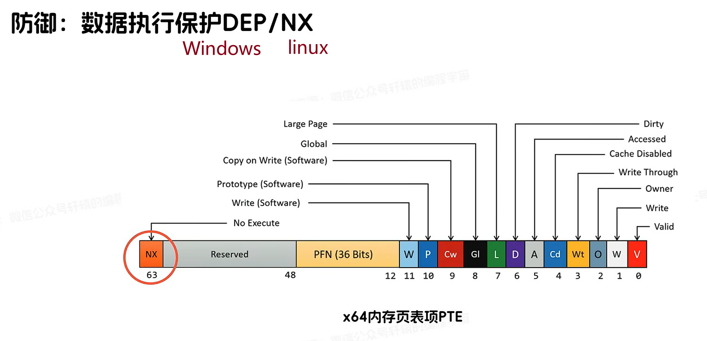

## 5.ROP 攻击：面向返回编程
 Return oriented programming

此攻击手法不需要用到堆栈，使用程序自身的指令来构建恶意代码。

攻击者在代码区中寻找可利用的指令碎片，每个指令碎片都带有一个返回地址，在程序执行的时候，借助于返回地址指令碎片可以连续执行，变成一个可执行的恶意代码。

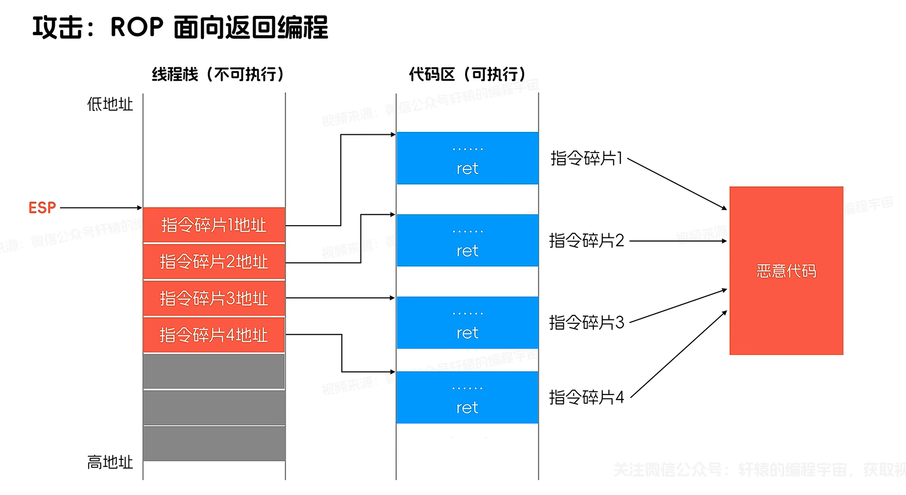

 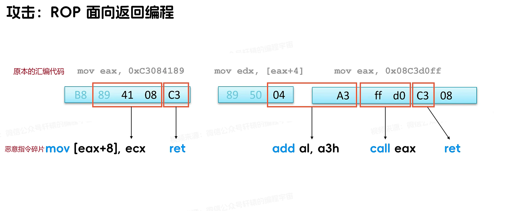

即使构造不成完整的 shellcode，ROP 也可以将 dep/nx 关闭、更改内存页面具有可执行权限

jop：jump oriented programming

cop：call oriented programming

#### 梳理上述攻击手段
1-5 攻击成功的条件都是劫持程序的执行流程，cpu 执行指令是按照顺序依次执行，以下指令会影响程序的执行流程。

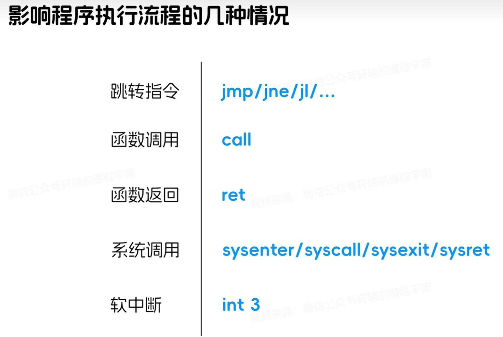

### 微软 控制流保护技术 CFG
control flow guard

编译器和操作系统共同作用，目的是防止不可信的间接调用

**防御原理：**

在编译生成 exe 的过程中开启 cfg，cfg 会将程序中所有的间接调用记录起来；当运行 exe 文件产生间接调用时，cfg 会检验间接调用的地址是否被改变，如果被改变则抛出异常。 

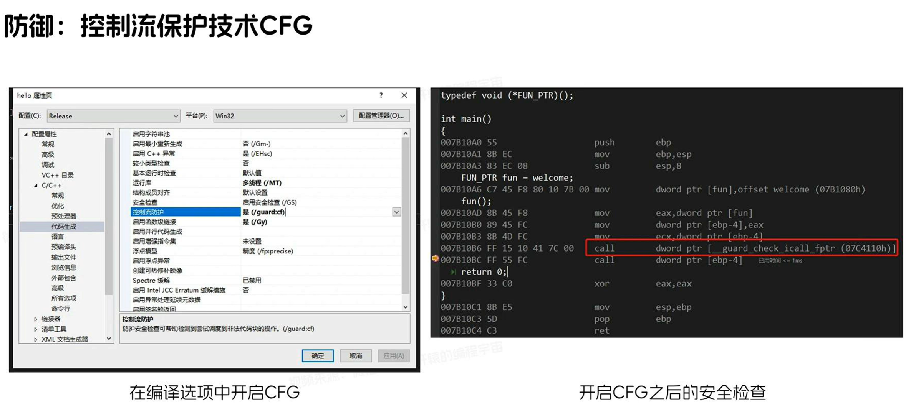

CFG 可以防御基于指针的间接函数调用，但对于 rop（面向返回编程的攻击技术，依赖 ret 指令完成执行流控制），并非依赖 call 指令，CFG 无法防护。

### 微软 返回流保护技术 RFG

原理如下图：

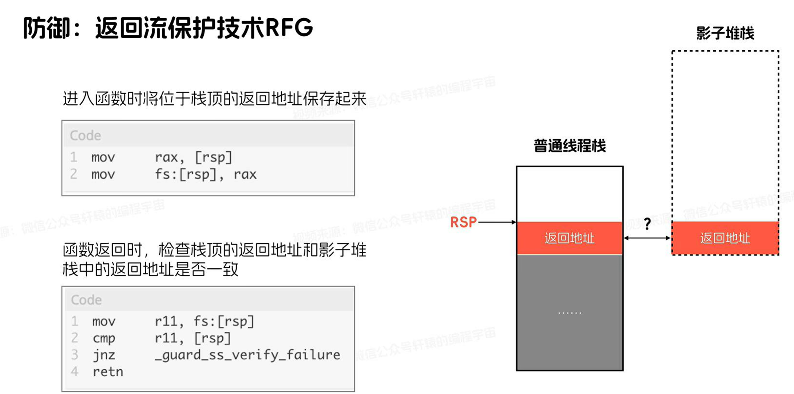

影子堆栈中存储函数在运行前的返回地址

### Intel CET 影子堆栈
用于防御 ROP

cpu 硬件内部设计了影子堆栈，当执行 call 指令的时候，同时在正常堆栈和影子堆栈中压入返回地址，然后执行 ret 返回指令的时候，检查两个堆栈中的返回地址是否一致，如果不一样则说明返回地址被篡改，马上抛出异常，程序终止。

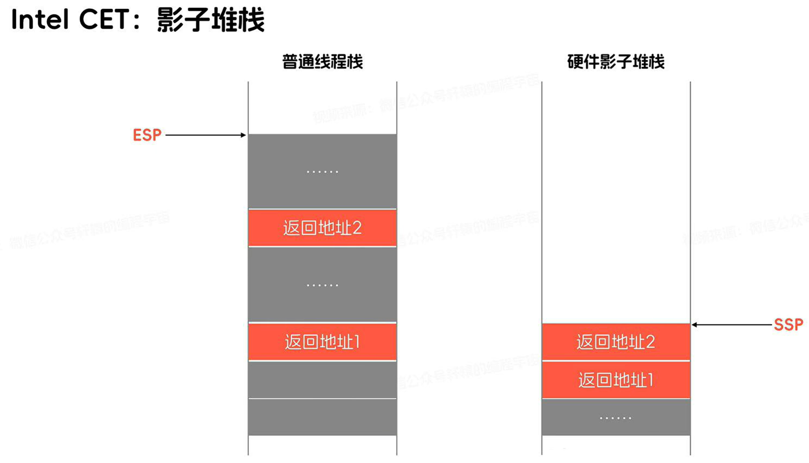

+ CET 可以有效防护 rop，但是对 cop、jop 无用

### Intel CET 间接分支跟踪（IBT）
Indirect Branch Tracking

需要编译器的配合。用于防御 COP、JOP

原理：

所有间接跳转/调用（jmp reg, call reg, jmp [mem], call [mem]）的目标地址，必须以一条 ENDBR 指令开头，否则 CPU 会抛异常。

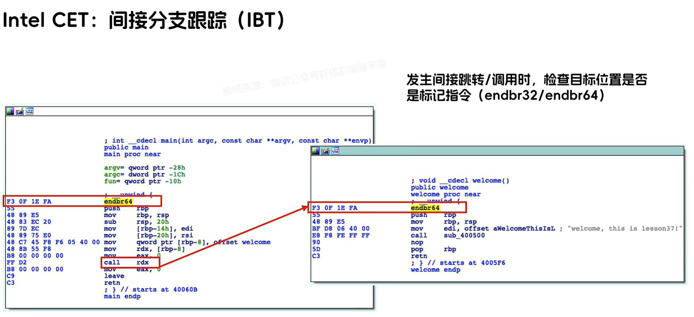

