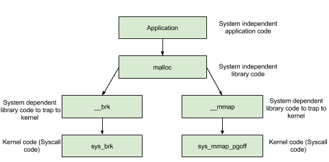

## 什么是堆
在程序运行过程中，堆可以提供动态分配的内存，允许程序申请大小未知的内存。堆其实就是程序虚拟地址空间的一块连续的线性区域，它由低地址向高地址方向增长。

堆的空间需要程序员手动分配（malloc）和释放（free）

堆内存的分配和回收比栈要复杂得多，由操作系统的内存管理器（在Linux中通常是Glibc的ptmalloc）来维护。


### 堆相关的数据结构


#### 1. 核心单位：malloc_chunk
堆内存被分割成一个个的块，这些块就是 chunk。每个 chunk（无论已分配还是空闲）的开头都有一个元数据头部，Glibc 中用 malloc_chunk 结构体来描述。这是堆中最重要的一个数据结构。


看代码中的注释：

```c
struct malloc_chunk {
    size_t      mchunk_prev_size;  //记录物理相邻的前一个 chunk 的大小（如果前一个为空的话）。
    size_t      mchunk_size;       //记录了当前 chunk 的大小（包括头部和用户数据区）

    // 以下字段只在 chunk 空闲时有意义，它们被用来将空闲的 chunk 链接成一个双向链表，放入对应的 bin 中。
    struct malloc_chunk* fd;             //Forward指针，指向下一个（非物理相邻）空闲的chunk
    struct malloc_chunk* bk;             //Backward指针，指向上一个（非物理相邻）空闲的chunk

    /* 仅用于空闲的 large bin 中的 chunk。 */
    struct malloc_chunk* fd_nextsize;  /* double links -- used only if free. */
    struct malloc_chunk* bk_nextsize;  /* double links -- used only if free. */
};

```


#### 2. 空闲块的组织：Bins


当一个 chunk 被 free 后，它不会立即还给操作系统，而是被放入一个叫做 bin 的“回收箱”里，以备下次 malloc 时快速重用。ptmalloc 根据 chunk 的大小和特性，设计了多种不同的 bins。


这些 bins 是 malloc_state 结构体（代表一个 Arena）的一部分。


**a) Tcache (Thread Cache) - 速度之王**

+ 目的: 极致的性能。它是 Glibc 2.26 之后引入的，是 malloc 第一个检查的地方。
+ 数据结构: 每个线程都有一个私有的 tcache。它是一个 tcache_perthread_struct 结构，包含：
    - uint16_t counts[TCACHE_MAX_BINS]: 一个数组，记录每个 tcache bin 里有多少个 chunk。
    - tcache_entry* entries[TCACHE_MAX_BINS]: 一个指针数组，每个指针指向一个 单向链表 的头部。
+ 工作方式:
    - 后进先出 (LIFO): free 时放到链表头，malloc 时从链表头取。
    - 无锁: 因为是线程私有的，操作 tcache 不需要加锁，速度极快。
    - 不合并: 放入 tcache 的 chunk 不会 与邻居合并。
    - 大小限制: 只缓存小尺寸的 chunk（默认最大 1032 字节 on 64-bit）。
    - 数量限制: 每个 tcache bin 最多存放 7 个 chunk。
+ 漏洞利用: tcache poisoning 是目前最主流的堆利用技术。由于 tcache 几乎没有安全检查，攻击者可以轻易地通过溢出修改一个空闲 tcache chunk 的 fd 指针，使其指向任意地址。下次 malloc 时，分配器就会返回这个伪造的地址，导致任意地址写。

**b) Fast Bins - 曾经的王者**

+ 目的: 在 tcache 出现之前，用于快速处理小块内存的分配和释放。
+ 数据结构: 一个指针数组 fastbinsY。
+ 工作方式:
    - 单向链表, LIFO: 和 tcache 类似，但所有线程共享（需要加锁）。
    - 不合并: 放入 fastbin 的 chunk 也不会与邻居合并。为了防止合并，free 到 fastbin 时，chunk 的 P 位不会被清除，即使它前面的块是空闲的。
    - 大小检查: malloc 从 fastbin 取 chunk 时，会检查大小是否匹配，比 tcache 略安全。

**c) Unsorted Bin - 中转站**

+ 目的: 这是一个临时的“中转站”和“合并区”。
+ 数据结构: 一个双向链表。
+ 工作方式:
    - 当一个大小不属于 fastbin/tcache 的 chunk被 free 时，或者 fastbin/tcache 满了之后，它首先会被放入 unsorted bin。
    - 在 free 时，会尝试与前后空闲的 chunk 合并，然后将合并后的整个大 chunk 放入 unsorted bin。
    - 当 malloc 在 tcache 和 fastbin 中找不到合适的 chunk 时，它会遍历 unsorted bin。
    - 遍历过程: malloc 会检查 unsorted bin 中的每个 chunk。如果大小正好满足请求，就直接返回给用户。如果大小不完全匹配，malloc 就会将这个 chunk 从 unsorted bin 中取出，根据其大小，正式放入 small bin 或 large bin 中。
+ 攻击面: unsorted bin attack 利用 unsorted bin chunk 的 bk 指针在特定情况下可以被写入一个 largebin 的地址，从而实现对 _IO_list_all 等关键全局变量的修改。

**d) Small Bins - 精准匹配**

+ 目的: 存放大小固定的“小” chunk（小于 1024 字节 on 64-bit）。
+ 数据结构: 一个双向链表数组，bins[2] 到 bins[63]。
+ 工作方式:
    - 双向链表, FIFO (先进先出)。
    - 精确匹配: 每个 bin 只存放一种大小的 chunk。例如 bins[2] 存放 32 字节的 chunk，bins[3] 存放 48 字节的 chunk。
    - 完全合并: 放入 small bin 的 chunk 都已经是完全合并过的。

**e) Large Bins - 范围匹配**

+ 目的: 存放“大” chunk。
+ 数据结构: 一个双向链表数组，bins[64] 到 bins[125]。
+ 工作方式:
    - 双向链表。
    - 范围匹配: 每个 bin 存放一个大小范围内的 chunk。例如，bins[64] 可能存放 1024B 到 1088B 的 chunk。
    - 内部排序: 同一个 large bin 内的 chunk 按大小降序排列。最大的 chunk 在链表头。为了实现这个排序，large chunk 使用了 fd_nextsize 和 bk_nextsize 指针。


#### 3.Top Chunks，Last Remainder Chunk


**Top Chunk:**

程序第一次进行 malloc 的时候，heap 会被分为两块，一块给用户，剩下的那块就是 top chunk。其实，所谓的 top chunk 就是处于当前堆的物理地址最高的 chunk。这个 chunk 不属于任何一个 bin，它的作用在于当所有的 bin 都无法满足用户请求的大小时，如果其大小不小于指定的大小，就进行分配，并将剩下的部分作为新的 top chunk。否则，就对 heap 进行扩展后再进行分配。在 main arena 中通过 sbrk 扩展 heap，而在 thread arena 中通过 mmap 分配新的 heap。


需要注意的是，top chunk 的 prev_inuse 比特位始终为 1，否则其前面的 chunk 就会被合并到 top chunk 中。


**Last Remainder Chunk:**

+ 概念: 上一次 malloc 请求从一个较大的 chunk (通常是 unsorted bin 里的) 切割后剩下的部分。
+ 功能: 一个优化。malloc 在查找 bins 之前，会先看看 last_remainder chunk 能否满足当前请求，以提高局部性。


### 用户空间中堆的函数


| 函数分类 | 函数 | 核心功能 | 常见用途 / 安全风险 |
| --- | :--- | :--- | :--- |
| **核心** | `malloc(size)` | 分配 `size` 字节的未初始化内存 | 基础分配。风险：整数溢出、忘记检查`NULL` |
| | `calloc(n, size)` | 分配 `n*size` 字节并清零 | 需要初始化内存的场景。更安全，略慢 |
| | `realloc(ptr, size)` | 调整 `ptr` 指向的内存大小 | 动态数组等。风险：处理失败情况易出错，导致内存泄漏 |
| | `free(ptr)` | 释放 `ptr` 指向的内存 | 释放内存。风险：**UAF、Double Free、悬垂指针** |
| **对齐**<br/> | `posix_memalign(...)` | 分配指定对齐的内存 | 高性能计算、硬件交互 |
| | `aligned_alloc(...)` | (C11) 分配指定对齐的内存 | 同上 |
| **调试**<br/> | `mallinfo2()` | 获取堆信息的结构体 | 调试、监控内存使用情况 |
| | `malloc_stats()` | 打印堆统计信息到 stderr | 快速诊断内存问题 |
| **钩子**<br/> | `__malloc_hook` | 劫持 `malloc` 调用的全局钩子 | **(Glibc < 2.34)** 漏洞利用、内存调试 |
| | `__free_hook` | 劫持 `free` 调用的全局钩子 | **(Glibc < 2.34)** 经典的漏洞利用目标，用于劫持控制流 |


### 内核空间中堆的函数


首先要明确，malloc()、free() 这些都是 C 标准库 (Glibc) 中的库函数，它们运行在用户空间。它们本身不是系统调用。它们像是一个“内存管家”，负责在用户程序和操作系统内核之间进行协调。

程序不能直接访问物理内存，它操作的都是虚拟地址空间。当程序需要更多内存时，这个“管家” (malloc) 必须向真正的“资源所有者”——操作系统内核——去申请。这个申请的动作，就是通过系统调用 (System Call) 来完成的。

内核管理着进程的虚拟地址空间，它通过两种主要的方式为堆分配大块内存：brk 和 mmap。





#### （s）brk
对于堆的操作，操作系统提供了 brk 函数，glibc 库提供了 sbrk 函数，我们可以**通过增加 brk 的大小来向操作系统申请内存**。

初始时，堆的起始地址 start_brk 以及堆的当前末尾 brk 指向同一地址。根据是否开启 ASLR，两者的具体位置会有所不同。开启 ASLR 保护时，start_brk 以及 brk 也会指向同一位置，只是这个位置是在 data/bss 段结尾后的随机偏移处；不开启 ASLR 保护时，start_brk 以及 brk 会指向 data/bss 段的结尾。


**工作流程：**

1. 当 malloc 发现自己管理的内存池不够用时（例如，top chunk 太小），它就会调用 sbrk() 增加堆的当前末尾 brk，从内核“批发”一块更大的、连续的内存。

2. 这块新得到的内存被纳入 malloc 的管理范围，malloc 再从中“零售”出一小块给用户程序。

3. 当调用 free() 时，内存被还给 malloc 的内存池。malloc 通常不会立即调用 sbrk() 来降低 program break，因为频繁的系统调用开销很大。它会把释放的内存块（chunk）链接到 tcache 或 bins 中，以备下次 malloc 复用。只有在堆顶部有大量连续空闲空间，并且满足一定条件时，malloc 才可能考虑调用 sbrk() 将内存真正归还给操作系统。


**brk/sbrk 的特点：**

+ 连续性: 它管理的堆是一个连续的、单一的内存区域。
+ 碎片问题: 在这块大区域中间释放的内存很难归还给操作系统，容易产生内部碎片。
+ 不适用于多线程:。


#### mmap
mmap (memory map) 是一个功能强大的系统调用，它可以在进程的虚拟地址空间中创建一个新的、独立的内存映射区域。


malloc 会使用 mmap 来创建独立的匿名映射段。匿名映射的目的主要是可以申请以 0 填充的内存，并且这块内存仅被调用进程所使用。


**工作流程：**

Glibc 的 malloc 在以下情况下会使用 mmap 而不是 sbrk：

+ 大内存分配: 当用户请求的内存大小超过一个阈值 (通过 mallopt 设置的 M_MMAP_THRESHOLD，默认通常是 128KB) 时，malloc 会认为用 brk 来管理这块大内存不划算（容易造成碎片，且可能长期占用堆顶）。于是它会直接调用 mmap 为这次请求单独分配一块内存区域。


munmap

free() 对应的 munmap(): 当 free() 一个由 mmap 分配的内存块时，Glibc 会直接调用 munmap() 将这块内存完整地还给操作系统。这非常高效，不会产生内部碎片。


### 多线程环境下的堆分配


#### 内存分配区 (Arenas)
ptmalloc (Glibc 的 malloc 实现) 引入了 Arena 的概念来解决多线程问题。


一个 Arena 本质上是一个独立的堆内存管理器。它拥有自己的一整套数据结构来管理内存：

+ Bins: fastbins, small bins, large bins, unsorted bin，用于管理不同大小的空闲内存块 (chunks)。
+ Top Chunk: Arena 管理的内存池中最顶端的一大块连续空闲内存。
+ Heap Segment(s): Arena 向操作系统申请到的大块内存区域。主 Arena 的 Heap Segment 是通过 sbrk 扩展的，而线程 Arena 的是通过 mmap 获得的。
+ Mutex 锁: 每个 Arena 都有一把锁，用于保护其内部数据结构（Bins 链表等）在被多个线程访问时的线程安全。


Main Arena: 是主线程使用的 Arena。它是唯一一个可以使用 brk 和 sbrk 来扩展堆的 Arena。它管理的堆就是我们前面讲的那个连续的、位于数据段之上的堆。

Thread Arenas (非主 Arena):

当一个新线程第一次调用 malloc 时，它会尝试锁定 Main Arena。如果 Main Arena 正被其他线程使用，为了避免等待，系统会为这个新线程（以及后续的一些线程）创建一个新的 Arena。

关键点：所有非主的 Thread Arena 只能使用 mmap 来从操作系统获取内存。它们会 mmap 出一块较大的内存（称为 heap segment），然后在这个 segment 内部进行 malloc 和 free 的管理，如果不够了就再 mmap 一块。

这种方式避免了线程间的锁竞争，因为不同线程可以在各自的 Arena 里独立进行内存分配，极大提高了并发性能。

Arena 的数量是有限制的，通常是 CPU核心数 * 8 (在 64 位系统上)。当线程需要 Arena 时，会先尝试重用一个空闲的 Arena，如果没有才会创建新的，直到达到上限。


#### 线程缓存： TCache (Thread-Local Cache)
Glibc 2.26 版本后引入 TCache。tcache 是一个线程专属的、无锁的缓存。每个线程都有自己私有的 TCache。它像是一个小抽屉，存放着最近被 free 掉的小内存块。


**工作机制:**

1. malloc 时: 当线程请求一个小内存块时，它首先会去自己的 TCache 里查找。如果 TCache 中有大小合适的内存块，就直接取出来用。这个过程完全不需要加锁，因为它访问的是自己线程的私有数据，速度极快。
2. free 时: 当线程释放一个小内存块时，它首先会尝试把这个内存块放入自己的 TCache 中，以备下次 malloc 使用。同样，这个过程也完全不需要加锁。
3. TCache 的限制: TCache 只能缓存较小的内存块（默认最大 1KB 左右），并且每个大小的缓存数量有限（默认 7 个）。

TCache 的意义: 它是应对多线程内存分配的第一道防线。对于大量、频繁的小内存申请和释放，TCache 几乎可以完全避免线程与 Arena 的交互，从而避免了代价高昂的锁操作，极大地提升了性能。


#### 核心分配算法流程 (当 TCache 未命中时)
当线程 A 需要调用 malloc(size)，并且在自己的 TCache 中找不到合适的内存块时，真正的 Arena 级分配流程才开始：


第 1 步：获取一个 Arena

线程必须先“认领”一个 Arena 才能进行后续操作。


1. 检查线程局部存储 (TLS): 线程会首先检查自己的线程局部存储（一个线程私有的全局变量）中是否已经记录了它上次使用的 Arena。如果记录过，它会尝试直接使用这个 Arena。这被称为Arena 亲和性，旨在让一个线程尽可能地复用同一个 Arena，提高缓存局部性。
2. 寻找或创建一个 Arena: 如果线程没有“绑定”的 Arena，或者绑定的 Arena 正被别的线程锁定，它就需要寻找一个新的 Arena：

a. 循环扫描: 线程会循环遍历全局的 Arena 列表，尝试用 mutex_trylock 对某个 Arena 进行非阻塞式加锁。如果成功锁住一个，这个 Arena 就归当前线程本次操作使用。

b. 创建新 Arena: 如果扫描了一圈，发现所有现存的 Arena 都被锁住了，系统会判断当前 Arena 数量是否已达到上限（上限值通常与 CPU 核心数相关，例如 核心数 * 8）。

如果未达到上限，系统会为该线程创建一个全新的 Arena，并从操作系统 mmap 一块新的内存池（Heap Segment）给它。

如果已达到上限，说明系统正处于高并发内存竞争状态。线程别无选择，只能放弃“非阻塞”尝试，回头再次扫描 Arena 列表，这次使用阻塞式加锁 (mutex_lock)。它会被挂起，直到它成功锁住一个 Arena 为止。

第 2 步：在获得的 Arena 内分配内存

一旦线程成功锁定了一个 Arena，它就获得了在这个 Arena 内部进行内存分配的独占权限。接下来的流程就和单线程的 ptmalloc 算法基本一致了：

1. 查找 Bins: 根据请求的 size，在 Arena 的 fastbins, small bins, large bins 中查找合适的空闲块。
2. 处理 Unsorted Bin: 如果在常规 bins 中找不到，就去处理 unsorted bin 中的内存块，将它们整理、合并，然后放入对应的 small/large bins 中，并再次尝试分配。
3. 切割 Top Chunk: 如果所有 bins 都无法满足需求，就从 Arena 的 top chunk 这块“储备内存”中切割出一块来。
4. 扩展 Arena: 如果 top chunk 也不够大，Arena 就需要向操作系统“进货”了：
    1. 如果是 Main Arena，它会调用 sbrk() 扩展 program break。
    2. 如果是 Thread Arena，它会调用 mmap() 映射一块新的 Heap Segment，并将其链入 Arena 的管理列表。

第 3 步：释放 Arena 锁

内存分配完成后（返回指针给用户代码），线程会立即释放它所持有的 Arena 的 mutex 锁，以便其他等待的线程可以使用这个 Arena。


