:::info
COT

lan-and-Execute

Plan-and-Execute

Eino

tRPC-A2A-Go

Langfuse

:::

# Agent 历程
## 阶段 1：LLM+提示词
这个阶段是 23 年的东西，直接通过用户输入的提示词+调用 llm 的 api 实现一些功能，例如谈话助手，对话分析等。

+ 无法处理复杂任务，模型幻觉问题很明显

## 阶段 2：AI Agent
24 年中： **Agent = LLM+记忆+规划技能+工具使用（mcp）**

规划：智能体能够根据给定目标，自行拆解任务步骤执行计划。通过规划能力，将复杂的任务拆分，智能体能够有条不紊地处理大型任务。Dify、n8n、Coze。

记忆：Long-term Memory ; Working Memory ; RAG

工具调用：MCP 协议

+ 开始逐渐好用，能处理简单的专业性问题了，比如做一道逆向题目

## 阶段 3：Multi Agent

多 agent 系统，通过构建多个专业化的 agent 组成的协作网络，每个 agent 专注于特定的领域或者任务。人也可以是整个系统的一个 agent，加入到这个 agent 中（Human in the loop）

参考：MetaGPT 开源项目 / manus

### Agent 协议（方便各厂商的 agent 之间进行通信；可扩展性）
<!-- 这是一张图片，ocr 内容为： -->
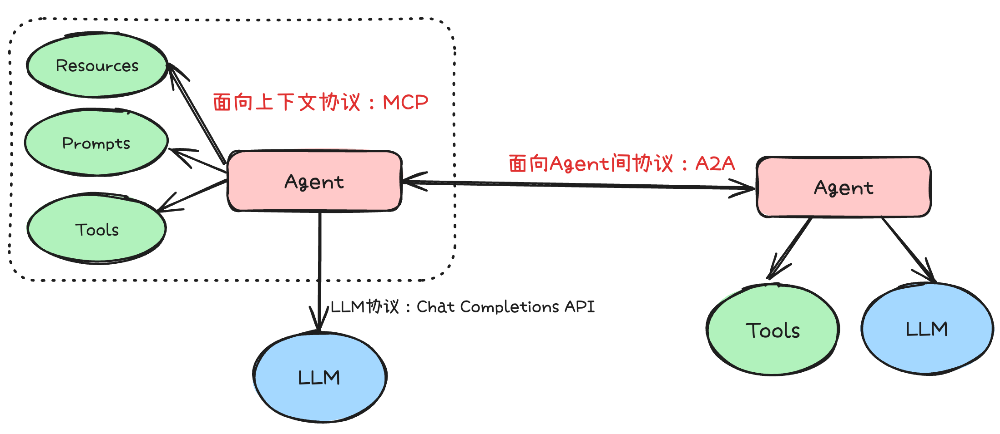

**两者面向的是不同的场景，但是在应用层面可能会有略微的竞争关系。**

MCP 使得单个 agent 拥有了调用工具的能力

A2A 使得不同智能体之间拥有了通信的能力，方便每个 agent 负责专业的任务后交由别的 agent 处理

**竞争关系：**

<!-- 这是一张图片，ocr 内容为： -->
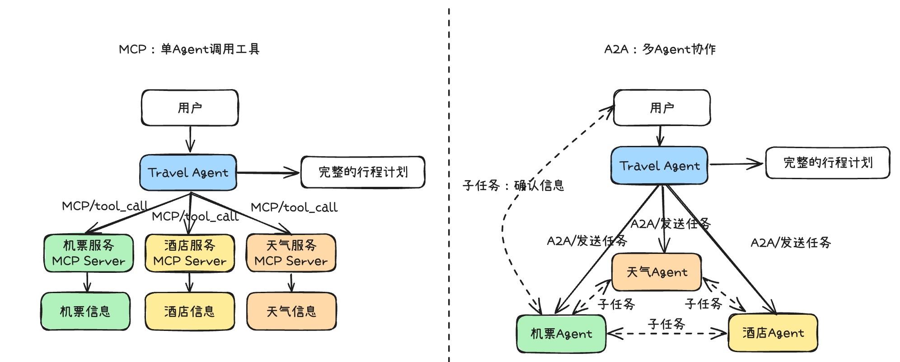

mcp 调用的工具可以是低级的 agent。

但是这俩也有不同，也有各自的优劣：

比如 mcp 仅需要一个 agent，资源浪费少，简单可控；但是中心化依赖高，不易拓展

比如 A2A 每个 working 的专业度更高，输出更精准，可扩展性好；资源消耗较大

# Agent 框架

## Agent 思考框架

使用思考框架是为了赋予 agent 结构化的推理喝决策的能力。一套好的方法论，指导 agent 如何理解目标、分解任务、利用工具、处理信息、并根据环境反馈调整行为。一个好的思考框架能够显著提升 Agent 的鲁棒性、效率、泛化能力。

### 思维链（COT）
Chain of thought，CoT

CoT 核心在于，引导模型在给出最终答案前，先生成一系列结构化的中间推理步骤----这如同模拟人类解决问题时的思考过程。通过这种方式，LLM 能够更深刻地理解问题结构，有效分解复杂任务，并逐步推导出解决方案。

CoT 具有透明性和可解释性。这两点很重要，方便研究人员知道模型的处理逻辑和处理过程，修正模型不正确的地方。

:::tips
Anthropic 精心设计了提示词，使得普通模型拥有了 CoT 的能力：[https://link.zhihu.com/?target=https%3A//github.com/modelcontextprotocol/servers/tree/main/src/sequentialthinking](https://link.zhihu.com/?target=https%3A//github.com/modelcontextprotocol/servers/tree/main/src/sequentialthinking)

:::

+ 使得模型具有了推理规划的能力，但是局限于模型内部知识，缺乏与外界的交互。这可能会导致知识陈旧、产生幻觉、错误传播、专业性不强。

### ReAct
Reasoning and Action，ReAct

推理与行动

ReAct 将推理与行动相结合，允许模型在推理的过程中与外部的工具或环境进行互动，从而获取最新的信息、执行具体的操作。 

核心运作机制：思考（Thought）--行动（action）--观察（Observation） 

<!-- 这是一张图片，ocr 内容为： -->
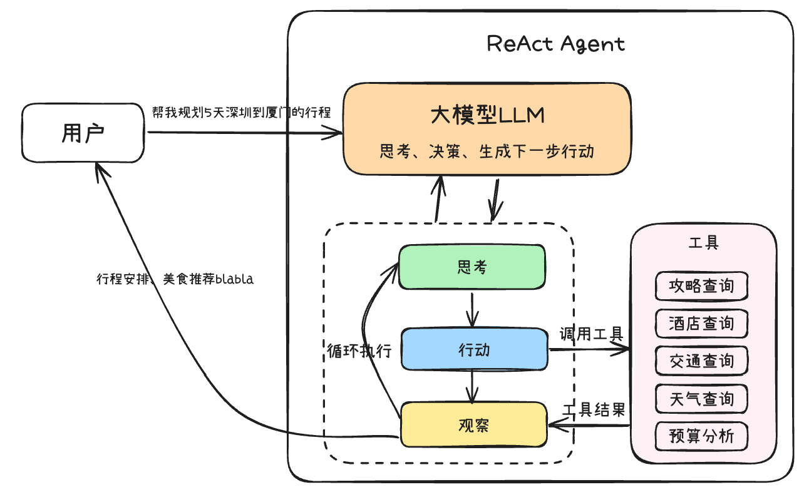

### Plan-and-Execute
Plan-and-Execute 是一种 ReAct 的扩展和优化，旨在处理更复杂、多步骤的任务：

规划阶段：将原始任务分解为一系列更小、更易管理的子任务或步骤。有序的行动序列，指明了要达成最终目标需要完成哪些关键步骤。

执行阶段：按照规划逐一执行每个子任务，在执行子任务的时候，agent 采用标准的 ReAct 循坏来处理该子任务的具体细节，例如调用特定工具、与外部环境交互、或进行更细致的推理。agent 会监控每个子任务的执行情况，若子任务执行失败，agent 会重新评估当前计划，可以动态调整计划或返回到规划阶段进行修正。

<!-- 这是一张图片，ocr 内容为： -->
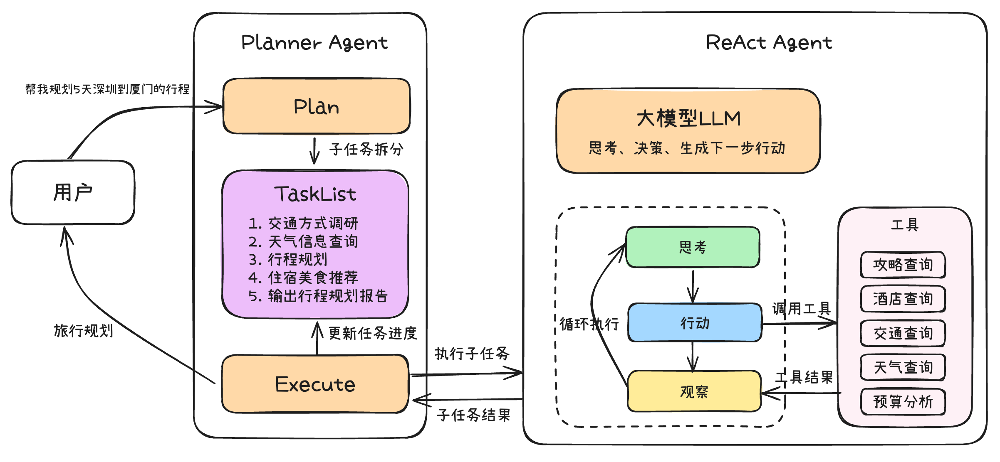

+ Plan-and-Execute 可以结构化复杂任务与优化上下文
+ 提升鲁棒性。若某个子任务失败，会重新评估计划，影响范围相对可控，也容易进行调整
+ 增强可解释性与人机协同。清晰的计划和分布执行的过程使得 agent 的行为更容易被理解和调试

## 开发框架

目前 agent 的主流开发框架集中在 python、JavaScript、Go 技术栈。

OpenAI：Agents SDK  [https://link.zhihu.com/?target=https%3A//openai.github.io/openai-agents-python/](https://link.zhihu.com/?target=https%3A//openai.github.io/openai-agents-python/)

Google：Agent Development Kit   [https://link.zhihu.com/?target=https%3A//google.github.io/adk-docs/](https://link.zhihu.com/?target=https%3A//google.github.io/adk-docs/)

微软：AutoGen   [https://link.zhihu.com/?target=https%3A//microsoft.github.io/autogen/stable/index.html](https://link.zhihu.com/?target=https%3A//microsoft.github.io/autogen/stable/index.html)

LangChain：LangGraph   [https://link.zhihu.com/?target=https%3A//www.langchain.com/langgraph](https://link.zhihu.com/?target=https%3A//www.langchain.com/langgraph)

### Eino
开源  更符合 go 语言编程惯例的 llm 开发框架

+ 高可维护性和高可扩展性并存：Eino 基于 go 1.18 版本引入的泛型，通过强类型定义各个节点的输入输出类型，并在编译时进行类型校验。
+ 丰富的开箱即用组件：chatmodel、Tool、ChatTemplate 等原子级执行节点。
+ 简单易用的开发体验：可视化 EinoDEV

Eino 框架的组成

<!-- 这是一张图片，ocr 内容为： -->
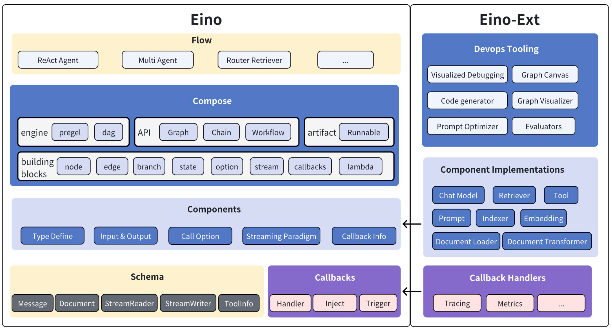

#### 组件
组件是大模型应用能力的提供者，提供原子能力的最小单元，是构建 AI Agent 的砖和瓦，组件抽象的优劣决定了大模型应用开发的复杂度，Eino 的组件抽象秉持着以下设计原则。

+ 模块化和标准化：将一系列功能相同的能力抽象成统一的模块，组件间职能明确、边界清晰，支持灵活地组合。
+ 可扩展性：接口的设计保持尽可能小的模块能力约束，让组件的开发者能方便地实现自定义组件的开发。
+ 可复用性：把最常用的能力和实现进行封装，提供给开发者开箱即用的工具使用

##### 对话处理类组件
chatTemplate

chatmodel

##### 文本语义处理类组件
Document.loader、Document.Transformer

Embedding

Indexer

Retriever

##### 决策执行类组件
ToolsNode

##### 自定义组件
Lambda

#### 编排
Eino通过深入洞察大模型应用的本质特征，提出了基于有向图（Graph）模型的编排解决方案。在这个模型中，各类原子能力组件（Components）作为节点（Node），通过边（Edge）串联形成数据流动网络。每个节点承担特定职责，节点间以上下游数据类型对齐为基本准则，实现类型安全的数据传递。

#### 与 dify/coze 对比
Dify、Coze主要面向业务人员和快速原型开发，而Eino则专为需要深度定制和工程化开发的技术团队设计。

<!-- 这是一张图片，ocr 内容为： -->
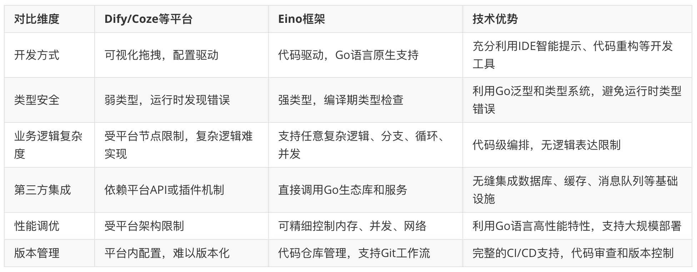

#### callbacks  切面
callbacks 实现横切面功能注入和中间状态透出两大核心功能

工作原理：用户提供并注册自定义的 callback handler 函数，component 和 graph 在执行过程中的固定时机主动回调这些函数，并传递对应的执行信息。

#### checkpoint 检查点

Human in the loop 是一种让人类用户能够实时参与和干预 AI Agent 执行过程的机制。

<!-- 这是一张图片，ocr 内容为： -->
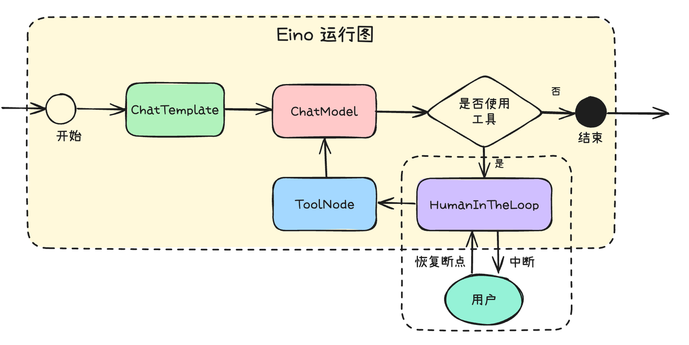

### tRPC-A2A-Go

tRPC-A2A-Go 框架为开发者提供了完整的 A2A 协议客户端和服务端实现，帮助开发者快速将 Agent 封装为标准的 A2A 服务，兼容主流的智能体生态，显著降低了多 agentxie'tong 协同系统继承和运维的难度。

<!-- 这是一张图片，ocr 内容为： -->
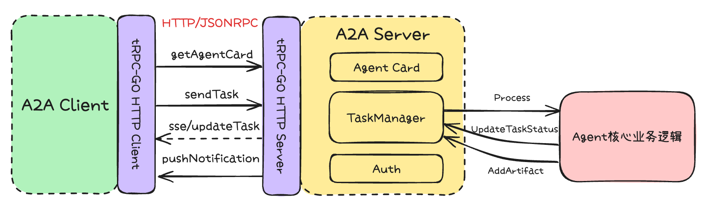

## Agent 可观测性

### Langfuse
Langfuse 是一款开源的 LLM 应用可观测与分析平台，专为大模型驱动的应用（如 Agent、RAG、工具链等）设计。

Eino 框架可以无缝接入 Langfuse

+ 数据看板：通过 Dashboard，可以实时查看 LLM 应用的质量、成本、延迟等多维度指标，全面监控和分析智能体系统的运行状态

<!-- 这是一张图片，ocr 内容为： -->
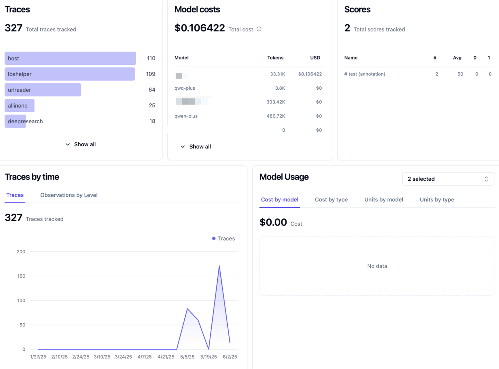

+ 全流程追踪：自动捕获 LLM 应用的每一次调用、嵌套的工具调用、上下文、API 请求、嵌入检索等所有关键步骤，形成完整的执行链路（Trace），用于分析每个环节的输入输出，定位问题。

<!-- 这是一张图片，ocr 内容为： -->
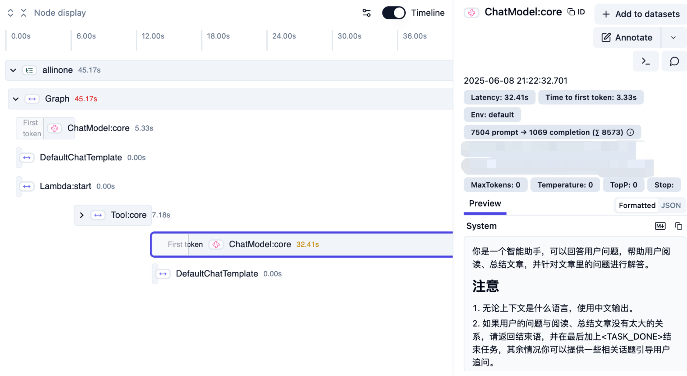

+ 多维度质量评估

<!-- 这是一张图片，ocr 内容为： -->
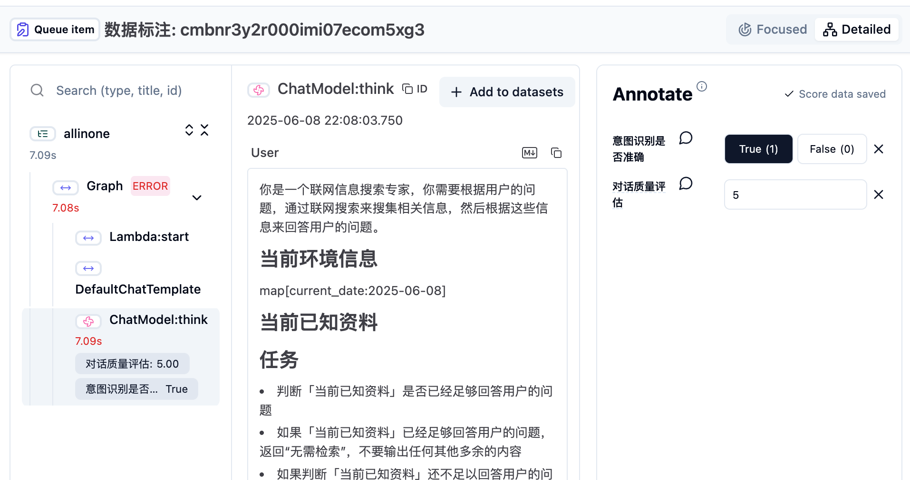

# 总结
AI Agent 的发展正处于爆发前夜，从最初的 LLM 聊天机器人，到具备规划、记忆、工具调用能力的智能体，再到多 Agent 协作的复杂生态，整个行业正在经历一场范式转变。本文系统梳理了 AI Agent 的核心理念、主流协议（MCP、A2A）、思考框架（CoT、ReAct、Plan-and-Execute），并结合 Golang 生态下的 Eino、tRPC-A2A-Go 等工程化框架，结合实际例子详细讲解了如何优雅地开发、编排和观测复杂的智能体系统。

+ 协议标准化是 Agent 生态繁荣的基石：MCP、A2A 等协议的出现，极大降低了工具和 Agent 的集成门槛，让"能力复用"成为可能。未来，协议的进一步融合和演进，将推动智能体生态走向真正的互联互通。
+ 思考框架决定 Agent 的智能上限：从 CoT 到 ReAct，再到 Plan-and-Execute，结构化的推理与行动流程，是 Agent 能否胜任复杂任务的关键。合理选择和实现思考框架，是打造高鲁棒性、高可解释性 Agent 的核心。
+ 工程化框架让复杂 Agent 开发变得优雅高效：Eino、tRPC-A2A-Go 等框架，通过组件化、强类型、编排与切面机制，极大提升了开发效率和系统可维护性。无论是单体智能体，还是多 Agent 协作，都能快速落地生产级应用。
+ 可观测与人机协同是生产级 Agent 的必备能力：只有让 Agent 的推理过程、工具调用、任务状态对用户和开发者透明，才能实现高质量的交付和持续优化。Human In The Loop 机制，则为关键场景下的安全性和可控性提供了保障。
+ 选择适合自身场景的协议与框架才是最优解：没有万能的协议和框架，只有最适合当前业务和团队的技术选型。理解协议的边界、框架的能力，结合实际需求做出权衡，才能真正发挥 AI Agent 的价值。

AI Agent 的世界远比想象中更广阔，同时也是 AI 领域的一大重大革新！

