[https://www.bilibili.com/video/BV1dcRqYuECf/?spm_id_from=333.788.player.player_end_recommend_autoplay&vd_source=4e9106e7030f1c25677827558da5c605](https://www.bilibili.com/video/BV1dcRqYuECf/?spm_id_from=333.788.player.player_end_recommend_autoplay&vd_source=4e9106e7030f1c25677827558da5c605)

增强的大语言模型

<!-- 这是一张图片，ocr 内容为： -->
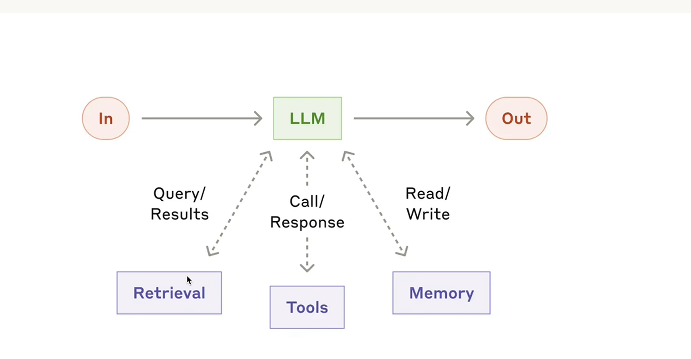

rag   使大模型获取私域数据

<!-- 这是一张图片，ocr 内容为： -->
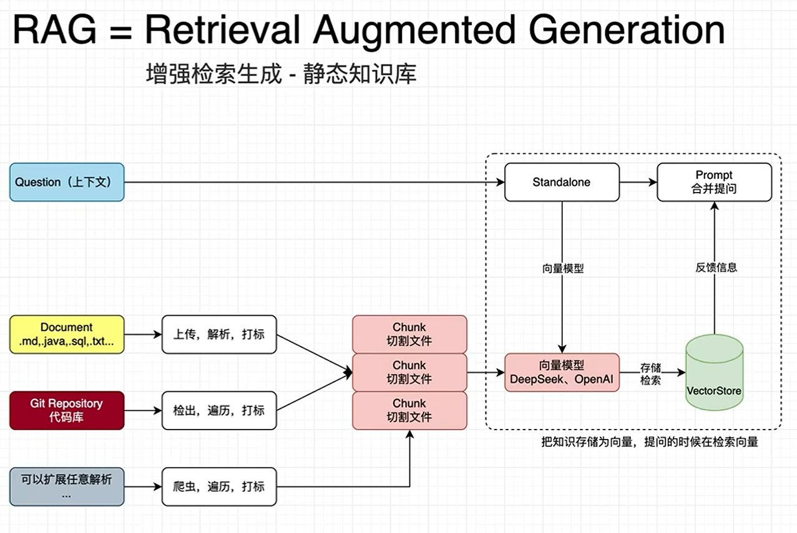

<!-- 这是一张图片，ocr 内容为： -->
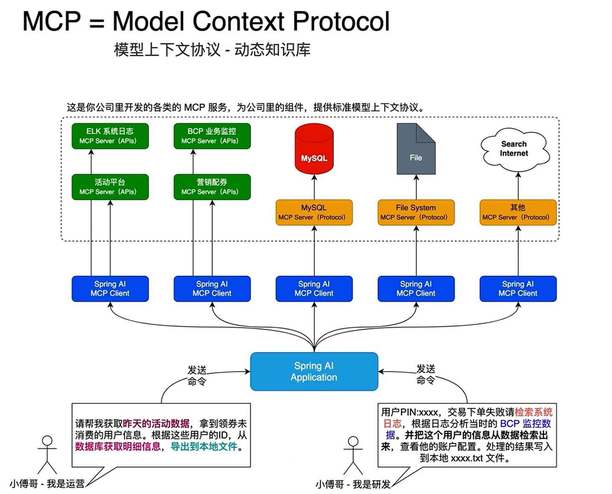

<!-- 这是一张图片，ocr 内容为： -->
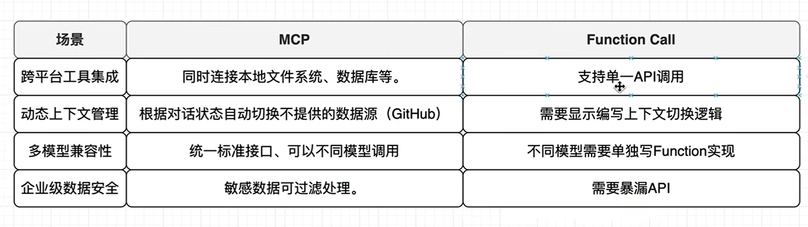

<!-- 这是一张图片，ocr 内容为： -->
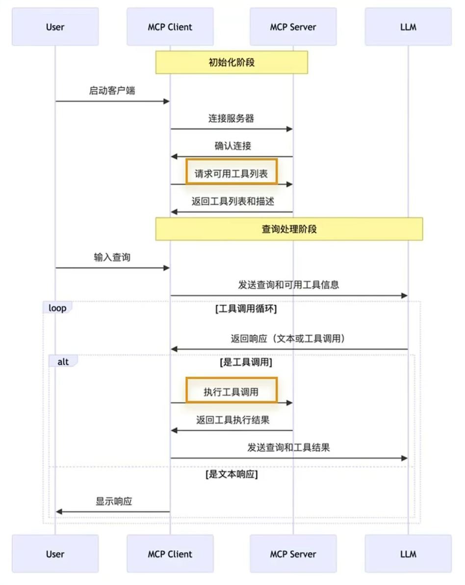

## MCP

## 痛点（创新点）
专门做安全相关的

做了大模型对二进制漏洞挖掘方面的微调

大模型的幻觉问题

大模型上下文长度问题

### 

<!-- 这是一张图片，ocr 内容为：技术爬爬虾 "JSONRPC":"2.0", MCP SERVERS "ID":129, "METHOD":"TOOLS/CALL", "PARAMS": MCP SERVER A "NAME":"SEARCH_REPOSITORIES". 浏览器 "ARGUMENTS": "QUERY""USER:TECH-SHRIMP" MCP SERVER STDIO 文件系统 标准输入通道 AI客户端 MCP SERVER C 数据库 MCP SERVER D 或者使用API请求 GITHUB -->
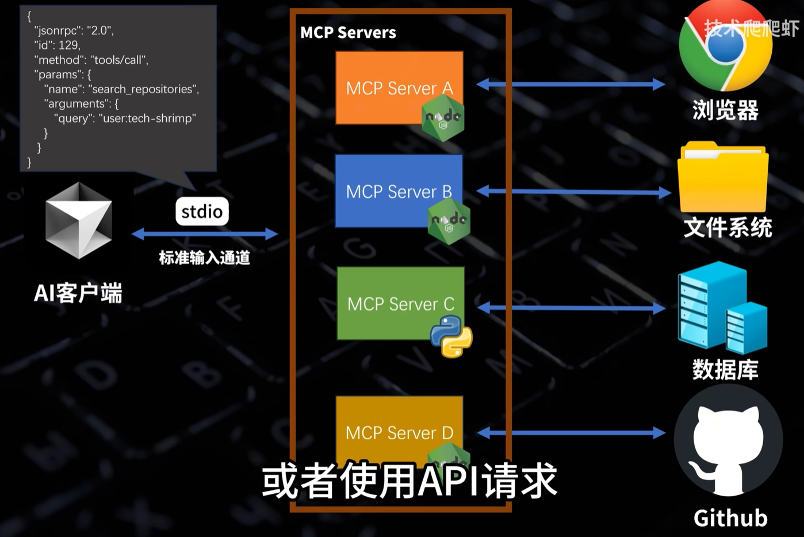

<!-- 这是一张图片，ocr 内容为：WITHOUT MCP WITH MCP 龙米公 MCP PROTOCOL POSTGRESQL POSTGRESQL -->
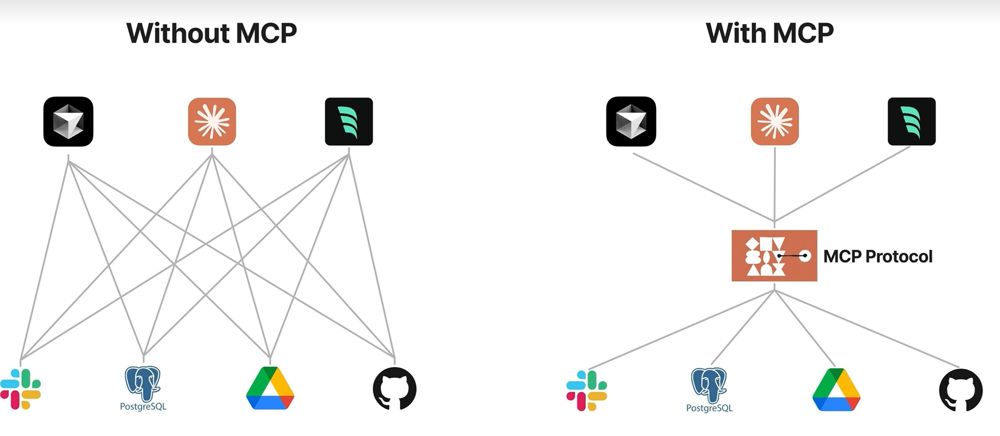

客户端用命令行，调用了电脑上的nodejs程序，程序执行操作，返回结果

<!-- 这是一张图片，ocr 内容为：技术爬爬虾 系统提示词 FUNCTION CALL STREAM:TRUE, "TOOLS TYPE"FUNCTION", "FUNCTION": B69BE9DCOC ":F58C04B62CA6943029 RIPTION":"GET SPECIFIC TIMEZONES", 小 AMETERS /PE":"OBJECT", ROPERTIES": TIMEZONE": "TYPE":"STRING", "DESCRIPTION":"IANA TIMEZONE NAME(E.G., 'AMERICA/NEW_YORK', 'EUROPE/LONDON'). USE 'ASIA/SHANGHAI' AS -YPE":"FUNCTION", "FUNCTION": "NAME":"F05645305248443AABDA5A9ACB1C1D827", -->

<!-- 这是一张图片，ocr 内容为：SYSTEM PROMPT FUNCTION CALL UTER 模型服务 零一力物 默认模型 API密钥 工具调用 系统提示词 LTATG 检查 网络搜索 空钥使用逗号分隔 点击这里获取密钥 MCP服务器 四百川 API 地址 HTTPS://OPENROUTER.AI/API/V1/ 忽略V1版本,#结尾强制使用输入地址 HTTPS://OPENROUTER.AI/API/CHAT/COMPLETIONS 模型 TALLSON 查看OPENROUTER 文档 和 模型获取更多详情 MINIMAX +添加 管理 OPENRANTER ON 关于我们 GROG TOGETHER X 英伟达 -->
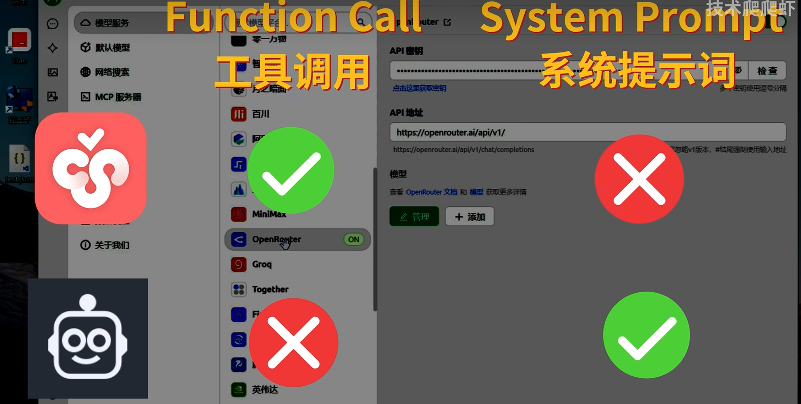

<!-- 这是一张图片，ocr 内容为：技术爬爬虾 用户提问+MCP使用方法 "JSONRPC":"2.0", "ID":123, 调用MCP "METHOD":"TOOLS/CALL", "PARAMS': "NAME":"GET_CURRENT_TIME", "ARGUMENTS" <USE_MCP_TOOL> 调用 "TIMEZONE":"ASIA/SHANGHAI" <SERVER NAME>TIME</SERVER NAME> <TOOL NAME>GET CURRENT TIME</TOOL _NAME> <ARAUMENTS>"TIMEZONE":"ASIA/SHANGHAI"/ARGUMENTS> </USE MCP TOOL> 输出 用户提问+MCP调用过程 "TIMEZONE":"ASIA/SHANGHAI". MCP SERVER "DATETIME":"2025-03-16T21:53:31+08:00". "IS DST':FALSE 最终结果 然后把最终的结果呈现给用户 -->
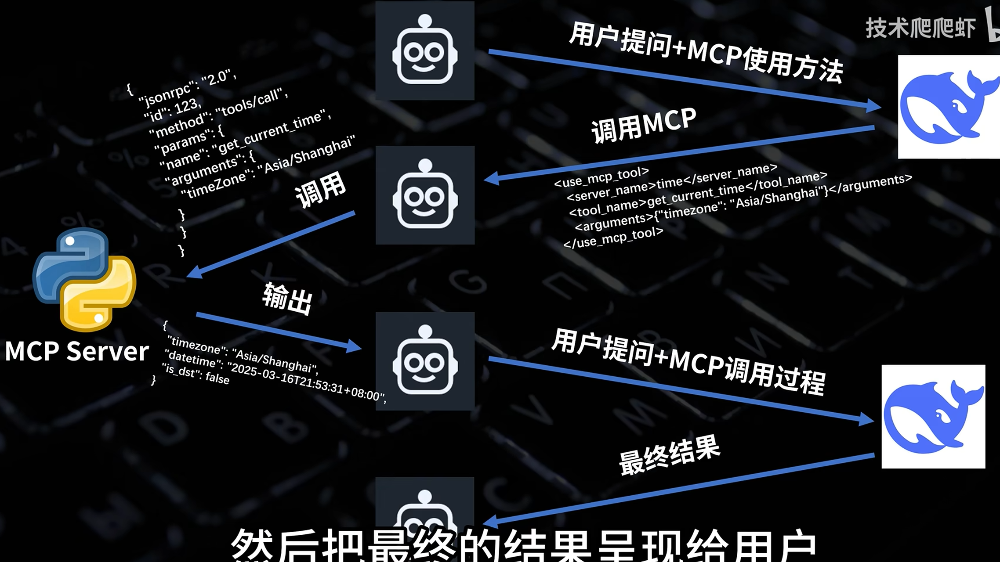

mcp可以依赖function call，也可以不依赖

deepseek不支持function call

cline通过系统提示词来对接ai

# 组合使用，简直是王炸！！！！！！！！！！！！！！！！
<!-- 这是一张图片，ocr 内容为：技术爬爬虾 03/25 16:55 查一下明天早晨8点从青岛太平角公园到会场赶海园的最快公共交通路线,把路线发在技术爬爬下频道 TOKENS:45 ANTHROPICLAUDE-3.7-SONNET | OPENROUTER 03/25 16:55 MAP_SEARCH_PLACES 已完成 已完成 MAP SEARCH PLACES 已完成 MAP SEARCH_PLACES 已完成 MAP DIRECTIONS SLACK LIST CHANNELS 已完成 已完成 SLACK POST MESSAGE 我需要为您直雨从青岛太平角公园到五海国的公共交通路转.在便用相关工具用,我需要实取这两个地产的连锁地理出标,让现先直战这些地点的信息 我已经查询好明天早晨8点从青岛太平角公园到会场赶海园的公共交通路线,并将信息发送到了技术肥爬虾频道. 梅海南部组织,从大平有公司司会将在海西驾驶门了门门门工行到两个国,感和商行行公司,通以解转包换项进驾驶项进行到骑到大平直公交通过有为用,新后转转了交布在目的科技目的科 如果您需要更详细的分段路线或其他出行方式的建议,可以随时告诉我. -->
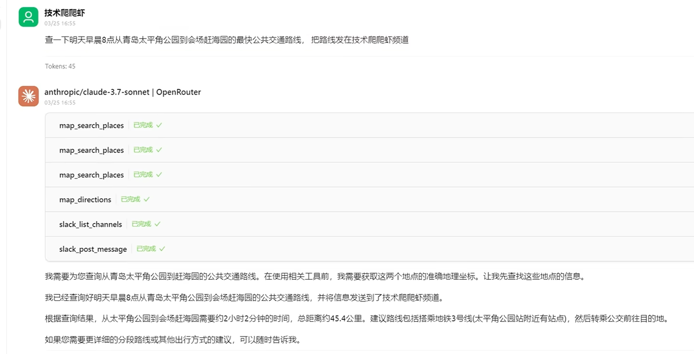

<!-- 这是一张图片，ocr 内容为：气介绍15种MCP工易XCHERRYSTUDLO配置以CB总环频道(频道)-爬起IX SLACK APPLICATIONS( 限爬虾工 X 控制台|百度地图开放平台 已关法 @A)(Q搜索 HTTPS://APP.SLACK.COM/CLIENT/T08KCAQL849/C08K54KFQ76 Q 搜素 爬邦工作区 SLACK专业套餐试用 爬爬虾工作区 #技术爬爬虾频道 勿 抱团 消息口添加画板+ SLACK 专业套餐可享 50% 优惠 CIM入##X不LERESCRE, MONMPBOT W SINMPDUTEM八. 此优惠还剩6天 今天 消息列 SHRIMPBOT 应用 下午 4:50 信 你好 G抱团 SHRIMPBOT 应用 下午4:56 [公交路线]明天早晨8点从青岛太平角公园到会场赶海园的最快公共交通路线: 频道 #技术爬爬虾频道 出发地:青岛太平角公园(市南区湛江路8号) 目的地:会场赶海园(崂山区王哥庄街道) #社交 预计耗时:约2小时2分钟(7311秒) 所有爬爬虾工作区 #所 总距离:约45.4公里 添加频道 路线建议: 1.从太平角公园步行至附近的公交/地铁站 私信 2.搭乘地铁3号线(该线路经过太平角公园站) 李庆凯你 3.转乘公交前往崂山区王哥庄街道会场赶海园 添加同事 注意事项 请提前出发,预留足够时间 应用 可使用手机导航实时确认路线 SLACKBOT 建议在出发前查看公交实时情况,避开早高峰可能的延误 SHRIMPBOT 如需更详细的分段路线或其他出行方式,请回复告知. 添加应用 BIO&汪汪小公 我们看到频道里面也给出了正确输出 1080P高清信速 倍速 倍速 倍速 倍速 倍速 倍速 倍速 国风 11:14/21:21 章节4> 已关闭弹幕 发送 SLACK 需要开启通知的允许.启用通知 -->
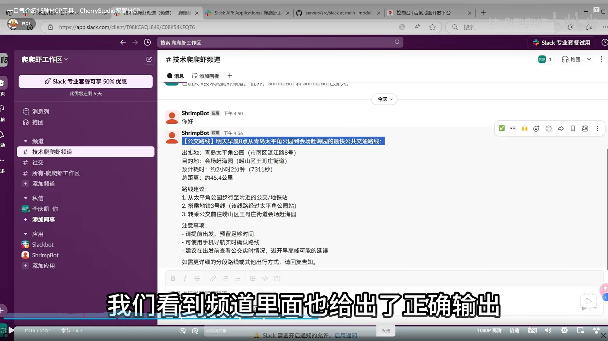

大模型可以有直接阅读URL的能力，可以有独立在搜索引擎搜索的能力

知识图谱

filesystem

<!-- 这是一张图片，ocr 内容为： -->
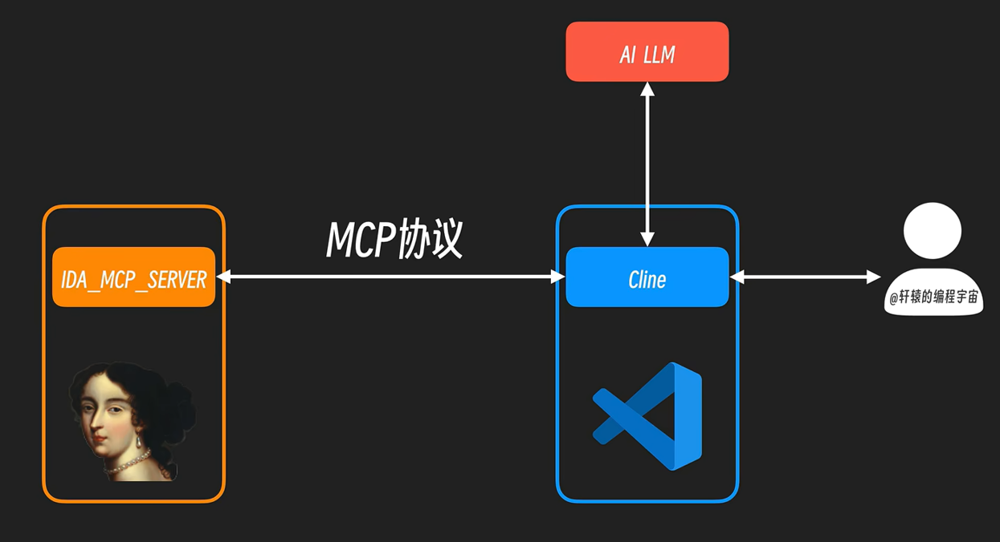

能直接在aliyun部署mcp  agent

