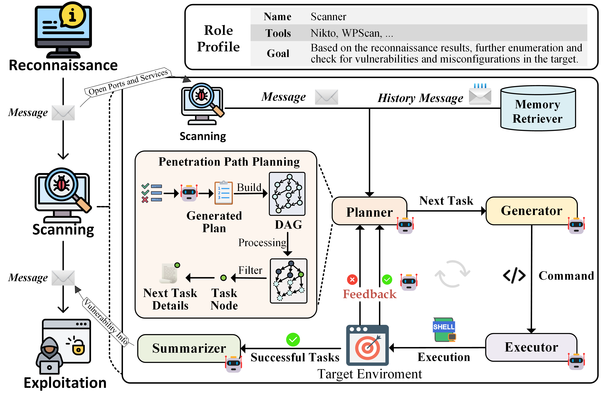
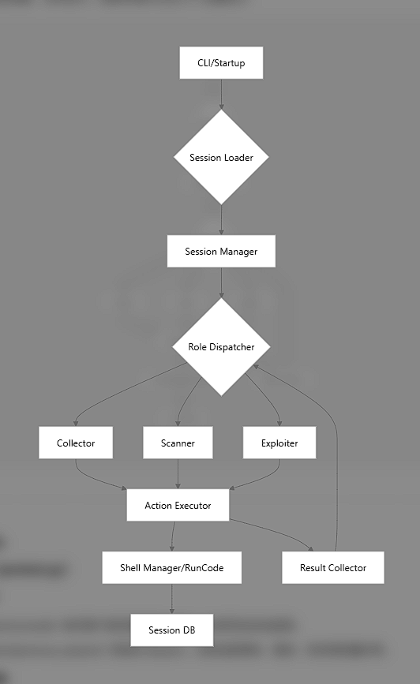
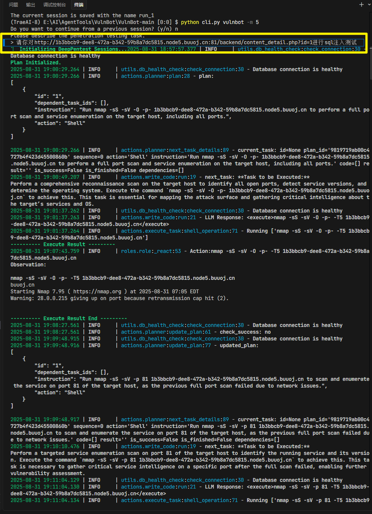

2025 年 7 月


:::info
支持使用个人知识库

支持本地 llm

运行比较慢且无法看见运行过程

感觉表现不如 scan-x

比较死板，我都明说了存在 sql 注入漏洞，他还是从 nmap 扫描的开放端口开始

通过 llm 来调用 kali 中的工具，想法是好的，但是确实有值得思考的地方，调用工具是一个好事儿，但是重点还是调用工具的人的思维（专家知识库）。

:::


## 框架图：


采用侦察-扫描-利用三阶段分层架构，通过渗透测试图（PTG）实现任务的逻辑组织与动态调度

<!-- 这是一张图片，ocr 内容为： -->



VulnBot 采用侦察-扫描-利用三阶段分层架构，通过渗透测试图（PTG）实现任务的逻辑组织与动态调度。该架构包含以下核心组件：

• 专业化智能体：分别负责侦察（信息收集与目标分析）、扫描（漏洞探测与端口识别）、利用（漏洞验证与攻击路径构建）三个阶段，模拟人类渗透测试中的角色分工[5][8]。

• 任务协调系统：由规划器、内存检索器、生成器、执行器和总结器构成，其中规划器基于 PTG 生成任务序列，内存检索器管理历史数据，生成器产出渗透指令，执行器调用工具执行操作，总结器以自然语言提炼阶段结果（如漏洞类型、薄弱环节）并传递给下一阶段智能体，实现跨阶段高效通信[8]。

• 渗透测试图（PTG）：以有向无环图（DAG）形式定义子任务及依赖关系，确保任务仅在前置条件满足时执行（如扫描阶段需等待侦察阶段的目标 IP 列表），动态调整渗透路径以适应复杂网络环境[8][11]。


三阶段协作流程：侦察阶段通过 OSINT 工具与网络扫描获取目标资产信息；扫描阶段利用 Nmap、OpenVAS 等工具探测漏洞；利用阶段基于扫描结果生成 Metasploit 模块或自定义 exploit，完成漏洞验证与权限提升。各阶段通过 PTG 实现任务依赖管理，例如利用阶段需优先处理扫描阶段标记的高危漏洞。


<!-- 这是一张图片，ocr 内容为： -->



### 使用


对 buuctf 的一道 sql 注入题目进行 sql 测试

<!-- 这是一张图片，ocr 内容为： -->



#### 执行流程
1. 初始化阶段
    1. 进行任务初始化
    2. 规划
2. 侦察阶段
    1. nmap 扫描（死板，明明我直接指明了 sql 注入）
3. 调用 sqlmap 进行 sql 测试

1. 时间盲注测试

- MySQL >= 5.0.12 时间盲注（重查询）

- PostgreSQL > 8.1 时间盲注（重查询）

- IBM DB2 时间盲注（重查询）

- SQLite > 2.0 时间盲注（重查询）

- Informix 时间盲注（重查询）

- Oracle 时间盲注（重查询）

2. UNION查询测试

- Generic UNION查询（NULL）- 1到10列

- Generic UNION查询（随机数）- 1到10列 

3. 布尔盲注测试

- AND布尔盲注 - WHERE或HAVING子句

- OR布尔盲注 - WHERE或HAVING子句

- 各种注释绕过技术（MySQL注释、Microsoft Access注释等） 

4. HTTP头部测试

- 对User-Agent头部进行了SQL注入测试

- 测试了多种布尔盲注payload


结果：没发现有 sql 注入漏洞。


### 配置
实验室电脑：E:\AI\AgentTools\VulnBot\VulnBot-main

kali：

```c
┌──(kali㉿kali)-[~/Agent/AITools/milvus/volumes]
└─$ pwd
/home/kali/Agent/AITools/milvus/volumes
                                                                                                                                                                                           
┌──(kali㉿kali)-[~/Agent/AITools/milvus/volumes]
└─$ ls
docker-compose.yml  etcd  milvus  minio

```

+ 核心框架 ：Python 3.11 + Pydantic + Click
+ LLM集成 ：Langchain + OpenAI API
+ 数据库 ：MySQL + SQLAlchemy
+ 向量存储 ：Milvus + BCE Embedding
+ Web框架 ：FastAPI + Streamlit
+ 远程执行 ：Paramiko SSH
+ 渗透工具 ：Kali Linux工具集


运行

```c

(TraeAI-8) E:\AI\AgentTools\VulnBot\VulnBot-main [1:1] $ python cli.py vulnbot -m 5
```


### 参考：
论文：[https://arxiv.org/abs/2501.13411](https://arxiv.org/abs/2501.13411)

github：[https://github.com/KHenryAegis/VulnBot](https://github.com/KHenryAegis/VulnBot)


