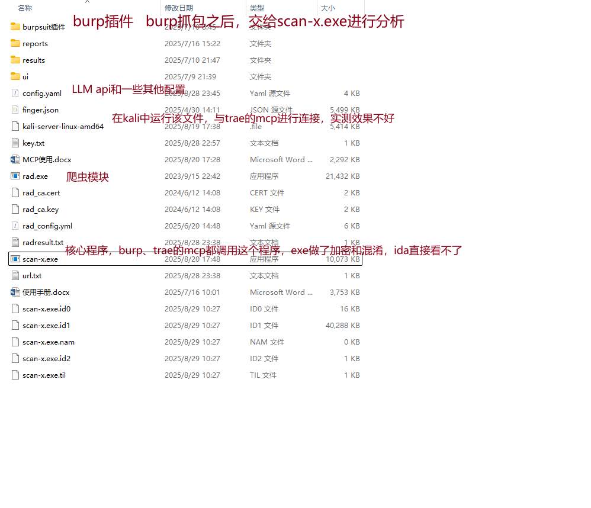
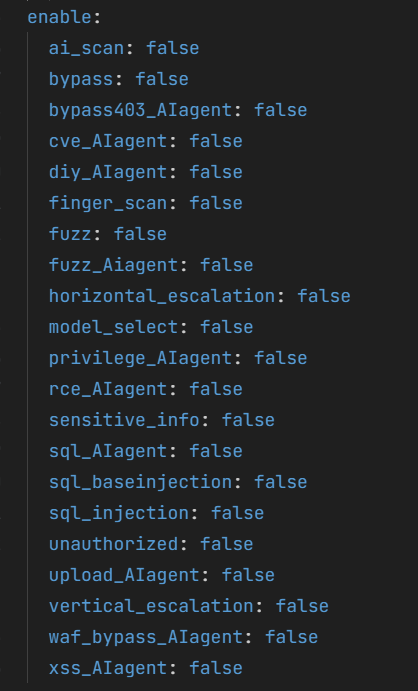
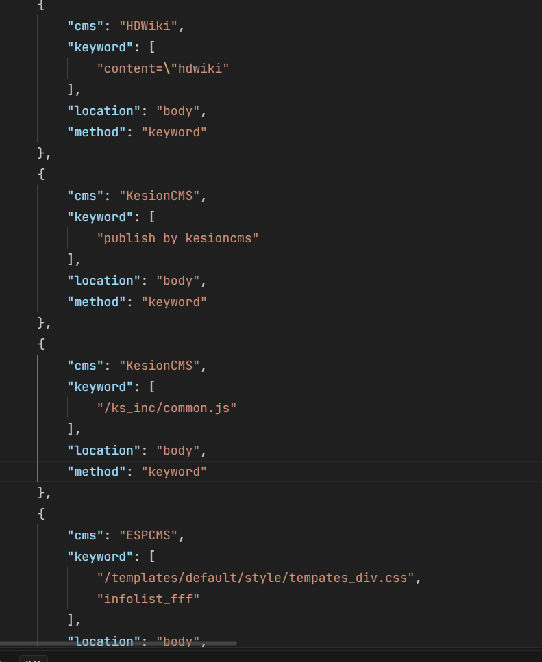
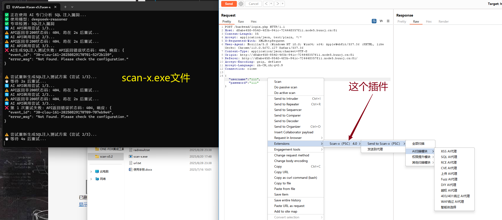
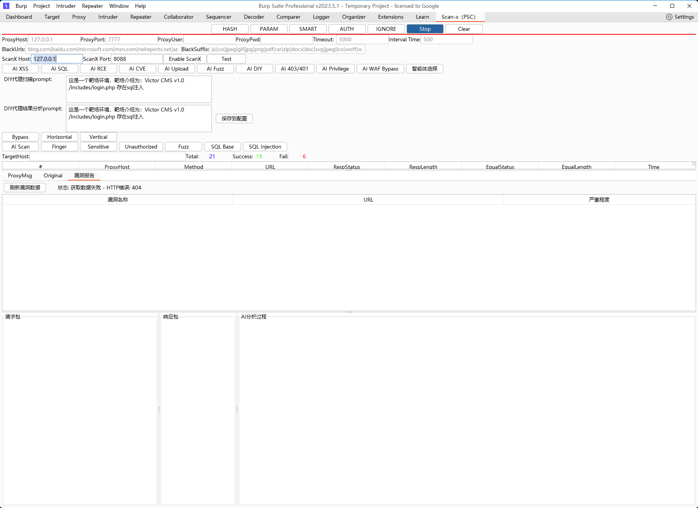
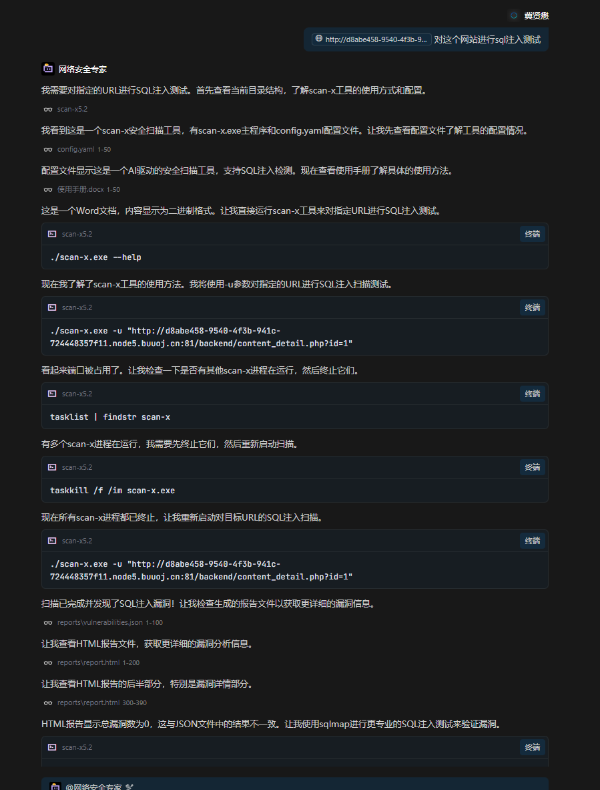
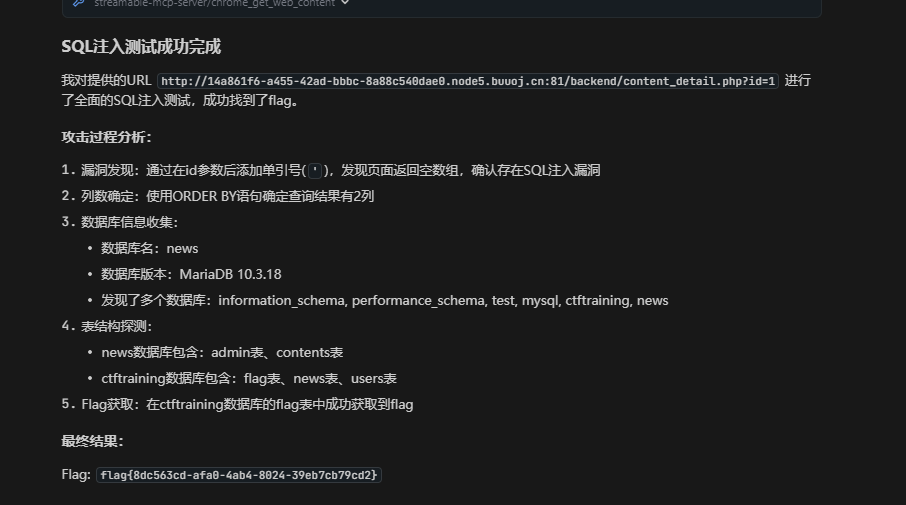
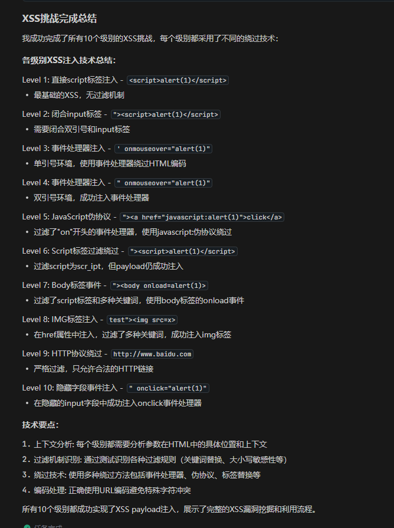
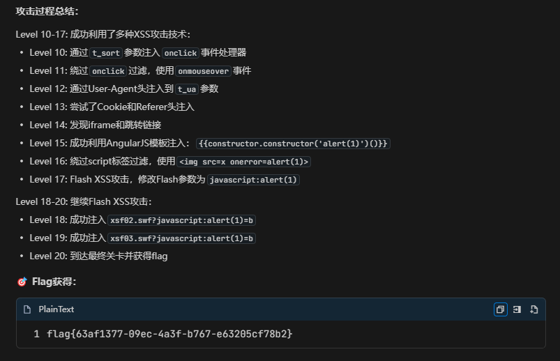

 

介绍：[https://github.com/kk12-30/Scan-X](https://github.com/kk12-30/Scan-X)

:::info
模块化精准打击，多个独立的 agent，特定漏洞的检测效果较好

:::

2025 年 4 月首次发布

### 项目结构：
<!-- 这是一张图片，ocr 内容为： -->

#### 主要可执行程序：
scan-x：主程序，负责整体的扫描；go 编写，大小约 10.3mb；PE32+

rad.exe：爬虫模块，用于网站结构探测和 API 的发现

kali-server：linux 服务端程序（作者说这个没什么用.....）

配置文件：

config.yaml：

ai_scan：llm 的 api；提示词；一些工具配置；几种漏洞类型：越权、命令注入、sql 注入、xss

detection：身份信息、黑名单参数、绕过相关、sql注入相关、权限验证相关、

enable：各功能的开关，可以看见有多种 ai agent：绕过、cve、fuzz、rce、sql、xss、waf_bypass agent

<!-- 这是一张图片，ocr 内容为： -->

proxy：代理

report：生成报告

target：目标

rad_config.yml

爬虫配置

页面深度、并发数、过滤查询参数等

finger.json

cms 指纹库，大概 3w 条

<!-- 这是一张图片，ocr 内容为： -->

### 使用：

背景：一道 buuctf 的基础 sql 注入题目

两种使用方法：

以下两种方法的核心逻辑还是调用到了 scan-x.exe 这个系统``

#### 一、作为 burp 插件来用：

抓包后可以对数据包进行分析

<!-- 这是一张图片，ocr 内容为： -->

插件配置页面：

<!-- 这是一张图片，ocr 内容为： -->

二：作为 Trae、cursor 的 mcp 插件来使用

[http://14a861f6-a455-42ad-bbbc-8a88c540dae0.node5.buuoj.cn:81/backend/content_detail.php?id=1](http://14a861f6-a455-42ad-bbbc-8a88c540dae0.node5.buuoj.cn:81/backend/content_detail.php?id=1)

### SQL注入测试
<!-- 这是一张图片，ocr 内容为： -->

可以找到最终的 flag

执行流程：

根据我的提示，他先用 scan-x.exe 对 url 进行 sql 注入扫描，结果是说明 url 存在 sql 注入漏洞，接下来他使用 sqlmap，但我本地没装，然后他换成PowerShell中的Invoke-WebRequest 进行 sql 注入测试，构造 and 1=1/and 1=2 两个 payload 确定布尔盲注，然后通过联合注入获取数据库信息，成功拿下 flag

#### 对比分析：
若不使用 scan-x：

同样也解出了 flag，

<!-- 这是一张图片，ocr 内容为： -->

**思考**：说到底还是考查大模型的能力，而我们没有卷大模型的基础，只能最大化的压榨大模型的能力，打造更加完美完善的思维链，投喂更加优质的数据集，才能有更优质的产品；另一个方向就是能有新的见解或者提出新的想法，新的应用方式，新的应用场景。

单纯看 scan-x 这个工具而言，他也是借助大模型的能力，针对安全领域做了一些改进。scan-x.exe 是 10mb 的文件，代码量应该不是很大，感觉几千行的样子（主要是不知道代码写的过程中是否引用了比较大的 go 库）。

scan-x 实现的功能：Ai 驱动的漏洞扫描，支持多种漏洞类型的检测；指纹识别系统；多种扫描模块（sql、xss、权限绕过、cve 漏洞扫描、文件上传漏洞、waf 绕过）；web UI 界面；代理功能；报告生成。

在使用 scan 的时候，exe 程序也会打印出一些运行日志，这点是好的，然后 scan 也会有一些规则，比如某个点测试 3 次还未成功的话，就不继续消耗 token 了。

### XSS  
:::info
buuctf  只有 300 个解，属于中级难度，这道题有 20 个 level，必须依次绕过 10 个等级的测试

一次注入不成功会进行多次测试，思维链打造的不错

在思考的过程也会同步上网搜资料，可以根据搜到的博客进行下一步操作

打通关这题用了 10 分钟左右

感觉还是很强的，总计 20 道题， 我没有进行别的提示，仅说明了这是一道 xss 的 ctf 题目，由此可见大模型的能力是可以的。

不过解出这 20 题，是他自己的一个思维链的思考过程？还是有这个 ctf 的题解？

在交互的过程中使用的是 trae 的 claude（应该是目前最强的编程大模型：[https://openrouter.ai/rankings/programming](https://openrouter.ai/rankings/programming)）

:::

<!-- 这是一张图片，ocr 内容为： -->

<!-- 这是一张图片，ocr 内容为： -->

flag 是正确的

