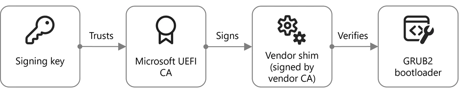
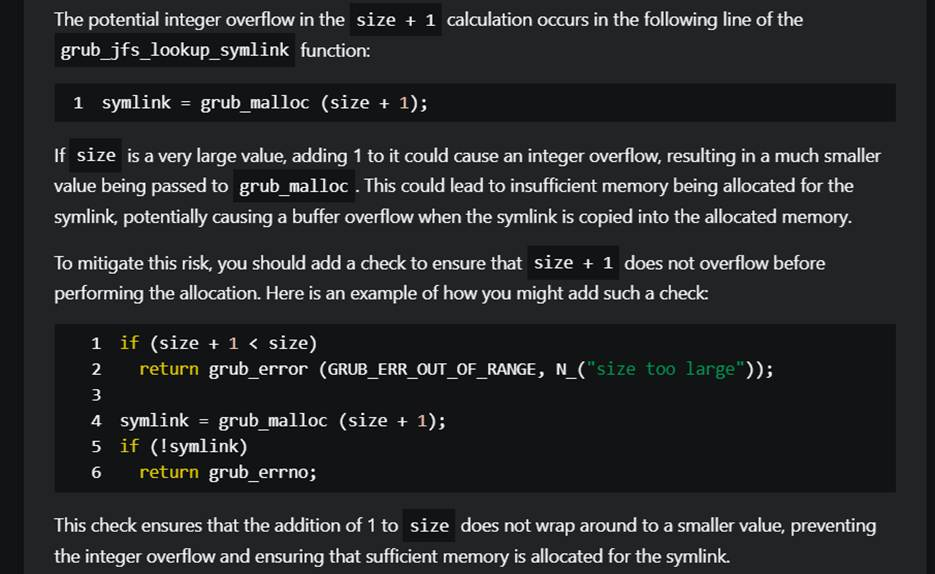
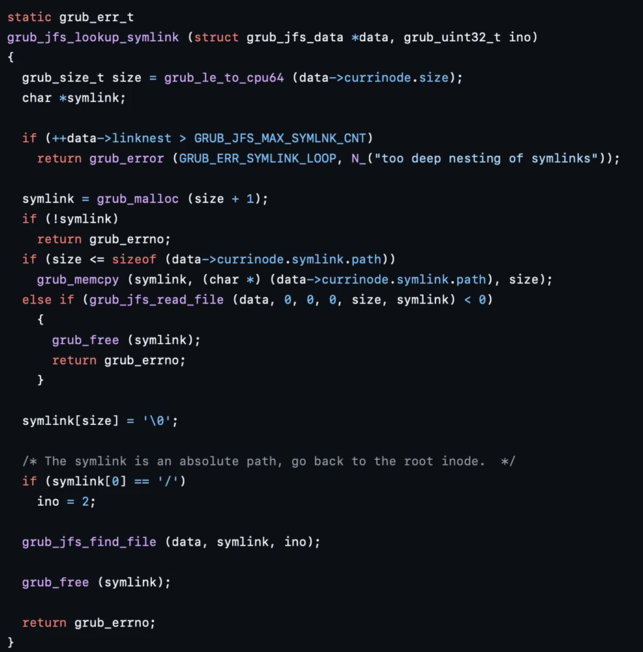
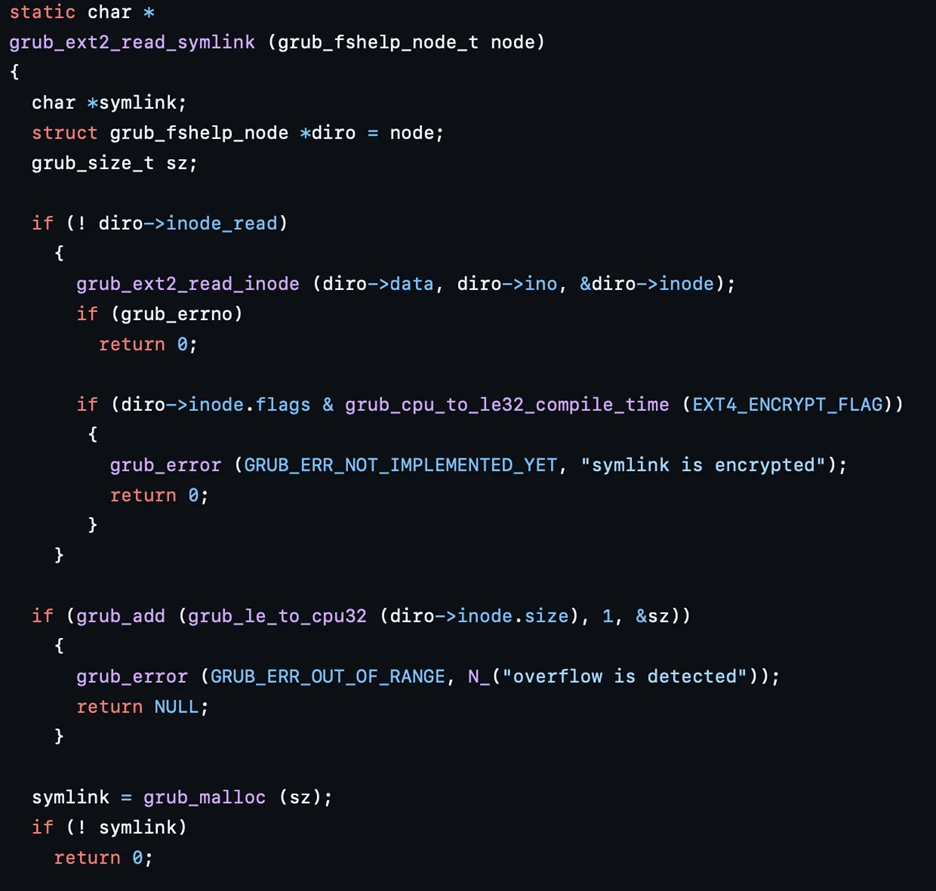

发现引导程序的漏洞，20 个 CVE

[https://www.microsoft.com/en-us/security/blog/2025/03/31/analyzing-open-source-bootloaders-finding-vulnerabilities-faster-with-ai/?utm_source=chatgpt.com](https://www.microsoft.com/en-us/security/blog/2025/03/31/analyzing-open-source-bootloaders-finding-vulnerabilities-faster-with-ai/?utm_source=chatgpt.com)

## Analyzing open-source bootloaders : Finding vulnerability faster with AI

### 1.选定范围：

GRUB2 是用 c 写的，之前有报过GRUB2 的内存漏洞

<!-- 这是一张图片，ocr 内容为： -->

脆弱点：

GRUB2 将 UEFI 作为 API 来依赖，因此不会开 NX、ASLR、Safe dynamic allocators、canaries 等

GRUB2 实现了复杂的功能：image file parsers、font parsing and support、network、filesystem、bash、Extensible

### 2.分析过程
1： 使用 Security Copilot，让它来分析哪些功能可能出现漏洞，Copilot 选定了 network、file system和 cryptographic。

2： 人工指定了 file system（不选 network 的原因是协议不太好分析、不选cryptographic 的原因是加密基于 UEFI）

3：以 JFFS2 文件系统代码为例，提示copilot查找所有潜在的安全问题，包括可利用分析。copilot发现了多个安全问题，要求copilot识别并提供最要紧的5个问题进行分析。在这5个问题中，识别到有三个是误报、一个不可利用、一个为整数溢出漏洞

<!-- 这是一张图片，ocr 内容为： -->

### 3.方法复刻
基于上述方法，他们对GRUB2 进行了彻底的验证和审查，从而确认了存在与整数溢出的相关漏洞：

| **Module模块** | **Vulnerability脆弱性** | **CVE** |
| --- | --- | --- |
| **UFS (filesystem)UFS（文件系统）** | Buffer overflow in symbolic link handling due to an integer overflow in allocation.由于分配中的整数溢出，符号链接处理中的缓冲区溢出。 | [CVE-2025-0677](https://www.cve.org/CVERecord?id=CVE-2025-0677) |
| **Squash4 (filesystem)Squash4（文件系统）** | Buffer overflow in file reads due to an integer overflow in allocation.由于分配中的整数溢出，文件读取中的缓冲区溢出。 | [CVE-2025-0678](https://www.cve.org/CVERecord?id=CVE-2025-0678) |
| **ReiserFS (filesystem)ReiserFS（文件系统）** | Buffer overflow in symbolic link handling due to an integer overflow in allocation.由于分配中的整数溢出，符号链接处理中的缓冲区溢出。 | [CVE-2025-0684](https://www.cve.org/CVERecord?id=CVE-2025-0684) |
| **JFS (filesystem)JFS（文件系统）** | Buffer overflow in symbolic link handling due to an integer overflow in allocation.由于分配中的整数溢出，符号链接处理中的缓冲区溢出。 | [CVE-2025-0685](https://www.cve.org/CVERecord?id=CVE-2025-0685) |
| **RomFS (filesystem)RomFS（文件系统）** | Buffer overflow in symbolic link handling due to an integer overflow in allocation.由于分配中的整数溢出，符号链接处理中的缓冲区溢出。 | [CVE-2025-0686](https://www.cve.org/CVERecord?id=CVE-2025-0686) |
| **UDF (filesystem)UDF（文件系统）** | Buffer overflow in block reads of UDF due to an out-of-bounds operation.由于越界作，UDF 的块读取中出现缓冲区溢出。 | [CVE-2025-0689](https://www.cve.org/CVERecord?id=CVE-2025-0689) |
| **HFS (filesystem)HFS（文件系统）** | Buffer overflow in filesystem mounting due to wild_strcpy_function on a non-NUL-terminated string.由于非 NUL 结尾字符串上的野生_strcpy_函数，文件系统挂载中的缓冲区溢出。 | [CVE-2024-56737](https://www.cve.org/CVERecord?id=CVE-2024-56737) |
| **HFS (filesystem) compressionHFS（文件系统）压缩** | Buffer overflow in file opens due to an integer overflow in allocation.由于分配中的整数溢出，文件中的缓冲区溢出打开。 | [CVE-2025-1125](https://www.cve.org/CVERecord?id=CVE-2025-1125) |
| **Crypto (cryptography)加密（密码学）** | Cryptographic side-channel attack due to non-constant time memory comparison.由于非恒定时间内存比较导致的加密侧信道攻击。 | [CVE-2024-56738](https://www.cve.org/CVERecord?id=CVE-2024-56738) |
| **Read (commands)读取（命令）** | The_read_command is intended to read a line from the keyboard and assign its text to a variable and is susceptible to a signed integer overflow and an out-of-bounds write._read_命令旨在从键盘读取一行并将其文本分配给变量，并且容易受到有符号整数溢出和越界写入的影响。 | [CVE-2025-0690](https://www.cve.org/CVERecord?id=CVE-2025-0690) |
| **Dump (commands)转储（命令）** | While the memory reading commands (such as_read_byte_) are disabled in production, the_dump_command was left enabled and can be used to read arbitrary memory addresses.虽然内存读取命令（例如_read_byte_）在生产中被禁用，但_dump_命令保持启用状态，可用于读取任意内存地址。 | [CVE-2025-1118](https://www.cve.org/CVERecord?id=CVE-2025-1118) |

### 漏洞分析

漏洞代码：

<!-- 这是一张图片，ocr 内容为： -->

漏洞成因：

+ size 变量声明为 grub_size_t，最终定义为 64 位无符号整数
+ grub 是一个引导程序，黑客可以完全控制 inode 的 size，可以设置为 0xFFFFFFFFFFFFFFFF
+ 现在 size 是0xFFFFFFFFFFFFFFFF
+ 执行到 size+1，导致 symlink 分得 0 字节的块
+ grub_jfs_read_file 正在写入符号链接，内容由黑客任意设置。

正确代码：

EXT2 文件系统中的正确符号链接解析 - 注意如何使用 grub_add 检查溢出：

<!-- 这是一张图片，ocr 内容为： -->

### 变体分析和对其他引导加载程序的扩展

发现 GRUB2 文件系统漏洞并验证其可用性之后，得出结论，其他引导程序可能也存在类似漏洞。

使用 Secyrity Copilot 根据 GRUB2 文件系统的代码在 github 中找到类似代码，初筛找到了很多 GRUB2 分支，继续优化搜索并手动查看结果；在结果中，通常用于嵌入式系统的 U-boot 和 Barebox 引导加载程序呗确定为与 GRUB2 共享代码。

进一步调查这两个系统中的类似漏洞，发现了如下：

| **Bootloader引导加载程序** | **Vulnerability脆弱性** | **Description描述** |
| --- | --- | --- |
| U-boot   | [CVE-2025-26726](https://www.cve.org/CVERecord?id=CVE-2025-26726) | SquashFS directory table parsing buffer overflowSquashFS 目录表解析缓冲区溢出 |
| U-boot   | [CVE-2025-26727](https://www.cve.org/CVERecord?id=CVE-2025-26727) | SquashFS inode parsing buffer overflowSquashFS inode 解析缓冲液溢出 |
| U-boot   | [CVE-2025-26728](https://www.cve.org/CVERecord?id=CVE-2025-26728) | SquashFS nested file reading buffer overflowSquashFS 嵌套文件读取缓冲区溢出 |
| U-boot  | [CVE-2025-26729](https://www.cve.org/CVERecord?id=CVE-2025-26729) | EroFS symlink resolution buffer overflowEroFS 符号链接解析缓冲区溢出 |
| Barebox   | [CVE-2025-26721](https://www.cve.org/CVERecord?id=CVE-2025-26721) | Buffer overflow in the persistent storage for file creation用于创建文件的持久存储中的缓冲区溢出 |
| Barebox   | [CVE-2025-26722](https://www.cve.org/CVERecord?id=CVE-2025-26722) | Buffer overflow in SquashFS symlink resolutionSquashFS 符号链接解析中的缓冲区溢出 |
| Barebox   | [CVE-2025-26723](https://www.cve.org/CVERecord?id=CVE-2025-26723) | Buffer overflow in EXT4 symlink resolutionEXT4 符号链接解析中的缓冲区溢出 |
| Barebox   | [CVE-2025-26724](https://www.cve.org/CVERecord?id=CVE-2025-26724) | Buffer overflow in CramFS symlink resolutionCramFS 符号链接解析中的缓冲区溢出 |
| Barebox   | [CVE-2025-26725](https://www.cve.org/CVERecord?id=CVE-2025-26725) | Buffer overflow in JFFS2 dirent parsingJFFS2 dirent 解析中的缓冲区溢出 |

