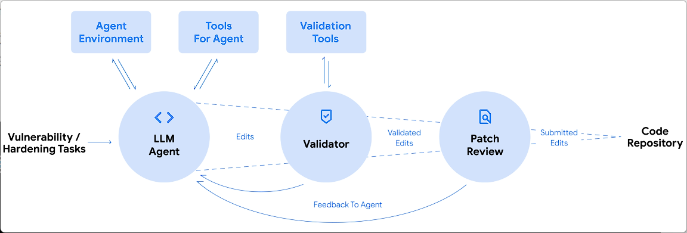

### bigsleep
2024 年 10 月份

### OssFuz 与大模型的深度集成

基于Big Sleep和OSS-Fuzz，已经证实了AI具备了发现0day的能力

由DeepMind开发的CodeMender，帮助开发者识别和修复代码中的安全漏洞，旨在提高代码安全性。在过去的六个月，已经提交了72个开源的程序补丁，其中一些代码长达450万行。自动创建和应用高质量的安全补丁。

### deepmind
[https://deepmind.google/discover/blog/introducing-codemender-an-ai-agent-for-code-security/](https://deepmind.google/discover/blog/introducing-codemender-an-ai-agent-for-code-security/)

<!-- 这是一张图片，ocr 内容为： -->

还未开源

