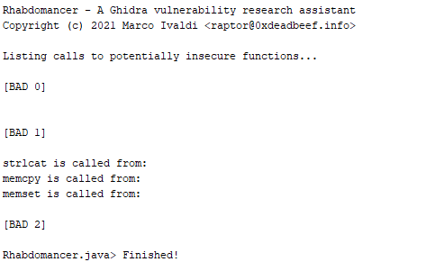
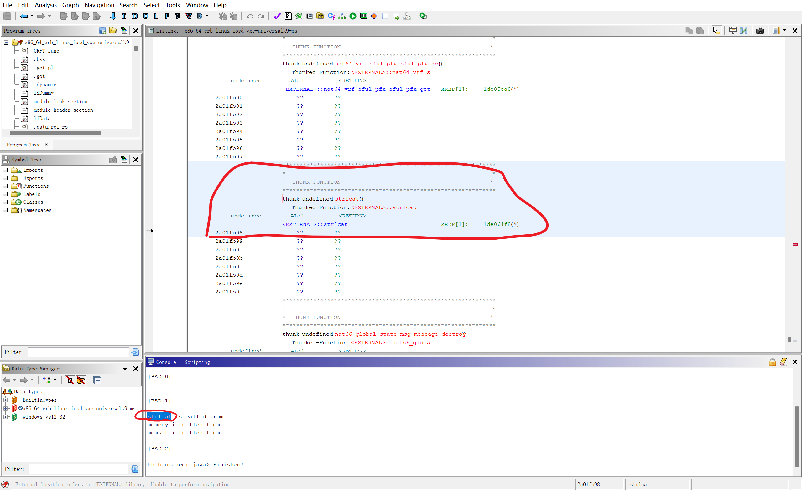
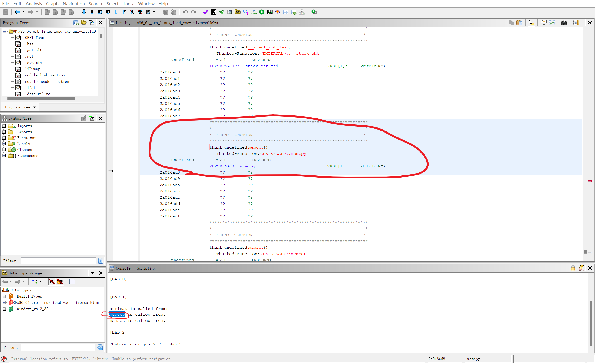
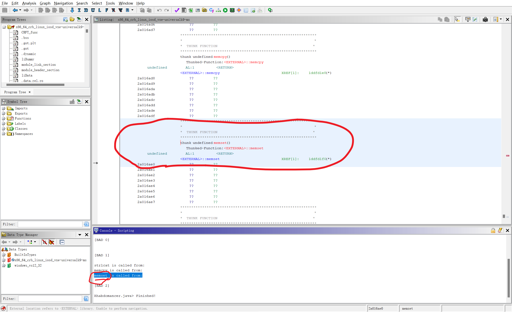

Rhabdomancer 是一个简单的 Ghidra 脚本，用于辅助基于候选点策略的漏洞研究任务，针对用 C/C++ 编写的闭源软件。它定位所有调用可能不安全函数的位置（候选点），把这些函数根据危险性划分三个不同的等级，等级从0到2依次递减。审计人员可以从这些候选点回溯中，寻找允许通过不受信任输入访问的路径。  

ghidra控制台：

<!-- 这是一张图片，ocr 内容为：RHABDOMANCER - A GHIDRA VULNERABILITY ASSISTANT RESEARCH COPYRIGHT (C) 2021 MARCO IVALDI <RAPTORQOXDEADBEEF, DBEEF.INFO> LISTING CALLS TO POTENTIALLY INSECURE FUNCTIONS... [BAD 0] [BAD 1] STRLCAT IS CALLED FROM: MEMCPY IS CALLED FROM: I  FROM: MEMSET IS CALLED F [BAD 2] RHABDOMANCER.JAVA> FINISHED! -->

<!-- 这是一张图片，ocr 内容为：EDIT ANALYSIS GRAPH NAVIGATION ELLE  ID 软 B CF X  X86.64.CRB LINUK IOSD_VAE UNIVERSALK9-NS THUNK FUNCTION CRFT.FUNE THUNK UNDEFINED NAT64_VYRI_SFUL PIX_STUL PIX_0059 国际园(DE) THUNKED-FUNCTION:<EXTERNAL>:INAT64 VEF_& AL:1 <EXTERNAL>:INAT64 VRF AFUL PEX SEUL PEX GET 1DE05EA0(*) LIDUNONY 77 77 2A011B90 2? ?? WODULE_HEADER SECTION 77 2A011692 ?? 2A01EB93 ,DATE.REL.RO 77 27 2A01EB95 77 2A012B96 27 2A016B97 X 国 SYUBOLTREE 由由由由 THUNK FUNCTION LABELS THUNK UNDERINED STRLCAT() INENESPECES UNDERINED 22 艺艺 竖+ 77 2A01109A ?? 77 27 THUNK PUNCTION THUNK UNDERINOD NAT66 OLOBAL_STATS MAD_MESSAGE_CLESTRDY THUNKED-FUNCTION:<EXTERNAL>::NAT86 G1OBA. FILTER: CONGOLE - SCRIPTING X ON DATS TYPE MANSGER [BAD O M DATE TYPES 甲 [BAD1] -86_64_CXB_LINUX IOSD_VXE-UNIVERSELK9-NS 甲 STRICAT CALLED RROM: MEMOPY IS CALLED FROM: MEMSET IS CALLED FROM: RINISHED! FILTEN: 小 2401F698 THABLE TO PERFORN NAYIGATION. STRLEAT -->

<!-- 这是一张图片，ocr 内容为：ELLE EDIT ANALYSIS GRAPH N NAVIGATION NG: X86.64 CTH LINAK IOSD_VAE UNIVERSALLKG-NS .BSS THUNK UNDERINED _STACK_CHK_TAIL) 国国日(D) THUNKED-FUNCTION:<EXTERNAL>:: STACK_CHK. (*10 TPJPPT XREF[11: LIDUNONGY ?? WODULE_HEADER SECTION 77 2? 2A016AD3 ,DATE.REL.RO 2A016AD5 2A016AD6 2A016AD7 国 SYUBOLTREE 由由由由 LABELS CHUNK UNDERINED MEMCPYL) INENESPECES <EXTERNAL>:MEMEPY 2A016AD8 77 ?? THUNK UNDERINED MEMSET() <RRTIRN FILTER: CONSOLE-SERIPTING X BI DATA TYPE MANSGER M DATE TYPES 甲 X86_64_CRB_LINUX_IOSD_VXE-UNIVERSALK9-NS 甲 STRLOAT IS CALLED TXOMI CALLED FROM: [BAD 2] RINISHED! FILTEN: 小 LOCATION REFERS TO (EXTERNAL) LIBRARS. THZHLE TO PERFORN NAVIGATION. -->
<!-- 这是一张图片，ocr 内容为：EDIT ANALYSIS GRAPH NAVIGATION SEARCH ELLE  ID X  386.64_CRB_LINUX_IOSD_YXE_UNIVERSALK9-NS ZAU168D6 国际园(DE) LIDUNONY WODULE_HEADER SECTION <EXTERNAL>:IMEMOPY XREF(L]: ??? 27 ,DATE.REL.RO ?7 77 ?? 7? 2A016ADA ?7 77 LHUNE ?? 国 SYUBOL TREE 元元 2A016ADE 由由由由 77 LABELS INENESPECES CHUNK UNDEFINED MEMSET() THUNKED-PUNOTION:<EXTERNAL>!:MEMSET XREF(11 <EXTERNAL>::MEMSET IDDRDITO() 24016AE1 22 ?? 2? 77 27 77 2A016AO7 FILTER: @ X CONGOLE - SCRIPTING ON DATA TYPE MANSGER X [BAD0] LU DATE TYPOS 甲 [BAD 1] X86_64_CRB_LINUX.IOSD_VSE-UNIVERSALK9-NS 甲 STXLEAT IS CALLED TRON: MENGRY IS CALLED FROM: [BAD 21 DOMANCER.JAVA> PISHED! FILTEN: 小 AL LOCATION REFERS TO (EXTERDERARY, LIBRARY, TO PERFORN NAVIGATION. -->

