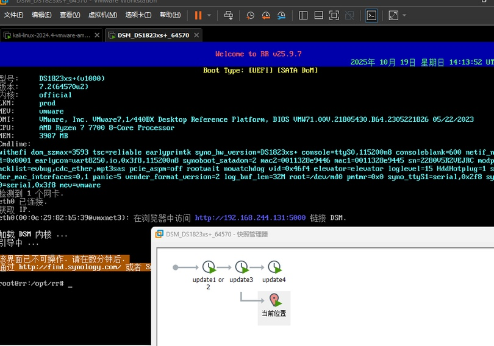
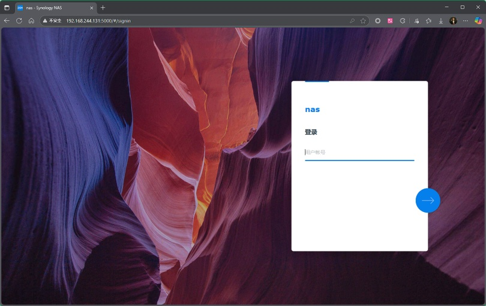
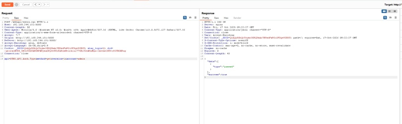
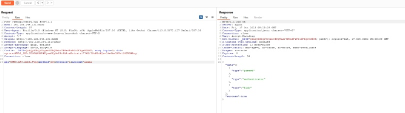
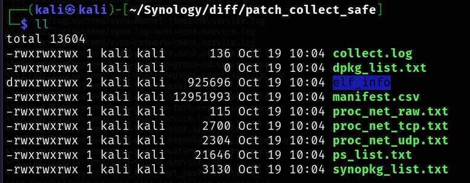
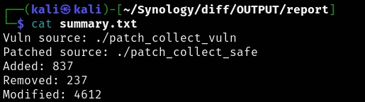
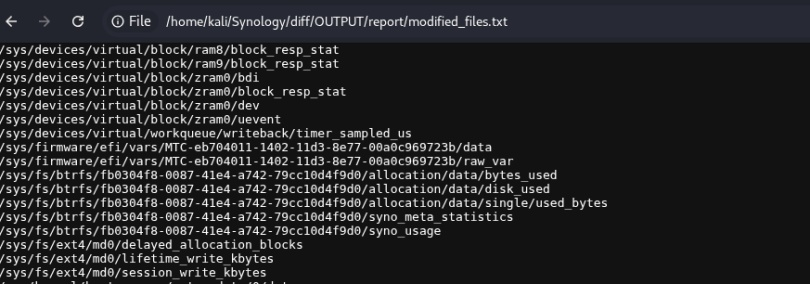
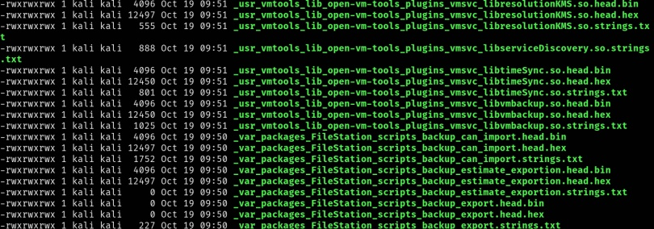
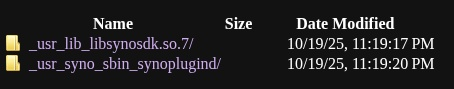

## 漏洞信息：
Synology BeeStation OS (BSM) 1.1-65374 之前的版本以及 Synology DiskStation Manager (DSM) 7.2-64570-4、7.2.1-69057-6 和 7.2.2-72806-1 之前的版本中的系统插件守护程序中存在不正确的编码或输出转义漏洞，允许远程攻击者通过未指定的向量执行任意代码。


<!-- 这是一张图片，ocr 内容为： -->


<!-- 这是一张图片，ocr 内容为： -->



## **漏洞定位：抓包查看后**
account字段，当输入一个不存在的用户名的时候，返回包会改变。

/webapi/entry.cgi

<!-- 这是一张图片，ocr 内容为： -->


<!-- 这是一张图片，ocr 内容为： -->


## **通过前后版本diff找到补丁修改代码**
先收集两个版本的信息：

### **collect.sh**
收集文件系统下（bin /config  /etc  /initrd  /lib32  /lost+found  /run  /sys  /tmpRoot  /var  /volume1  /boot  /etc.defaults  /lib /lib64  /root  /sbin  /tmp  /usr  /var.defaults）的全部文件信息，排除了（/proc /mnt /dev）目录

```plain
#!/usr/bin/env bash
# collect_minimal_for_diff.sh
# DSM-adapted minimal filesystem collector for patch diff.
# - Assumes: bash, dd (bs=1 count=4 ok), sha256sum present
# - No dependency on `strings`, `readelf`, `ss`, or busybox
#
# Usage:
#   sudo ./collect_minimal_for_diff.sh <tag>
# Example:
#   sudo ./collect_minimal_for_diff.sh vuln_20251019
#
# Output: /tmp/patch_collect_<tag>.tar.gz  (scp this file to analysis host)
set -euo pipefail

if [ "$#" -lt 1 ]; then
  echo "Usage: sudo $0 <tag>"
  exit 2
fi

TAG="$1"
OUTDIR="/tmp/patch_collect_${TAG}"
MANIFEST="${OUTDIR}/manifest.csv"
ELF_DIR="${OUTDIR}/elf_info"
PACKFILE="/tmp/patch_collect_${TAG}.tar.gz"
LOG="${OUTDIR}/collect.log"

mkdir -p "${OUTDIR}"
mkdir -p "${ELF_DIR}"
: > "${LOG}"

echo "[*] Starting collection. Tag=${TAG}" | tee -a "${LOG}"
echo "[*] Output dir: ${OUTDIR}" | tee -a "${LOG}"

# === Adjusted ROOTS for DSM (tweak if you want to include/exclude) ===
ROOTS=(
  /bin
  /config
  /etc
  /initrd
  /lib32
  /lost+found
  /run
  /sys
  /tmpRoot
  /var
  /volume1
  /boot
  /etc.defaults
  /lib
  /lib64
  /root
  /sbin
  /tmp
  /usr
  /var.defaults
)

# Exclude prefixes to avoid noisy virtual filesystems or big mounts
EXCLUDE_PREFIXES=( /proc /mnt /dev)

# Hash command (sha256sum expected)
if command -v sha256sum >/dev/null 2>&1; then
  HASHCMD="sha256sum"
elif command -v md5sum >/dev/null 2>&1; then
  HASHCMD="md5sum"
else
  HASHCMD=""
fi

# manifest header
echo "path|mode|uidgid|size|mtime|hash|nature" > "${MANIFEST}"

# helper: check exclusion
is_excluded() {
  local p="$1"
  for pref in "${EXCLUDE_PREFIXES[@]}"; do
    if [[ "$p" == "$pref"* ]]; then
      return 0
    fi
  done
  return 1
}

# helper: read first N bytes (prefers dd, falls back to head)
read_head_bytes() {
  local file="$1"
  local n="$2"
  # attempt dd
  if dd if="$file" bs=1 count="$n" 2>/dev/null | od -An -t x1 | grep -q .; then
    dd if="$file" bs=1 count="$n" 2>/dev/null
    return 0
  fi
  # fallback head
  if head -c "$n" "$file" 2>/dev/null | od -An -t x1 | grep -q .; then
    head -c "$n" "$file" 2>/dev/null
    return 0
  fi
  return 1
}

# helper: check ELF magic
is_elf_by_magic() {
  local f="$1"
  if read_head_bytes "$f" 4 2>/dev/null | od -An -t x1 | tr -s ' ' | sed 's/^ *//' | grep -qi '^7f 45 4c 46'; then
    return 0
  fi
  return 1
}

# helper: extract printable strings from first N bytes (approx strings, length >= minlen)
extract_printables_head() {
  local f="$1"
  local out="$2"
  local n=${3:-4096}
  local minlen=${4:-8}
  # read N bytes, keep printable ASCII (tab/newline/CR and 0x20-0x7E)
  read_head_bytes "$f" "$n" 2>/dev/null | tr -cd '\11\12\15\40-\176' | \
    awk -v minlen="$minlen" '
      {
        line=$0
        # break by non-word-ish boundaries, but keep punctuation
        n=split(line, a, /[^[:alnum:][:punct:]]/)
        for(i=1;i<=n;i++){
          if(length(a[i])>=minlen) print a[i]
        }
      }' | sed -n '1,1000p' > "$out" 2>/dev/null || true
}

# iterate roots
for root in "${ROOTS[@]}"; do
  if [ ! -e "$root" ]; then
    echo "[!] skip missing root: $root" | tee -a "${LOG}"
    continue
  fi

  # find files and symlinks (avoid following mounts via -xdev)
  find "$root" -xdev \( -type f -o -type l \) -print0 2>/dev/null | while IFS= read -r -d '' f; do
    # skip excluded prefixes
    if is_excluded "$f"; then
      continue
    fi

    # gather stat
    if stat_out=$(stat -c '%a|%u:%g|%s|%Y' -- "$f" 2>/dev/null); then
      mode=$(echo "$stat_out" | cut -d'|' -f1)
      uidgid=$(echo "$stat_out" | cut -d'|' -f2)
      size=$(echo "$stat_out" | cut -d'|' -f3)
      mtime=$(echo "$stat_out" | cut -d'|' -f4)
    else
      mode=""
      uidgid=""
      size=""
      mtime=""
    fi

    hashval=""
    if [ -f "$f" ] && [ -n "$HASHCMD" ]; then
      # compute hash, ignore errors
      if h=$($HASHCMD --binary -- "$f" 2>/dev/null | awk '{print $1}'); then
        hashval="$h"
      fi
    elif [ -L "$f" ]; then
      target=$(readlink -m -- "$f" 2>/dev/null || echo "")
      hashval="symlink->${target}"
    fi

    # Determine nature: text/binary/symlink/elf
    nature="unknown"
    if [ -L "$f" ]; then
      nature="symlink"
    elif [ -f "$f" ]; then
      # quick binary test: presence of NUL char
      if grep -q $'\x00' "$f" 2>/dev/null; then
        nature="binary"
      else
        nature="text"
      fi
    fi

    # If ELF by magic, produce head + strings + hex
    if [ -f "$f" ] && is_elf_by_magic "$f"; then
      nature="elf"
      safe=$(echo "$f" | sed 's/[^A-Za-z0-9._-]/_/g')
      outbase="${ELF_DIR}/${safe}"
      mkdir -p "$(dirname "$outbase")"
      # head binary
      if read_head_bytes "$f" 4096 >/dev/null 2>&1; then
        read_head_bytes "$f" 4096 > "${outbase}.head.bin" 2>/dev/null || true
      fi
      # hexdump of head
      if [ -f "${outbase}.head.bin" ]; then
        od -An -tx1 "${outbase}.head.bin" > "${outbase}.head.hex" 2>/dev/null || true
      fi
      # extract printable-like strings from head
      extract_printables_head "$f" "${outbase}.strings.txt" 4096 8
    fi

    # write manifest line (escape '|' in path)
    esc_path=$(printf "%s" "$f" | sed 's/|/\\|/g')
    printf "%s|%s|%s|%s|%s|%s|%s\n" "$esc_path" "$mode" "$uidgid" "$size" "$mtime" "${hashval}" "$nature" >> "${MANIFEST}"
  done
done

# capture process list
if command -v ps >/dev/null 2>&1; then
  ps -ef > "${OUTDIR}/ps_list.txt" 2>/dev/null || true
fi

# capture network info: prefer ss, else /proc/net/*
if command -v ss >/dev/null 2>&1; then
  ss -ltnp > "${OUTDIR}/ss_list.txt" 2>/dev/null || true
else
  [ -f /proc/net/tcp ] && cp /proc/net/tcp "${OUTDIR}/proc_net_tcp.txt" 2>/dev/null || true
  [ -f /proc/net/udp ] && cp /proc/net/udp "${OUTDIR}/proc_net_udp.txt" 2>/dev/null || true
  [ -f /proc/net/raw ] && cp /proc/net/raw "${OUTDIR}/proc_net_raw.txt" 2>/dev/null || true
fi

# package manager inventory
if command -v dpkg >/dev/null 2>&1; then
  dpkg -l > "${OUTDIR}/dpkg_list.txt" 2>/dev/null || true
fi
if command -v synopkg >/dev/null 2>&1; then
  synopkg list > "${OUTDIR}/synopkg_list.txt" 2>/dev/null || true
fi

echo "[*] Packaging results into ${PACKFILE} ..." | tee -a "${LOG}"
tar -czf "${PACKFILE}" -C /tmp "$(basename "${OUTDIR}")"
echo "[*] Done. Tarball: ${PACKFILE}" | tee -a "${LOG}"
echo "If you want to scp it to the analysis host, run on host:"
echo "  scp root@<DSM_IP>:${PACKFILE} ~/analysis/"

exit 0
```

sudo vim collect_safe.sh

chmod 777 collect_safe.sh

sudo /root/collect_safe.sh safe

收集示例：

<!-- 这是一张图片，ocr 内容为： -->


manifest.csv示例：

包含文件的：路径、权限、组、大小、hash、类型

```plain
/var.defaults/lib/disk-compatibility/ds1823xs+_m2d20_v7.release|644|0:0|8|1685730637|1d96fbad469a23b15b3bda67d19da834ae7b90e934605430237f02d410566a82|binary
/var.defaults/lib/disk-compatibility/rx1223rp_v7.db|644|0:0|14969|1685730637|9710d05c1ab9ba59f3d572c76d458c2726ac64f13cc7bd274f28f1c6bcf06224|binary
/var.defaults/lib/drive/dsm_connect_state.json|644|0:0|47|1685675658|3754eb706f06f839fa3149dda4c893f01c67474740bcab42982b0eb6392d766f|binary
/var.defaults/lib/temperature/disk_temperature.version|644|0:0|3|1685730637|b8aed072d29403ece56ae9641638ddd50d420f950bde0eefc092ee8879554141|binary
/var.defaults/lib/temperature/disk_temperature.xml|644|0:0|24547|1685730637|9b12344ec0cf699e5a923b0c7953662651c37738cb779ac503f4b9c0980343a6|binary
```

漏洞版本条目：84468

安全版本条目：85068

收集了两个版本的文件后做diff

### analyze.sh
```plain
#!/usr/bin/env bash
# analyze_patch_dsm.sh - flexible: accepts either extracted collector directories or tarballs
# Usage:
#   ./analyze_patch_dsm.sh VULN_DIR_OR_TARBALL PATCHED_DIR_OR_TARBALL OUTDIR
#
# Behavior:
# - If first two args are directories containing manifest.csv, use them directly (no extraction).
# - Otherwise treat them as tar.gz and extract into workdir.
#
set -euo pipefail
IFS=$'\n\t'
export LC_ALL=C

if [ "$#" -ne 3 ]; then
  echo "Usage: $0 VULN_DIR_OR_TARBALL PATCHED_DIR_OR_TARBALL OUTPUT_DIR"
  exit 2
fi

A="$1"
B="$2"
OUTDIR="$3"

# Ensure PATH includes common locations where diffoscope may live
export PATH="$PATH:/usr/local/bin:/usr/bin:/bin:/usr/sbin:/sbin:/snap/bin:/home/$USER/.local/bin"

WORK="$OUTDIR/work"
REPORT="$OUTDIR/report"
mkdir -p "$WORK" "$REPORT"

# Helper: check if path is directory containing manifest.csv
is_extracted_dir() {
  local d="$1"
  [ -d "$d" ] && [ -f "$d/manifest.csv" ]
}

# Prepare V_TOP and P_TOP
if is_extracted_dir "$A" && is_extracted_dir "$B"; then
  echo "[*] Both arguments are directories with manifest.csv; using them directly."
  V_TOP="$(cd "$A" && pwd -P)"
  P_TOP="$(cd "$B" && pwd -P)"
else
  # treat as tarballs, extract into work
  echo "[*] Treating inputs as tarballs; extracting into $WORK ..."
  rm -rf "$WORK"/*
  mkdir -p "$WORK/v" "$WORK/p"
  tar -xzf "$A" -C "$WORK/v"
  tar -xzf "$B" -C "$WORK/p"
  # find extracted top dirs
  V_TOP=$(find "$WORK/v" -maxdepth 2 -type d -name "patch_collect_*" | head -n1 || true)
  P_TOP=$(find "$WORK/p" -maxdepth 2 -type d -name "patch_collect_*" | head -n1 || true)
  if [ -z "$V_TOP" ] || [ -z "$P_TOP" ]; then
    echo "[!] Could not find extracted patch_collect_* directories under $WORK"
    echo "    Check that the tarballs contain top-level patch_collect_* directories or pass exploded directories instead."
    exit 3
  fi
fi

echo "[*] vuln top: $V_TOP"
echo "[*] patched top: $P_TOP"

V_MANIFEST="$V_TOP/manifest.csv"
P_MANIFEST="$P_TOP/manifest.csv"
if [ ! -f "$V_MANIFEST" ] || [ ! -f "$P_MANIFEST" ]; then
  echo "[!] manifest.csv missing in one of the inputs:"
  echo "    V_MANIFEST=$V_MANIFEST"
  echo "    P_MANIFEST=$P_MANIFEST"
  exit 4
fi

# Prepare working manifest copies
cp "$V_MANIFEST" "$WORK/vuln_manifest.csv"
cp "$P_MANIFEST" "$WORK/patched_manifest.csv"

# Drop header and normalize CRLF
tail -n +2 "$WORK/vuln_manifest.csv" | sed 's/\r$//' > "$WORK/vuln_manifest.raw"
tail -n +2 "$WORK/patched_manifest.csv" | sed 's/\r$//' > "$WORK/patched_manifest.raw"

# Extract path lists (unescape '|' if present)
awk -F'|' '{print $1}' "$WORK/vuln_manifest.raw" | sed 's/\\|/|/g' | sed 's/\r$//' | sort -u -t'|' -k1,1 > "$WORK/vuln_files.txt"
awk -F'|' '{print $1}' "$WORK/patched_manifest.raw" | sed 's/\\|/|/g' | sed 's/\r$//' | sort -u -t'|' -k1,1 > "$WORK/patched_files.txt"

# Added / removed / common (use LC_ALL=C for deterministic ordering)
comm -23 "$WORK/vuln_files.txt" "$WORK/patched_files.txt" > "$REPORT/removed_files.txt" || true
comm -13 "$WORK/vuln_files.txt" "$WORK/patched_files.txt" > "$REPORT/added_files.txt"   || true
comm -12 "$WORK/vuln_files.txt" "$WORK/patched_files.txt" > "$WORK/common_files.txt"    || true

# Build path -> hash map (manifest format: path|mode|uidgid|size|mtime|hash|nature)
awk -F'|' '{print $1 "|" $6}' "$WORK/vuln_manifest.raw" > "$WORK/vuln_path_sha.txt"
awk -F'|' '{print $1 "|" $6}' "$WORK/patched_manifest.raw" > "$WORK/patched_path_sha.txt"

# sort by path robustly (first field)
sort -t'|' -k1,1 "$WORK/vuln_path_sha.txt" -o "$WORK/vuln_path_sha.sorted" || true
sort -t'|' -k1,1 "$WORK/patched_path_sha.txt" -o "$WORK/patched_path_sha.sorted" || true

# join entries; allow join to fail gracefully
join -t'|' -j1 "$WORK/vuln_path_sha.sorted" "$WORK/patched_path_sha.sorted" > "$WORK/joined_sha.txt" 2>/dev/null || true

# modified by hash (or missing)
awk -F'|' '{
  path=$1; v=$2; p=$3;
  if(v=="" && p=="") next;
  if(v != p) print path
}' "$WORK/joined_sha.txt" > "$REPORT/modified_files.txt" || true

# Fallback: compare size if hash missing
awk -F'|' '{print $1 "|" $4}' "$WORK/vuln_manifest.raw" > "$WORK/vuln_path_size.txt"
awk -F'|' '{print $1 "|" $4}' "$WORK/patched_manifest.raw" > "$WORK/patched_path_size.txt"
sort -t'|' -k1,1 "$WORK/vuln_path_size.txt" -o "$WORK/vuln_path_size.sorted" || true
sort -t'|' -k1,1 "$WORK/patched_path_size.txt" -o "$WORK/patched_path_size.sorted" || true
join -t'|' -j1 "$WORK/vuln_path_size.sorted" "$WORK/patched_path_size.sorted" > "$WORK/joined_size.txt" 2>/dev/null || true
awk -F'|' '{ if($2 != $3) print $1 }' "$WORK/joined_size.txt" >> "$REPORT/modified_files.txt" || true

# Ensure modified list unique and present
if [ -f "$REPORT/modified_files.txt" ]; then
  sort -u "$REPORT/modified_files.txt" -o "$REPORT/modified_files.txt" || true
else
  touch "$REPORT/modified_files.txt"
fi

# Counts summary
echo "Vuln source: $A" > "$REPORT/summary.txt"
echo "Patched source: $B" >> "$REPORT/summary.txt"
echo "Added: $(wc -l < "$REPORT/added_files.txt" 2>/dev/null || echo 0)" >> "$REPORT/summary.txt"
echo "Removed: $(wc -l < "$REPORT/removed_files.txt" 2>/dev/null || echo 0)" >> "$REPORT/summary.txt"
echo "Modified: $(wc -l < "$REPORT/modified_files.txt" 2>/dev/null || echo 0)" >> "$REPORT/summary.txt"

# Keywords for suspect scoring (extendable)
KEYWORDS="account|Auth|entry.cgi|getenv|setenv|system|popen|exec|sprintf|snprintf|passwd|authenticator|sanitize|escape"

# Robust diffoscope detection: allow override via DIFFOSCOPE_BIN env var
DIFFOSCOPE_BIN="${DIFFOSCOPE_BIN:-$(command -v diffoscope 2>/dev/null || true)}"
if [ -z "$DIFFOSCOPE_BIN" ] && [ -x "/home/$USER/.local/bin/diffoscope" ]; then
  DIFFOSCOPE_BIN="/home/$USER/.local/bin/diffoscope"
fi
if [ -z "$DIFFOSCOPE_BIN" ] && [ -x "/usr/local/bin/diffoscope" ]; then
  DIFFOSCOPE_BIN="/usr/local/bin/diffoscope"
fi
if [ -z "$DIFFOSCOPE_BIN" ] && [ -x "/snap/bin/diffoscope" ]; then
  DIFFOSCOPE_BIN="/snap/bin/diffoscope"
fi

if [ -n "$DIFFOSCOPE_BIN" ]; then
  echo "[*] diffoscope found: $DIFFOSCOPE_BIN"
  USE_DIFFOSCOPE=1
else
  echo "[*] diffoscope not found in PATH; fallback to head.bin/strings comparison"
  USE_DIFFOSCOPE=0
fi

# Prepare output folders
mkdir -p "$REPORT/diffoscope" "$REPORT/elf_head_diff" "$REPORT/strings_diff"

# helper to resolve manifest path into extracted file path
real_path_in_extract() {
  local top="$1"
  local rel="$2"
  # prefer top+rel (rel often starts with '/')
  if [ -n "$rel" ] && [ -e "${top}${rel}" ]; then
    printf "%s" "${top}${rel}"
    return 0
  fi
  # try trim leading slash
  if [ -n "$rel" ] && [ -e "${top}/${rel#/}" ]; then
    printf "%s" "${top}/${rel#/}"
    return 0
  fi
  # fallback return constructed path
  printf "%s" "${top}${rel}"
  return 0
}

declare -A suspect_score

# Iterate over modified files
while IFS= read -r rel || [ -n "$rel" ]; do
  rel=$(printf "%s" "$rel" | sed 's/\r$//')
  [ -z "$rel" ] && continue

  # find manifest entries if available
  v_entry=$(awk -F'|' -v p="$rel" '$1==p{print $0; exit}' "$WORK/vuln_manifest.raw" || true)
  p_entry=$(awk -F'|' -v p="$rel" '$1==p{print $0; exit}' "$WORK/patched_manifest.raw" || true)
  # fallback attempt with trimmed leading slash
  if [ -z "$v_entry" ]; then
    v_entry=$(awk -F'|' -v p="${rel#/}" '$1==("/"p){print $0; exit}' "$WORK/vuln_manifest.raw" || true)
  fi
  if [ -z "$p_entry" ]; then
    p_entry=$(awk -F'|' -v p="${rel#/}" '$1==("/"p){print $0; exit}' "$WORK/patched_manifest.raw" || true)
  fi

  vpath=$(printf "%s" "$v_entry" | awk -F'|' '{print $1}' || true)
  ppath=$(printf "%s" "$p_entry" | awk -F'|' '{print $1}' || true)
  vpath=${vpath:-$rel}
  ppath=${ppath:-$rel}

  vfull=$(real_path_in_extract "$V_TOP" "$vpath")
  pfull=$(real_path_in_extract "$P_TOP" "$ppath")

  safe_name=$(echo "$rel" | sed 's/[^A-Za-z0-9._-]/_/g')

  # If diffoscope available, run it (non-fatal)
  if [ "$USE_DIFFOSCOPE" -eq 1 ]; then
    out_html="$REPORT/diffoscope/${safe_name}.html"
    echo "[*] diffoscope: comparing $vfull vs $pfull -> $out_html"
    "$DIFFOSCOPE_BIN" --html "$out_html" "$vfull" "$pfull" >/dev/null 2>&1 || echo "[!] diffoscope failed on $rel (continuing)"
  fi

  # ELF head compare: collector saved head bins in elf_info/<safe>.head.bin
  vuln_head="$V_TOP/elf_info/${safe_name}.head.bin"
  patched_head="$P_TOP/elf_info/${safe_name}.head.bin"
  vuln_strings="$V_TOP/elf_info/${safe_name}.strings.txt"
  patched_strings="$P_TOP/elf_info/${safe_name}.strings.txt"

  if [ -f "$vuln_head" ] || [ -f "$patched_head" ]; then
    echo "[*] head compare for $rel"
    outdir="$REPORT/elf_head_diff/${safe_name}"
    mkdir -p "$outdir"
    [ -f "$vuln_head" ] && cp "$vuln_head" "$outdir/vuln.head.bin"
    [ -f "$patched_head" ] && cp "$patched_head" "$outdir/patched.head.bin"
    # produce hex previews
    if [ -f "$outdir/vuln.head.bin" ]; then
      xxd -g 1 "$outdir/vuln.head.bin" | sed -n '1,200p' > "$outdir/vuln.head.hex" || true
    fi
    if [ -f "$outdir/patched.head.bin" ]; then
      xxd -g 1 "$outdir/patched.head.bin" | sed -n '1,200p' > "$outdir/patched.head.hex" || true
    fi
    if [ -f "$outdir/vuln.head.bin" ] && [ -f "$outdir/patched.head.bin" ]; then
      if cmp -s "$outdir/vuln.head.bin" "$outdir/patched.head.bin"; then
        echo "HEAD_IDENTICAL" > "$outdir/head_cmp.txt"
      else
        echo "HEAD_DIFFER" > "$outdir/head_cmp.txt"
      fi
    fi

    # prepare strings fallback (may be empty files)
    if [ -f "$vuln_strings" ]; then cp "$vuln_strings" "$outdir/vuln.strings.txt"; else touch "$outdir/vuln.strings.txt"; fi
    if [ -f "$patched_strings" ]; then cp "$patched_strings" "$outdir/patched.strings.txt"; else touch "$outdir/patched.strings.txt"; fi

    # produce small comm diff of printable strings (first 200 lines)
    comm -3 <(sort -u "$outdir/vuln.strings.txt") <(sort -u "$outdir/patched.strings.txt") > "$outdir/strings_comm3.txt" 2>/dev/null || true
    head -n 200 "$outdir/strings_comm3.txt" > "$outdir/strings_diff.txt" 2>/dev/null || true

    # keyword scoring (safe numeric defaults)
    kcount_vuln=0
    kcount_patch=0
    if [ -s "$outdir/vuln.strings.txt" ]; then
      kcount_vuln=$(grep -Eio "$KEYWORDS" "$outdir/vuln.strings.txt" | wc -l || true)
    fi
    if [ -s "$outdir/patched.strings.txt" ]; then
      kcount_patch=$(grep -Eio "$KEYWORDS" "$outdir/patched.strings.txt" | wc -l || true)
    fi
    kcount_vuln=${kcount_vuln:-0}
    kcount_patch=${kcount_patch:-0}
    total_k=$((kcount_vuln + kcount_patch))
    suspect_score["$rel"]=$total_k
  fi

done < "$REPORT/modified_files.txt"

# write top suspects sorted by score
{
  echo "Top suspects (score file path)"
  for k in "${!suspect_score[@]}"; do
    echo -e "${suspect_score[$k]}\t$k"
  done | sort -rn -k1,1
} > "$REPORT/top_suspects.txt"

# produce index.html
cat > "$REPORT/index.html" <<'HTML'
<html>
<head><meta charset="utf-8"><title>Patch Diff Report</title></head>
<body>
<h1>Patch Diff Report</h1>
<ul>
<li><a href="summary.txt">summary.txt</a></li>
<li><a href="added_files.txt">added_files.txt</a></li>
<li><a href="removed_files.txt">removed_files.txt</a></li>
<li><a href="modified_files.txt">modified_files.txt</a></li>
<li><a href="top_suspects.txt">top_suspects.txt</a></li>
</ul>
<hr>
<p>Per-file artifacts are in elf_head_diff/ and diffoscope/ (if generated)</p>
</body></html>
HTML

# copy lists to report dir (idempotent)
for f in summary added_files removed_files modified_files top_suspects; do
  src="$REPORT/${f}.txt"
  # ensure created
  [ -f "$REPORT/${f}.txt" ] || touch "$REPORT/${f}.txt"
done

echo "[*] Analysis complete. Report directory: $REPORT"
echo "[*] Open $REPORT/index.html or inspect $REPORT/top_suspects.txt"
```

**匹配思路：**

**第一阶段**通过comm和join做集合运算：

添加的文件：safe版本中有vuln版本中没有

删除的文件：safe版本中没有vuln版本中有

修改的文件：相同路径下的sha256是否发生改变

<!-- 这是一张图片，ocr 内容为： -->


虽然修改的文件很多，但是有很多无关的文件，比如linux文件夹下.开头的隐藏文件，/run目录下的运行文件，链接文件等

<!-- 这是一张图片，ocr 内容为： -->


**第二阶段**通过对比 collect 收集的**前4kb**的elf文件头（匹配范围是modified中的文件）

收集的elf示例：

<!-- 这是一张图片，ocr 内容为： -->


vuln版本elf_info文件个数：11490

safe版本elf_info文件个数：11580


<!-- 这是一张图片，ocr 内容为： -->



**第三阶段**使用diffoscope进行深度的文件对比（函数级）

在这个阶段会使用 diffoscope 对比相对目录下的两个文件


