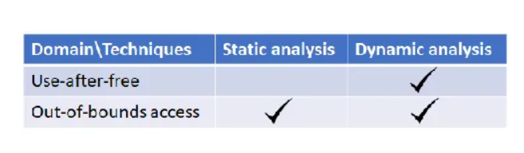

如何在计算机科学研究中寻找灵感：[https://medium.com/digital-diplomacy/how-to-look-for-ideas-in-computer-science-research-7a3fa6f4696f](https://medium.com/digital-diplomacy/how-to-look-for-ideas-in-computer-science-research-7a3fa6f4696f)

# 背景：
身处一个成熟的团队，你的导师不再为学生提供具体的研究思路。相反，他们可能会给出一个非常宏观的方向，并附上几篇相关的论文。你只需要这些就能提出一个研究思路。

# 危机：
要么你设法想出一个好点子去实现它，要么浪费掉博士生涯的前一两年，意识到它毫无进展，最终决定放弃。我读博士期间，目睹了第二种人为主的群体中大约50%的退学率。

# 建议：
## 1.学会阅读论文，培养你的品味
产生新想法最常见的方法之一是阅读其他论文并从中获得灵感。

每周每节课阅读3-4篇论文

为什么一篇论文是好的或坏的？是什么让一篇论文变得有趣？你不必阅读论文的每一个细节来回答这些问题。

找到你最感兴趣的论文类型，并问问自己为什么。找到你最喜欢的论文类型将有助于你培养自己的研究品味，并最终缩小你的范围，形成新的研究思路

我总是会问自己：“这些人是如何发现这些漏洞的？进行这样的研究需要哪些技能？” 

每个人都是独一无二的，你总能找到自己的品味，并据此发展出一条独特的道路。事实上，这正是学术自由的魅力所在！

## 2.识别研究思路的发展模式

实现一个想法如何产生的方法。一旦你掌握了其中的一些模式，想出新的想法将是小菜一碟：

### 模式1：填空
#### 定义：
<!-- 这是一张图片，ocr 内容为： -->

阅读几篇关于某个主题的论文，记下这些论文在假设、系统提供的保证/属性、方法论、技术、数据集等方面的差异，然后画一个表格（不一定是二维的）。寻找空白处，这些空白处就是你可以进行研究的潜在新研究思路（事实上，许多**优秀的论文**都会使用这样的表格或图表来清晰地与相关研究区分开来）。

人们可能已经应用静态分析来自动查找某些类型的漏洞，但还没有人应用动态分析。然后，您可以研究静态分析和动态分析对特定类型漏洞的优缺点。

可以制作一个更细粒度的表格，这将为您提供更多机会识别空白。同样，如果某种类型的漏洞已经被研究过，您就有可能研究不同类型的漏洞。

成功运用此模式的关键在于**绘制出空间中存在的维度**。你研究得越深入，就越有可能找到需要填补的空白。例如，你必须熟悉不同类型的程序分析技术，才能绘制表格并说服自己某种特定技术尚未被尝试用于解决问题。同样，你需要了解不同类型的漏洞（仅内存损坏漏洞类型就有十几种）

#### 做法：
1.广泛阅读，寻找类似主题的论文之间的差异。相信我，当你把这些点串联起来时，总有一天它们会派上用场

2.读综述论文。在网络安全领域，IEEE 安全与隐私会议（顶级会议）每年都会以知识系统化（SoK）的形式接受并发表几篇论文。

### 模式2：扩张
这是“**填空”的自然过程**。正如我提到的，规划出一个空间的几个维度可能是最具挑战性的一步。然而，如果你已经在某个领域有了一些想法（例如，发表了一两篇论文），你就能占据优势，看到其他人不了解的维度。

我们在 USENIX Security 16 上发表的一篇关于强 TCP 侧信道攻击的论文（《**路径外 TCP 漏洞：全局速率限制被视为危险》）**就是受此模式启发而写的。在我们之前的研究（发表于 S&P 2012 和 CCS 2012）中，攻击要求非常高（甚至可以说是不切实际），假设受害者智能手机上已经安装了非特权恶意软件（或者网络中部署了某种类型的防火墙）。自然而然地，我一直在**努力消除这种强要求**，最终**发现了一种全新的侧信道攻击。**本质上，我已经基本勾勒出攻击要求的维度，可以将其**可视化**为 [要求：恶意软件 | 防火墙 | 非]。

我们将侧信道攻击经验从TCP转移到了UDP。漏洞的性质非常相似。实际上，它的方向完全相同，即在Linux内核实现中跨TCP/UDP套接字查找共享资源（即全局变量）。因此，这里的**维度是关于不同类型的网络协议**。

### 模式3：制造锤子并寻找钉子

高层次的想法是，如果你**拥有独特的专业知识、技术、系统**，甚至是**数据集**（<u>其他人无法轻易复制</u>），你就可以利用它，用它来寻找有趣的问题来解决（我们很幸运，计算机科学领域有这么多实际问题）。

:::info
专业壁垒就是锤子，有趣问题就是钉子（行业积累）

:::

密歇根大学的 Peter Chen 教授的团队--虚拟机积累了丰富的专业知识并利用这些知识开发了许多有趣的应用程序。--构建了世界上第一个完整的虚拟机记录和重放功能。

我自己的团队---从2012年的TCP开始，到2020年的UDP和DNS（在S&P、USENIX Security和CCS上发表了7篇论文）。--网络侧信道方面的专业知识---一个竞争相对较少的小领域。以这种方式积累专业知识的好处是，一旦你对某个主题有了深入的了解，就更容易找到新的问题来解决。

加州大学圣塔芭芭拉分校（UCSB）--angr--先进的二进制分析框架专业知识--截至 2020 年 12 月 28 日，已有 540 次引用

构建专业知识、系统或基础设施，直到开始获得收益，可能极其耗时。

通常只有少数几个团队能够主导一个领域

如果你能够找到一个**很多人都需要但目前还没有好的解决方案的东西**，那么它可能值得考虑。

### 模式4：从小事做起，然后推广
一个研究想法往往始于一个小小的观察。经过一番挖掘，你就能知道它是否能发展成一个值得发表的完整想法。**现在需要决定的是：**<u>你应该花多少时间去探究它，以及在放弃之前应该花多少时间去探究。</u>

#### 做下去的信心：
1. 最初的观察结果（无论多么微小）在你**第一次**看到它时是如此**有趣和令人惊讶**。

2. 当你深入挖掘时，你会意识到这种现象**根植**于一些**根本**的**东西**，无法用众所周知的概念轻易解释（例如，导致安全漏洞的新设计缺陷）。

3. 这种观察不太可能是一次性的，例如，背后有更大的空间，还有许多其他**类似的情况**可以调查。

一个具体的例子是我们自己在 CCS 16 上发表的论文“ **Android ION 危害：可定制内存管理系统的诅咒**”。最初，我们研究了通过文件系统暴露给 Android 上任何潜在恶意应用的各种接口。我的学生 Hang **偶然发现了一个看起来很有意思的设备文件**“/dev/ion”。该接口允许任何应用在“预先存在的堆”中分配内存，并将其映射到用户空间。令人惊讶的是，我们发现这些页面返回的不是“清零页面”，而是**之前使用时剩余的数据**（迹象 1）。这是一个潜在的信息泄露安全漏洞。现在，这**本身可能不会直接引发研究项目**，因为它可能被简单地看作是一个众所周知的信息泄露漏洞的又一个实例。然而，当我们**深入挖掘**时，事情开始变得明朗起来。尽管这种漏洞类型并不新鲜，但其**根源比最初看起来的要深得多**（迹象 2）。具体来说，/dev/ion 接口的引入意外地暴露了操作系统内核使用的内部 API 返回的内存。与某些设计用于与用户空间交互的 API（需要清零）不同，出于性能原因，此类内部 API 不会主动将新分配的内存清零。更糟糕的是，不同的 Android 智能手机会定制 /dev/ion 的实现，从而留下更大的调查空间（迹象 3）。

### 模式5：复制先前的工作
先前的模式可能会让您思考：我首先如何进行这些小的观察或发现？好吧，其中一种方法是尝试重现已发表论文的结果。信不信由你，论文中报告的内容可能与您尝试重现时观察到的内容并不完全相同。

背后有几个原因：（1）作者**无意**中犯下的错误，（2）某些结果在设计上**并非 100％ 可重现**，例如，对某些随时间变化的互联网现象的测量。（3）选择的**基准或数据集有偏见**，倾向于论文中提出的方法。如果您能够识别先前工作中的重要差异或局限性，通常意味着还有改进的空间。即使您设法按预期 100％ 重现了工作，也常常会出现论文中未提及的其他见解或附带发现（论文的篇幅有限）。

在这篇论文中，学生们被要求复现CCS 18的论文《**Domain Validation++ For MitM-Resilient PKI**》，其中进行了一项特定的测量，以展示一种攻击方法的广泛适用性。有趣的是，我们论文中进行的**测量结果比报告的结果要负面得多**。这促使我们开发一种新方法，以克服先前研究的局限性。

### 模式6：外部来源：行业、新闻提要等

抓住机会与**业内人士**联系，了解他们的迫切**需求和痛点**。

他们是研究灵感的重要来源。尽管行业比学术界更足智多谋，但在解决技术问题时，行业有着不同的优先级和思维方式。例如，他们对可靠的解决方案更感兴趣，而不太可能投资高风险的解决方案。学术界的好处在于，我们不必一次性 100% 解决问题，而且**学术研究本质上是探索性的**。事实上，从某种意义上说，你可以自行定义成功的指标/门槛。**如果你正在解决行业中尚未出现好的解决方案的****<u>实际问题</u>**，那么“成功”研究项目的门槛就会大大降低

我个人经常利用这种模式，并且非常享受。我将用一个最近的例子来说明这种模式，它与“补丁”有关。你可能会问：**“为什么补丁是一个有趣的研究课题？”**几年前，通过与业内人士的交流，我意识到这仍然是业界的一个大问题，目前还没有真正好的解决方案。Linux 和 Android 内核中的情况如下：当补丁提交到上游 Linux 内核（即主线）时，下游内核分支（例如 Linux LTS、Ubuntu 和 Android）的维护人员需要手动检查这些补丁是否“适用”。如果适用，他们就会将其反向移植。这是一个耗时且容易出错的过程。重要的安全补丁常常因此被遗漏或延迟。更糟糕的是，除了下游内核分支的所有者之外，第三方也很难审计这些补丁并查找缺失的补丁。例如，在 Android 领域，大多数供应商都没有提供其内核源代码的完整历史记录（例如，git 仓库）。这促成了一款自动化工具的开发，该工具可以测试二进制内核中补丁的存在性。该成果发表于 USENIX Security 18 期刊《**精准的二进制补丁存在性测试**》。随后，我们完善了该工具，并在 USENIX Security 21 期刊上发表了另一篇论文《**Android 内核补丁生态系统调查**》，进一步探究了补丁传播缓慢的延迟及其根本原因。事实上，该补丁项目已经为一系列正在酝酿的相关项目打开了大门。

有时候，**关注新闻推送和身边发生的事情也能带来好处！**我从几位经常使用Twitter查看科技新闻的教授那里学到了这一点。我们做的一个有趣的项目就是受此启发（论文发表在CCS 15上，题为《**Android Root及其提供商：一把双刃剑**》）。当时，获取Android手机的Root权限非常流行，这样用户就可以自定义操作系统，解锁一些原本无法实现的新功能。许多“一键Root应用”应运而生，只需单击一下按钮即可自动获取多种手机型号的Root权限。在意识到这些应用实际上是在攻击操作系统内核后，我开始思考：“他们到底有多少不同的漏洞，可以攻击这么多手机？他们是否拥有一些你在互联网上找不到的专有漏洞？攻击者是否有可能窃取这些漏洞并重新利用它们（例如，构建勒索软件）？”事实证明，其中一些**应用程序是由业内顶尖黑客开发的，包含一百多个漏洞**，**只需经过一些工作（逆向工程），就可以拥有它们全部（是的，相当可怕，是吧）。**

### 网络安全研究特有的其他模式：
1. **对抗性研究。**由于安全本质上是对抗性的，因此攻击和防御是一个反复出现的主题。你总是可以尝试打破现有的防御，或者构建一个防御机制来抵御攻击。事实上，我经常看到一篇新颖的攻击论文之后紧接着一篇防御论文（这些论文可能来自同一个团队，也可能不同）。

2. **流程自动化。**许多系统安全分析，例如逆向工程、漏洞发现、错误分类、漏洞利用以及检查补丁是否已应用，一直以来都需要一些人工操作，至少在某些情况下如此。应用程序分析等技术，使此类流程（即使只是部分自动化）自动化，可以带来重要的研究价值。这种模式可能不仅限于网络安全，在系统安全领域也十分常见。

## 3.养成思考 研究思路 的好习惯

+ **要意识到项目的执行与想法的产生和形成有着根本的不同。**不要完全沉浸在正在进行的项目中而将自己与外界隔绝（很多学生都会犯这个错误）。定期阅读一些论文，例如，当会议上发表了一批新的论文时。你**至少可以浏览一下所有论文的标题**。阅读一些听起来有趣的论文的**摘要**。如果它们真的让你感兴趣，就更仔细地阅读（这又回到了你的研究品味）。确保你**搞清楚这些论文中的研究思路**（而不仅仅是技术层面）。
+ **认真对待论文评审**。导师通常会把论文评审任务交给学生，然后与学生讨论这些论文。这是一个学习“香肠是如何制作的”的好机会。通常情况下，你只会阅读那些具有良好创新性和影响力（且文笔优美）的已发表论文。不过，在论文评审期间，**你可以看到被拒的论文，并了解它们为何被认为不合格。**
+ **保持好奇心，并保持开放的心态**，看看你可能感兴趣的论文类型。我的建议是“**广泛阅读**”。在计算机科学的实际领域（例如系统、网络、安全、软件工程），我们正处于一个<u>每个领域都越来越成熟的阶段</u>，许多好的想法都来自于不同领域的交叉。**尽管我的导师当时主要从事网络研究，但我一直在阅读系统和程序分析方面的论文，这在我成为教授后对我帮助很大。**
+ **经常参加读书小组和讲座，并****<u>提出问题</u>****。**如果是讨论密集的会议，例如你自己的研究小组组织的会议，一定要尽量参与。如果你因为缺乏知识或经验而感到畏惧，要知道你的导师正在努力帮助小组里的每个人（尤其是低年级学生），**没有人会嘲笑你问了一个“愚蠢”的问题或类似的东西**。如果你真的没有什么可以问的或想为讨论贡献什么，试着**提前阅读要讨论的论文，以获得优势**。事实上，你当然可以就我们在本文中讨论的内容进行讨论，例如，哪种思维模式促成了论文的构思。一旦你开始这样做一两次，并感受到回报（能够进行良好的讨论），随着时间的推移，你就会越来越得心应手。我非常喜欢的一件事就是就一个想法是否好进行辩论（即使它已经在一个好的会议上发表了）。一些学生扮演攻击者的角色，寻找论文的弱点和局限性，而其他学生则试图为论文辩护。这将让你感受到一个想法的“可辩护性”，就像论文评审的过程一样。
+ 非正式地，**经常和你的实验室同事交流，了解他们，建立良好的关系**。你和同事交流的时间可能比和导师交流的时间要多得多。所以，为什么不努力创造一个美好的体验呢？能够就一个研究课题展开轻松的对话，**就一篇论文进行一些小辩论**，并与他人交流你的想法，感觉真是太好了。营造良好氛围的一个方法是定期与他们交谈，询问他们的项目进展情况，并主动提供你真诚的反馈。他们很可能会回应你，这会让事情进展顺利。除此之外，当你遇到一些障碍时，交流也非常有帮助。与他人交谈可以为你提供新的视角，帮助你走出困境（我自己就从中受益匪浅）。

